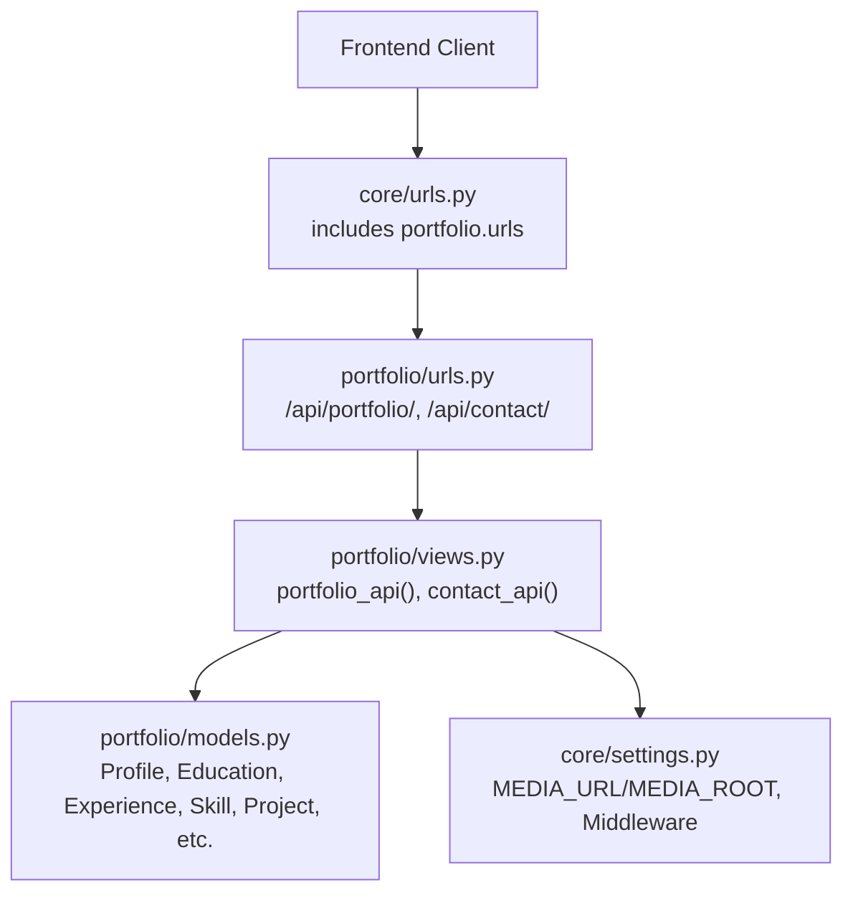
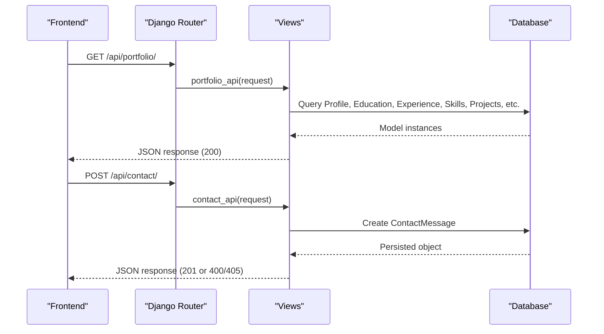
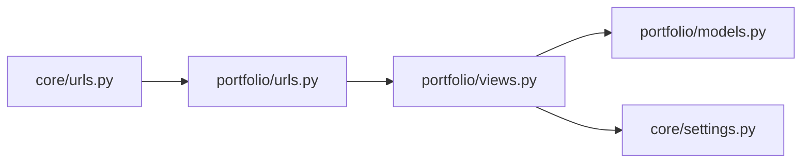

# API Reference

<cite>
**Referenced Files in This Document**
- [urls.py](file://portfolio/urls.py)
- [views.py](file://portfolio/views.py)
- [models.py](file://portfolio/models.py)
- [settings.py](file://core/settings.py)
- [urls.py](file://core/urls.py)
</cite>

## Table of Contents
1. [Introduction](#introduction)
2. [Project Structure](#project-structure)
3. [Core Components](#core-components)
4. [Architecture Overview](#architecture-overview)
5. [Detailed Component Analysis](#detailed-component-analysis)
6. [Dependency Analysis](#dependency-analysis)
7. [Performance Considerations](#performance-considerations)
8. [Troubleshooting Guide](#troubleshooting-guide)
9. [Conclusion](#conclusion)
10. [Appendices](#appendices)

## Introduction
This document provides a complete API reference for the Portfolio CMS RESTful endpoints exposed by the application. It covers:
- GET /api/portfolio/: Returns the full portfolio data as JSON for frontend consumption.
- POST /api/contact/: Accepts contact form submissions and persists them to the database.

It includes request/response schemas, serialization formats, error handling patterns, authentication considerations, CORS configuration notes, rate limiting guidance, client integration examples, security considerations, and debugging approaches.

## Project Structure
The API endpoints are defined under the portfolio app and included via the core URL configuration. The relevant files are:
- URL routing for the API endpoints is declared in the portfolio app’s urls.py.
- The core project’s urls.py includes the portfolio app routes at the root path.
- View logic for both endpoints resides in views.py.
- Data models used by the endpoints are defined in models.py.
- Application settings (including media serving and middleware) are configured in settings.py.

**Diagram sources**
- [urls.py:22-25](file://core/urls.py#L22-L25)
- [urls.py:40-43](file://portfolio/urls.py#L40-L43)
- [views.py:300-322](file://portfolio/views.py#L300-L322)
- [views.py:335-438](file://portfolio/views.py#L335-L438)
- [models.py:4-298](file://portfolio/models.py#L4-L298)
- [settings.py:77-94](file://core/settings.py#L77-L94)

**Section sources**
- [urls.py:22-25](file://core/urls.py#L22-L25)
- [urls.py:40-43](file://portfolio/urls.py#L40-L43)

## Core Components
- Portfolio API endpoint:
  - Provides a single JSON payload containing all public-facing portfolio data.
  - Reads from multiple models (profile, education, experience, skills, projects, certificates, workshops, achievements, services, social links).
- Contact API endpoint:
  - Accepts POST requests with contact form data.
  - Persists messages to the ContactMessage model.
  - Returns success or error responses.

**Section sources**
- [views.py:300-322](file://portfolio/views.py#L300-L322)
- [views.py:335-438](file://portfolio/views.py#L335-L438)
- [models.py:265-275](file://portfolio/models.py#L265-L275)

## Architecture Overview
The API follows a simple Django function-based view pattern:
- Requests arrive via Django’s URL resolver.
- Views query the ORM to build JSON responses or persist incoming data.
- Media files are served according to MEDIA_URL/MEDIA_ROOT configuration.

**Diagram sources**
- [urls.py:40-43](file://portfolio/urls.py#L40-L43)
- [views.py:300-322](file://portfolio/views.py#L300-L322)
- [views.py:335-438](file://portfolio/views.py#L335-L438)

## Detailed Component Analysis

### Endpoint: GET /api/portfolio/
- Purpose: Return complete portfolio data as JSON for frontend rendering.
- Authentication: Not required; publicly accessible.
- Rate Limiting: None implemented in code; consider adding server-side throttling in production.
- Content-Type: application/json.

Request
- Method: GET
- URL: /api/portfolio/
- Headers: None required.

Response
- Success: 200 OK with JSON body containing:
  - personal: name, title, email, bio, philosophy, location, resumeUrl, profileImage
  - socials.links: array of {platform, url, icon}
  - stats: {projects, technologies, certificates, experienceMonths}
  - education: array of {institution, course, duration, percentage, description, logo}
  - experience: array of {company, role, employmentType, duration, location, outcomes, responsibilities, technologies}
  - skills: {categories, data, plus category-keyed maps}
  - certificates: array of {title, issuer, date, image, description, url}
  - workshops: array of {title, organizer, date, description, topic}
  - projects: array of {id, title, tagline, status, category, description, problem, solution, features, github, live, images}
  - achievements: array of {title, description, date}
  - services: array of {title, description, icon}
- Error: 404 Not Found if no Profile exists.

Serialization Notes
- Dates are formatted as month-year strings where applicable.
- Image URLs are absolute paths relative to MEDIA_URL when present.
- Empty or optional fields may be empty strings or arrays.

Example Request
- GET https://your-domain.com/api/portfolio/

Example Response (summary)
- 200 OK
- Body: JSON object with keys personal, socials, stats, education, experience, skills, certificates, workshops, projects, achievements, services.

Error Handling
- If no Profile record exists, returns 404 with an error message.

Client Integration Guidelines
- Fetch on page load and cache as appropriate.
- Handle missing profile gracefully.
- Use provided image URLs directly; ensure your domain serves media files correctly.

Security Considerations
- No authentication required; avoid exposing sensitive data in these fields.
- Validate that uploaded content is sanitized at ingestion time (admin side).

CORS
- No explicit CORS headers are set in the views. Ensure your deployment environment allows cross-origin requests if the frontend is hosted on a different origin.

Rate Limiting
- Not implemented; add server-side rate limiting in production to protect against abuse.

**Section sources**
- [urls.py:41](file://portfolio/urls.py#L41)
- [views.py:335-438](file://portfolio/views.py#L335-L438)
- [models.py:4-298](file://portfolio/models.py#L4-L298)

### Endpoint: POST /api/contact/
- Purpose: Accept contact form submissions and store them in the database.
- Authentication: Not required; publicly accessible.
- CSRF: The view is marked to bypass CSRF checks; see Security section below.
- Rate Limiting: None implemented in code; consider adding throttling.
- Content-Type: application/json.

Request
- Method: POST
- URL: /api/contact/
- Headers: Content-Type: application/json
- Body: JSON object with fields:
  - name: string
  - email: string (email format recommended)
  - subject: string
  - message: string

Response
- Success: 201 Created with JSON body:
  - status: "success"
  - message: "Message sent successfully!"
- Validation/Server Error: 400 Bad Request with JSON body:
  - status: "error"
  - message: error details
- Wrong Method: 405 Method Not Allowed with JSON body:
  - status: "error"
  - message: "Only POST requests allowed"

Example Request
- POST https://your-domain.com/api/contact/
- Body: {"name":"Jane Doe","email":"jane@example.com","subject":"Hello","message":"Nice work!"}

Example Responses
- 201 Created: {"status":"success","message":"Message sent successfully!"}
- 400 Bad Request: {"status":"error","message":"..."}
- 405 Method Not Allowed: {"status":"error","message":"Only POST requests allowed"}

Error Handling
- Any exception during processing returns 400 with the exception message.
- Non-POST methods return 405.

Client Integration Guidelines
- Send JSON with the four required fields.
- Handle 201 as success and show user feedback.
- Handle 400/405 appropriately and display errors.

Security Considerations
- CSRF exemption is enabled for this view; ensure you implement additional protections such as:
  - Input validation/sanitization on the client and server.
  - Rate limiting to prevent spam.
  - CAPTCHA or bot protection.
  - IP-based throttling or token-based submission limits.

CORS
- No explicit CORS headers are set in the view. Configure your web server or middleware to allow cross-origin requests if needed.

Rate Limiting
- Not implemented; add server-side throttling to mitigate abuse.

**Section sources**
- [urls.py:42](file://portfolio/urls.py#L42)
- [views.py:300-322](file://portfolio/views.py#L300-L322)
- [models.py:265-275](file://portfolio/models.py#L265-L275)

## Dependency Analysis
- URL Routing:
  - core/urls.py includes portfolio/urls.py at the root path.
  - portfolio/urls.py defines /api/portfolio/ and /api/contact/.
- Views:
  - portfolio/views.py implements portfolio_api and contact_api.
- Models:
  - portfolio/models.py defines data structures used by the endpoints.
- Settings:
  - core/settings.py configures media serving and middleware stack.

**Diagram sources**
- [urls.py:22-25](file://core/urls.py#L22-L25)
- [urls.py:40-43](file://portfolio/urls.py#L40-L43)
- [views.py:300-322](file://portfolio/views.py#L300-L322)
- [views.py:335-438](file://portfolio/views.py#L335-L438)
- [models.py:4-298](file://portfolio/models.py#L4-L298)
- [settings.py:77-94](file://core/settings.py#L77-L94)

**Section sources**
- [urls.py:22-25](file://core/urls.py#L22-L25)
- [urls.py:40-43](file://portfolio/urls.py#L40-L43)
- [views.py:300-322](file://portfolio/views.py#L300-L322)
- [views.py:335-438](file://portfolio/views.py#L335-L438)
- [models.py:4-298](file://portfolio/models.py#L4-L298)
- [settings.py:77-94](file://core/settings.py#L77-L94)

## Performance Considerations
- Database queries:
  - The portfolio endpoint performs multiple queries across several models. Consider optimizing with select_related/prefetch_related where applicable to reduce N+1 queries.
- Media files:
  - Image URLs are returned; ensure they are served efficiently via a CDN or optimized static/media server.
- Caching:
  - Consider caching the portfolio JSON response for read-heavy scenarios.
- Rate limiting:
  - Add throttling for /api/contact/ to prevent spam and abuse.

[No sources needed since this section provides general guidance]

## Troubleshooting Guide
Common issues and resolutions:
- 404 on /api/portfolio/:
  - Indicates no Profile record exists. Create a Profile via the admin or dashboard before using the API.
- 405 on /api/contact/:
  - Only POST requests are accepted. Ensure your client sends POST with JSON body.
- 400 on /api/contact/:
  - An exception occurred while processing the request. Check logs for details and validate input fields.
- Media URLs not loading:
  - Verify MEDIA_URL and MEDIA_ROOT settings and that media files are served in development/debug mode or via a proper media server in production.
- CORS errors:
  - If the frontend is on a different origin, configure CORS at the web server or via middleware to allow requests from your frontend domain.

**Section sources**
- [views.py:300-322](file://portfolio/views.py#L300-L322)
- [views.py:335-438](file://portfolio/views.py#L335-L438)
- [settings.py:77-94](file://core/settings.py#L77-L94)

## Conclusion
The Portfolio CMS exposes two key APIs:
- GET /api/portfolio/: A comprehensive JSON feed of portfolio data for frontend rendering.
- POST /api/contact/: A simple endpoint to accept and store contact form submissions.

For production deployments, implement authentication/authorization where appropriate, enable CORS explicitly, add rate limiting, and secure the CSRF-exempt contact endpoint with additional protections. Optimize database queries and serve media efficiently for best performance.

[No sources needed since this section summarizes without analyzing specific files]

## Appendices

### HTTP Methods, URL Patterns, and Status Codes Summary
- GET /api/portfolio/
  - 200 OK: JSON payload with portfolio data
  - 404 Not Found: Profile not configured
- POST /api/contact/
  - 201 Created: Message persisted successfully
  - 400 Bad Request: Processing error
  - 405 Method Not Allowed: Non-POST method

**Section sources**
- [urls.py:40-43](file://portfolio/urls.py#L40-L43)
- [views.py:300-322](file://portfolio/views.py#L300-L322)
- [views.py:335-438](file://portfolio/views.py#L335-L438)

### Data Models Used by the Endpoints
- Profile: Personal information and media references
- Education, Experience, Skill, Project, Certificate, Workshop, Achievement, Service, SocialLink, ContactMessage: Various content entities queried or created by the endpoints

**Section sources**
- [models.py:4-298](file://portfolio/models.py#L4-L298)

### Configuration Notes
- Media serving:
  - MEDIA_URL and MEDIA_ROOT are configured; ensure proper setup in production.
- Middleware:
  - Standard Django middleware stack is active; no custom CORS middleware is present in the provided settings.

**Section sources**
- [settings.py:77-94](file://core/settings.py#L77-L94)