# Admin Dashboard

<cite>
**Referenced Files in This Document**
- [views.py](file://portfolio/views.py)
- [models.py](file://portfolio/models.py)
- [forms.py](file://portfolio/forms.py)
- [forms_extended.py](file://portfolio/forms_extended.py)
- [urls.py](file://portfolio/urls.py)
- [dashboard_extras.py](file://portfolio/templatetags/dashboard_extras.py)
- [base.html](file://templates/dashboard/base.html)
- [home.html](file://templates/dashboard/home.html)
- [profile.html](file://templates/dashboard/profile.html)
- [messages.html](file://templates/dashboard/messages.html)
- [settings.html](file://templates/dashboard/settings.html)
- [generic_form.html](file://templates/dashboard/generic_form.html)
- [generic_list.html](file://templates/dashboard/generic_list.html)
- [_form_fields.html](file://templates/dashboard/_form_fields.html)
- [dashboard.css](file://static/dashboard.css)
</cite>

## Table of Contents
1. [Introduction](#introduction)
2. [Project Structure](#project-structure)
3. [Core Components](#core-components)
4. [Architecture Overview](#architecture-overview)
5. [Detailed Component Analysis](#detailed-component-analysis)
6. [Dependency Analysis](#dependency-analysis)
7. [Performance Considerations](#performance-considerations)
8. [Troubleshooting Guide](#troubleshooting-guide)
9. [Conclusion](#conclusion)

## Introduction
This document explains the admin dashboard interface for a Django-based portfolio CMS. It covers:
- Dashboard overview with live statistics and quick navigation
- Profile management including personal information editing and avatar upload
- A generic CRUD system that powers 15+ content modules with minimal code duplication
- Message inbox for viewing, filtering, marking read/unread, and deleting contact messages
- Settings management for SEO configuration and site-wide options
- Theme switching between light and dark modes
- Template inheritance structure and reusable components for forms and list displays
- Authentication decorators protecting admin routes
- User workflows and customization options

## Project Structure
The admin dashboard is implemented as a Django application with:
- Views handling authentication, dashboard pages, generic CRUD operations, message management, settings, and public APIs
- Models defining entities such as Profile, Education, Experience, Skills, Projects, Certificates, Workshops, Achievements, Services, Technologies, Statistics, Social Links, Resume, ContactMessage, and SiteSettings
- Forms mapping to models for profile, hero roles, and site settings, plus extended forms for all content types
- URL routing for public pages, admin login/logout, dashboard views, content modules, messages, and APIs
- Templates under templates/dashboard providing base layout, dashboard home, profile, messages, settings, and reusable generic list/form templates
- A custom template tag helper for widget type detection used by form rendering
- Static assets for styling and theme behavior

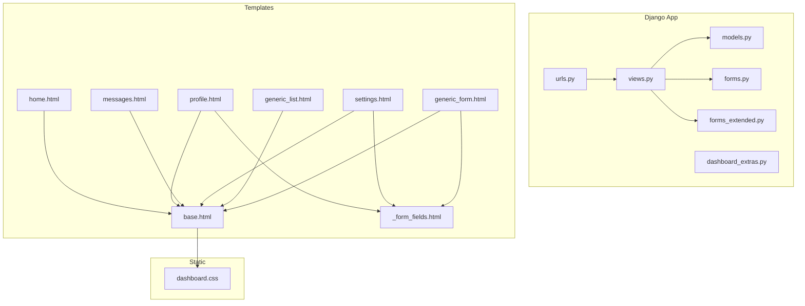

**Diagram sources**
- [urls.py:1-44](file://portfolio/urls.py#L1-L44)
- [views.py:1-439](file://portfolio/views.py#L1-L439)
- [models.py:1-298](file://portfolio/models.py#L1-L298)
- [forms.py:1-22](file://portfolio/forms.py#L1-L22)
- [forms_extended.py:1-78](file://portfolio/forms_extended.py#L1-L78)
- [dashboard_extras.py:1-13](file://portfolio/templatetags/dashboard_extras.py#L1-L13)
- [base.html:1-188](file://templates/dashboard/base.html#L1-L188)
- [home.html:1-134](file://templates/dashboard/home.html#L1-L134)
- [profile.html:1-37](file://templates/dashboard/profile.html#L1-L37)
- [messages.html:1-69](file://templates/dashboard/messages.html#L1-L69)
- [settings.html:1-31](file://templates/dashboard/settings.html#L1-L31)
- [generic_list.html:1-81](file://templates/dashboard/generic_list.html#L1-L81)
- [generic_form.html:1-63](file://templates/dashboard/generic_form.html#L1-L63)
- [_form_fields.html:1-25](file://templates/dashboard/_form_fields.html#L1-L25)
- [dashboard.css:1-200](file://static/dashboard.css#L1-L200)

**Section sources**
- [urls.py:1-44](file://portfolio/urls.py#L1-L44)
- [views.py:1-439](file://portfolio/views.py#L1-L439)
- [models.py:1-298](file://portfolio/models.py#L1-L298)
- [forms.py:1-22](file://portfolio/forms.py#L1-L22)
- [forms_extended.py:1-78](file://portfolio/forms_extended.py#L1-L78)
- [dashboard_extras.py:1-13](file://portfolio/templatetags/dashboard_extras.py#L1-L13)
- [base.html:1-188](file://templates/dashboard/base.html#L1-L188)
- [home.html:1-134](file://templates/dashboard/home.html#L1-L134)
- [profile.html:1-37](file://templates/dashboard/profile.html#L1-L37)
- [messages.html:1-69](file://templates/dashboard/messages.html#L1-L69)
- [settings.html:1-31](file://templates/dashboard/settings.html#L1-L31)
- [generic_list.html:1-81](file://templates/dashboard/generic_list.html#L1-L81)
- [generic_form.html:1-63](file://templates/dashboard/generic_form.html#L1-L63)
- [_form_fields.html:1-25](file://templates/dashboard/_form_fields.html#L1-L25)
- [dashboard.css:1-200](file://static/dashboard.css#L1-L200)

## Core Components
- Authentication and session control
  - Login view creates or retrieves an admin user and logs them in; logout clears the session
  - All dashboard endpoints are protected with a login decorator
- Dashboard overview
  - Displays live metrics (projects, certificates, skills, unread messages, achievements)
  - Provides quick links to common actions and recent messages
- Profile management
  - Editable personal details and avatar upload via a dedicated form
- Generic CRUD system
  - Centralized function handles list, add, edit, and delete flows for multiple content types
  - Reusable templates render consistent lists and forms across modules
- Messages inbox
  - View, filter (all/unread/read), toggle read status, mark all read, and delete messages
- Settings management
  - Configure SEO metadata, social sharing images, footer text, and other site-wide options
- Theme switching
  - Light/dark mode persisted in local storage and applied before first paint

**Section sources**
- [views.py:28-56](file://portfolio/views.py#L28-L56)
- [views.py:58-83](file://portfolio/views.py#L58-L83)
- [views.py:85-117](file://portfolio/views.py#L85-L117)
- [views.py:126-207](file://portfolio/views.py#L126-L207)
- [views.py:240-249](file://portfolio/views.py#L240-L249)
- [views.py:255-295](file://portfolio/views.py#L255-L295)
- [views.py:209-221](file://portfolio/views.py#L209-L221)
- [base.html:8-16](file://templates/dashboard/base.html#L8-L16)
- [base.html:140-152](file://templates/dashboard/base.html#L140-L152)

## Architecture Overview
The dashboard follows a layered architecture:
- URLs route requests to view functions
- Views enforce authentication, interact with models, and render templates
- Templates extend a shared base layout and reuse generic list/form components
- Static assets provide styling and theme behavior

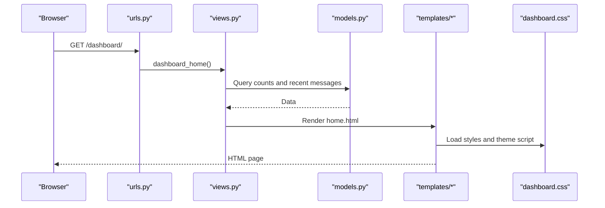

**Diagram sources**
- [urls.py:12-13](file://portfolio/urls.py#L12-L13)
- [views.py:58-83](file://portfolio/views.py#L58-L83)
- [models.py:1-298](file://portfolio/models.py#L1-L298)
- [home.html:1-134](file://templates/dashboard/home.html#L1-L134)
- [base.html:1-188](file://templates/dashboard/base.html#L1-L188)
- [dashboard.css:1-200](file://static/dashboard.css#L1-L200)

## Detailed Component Analysis

### Dashboard Overview
- Displays key metrics and module tiles
- Quick actions link directly to add/edit flows
- Recent messages preview with links to full inbox

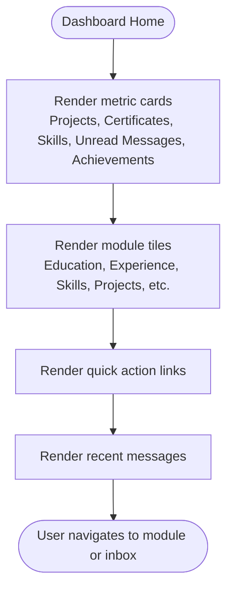

**Diagram sources**
- [home.html:17-59](file://templates/dashboard/home.html#L17-L59)
- [home.html:61-99](file://templates/dashboard/home.html#L61-L99)
- [home.html:101-131](file://templates/dashboard/home.html#L101-L131)
- [views.py:58-83](file://portfolio/views.py#L58-L83)

**Section sources**
- [home.html:1-134](file://templates/dashboard/home.html#L1-L134)
- [views.py:58-83](file://portfolio/views.py#L58-L83)

### Profile Management
- Editable fields include name, title, bio, philosophy, location, email, phone, availability, and current status
- Avatar upload supported via image field
- Uses a dedicated form and reusable form fields partial

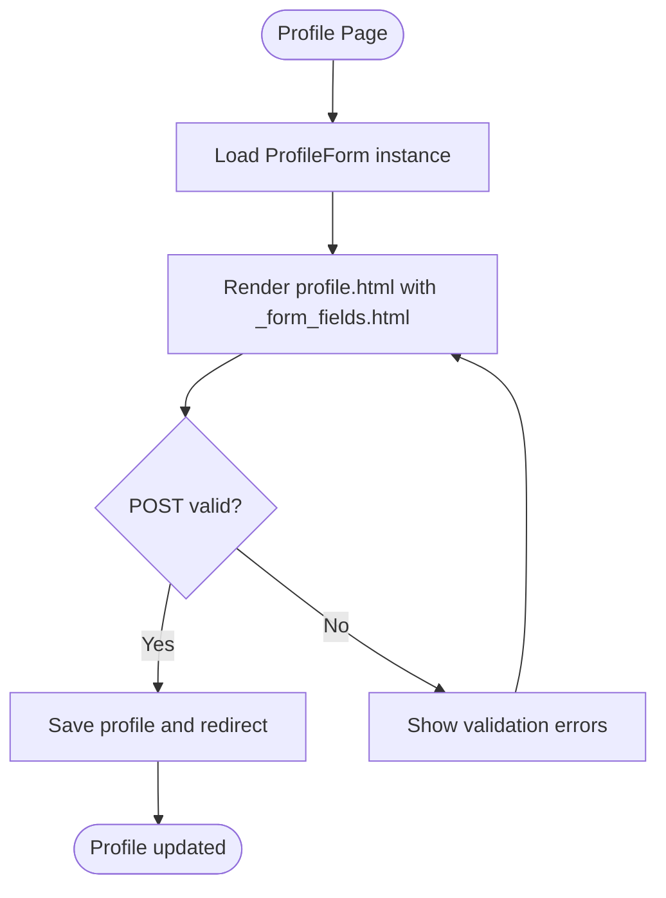

**Diagram sources**
- [profile.html:13-36](file://templates/dashboard/profile.html#L13-L36)
- [_form_fields.html:1-25](file://templates/dashboard/_form_fields.html#L1-L25)
- [forms.py:4-11](file://portfolio/forms.py#L4-L11)
- [views.py:85-97](file://portfolio/views.py#L85-L97)

**Section sources**
- [profile.html:1-37](file://templates/dashboard/profile.html#L1-L37)
- [_form_fields.html:1-25](file://templates/dashboard/_form_fields.html#L1-L25)
- [forms.py:1-22](file://portfolio/forms.py#L1-L22)
- [views.py:85-97](file://portfolio/views.py#L85-L97)

### Generic CRUD System
- Central function handles:
  - List view with optional ordering column
  - Add flow with form validation and success messaging
  - Edit flow with prepopulated form and updates
  - Delete via a centralized endpoint mapped by model name
- Each content module has a thin wrapper view delegating to the generic function

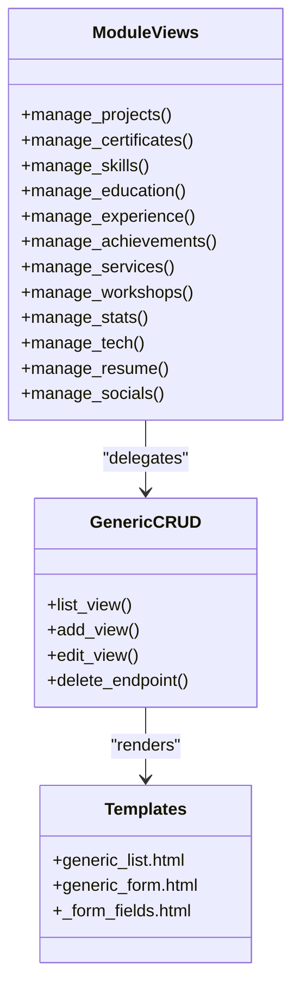

**Diagram sources**
- [views.py:126-207](file://portfolio/views.py#L126-L207)
- [views.py:240-249](file://portfolio/views.py#L240-L249)
- [generic_list.html:1-81](file://templates/dashboard/generic_list.html#L1-L81)
- [generic_form.html:1-63](file://templates/dashboard/generic_form.html#L1-L63)
- [_form_fields.html:1-25](file://templates/dashboard/_form_fields.html#L1-L25)

**Section sources**
- [views.py:126-207](file://portfolio/views.py#L126-L207)
- [views.py:240-249](file://portfolio/views.py#L240-L249)
- [generic_list.html:1-81](file://templates/dashboard/generic_list.html#L1-L81)
- [generic_form.html:1-63](file://templates/dashboard/generic_form.html#L1-L63)
- [_form_fields.html:1-25](file://templates/dashboard/_form_fields.html#L1-L25)

### Message Inbox
- Supports filtering by all/unread/read
- Actions include toggling read status, marking all read, replying via mailto, and deleting messages

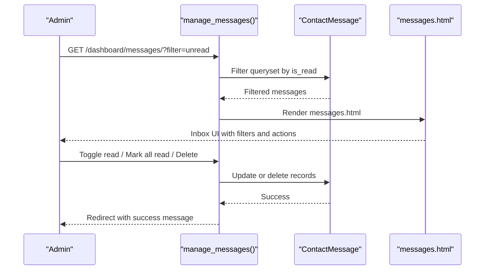

**Diagram sources**
- [views.py:255-295](file://portfolio/views.py#L255-L295)
- [messages.html:15-68](file://templates/dashboard/messages.html#L15-L68)
- [models.py:265-275](file://portfolio/models.py#L265-L275)

**Section sources**
- [views.py:255-295](file://portfolio/views.py#L255-L295)
- [messages.html:1-69](file://templates/dashboard/messages.html#L1-L69)
- [models.py:265-275](file://portfolio/models.py#L265-L275)

### Settings Management
- Configures SEO metadata, social sharing images, footer text, copyright, and more
- Uses a dedicated form bound to SiteSettings model

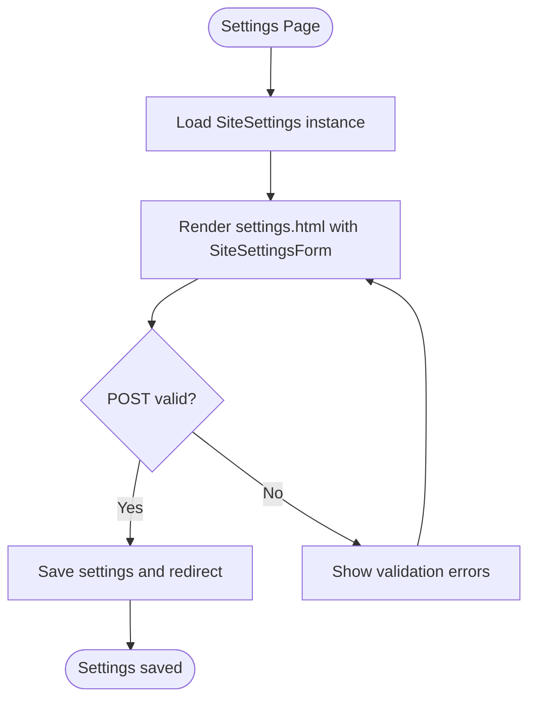

**Diagram sources**
- [settings.html:7-30](file://templates/dashboard/settings.html#L7-L30)
- [forms.py:18-22](file://portfolio/forms.py#L18-L22)
- [views.py:209-221](file://portfolio/views.py#L209-L221)
- [models.py:277-297](file://portfolio/models.py#L277-L297)

**Section sources**
- [settings.html:1-31](file://templates/dashboard/settings.html#L1-L31)
- [forms.py:18-22](file://portfolio/forms.py#L18-L22)
- [views.py:209-221](file://portfolio/views.py#L209-L221)
- [models.py:277-297](file://portfolio/models.py#L277-L297)

### Template Inheritance and Reusable Components
- Base template provides sidebar navigation, topbar actions, theme toggle, quick jump search, toast notifications, and content blocks
- Generic list and form templates standardize CRUD experiences
- Form fields partial renders consistent input groups, labels, help text, and error messages
- Custom template tag detects widget types to adjust layout

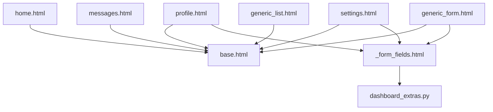

**Diagram sources**
- [base.html:1-188](file://templates/dashboard/base.html#L1-L188)
- [home.html:1-134](file://templates/dashboard/home.html#L1-L134)
- [profile.html:1-37](file://templates/dashboard/profile.html#L1-L37)
- [messages.html:1-69](file://templates/dashboard/messages.html#L1-L69)
- [settings.html:1-31](file://templates/dashboard/settings.html#L1-L31)
- [generic_list.html:1-81](file://templates/dashboard/generic_list.html#L1-L81)
- [generic_form.html:1-63](file://templates/dashboard/generic_form.html#L1-L63)
- [_form_fields.html:1-25](file://templates/dashboard/_form_fields.html#L1-L25)
- [dashboard_extras.py:1-13](file://portfolio/templatetags/dashboard_extras.py#L1-L13)

**Section sources**
- [base.html:1-188](file://templates/dashboard/base.html#L1-L188)
- [generic_list.html:1-81](file://templates/dashboard/generic_list.html#L1-L81)
- [generic_form.html:1-63](file://templates/dashboard/generic_form.html#L1-L63)
- [_form_fields.html:1-25](file://templates/dashboard/_form_fields.html#L1-L25)
- [dashboard_extras.py:1-13](file://portfolio/templatetags/dashboard_extras.py#L1-L13)

### Authentication and Route Protection
- Login view authenticates against hardcoded credentials and logs in a staff/superuser account
- Logout clears the session and redirects to login
- All dashboard and content module views use a login decorator to protect access

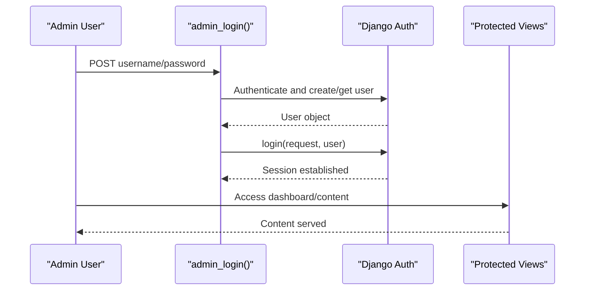

**Diagram sources**
- [views.py:28-56](file://portfolio/views.py#L28-L56)
- [views.py:58-83](file://portfolio/views.py#L58-L83)
- [views.py:184-207](file://portfolio/views.py#L184-L207)

**Section sources**
- [views.py:28-56](file://portfolio/views.py#L28-L56)
- [views.py:58-83](file://portfolio/views.py#L58-L83)
- [views.py:184-207](file://portfolio/views.py#L184-L207)

### Theme Switching Functionality
- Base template includes a small script that reads a stored theme preference and applies it before first paint
- Topbar contains a theme toggle button to switch between light and dark themes
- Styles define CSS variables for both themes

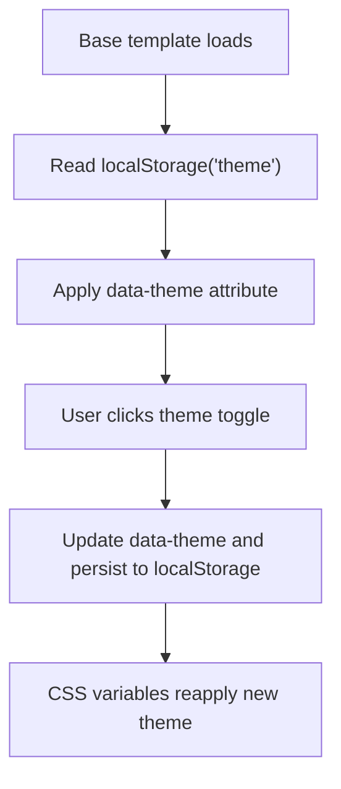

**Diagram sources**
- [base.html:8-16](file://templates/dashboard/base.html#L8-L16)
- [base.html:140-152](file://templates/dashboard/base.html#L140-L152)
- [dashboard.css:6-54](file://static/dashboard.css#L6-L54)

**Section sources**
- [base.html:8-16](file://templates/dashboard/base.html#L8-L16)
- [base.html:140-152](file://templates/dashboard/base.html#L140-L152)
- [dashboard.css:6-54](file://static/dashboard.css#L6-L54)

## Dependency Analysis
- URL routing maps to view functions which depend on models and forms
- Views render templates that extend base layout and reuse generic components
- Static assets provide styling and theme behavior

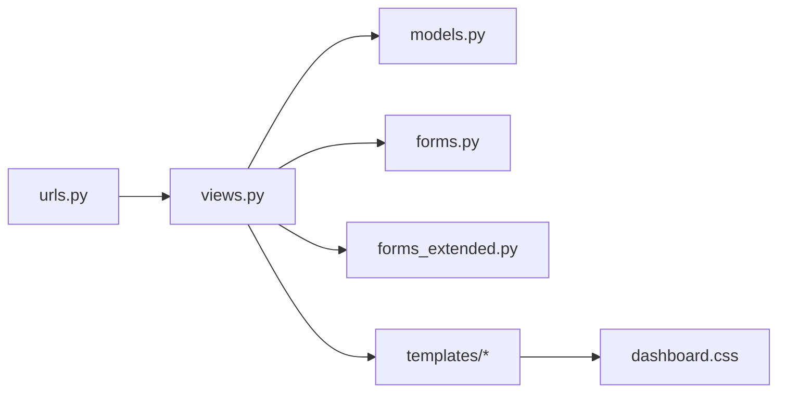

**Diagram sources**
- [urls.py:1-44](file://portfolio/urls.py#L1-L44)
- [views.py:1-439](file://portfolio/views.py#L1-L439)
- [models.py:1-298](file://portfolio/models.py#L1-L298)
- [forms.py:1-22](file://portfolio/forms.py#L1-L22)
- [forms_extended.py:1-78](file://portfolio/forms_extended.py#L1-L78)
- [dashboard.css:1-200](file://static/dashboard.css#L1-L200)

**Section sources**
- [urls.py:1-44](file://portfolio/urls.py#L1-L44)
- [views.py:1-439](file://portfolio/views.py#L1-L439)
- [models.py:1-298](file://portfolio/models.py#L1-L298)
- [forms.py:1-22](file://portfolio/forms.py#L1-L22)
- [forms_extended.py:1-78](file://portfolio/forms_extended.py#L1-L78)
- [dashboard.css:1-200](file://static/dashboard.css#L1-L200)

## Performance Considerations
- Use select_related and prefetch_related where relationships are traversed to reduce query count
- Avoid heavy computations in views; prefer database-level filtering and aggregation
- Cache frequently accessed settings and counts if traffic increases
- Optimize image uploads with appropriate sizing and compression
- Keep generic CRUD logic efficient by leveraging model Meta ordering and avoiding unnecessary queries

[No sources needed since this section provides general guidance]

## Troubleshooting Guide
- Authentication issues
  - Ensure the admin login credentials match the expected values
  - Verify that the user is created and marked as staff/superuser during login
- Validation errors
  - Check form fields for required inputs and file uploads
  - Review non-field errors and per-field error messages rendered by templates
- Missing files or paths
  - Confirm static assets are correctly served and referenced
  - Validate media file paths for uploaded images and documents
- Message inbox not updating
  - Ensure message state changes are saved and redirects occur after actions
- Settings not saving
  - Verify SiteSettings instance exists and form binds correctly

**Section sources**
- [views.py:28-56](file://portfolio/views.py#L28-L56)
- [generic_form.html:17-22](file://templates/dashboard/generic_form.html#L17-L22)
- [_form_fields.html:19-21](file://templates/dashboard/_form_fields.html#L19-L21)
- [messages.html:44-52](file://templates/dashboard/messages.html#L44-L52)
- [settings.html:10-14](file://templates/dashboard/settings.html#L10-L14)

## Conclusion
The admin dashboard provides a cohesive, secure, and extensible interface for managing portfolio content. Its generic CRUD pattern significantly reduces duplication across modules, while reusable templates and a strong base layout ensure consistency. The message inbox and settings management complete the administrative experience, and theme switching enhances usability. With clear authentication guards and modular design, the system scales well for additional content types and features.

[No sources needed since this section summarizes without analyzing specific files]