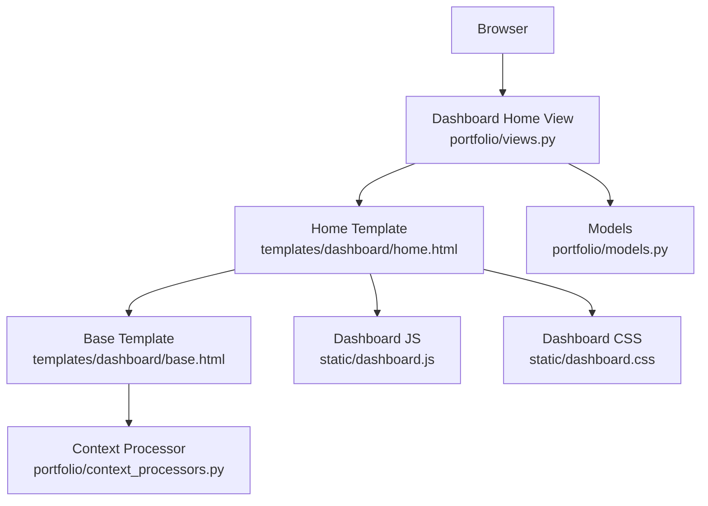
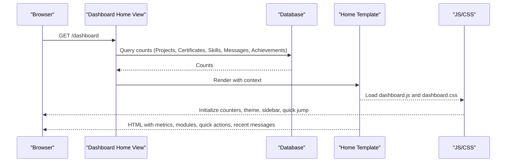
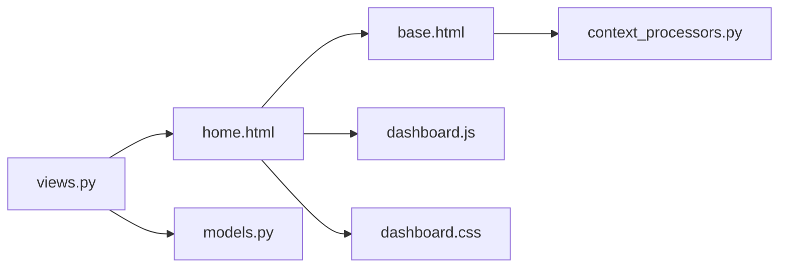

# Dashboard Overview

<cite>
**Referenced Files in This Document**
- [views.py](file://portfolio/views.py)
- [home.html](file://templates/dashboard/home.html)
- [base.html](file://templates/dashboard/base.html)
- [dashboard.js](file://static/dashboard.js)
- [dashboard.css](file://static/dashboard.css)
- [models.py](file://portfolio/models.py)
- [context_processors.py](file://portfolio/context_processors.py)
</cite>

## Table of Contents
1. [Introduction](#introduction)
2. [Project Structure](#project-structure)
3. [Core Components](#core-components)
4. [Architecture Overview](#architecture-overview)
5. [Detailed Component Analysis](#detailed-component-analysis)
6. [Dependency Analysis](#dependency-analysis)
7. [Performance Considerations](#performance-considerations)
8. [Troubleshooting Guide](#troubleshooting-guide)
9. [Conclusion](#conclusion)
10. [Appendices](#appendices)

## Introduction
This document explains the dashboard overview interface used by administrators to manage portfolio content and monitor key metrics. It covers:
- Statistics display showing portfolio metrics and counters
- Quick navigation cards to different content modules
- Recent activity feed (recent messages)
- Performance indicators and quick actions
- How the dashboard aggregates data from models, displays real-time statistics, and provides shortcuts to frequently used admin functions
- Examples for customizing the dashboard layout, adding new statistics widgets, and configuring which metrics are displayed

The dashboard is a Django application with server-side rendering for initial data and client-side enhancements for interactivity and animations.

## Project Structure
The dashboard overview is implemented across views, templates, static assets, and models:
- Views compute counts and context for the dashboard page
- The home template renders metric cards, module tiles, quick actions, and recent messages
- Base template provides sidebar navigation, topbar, theme toggle, and global UI components
- JavaScript enhances counters, theme switching, sidebar behavior, and quick jump search
- CSS defines the modern design system and responsive layout
- Models define the data entities that drive the dashboard metrics

**Diagram sources**
- [views.py:58-83](file://portfolio/views.py#L58-L83)
- [home.html:1-134](file://templates/dashboard/home.html#L1-L134)
- [base.html:1-188](file://templates/dashboard/base.html#L1-L188)
- [dashboard.js:1-287](file://static/dashboard.js#L1-L287)
- [dashboard.css:1-800](file://static/dashboard.css#L1-L800)
- [models.py:1-298](file://portfolio/models.py#L1-L298)
- [context_processors.py:1-9](file://portfolio/context_processors.py#L1-L9)

**Section sources**
- [views.py:58-83](file://portfolio/views.py#L58-L83)
- [home.html:1-134](file://templates/dashboard/home.html#L1-L134)
- [base.html:1-188](file://templates/dashboard/base.html#L1-L188)
- [dashboard.js:1-287](file://static/dashboard.js#L1-L287)
- [dashboard.css:1-800](file://static/dashboard.css#L1-L800)
- [models.py:1-298](file://portfolio/models.py#L1-L298)
- [context_processors.py:1-9](file://portfolio/context_processors.py#L1-L9)

## Core Components
- Dashboard Home View: Computes module counts, aggregate metrics, and recent messages; passes them to the template.
- Home Template: Renders metric cards with animated counters, module overview grid, quick action links, and recent message list.
- Base Template: Provides sidebar navigation, topbar with quick jump search, theme toggle, toast notifications, and global unread badge.
- JavaScript Engine: Initializes theme, sidebar, toasts, animated counters, table search, confirm dialogs, password toggles, quick jump command palette, and current year footer.
- CSS Design System: Defines variables, layout grids, card styles, metric cards, module tiles, quick links, tables, pills, and responsive behaviors.
- Models: Define entities such as Project, Certificate, Skill, ContactMessage, Statistic, etc., which drive the dashboard metrics and module counts.
- Context Processor: Exposes unread message count globally to all dashboard templates.

Key responsibilities:
- Data aggregation: Count records per model and filter unread messages.
- Real-time feel: Animate counters on load and provide interactive UI elements.
- Navigation: Provide quick access to all management pages via sidebar and quick jump.
- Customization: Allow extending metrics, modules, and quick actions through templates and views.

**Section sources**
- [views.py:58-83](file://portfolio/views.py#L58-L83)
- [home.html:1-134](file://templates/dashboard/home.html#L1-L134)
- [base.html:1-188](file://templates/dashboard/base.html#L1-L188)
- [dashboard.js:1-287](file://static/dashboard.js#L1-L287)
- [dashboard.css:1-800](file://static/dashboard.css#L1-L800)
- [models.py:1-298](file://portfolio/models.py#L1-L298)
- [context_processors.py:1-9](file://portfolio/context_processors.py#L1-L9)

## Architecture Overview
The dashboard follows a standard Django request-response pattern with client-side enhancements:
- The browser requests the dashboard home URL.
- The view computes counts and context, then renders the home template.
- The base template supplies shared UI and navigation.
- Static assets enhance the user experience with animations and interactions.

**Diagram sources**
- [views.py:58-83](file://portfolio/views.py#L58-L83)
- [home.html:1-134](file://templates/dashboard/home.html#L1-L134)
- [base.html:1-188](file://templates/dashboard/base.html#L1-L188)
- [dashboard.js:1-287](file://static/dashboard.js#L1-L287)
- [dashboard.css:1-800](file://static/dashboard.css#L1-L800)

## Detailed Component Analysis

### Dashboard Home View
Responsibilities:
- Build a modules list with names, counts, URLs, and icons for each content area.
- Compute aggregate metrics: project count, certificate count, skill count, unread message count, achievement count.
- Retrieve recent messages ordered by creation time.
- Pass context to the home template.

Data flow:
- Queries multiple models to get counts.
- Orders and slices recent messages.
- Returns rendered template with context.

Customization points:
- Add or remove modules by editing the modules list.
- Extend metrics by adding new counts and passing them to the template.
- Adjust recent messages query to include more fields or filters.

**Section sources**
- [views.py:58-83](file://portfolio/views.py#L58-L83)

### Home Template
Responsibilities:
- Display live metrics using animated counters bound to data attributes.
- Show content overview grid with module tiles linking to management pages.
- Provide quick action links for common tasks like adding projects, certificates, skills, education, hero roles, updating profile, uploading resume, and SEO settings.
- Render recent messages with sender details, subject, truncated body, and read/unread state.

Real-time statistics:
- Counters animate from zero to target values set by data-counter attributes.
- Unread message count appears both in the metric card and topbar badge.

Layout:
- Metric cards arranged in a responsive grid.
- Two-column layout for content overview and quick actions/recent messages.
- Module tiles use CSS animation delays for staggered entrance.

Customization examples:
- Add a new metric card by inserting a db-card block with a data-counter attribute and linking to a management page.
- Add a new module tile by extending the modules list in the view.
- Add a new quick action link by appending an anchor element in the quick actions section.
- Configure which metrics are displayed by modifying the context passed from the view.

**Section sources**
- [home.html:1-134](file://templates/dashboard/home.html#L1-L134)

### Base Template
Responsibilities:
- Provide global structure: sidebar, topbar, main content area, toast container.
- Include Font Awesome and Google Fonts.
- Persist theme preference in localStorage.
- Render unread message badge in sidebar and topbar using context processor variable.
- Offer quick jump input for fast navigation between modules.

Interactions:
- Sidebar collapse/expand persisted in localStorage.
- Theme toggle switches between light and dark themes.
- Toasts auto-dismiss after a timeout.

Global context:
- Unread message count exposed via context processor.

**Section sources**
- [base.html:1-188](file://templates/dashboard/base.html#L1-L188)
- [context_processors.py:1-9](file://portfolio/context_processors.py#L1-L9)

### JavaScript Engine
Responsibilities:
- Initialize theme toggle and persist selection.
- Manage sidebar drawer and collapse state.
- Auto-dismiss toasts with animations.
- Animate counters based on data-counter attributes.
- Implement table search for filtering rows.
- Provide confirmation dialogs for destructive actions.
- Toggle password visibility on login forms.
- Implement quick jump command palette with keyboard navigation.
- Update footer year dynamically.

Counter animation:
- Reads target value from data-counter.
- Uses requestAnimationFrame with easeOutCubic easing.
- Formats numbers with locale-aware separators.

Quick jump:
- Scans sidebar nav links to build searchable items.
- Supports arrow keys, Enter to open, Escape to close.
- Focuses input when pressing “/”.

**Section sources**
- [dashboard.js:1-287](file://static/dashboard.js#L1-L287)

### CSS Design System
Responsibilities:
- Define CSS variables for colors, typography, spacing, shadows, and layout dimensions.
- Provide responsive grid layouts for metrics and modules.
- Style metric cards with accent colors and hover effects.
- Style module tiles with staggered animations.
- Style quick action links with dashed borders and hover states.
- Provide table styling, pill badges, and row actions.
- Ensure accessibility with focus-visible outlines and aria attributes.

Key classes:
- Grid containers: db-grid, db-grid-metrics, db-grid-2col
- Cards: db-card, db-card-head, db-card-body
- Metrics: db-metric, db-metric-icon, db-metric-value, db-metric-label, db-metric-trend
- Modules: db-modules-grid, db-module-tile
- Quick actions: db-quick-grid, db-quick-link
- Tables: db-table-wrap, db-table-toolbar, db-table-count
- Pills: db-pill variants
- Buttons: db-btn variants

**Section sources**
- [dashboard.css:1-800](file://static/dashboard.css#L1-L800)

### Models
Responsibilities:
- Define entities that drive dashboard metrics and module counts.
- Support ordering and visibility flags for controlled display.

Relevant models:
- Project: drives project count metric and project management module.
- Certificate: drives certificate count metric and certificate management module.
- Skill: drives skill count metric and skill management module.
- ContactMessage: drives unread message count and recent messages feed.
- Achievement: drives achievement count metric and achievement management module.
- Education, Experience, Workshop, Service, Technology, SocialLink, Resume, Statistic: support module counts and public API data.

**Section sources**
- [models.py:1-298](file://portfolio/models.py#L1-L298)

## Dependency Analysis
The dashboard depends on:
- Django views for data aggregation and rendering
- Templates for presentation
- Static assets for interactivity and styling
- Models for data persistence and querying
- Context processors for global variables

**Diagram sources**
- [views.py:58-83](file://portfolio/views.py#L58-L83)
- [home.html:1-134](file://templates/dashboard/home.html#L1-L134)
- [base.html:1-188](file://templates/dashboard/base.html#L1-L188)
- [dashboard.js:1-287](file://static/dashboard.js#L1-L287)
- [dashboard.css:1-800](file://static/dashboard.css#L1-L800)
- [models.py:1-298](file://portfolio/models.py#L1-L298)
- [context_processors.py:1-9](file://portfolio/context_processors.py#L1-L9)

**Section sources**
- [views.py:58-83](file://portfolio/views.py#L58-L83)
- [home.html:1-134](file://templates/dashboard/home.html#L1-L134)
- [base.html:1-188](file://templates/dashboard/base.html#L1-L188)
- [dashboard.js:1-287](file://static/dashboard.js#L1-L287)
- [dashboard.css:1-800](file://static/dashboard.css#L1-L800)
- [models.py:1-298](file://portfolio/models.py#L1-L298)
- [context_processors.py:1-9](file://portfolio/context_processors.py#L1-L9)

## Performance Considerations
- Database queries: The dashboard performs multiple COUNT queries and one ordered slice for recent messages. Consider caching frequent counts if traffic increases.
- Counter animations: Use requestAnimationFrame for smooth animations; avoid heavy computations inside the animation loop.
- Asset loading: Ensure dashboard.js and dashboard.css are minified and cached for performance.
- Responsive layout: CSS grid adapts to screen sizes; test on mobile devices to ensure usability.
- Accessibility: Maintain focus-visible outlines and ARIA attributes for better UX.

[No sources needed since this section provides general guidance]

## Troubleshooting Guide
Common issues and resolutions:
- Counters not animating: Ensure elements have data-counter attributes and the JavaScript is loaded. Check console for errors.
- Theme not persisting: Verify localStorage availability and that the theme toggle button exists.
- Sidebar not collapsing: Confirm the collapse button and overlay elements exist and the script initializes correctly.
- Quick jump not working: Ensure the quick jump input and results container exist and sidebar nav links are present.
- Unread badge missing: Verify the context processor exposes unread_count and it is available in the base template.

**Section sources**
- [dashboard.js:1-287](file://static/dashboard.js#L1-L287)
- [base.html:1-188](file://templates/dashboard/base.html#L1-L188)
- [context_processors.py:1-9](file://portfolio/context_processors.py#L1-L9)

## Conclusion
The dashboard overview provides a comprehensive administrative interface for managing portfolio content and monitoring key metrics. It combines server-side data aggregation with client-side interactivity to deliver a modern, responsive, and accessible experience. Administrators can customize metrics, modules, and quick actions to align with their workflow, while the design system ensures consistent visual presentation across the application.

[No sources needed since this section summarizes without analyzing specific files]

## Appendices

### Customizing the Dashboard Layout
- Add a new metric card:
  - Insert a new db-card block in the metrics grid with a data-counter attribute and a link to a management page.
  - Extend the view context to pass the new metric value.
- Add a new module tile:
  - Extend the modules list in the view with name, count, url, and icon.
  - Ensure the corresponding management view and URL exist.
- Add a new quick action:
  - Append an anchor element in the quick actions section linking to the desired management page.

### Adding New Statistics Widgets
- Define a new Statistic model entry via the Statistics management page.
- Extend the view to include additional computed metrics if needed.
- Render the widget in the home template using the same pattern as existing metric cards.

### Configuring Which Metrics Are Displayed
- Modify the modules list in the view to add or remove modules.
- Adjust the metric cards in the home template to show only relevant metrics.
- Use the context processor to expose global variables like unread_count for consistent display across templates.

**Section sources**
- [views.py:58-83](file://portfolio/views.py#L58-L83)
- [home.html:1-134](file://templates/dashboard/home.html#L1-L134)
- [models.py:34-47](file://portfolio/models.py#L34-L47)
- [context_processors.py:1-9](file://portfolio/context_processors.py#L1-L9)