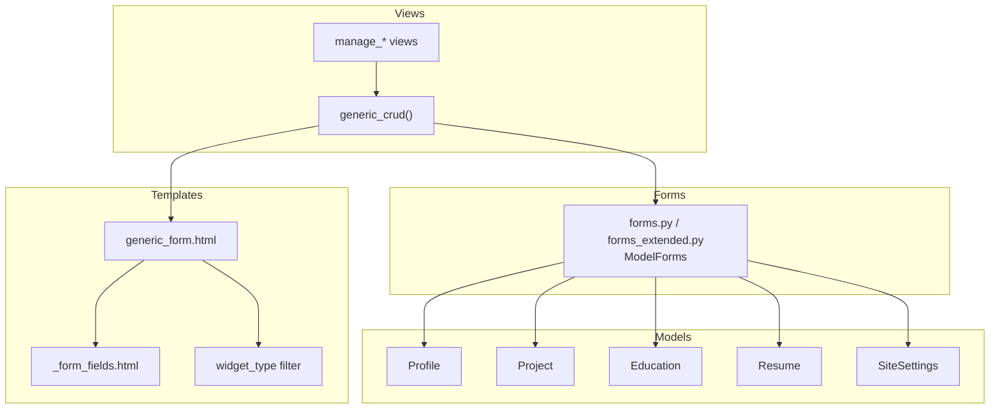
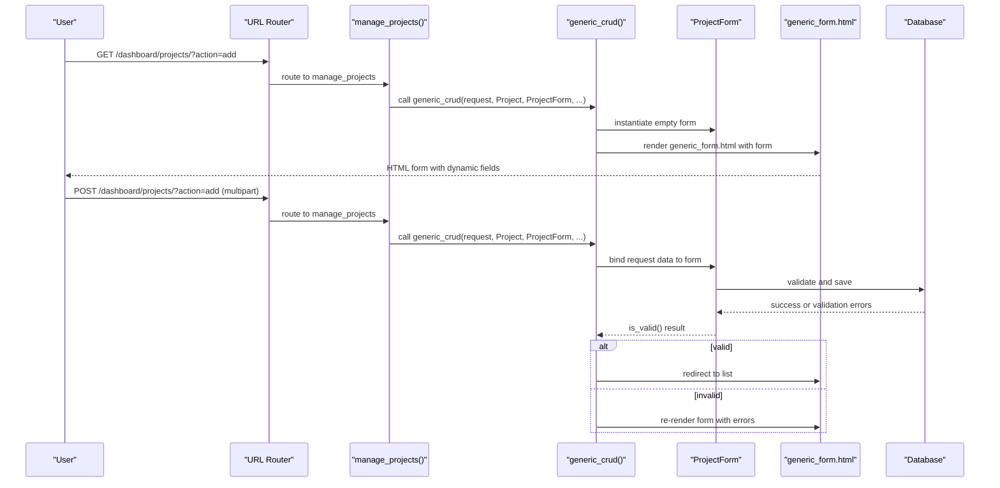
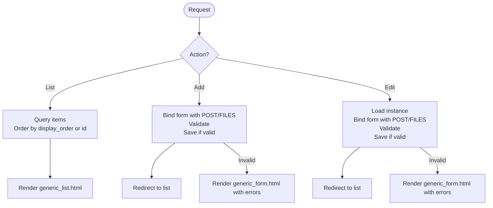
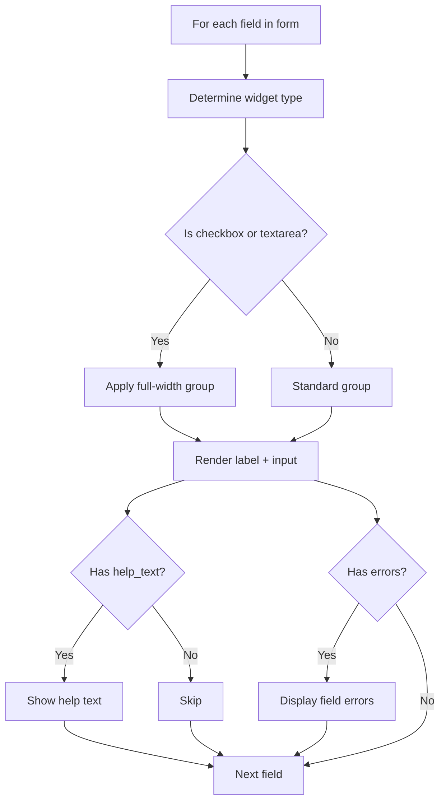
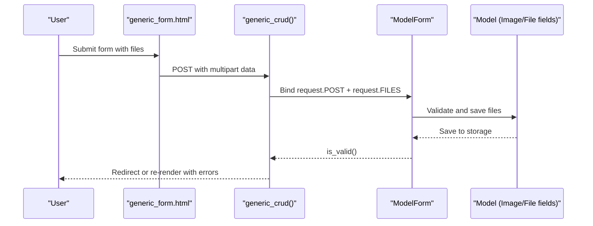
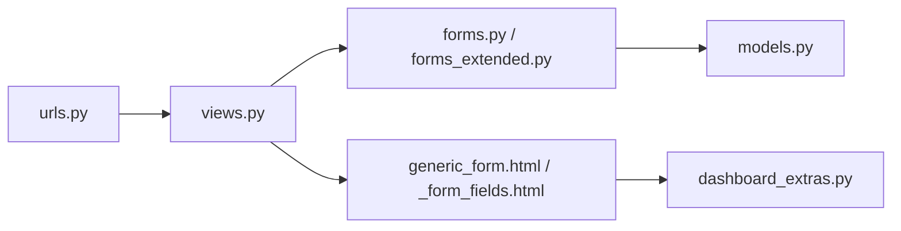

# Form Handling

<cite>
**Referenced Files in This Document**
- [views.py](file://portfolio/views.py)
- [forms.py](file://portfolio/forms.py)
- [forms_extended.py](file://portfolio/forms_extended.py)
- [models.py](file://portfolio/models.py)
- [generic_form.html](file://templates/dashboard/generic_form.html)
- [_form_fields.html](file://templates/dashboard/_form_fields.html)
- [dashboard_extras.py](file://portfolio/templatetags/dashboard_extras.py)
- [urls.py](file://portfolio/urls.py)
</cite>

## Table of Contents
1. Introduction
2. Project Structure
3. Core Components
4. Architecture Overview
5. Detailed Component Analysis
6. Dependency Analysis
7. Performance Considerations
8. Troubleshooting Guide
9. Conclusion
10. Appendices

## Introduction
This document explains the generic form handling system used across the portfolio dashboard. It covers dynamic field generation, validation rules, file upload processing, and consistent error display. The system adapts to different model types through Django ModelForms and a shared CRUD view that renders a single reusable form template for all content modules. Complex field types such as JSON arrays and file uploads are supported via model fields and standard Django form behavior.

## Project Structure
The form system is composed of:
- Model definitions with various field types (text, image, file, JSON, booleans, dates, URLs).
- One ModelForm per model to bind forms to models.
- A generic CRUD view that handles list, create, edit, and delete flows for each module.
- Reusable templates that render forms dynamically based on widget types and display errors consistently.
- A custom template tag to detect widget types for conditional styling.

**Diagram sources**
- [views.py:127-180](file://portfolio/views.py#L127-L180)
- [forms.py:1-22](file://portfolio/forms.py#L1-L22)
- [forms_extended.py:1-78](file://portfolio/forms_extended.py#L1-L78)
- [generic_form.html:1-63](file://templates/dashboard/generic_form.html#L1-L63)
- [_form_fields.html:1-25](file://templates/dashboard/_form_fields.html#L1-L25)
- [dashboard_extras.py:1-13](file://portfolio/templatetags/dashboard_extras.py#L1-L13)
- [models.py:4-298](file://portfolio/models.py#L4-L298)

**Section sources**
- [views.py:127-180](file://portfolio/views.py#L127-L180)
- [forms.py:1-22](file://portfolio/forms.py#L1-L22)
- [forms_extended.py:1-78](file://portfolio/forms_extended.py#L1-L78)
- [generic_form.html:1-63](file://templates/dashboard/generic_form.html#L1-L63)
- [_form_fields.html:1-25](file://templates/dashboard/_form_fields.html#L1-L25)
- [dashboard_extras.py:1-13](file://portfolio/templatetags/dashboard_extras.py#L1-L13)
- [models.py:4-298](file://portfolio/models.py#L4-L298)

## Core Components
- Generic CRUD view: Centralizes list/create/edit/delete logic and routes to shared templates.
- ModelForms: One per model; automatically maps model fields to form fields and widgets.
- Templates: Render fields dynamically, handle errors, and support file uploads.
- Template tag: Detects widget type to adjust layout and labeling.

Key responsibilities:
- Dynamic field generation from model fields.
- Validation via Django’s form validation pipeline.
- File upload handling via multipart forms.
- Consistent error display at field and form level.

**Section sources**
- [views.py:127-180](file://portfolio/views.py#L127-L180)
- [forms.py:1-22](file://portfolio/forms.py#L1-L22)
- [forms_extended.py:1-78](file://portfolio/forms_extended.py#L1-L78)
- [generic_form.html:1-63](file://templates/dashboard/generic_form.html#L1-L63)
- [_form_fields.html:1-25](file://templates/dashboard/_form_fields.html#L1-L25)
- [dashboard_extras.py:1-13](file://portfolio/templatetags/dashboard_extras.py#L1-L13)

## Architecture Overview
The flow below shows how a user interacts with a content module (e.g., Projects), from listing to creating or editing an item using the generic form.

**Diagram sources**
- [urls.py:19-31](file://portfolio/urls.py#L19-L31)
- [views.py:185-207](file://portfolio/views.py#L185-L207)
- [views.py:127-180](file://portfolio/views.py#L127-L180)
- [forms_extended.py:49-52](file://portfolio/forms_extended.py#L49-L52)
- [generic_form.html:24-59](file://templates/dashboard/generic_form.html#L24-L59)

## Detailed Component Analysis

### Generic CRUD View
- Handles list, add, and edit actions based on query parameters.
- For add/edit, binds request.POST and request.FILES to the provided form class.
- Validates the form and saves it on success; otherwise, returns the form with errors.
- Uses messages to inform users about success or validation issues.
- Detects whether a model supports ordering by checking for a specific field name and orders accordingly.

**Diagram sources**
- [views.py:127-180](file://portfolio/views.py#L127-L180)

**Section sources**
- [views.py:127-180](file://portfolio/views.py#L127-L180)

### ModelForms and Field Mapping
- Each model has a corresponding ModelForm that maps all fields automatically.
- Some forms customize widgets (e.g., textareas with rows and CSS classes).
- Forms inherit validation rules defined in the model (required, max length, choices, etc.).

Examples:
- ProfileForm customizes textarea widgets for long text fields.
- All other forms use default widgets derived from model field types.

**Section sources**
- [forms.py:4-21](file://portfolio/forms.py#L4-L21)
- [forms_extended.py:4-77](file://portfolio/forms_extended.py#L4-L77)
- [models.py:4-298](file://portfolio/models.py#L4-L298)

### Dynamic Field Rendering and Error Display
- The generic form template iterates over form fields and renders them dynamically.
- Uses a custom filter to determine widget type and apply full-width styling for certain widgets.
- Displays help text and field-level errors consistently.
- Supports non-field errors at the top of the form.

**Diagram sources**
- [generic_form.html:27-48](file://templates/dashboard/generic_form.html#L27-L48)
- [_form_fields.html:2-23](file://templates/dashboard/_form_fields.html#L2-L23)
- [dashboard_extras.py:6-12](file://portfolio/templatetags/dashboard_extras.py#L6-L12)

**Section sources**
- [generic_form.html:17-59](file://templates/dashboard/generic_form.html#L17-L59)
- [_form_fields.html:1-25](file://templates/dashboard/_form_fields.html#L1-L25)
- [dashboard_extras.py:1-13](file://portfolio/templatetags/dashboard_extras.py#L1-L13)

### File Upload Processing
- Forms include enctype="multipart/form-data" to allow file uploads.
- Views pass request.FILES when binding forms for create and edit operations.
- Models define ImageField and FileField with upload_to paths for storing files.
- Uploaded files are validated and saved by Django’s form/model layer.

**Diagram sources**
- [generic_form.html:24-25](file://templates/dashboard/generic_form.html#L24-L25)
- [views.py:143-176](file://portfolio/views.py#L143-L176)
- [models.py:12-13](file://portfolio/models.py#L12-L13)
- [models.py:137-138](file://portfolio/models.py#L137-L138)
- [models.py:243-247](file://portfolio/models.py#L243-L247)

**Section sources**
- [generic_form.html:24-25](file://templates/dashboard/generic_form.html#L24-L25)
- [views.py:143-176](file://portfolio/views.py#L143-L176)
- [models.py:12-13](file://portfolio/models.py#L12-L13)
- [models.py:137-138](file://portfolio/models.py#L137-L138)
- [models.py:243-247](file://portfolio/models.py#L243-L247)

### Complex Field Types: JSON Arrays
- Models use JSONField to store structured data like lists of responsibilities or features.
- Django’s form layer handles JSONField values automatically when bound to ModelForms.
- No extra configuration is required beyond defining JSONField in the model.

Examples:
- Experience stores responsibilities as a JSON array.
- Project stores features as a JSON array.

**Section sources**
- [models.py:79-79](file://portfolio/models.py#L79-L79)
- [models.py:187-187](file://portfolio/models.py#L187-L187)
- [forms_extended.py:14-17](file://portfolio/forms_extended.py#L14-L17)
- [forms_extended.py:49-52](file://portfolio/forms_extended.py#L49-L52)

### Extending Form Behavior and Adding Custom Field Types
To extend form behavior:
- Create a new ModelForm subclass for a new model and set Meta.model and Meta.fields.
- Customize widgets in Meta.widgets to change rendering (e.g., Textarea with rows and CSS classes).
- Add custom validation in the form’s clean_<field>() methods if needed.
- Use the same generic CRUD pattern by adding a wrapper view that calls generic_crud with your model and form class.

To add a custom field type:
- Define a custom widget and/or field class in Python.
- Assign it to a model field or override it in the form’s Meta.widgets.
- Ensure the template can render it; if necessary, update the widget_type filter to recognize the new widget class.

Best practices:
- Keep forms thin and rely on model constraints where possible.
- Use messages to communicate validation outcomes.
- Maintain consistent UI by leveraging the generic templates.

[No sources needed since this section provides general guidance]

## Dependency Analysis
The following diagram shows key dependencies between views, forms, templates, and models.

**Diagram sources**
- [urls.py:1-44](file://portfolio/urls.py#L1-L44)
- [views.py:1-458](file://portfolio/views.py#L1-L458)
- [forms.py:1-22](file://portfolio/forms.py#L1-L22)
- [forms_extended.py:1-78](file://portfolio/forms_extended.py#L1-L78)
- [models.py:1-298](file://portfolio/models.py#L1-L298)
- [generic_form.html:1-63](file://templates/dashboard/generic_form.html#L1-L63)
- [_form_fields.html:1-25](file://templates/dashboard/_form_fields.html#L1-L25)
- [dashboard_extras.py:1-13](file://portfolio/templatetags/dashboard_extras.py#L1-L13)

**Section sources**
- [urls.py:1-44](file://portfolio/urls.py#L1-L44)
- [views.py:1-458](file://portfolio/views.py#L1-L458)
- [forms.py:1-22](file://portfolio/forms.py#L1-L22)
- [forms_extended.py:1-78](file://portfolio/forms_extended.py#L1-L78)
- [models.py:1-298](file://portfolio/models.py#L1-L298)
- [generic_form.html:1-63](file://templates/dashboard/generic_form.html#L1-L63)
- [_form_fields.html:1-25](file://templates/dashboard/_form_fields.html#L1-L25)
- [dashboard_extras.py:1-13](file://portfolio/templatetags/dashboard_extras.py#L1-L13)

## Performance Considerations
- Use select_related/prefetch_related in list views to reduce N+1 queries when displaying related data.
- Avoid heavy computations in form validation; delegate to model-level validators where appropriate.
- Cache static settings or frequently accessed data if needed.
- Optimize file uploads by setting appropriate media storage configurations and limits.

[No sources needed since this section provides general guidance]

## Troubleshooting Guide
Common issues and resolutions:
- Form not saving files: Ensure the form includes enctype="multipart/form-data" and the view passes request.FILES when binding.
- Validation errors not displayed: Verify that the template loops over field.errors and displays non_field_errors.
- JSON fields not updating: Confirm that the model uses JSONField and that the frontend sends properly formatted JSON payloads.
- Custom widget not styled: Update the widget_type filter to recognize the new widget class and adjust template logic accordingly.

**Section sources**
- [generic_form.html:17-22](file://templates/dashboard/generic_form.html#L17-L22)
- [generic_form.html:24-25](file://templates/dashboard/generic_form.html#L24-L25)
- [views.py:143-176](file://portfolio/views.py#L143-L176)
- [dashboard_extras.py:6-12](file://portfolio/templatetags/dashboard_extras.py#L6-L12)

## Conclusion
The generic form handling system provides a scalable, consistent approach to managing multiple content modules. By leveraging Django ModelForms, a shared CRUD view, and reusable templates, the system dynamically generates fields, enforces validation rules, processes file uploads, and displays errors uniformly. Extending the system involves creating new ModelForms and wiring them into the generic CRUD flow, while complex field types like JSON are handled transparently by Django’s form layer.

[No sources needed since this section summarizes without analyzing specific files]

## Appendices

### Example: Adding a New Content Module
Steps:
- Define a new model with desired fields (including any JSON or file fields).
- Create a ModelForm subclass mapping to the new model.
- Add a wrapper view that calls generic_crud with the new model and form class.
- Register a URL path for the new module.
- Optionally customize widgets in the form’s Meta.widgets for better UX.

[No sources needed since this section provides general guidance]