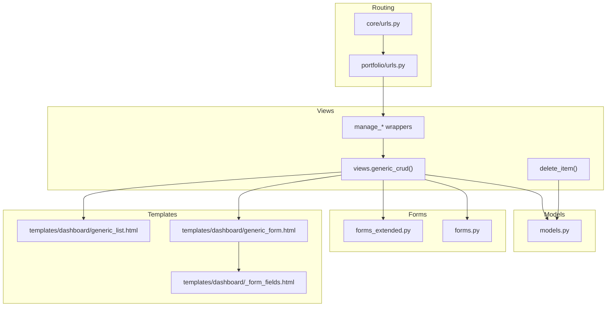
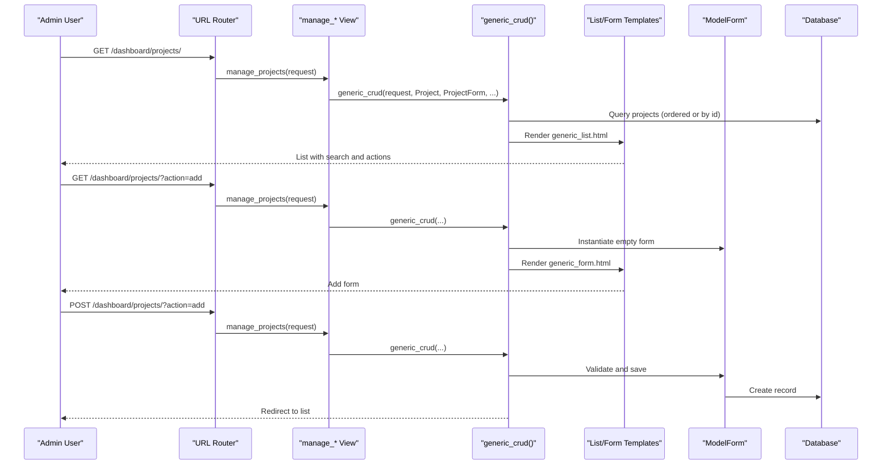
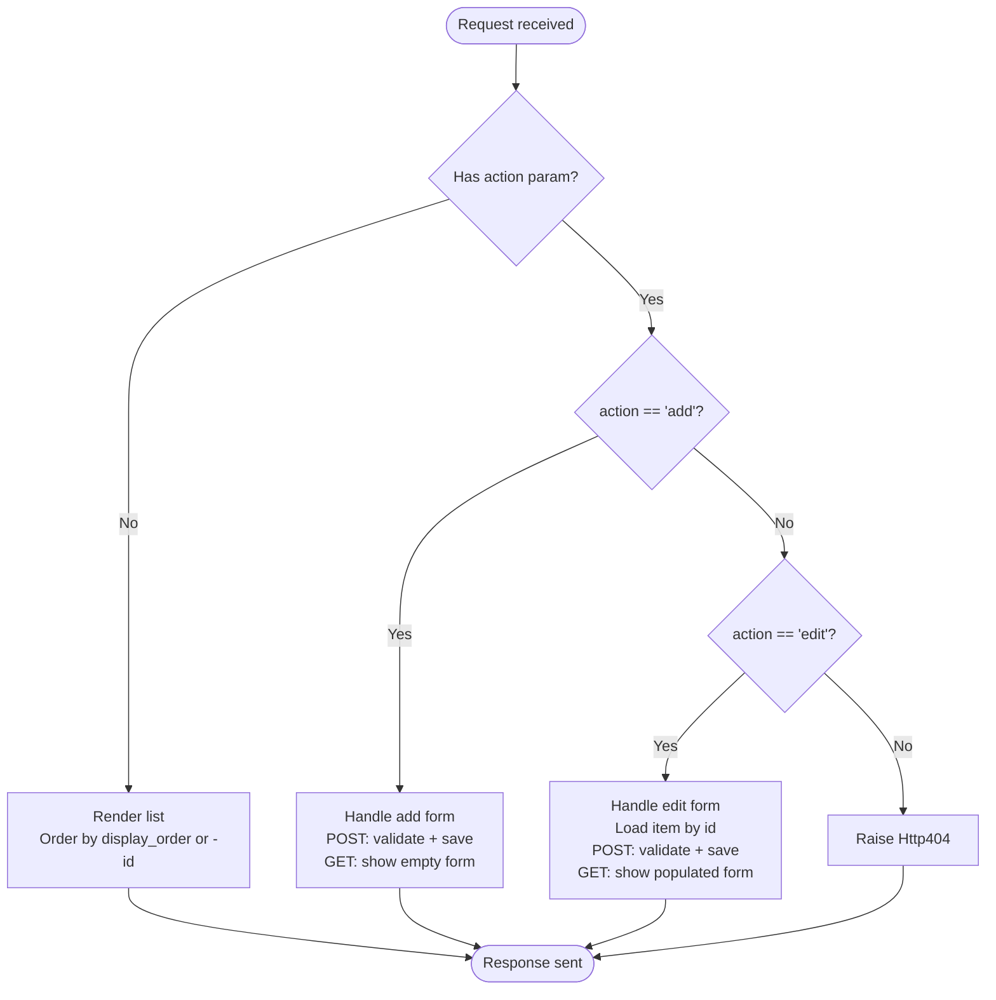
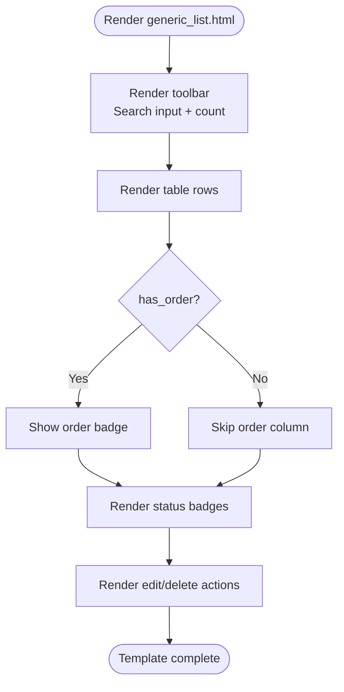
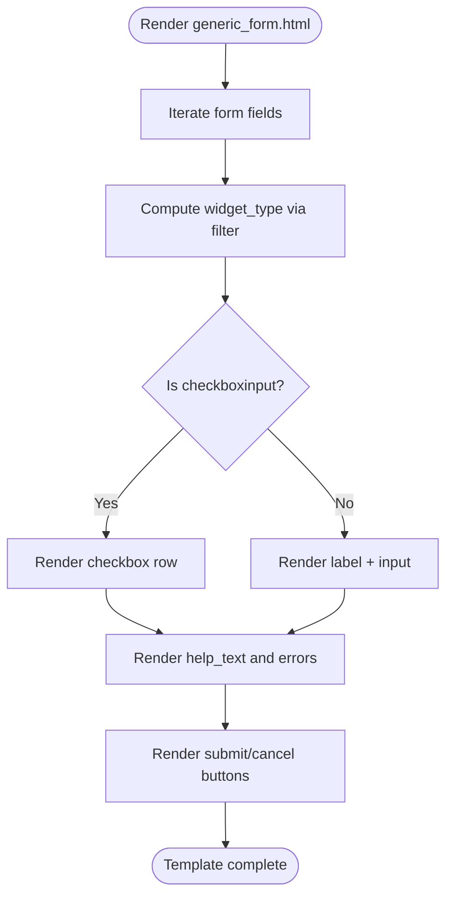
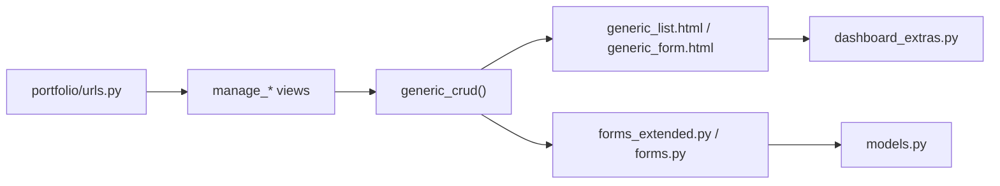

# Generic CRUD System

<cite>
**Referenced Files in This Document**
- [urls.py](file://core/urls.py)
- [urls.py](file://portfolio/urls.py)
- [views.py](file://portfolio/views.py)
- [models.py](file://portfolio/models.py)
- [forms.py](file://portfolio/forms.py)
- [forms_extended.py](file://portfolio/forms_extended.py)
- [generic_list.html](file://templates/dashboard/generic_list.html)
- [generic_form.html](file://templates/dashboard/generic_form.html)
- [_form_fields.html](file://templates/dashboard/_form_fields.html)
- [dashboard_extras.py](file://portfolio/templatetags/dashboard_extras.py)
</cite>

## Table of Contents
1. [Introduction](#introduction)
2. [Project Structure](#project-structure)
3. [Core Components](#core-components)
4. [Architecture Overview](#architecture-overview)
5. [Detailed Component Analysis](#detailed-component-analysis)
6. [Dependency Analysis](#dependency-analysis)
7. [Performance Considerations](#performance-considerations)
8. [Troubleshooting Guide](#troubleshooting-guide)
9. [Conclusion](#conclusion)
10. [Appendices](#appendices)

## Introduction
This document explains the generic CRUD system that powers all content management modules in the portfolio dashboard. It covers:
- The reusable list template with search, filtering, and bulk operations support
- The reusable form template with dynamic field rendering, validation, and file upload handling
- The view pattern that handles multiple models through a single function
- URL routing configuration for each module
- How to add new content types using this system
- Examples of extending the generic system for custom business logic

The goal is to make it easy to understand how the system works and how to extend it without duplicating code across modules.

## Project Structure
The CRUD system spans views, templates, forms, models, and URL routing:
- Views provide a generic CRUD helper and per-module wrappers
- Templates render lists and forms generically
- Forms are ModelForms for each model
- Models define data structures and ordering fields
- URLs wire routes to views

**Diagram sources**
- [urls.py:22-25](file://core/urls.py#L22-L25)
- [urls.py:18-32](file://portfolio/urls.py#L18-L32)
- [views.py:127-180](file://portfolio/views.py#L127-L180)
- [views.py:184-207](file://portfolio/views.py#L184-L207)
- [views.py:240-249](file://portfolio/views.py#L240-L249)
- [generic_list.html:1-81](file://templates/dashboard/generic_list.html#L1-L81)
- [generic_form.html:1-63](file://templates/dashboard/generic_form.html#L1-L63)
- [_form_fields.html:1-25](file://templates/dashboard/_form_fields.html#L1-L25)
- [forms.py:1-22](file://portfolio/forms.py#L1-L22)
- [forms_extended.py:1-78](file://portfolio/forms_extended.py#L1-L78)
- [models.py:1-298](file://portfolio/models.py#L1-L298)

**Section sources**
- [urls.py:22-25](file://core/urls.py#L22-L25)
- [urls.py:18-32](file://portfolio/urls.py#L18-L32)

## Core Components
- Generic CRUD view: A single function that supports list, create, edit, and delete flows for any model.
- Reusable list template: Renders items with search, status badges, and actions.
- Reusable form template: Dynamically renders fields, validates input, and handles file uploads.
- Per-module wrapper views: Thin decorators that bind a model and form to the generic CRUD.
- Delete handler: Centralized deletion endpoint mapped by model name.
- Template tag: Determines widget type to customize field rendering.

Key responsibilities:
- Routing: Each module has a dedicated URL path and named URL.
- Views: Generic CRUD centralizes common logic; wrappers keep routes clean.
- Templates: Shared UI for consistent UX across modules.
- Forms: Model-based forms with automatic validation and file handling.
- Models: Define fields, ordering, visibility flags, and relationships.

**Section sources**
- [views.py:127-180](file://portfolio/views.py#L127-L180)
- [views.py:184-207](file://portfolio/views.py#L184-L207)
- [views.py:240-249](file://portfolio/views.py#L240-L249)
- [generic_list.html:1-81](file://templates/dashboard/generic_list.html#L1-L81)
- [generic_form.html:1-63](file://templates/dashboard/generic_form.html#L1-L63)
- [dashboard_extras.py:1-13](file://portfolio/templatetags/dashboard_extras.py#L1-L13)

## Architecture Overview
The system follows a layered approach:
- URL layer maps paths to view functions
- View layer uses a generic CRUD helper plus thin wrappers
- Template layer renders shared list and form UI
- Form layer provides ModelForm instances per model
- Model layer defines data schema and ordering

**Diagram sources**
- [urls.py:18-32](file://portfolio/urls.py#L18-L32)
- [views.py:127-180](file://portfolio/views.py#L127-L180)
- [views.py:184-185](file://portfolio/views.py#L184-L185)
- [generic_list.html:1-81](file://templates/dashboard/generic_list.html#L1-L81)
- [generic_form.html:1-63](file://templates/dashboard/generic_form.html#L1-L63)

## Detailed Component Analysis

### Generic CRUD View
The generic CRUD function centralizes common operations:
- Detects whether the model supports ordering via a display_order field
- Handles list rendering with appropriate ordering
- Supports adding and editing records through a shared form template
- Uses messages for success/error feedback
- Raises Http404 for unknown actions

**Diagram sources**
- [views.py:127-180](file://portfolio/views.py#L127-L180)

**Section sources**
- [views.py:127-180](file://portfolio/views.py#L127-L180)

### Reusable List Template
The list template provides:
- Search bar with client-side filtering
- Status badges for visibility/active/featured states
- Actions for edit and delete
- Empty state guidance
- Optional order column when models have display_order

It integrates with the generic CRUD flow by receiving:
- items: queryset results
- model_name: human-readable label
- model_key: model class name used in delete URL
- list_url: URL name for back navigation
- has_order: boolean to conditionally render order column

**Diagram sources**
- [generic_list.html:1-81](file://templates/dashboard/generic_list.html#L1-L81)

**Section sources**
- [generic_list.html:1-81](file://templates/dashboard/generic_list.html#L1-L81)

### Reusable Form Template
The form template provides:
- Dynamic field rendering based on widget type
- Validation error display per field
- Help text support
- File upload handling via multipart/form-data
- Consistent layout and footer actions

It uses a template tag to determine widget type and applies special styling for checkboxes and textareas.

**Diagram sources**
- [generic_form.html:1-63](file://templates/dashboard/generic_form.html#L1-L63)
- [dashboard_extras.py:1-13](file://portfolio/templatetags/dashboard_extras.py#L1-L13)

**Section sources**
- [generic_form.html:1-63](file://templates/dashboard/generic_form.html#L1-L63)
- [dashboard_extras.py:1-13](file://portfolio/templatetags/dashboard_extras.py#L1-L13)

### Per-Module Wrapper Views
Each content module has a thin wrapper view that binds:
- The Django model
- The corresponding ModelForm
- The URL name for redirection
- A human-readable model name

These wrappers are decorated with login_required to restrict access.

Examples include managing projects, certificates, skills, education, experience, achievements, services, workshops, statistics, technologies, resume files, and social links.

**Section sources**
- [views.py:184-207](file://portfolio/views.py#L184-L207)

### Delete Handler
A centralized delete view:
- Maps model names to model classes and redirect URLs
- Loads the target item and deletes it
- Returns a success message and redirects to the module’s list

**Section sources**
- [views.py:223-249](file://portfolio/views.py#L223-L249)

### URL Routing Configuration
Top-level routing includes admin and app inclusion. The app-level routing defines:
- Public pages
- Authentication endpoints
- Dashboard entry points
- Content module endpoints
- Delete endpoint
- Messages inbox endpoints
- API endpoints

Each content module has a dedicated path and named URL, enabling consistent navigation and reverse resolution.

**Section sources**
- [urls.py:22-25](file://core/urls.py#L22-L25)
- [urls.py:18-32](file://portfolio/urls.py#L18-L32)

### Adding a New Content Type
To add a new content type using the generic system:
1. Define a Django model in models.py with desired fields and optional display_order/is_visible flags.
2. Create a ModelForm in forms_extended.py mapping to the new model.
3. Add a wrapper view in views.py that calls generic_crud with the new model and form.
4. Register a URL path in urls.py pointing to the wrapper view.
5. Optionally add an entry to DELETE_MODEL_MAP if you want to use the centralized delete handler.
6. Use the existing generic_list.html and generic_form.html templates automatically.

Example steps:
- Model definition: see patterns in models.py for Education, Experience, etc.
- Form definition: see patterns in forms_extended.py for EducationForm, ExperienceForm, etc.
- Wrapper view: follow manage_education or manage_experience patterns in views.py
- URL route: follow manage_education or manage_experience patterns in urls.py
- Delete mapping: add to DELETE_MODEL_MAP in views.py

**Section sources**
- [models.py:49-89](file://portfolio/models.py#L49-L89)
- [forms_extended.py:9-17](file://portfolio/forms_extended.py#L9-L17)
- [views.py:191-193](file://portfolio/views.py#L191-L193)
- [urls.py:22-23](file://portfolio/urls.py#L22-L23)
- [views.py:223-237](file://portfolio/views.py#L223-L237)

### Extending the Generic System for Custom Business Logic
Common extension points:
- Override a wrapper view to add pre/post processing around generic_crud
- Customize list rendering by subclassing or extending generic_list.html
- Customize form behavior by overriding form validation or saving in a custom form
- Add custom actions in the list template (e.g., bulk operations)
- Extend the delete flow with confirmation or soft-delete logic

Examples:
- Pre-save transformations: wrap generic_crud in a custom view that modifies request data before calling generic_crud
- Post-save notifications: after form.save(), send emails or update related objects
- Conditional visibility: set is_visible based on business rules during save
- Bulk operations: add checkboxes in generic_list.html and handle bulk delete/update in a custom view

**Section sources**
- [views.py:127-180](file://portfolio/views.py#L127-L180)
- [generic_list.html:1-81](file://templates/dashboard/generic_list.html#L1-L81)
- [generic_form.html:1-63](file://templates/dashboard/generic_form.html#L1-L63)

## Dependency Analysis
The system exhibits low coupling between modules due to the generic helper and shared templates. Dependencies flow from routes to views to templates and forms, with models at the base.

**Diagram sources**
- [urls.py:18-32](file://portfolio/urls.py#L18-L32)
- [views.py:127-180](file://portfolio/views.py#L127-L180)
- [generic_list.html:1-81](file://templates/dashboard/generic_list.html#L1-L81)
- [generic_form.html:1-63](file://templates/dashboard/generic_form.html#L1-L63)
- [forms_extended.py:1-78](file://portfolio/forms_extended.py#L1-L78)
- [forms.py:1-22](file://portfolio/forms.py#L1-L22)
- [models.py:1-298](file://portfolio/models.py#L1-L298)
- [dashboard_extras.py:1-13](file://portfolio/templatetags/dashboard_extras.py#L1-L13)

**Section sources**
- [urls.py:18-32](file://portfolio/urls.py#L18-L32)
- [views.py:127-180](file://portfolio/views.py#L127-L180)
- [generic_list.html:1-81](file://templates/dashboard/generic_list.html#L1-L81)
- [generic_form.html:1-63](file://templates/dashboard/generic_form.html#L1-L63)
- [forms_extended.py:1-78](file://portfolio/forms_extended.py#L1-L78)
- [forms.py:1-22](file://portfolio/forms.py#L1-L22)
- [models.py:1-298](file://portfolio/models.py#L1-L298)
- [dashboard_extras.py:1-13](file://portfolio/templatetags/dashboard_extras.py#L1-L13)

## Performance Considerations
- Ordering: When models include display_order, the list is ordered by that field first, then by id. This avoids expensive sorting at query time for large datasets.
- Visibility flags: Many models include is_visible or is_active; consider filtering these in queries if the list should only show active items.
- File uploads: Ensure proper media storage configuration and limits to avoid performance issues with large files.
- Pagination: The current list template does not paginate; for large datasets, implement server-side pagination to reduce memory usage and improve load times.
- Select-related/prefetch-related: For complex relations, use select_related and prefetch_related in list queries to minimize N+1 queries.

[No sources needed since this section provides general guidance]

## Troubleshooting Guide
Common issues and resolutions:
- Unknown action error: Ensure URL parameters include action=add or action=edit with a valid id for edits.
- Missing delete mapping: If using the centralized delete handler, ensure the model name is present in DELETE_MODEL_MAP.
- Form validation errors: Check field-level errors rendered by the form template; ensure required fields are filled and file uploads are valid.
- File upload not working: Confirm the form uses enctype="multipart/form-data" and the backend accepts files.
- Ordering not applied: Verify the model has a display_order field; otherwise, the list falls back to ordering by -id.

**Section sources**
- [views.py:127-180](file://portfolio/views.py#L127-L180)
- [views.py:223-249](file://portfolio/views.py#L223-L249)
- [generic_form.html:1-63](file://templates/dashboard/generic_form.html#L1-L63)

## Conclusion
The generic CRUD system provides a consistent, maintainable foundation for all content management modules. By centralizing common logic in a single view and reusing templates, it reduces duplication and accelerates development. Adding new content types requires minimal changes: define a model, a form, a wrapper view, and a URL route. Extensions can be made at the view, template, or form layers to accommodate custom business logic while preserving the overall user experience.

[No sources needed since this section summarizes without analyzing specific files]

## Appendices

### Quick Reference: Adding a New Module
- Model: Add to models.py
- Form: Add to forms_extended.py
- Wrapper view: Add to views.py using generic_crud
- URL: Add to urls.py
- Delete mapping: Add to DELETE_MODEL_MAP if using centralized delete

**Section sources**
- [models.py:1-298](file://portfolio/models.py#L1-L298)
- [forms_extended.py:1-78](file://portfolio/forms_extended.py#L1-L78)
- [views.py:127-180](file://portfolio/views.py#L127-L180)
- [views.py:223-249](file://portfolio/views.py#L223-L249)
- [urls.py:18-32](file://portfolio/urls.py#L18-L32)