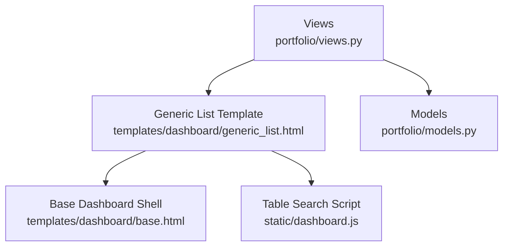
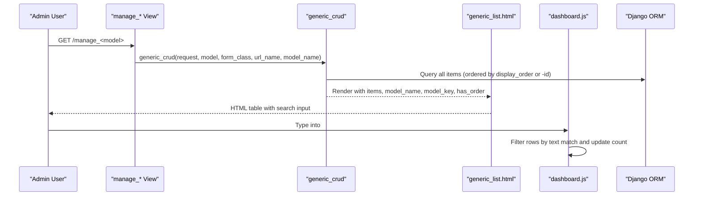
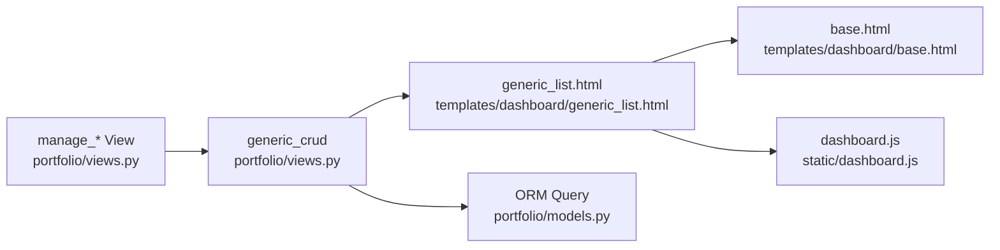

# List Management

<cite>
**Referenced Files in This Document**
- [generic_list.html](file://templates/dashboard/generic_list.html)
- [base.html](file://templates/dashboard/base.html)
- [views.py](file://portfolio/views.py)
- [dashboard.js](file://static/dashboard.js)
- [models.py](file://portfolio/models.py)
</cite>

## Table of Contents
1. [Introduction](#introduction)
2. [Project Structure](#project-structure)
3. [Core Components](#core-components)
4. [Architecture Overview](#architecture-overview)
5. [Detailed Component Analysis](#detailed-component-analysis)
6. [Dependency Analysis](#dependency-analysis)
7. [Performance Considerations](#performance-considerations)
8. [Troubleshooting Guide](#troubleshooting-guide)
9. [Conclusion](#conclusion)

## Introduction
This document explains the generic list management interface used across the portfolio dashboard. It covers how lists are rendered for different model types, how client-side search works, how status and featured badges are displayed, how action buttons trigger edit and delete flows, and how responsive layout is handled by the shared base template. It also provides guidance on customizing list views, adding filters, and implementing advanced search features.

## Project Structure
The list feature is implemented using a reusable Django template, a generic view helper, shared dashboard shell, and a small JavaScript module for table search and confirmation dialogs.

**Diagram sources**
- [views.py:127-180](file://portfolio/views.py#L127-L180)
- [generic_list.html:1-80](file://templates/dashboard/generic_list.html#L1-L80)
- [base.html:1-188](file://templates/dashboard/base.html#L1-L188)
- [dashboard.js:133-175](file://static/dashboard.js#L133-L175)
- [models.py:1-298](file://portfolio/models.py#L1-L298)

**Section sources**
- [views.py:127-180](file://portfolio/views.py#L127-L180)
- [generic_list.html:1-80](file://templates/dashboard/generic_list.html#L1-L80)
- [base.html:1-188](file://templates/dashboard/base.html#L1-L188)
- [dashboard.js:133-175](file://static/dashboard.js#L133-L175)
- [models.py:1-298](file://portfolio/models.py#L1-L298)

## Core Components
- Generic CRUD view helper: Provides list, create, and edit flows for multiple models with consistent behavior.
- Generic list template: Renders a table with search input, status badges, optional order column, and per-row actions.
- Base dashboard template: Supplies layout, sidebar navigation, topbar, theme toggle, and global scripts.
- Client-side script: Implements live table search and confirmation prompts for destructive actions.
- Models: Define common fields such as visibility, active flags, featured flags, and ordering that influence list rendering.

Key responsibilities:
- Views prepare context variables like items, model_name, model_key, has_order, and list_url.
- Template renders rows based on item attributes (is_visible, is_active, is_featured, display_order).
- JavaScript listens to the search input and toggles row visibility while updating the visible count.
- Base template ensures responsive layout and consistent UI elements.

**Section sources**
- [views.py:127-180](file://portfolio/views.py#L127-L180)
- [generic_list.html:1-80](file://templates/dashboard/generic_list.html#L1-L80)
- [base.html:1-188](file://templates/dashboard/base.html#L1-L188)
- [dashboard.js:133-175](file://static/dashboard.js#L133-L175)
- [models.py:1-298](file://portfolio/models.py#L1-L298)

## Architecture Overview
The list flow starts at a URL mapped to a manage_* view, which delegates to generic_crud. The list branch returns the generic list template with a queryset and metadata. The template extends the base dashboard shell and includes a search input. On page load, dashboard.js initializes the table search and confirmation behaviors.

**Diagram sources**
- [views.py:127-180](file://portfolio/views.py#L127-L180)
- [generic_list.html:1-80](file://templates/dashboard/generic_list.html#L1-L80)
- [dashboard.js:133-175](file://static/dashboard.js#L133-L175)

## Detailed Component Analysis

### Generic List Template
Responsibilities:
- Extends the base dashboard shell to inherit layout, sidebar, and scripts.
- Displays a toolbar with a search input and a count indicator.
- Renders a table with columns: Order (conditional), Details, Status, Actions.
- Shows status badges based on item.is_visible, item.is_active, and item.is_featured.
- Provides Edit and Delete links per row; Delete uses a confirmation prompt.
- Handles empty state with a call-to-action to add a new record.

Customization points:
- Add or remove columns by editing the header and row cells.
- Extend status logic to support additional flags.
- Replace action buttons with custom URLs or modals.

Responsive behavior:
- The table container uses scrollable wrapper classes provided by the base CSS.
- The base template’s viewport meta tag and CSS ensure mobile-friendly layouts.

**Section sources**
- [generic_list.html:1-80](file://templates/dashboard/generic_list.html#L1-L80)
- [base.html:1-188](file://templates/dashboard/base.html#L1-L188)

### Generic CRUD View Helper
Responsibilities:
- Determines whether the model supports ordering via a display_order field.
- For list requests without an action parameter, returns the generic list template with:
  - items: ordered queryset
  - model_name: human-readable name
  - model_key: model class name used for URL resolution
  - list_url: URL name for redirecting after operations
  - has_order: boolean controlling the Order column
- For add/edit actions, renders the generic form template with validation and messages.

Sorting behavior:
- If the model has display_order, items are ordered by display_order then id.
- Otherwise, items are ordered by newest first (-id).

Extensibility:
- Wrap this helper for each model to get consistent CRUD behavior.
- Override specific branches if you need specialized list queries or actions.

**Section sources**
- [views.py:127-180](file://portfolio/views.py#L127-L180)

### Client-Side Table Search
Responsibilities:
- Initializes when the DOM is ready.
- Finds the search input (#db-table-search) and the table (#db-data-table).
- On input events, filters rows by matching any text content within the row.
- Updates the visible count element (.db-table-count b) to reflect matches.

Limitations:
- Search is case-insensitive and operates on rendered text only.
- Does not perform server-side filtering or pagination.

Enhancement opportunities:
- Debounce input to reduce reflows.
- Support multi-field or fuzzy search.
- Persist last query in localStorage.

**Section sources**
- [dashboard.js:133-175](file://static/dashboard.js#L133-L175)
- [generic_list.html:14-21](file://templates/dashboard/generic_list.html#L14-L21)

### Base Dashboard Shell
Responsibilities:
- Provides the overall layout, sidebar navigation, topbar, and toast notifications.
- Loads global styles and scripts, including dashboard.js.
- Exposes blocks for title, page_title, page_subtitle, page_actions, and content.

Relevance to lists:
- Lists extend this template to inherit consistent UI and behavior.
- The topbar includes a quick-jump search for modules, complementing the table search.

**Section sources**
- [base.html:1-188](file://templates/dashboard/base.html#L1-L188)

### Models and List Rendering
Common fields influencing list display:
- is_visible: Controls “Visible” badge.
- is_active: Controls “Active” badge when is_visible is false.
- is_featured: Adds a “Featured” badge.
- display_order: Used for sorting and shown in the Order column when present.

Examples of models using these fields:
- Education, Experience, Skill, Technology, Certificate, Workshop, Project, Achievement, Service, SocialLink, Statistic.

Note: Some models use is_active instead of is_visible; the list template handles both cases.

**Section sources**
- [models.py:1-298](file://portfolio/models.py#L1-L298)
- [generic_list.html:34-49](file://templates/dashboard/generic_list.html#L34-L49)

## Dependency Analysis
The following diagram shows how components depend on each other during a typical list operation.

**Diagram sources**
- [views.py:127-180](file://portfolio/views.py#L127-L180)
- [generic_list.html:1-80](file://templates/dashboard/generic_list.html#L1-L80)
- [base.html:1-188](file://templates/dashboard/base.html#L1-L188)
- [dashboard.js:133-175](file://static/dashboard.js#L133-L175)
- [models.py:1-298](file://portfolio/models.py#L1-L298)

**Section sources**
- [views.py:127-180](file://portfolio/views.py#L127-L180)
- [generic_list.html:1-80](file://templates/dashboard/generic_list.html#L1-L80)
- [base.html:1-188](file://templates/dashboard/base.html#L1-L188)
- [dashboard.js:133-175](file://static/dashboard.js#L133-L175)
- [models.py:1-298](file://portfolio/models.py#L1-L298)

## Performance Considerations
- Client-side search scans all rows on every keystroke. For large datasets, consider debouncing input and limiting initial rows.
- Avoid heavy computations in templates; precompute derived values in views or models.
- Use select_related/prefetch_related in list queries when displaying related data to reduce N+1 queries.
- Keep the number of columns minimal to improve rendering performance on mobile devices.

[No sources needed since this section provides general guidance]

## Troubleshooting Guide
Common issues and resolutions:
- Search does not filter rows:
  - Ensure the search input has id="db-table-search" and the table has id="db-data-table".
  - Verify dashboard.js is loaded and no console errors prevent initialization.
- Delete confirmation not appearing:
  - Ensure delete links include class="js-confirm" and a data-confirm attribute.
- Status badges not showing:
  - Confirm the model instance exposes is_visible, is_active, or is_featured as expected.
- Order column missing:
  - The Order column appears only when the model has a display_order field.
- Responsive layout issues:
  - Check that the page extends base.html and that viewport meta is present.
  - Inspect CSS classes around the table wrapper for scroll behavior.

**Section sources**
- [dashboard.js:133-175](file://static/dashboard.js#L133-L175)
- [generic_list.html:14-21](file://templates/dashboard/generic_list.html#L14-L21)
- [generic_list.html:50-59](file://templates/dashboard/generic_list.html#L50-L59)
- [base.html:1-188](file://templates/dashboard/base.html#L1-L188)

## Conclusion
The generic list management interface provides a consistent, extensible way to manage multiple models in the portfolio dashboard. It leverages a reusable template, a central view helper, and lightweight client-side scripts to deliver search, status badges, and action controls. Customization is straightforward through template overrides and view extensions, enabling tailored filters, advanced search, and responsive layouts while maintaining a cohesive user experience.

[No sources needed since this section summarizes without analyzing specific files]