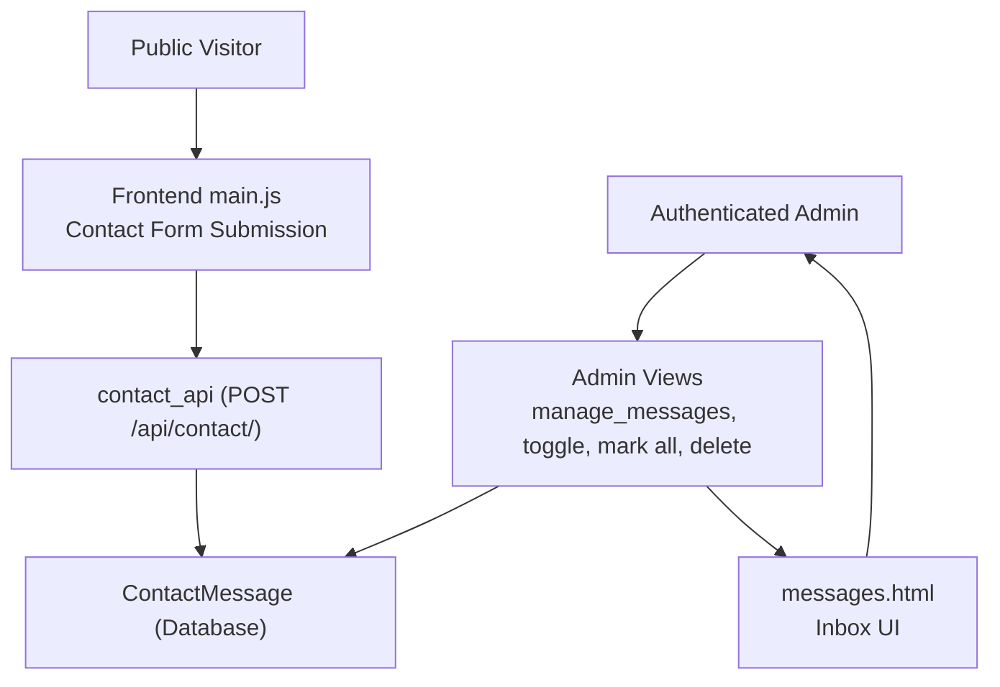
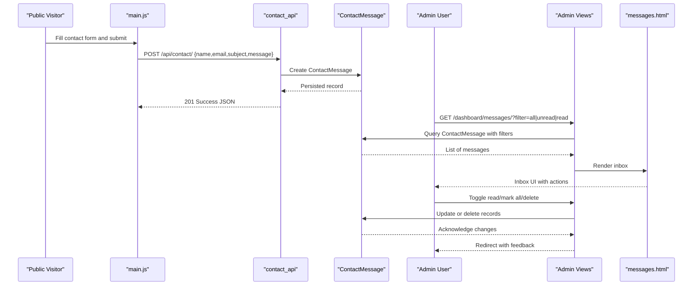
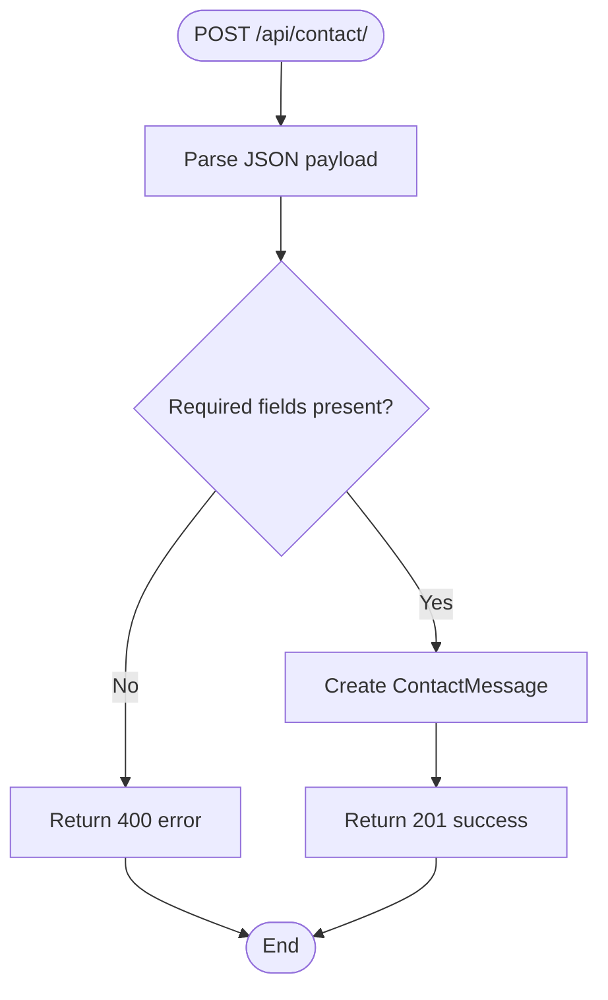
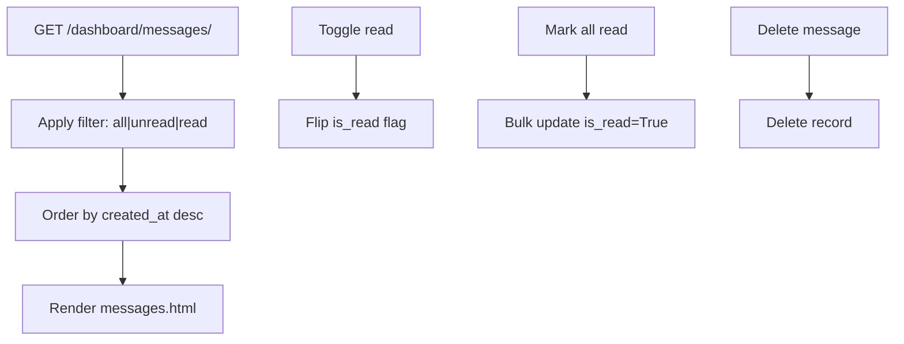
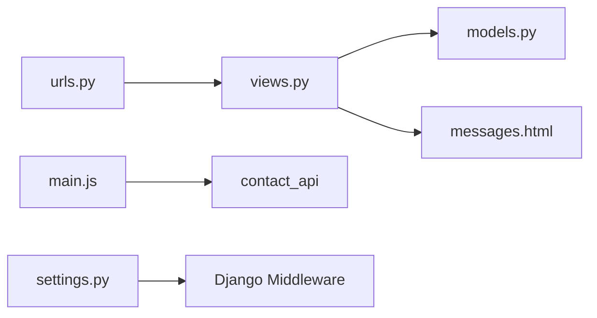

# Message Inbox

<cite>
**Referenced Files in This Document**
- [models.py](file://portfolio/models.py)
- [views.py](file://portfolio/views.py)
- [urls.py](file://portfolio/urls.py)
- [messages.html](file://templates/dashboard/messages.html)
- [settings.py](file://core/settings.py)
- [context_processors.py](file://portfolio/context_processors.py)
- [main.js](file://main.js)
</cite>

## Table of Contents
1. [Introduction](#introduction)
2. [Project Structure](#project-structure)
3. [Core Components](#core-components)
4. [Architecture Overview](#architecture-overview)
5. [Detailed Component Analysis](#detailed-component-analysis)
6. [Dependency Analysis](#dependency-analysis)
7. [Performance Considerations](#performance-considerations)
8. [Troubleshooting Guide](#troubleshooting-guide)
9. [Conclusion](#conclusion)
10. [Appendices](#appendices)

## Introduction
This document explains the message inbox system that captures contact form submissions from the public portfolio and makes them available to authenticated administrators. It covers:
- How messages flow from the frontend contact form to the database
- The ContactMessage model structure
- Admin views for viewing, filtering, marking read/unread, and deleting messages
- The inbox template and UI interactions
- Email integration points and how to extend the system with categories and external email services

## Project Structure
The inbox functionality spans a small set of files:
- Data model: ContactMessage
- Public API: contact_api view
- Admin views: manage_messages, toggle_message_read, mark_all_read, delete_message
- URL routes for both admin and API endpoints
- Template rendering for the inbox UI
- Context processor providing unread counts globally
- Frontend JavaScript posting to the API

**Diagram sources**
- [main.js:695-730](file://main.js#L695-L730)
- [views.py:300-322](file://portfolio/views.py#L300-L322)
- [views.py:255-295](file://portfolio/views.py#L255-L295)
- [messages.html:1-69](file://templates/dashboard/messages.html#L1-L69)
- [urls.py:34-43](file://portfolio/urls.py#L34-L43)

**Section sources**
- [urls.py:34-43](file://portfolio/urls.py#L34-L43)
- [views.py:255-322](file://portfolio/views.py#L255-L322)
- [messages.html:1-69](file://templates/dashboard/messages.html#L1-L69)

## Core Components
- ContactMessage model: stores name, email, subject, message, timestamps, and flags for read/archived status.
- contact_api: accepts POST requests from the public site and persists messages.
- Admin views: list messages with filters, toggle read/unread, bulk mark as read, and delete.
- messages.html: renders the inbox with tabs for All/Unread/Read, inline reply via mailto, and actions for toggling and deletion.
- context_processors.py: provides unread_count to templates for global badges.

Key responsibilities:
- Persistence: ContactMessage.objects.create(...)
- Filtering: is_read flag used for All/Unread/Read tabs
- Bulk operations: update(is_read=True) for mark-all-read
- Deletion: delete() on individual messages

**Section sources**
- [models.py:265-276](file://portfolio/models.py#L265-L276)
- [views.py:255-322](file://portfolio/views.py#L255-L322)
- [messages.html:1-69](file://templates/dashboard/messages.html#L1-L69)
- [context_processors.py:1-10](file://portfolio/context_processors.py#L1-L10)

## Architecture Overview
The inbox follows a simple request-response pattern:
- Public visitors submit a contact form; JavaScript posts JSON to /api/contact/.
- The server creates a ContactMessage record and returns a success response.
- Administrators log in and open the Messages Inbox to view, filter, and act on messages.

**Diagram sources**
- [main.js:695-730](file://main.js#L695-L730)
- [views.py:300-322](file://portfolio/views.py#L300-L322)
- [views.py:255-295](file://portfolio/views.py#L255-L295)
- [messages.html:1-69](file://templates/dashboard/messages.html#L1-L69)

## Detailed Component Analysis

### ContactMessage Model
Fields:
- name: sender’s display name
- email: sender’s email address
- subject: short summary line
- message: body text
- created_at: timestamp when the message was received
- is_read: whether the admin has viewed it
- is_archived: placeholder for future archival workflows

Complexity:
- O(1) per field access
- Queries typically order by created_at descending and filter by is_read

Extensibility:
- Add category fields (e.g., category slug or foreign key) to support categorization
- Add priority or tags if needed

**Section sources**
- [models.py:265-276](file://portfolio/models.py#L265-L276)

### Public Contact API
Behavior:
- Accepts POST requests at /api/contact/
- Parses JSON payload with name, email, subject, message
- Creates a ContactMessage instance
- Returns JSON success or error responses

Security considerations:
- CSRF exemption is applied; ensure origin validation and rate limiting are implemented externally if exposed publicly
- Validate input before saving to prevent malformed data

Integration example:
- Frontend main.js posts JSON to /api/contact/ and handles success/error states

**Diagram sources**
- [views.py:300-322](file://portfolio/views.py#L300-L322)

**Section sources**
- [views.py:300-322](file://portfolio/views.py#L300-L322)
- [main.js:695-730](file://main.js#L695-L730)

### Admin Inbox Views
Endpoints:
- GET /dashboard/messages/: Lists messages with optional filter query parameter (all, unread, read)
- GET /dashboard/messages/<id>/toggle/: Toggles is_read for a specific message
- GET /dashboard/messages/mark-all-read/: Marks all unread messages as read
- GET /dashboard/messages/<id>/delete/: Deletes a specific message

Filtering logic:
- If filter=unread, only show is_read=False
- If filter=read, only show is_read=True
- Otherwise, show all

Bulk operations:
- Mark all read uses an efficient bulk update

Deletion:
- Deletes the selected message and redirects back to the inbox

**Diagram sources**
- [views.py:255-295](file://portfolio/views.py#L255-L295)

**Section sources**
- [views.py:255-295](file://portfolio/views.py#L255-L295)

### Inbox Template (messages.html)
Features:
- Tabs for All, Unread, Read using filter query parameters
- Per-message actions:
  - Reply via mailto link with subject pre-filled
  - Toggle read/unread
  - Delete with confirmation prompt
- Empty state messaging based on current filter

Customization points:
- Replace mailto reply with an internal reply workflow
- Add category badges or labels
- Integrate search input and client-side or server-side filtering

**Section sources**
- [messages.html:1-69](file://templates/dashboard/messages.html#L1-L69)

### Global Unread Count
A context processor exposes unread_count to templates, enabling badges or notifications across the dashboard.

Usage:
- Dashboard home shows unread count and recent messages
- Header or sidebar can use unread_count to highlight new items

**Section sources**
- [context_processors.py:1-10](file://portfolio/context_processors.py#L1-L10)
- [views.py:78-82](file://portfolio/views.py#L78-L82)

## Dependency Analysis
- URLs map admin and API endpoints to their respective views.
- Views depend on models for persistence and on templates for rendering.
- Frontend JavaScript depends on the API endpoint path and JSON contract.
- Settings configure middleware and apps required for sessions, messages, and static/media handling.

**Diagram sources**
- [urls.py:34-43](file://portfolio/urls.py#L34-L43)
- [views.py:255-322](file://portfolio/views.py#L255-L322)
- [models.py:265-276](file://portfolio/models.py#L265-L276)
- [messages.html:1-69](file://templates/dashboard/messages.html#L1-L69)
- [main.js:695-730](file://main.js#L695-L730)
- [settings.py:34-53](file://core/settings.py#L34-L53)

**Section sources**
- [urls.py:34-43](file://portfolio/urls.py#L34-L43)
- [settings.py:34-53](file://core/settings.py#L34-L53)

## Performance Considerations
- Use select_related/prefetch_related if you add related fields (e.g., categories) to avoid N+1 queries.
- Keep the inbox queryset ordered by created_at and filtered by is_read to minimize overhead.
- For large inboxes, implement pagination and server-side search.
- Avoid heavy operations in contact_api; consider offloading email sending to background tasks.

[No sources needed since this section provides general guidance]

## Troubleshooting Guide
Common issues and resolutions:
- Messages not appearing in inbox:
  - Verify the API endpoint is reachable and returning 201 on successful submission.
  - Check database records for ContactMessage entries.
- Filter tabs not working:
  - Ensure the filter query parameter is passed correctly in URLs.
- Mark all read does nothing:
  - Confirm there are unread messages; the view updates only is_read=False records.
- Delete fails:
  - Ensure the message ID exists and the user is authenticated.
- CSRF errors on contact form:
  - The API endpoint is CSRF-exempt; validate origins and implement rate limiting.

Operational checks:
- Inspect Django logs for exceptions raised by contact_api.
- Validate JSON schema on the frontend before sending.

**Section sources**
- [views.py:300-322](file://portfolio/views.py#L300-L322)
- [views.py:255-295](file://portfolio/views.py#L255-L295)

## Conclusion
The message inbox provides a straightforward pipeline from public contact forms to an admin interface where messages can be viewed, filtered, marked read/unread, and deleted. The design is minimal and extensible, allowing easy addition of categories, search, and integrations with external email services.

[No sources needed since this section summarizes without analyzing specific files]

## Appendices

### Customizing Message Display
- Modify messages.html to change layout, add avatars, or include additional metadata such as IP address or referrer.
- Add CSS classes to highlight urgent or high-priority messages.

**Section sources**
- [messages.html:1-69](file://templates/dashboard/messages.html#L1-L69)

### Adding Message Categories
Steps:
- Extend ContactMessage with a category field (e.g., CharField or ForeignKey to a Category model).
- Update views to filter by category and adjust the template to display category badges.
- Optionally add a dropdown to the contact form to capture category selection.

**Section sources**
- [models.py:265-276](file://portfolio/models.py#L265-L276)
- [views.py:255-269](file://portfolio/views.py#L255-L269)

### Integrating External Email Services
Options:
- Send notification emails when new messages arrive by calling your email provider’s SDK or SMTP backend after creating the ContactMessage.
- Use a background task queue (e.g., Celery) to send emails asynchronously.
- Configure Django’s email backend in settings to use providers like SendGrid, Mailgun, or Amazon SES.

Configuration references:
- Email backend configuration lives in settings.py under EMAIL_* variables.

**Section sources**
- [settings.py:77-85](file://core/settings.py#L77-L85)

### Search Functionality
Client-side:
- Add a search input in messages.html and filter the displayed rows using JavaScript.

Server-side:
- Extend manage_messages to accept a search query parameter and filter by name, email, subject, or message content.
- Return paginated results for performance.

**Section sources**
- [views.py:255-269](file://portfolio/views.py#L255-L269)
- [messages.html:1-69](file://templates/dashboard/messages.html#L1-L69)