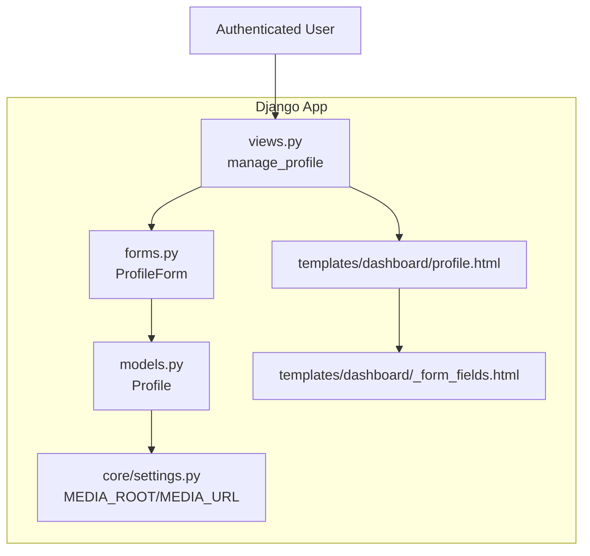
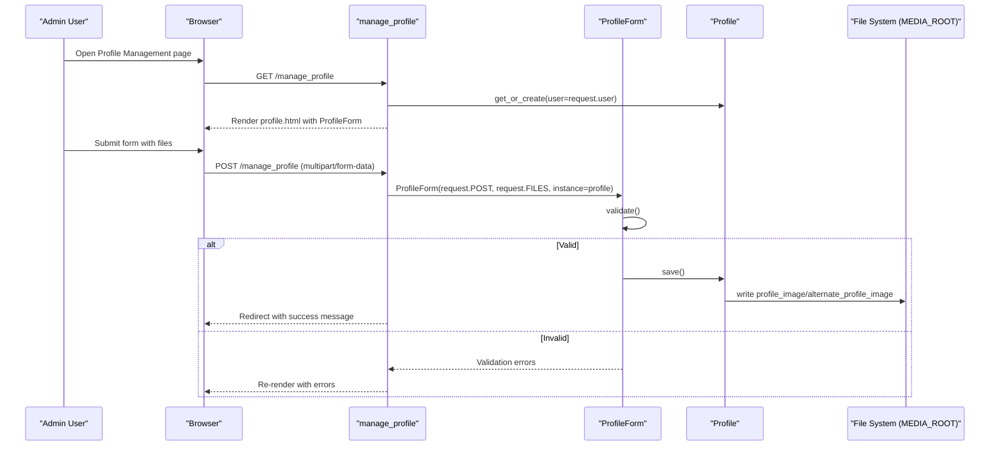
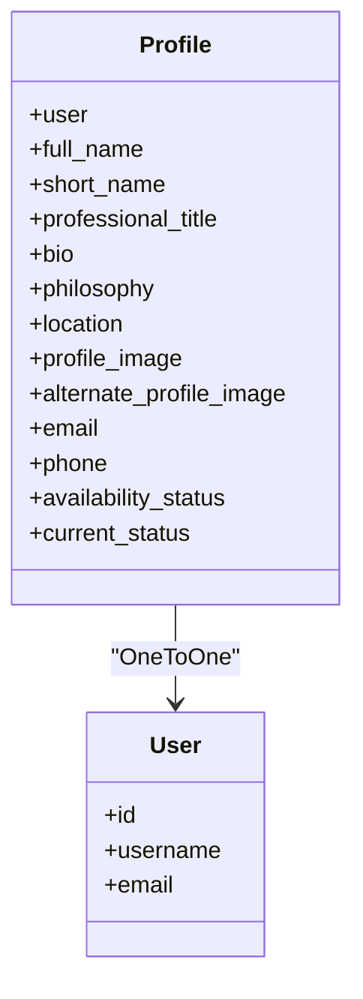
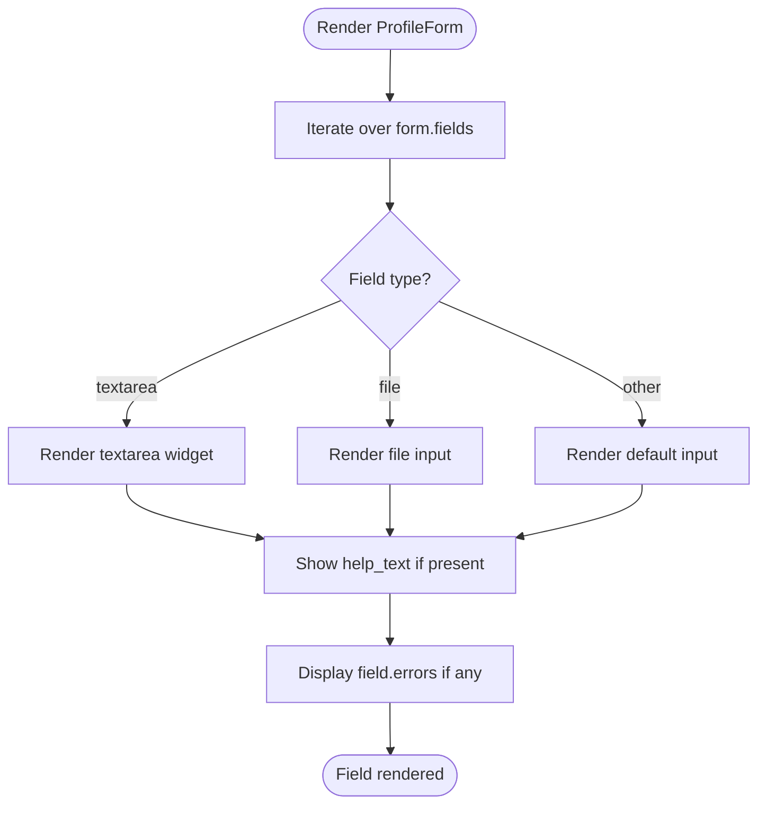
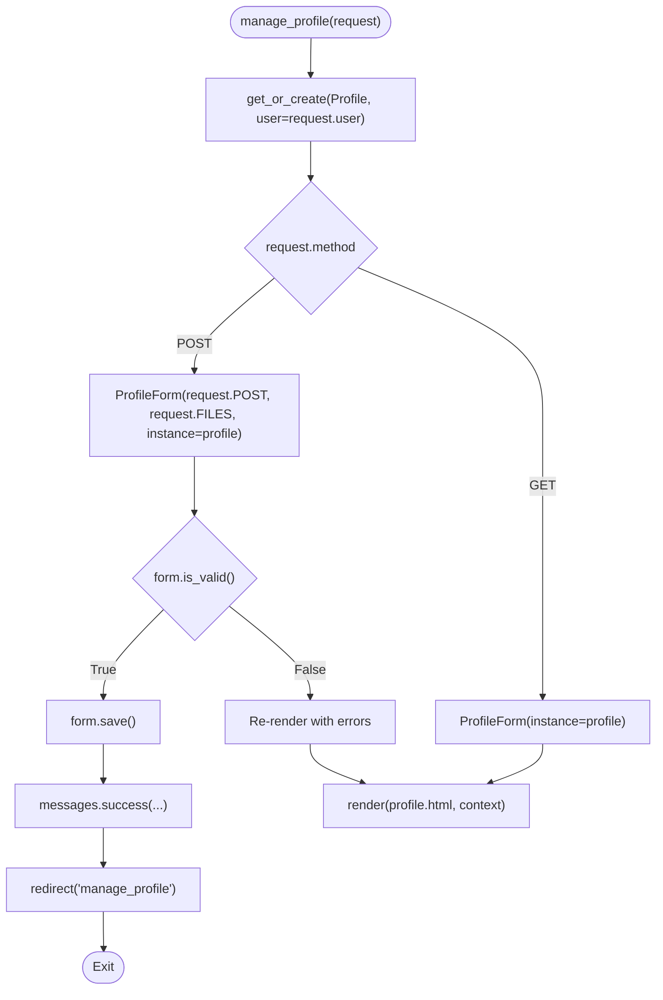
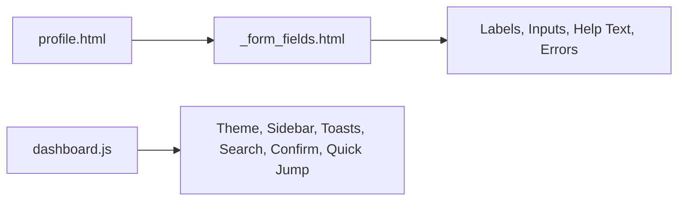
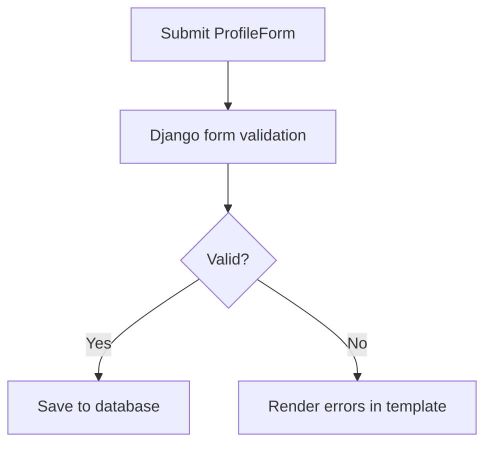
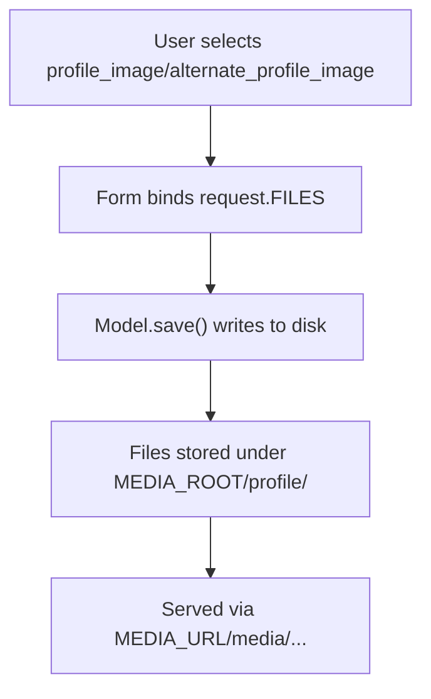
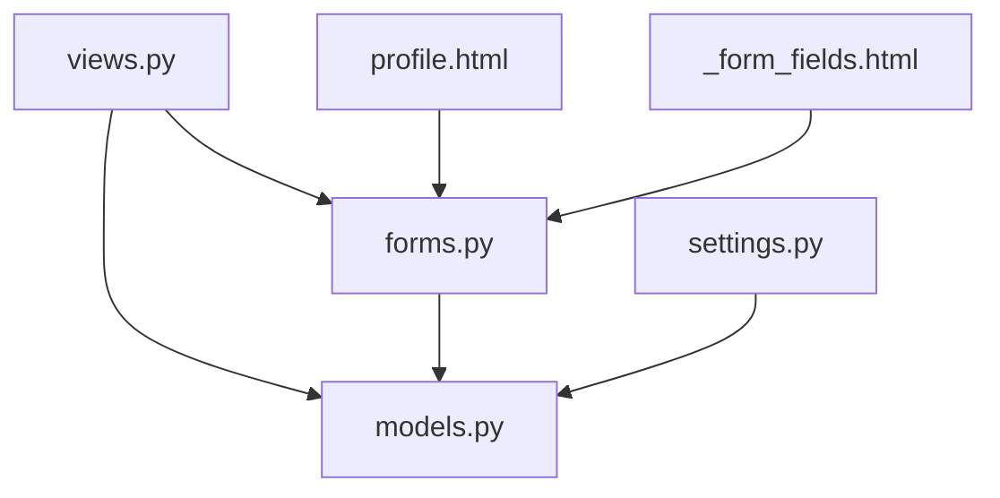

# Profile Management

<cite>
**Referenced Files in This Document**
- [models.py](file://portfolio/models.py)
- [forms.py](file://portfolio/forms.py)
- [views.py](file://portfolio/views.py)
- [profile.html](file://templates/dashboard/profile.html)
- [_form_fields.html](file://templates/dashboard/_form_fields.html)
- [dashboard.js](file://static/dashboard.js)
- [settings.py](file://core/settings.py)
</cite>

## Table of Contents
1. [Introduction](#introduction)
2. [Project Structure](#project-structure)
3. [Core Components](#core-components)
4. [Architecture Overview](#architecture-overview)
5. [Detailed Component Analysis](#detailed-component-analysis)
6. [Dependency Analysis](#dependency-analysis)
7. [Performance Considerations](#performance-considerations)
8. [Troubleshooting Guide](#troubleshooting-guide)
9. [Conclusion](#conclusion)

## Introduction
This document explains the profile management system used to edit personal information and manage profile assets. It covers:
- The user-facing editing interface for name, bio, location, availability status, and avatar upload
- Form validation and rendering
- Image processing and file storage configuration
- Security considerations for file uploads
- Customization options for profile fields and display
- How the Profile model relates to Django’s User model

The system is built with Django views, ModelForms, templates, and static assets.

## Project Structure
The profile management feature spans models, forms, views, templates, and settings:
- Data model: Profile (and related entities)
- Forms: ProfileForm for editing
- Views: manage_profile handles GET/POST for profile updates
- Templates: profile.html and shared field renderer _form_fields.html
- Static UI: dashboard.js provides general dashboard interactions
- Settings: media storage configuration

**Diagram sources**
- [models.py:4-20](file://portfolio/models.py#L4-L20)
- [forms.py:4-11](file://portfolio/forms.py#L4-L11)
- [views.py:85-97](file://portfolio/views.py#L85-L97)
- [profile.html:13-36](file://templates/dashboard/profile.html#L13-L36)
- [_form_fields.html:1-25](file://templates/dashboard/_form_fields.html#L1-L25)
- [settings.py:87-89](file://core/settings.py#L87-L89)

**Section sources**
- [models.py:4-20](file://portfolio/models.py#L4-L20)
- [forms.py:4-11](file://portfolio/forms.py#L4-L11)
- [views.py:85-97](file://portfolio/views.py#L85-L97)
- [profile.html:13-36](file://templates/dashboard/profile.html#L13-L36)
- [_form_fields.html:1-25](file://templates/dashboard/_form_fields.html#L1-L25)
- [settings.py:87-89](file://core/settings.py#L87-L89)

## Core Components
- Profile model defines personal data fields including name, bio, location, availability status, and profile images.
- ProfileForm is a ModelForm that renders all Profile fields with custom widgets for text areas.
- manage_profile view ensures an authenticated user can create or update their Profile and redirects after success.
- profile.html template renders the form with CSRF protection and multipart encoding for file uploads.
- _form_fields.html template iterates over form fields, rendering labels, help text, and errors consistently.
- settings.py configures MEDIA_URL and MEDIA_ROOT for storing uploaded files.

Key responsibilities:
- Data persistence: Profile model
- Input binding and validation: ProfileForm
- Request handling and messages: manage_profile view
- Rendering and UX: profile.html and _form_fields.html
- File storage: MEDIA_ROOT/MEDIA_URL

**Section sources**
- [models.py:4-20](file://portfolio/models.py#L4-L20)
- [forms.py:4-11](file://portfolio/forms.py#L4-L11)
- [views.py:85-97](file://portfolio/views.py#L85-L97)
- [profile.html:13-36](file://templates/dashboard/profile.html#L13-L36)
- [_form_fields.html:1-25](file://templates/dashboard/_form_fields.html#L1-L25)
- [settings.py:87-89](file://core/settings.py#L87-L89)

## Architecture Overview
The profile editing flow uses a standard Django request-response cycle with form submission and file uploads.

**Diagram sources**
- [views.py:85-97](file://portfolio/views.py#L85-L97)
- [forms.py:4-11](file://portfolio/forms.py#L4-L11)
- [models.py:4-20](file://portfolio/models.py#L4-L20)
- [settings.py:87-89](file://core/settings.py#L87-L89)

## Detailed Component Analysis

### Profile Model and Relationship to Django User
- One-to-one relationship with Django’s User via a OneToOneField.
- Personal identity fields include full_name, short_name, professional_title, email.
- Descriptive content includes bio and philosophy.
- Location and availability are represented by location and availability_status.
- Avatar storage uses two image fields: profile_image and alternate_profile_image, both stored under the profile directory.

**Diagram sources**
- [models.py:4-20](file://portfolio/models.py#L4-L20)

**Section sources**
- [models.py:4-20](file://portfolio/models.py#L4-L20)

### ProfileForm and Field Rendering
- ProfileForm is a ModelForm bound to Profile with fields set to all model fields.
- Textarea widgets are customized for bio and philosophy to improve editor experience.
- The shared template _form_fields.html renders each field with consistent styling, labels, help text, and error messages.

**Diagram sources**
- [forms.py:4-11](file://portfolio/forms.py#L4-L11)
- [_form_fields.html:1-25](file://templates/dashboard/_form_fields.html#L1-L25)

**Section sources**
- [forms.py:4-11](file://portfolio/forms.py#L4-L11)
- [_form_fields.html:1-25](file://templates/dashboard/_form_fields.html#L1-L25)

### manage_profile View and Request Handling
- Ensures the current user has a Profile; creates one if missing.
- On GET, initializes ProfileForm with existing Profile instance.
- On POST, binds request data and files, validates, saves, and redirects on success.
- Uses Django messages to inform users about successful updates.

**Diagram sources**
- [views.py:85-97](file://portfolio/views.py#L85-L97)

**Section sources**
- [views.py:85-97](file://portfolio/views.py#L85-L97)

### Template Layer and User Experience
- profile.html sets up the form with proper method and enctype for file uploads, includes CSRF token, and delegates field rendering to _form_fields.html.
- _form_fields.html provides consistent label rendering, required indicators, help text, and error display.
- The dashboard.js script provides general dashboard interactions such as theme toggling, sidebar behavior, toasts, table search, confirm dialogs, password visibility toggles, quick jump navigation, and footer year updates. It does not implement drag-and-drop or image preview for profile uploads.

**Diagram sources**
- [profile.html:13-36](file://templates/dashboard/profile.html#L13-L36)
- [_form_fields.html:1-25](file://templates/dashboard/_form_fields.html#L1-L25)
- [dashboard.js:1-287](file://static/dashboard.js#L1-L287)

**Section sources**
- [profile.html:13-36](file://templates/dashboard/profile.html#L13-L36)
- [_form_fields.html:1-25](file://templates/dashboard/_form_fields.html#L1-L25)
- [dashboard.js:1-287](file://static/dashboard.js#L1-L287)

### Form Validation
- Validation is handled by Django’s ModelForm based on Profile model field constraints (e.g., CharField max_length, EmailField format).
- The template displays non-field errors and per-field errors using _form_fields.html.
- No custom validators are defined in ProfileForm; extend it to add additional rules if needed.

**Diagram sources**
- [forms.py:4-11](file://portfolio/forms.py#L4-L11)
- [_form_fields.html:1-25](file://templates/dashboard/_form_fields.html#L1-L25)

**Section sources**
- [forms.py:4-11](file://portfolio/forms.py#L4-L11)
- [_form_fields.html:1-25](file://templates/dashboard/_form_fields.html#L1-L25)

### Image Processing, File Storage, and Upload Behavior
- Uploaded images are stored using Django’s ImageField with upload_to='profile/'.
- Media root and URL are configured in settings.py, enabling file storage under MEDIA_ROOT and serving via MEDIA_URL.
- The view passes request.FILES to the form, allowing image fields to be updated.
- There is no explicit server-side image resizing or format validation in the provided code; consider adding validators and processors for security and performance.

**Diagram sources**
- [models.py:12-13](file://portfolio/models.py#L12-L13)
- [views.py:85-97](file://portfolio/views.py#L85-L97)
- [settings.py:87-89](file://core/settings.py#L87-L89)

**Section sources**
- [models.py:12-13](file://portfolio/models.py#L12-L13)
- [views.py:85-97](file://portfolio/views.py#L85-L97)
- [settings.py:87-89](file://core/settings.py#L87-L89)

### Security Considerations for File Uploads
- Authentication: The manage_profile view is protected by login_required, ensuring only authenticated users can update profiles.
- CSRF Protection: The template includes , protecting against cross-site request forgery.
- Content-Type: The form uses enctype="multipart/form-data" for file uploads.
- File Safety: No explicit file type or size validation is implemented in the provided code. For production, add:
  - Allowed MIME types and extensions for images
  - Maximum file size limits
  - Server-side image validation and optional resizing
  - Secure storage permissions and isolation
- XSS Mitigation: Avoid rendering untrusted HTML from profile fields without sanitization.

**Section sources**
- [views.py:85-97](file://portfolio/views.py#L85-L97)
- [profile.html:23-24](file://templates/dashboard/profile.html#L23-L24)

### Customization Options for Profile Fields and Display
- To customize field behavior, extend ProfileForm:
  - Add custom validators for fields like bio, location, or availability_status
  - Restrict allowed image formats and sizes
  - Provide custom widgets for better UX (e.g., rich text editors)
- To change displayed fields, adjust ProfileForm.Meta.fields or override individual fields in the form.
- To alter how fields render, modify _form_fields.html or add custom template tags.

[No sources needed since this section provides general guidance]

## Dependency Analysis
The profile management components have clear dependencies:
- views.py depends on forms.py and models.py
- forms.py depends on models.py
- templates depend on forms and context variables
- settings.py provides global media configuration

**Diagram sources**
- [views.py:85-97](file://portfolio/views.py#L85-L97)
- [forms.py:4-11](file://portfolio/forms.py#L4-L11)
- [models.py:4-20](file://portfolio/models.py#L4-L20)
- [profile.html:13-36](file://templates/dashboard/profile.html#L13-L36)
- [_form_fields.html:1-25](file://templates/dashboard/_form_fields.html#L1-L25)
- [settings.py:87-89](file://core/settings.py#L87-L89)

**Section sources**
- [views.py:85-97](file://portfolio/views.py#L85-L97)
- [forms.py:4-11](file://portfolio/forms.py#L4-L11)
- [models.py:4-20](file://portfolio/models.py#L4-L20)
- [profile.html:13-36](file://templates/dashboard/profile.html#L13-L36)
- [_form_fields.html:1-25](file://templates/dashboard/_form_fields.html#L1-L25)
- [settings.py:87-89](file://core/settings.py#L87-L89)

## Performance Considerations
- Use select_related/prefetch_related when displaying related data to reduce queries.
- Optimize image storage:
  - Resize and compress images before saving to reduce bandwidth and storage costs
  - Consider using a CDN for static delivery of profile images
- Cache frequently accessed profile data at the application layer if needed.
- Avoid heavy operations during request time; offload image processing to background tasks if necessary.

[No sources needed since this section provides general guidance]

## Troubleshooting Guide
Common issues and resolutions:
- Images not appearing:
  - Ensure MEDIA_ROOT and MEDIA_URL are correctly configured in settings.py
  - Verify files are saved under MEDIA_ROOT/profile/
- Validation errors on submit:
  - Check field constraints in Profile model and add custom validators in ProfileForm if needed
- CSRF errors:
  - Confirm  is present in the form template
- Permission errors on upload:
  - Ensure the web server process has write permissions to MEDIA_ROOT
- Large file uploads failing:
  - Configure server-level limits (e.g., client_max_body_size in Nginx) and add form-level validation

**Section sources**
- [settings.py:87-89](file://core/settings.py#L87-L89)
- [profile.html:23-24](file://templates/dashboard/profile.html#L23-L24)
- [forms.py:4-11](file://portfolio/forms.py#L4-L11)

## Conclusion
The profile management system provides a secure, extensible foundation for editing personal information and managing profile images. It leverages Django’s authentication, forms, and file storage mechanisms. To enhance it further:
- Add robust file validation and image processing
- Implement drag-and-drop and live preview in the frontend
- Customize form fields and widgets for improved UX
- Harden security with strict file type checks and size limits

[No sources needed since this section summarizes without analyzing specific files]