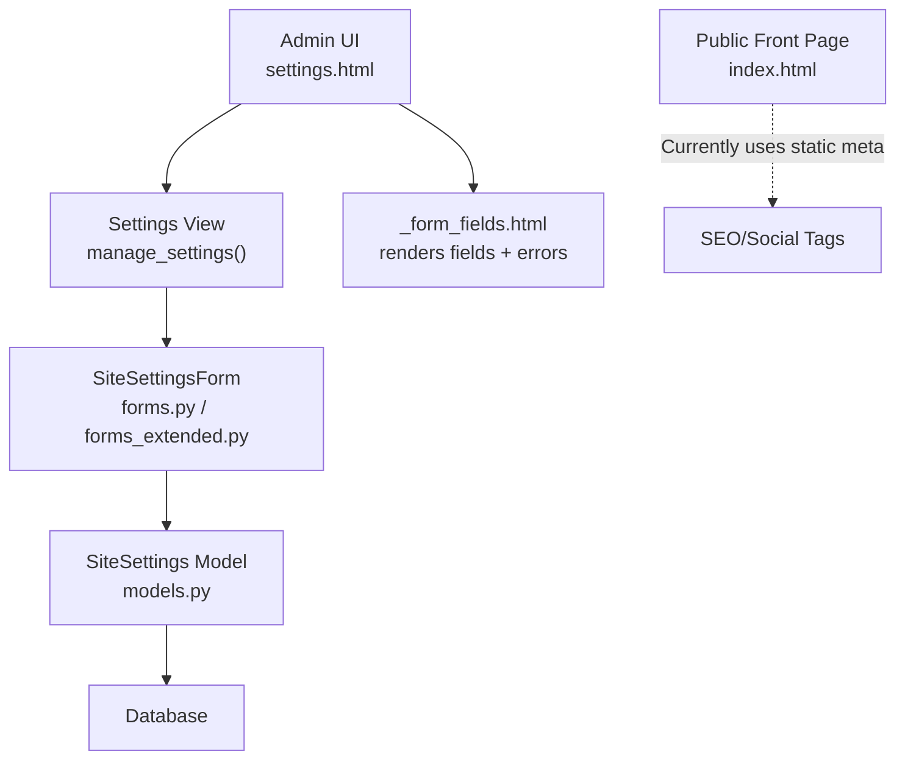
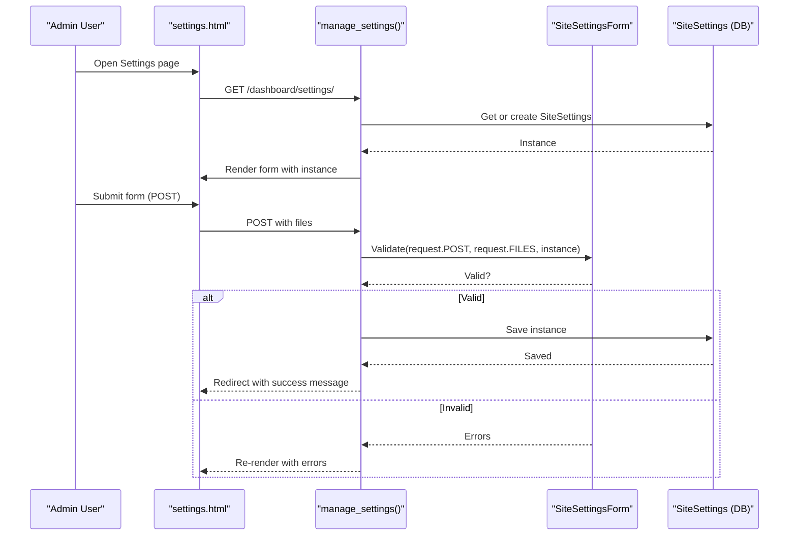
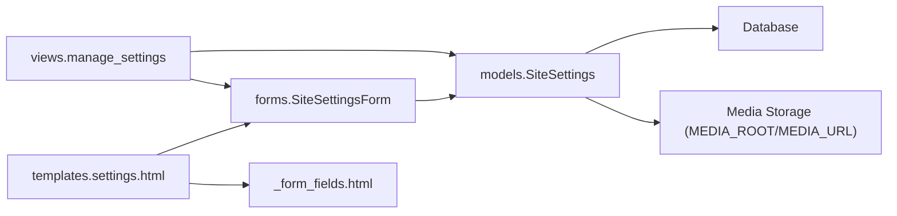
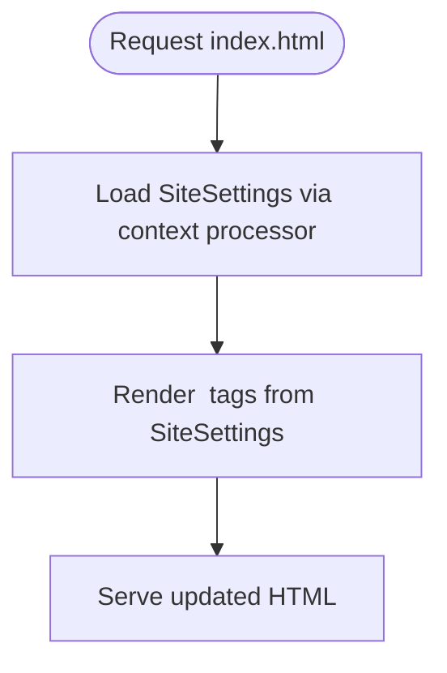

# Settings Management

<cite>
**Referenced Files in This Document**
- [models.py](file://portfolio/models.py)
- [forms.py](file://portfolio/forms.py)
- [forms_extended.py](file://portfolio/forms_extended.py)
- [views.py](file://portfolio/views.py)
- [settings.html](file://templates/dashboard/settings.html)
- [_form_fields.html](file://templates/dashboard/_form_fields.html)
- [context_processors.py](file://portfolio/context_processors.py)
- [core settings.py](file://core/settings.py)
- [index.html](file://index.html)
</cite>

## Table of Contents
1. [Introduction](#introduction)
2. [Project Structure](#project-structure)
3. [Core Components](#core-components)
4. [Architecture Overview](#architecture-overview)
5. [Detailed Component Analysis](#detailed-component-analysis)
6. [Dependency Analysis](#dependency-analysis)
7. [Performance Considerations](#performance-considerations)
8. [Troubleshooting Guide](#troubleshooting-guide)
9. [Conclusion](#conclusion)
10. [Appendices](#appendices)

## Introduction
This document explains the settings management interface for the portfolio application. It covers how SEO configuration, social media integration, site-wide settings, and global preferences are modeled, validated, persisted, and used by the public-facing pages. It also provides guidance on adding new settings, validating configuration inputs, migrating settings between environments, and understanding how settings influence the public portfolio display.

## Project Structure
The settings feature spans a small set of focused files:
- Data model for site-wide settings
- Forms to render and validate settings
- Views to load, create, and save settings
- Templates for the admin settings UI
- Global project configuration (media/static paths)
- Public front page that currently contains static SEO tags

**Diagram sources**
- [settings.html:1-31](file://templates/dashboard/settings.html#L1-L31)
- [views.py:209-221](file://portfolio/views.py#L209-L221)
- [forms.py:18-22](file://portfolio/forms.py#L18-L22)
- [forms_extended.py:74-78](file://portfolio/forms_extended.py#L74-L78)
- [models.py:277-298](file://portfolio/models.py#L277-L298)
- [_form_fields.html:1-25](file://templates/dashboard/_form_fields.html#L1-L25)
- [index.html:1-40](file://index.html#L1-L40)

**Section sources**
- [settings.html:1-31](file://templates/dashboard/settings.html#L1-L31)
- [views.py:209-221](file://portfolio/views.py#L209-L221)
- [forms.py:18-22](file://portfolio/forms.py#L18-L22)
- [forms_extended.py:74-78](file://portfolio/forms_extended.py#L74-L78)
- [models.py:277-298](file://portfolio/models.py#L277-L298)
- [_form_fields.html:1-25](file://templates/dashboard/_form_fields.html#L1-L25)
- [index.html:1-40](file://index.html#L1-L40)

## Core Components
- SiteSettings model defines all site-wide configuration values including SEO metadata, Open Graph and Twitter card fields, favicon, footer text, and copyright.
- SiteSettingsForm is a Django ModelForm bound to SiteSettings; it renders all fields and applies field-level validation from the model.
- manage_settings view ensures a single SiteSettings instance exists, handles POST submissions with file uploads, validates via the form, saves changes, and redirects back to the settings page.
- The settings template renders the form using a shared partial that displays labels, help text, and errors consistently.
- Global project settings define media and static file handling so uploaded images (favicon, OG image, Twitter image) are stored and served correctly.

Key responsibilities:
- Persistence: One row in the database represents global site settings.
- Validation: Enforced by Django model fields and form rendering.
- Presentation: Admin UI uses a consistent form layout; public pages can consume these values once integrated into templates or API responses.

**Section sources**
- [models.py:277-298](file://portfolio/models.py#L277-L298)
- [forms.py:18-22](file://portfolio/forms.py#L18-L22)
- [forms_extended.py:74-78](file://portfolio/forms_extended.py#L74-L78)
- [views.py:209-221](file://portfolio/views.py#L209-L221)
- [settings.html:1-31](file://templates/dashboard/settings.html#L1-L31)
- [_form_fields.html:1-25](file://templates/dashboard/_form_fields.html#L1-L25)
- [core settings.py:87-94](file://core/settings.py#L87-L94)

## Architecture Overview
The settings flow connects the admin UI to the database and ultimately influences the public site when templates or APIs consume SiteSettings.

**Diagram sources**
- [views.py:209-221](file://portfolio/views.py#L209-L221)
- [forms.py:18-22](file://portfolio/forms.py#L18-L22)
- [settings.html:17-27](file://templates/dashboard/settings.html#L17-L27)
- [models.py:277-298](file://portfolio/models.py#L277-L298)

## Detailed Component Analysis

### Settings Model Structure
The SiteSettings model centralizes site-wide configuration:
- SEO and metadata: site title, meta description, keywords, author, canonical URL
- Social sharing: Open Graph title/description/image, Twitter title/description/image
- Branding and legal: favicon, footer text, copyright text

These fields map directly to HTML <meta> tags and link elements used by search engines and social platforms.

Complexity considerations:
- All fields are simple types except ImageField, which stores references under MEDIA_ROOT and serves via MEDIA_URL.
- Optional fields use blank=True and null=True to allow partial configuration.

**Section sources**
- [models.py:277-298](file://portfolio/models.py#L277-L298)

### Form Validation for Configuration Values
Validation is driven by Django’s model and form layer:
- Field types enforce constraints (e.g., URLField validates URLs).
- Required fields cannot be empty.
- File uploads are handled by the form and saved to disk per MEDIA_ROOT.
- The settings template displays field-level errors and non-field errors.

To add custom validation:
- Add clean_<field>() methods to SiteSettingsForm.
- Or add validators to the model field definitions.

**Section sources**
- [forms.py:18-22](file://portfolio/forms.py#L18-L22)
- [forms_extended.py:74-78](file://portfolio/forms_extended.py#L74-L78)
- [_form_fields.html:1-25](file://templates/dashboard/_form_fields.html#L1-L25)
- [settings.html:10-21](file://templates/dashboard/settings.html#L10-L21)

### Persistence Mechanisms
- The view ensures exactly one SiteSettings row exists by creating a default if none is present.
- On valid POST, the form saves the instance, persisting all fields including uploaded images.
- Media storage is configured globally so images are written to MEDIA_ROOT and accessible at MEDIA_URL.

Migration notes:
- The initial migration includes SiteSettings fields. Any future model changes require generating and applying migrations.

**Section sources**
- [views.py:209-221](file://portfolio/views.py#L209-L221)
- [core settings.py:87-94](file://core/settings.py#L87-L94)
- [models.py:277-298](file://portfolio/models.py#L277-L298)

### How Settings Affect the Public Portfolio Display
Current state:
- The public front page (index.html) contains static meta tags for SEO and social sharing. These do not yet read from SiteSettings.
- To make settings dynamic, integrate SiteSettings into the template context or serve them via an API consumed by the frontend.

Recommended integration points:
- Template context processor to inject SiteSettings into every template.
- Update index.html to render meta tags from SiteSettings instead of hard-coded values.
- Optionally expose SiteSettings through the existing portfolio API endpoint for client-side consumption.

Impact areas:
- Search engine snippets and titles
- Social sharing previews (Open Graph and Twitter cards)
- Browser tab icon (favicon)
- Footer and copyright text

**Section sources**
- [index.html:1-40](file://index.html#L1-L40)
- [context_processors.py:1-9](file://portfolio/context_processors.py#L1-L9)
- [views.py:335-457](file://portfolio/views.py#L335-L457)

### Adding New Settings
Steps to add a new setting:
1. Extend the SiteSettings model with a new field.
2. If needed, customize the form (e.g., add widgets or validation).
3. Run migrations to update the database schema.
4. Update the public templates or API to consume the new field.
5. Test saving and displaying the value.

Example pattern:
- Add a new CharField or TextField to SiteSettings.
- Use a widget override in the form Meta class if you need a specific input type.
- Ensure the field is optional or required based on your needs.

**Section sources**
- [models.py:277-298](file://portfolio/models.py#L277-L298)
- [forms.py:18-22](file://portfolio/forms.py#L18-L22)
- [forms_extended.py:74-78](file://portfolio/forms_extended.py#L74-L78)

### Validating Configuration Inputs
Built-in validation:
- URLField enforces URL format.
- EmailField enforces email format where applicable.
- Required fields prevent empty submissions.

Custom validation:
- Add clean_<field>() methods to SiteSettingsForm to implement business rules.
- Raise ValidationError for invalid values; errors will appear next to the relevant field in the UI.

Best practices:
- Keep validation close to the data source (model or form).
- Provide clear error messages to guide users.

**Section sources**
- [forms.py:18-22](file://portfolio/forms.py#L18-L22)
- [_form_fields.html:14-21](file://templates/dashboard/_form_fields.html#L14-L21)

### Migrating Settings Between Environments
Because settings are stored in the database:
- Export/import the database or use Django’s dumpdata/loaddata to move SiteSettings across environments.
- Ensure MEDIA_ROOT paths are consistent or adjust deployment to serve media correctly.
- After deploying migrations, verify the SiteSettings table schema matches expectations.

Operational tips:
- Back up the database before migrations.
- Use environment variables for sensitive configuration (e.g., domain-specific canonical URLs).
- Validate that uploaded images exist in the target environment’s media storage.

**Section sources**
- [core settings.py:87-94](file://core/settings.py#L87-L94)
- [models.py:277-298](file://portfolio/models.py#L277-L298)

## Dependency Analysis
The settings subsystem has minimal external dependencies and tight cohesion:
- views.py depends on models.py and forms.py to handle requests and persistence.
- templates depend on the form object to render fields and errors.
- core settings.py configures media/static paths used by uploaded images.

**Diagram sources**
- [views.py:209-221](file://portfolio/views.py#L209-L221)
- [forms.py:18-22](file://portfolio/forms.py#L18-L22)
- [models.py:277-298](file://portfolio/models.py#L277-L298)
- [settings.html:1-31](file://templates/dashboard/settings.html#L1-L31)
- [_form_fields.html:1-25](file://templates/dashboard/_form_fields.html#L1-L25)
- [core settings.py:87-94](file://core/settings.py#L87-L94)

**Section sources**
- [views.py:209-221](file://portfolio/views.py#L209-L221)
- [forms.py:18-22](file://portfolio/forms.py#L18-L22)
- [models.py:277-298](file://portfolio/models.py#L277-L298)
- [settings.html:1-31](file://templates/dashboard/settings.html#L1-L31)
- [_form_fields.html:1-25](file://templates/dashboard/_form_fields.html#L1-L25)
- [core settings.py:87-94](file://core/settings.py#L87-L94)

## Performance Considerations
- Single-row design: There is only one SiteSettings instance, so reads are fast and contention is minimal.
- Image handling: Large images increase upload time and storage size. Consider compressing images before upload or adding size limits in the form.
- Template rendering: When integrating SiteSettings into templates, avoid unnecessary queries by caching or passing context once per request.

[No sources needed since this section provides general guidance]

## Troubleshooting Guide
Common issues and resolutions:
- Form does not save: Check that the view passes both request.POST and request.FILES to the form and that enctype="multipart/form-data" is set in the form tag.
- Validation errors: Inspect field-level errors rendered by _form_fields.html; ensure required fields are filled and URLs are valid.
- Images not appearing: Verify MEDIA_ROOT and MEDIA_URL are configured and that the server serves media files in production.
- Settings not affecting public page: Confirm that index.html or the API now consumes SiteSettings; otherwise, the page still uses static values.

Relevant code paths:
- Form submission and saving logic
- Error rendering in the settings template
- Media configuration

**Section sources**
- [views.py:209-221](file://portfolio/views.py#L209-L221)
- [settings.html:10-21](file://templates/dashboard/settings.html#L10-L21)
- [_form_fields.html:14-21](file://templates/dashboard/_form_fields.html#L14-L21)
- [core settings.py:87-94](file://core/settings.py#L87-L94)

## Conclusion
The settings management interface provides a robust foundation for managing SEO, social sharing, and site-wide configuration. The current implementation persists settings to the database and offers a clean admin UI. To fully leverage these settings on the public site, integrate them into the front-end templates or API so that meta tags, social previews, favicon, and footer content reflect the configured values. Follow the guidance above to extend, validate, and migrate settings safely across environments.

[No sources needed since this section summarizes without analyzing specific files]

## Appendices

### Example: Integrating Settings into the Public Front Page
Conceptual steps:
- Create or update a context processor to include SiteSettings in every template context.
- Replace static meta tags in index.html with dynamic values from SiteSettings.
- Ensure canonical URL, favicon, and social images resolve correctly in production.

[No sources needed since this diagram shows conceptual workflow, not actual code structure]