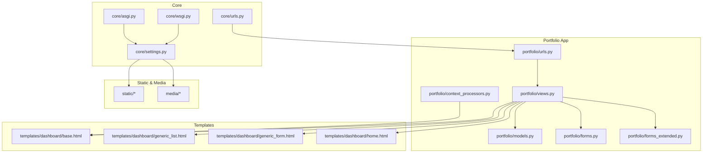
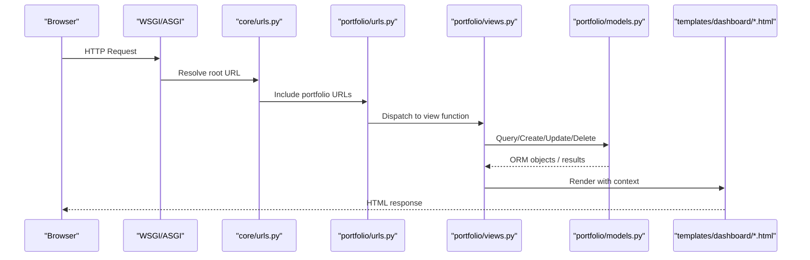
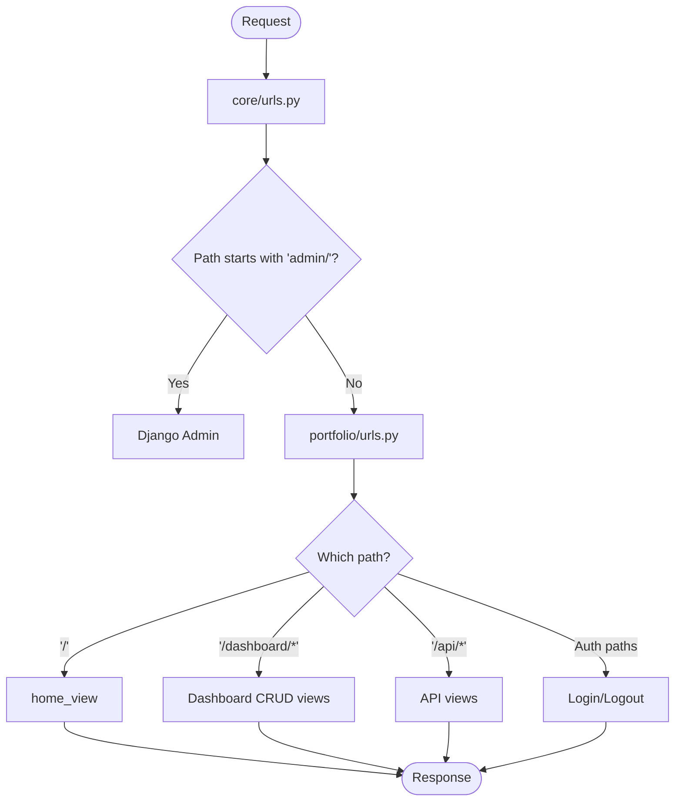
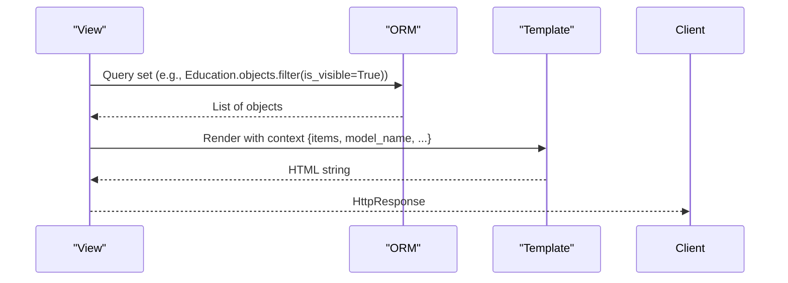
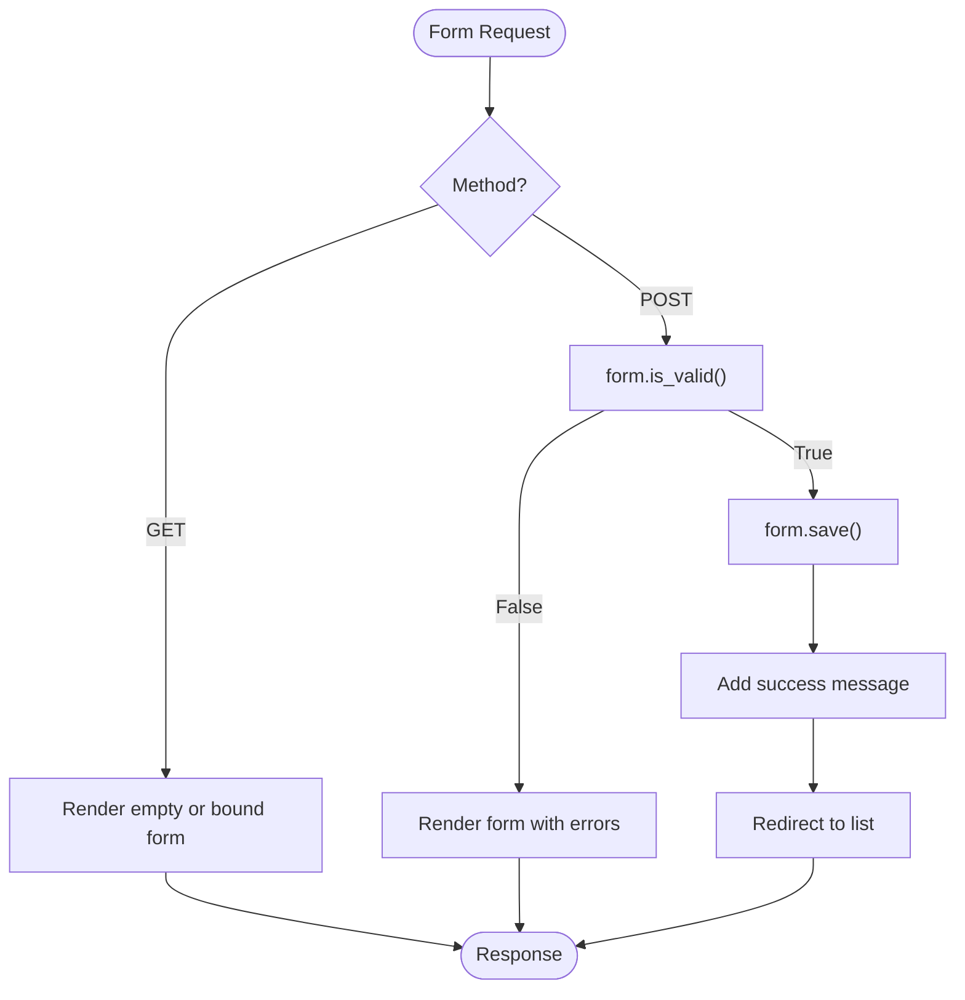
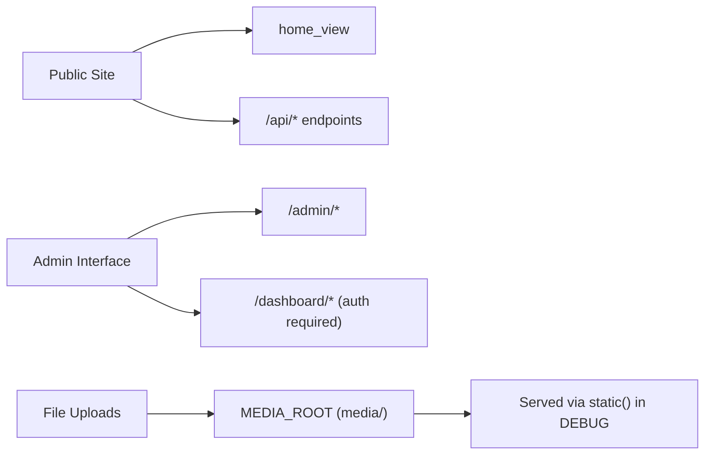
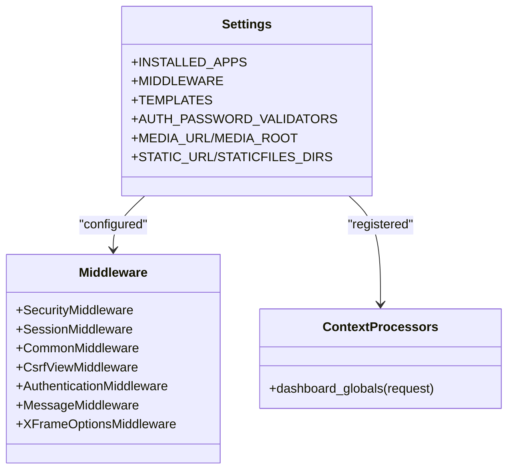
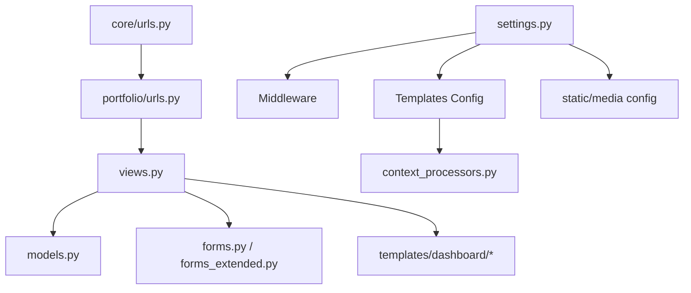

# Architecture Overview

<cite>
**Referenced Files in This Document**
- [settings.py](file://core/settings.py)
- [urls.py (core)](file://core/urls.py)
- [urls.py (portfolio)](file://portfolio/urls.py)
- [views.py](file://portfolio/views.py)
- [models.py](file://portfolio/models.py)
- [forms.py](file://portfolio/forms.py)
- [forms_extended.py](file://portfolio/forms_extended.py)
- [context_processors.py](file://portfolio/context_processors.py)
- [base.html](file://templates/dashboard/base.html)
- [generic_list.html](file://templates/dashboard/generic_list.html)
- [generic_form.html](file://templates/dashboard/generic_form.html)
- [home.html](file://templates/dashboard/home.html)
- [wsgi.py](file://core/wsgi.py)
- [asgi.py](file://core/asgi.py)
</cite>

## Table of Contents
1. Introduction
2. Project Structure
3. Core Components
4. Architecture Overview
5. Detailed Component Analysis
6. Dependency Analysis
7. Performance Considerations
8. Troubleshooting Guide
9. Conclusion

## Introduction
This document explains the architecture of the Portfolio CMS built with Django using the MTV (Model-Template-View) pattern. It clarifies how MTV differs from traditional MVC, maps the request flow from URL routing to views and templates, and details data flows through models and forms. It also documents system boundaries (public site, admin dashboard, API endpoints), file upload handling, and cross-cutting concerns such as authentication, security middleware, and template inheritance.

## Project Structure
The project is organized into:
- core: Django project configuration (settings, URLs, WSGI/ASGI entry points)
- portfolio: Application logic (models, views, forms, app-level URLs, context processors)
- templates/dashboard: Reusable admin dashboard templates with base and generic list/form templates
- static: Dashboard CSS and JS assets
- media: Uploaded files directory configured via settings
- assets: Static content for the public front-end (images, icons, etc.)

**Diagram sources**
- [settings.py:34-72](file://core/settings.py#L34-L72)
- [urls.py (core):22-28](file://core/urls.py#L22-L28)
- [urls.py (portfolio):4-43](file://portfolio/urls.py#L4-L43)
- [views.py:21-439](file://portfolio/views.py#L21-L439)
- [models.py:4-298](file://portfolio/models.py#L4-L298)
- [forms.py:4-22](file://portfolio/forms.py#L4-L22)
- [forms_extended.py:4-78](file://portfolio/forms_extended.py#L4-L78)
- [context_processors.py:4-8](file://portfolio/context_processors.py#L4-L8)
- [base.html:1-188](file://templates/dashboard/base.html#L1-L188)

**Section sources**
- [settings.py:19-142](file://core/settings.py#L19-L142)
- [urls.py (core):17-30](file://core/urls.py#L17-L30)
- [urls.py (portfolio):1-44](file://portfolio/urls.py#L1-L44)

## Core Components
- Settings and Middleware: Security, sessions, CSRF, auth, messages, clickjacking protection; template dirs and context processors; database, media, and static file configuration.
- URL Routing: Root URLs include admin and delegate all other routes to the portfolio app.
- Views: Public home view, authenticated dashboard CRUD via a generic helper, message inbox management, and JSON APIs for portfolio data and contact submissions.
- Models: Domain entities for profile, hero roles, education, experience, skills, projects, certificates, workshops, achievements, services, technologies, social links, resumes, contact messages, and site settings.
- Forms: ModelForms for profile, hero roles, site settings, and extended forms for each domain model.
- Templates: Base dashboard layout with sidebar navigation and reusable generic list/form templates that render any model’s CRUD consistently.

**Section sources**
- [settings.py:45-72](file://core/settings.py#L45-L72)
- [urls.py (core):22-28](file://core/urls.py#L22-L28)
- [views.py:21-439](file://portfolio/views.py#L21-L439)
- [models.py:4-298](file://portfolio/models.py#L4-L298)
- [forms.py:4-22](file://portfolio/forms.py#L4-L22)
- [forms_extended.py:4-78](file://portfolio/forms_extended.py#L4-L78)
- [base.html:1-188](file://templates/dashboard/base.html#L1-L188)

## Architecture Overview
Django’s MTV pattern separates concerns into:
- Model: Data layer (portfolio/models.py)
- Template: Presentation layer (templates/dashboard/*.html)
- View: Request/response and business logic (portfolio/views.py)

Difference from MVC:
- In MVC, “Controller” handles request routing and orchestration; in Django, this role is split between URLconf (routing) and View (logic). The View acts like both controller and presenter orchestrator, while templates are pure presentation.

High-level request flow:
1. WSGI/ASGI loads settings and application.
2. core/urls.py includes portfolio/urls.py.
3. portfolio/urls.py maps paths to views.
4. Views query models, process forms, and render templates or return JSON.
5. Templates extend base.html and use context variables.

**Diagram sources**
- [wsgi.py:10-16](file://core/wsgi.py#L10-L16)
- [asgi.py:10-16](file://core/asgi.py#L10-L16)
- [urls.py (core):22-28](file://core/urls.py#L22-L28)
- [urls.py (portfolio):4-43](file://portfolio/urls.py#L4-L43)
- [views.py:21-439](file://portfolio/views.py#L21-L439)
- [models.py:4-298](file://portfolio/models.py#L4-L298)
- [base.html:1-188](file://templates/dashboard/base.html#L1-L188)

## Detailed Component Analysis

### URL Routing Flow
- Root URL configuration delegates to the portfolio app and mounts the Django admin at /admin/.
- Portfolio URLs define:
  - Public route: home page
  - Auth routes: login/logout
  - Dashboard CRUD routes for each module (projects, certificates, skills, education, experience, achievements, services, workshops, stats, tech, resume, socials, settings)
  - Message inbox routes
  - API routes: portfolio data and contact submission

**Diagram sources**
- [urls.py (core):22-28](file://core/urls.py#L22-L28)
- [urls.py (portfolio):4-43](file://portfolio/urls.py#L4-L43)

**Section sources**
- [urls.py (core):22-28](file://core/urls.py#L22-L28)
- [urls.py (portfolio):4-43](file://portfolio/urls.py#L4-L43)

### Data Flow Through Models to Templates
- Views fetch data from models (e.g., Profile, Education, Experience, Project, Certificate, Workshop, Achievement, Service, Technology, SocialLink, Resume, ContactMessage, SiteSettings).
- Context variables are passed to templates which extend base.html and render lists or forms.
- Generic list and form templates provide consistent UI across modules by receiving model_name, items, and form instances.

**Diagram sources**
- [views.py:21-439](file://portfolio/views.py#L21-L439)
- [models.py:4-298](file://portfolio/models.py#L4-L298)
- [generic_list.html:1-81](file://templates/dashboard/generic_list.html#L1-L81)
- [generic_form.html:1-63](file://templates/dashboard/generic_form.html#L1-L63)

**Section sources**
- [views.py:21-439](file://portfolio/views.py#L21-L439)
- [models.py:4-298](file://portfolio/models.py#L4-L298)
- [generic_list.html:1-81](file://templates/dashboard/generic_list.html#L1-L81)
- [generic_form.html:1-63](file://templates/dashboard/generic_form.html#L1-L63)

### Form Handling Patterns
- ModelForms defined in forms.py and forms_extended.py map directly to models with fields='__all__'.
- Views handle GET (render empty or instance-bound forms) and POST (validate, save, redirect with messages).
- Generic CRUD helper centralizes list/create/edit/delete flows for multiple modules, reducing duplication.
- File uploads handled via ImageField/FileField on models and multipart forms in templates.

**Diagram sources**
- [forms.py:4-22](file://portfolio/forms.py#L4-L22)
- [forms_extended.py:4-78](file://portfolio/forms_extended.py#L4-L78)
- [views.py:127-180](file://portfolio/views.py#L127-L180)
- [generic_form.html:24-59](file://templates/dashboard/generic_form.html#L24-L59)

**Section sources**
- [forms.py:4-22](file://portfolio/forms.py#L4-L22)
- [forms_extended.py:4-78](file://portfolio/forms_extended.py#L4-L78)
- [views.py:127-180](file://portfolio/views.py#L127-L180)
- [generic_form.html:24-59](file://templates/dashboard/generic_form.html#L24-L59)

### System Boundaries
- Public interface:
  - Home page served by home_view
  - API endpoints:
    - /api/portfolio/: Aggregates portfolio data for the frontend
    - /api/contact/: Accepts contact form submissions
- Admin interface:
  - Django admin mounted at /admin/
  - Custom dashboard under /dashboard/* protected by @login_required
- File uploads:
  - Media root configured in settings; served during development via core/urls.py when DEBUG is True
  - Models store images and files under media directories (profile/, education/, projects/, etc.)

**Diagram sources**
- [urls.py (core):22-28](file://core/urls.py#L22-L28)
- [settings.py:87-94](file://core/settings.py#L87-L94)
- [views.py:21-439](file://portfolio/views.py#L21-L439)

**Section sources**
- [urls.py (core):22-28](file://core/urls.py#L22-L28)
- [settings.py:87-94](file://core/settings.py#L87-L94)
- [views.py:21-439](file://portfolio/views.py#L21-L439)

### Cross-Cutting Concerns
- Authentication:
  - Login/logout views and @login_required decorators protect dashboard routes
  - Session-based auth via Django’s auth middleware
- Security middleware:
  - SecurityMiddleware, CsrfViewMiddleware, XFrameOptionsMiddleware enforce secure defaults
  - Password validators configured in settings
- Template inheritance:
  - All dashboard pages extend base.html, which provides sidebar, topbar, theme toggle, and message toasts
  - Generic list/form templates reuse common UI patterns across modules
- Global context:
  - Custom context processor injects unread message count into every dashboard template

**Diagram sources**
- [settings.py:34-72](file://core/settings.py#L34-L72)
- [context_processors.py:4-8](file://portfolio/context_processors.py#L4-L8)

**Section sources**
- [settings.py:45-112](file://core/settings.py#L45-L112)
- [context_processors.py:4-8](file://portfolio/context_processors.py#L4-L8)
- [base.html:1-188](file://templates/dashboard/base.html#L1-L188)

### Technical Decisions
- Generic CRUD helper reduces duplication across many modules, enabling consistent behavior and UI for list/create/edit/delete operations.
- Centralized templates (base, generic_list, generic_form) ensure consistent UX and simplify maintenance.
- Using ModelForms with fields='__all__' accelerates development while keeping validation and serialization close to models.
- Single JSON API endpoint aggregates portfolio data, simplifying frontend integration and enabling dynamic rendering without server-side templating for the public site.
- Separate media/static roots keep uploaded content distinct from versioned assets.

[No sources needed since this section summarizes architectural choices]

## Dependency Analysis
- core/settings.py configures apps, middleware, templates, and storage locations used throughout the project.
- core/urls.py includes portfolio/urls.py and mounts Django admin.
- portfolio/urls.py maps routes to views in portfolio/views.py.
- portfolio/views.py depends on:
  - portfolio/models.py for data access
  - portfolio/forms.py and forms_extended.py for input validation
  - templates/dashboard/* for rendering
  - Django contrib packages (admin, auth, messages, staticfiles)
- Templates depend on static assets and context processors for global data.

**Diagram sources**
- [settings.py:34-72](file://core/settings.py#L34-L72)
- [urls.py (core):22-28](file://core/urls.py#L22-L28)
- [urls.py (portfolio):4-43](file://portfolio/urls.py#L4-L43)
- [views.py:21-439](file://portfolio/views.py#L21-L439)
- [models.py:4-298](file://portfolio/models.py#L4-L298)
- [forms.py:4-22](file://portfolio/forms.py#L4-L22)
- [forms_extended.py:4-78](file://portfolio/forms_extended.py#L4-L78)
- [context_processors.py:4-8](file://portfolio/context_processors.py#L4-L8)

**Section sources**
- [settings.py:34-72](file://core/settings.py#L34-L72)
- [urls.py (core):22-28](file://core/urls.py#L22-L28)
- [urls.py (portfolio):4-43](file://portfolio/urls.py#L4-L43)
- [views.py:21-439](file://portfolio/views.py#L21-L439)

## Performance Considerations
- Use select_related/prefetch_related where relationships exist (e.g., projects with images/categories) to reduce N+1 queries.
- Keep generic list views efficient by ordering and limiting displayed fields.
- Avoid heavy computations in context processors; current unread count is lightweight but should remain so as data grows.
- Serve static/media via a proper web server in production rather than Django’s debug-time serving.

[No sources needed since this section provides general guidance]

## Troubleshooting Guide
- 404 on home page: home_view reads index.html from BASE_DIR; ensure the file exists or adjust the view to serve a template instead.
- Missing CSRF token: Ensure forms include  and CsrfViewMiddleware is enabled (it is by default).
- File upload issues: Verify MEDIA_ROOT and MEDIA_URL are set and that DEBUG is True for development serving; in production, configure a static file server.
- Authentication redirects: If redirected to login unexpectedly, check session middleware and that user is authenticated; verify credentials and that the user has appropriate permissions.
- API errors: Contact API returns JSON errors; inspect request body and status codes returned by the view.

**Section sources**
- [views.py:21-26](file://portfolio/views.py#L21-L26)
- [generic_form.html:24-25](file://templates/dashboard/generic_form.html#L24-L25)
- [settings.py:87-94](file://core/settings.py#L87-L94)
- [views.py:300-322](file://portfolio/views.py#L300-L322)

## Conclusion
The Portfolio CMS follows Django’s MTV pattern with clear separation of concerns: models encapsulate domain data, views coordinate logic and I/O, and templates present content via a shared dashboard layout. The architecture leverages generic helpers and reusable templates to scale the number of managed modules efficiently. Security middleware and authentication protect the admin dashboard, while a minimal JSON API exposes portfolio data to the frontend. Proper configuration of static and media assets ensures reliable asset delivery and file uploads.

[No sources needed since this section summarizes without analyzing specific files]