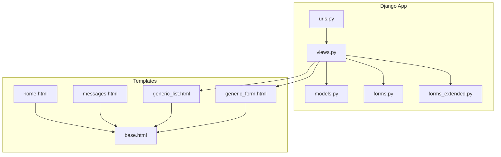
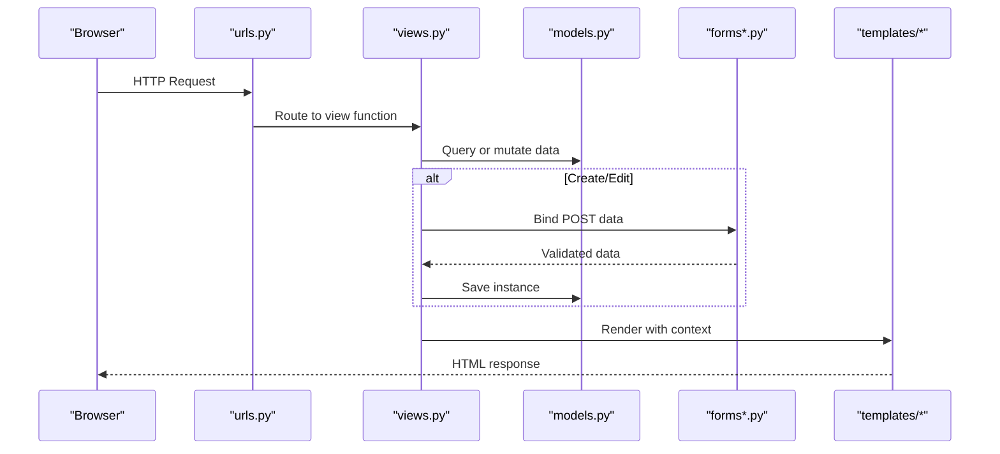
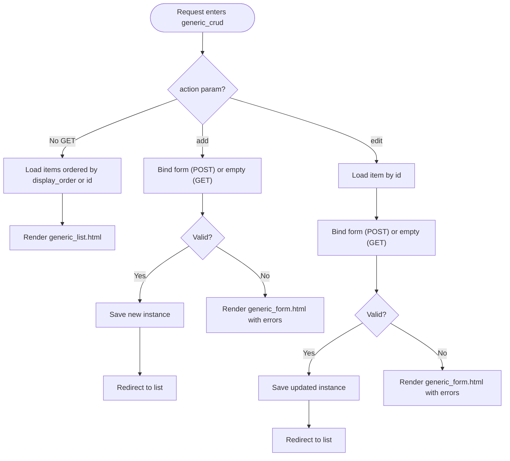
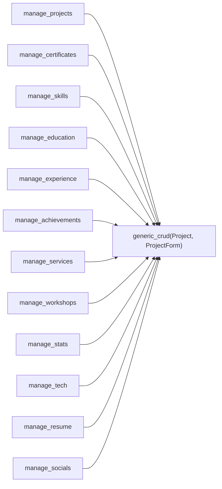
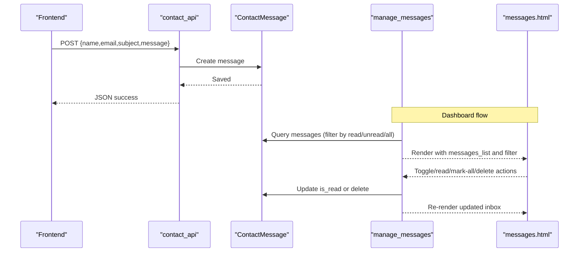
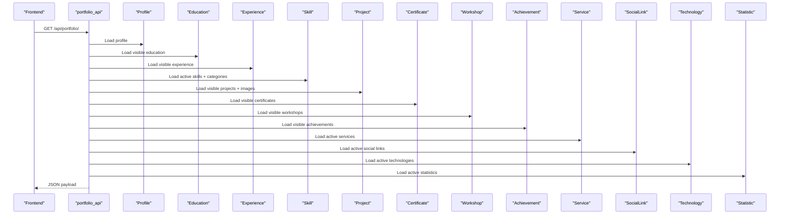
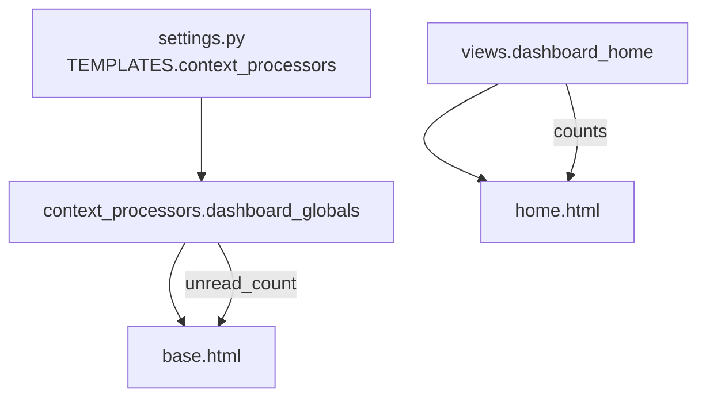
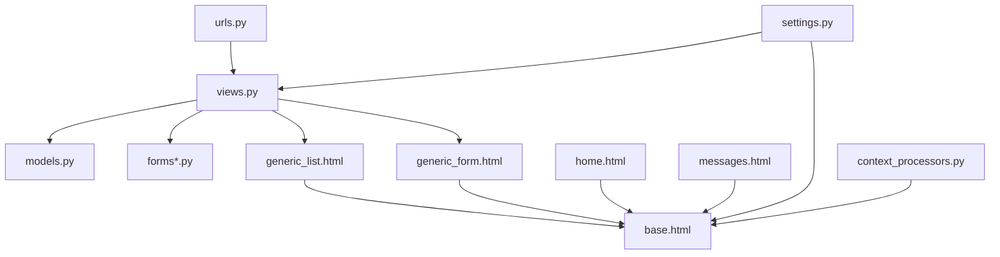

# Component Relationships and Dependencies

<cite>
**Referenced Files in This Document**
- [models.py](file://portfolio/models.py)
- [views.py](file://portfolio/views.py)
- [forms.py](file://portfolio/forms.py)
- [forms_extended.py](file://portfolio/forms_extended.py)
- [urls.py](file://portfolio/urls.py)
- [settings.py](file://core/settings.py)
- [context_processors.py](file://portfolio/context_processors.py)
- [base.html](file://templates/dashboard/base.html)
- [generic_list.html](file://templates/dashboard/generic_list.html)
- [generic_form.html](file://templates/dashboard/generic_form.html)
- [home.html](file://templates/dashboard/home.html)
- [messages.html](file://templates/dashboard/messages.html)
</cite>

## Table of Contents
1. Introduction
2. Project Structure
3. Core Components
4. Architecture Overview
5. Detailed Component Analysis
6. Dependency Analysis
7. Performance Considerations
8. Troubleshooting Guide
9. Conclusion

## Introduction
This document explains how the Portfolio CMS organizes components and manages dependencies across models, forms, views, templates, and URLs. It focuses on:
- How views depend on models and forms to implement a generic CRUD pattern that reduces duplication across many content types.
- How templates depend on views for context data and render consistent UIs using shared base and generic templates.
- How cross-cutting concerns like authentication, messages, and global dashboard state are applied consistently via Django middleware, decorators, and context processors.

## Project Structure
The project follows a standard Django layout with a single app named portfolio and shared templates under templates/dashboard. The core configuration lives in core/settings.py. URL routing is centralized in portfolio/urls.py and delegates to functions in portfolio/views.py. Data models are defined in portfolio/models.py, and form classes are split between portfolio/forms.py and portfolio/forms_extended.py. Templates live under templates/dashboard and include a reusable base template plus generic list and form templates used by all modules.

**Diagram sources**
- [urls.py:1-44](file://portfolio/urls.py#L1-L44)
- [views.py:1-458](file://portfolio/views.py#L1-L458)
- [models.py:1-298](file://portfolio/models.py#L1-L298)
- [forms.py:1-22](file://portfolio/forms.py#L1-L22)
- [forms_extended.py:1-78](file://portfolio/forms_extended.py#L1-L78)
- [base.html:1-188](file://templates/dashboard/base.html#L1-L188)
- [generic_list.html:1-81](file://templates/dashboard/generic_list.html#L1-L81)
- [generic_form.html:1-63](file://templates/dashboard/generic_form.html#L1-L63)
- [home.html:1-134](file://templates/dashboard/home.html#L1-L134)
- [messages.html:1-69](file://templates/dashboard/messages.html#L1-L69)

**Section sources**
- [urls.py:1-44](file://portfolio/urls.py#L1-L44)
- [settings.py:34-72](file://core/settings.py#L34-L72)

## Core Components
- Models define the domain entities such as Profile, Education, Experience, Skill, Project, Certificate, Workshop, Achievement, Service, Resume, SocialLink, ContactMessage, SiteSettings, and related categories and images.
- Forms provide ModelForm wrappers for creating and editing these entities. Some are grouped in forms.py (Profile, HeroRole, SiteSettings), while others are in forms_extended.py.
- Views implement request handling, including authentication, message management, and a generic CRUD helper that serves list, create, and edit pages for multiple models.
- Templates provide a shared base layout and reusable list/form templates to render consistent dashboards across modules.
- Context processors inject global dashboard state (e.g., unread message count) into every template.

Key responsibilities:
- Authentication and authorization: enforced via login_required and session-based auth middleware.
- Message persistence and inbox: stored in ContactMessage and managed through dedicated views and templates.
- Generic CRUD: a single helper function drives list/create/edit/delete flows for many content types, minimizing code duplication.

**Section sources**
- [models.py:1-298](file://portfolio/models.py#L1-L298)
- [forms.py:1-22](file://portfolio/forms.py#L1-L22)
- [forms_extended.py:1-78](file://portfolio/forms_extended.py#L1-L78)
- [views.py:1-458](file://portfolio/views.py#L1-L458)
- [context_processors.py:1-9](file://portfolio/context_processors.py#L1-L9)
- [base.html:1-188](file://templates/dashboard/base.html#L1-L188)

## Architecture Overview
The request lifecycle flows from URL routing to view logic, which interacts with models and forms, then renders templates with context data. Cross-cutting concerns are handled by Django’s middleware stack and decorators.

**Diagram sources**
- [urls.py:1-44](file://portfolio/urls.py#L1-L44)
- [views.py:127-207](file://portfolio/views.py#L127-L207)
- [models.py:1-298](file://portfolio/models.py#L1-L298)
- [forms.py:1-22](file://portfolio/forms.py#L1-L22)
- [forms_extended.py:1-78](file://portfolio/forms_extended.py#L1-L78)
- [generic_list.html:1-81](file://templates/dashboard/generic_list.html#L1-L81)
- [generic_form.html:1-63](file://templates/dashboard/generic_form.html#L1-L63)

## Detailed Component Analysis

### Generic CRUD Pattern
A single helper function implements list, add, and edit flows for many models. Each module-specific view simply passes its model, form class, URL name, and display name to this helper. This eliminates repetitive code and ensures consistent behavior across modules.

**Diagram sources**
- [views.py:127-180](file://portfolio/views.py#L127-L180)
- [generic_list.html:1-81](file://templates/dashboard/generic_list.html#L1-L81)
- [generic_form.html:1-63](file://templates/dashboard/generic_form.html#L1-L63)

**Section sources**
- [views.py:127-207](file://portfolio/views.py#L127-L207)
- [generic_list.html:1-81](file://templates/dashboard/generic_list.html#L1-L81)
- [generic_form.html:1-63](file://templates/dashboard/generic_form.html#L1-L63)

### Module-Specific Management Views
Each content type has a thin wrapper view that delegates to the generic CRUD helper. This keeps URL routes clean and centralizes behavior.

**Diagram sources**
- [views.py:184-207](file://portfolio/views.py#L184-L207)
- [urls.py:18-31](file://portfolio/urls.py#L18-L31)

**Section sources**
- [views.py:184-207](file://portfolio/views.py#L184-L207)
- [urls.py:18-31](file://portfolio/urls.py#L18-L31)

### Messages Inbox Flow
Messages are persisted via a public API endpoint and managed in the dashboard. Users can filter, toggle read status, mark all as read, and delete messages.

**Diagram sources**
- [views.py:255-295](file://portfolio/views.py#L255-L295)
- [views.py:300-322](file://portfolio/views.py#L300-L322)
- [messages.html:1-69](file://templates/dashboard/messages.html#L1-L69)

**Section sources**
- [views.py:255-295](file://portfolio/views.py#L255-L295)
- [views.py:300-322](file://portfolio/views.py#L300-L322)
- [messages.html:1-69](file://templates/dashboard/messages.html#L1-L69)

### Public Portfolio API
A single endpoint aggregates data from multiple models to serve the frontend with a normalized JSON structure. It uses efficient queries and relationships to minimize database hits.

**Diagram sources**
- [views.py:335-457](file://portfolio/views.py#L335-L457)
- [models.py:1-298](file://portfolio/models.py#L1-L298)

**Section sources**
- [views.py:335-457](file://portfolio/views.py#L335-L457)

### Dashboard Home and Global State
The dashboard home aggregates counts and recent messages, while a context processor exposes unread message counts globally to templates.

**Diagram sources**
- [settings.py:57-72](file://core/settings.py#L57-L72)
- [context_processors.py:1-9](file://portfolio/context_processors.py#L1-L9)
- [views.py:58-83](file://portfolio/views.py#L58-L83)
- [home.html:1-134](file://templates/dashboard/home.html#L1-L134)
- [base.html:1-188](file://templates/dashboard/base.html#L1-L188)

**Section sources**
- [settings.py:57-72](file://core/settings.py#L57-L72)
- [context_processors.py:1-9](file://portfolio/context_processors.py#L1-L9)
- [views.py:58-83](file://portfolio/views.py#L58-L83)
- [home.html:1-134](file://templates/dashboard/home.html#L1-L134)
- [base.html:1-188](file://templates/dashboard/base.html#L1-L188)

### Forms and Models Relationship
Forms are tightly coupled to models via ModelForm, ensuring validation and serialization align with the schema.

```mermaid
classDiagram
class Profile
class HeroRole
class SiteSettings
class Statistic
class Education
class Experience
class SkillCategory
class Skill
class Technology
class Certificate
class Workshop
class ProjectCategory
class Project
class Achievement
class Service
class Resume
class SocialLink
class ProfileForm
class SiteSettingsForm
class StatisticForm
class EducationForm
class ExperienceForm
class SkillCategoryForm
class SkillForm
class TechnologyForm
class CertificateForm
class WorkshopForm
class ProjectCategoryForm
class ProjectForm
class AchievementForm
class ServiceForm
class ResumeForm
class SocialLinkForm
ProfileForm --> Profile
SiteSettingsForm --> SiteSettings
StatisticForm --> Statistic
EducationForm --> Education
ExperienceForm --> Experience
SkillCategoryForm --> SkillCategory
SkillForm --> Skill
TechnologyForm --> Technology
CertificateForm --> Certificate
WorkshopForm --> Workshop
ProjectCategoryForm --> ProjectCategory
ProjectForm --> Project
AchievementForm --> Achievement
ServiceForm --> Service
ResumeForm --> Resume
SocialLinkForm --> SocialLink
```

**Diagram sources**
- [models.py:1-298](file://portfolio/models.py#L1-L298)
- [forms.py:1-22](file://portfolio/forms.py#L1-L22)
- [forms_extended.py:1-78](file://portfolio/forms_extended.py#L1-L78)

**Section sources**
- [models.py:1-298](file://portfolio/models.py#L1-L298)
- [forms.py:1-22](file://portfolio/forms.py#L1-L22)
- [forms_extended.py:1-78](file://portfolio/forms_extended.py#L1-L78)

## Dependency Analysis
- URL routing depends on views; each path maps to a view function or the generic CRUD helper.
- Views depend on models for data access and on forms for input validation and persistence.
- Templates depend on views for context variables and extend a shared base template for consistent layout and navigation.
- Settings configure middleware, installed apps, and template context processors that inject global state into templates.

**Diagram sources**
- [urls.py:1-44](file://portfolio/urls.py#L1-L44)
- [views.py:1-458](file://portfolio/views.py#L1-L458)
- [models.py:1-298](file://portfolio/models.py#L1-L298)
- [forms.py:1-22](file://portfolio/forms.py#L1-L22)
- [forms_extended.py:1-78](file://portfolio/forms_extended.py#L1-L78)
- [base.html:1-188](file://templates/dashboard/base.html#L1-L188)
- [generic_list.html:1-81](file://templates/dashboard/generic_list.html#L1-L81)
- [generic_form.html:1-63](file://templates/dashboard/generic_form.html#L1-L63)
- [home.html:1-134](file://templates/dashboard/home.html#L1-L134)
- [messages.html:1-69](file://templates/dashboard/messages.html#L1-L69)
- [settings.py:34-72](file://core/settings.py#L34-L72)
- [context_processors.py:1-9](file://portfolio/context_processors.py#L1-L9)

**Section sources**
- [urls.py:1-44](file://portfolio/urls.py#L1-L44)
- [views.py:1-458](file://portfolio/views.py#L1-L458)
- [settings.py:34-72](file://core/settings.py#L34-L72)

## Performance Considerations
- Use select_related and prefetch_related where foreign keys and reverse relations are accessed in bulk to reduce N+1 queries. The portfolio API already applies these patterns for projects and skills.
- Keep generic CRUD list queries simple and order by stable fields to avoid expensive sorting.
- Cache frequently accessed settings or computed aggregates if traffic increases.
- Ensure media files are served efficiently in production (e.g., via a CDN or web server).

[No sources needed since this section provides general guidance]

## Troubleshooting Guide
- Authentication issues: Ensure the user is authenticated before accessing protected views. The admin login flow creates or retrieves a staff user and logs them in. If redirects loop, verify session middleware and allowed hosts.
- Form validation errors: Generic forms display field-level errors and non-field errors. Check form.is_valid() paths and ensure required fields are provided.
- Missing context data: Verify that views pass expected context variables to templates and that context processors are enabled in settings.
- Media not loading: Confirm MEDIA_URL and MEDIA_ROOT are set correctly in settings and that static assets are collected or served appropriately.
- API errors: The contact API returns structured JSON errors; inspect request body and handle exceptions gracefully.

**Section sources**
- [views.py:28-56](file://portfolio/views.py#L28-L56)
- [views.py:141-178](file://portfolio/views.py#L141-L178)
- [settings.py:87-94](file://core/settings.py#L87-L94)
- [views.py:300-322](file://portfolio/views.py#L300-L322)

## Conclusion
The Portfolio CMS leverages a clean separation of concerns: models define data, forms validate input, views orchestrate logic, and templates render consistent interfaces. The generic CRUD pattern significantly reduces duplication across content types, while context processors and middleware provide cross-cutting capabilities like global state and authentication. This design makes it straightforward to add new modules by defining a model, a form, and wiring a URL to the generic helper.