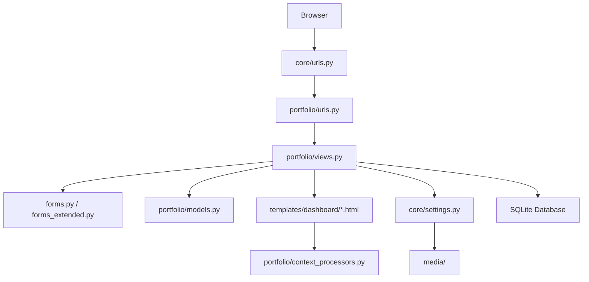
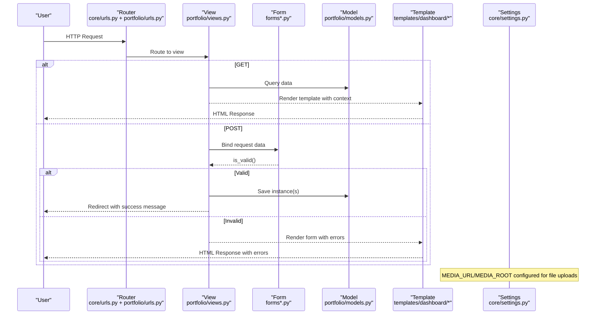
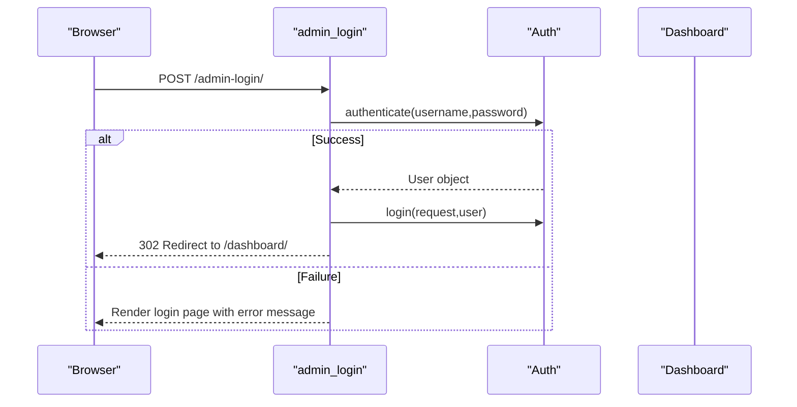
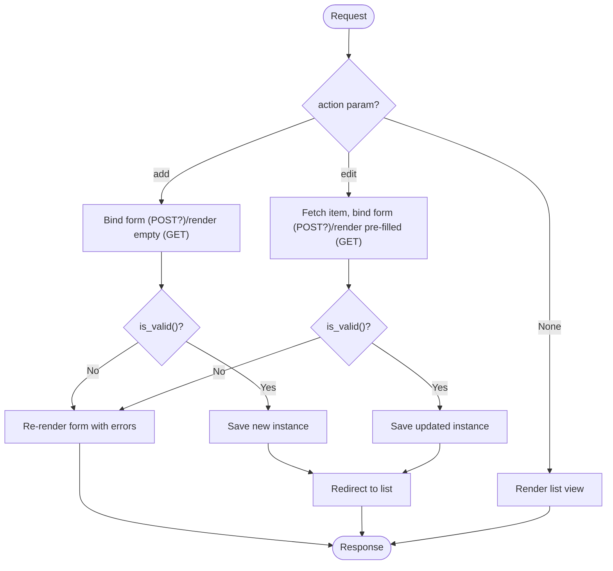
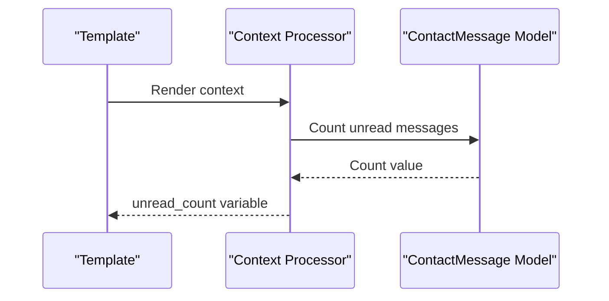
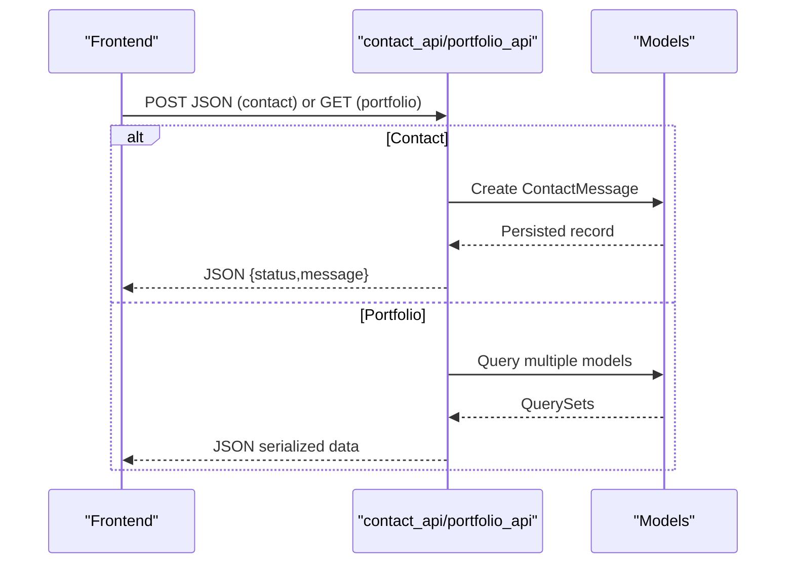
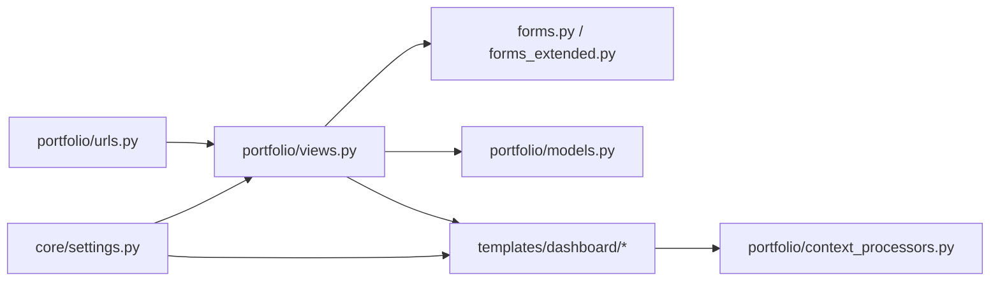

# Data Flow Patterns

<cite>
**Referenced Files in This Document**
- [views.py](file://portfolio/views.py)
- [models.py](file://portfolio/models.py)
- [forms.py](file://portfolio/forms.py)
- [forms_extended.py](file://portfolio/forms_extended.py)
- [urls.py](file://portfolio/urls.py)
- [core_urls.py](file://core/urls.py)
- [settings.py](file://core/settings.py)
- [context_processors.py](file://portfolio/context_processors.py)
- [generic_form.html](file://templates/dashboard/generic_form.html)
- [generic_list.html](file://templates/dashboard/generic_list.html)
- [_form_fields.html](file://templates/dashboard/_form_fields.html)
</cite>

## Table of Contents
1. [Introduction](#introduction)
2. [Project Structure](#project-structure)
3. [Core Components](#core-components)
4. [Architecture Overview](#architecture-overview)
5. [Detailed Component Analysis](#detailed-component-analysis)
6. [Dependency Analysis](#dependency-analysis)
7. [Performance Considerations](#performance-considerations)
8. [Troubleshooting Guide](#troubleshooting-guide)
9. [Conclusion](#conclusion)

## Introduction
This document explains the end-to-end data flow patterns in the Portfolio CMS system, from user interaction to database operations and back to the browser. It covers:
- Request routing and view handling
- Form-based input validation and persistence
- Generic CRUD flows for multiple content modules
- File upload handling
- API endpoints for data serialization
- Context processors that inject global data into templates
- Error handling and consistency strategies

The goal is to make the request-response cycle transparent so developers can extend or debug any part of the system with confidence.

## Project Structure
At a high level:
- URL configuration routes requests to views.
- Views coordinate forms, models, and templates.
- Forms encapsulate validation rules and map to model fields.
- Models define persistent data structures and relationships.
- Templates render UI and display form errors/messages.
- A context processor supplies dashboard-wide data (e.g., unread message count).

**Diagram sources**
- [core_urls.py:22-28](file://core/urls.py#L22-L28)
- [urls.py:4-43](file://portfolio/urls.py#L4-L43)
- [views.py:21-458](file://portfolio/views.py#L21-L458)
- [forms.py:1-22](file://portfolio/forms.py#L1-L22)
- [forms_extended.py:1-78](file://portfolio/forms_extended.py#L1-L78)
- [models.py:1-298](file://portfolio/models.py#L1-L298)
- [settings.py:57-72](file://core/settings.py#L57-L72)
- [settings.py:80-89](file://core/settings.py#L80-L89)

**Section sources**
- [core_urls.py:22-28](file://core/urls.py#L22-L28)
- [urls.py:4-43](file://portfolio/urls.py#L4-L43)
- [settings.py:57-72](file://core/settings.py#L57-L72)

## Core Components
- Views: Handle authentication, dashboard pages, generic CRUD, messages inbox, and APIs.
- Forms: Model-backed forms for profile, settings, and all content modules.
- Models: Define entities like Profile, Education, Experience, Project, Certificate, etc.
- Templates: Reusable list and form templates for consistent UI and error rendering.
- Context Processor: Injects unread message counts into every dashboard template.
- Settings: Configure apps, middleware, templates, database, and media paths.

Key responsibilities:
- Routing: Map URLs to views.
- Validation: Use Django forms to validate and sanitize inputs.
- Persistence: Create/update/delete records via models.
- Rendering: Render HTML templates with context data.
- APIs: Serialize data to JSON for frontend consumption.

**Section sources**
- [views.py:21-458](file://portfolio/views.py#L21-L458)
- [forms.py:1-22](file://portfolio/forms.py#L1-L22)
- [forms_extended.py:1-78](file://portfolio/forms_extended.py#L1-L78)
- [models.py:1-298](file://portfolio/models.py#L1-L298)
- [context_processors.py:1-9](file://portfolio/context_processors.py#L1-L9)
- [settings.py:34-53](file://core/settings.py#L34-L53)

## Architecture Overview
The system follows a standard Django MVC-like pattern:
- Requests enter through core URL configuration and are delegated to portfolio URL patterns.
- Views orchestrate business logic, interact with forms and models, and return responses.
- Templates render UI using reusable components and context variables.
- APIs expose data as JSON for external consumers.

**Diagram sources**
- [core_urls.py:22-28](file://core/urls.py#L22-L28)
- [urls.py:4-43](file://portfolio/urls.py#L4-L43)
- [views.py:127-180](file://portfolio/views.py#L127-L180)
- [forms.py:1-22](file://portfolio/forms.py#L1-L22)
- [forms_extended.py:1-78](file://portfolio/forms_extended.py#L1-L78)
- [models.py:1-298](file://portfolio/models.py#L1-L298)
- [settings.py:80-89](file://core/settings.py#L80-L89)

## Detailed Component Analysis

### Authentication and Dashboard Entry
- Public entry points include home and admin login/logout.
- The login view authenticates against hardcoded credentials for development, creates or retrieves a staff user, logs them in, and redirects to the dashboard.
- Protected dashboard views use a login decorator to ensure only authenticated users access management features.

**Diagram sources**
- [views.py:28-56](file://portfolio/views.py#L28-L56)
- [urls.py:8-15](file://portfolio/urls.py#L8-L15)

**Section sources**
- [views.py:28-56](file://portfolio/views.py#L28-L56)
- [urls.py:8-15](file://portfolio/urls.py#L8-L15)

### Generic CRUD Pattern
The system uses a single generic CRUD helper to manage many content modules consistently:
- List: Renders a table of items with visibility/status indicators and actions.
- Add/Edit: Uses a shared form template bound to a specific model’s form class.
- Delete: Centralized deletion endpoint mapped by model name.

**Diagram sources**
- [views.py:127-180](file://portfolio/views.py#L127-L180)
- [generic_list.html:1-81](file://templates/dashboard/generic_list.html#L1-L81)
- [generic_form.html:1-63](file://templates/dashboard/generic_form.html#L1-L63)

**Section sources**
- [views.py:127-180](file://portfolio/views.py#L127-L180)
- [urls.py:18-32](file://portfolio/urls.py#L18-L32)
- [generic_list.html:1-81](file://templates/dashboard/generic_list.html#L1-L81)
- [generic_form.html:1-63](file://templates/dashboard/generic_form.html#L1-L63)

### Form Handling and Validation
- All content module forms are ModelForms that automatically map to model fields and enforce field-level validation.
- The generic form template renders fields, help text, and errors consistently across modules.
- Non-field errors and per-field errors are displayed inline.

Validation flow:
- On POST, the view binds request data to the form.
- If valid, the form saves to the database; otherwise, the template re-renders with errors.

File uploads:
- Forms with file fields require multipart encoding in the template.
- Uploaded files are stored under MEDIA_ROOT according to model upload_to paths.

**Section sources**
- [forms_extended.py:1-78](file://portfolio/forms_extended.py#L1-L78)
- [generic_form.html:24-59](file://templates/dashboard/generic_form.html#L24-L59)
- [models.py:12-13](file://portfolio/models.py#L12-L13)
- [settings.py:87-89](file://core/settings.py#L87-L89)

### Views Processing Business Logic and Interacting with Models
- Dashboard home aggregates counts and recent messages for quick overview.
- Each module view delegates to the generic CRUD helper, keeping views thin and consistent.
- Messages inbox supports filtering, toggling read status, marking all as read, and deleting messages.

Data interactions:
- Queries use filters and ordering based on model meta configurations.
- Updates often use update_fields to minimize writes.

**Section sources**
- [views.py:59-83](file://portfolio/views.py#L59-L83)
- [views.py:255-295](file://portfolio/views.py#L255-L295)
- [models.py:49-89](file://portfolio/models.py#L49-L89)

### Context Processors Injecting Global Data
- A context processor exposes unread message counts to every dashboard template without requiring explicit queries in each view.
- This keeps templates clean and ensures consistent global state.

**Diagram sources**
- [context_processors.py:1-9](file://portfolio/context_processors.py#L1-L9)
- [models.py:265-275](file://portfolio/models.py#L265-L275)
- [settings.py:57-72](file://core/settings.py#L57-L72)

**Section sources**
- [context_processors.py:1-9](file://portfolio/context_processors.py#L1-L9)
- [settings.py:57-72](file://core/settings.py#L57-L72)

### API Endpoint Data Serialization
Two primary APIs:
- Contact API: Accepts JSON payloads to create contact messages.
- Portfolio API: Aggregates and serializes portfolio data for the frontend.

**Diagram sources**
- [views.py:300-322](file://portfolio/views.py#L300-L322)
- [views.py:335-457](file://portfolio/views.py#L335-L457)
- [models.py:265-275](file://portfolio/models.py#L265-L275)

**Section sources**
- [views.py:300-322](file://portfolio/views.py#L300-L322)
- [views.py:335-457](file://portfolio/views.py#L335-L457)
- [urls.py:40-43](file://portfolio/urls.py#L40-L43)

### Error Handling Patterns
- Login failures set error messages and re-render the login page.
- Generic CRUD sets error messages when forms are invalid and re-renders the form with inline field errors.
- Unknown actions raise appropriate HTTP exceptions.
- API endpoints return JSON error responses with descriptive messages and status codes.

Consistency strategies:
- Centralized delete mapping prevents ad-hoc deletion logic.
- Update-only fields reduce unnecessary writes and maintain consistency.

**Section sources**
- [views.py:28-56](file://portfolio/views.py#L28-L56)
- [views.py:127-180](file://portfolio/views.py#L127-L180)
- [views.py:240-249](file://portfolio/views.py#L240-L249)
- [views.py:300-322](file://portfolio/views.py#L300-L322)

## Dependency Analysis
High-level dependencies:
- URLs depend on views.
- Views depend on forms, models, and templates.
- Templates depend on context processors for global data.
- Settings configure middleware, apps, and file storage.

**Diagram sources**
- [urls.py:4-43](file://portfolio/urls.py#L4-L43)
- [views.py:21-458](file://portfolio/views.py#L21-L458)
- [forms.py:1-22](file://portfolio/forms.py#L1-L22)
- [forms_extended.py:1-78](file://portfolio/forms_extended.py#L1-L78)
- [models.py:1-298](file://portfolio/models.py#L1-L298)
- [context_processors.py:1-9](file://portfolio/context_processors.py#L1-L9)
- [settings.py:34-72](file://core/settings.py#L34-L72)

**Section sources**
- [urls.py:4-43](file://portfolio/urls.py#L4-L43)
- [settings.py:34-72](file://core/settings.py#L34-L72)

## Performance Considerations
- Use select_related and prefetch_related in API aggregation to reduce N+1 queries when loading related objects (e.g., skills with categories, projects with images).
- Order lists by display_order where applicable to avoid extra sorting at runtime.
- Keep generic CRUD minimal; it already centralizes common logic and reduces duplication.
- For large datasets, consider pagination in list views and selective field projection in APIs.

[No sources needed since this section provides general guidance]

## Troubleshooting Guide
Common issues and resolutions:
- Form validation errors: Ensure the form is bound correctly on POST and that enctype includes multipart for file uploads. Check field-level errors rendered in the template.
- Missing media files: Verify MEDIA_URL and MEDIA_ROOT in settings and that DEBUG is enabled for local serving.
- CSRF errors: Confirm templates include the CSRF token in forms.
- API parsing errors: Validate JSON payload structure and handle malformed requests gracefully.
- Authentication loops: Ensure login redirects to an intended dashboard route and logout clears session properly.

**Section sources**
- [generic_form.html:24-59](file://templates/dashboard/generic_form.html#L24-L59)
- [settings.py:80-89](file://core/settings.py#L80-L89)
- [views.py:28-56](file://portfolio/views.py#L28-L56)
- [views.py:300-322](file://portfolio/views.py#L300-L322)

## Conclusion
The Portfolio CMS implements clear, reusable data flow patterns:
- Centralized routing and thin views delegate to a generic CRUD helper for consistency.
- Forms provide robust validation and error reporting.
- Models define structured data with relationships and metadata for ordering and visibility.
- Templates render consistent UIs and leverage context processors for global data.
- APIs serialize data efficiently for frontend consumption.

These patterns make the system easy to extend, maintain, and debug while ensuring data consistency across components.