# MTV Pattern Implementation

<cite>
**Referenced Files in This Document**
- [core/urls.py](file://core/urls.py)
- [portfolio/urls.py](file://portfolio/urls.py)
- [portfolio/views.py](file://portfolio/views.py)
- [portfolio/models.py](file://portfolio/models.py)
- [templates/dashboard/base.html](file://templates/dashboard/base.html)
- [templates/dashboard/home.html](file://templates/dashboard/home.html)
</cite>

## Table of Contents
1. [Introduction](#introduction)
2. [Project Structure](#project-structure)
3. [Core Components](#core-components)
4. [Architecture Overview](#architecture-overview)
5. [Detailed Component Analysis](#detailed-component-analysis)
6. [Dependency Analysis](#dependency-analysis)
7. [Performance Considerations](#performance-considerations)
8. [Troubleshooting Guide](#troubleshooting-guide)
9. [Conclusion](#conclusion)

## Introduction
This document explains how the Portfolio CMS implements Django’s MTV (Model-Template-View) pattern and how it differs from traditional MVC. In this project:
- Models define data structures and relationships.
- Views process requests, coordinate business logic, and interact with models.
- Templates render HTML responses using context provided by views.

The core request flow is:
URL matching → view processing → model queries → template rendering → response generation.

## Project Structure
At a high level:
- The root URL configuration delegates to the portfolio app.
- The portfolio app defines URLs that map to view functions.
- Views use forms and models to handle data operations.
- Templates under templates/dashboard render the admin interface.

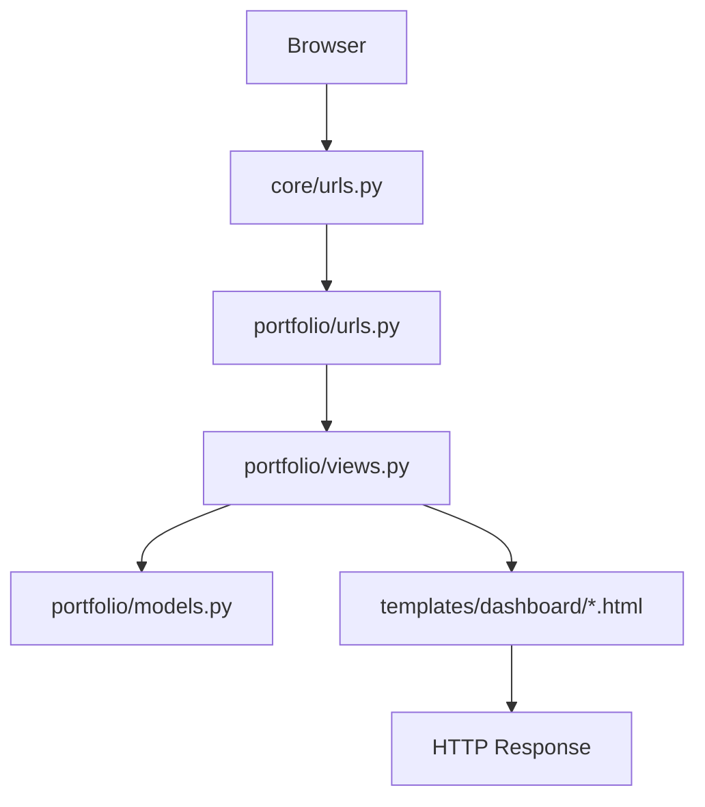

**Diagram sources**
- [core/urls.py:22-25](file://core/urls.py#L22-L25)
- [portfolio/urls.py:4-43](file://portfolio/urls.py#L4-L43)
- [portfolio/views.py:21-458](file://portfolio/views.py#L21-L458)
- [portfolio/models.py:4-298](file://portfolio/models.py#L4-L298)
- [templates/dashboard/base.html:1-188](file://templates/dashboard/base.html#L1-L188)
- [templates/dashboard/home.html:1-134](file://templates/dashboard/home.html#L1-L134)

**Section sources**
- [core/urls.py:22-25](file://core/urls.py#L22-L25)
- [portfolio/urls.py:4-43](file://portfolio/urls.py#L4-L43)

## Core Components
- URL routing:
  - Root routes include the portfolio app at the empty path.
  - Portfolio app maps public and dashboard endpoints to view functions.
- Views:
  - Public front page returns a static HTML file.
  - Dashboard views manage content modules via a generic CRUD helper.
  - API endpoints return JSON for frontend consumption.
- Models:
  - Represent profile, hero roles, education, experience, skills, projects, certificates, workshops, achievements, services, resume files, social links, contact messages, site settings, and related categories.
- Templates:
  - Base dashboard layout provides sidebar, topbar, and message toasts.
  - Home dashboard template renders metrics and quick actions.

**Section sources**
- [core/urls.py:22-25](file://core/urls.py#L22-L25)
- [portfolio/urls.py:4-43](file://portfolio/urls.py#L4-L43)
- [portfolio/views.py:21-458](file://portfolio/views.py#L21-L458)
- [portfolio/models.py:4-298](file://portfolio/models.py#L4-L298)
- [templates/dashboard/base.html:1-188](file://templates/dashboard/base.html#L1-L188)
- [templates/dashboard/home.html:1-134](file://templates/dashboard/home.html#L1-L134)

## Architecture Overview
Django’s MTV separates concerns cleanly:
- Model layer encapsulates data schema and relationships.
- View layer handles HTTP requests, authentication, form validation, and orchestration.
- Template layer focuses purely on presentation and uses context variables.

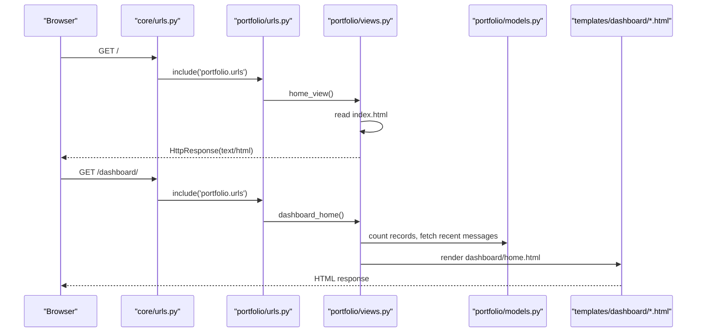

**Diagram sources**
- [core/urls.py:22-25](file://core/urls.py#L22-L25)
- [portfolio/urls.py:4-43](file://portfolio/urls.py#L4-L43)
- [portfolio/views.py:21-83](file://portfolio/views.py#L21-L83)
- [portfolio/models.py:4-298](file://portfolio/models.py#L4-L298)
- [templates/dashboard/home.html:1-134](file://templates/dashboard/home.html#L1-L134)

## Detailed Component Analysis

### URL Routing Layer
- Root configuration includes the portfolio app at the empty path, delegating all non-admin routes to the portfolio app.
- Portfolio app defines:
  - Public route for the front page.
  - Authentication routes for login/logout.
  - Dashboard routes for each content module.
  - Message inbox routes.
  - API routes for portfolio data and contact submissions.

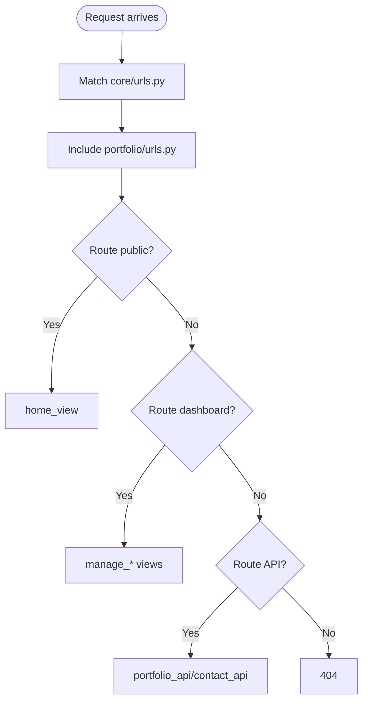

**Diagram sources**
- [core/urls.py:22-25](file://core/urls.py#L22-L25)
- [portfolio/urls.py:4-43](file://portfolio/urls.py#L4-L43)

**Section sources**
- [core/urls.py:22-25](file://core/urls.py#L22-L25)
- [portfolio/urls.py:4-43](file://portfolio/urls.py#L4-L43)

### Views Layer
Key responsibilities:
- Public front page serves a static HTML file directly.
- Authentication handles login/logout and redirects authenticated users.
- Dashboard views provide an overview and management interfaces for content modules.
- Generic CRUD helper reduces duplication across many modules.
- Message inbox supports filtering, toggling read status, marking all read, and deletion.
- API endpoints serialize model data into JSON for the frontend.

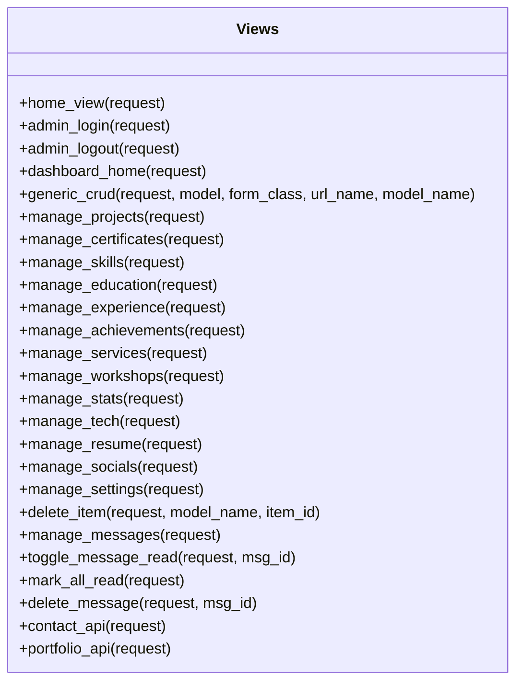

**Diagram sources**
- [portfolio/views.py:21-458](file://portfolio/views.py#L21-L458)

**Section sources**
- [portfolio/views.py:21-458](file://portfolio/views.py#L21-L458)

### Models Layer
Data entities include:
- Profile and HeroRole for personal information and hero roles.
- Education, Experience, Skills, Technologies for professional background.
- Projects, Certificates, Workshops, Achievements, Services for portfolio content.
- Resume, SocialLink, ContactMessage, SiteSettings for system features.

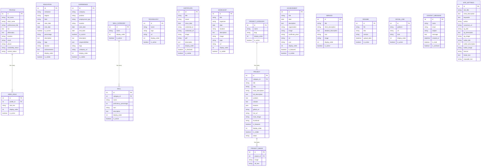

**Diagram sources**
- [portfolio/models.py:4-298](file://portfolio/models.py#L4-L298)

**Section sources**
- [portfolio/models.py:4-298](file://portfolio/models.py#L4-L298)

### Template Layer
- Base template provides layout, navigation, theme toggle, and toast notifications.
- Home dashboard template displays metrics, module tiles, quick actions, and recent messages.

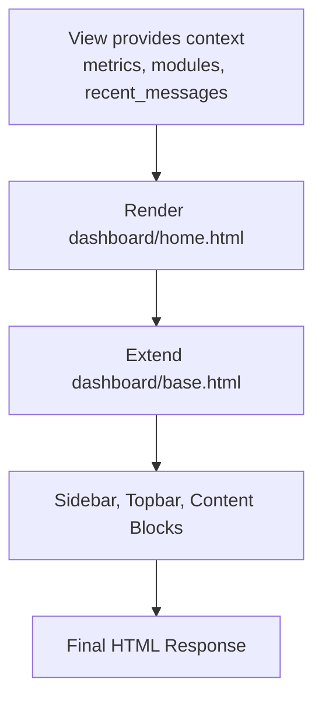

**Diagram sources**
- [templates/dashboard/home.html:1-134](file://templates/dashboard/home.html#L1-L134)
- [templates/dashboard/base.html:1-188](file://templates/dashboard/base.html#L1-L188)

**Section sources**
- [templates/dashboard/home.html:1-134](file://templates/dashboard/home.html#L1-L134)
- [templates/dashboard/base.html:1-188](file://templates/dashboard/base.html#L1-L188)

### Request Flow Examples

#### Example 1: Public Front Page
- URL: `/`
- Flow:
  - core/urls.py includes portfolio/urls.py.
  - portfolio/urls.py maps `/` to home_view.
  - home_view reads a static HTML file and returns it as HttpResponse.

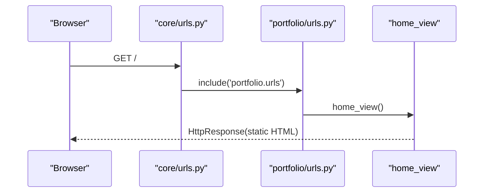

**Diagram sources**
- [core/urls.py:22-25](file://core/urls.py#L22-L25)
- [portfolio/urls.py:4-6](file://portfolio/urls.py#L4-L6)
- [portfolio/views.py:21-26](file://portfolio/views.py#L21-L26)

**Section sources**
- [portfolio/views.py:21-26](file://portfolio/views.py#L21-L26)

#### Example 2: Dashboard Home
- URL: `/dashboard/`
- Flow:
  - core/urls.py includes portfolio/urls.py.
  - portfolio/urls.py maps `/dashboard/` to dashboard_home.
  - dashboard_home queries counts and recent messages via models.
  - dashboard_home renders dashboard/home.html with context.

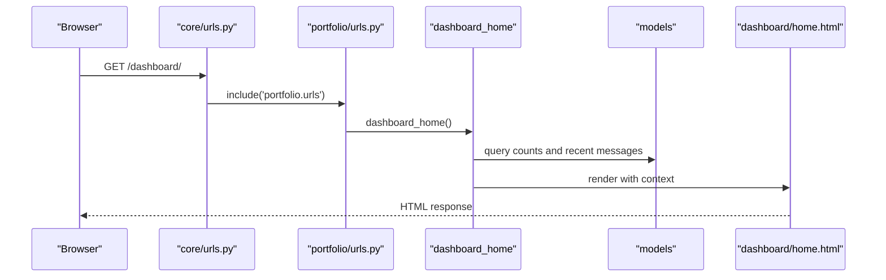

**Diagram sources**
- [core/urls.py:22-25](file://core/urls.py#L22-L25)
- [portfolio/urls.py:12-13](file://portfolio/urls.py#L12-L13)
- [portfolio/views.py:58-83](file://portfolio/views.py#L58-L83)
- [templates/dashboard/home.html:1-134](file://templates/dashboard/home.html#L1-L134)

**Section sources**
- [portfolio/views.py:58-83](file://portfolio/views.py#L58-L83)
- [templates/dashboard/home.html:1-134](file://templates/dashboard/home.html#L1-L134)

#### Example 3: Generic CRUD for Projects
- URL: `/dashboard/projects/?action=add`
- Flow:
  - portfolio/urls.py maps `/dashboard/projects/` to manage_projects.
  - manage_projects calls generic_crud with Project model and ProjectForm.
  - generic_crud handles list/add/edit/delete based on request parameters.
  - Forms validate input; successful saves redirect back to list.

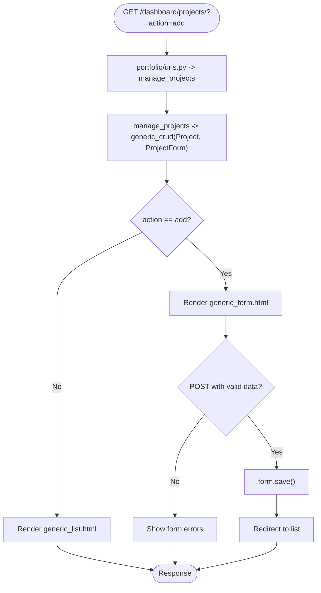

**Diagram sources**
- [portfolio/urls.py:19-19](file://portfolio/urls.py#L19-L19)
- [portfolio/views.py:127-180](file://portfolio/views.py#L127-L180)
- [portfolio/views.py:184-185](file://portfolio/views.py#L184-L185)

**Section sources**
- [portfolio/views.py:127-180](file://portfolio/views.py#L127-L180)
- [portfolio/views.py:184-185](file://portfolio/views.py#L184-L185)

#### Example 4: Portfolio API
- URL: `/api/portfolio/`
- Flow:
  - portfolio/urls.py maps `/api/portfolio/` to portfolio_api.
  - portfolio_api queries multiple models and serializes data into JSON.
  - Returns JsonResponse with structured portfolio data.

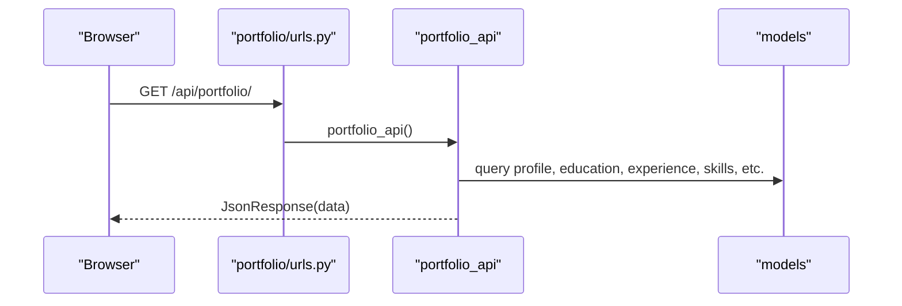

**Diagram sources**
- [portfolio/urls.py:41-41](file://portfolio/urls.py#L41-L41)
- [portfolio/views.py:335-457](file://portfolio/views.py#L335-L457)
- [portfolio/models.py:4-298](file://portfolio/models.py#L4-L298)

**Section sources**
- [portfolio/views.py:335-457](file://portfolio/views.py#L335-L457)

## Dependency Analysis
- URL routing depends on Django’s path and include utilities.
- Views depend on:
  - Django shortcuts and decorators for rendering, redirection, and authentication.
  - Forms for validation and saving data.
  - Models for querying and mutating data.
- Templates depend on:
  - Context variables provided by views.
  - Static assets loaded via Django’s staticfiles.

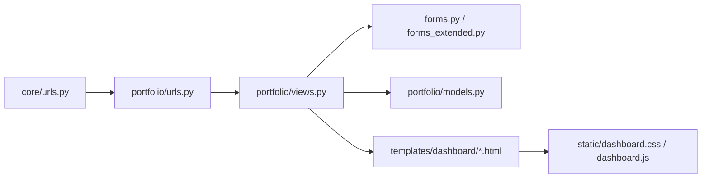

**Diagram sources**
- [core/urls.py:22-25](file://core/urls.py#L22-L25)
- [portfolio/urls.py:4-43](file://portfolio/urls.py#L4-L43)
- [portfolio/views.py:1-18](file://portfolio/views.py#L1-L18)
- [portfolio/models.py:4-298](file://portfolio/models.py#L4-L298)
- [templates/dashboard/base.html:1-22](file://templates/dashboard/base.html#L1-L22)

**Section sources**
- [portfolio/views.py:1-18](file://portfolio/views.py#L1-L18)
- [portfolio/models.py:4-298](file://portfolio/models.py#L4-L298)
- [templates/dashboard/base.html:1-22](file://templates/dashboard/base.html#L1-L22)

## Performance Considerations
- Use select_related and prefetch_related where appropriate to reduce N+1 queries when displaying related objects.
- Prefer queryset filters and annotations for counting and aggregations instead of Python loops.
- Cache frequently accessed settings or computed aggregates if they change infrequently.
- Avoid heavy computations in views; move them to utility functions or model methods.

[No sources needed since this section provides general guidance]

## Troubleshooting Guide
Common issues and checks:
- Missing static files: Ensure staticfiles are configured and served correctly in development.
- Authentication redirects: Verify login/logout flows and user permissions.
- Form validation errors: Inspect form errors rendered in templates and ensure fields match model definitions.
- API errors: Check request method constraints and JSON payload structure.

**Section sources**
- [portfolio/views.py:28-56](file://portfolio/views.py#L28-L56)
- [portfolio/views.py:127-180](file://portfolio/views.py#L127-L180)
- [portfolio/views.py:300-322](file://portfolio/views.py#L300-L322)

## Conclusion
The Portfolio CMS follows Django’s MTV pattern effectively:
- Models define clear data structures and relationships.
- Views implement request handling, business logic, and coordination between forms and models.
- Templates focus on presentation and consume context data to render responsive dashboards.

This separation of concerns enables maintainable code organization, easier testing, and scalable feature additions.

[No sources needed since this section summarizes without analyzing specific files]