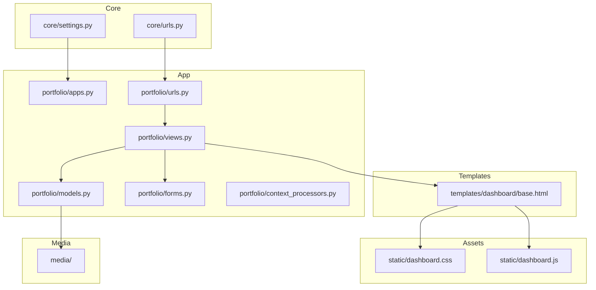
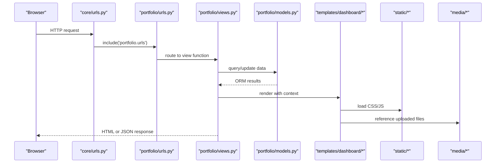
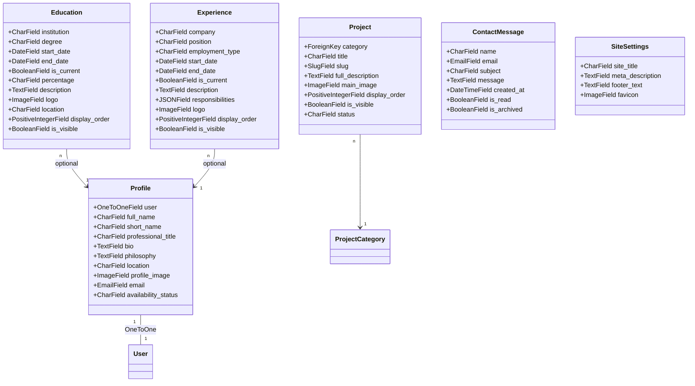
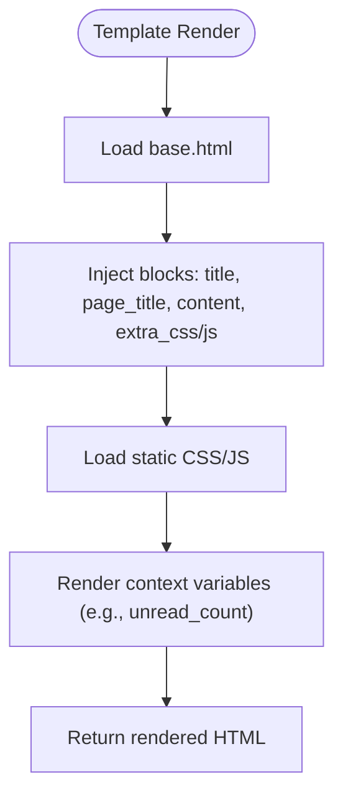
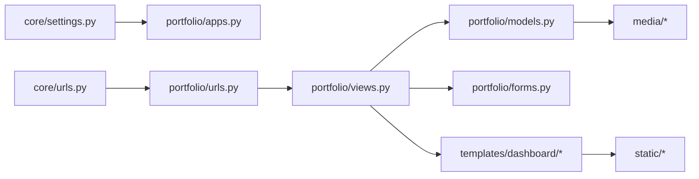

# Project Structure Breakdown

<cite>
**Referenced Files in This Document**
- [settings.py](file://core/settings.py)
- [urls.py (project root)](file://core/urls.py)
- [apps.py](file://portfolio/apps.py)
- [models.py](file://portfolio/models.py)
- [views.py](file://portfolio/views.py)
- [urls.py (app)](file://portfolio/urls.py)
- [forms.py](file://portfolio/forms.py)
- [context_processors.py](file://portfolio/context_processors.py)
- [base.html](file://templates/dashboard/base.html)
- [manage.py](file://manage.py)
</cite>

## Table of Contents
1. [Introduction](#introduction)
2. [Project Structure](#project-structure)
3. [Core Components](#core-components)
4. [Architecture Overview](#architecture-overview)
5. [Detailed Component Analysis](#detailed-component-analysis)
6. [Dependency Analysis](#dependency-analysis)
7. [Performance Considerations](#performance-considerations)
8. [Troubleshooting Guide](#troubleshooting-guide)
9. [Conclusion](#conclusion)

## Introduction
This document explains the Portfolio CMS project structure and organizational principles. It focuses on how Django conventions are applied across the core configuration, main application logic, templates, static assets, and media files. The goal is to help both new contributors and maintainers understand where responsibilities live, how components interact, and why this modular design supports scalability and maintainability.

## Project Structure
The repository follows a standard Django layout with clear separation between:
- Core project configuration under core/
- Main application logic under portfolio/
- Dashboard templates under templates/dashboard/
- Static assets under static/
- User-uploaded content under media/

**Diagram sources**
- [settings.py:34-42](file://core/settings.py#L34-L42)
- [urls.py (project root):22-28](file://core/urls.py#L22-L28)
- [apps.py:4-6](file://portfolio/apps.py#L4-L6)
- [urls.py (app):4-43](file://portfolio/urls.py#L4-L43)
- [views.py:8-18](file://portfolio/views.py#L8-L18)
- [models.py:4-298](file://portfolio/models.py#L4-L298)
- [base.html:20-21](file://templates/dashboard/base.html#L20-L21)
- [base.html:184-185](file://templates/dashboard/base.html#L184-L185)

**Section sources**
- [settings.py:19-94](file://core/settings.py#L19-L94)
- [urls.py (project root):17-28](file://core/urls.py#L17-L28)
- [apps.py:1-6](file://portfolio/apps.py#L1-L6)
- [urls.py (app):1-43](file://portfolio/urls.py#L1-L43)
- [base.html:1-22](file://templates/dashboard/base.html#L1-L22)

## Core Components
This section describes the purpose and role of each key file and directory.

- core/settings.py
  - Centralizes environment variables, installed apps, middleware, URL configuration, template settings, database, static/media paths, internationalization, and default primary key type.
  - Registers the portfolio app and adds a custom context processor for dashboard globals.

- core/urls.py
  - Root URL router that includes the admin interface and delegates all other routes to the portfolio app.
  - Enables serving media files during development when DEBUG is enabled.

- portfolio/apps.py
  - Declares the Django app configuration and sets the default auto field type.

- portfolio/models.py
  - Defines domain entities such as Profile, Education, Experience, Skills, Projects, Certificates, Workshops, Achievements, Services, Technologies, SocialLinks, Resume, ContactMessage, and SiteSettings.
  - Uses ImageField/FileField upload_to directories that map to the media/ folder.

- portfolio/views.py
  - Implements public pages, authentication helpers, dashboard views, generic CRUD operations, message management, and JSON APIs for the frontend.

- portfolio/urls.py
  - Maps URLs to views for the public site, authentication, dashboard modules, messages, and API endpoints.

- portfolio/forms.py
  - Provides ModelForms for Profile, HeroRole, and SiteSettings.

- portfolio/context_processors.py
  - Exposes unread message counts to all dashboard templates via a global context variable.

- templates/dashboard/base.html
  - Base template for the dashboard UI, including sidebar navigation, theme toggle, message toasts, and inclusion of static CSS/JS.

- manage.py
  - Entry point for Django administrative commands, pointing to core.settings.

**Section sources**
- [settings.py:34-74](file://core/settings.py#L34-L74)
- [urls.py (project root):22-28](file://core/urls.py#L22-L28)
- [apps.py:4-6](file://portfolio/apps.py#L4-L6)
- [models.py:4-298](file://portfolio/models.py#L4-L298)
- [views.py:21-458](file://portfolio/views.py#L21-L458)
- [urls.py (app):4-43](file://portfolio/urls.py#L4-L43)
- [forms.py:4-21](file://portfolio/forms.py#L4-L21)
- [context_processors.py:4-8](file://portfolio/context_processors.py#L4-L8)
- [base.html:1-22](file://templates/dashboard/base.html#L1-L22)
- [manage.py:7-18](file://manage.py#L7-L18)

## Architecture Overview
The system follows Django’s MVC-like pattern:
- Settings define runtime behavior and register the app.
- URL routing connects incoming requests to view functions.
- Views orchestrate business logic, interact with models, and render templates or return JSON.
- Templates compose the user interface using base templates and static assets.
- Media files store uploads referenced by models.

**Diagram sources**
- [urls.py (project root):22-28](file://core/urls.py#L22-L28)
- [urls.py (app):4-43](file://portfolio/urls.py#L4-L43)
- [views.py:21-458](file://portfolio/views.py#L21-L458)
- [models.py:4-298](file://portfolio/models.py#L4-L298)
- [base.html:20-21](file://templates/dashboard/base.html#L20-L21)
- [base.html:184-185](file://templates/dashboard/base.html#L184-L185)

## Detailed Component Analysis

### Core Configuration (core/)
- settings.py
  - Loads environment variables and configures SECRET_KEY, DEBUG, ALLOWED_HOSTS.
  - INSTALLED_APPS registers built-in Django apps and the portfolio app.
  - MIDDLEWARE enables security, sessions, CSRF, auth, messages, and clickjacking protection.
  - ROOT_URLCONF points to core.urls.
  - TEMPLATES configures template dirs and context processors, including a custom one from portfolio.context_processors.dashboard_globals.
  - DATABASES uses SQLite by default.
  - MEDIA_URL/MEDIA_ROOT and STATIC_URL/STATICFILES_DIRS/STATIC_ROOT configure asset and media handling.
  - AUTH_PASSWORD_VALIDATORS enforces password policies.
  - LANGUAGE_CODE, TIME_ZONE, USE_I18N, USE_TZ set localization/timezone defaults.
  - DEFAULT_AUTO_FIELD sets BigAutoField for model primary keys.

- urls.py (project root)
  - Mounts the Django admin at /admin/.
  - Includes portfolio.urls for all other routes.
  - Serves media files during development when DEBUG is True.

**Section sources**
- [settings.py:13-17](file://core/settings.py#L13-L17)
- [settings.py:24-30](file://core/settings.py#L24-L30)
- [settings.py:34-53](file://core/settings.py#L34-L53)
- [settings.py:55-74](file://core/settings.py#L55-L74)
- [settings.py:80-94](file://core/settings.py#L80-L94)
- [settings.py:99-142](file://core/settings.py#L99-L142)
- [urls.py (project root):17-28](file://core/urls.py#L17-L28)

### Application Logic (portfolio/)
- apps.py
  - Defines PortfolioConfig and sets default_auto_field to match project-wide settings.

- models.py
  - Organizes content into logical entities:
    - Identity and profile: Profile, HeroRole
    - Career and education: Education, Experience
    - Skills and technologies: SkillCategory, Skill, Technology
    - Projects and media: ProjectCategory, Project, ProjectImage
    - Credentials and events: Certificate, Workshop
    - Recognition: Achievement
    - Offerings: Service
    - Documents: Resume
    - Social presence: SocialLink
    - Communications: ContactMessage
    - Global site metadata: SiteSettings
  - Uses ImageField/FileField upload_to values that correspond to media subdirectories.
  - Applies consistent ordering via display_order and visibility flags like is_visible/is_active.

- views.py
  - Public entry: home_view serves index.html directly from the project root.
  - Authentication: admin_login creates or logs in an admin user; admin_logout clears session.
  - Dashboard: dashboard_home aggregates module counts and recent messages.
  - Generic CRUD: generic_crud provides reusable list/add/edit/delete flows for many models.
  - Message inbox: manage_messages, toggle_message_read, mark_all_read, delete_message.
  - API endpoints:
    - contact_api accepts POST JSON to create ContactMessage entries.
    - portfolio_api returns a consolidated JSON payload for the frontend, aggregating profile, socials, hero roles, technologies, stats, education, experience, skills, certificates, workshops, projects, achievements, and services.

- urls.py (app)
  - Groups routes by area: public site, authentication, dashboard modules, messages, and API.
  - Uses named URLs for consistent reverse resolution in templates and redirects.

- forms.py
  - ModelForms for Profile, HeroRole, and SiteSettings with tailored widgets.

- context_processors.py
  - Adds unread_count to every dashboard template context.

**Diagram sources**
- [models.py:4-298](file://portfolio/models.py#L4-L298)

**Section sources**
- [apps.py:4-6](file://portfolio/apps.py#L4-L6)
- [models.py:4-298](file://portfolio/models.py#L4-L298)
- [views.py:21-458](file://portfolio/views.py#L21-L458)
- [urls.py (app):4-43](file://portfolio/urls.py#L4-L43)
- [forms.py:4-21](file://portfolio/forms.py#L4-L21)
- [context_processors.py:4-8](file://portfolio/context_processors.py#L4-L8)

### Templates (templates/dashboard/)
- base.html
  - Provides the dashboard shell: sidebar navigation, top bar, page header, content block, toast notifications, and theme toggle.
  - Loads static assets via Django’s static template tag.
  - Displays unread message count from the context processor.

**Diagram sources**
- [base.html:1-22](file://templates/dashboard/base.html#L1-L22)
- [base.html:168-185](file://templates/dashboard/base.html#L168-L185)

**Section sources**
- [base.html:1-188](file://templates/dashboard/base.html#L1-L188)

### Static Assets (static/)
- dashboard.css and dashboard.js
  - Provide styling and interactivity for the dashboard UI.
  - Referenced from base.html using the static template tag.

**Section sources**
- [base.html:20-21](file://templates/dashboard/base.html#L20-L21)
- [base.html:184-185](file://templates/dashboard/base.html#L184-L185)

### Media Files (media/)
- Uploaded images and documents are stored under media/, organized by model-specific folders defined in models.py (e.g., profile/, education/, projects/, certificates/, etc.).
- During development, core/urls.py serves these files automatically when DEBUG is True.

**Section sources**
- [settings.py:87-94](file://core/settings.py#L87-L94)
- [urls.py (project root):27-28](file://core/urls.py#L27-L28)
- [models.py:12-13](file://portfolio/models.py#L12-L13)
- [models.py:58-59](file://portfolio/models.py#L58-L59)
- [models.py:190-191](file://portfolio/models.py#L190-L191)

### Administrative Commands (manage.py)
- Sets DJANGO_SETTINGS_MODULE to core.settings and invokes Django’s command-line utility.
- Used for migrations, running the dev server, creating superusers, and other tasks.

**Section sources**
- [manage.py:7-18](file://manage.py#L7-L18)

## Dependency Analysis
High-level dependencies among components:

**Diagram sources**
- [settings.py:34-42](file://core/settings.py#L34-L42)
- [urls.py (project root):22-28](file://core/urls.py#L22-L28)
- [urls.py (app):4-43](file://portfolio/urls.py#L4-L43)
- [views.py:8-18](file://portfolio/views.py#L8-L18)
- [models.py:4-298](file://portfolio/models.py#L4-L298)
- [base.html:20-21](file://templates/dashboard/base.html#L20-L21)

Key observations:
- Low coupling: core only wires up the app; most logic lives in portfolio/.
- Cohesion: portfolio/ groups related models, views, forms, and URLs.
- Clear boundaries: templates depend on static assets and context; models own storage paths.

**Section sources**
- [settings.py:34-74](file://core/settings.py#L34-L74)
- [urls.py (project root):22-28](file://core/urls.py#L22-L28)
- [urls.py (app):4-43](file://portfolio/urls.py#L4-L43)
- [views.py:8-18](file://portfolio/views.py#L8-L18)

## Performance Considerations
- Use select_related/prefetch_related in views that traverse foreign keys or reverse relations to reduce N+1 queries.
- Cache frequently accessed global settings (SiteSettings) if they change infrequently.
- Optimize image uploads with appropriate sizing and compression before saving to media/.
- Avoid heavy computations in request path; consider background tasks for expensive operations.

[No sources needed since this section provides general guidance]

## Troubleshooting Guide
- Missing index.html
  - home_view expects index.html at the project root and raises a 404 if not found. Ensure the file exists.

- Admin login behavior
  - admin_login creates or reuses a hardcoded admin user. Verify credentials and ensure the user has staff/superuser privileges.

- Media not served
  - In development, media is served only when DEBUG=True. Confirm settings and that core/urls.py includes media serving.

- Static assets not loading
  - Ensure static files are collected in production and that STATIC_ROOT is correctly configured.

- Template context missing
  - If unread_count is not available, verify that portfolio.context_processors.dashboard_globals is included in TEMPLATES OPTIONS.

**Section sources**
- [views.py:21-26](file://portfolio/views.py#L21-L26)
- [views.py:28-52](file://portfolio/views.py#L28-L52)
- [urls.py (project root):27-28](file://core/urls.py#L27-L28)
- [settings.py:57-74](file://core/settings.py#L57-L74)

## Conclusion
This Portfolio CMS follows established Django conventions with a clean separation between core configuration, application logic, templates, static assets, and media. The modular structure promotes scalability and maintainability by isolating concerns:
- core/ centralizes configuration and wiring.
- portfolio/ encapsulates domain models, views, forms, and URLs.
- templates/dashboard/ provides a cohesive dashboard UI.
- static/ and media/ separate build-time assets from runtime uploads.

By adhering to these patterns, adding new features becomes straightforward: define a model, create a form, add a view, wire a URL, and extend the dashboard template. This approach keeps the codebase predictable, testable, and easy to evolve.