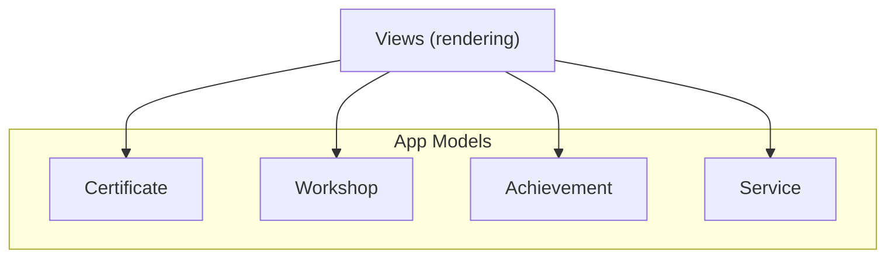
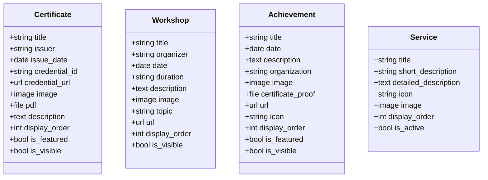
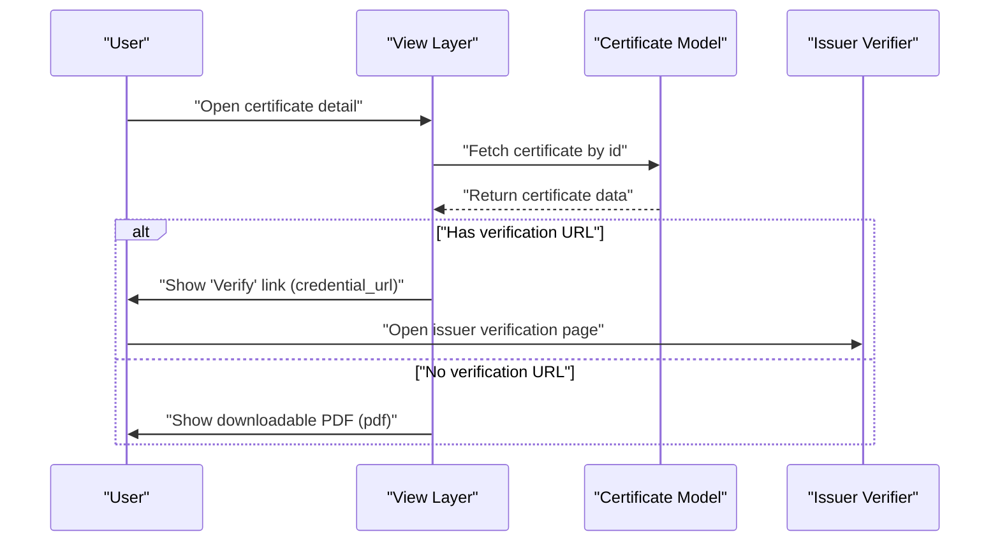
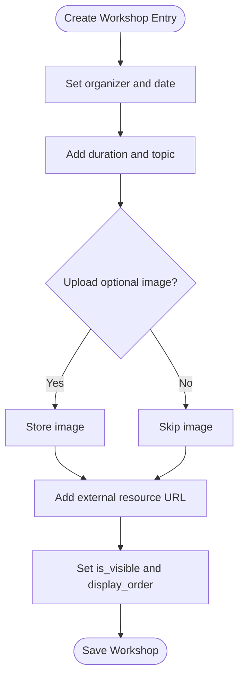
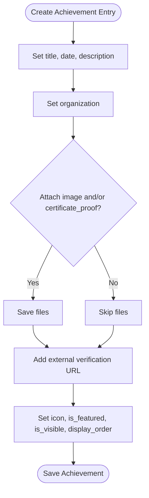
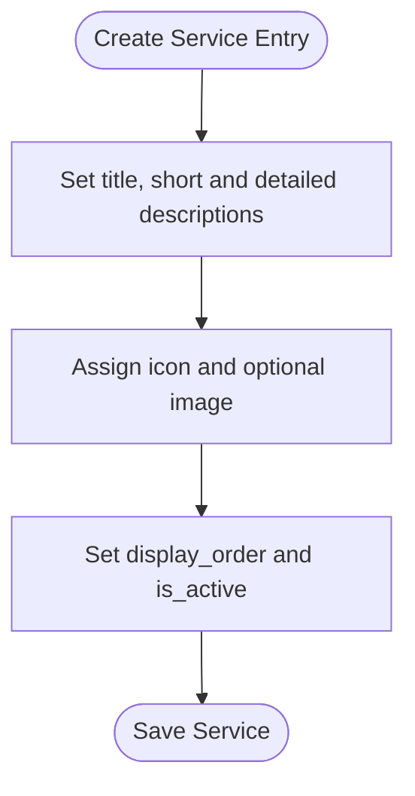
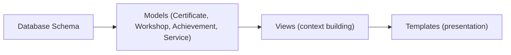

# Content Types

<cite>
**Referenced Files in This Document**
- [models.py](file://portfolio/models.py)
- [views.py](file://portfolio/views.py)
- [0001_initial.py](file://portfolio/migrations/0001_initial.py)
</cite>

## Table of Contents
1. [Introduction](#introduction)
2. [Project Structure](#project-structure)
3. [Core Components](#core-components)
4. [Architecture Overview](#architecture-overview)
5. [Detailed Component Analysis](#detailed-component-analysis)
6. [Dependency Analysis](#dependency-analysis)
7. [Performance Considerations](#performance-considerations)
8. [Troubleshooting Guide](#troubleshooting-guide)
9. [Conclusion](#conclusion)

## Introduction
This document provides comprehensive data model documentation for the content type entities used by the portfolio application: Certificate, Workshop, Achievement, and Service. It explains how each model stores and organizes information, including credential management, professional development tracking, awards and recognitions, and service offerings. The guide also includes practical examples such as credential verification workflows, achievement documentation patterns, and service catalog management.

## Project Structure
The content types are defined as Django models within a single app module. Their fields capture rich metadata, media assets, visibility controls, and ordering to support flexible presentation on the site. A view layer consumes these models to render public-facing lists and details.

**Diagram sources**
- [models.py:130-165](file://portfolio/models.py#L130-L165)
- [models.py:208-240](file://portfolio/models.py#L208-L240)
- [views.py:422-435](file://portfolio/views.py#L422-L435)

**Section sources**
- [models.py:130-165](file://portfolio/models.py#L130-L165)
- [models.py:208-240](file://portfolio/models.py#L208-L240)
- [views.py:422-435](file://portfolio/views.py#L422-L435)

## Core Components
This section summarizes the four core content types and their primary responsibilities:

- Certificate: Stores credentials with issuer details, issue dates, unique identifiers, verification URLs, dual file support (image and PDF), featured status, and visibility control.
- Workshop: Tracks professional development events with organizer information, date and duration, topic categorization, optional images, external resource links, and visibility control.
- Achievement: Captures awards and recognitions with organizational context, supporting documentation (images and certificate proofs), external verification links, icon integration, featured status, and visibility control.
- Service: Represents service offerings with rich content support including icons, images, short and detailed descriptions, ordering, and active status.

**Section sources**
- [models.py:130-165](file://portfolio/models.py#L130-L165)
- [models.py:208-240](file://portfolio/models.py#L208-L240)

## Architecture Overview
The data architecture centers on four independent models that store structured content and media. Views query these models to assemble data for rendering. Certificates include both image and PDF attachments to support visual display and downloadable proof. Achievements can attach an image and a certificate proof file, plus an optional URL for external verification. Workshops and Services provide optional media and descriptive text to enrich user experience.

**Diagram sources**
- [models.py:130-165](file://portfolio/models.py#L130-L165)
- [models.py:208-240](file://portfolio/models.py#L208-L240)

## Detailed Component Analysis

### Certificate Model
Purpose:
- Represent earned credentials with full provenance and verification support.
- Provide both a visual representation (image) and a downloadable proof (PDF).
- Control visibility and prominence via flags and ordering.

Key fields and behavior:
- Issuer information: issuer captures the awarding body.
- Issue date: issue_date records when the credential was awarded.
- Credential identity: credential_id stores a unique identifier from the issuing platform.
- Verification link: credential_url points to an online verifier or record.
- Dual file support: image displays a thumbnail; pdf provides a downloadable document.
- Featured indicator: is_featured highlights important credentials.
- Visibility control: is_visible gates public display.
- Ordering: display_order determines list order.

Credential verification workflow example:
1. User views a certificate entry.
2. If credential_url is present, the UI offers a “Verify” action linking to the issuer’s verification page.
3. Optionally, users can download the attached pdf for offline proof.
4. If credential_id is present, it may be displayed alongside the verification link for reference.

**Diagram sources**
- [models.py:130-147](file://portfolio/models.py#L130-L147)
- [views.py:422-435](file://portfolio/views.py#L422-L435)

**Section sources**
- [models.py:130-147](file://portfolio/models.py#L130-L147)
- [views.py:422-435](file://portfolio/views.py#L422-L435)

### Workshop Model
Purpose:
- Track professional development activities with contextual metadata.
- Support optional imagery and external resources.

Key fields and behavior:
- Organizer: organizer identifies the hosting entity.
- Date and duration: date and duration describe when and how long the workshop occurred.
- Topic categorization: topic provides a concise category label.
- Optional image: image allows a cover photo.
- External resource: url links to registration, materials, or recordings.
- Visibility control: is_visible gates public display.
- Ordering: display_order determines list order.

Professional development tracking pattern:
- Use topic to group workshops into categories (e.g., “Cloud”, “Security”).
- Combine date and duration to compute timelines and summaries.
- Link to external resources for further learning or attendance confirmation.

**Diagram sources**
- [models.py:149-165](file://portfolio/models.py#L149-L165)

**Section sources**
- [models.py:149-165](file://portfolio/models.py#L149-L165)

### Achievement Model
Purpose:
- Capture awards and recognitions with supporting evidence and optional verification.

Key fields and behavior:
- Organizational context: organization indicates the awarding body.
- Supporting documentation: image shows a badge or screenshot; certificate_proof attaches a formal document.
- External verification: url links to an official recognition page or registry.
- Icon integration: icon references a symbol or glyph for consistent visuals.
- Featured status: is_featured highlights notable achievements.
- Visibility control: is_visible gates public display.
- Ordering: display_order determines list order.

Achievement documentation pattern:
- Attach an image for quick visual recognition.
- Upload a certificate_proof for formal validation.
- Provide a url to an external source for third-party verification.
- Use icon to align with a design system.

**Diagram sources**
- [models.py:208-225](file://portfolio/models.py#L208-L225)

**Section sources**
- [models.py:208-225](file://portfolio/models.py#L208-L225)

### Service Model
Purpose:
- Present service offerings with rich content and clear hierarchy.

Key fields and behavior:
- Rich content: short_description and detailed_description provide layered messaging.
- Visuals: icon and image enhance brand consistency and clarity.
- Ordering and status: display_order and is_active manage presentation and availability.

Service catalog management pattern:
- Use short_description for cards and listings.
- Use detailed_description for full pages or modals.
- Maintain icon and image assets for consistent branding.
- Toggle is_active to publish or unpublish services without deletion.

**Diagram sources**
- [models.py:227-240](file://portfolio/models.py#L227-L240)

**Section sources**
- [models.py:227-240](file://portfolio/models.py#L227-L240)

## Dependency Analysis
- Data persistence: All four models rely on Django’s ORM and storage backends for images and files.
- Rendering dependency: The view layer queries these models to build templates’ context. For example, certificates and workshops are filtered by visibility before being passed to templates.
- Migration alignment: The initial migration defines the schema for these models, ensuring database structure matches the code.

**Diagram sources**
- [0001_initial.py:37-56](file://portfolio/migrations/0001_initial.py#L37-L56)
- [views.py:422-435](file://portfolio/views.py#L422-L435)

**Section sources**
- [0001_initial.py:37-56](file://portfolio/migrations/0001_initial.py#L37-L56)
- [views.py:422-435](file://portfolio/views.py#L422-L435)

## Performance Considerations
- Filtering by visibility: Always filter by is_visible at the query level to reduce payload size and avoid unnecessary checks in templates.
- Select related and prefetch: When displaying related data (e.g., projects with images), use select_related and prefetch_related to minimize N+1 queries. While not directly applied to these four models, this pattern should be followed consistently across the app.
- File handling: Large PDFs and images can impact load times. Consider compressing images and optimizing PDFs, and serving them through a CDN if available.
- Ordering: Use display_order to pre-sort lists server-side to avoid client-side sorting overhead.

[No sources needed since this section provides general guidance]

## Troubleshooting Guide
Common issues and resolutions:
- Missing verification URL: If credential_url is empty, ensure the template falls back to showing the downloadable pdf. Validate that pdf is uploaded when no external verifier exists.
- Empty or broken media: Confirm that image and certificate_proof paths resolve correctly. Check upload_to directories and permissions.
- Visibility gating: If entries do not appear on the site, verify is_visible is True and that queries filter accordingly.
- Ordering anomalies: Ensure display_order values are set consistently to achieve expected list order.

**Section sources**
- [models.py:130-147](file://portfolio/models.py#L130-L147)
- [models.py:208-225](file://portfolio/models.py#L208-L225)
- [views.py:422-435](file://portfolio/views.py#L422-L435)

## Conclusion
The Certificate, Workshop, Achievement, and Service models provide a robust foundation for managing credentials, professional development records, awards, and service offerings. They incorporate rich metadata, media assets, visibility controls, and ordering to support flexible and performant presentation. By following the documented patterns—such as using credential_url for verification, attaching supporting documents for achievements, and leveraging rich descriptions for services—you can maintain a clean, scalable content strategy aligned with the application’s goals.