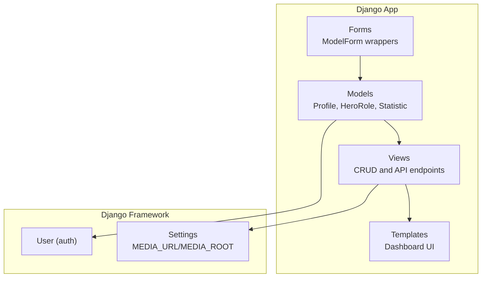
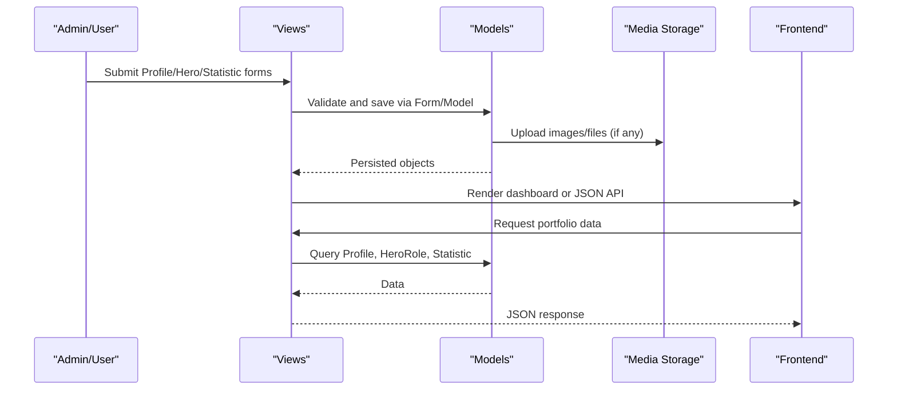
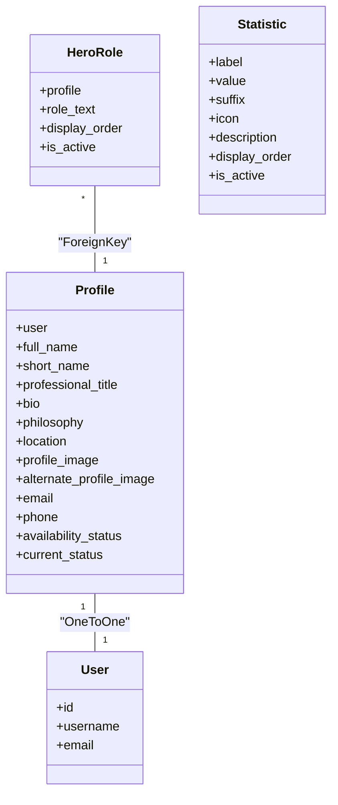

# Core Entities

<cite>
**Referenced Files in This Document**
- [models.py](file://portfolio/models.py)
- [views.py](file://portfolio/views.py)
- [forms.py](file://portfolio/forms.py)
- [settings.py](file://core/settings.py)
- [profile.html](file://templates/dashboard/profile.html)
- [hero.html](file://templates/dashboard/hero.html)
</cite>

## Table of Contents
1. [Introduction](#introduction)
2. [Project Structure](#project-structure)
3. [Core Components](#core-components)
4. [Architecture Overview](#architecture-overview)
5. [Detailed Component Analysis](#detailed-component-analysis)
6. [Dependency Analysis](#dependency-analysis)
7. [Performance Considerations](#performance-considerations)
8. [Troubleshooting Guide](#troubleshooting-guide)
9. [Conclusion](#conclusion)

## Introduction
This document provides comprehensive data model documentation for the core entities that power the portfolio system: Profile, HeroRole, and Statistic. It explains how these models relate to each other and to Django’s built-in User model, their field definitions, validation rules, constraints, and practical usage patterns across the application. The goal is to make the data layer clear for both developers and non-technical stakeholders.

## Project Structure
The core entities are defined in the portfolio app’s models file and consumed by views and templates to render the public portfolio and dashboard interfaces. Media uploads are configured in project settings.

**Diagram sources**
- [models.py:4-47](file://portfolio/models.py#L4-L47)
- [views.py:86-117](file://portfolio/views.py#L86-L117)
- [forms.py:4-21](file://portfolio/forms.py#L4-L21)
- [settings.py:87-89](file://core/settings.py#L87-L89)

**Section sources**
- [models.py:4-47](file://portfolio/models.py#L4-L47)
- [settings.py:87-89](file://core/settings.py#L87-L89)

## Core Components
This section focuses on the three core entities: Profile, HeroRole, and Statistic.

- Profile: OneToOne relationship with Django’s User; stores personal identity, contact details, profile images, and status management fields.
- HeroRole: ForeignKey to Profile; manages role text, display ordering, and active state for hero section rotation.
- Statistic: Stores label-value pairs with optional suffix, icon, description, display ordering, and active state for performance metrics.

These models together form the foundation for displaying a personalized hero section, rotating roles, and showcasing key metrics.

**Section sources**
- [models.py:4-47](file://portfolio/models.py#L4-L47)

## Architecture Overview
The data flow from user actions to stored data and back to the frontend is as follows:

**Diagram sources**
- [views.py:86-117](file://portfolio/views.py#L86-L117)
- [views.py:335-457](file://portfolio/views.py#L335-L457)
- [settings.py:87-89](file://core/settings.py#L87-L89)

## Detailed Component Analysis

### Profile Model
Purpose:
- Represents a user’s professional identity and contact information.
- Provides status management fields to indicate availability and current status.

Key relationships:
- OneToOneField to Django’s User model, ensuring one profile per user. Deletion cascades when the associated user is removed.

Fields overview:
- Personal information: full_name, short_name, professional_title, bio, philosophy, location.
- Contact details: email (validated), phone (optional).
- Profile images: profile_image (required), alternate_profile_image (optional).
- Status management: availability_status (default value), current_status (optional).

Validation and constraints:
- EmailField enforces email format validation at the framework level.
- CharField max_length constraints apply to string fields.
- ImageField requires valid image files; optional fields allow null/blank where specified.
- Default values provided for availability_status.

Usage in the application:
- Dashboard profile editing uses a ModelForm bound to Profile.
- Public API exposes selected profile fields to the frontend.

Practical example:
- A user updates their full_name, email, and availability_status through the dashboard form; changes are persisted and reflected in the public portfolio view.

**Section sources**
- [models.py:4-20](file://portfolio/models.py#L4-L20)
- [forms.py:4-11](file://portfolio/forms.py#L4-L11)
- [views.py:86-97](file://portfolio/views.py#L86-L97)
- [views.py:377-391](file://portfolio/views.py#L377-L391)

### HeroRole Model
Purpose:
- Manages rotating roles displayed in the hero section of the portfolio.

Key relationships:
- ForeignKey to Profile with related_name enabling access via profile.hero_roles.

Fields overview:
- role_text: the text of the role (e.g., “Full-Stack Developer”).
- display_order: positive integer controlling rotation order.
- is_active: boolean flag to include/exclude roles in rotation.

Validation and constraints:
- PositiveIntegerField ensures non-negative ordering.
- Boolean default indicates roles are active by default.
- Ordering class meta ensures consistent retrieval order.

Usage in the application:
- Dashboard allows adding roles with automatic ordering based on existing count.
- Public API returns only active roles ordered by display_order.

Practical example:
- Adding multiple roles like “Developer”, “Designer”, “Consultant” with increasing display_order values creates a predictable rotation sequence.

**Section sources**
- [models.py:22-32](file://portfolio/models.py#L22-L32)
- [views.py:99-117](file://portfolio/views.py#L99-L117)
- [views.py:395-399](file://portfolio/views.py#L395-L399)

### Statistic Model
Purpose:
- Stores performance metrics and statistics to be displayed on the portfolio.

Fields overview:
- label: descriptive name of the metric.
- value: numeric or textual value representation.
- suffix: optional unit or symbol appended to the value (e.g., “%”, “years”).
- icon: optional identifier for an icon to accompany the statistic.
- description: optional explanatory text.
- display_order: positive integer controlling presentation order.
- is_active: boolean flag to include/exclude the statistic.

Validation and constraints:
- PositiveIntegerField ensures non-negative ordering.
- Optional fields allow flexible metric definitions.
- Ordering class meta ensures consistent retrieval order.

Usage in the application:
- Dashboard CRUD supports creating/editing/deleting statistics.
- Public API returns active statistics with label, value, suffix, icon, and description.

Practical example:
- A statistic with label “Projects Completed”, value “120”, suffix “+”, and icon “fa-code” displays as “Projects Completed: 120+”.

**Section sources**
- [models.py:34-47](file://portfolio/models.py#L34-L47)
- [views.py:201-201](file://portfolio/views.py#L201-L201)
- [views.py:405-414](file://portfolio/views.py#L405-L414)

## Dependency Analysis
Relationships between core entities and their dependencies:

**Diagram sources**
- [models.py:4-47](file://portfolio/models.py#L4-L47)

Additional integration points:
- Forms bind to Profile and HeroRole for dashboard editing.
- Views orchestrate creation, updates, and deletion flows.
- Settings configure media storage paths for uploaded images.

**Section sources**
- [forms.py:4-21](file://portfolio/forms.py#L4-L21)
- [views.py:86-117](file://portfolio/views.py#L86-L117)
- [settings.py:87-89](file://core/settings.py#L87-L89)

## Performance Considerations
- Use select_related and prefetch_related when querying related objects to reduce database hits. For example, fetching Profile-related data alongside SocialLink or Technology can benefit from select_related.
- Order results using display_order to avoid client-side sorting overhead.
- Filter by is_active/is_visible flags to minimize payload size and improve rendering performance.
- Avoid N+1 queries when iterating over collections; use efficient querysets in views.

[No sources needed since this section provides general guidance]

## Troubleshooting Guide
Common issues and resolutions:
- Missing Profile: If no Profile exists, the public API returns an error indicating the profile is not configured. Ensure a Profile instance is created for the user.
- Validation errors: EmailField enforces email format; ensure valid emails are submitted. CharField max_length constraints must be respected for all string inputs.
- Media upload failures: Verify MEDIA_URL and MEDIA_ROOT are correctly set and that the server has write permissions to the media directory.
- Hero roles not appearing: Check is_active and display_order; only active roles are returned by the API and they are ordered by display_order.
- Statistics not visible: Ensure is_active is True and that label/value are populated; optional fields like suffix and icon do not affect visibility but enhance presentation.

**Section sources**
- [views.py:335-342](file://portfolio/views.py#L335-L342)
- [settings.py:87-89](file://core/settings.py#L87-L89)

## Conclusion
The Profile, HeroRole, and Statistic models provide a robust foundation for the portfolio system. Profile ties personal and contact information to Django’s User, HeroRole enables dynamic hero content with controlled ordering and visibility, and Statistic offers flexible metric display with labels, values, suffixes, icons, and descriptions. Together, these entities support both dashboard management and public-facing portfolio features through well-defined relationships, validations, and usage patterns.