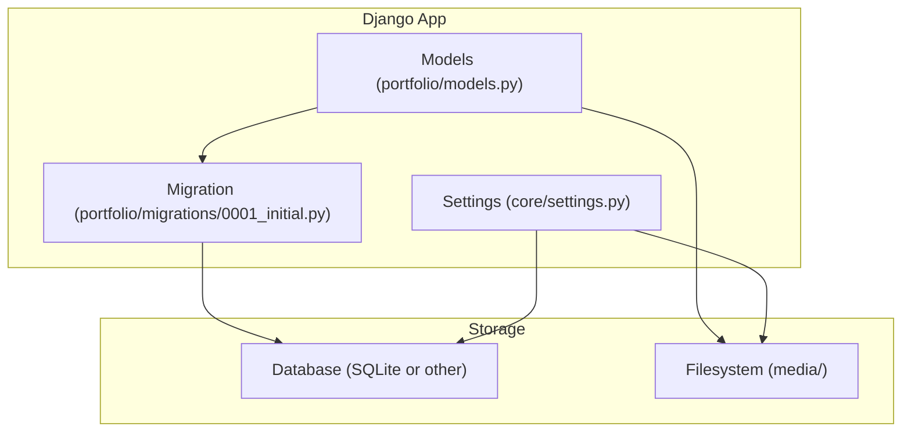
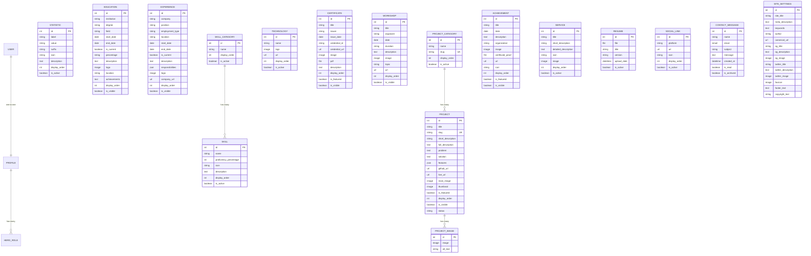

# Database Schema

<cite>
**Referenced Files in This Document**
- [models.py](file://portfolio/models.py)
- [0001_initial.py](file://portfolio/migrations/0001_initial.py)
- [settings.py](file://core/settings.py)
</cite>

## Table of Contents
1. [Introduction](#introduction)
2. [Project Structure](#project-structure)
3. [Core Components](#core-components)
4. [Architecture Overview](#architecture-overview)
5. [Detailed Component Analysis](#detailed-component-analysis)
6. [Dependency Analysis](#dependency-analysis)
7. [Performance Considerations](#performance-considerations)
8. [Troubleshooting Guide](#troubleshooting-guide)
9. [Conclusion](#conclusion)
10. [Appendices](#appendices)

## Introduction
This document describes the database schema for the Portfolio CMS. It covers all entity models, their fields, data types, constraints, relationships, and validation rules. It also explains cascading behaviors, indexing strategies, file upload handling, data lifecycle management, and performance considerations for large datasets.

## Project Structure
The schema is defined in Django models and materialized by migrations. Media files are stored under a configured media root and served via a media URL. The project uses SQLite by default but can be adapted to other backends.

**Diagram sources**
- [models.py:1-298](file://portfolio/models.py#L1-L298)
- [0001_initial.py:1-335](file://portfolio/migrations/0001_initial.py#L1-L335)
- [settings.py:77-141](file://core/settings.py#L77-L141)

**Section sources**
- [models.py:1-298](file://portfolio/models.py#L1-L298)
- [0001_initial.py:1-335](file://portfolio/migrations/0001_initial.py#L1-L335)
- [settings.py:77-141](file://core/settings.py#L77-L141)

## Core Components
The schema includes the following entities: Profile, HeroRole, Statistic, Education, Experience, SkillCategory, Skill, Technology, Certificate, Workshop, ProjectCategory, Project, ProjectImage, Achievement, Service, Resume, SocialLink, ContactMessage, SiteSettings.

Key relationship patterns:
- One-to-one: Profile ↔ User (via OneToOneField).
- One-to-many: Profile → HeroRole; ProjectCategory → Project; Project → ProjectImage; SkillCategory → Skill.
- No explicit many-to-many relationships are defined in the current schema.
- Cascading deletes are used on most ForeignKey relations.

Primary keys:
- All models use an auto-incrementing BigAutoField named id unless otherwise specified.

Indexing:
- Unique indexes exist for SlugField fields (e.g., Project.slug, ProjectCategory.slug).
- Ordering is enforced at the model level via Meta.ordering for consistent list rendering.

Validation:
- Field-level validation is provided by Django field types (e.g., EmailField, URLField, ImageField, FileField).
- Business logic constraints are enforced via booleans like is_visible, is_active, is_current, and status values.

**Section sources**
- [models.py:4-298](file://portfolio/models.py#L4-L298)
- [0001_initial.py:17-335](file://portfolio/migrations/0001_initial.py#L17-L335)

## Architecture Overview
The system stores structured content (profile, projects, education, etc.) and user-submitted messages. Media assets (images, PDFs) are uploaded to the filesystem and referenced by models. Settings control site-wide metadata and social sharing images.

**Diagram sources**
- [models.py:4-298](file://portfolio/models.py#L4-L298)
- [0001_initial.py:17-335](file://portfolio/migrations/0001_initial.py#L17-L335)

## Detailed Component Analysis

### Profile
- Purpose: Stores personal and contact information tied to a Django User account.
- Key fields: full_name, short_name, professional_title, bio, philosophy, location, profile_image, alternate_profile_image, email, phone, availability_status, current_status.
- Relationships: OneToOne with User; cascade delete when user is removed.
- Validation: EmailField enforces email format; ImageField validates image uploads; CharField length limits apply.
- Indexes: None beyond implicit primary key.
- Notes: alternate_profile_image is optional.

**Section sources**
- [models.py:4-21](file://portfolio/models.py#L4-L21)
- [0001_initial.py:253-270](file://portfolio/migrations/0001_initial.py#L253-L270)

### HeroRole
- Purpose: Multiple roles per profile (e.g., “Developer”, “Designer”).
- Key fields: role_text, display_order, is_active.
- Relationships: ForeignKey to Profile with CASCADE; related_name hero_roles.
- Ordering: By display_order.
- Validation: CharField length limit; PositiveIntegerField for ordering.

**Section sources**
- [models.py:22-33](file://portfolio/models.py#L22-L33)
- [0001_initial.py:272-283](file://portfolio/migrations/0001_initial.py#L272-L283)

### Statistic
- Purpose: Display metrics (e.g., years of experience, projects completed).
- Key fields: label, value, suffix, icon, description, display_order, is_active.
- Ordering: By display_order.
- Validation: CharField lengths; optional suffix/icon/description.

**Section sources**
- [models.py:34-48](file://portfolio/models.py#L34-L48)
- [0001_initial.py:204-218](file://portfolio/migrations/0001_initial.py#L204-L218)

### Education
- Purpose: Academic background entries.
- Key fields: institution, degree, field, start_date, end_date, is_current, percentage, description, logo, location, achievements, display_order, is_visible.
- Validation: Date fields; ImageField for logo; optional end_date; JSON not used here.
- Ordering: By display_order.

**Section sources**
- [models.py:49-69](file://portfolio/models.py#L49-L69)
- [0001_initial.py:71-91](file://portfolio/migrations/0001_initial.py#L71-L91)

### Experience
- Purpose: Work history entries.
- Key fields: company, position, employment_type, location, start_date, end_date, is_current, description, responsibilities (JSON), logo, company_url, display_order, is_visible.
- Validation: JSONField for responsibilities; URLField for company_url; ImageField for logo.
- Ordering: By display_order.

**Section sources**
- [models.py:70-90](file://portfolio/models.py#L70-L90)
- [0001_initial.py:93-113](file://portfolio/migrations/0001_initial.py#L93-L113)

### SkillCategory and Skill
- Purpose: Group skills into categories and define individual skills with proficiency.
- Relationships: SkillCategory → Skill (one-to-many); cascade delete.
- Key fields:
  - SkillCategory: name, display_order, is_active.
  - Skill: category FK, name, proficiency_percentage, icon, description, display_order, is_active.
- Ordering: Both ordered by display_order.

**Section sources**
- [models.py:91-116](file://portfolio/models.py#L91-L116)
- [0001_initial.py:178-188](file://portfolio/migrations/0001_initial.py#L178-L188)
- [0001_initial.py:319-333](file://portfolio/migrations/0001_initial.py#L319-L333)

### Technology
- Purpose: Showcase technologies/tools with logos and links.
- Key fields: name, logo, url, display_order, is_active.
- Validation: ImageField for logo; URLField for url.

**Section sources**
- [models.py:117-129](file://portfolio/models.py#L117-L129)
- [0001_initial.py:220-232](file://portfolio/migrations/0001_initial.py#L220-L232)

### Certificate
- Purpose: Certifications with proof attachments.
- Key fields: title, issuer, issue_date, credential_id, credential_url, image, pdf, description, display_order, is_featured, is_visible.
- Validation: ImageField for image; FileField for pdf; URLField for credential_url.

**Section sources**
- [models.py:130-148](file://portfolio/models.py#L130-L148)
- [0001_initial.py:38-56](file://portfolio/migrations/0001_initial.py#L38-L56)

### Workshop
- Purpose: Workshops attended or conducted.
- Key fields: title, organizer, date, duration, description, image, topic, url, display_order, is_visible.
- Validation: ImageField for image; URLField for url.

**Section sources**
- [models.py:149-166](file://portfolio/models.py#L149-L166)
- [0001_initial.py:234-251](file://portfolio/migrations/0001_initial.py#L234-L251)

### ProjectCategory and Project
- Purpose: Organize projects into categories and store project details.
- Relationships: ProjectCategory → Project (one-to-many); cascade delete.
- Key fields:
  - ProjectCategory: name, slug (unique), display_order, is_active.
  - Project: category FK, title, slug (unique), short_description, full_description, problem, solution, features (JSON), github_url, live_url, main_image, thumbnail, is_featured, display_order, is_visible, status.
- Validation: SlugField unique; ImageFields for main_image/thumbnail; URLFields for links; JSONField for features.
- Ordering: Both ordered by display_order.

**Section sources**
- [models.py:167-202](file://portfolio/models.py#L167-L202)
- [0001_initial.py:115-126](file://portfolio/migrations/0001_initial.py#L115-L126)
- [0001_initial.py:285-308](file://portfolio/migrations/0001_initial.py#L285-L308)

### ProjectImage
- Purpose: Gallery images for projects.
- Key fields: project FK, image, alt_text.
- Relationships: ForeignKey to Project with CASCADE; related_name images.

**Section sources**
- [models.py:203-207](file://portfolio/models.py#L203-L207)
- [0001_initial.py:310-317](file://portfolio/migrations/0001_initial.py#L310-L317)

### Achievement
- Purpose: Notable accomplishments with optional proofs.
- Key fields: title, date, description, organization, image, certificate_proof, url, icon, display_order, is_featured, is_visible.
- Validation: ImageField for image; FileField for certificate_proof; URLField for url.

**Section sources**
- [models.py:208-226](file://portfolio/models.py#L208-L226)
- [0001_initial.py:18-36](file://portfolio/migrations/0001_initial.py#L18-L36)

### Service
- Purpose: Services offered.
- Key fields: title, short_description, detailed_description, icon, image, display_order, is_active.
- Validation: ImageField for image.

**Section sources**
- [models.py:227-241](file://portfolio/models.py#L227-L241)
- [0001_initial.py:139-153](file://portfolio/migrations/0001_initial.py#L139-L153)

### Resume
- Purpose: Store downloadable resume documents.
- Key fields: file, title, version, upload_date (auto), is_active.
- Validation: FileField for document upload.

**Section sources**
- [models.py:242-251](file://portfolio/models.py#L242-L251)
- [0001_initial.py:128-137](file://portfolio/migrations/0001_initial.py#L128-L137)

### SocialLink
- Purpose: External social profiles.
- Key fields: platform, url, icon, display_order, is_active.
- Validation: URLField for url.

**Section sources**
- [models.py:252-264](file://portfolio/models.py#L252-L264)
- [0001_initial.py:190-202](file://portfolio/migrations/0001_initial.py#L190-L202)

### ContactMessage
- Purpose: Inquiries from visitors.
- Key fields: name, email, subject, message, created_at (auto), is_read, is_archived.
- Validation: EmailField for email.

**Section sources**
- [models.py:265-276](file://portfolio/models.py#L265-L276)
- [0001_initial.py:58-69](file://portfolio/migrations/0001_initial.py#L58-L69)

### SiteSettings
- Purpose: Global site metadata and social sharing assets.
- Key fields: site_title, meta_description, keywords, author, canonical_url, og_title, og_description, og_image, twitter_title, twitter_description, twitter_image, favicon, footer_text, copyright_text.
- Validation: URLField for canonical_url; ImageFields for og_image, twitter_image, favicon.

**Section sources**
- [models.py:277-298](file://portfolio/models.py#L277-L298)
- [0001_initial.py:155-176](file://portfolio/migrations/0001_initial.py#L155-L176)

## Dependency Analysis
Relationships summary:
- Profile ↔ User: OneToOne (CASCADE).
- Profile → HeroRole: OneToMany (CASCADE).
- ProjectCategory → Project: OneToMany (CASCADE).
- Project → ProjectImage: OneToMany (CASCADE).
- SkillCategory → Skill: OneToMany (CASCADE).
- Other entities are standalone with no direct foreign keys to each other.

Cascading behavior:
- Deleting a parent record (e.g., Profile, ProjectCategory, Project, SkillCategory) will cascade delete dependent records where explicitly defined.

Indexing strategy:
- Unique indexes on slug fields ensure URL-friendly identifiers.
- Ordering by display_order provides predictable lists without extra queries.

Potential improvements:
- Add indexes on frequently filtered fields (e.g., is_visible, is_active, status) if query patterns demand it.
- Consider composite indexes for common filter combinations (e.g., is_visible + display_order).

**Section sources**
- [models.py:4-298](file://portfolio/models.py#L4-L298)
- [0001_initial.py:17-335](file://portfolio/migrations/0001_initial.py#L17-L335)

## Performance Considerations
- Large image sets: Use appropriate image sizes and consider lazy loading on the frontend. Offload processing to storage services in production.
- JSON fields: Store lightweight arrays/objects; avoid overly nested structures that increase payload size.
- Query optimization: Filter by is_visible/is_active and order by display_order to minimize sorting overhead.
- Media storage: Configure production media serving (e.g., CDN) to reduce bandwidth and improve load times.
- Database backend: SQLite is suitable for development; switch to PostgreSQL/MySQL for production workloads with higher concurrency and larger datasets.

[No sources needed since this section provides general guidance]

## Troubleshooting Guide
Common issues and resolutions:
- Missing media files: Ensure MEDIA_ROOT and MEDIA_URL are correctly set and that static/media directories are writable.
- Upload errors: Validate file types and sizes at the application layer; configure server limits for uploads.
- Integrity errors: Deleting a parent record may remove children due to CASCADE; verify dependencies before deletion.
- Slug conflicts: Unique slugs prevent duplicates; regenerate or adjust slugs when updating titles.
- Email/URL validation failures: Ensure inputs conform to EmailField/URLField formats.

Operational checks:
- Verify migrations are applied and match model definitions.
- Confirm settings for database engine and paths.

**Section sources**
- [settings.py:77-141](file://core/settings.py#L77-L141)
- [0001_initial.py:1-335](file://portfolio/migrations/0001_initial.py#L1-L335)

## Conclusion
The Portfolio CMS schema provides a comprehensive structure for managing personal portfolio content, including profile data, projects, education, experience, skills, certifications, workshops, achievements, services, technologies, statistics, social links, contact messages, and site settings. Relationships are straightforward with clear one-to-one and one-to-many associations, and cascading deletes maintain referential integrity. Proper indexing and validation rules support reliable data entry and efficient querying. For production, consider optimizing media handling, adding targeted indexes, and migrating to a robust database backend.

[No sources needed since this section summarizes without analyzing specific files]

## Appendices

### Data Lifecycle Management
- Creation: Admin or API endpoints create records; media uploads are saved to disk under MEDIA_ROOT.
- Updates: Fields like is_visible, is_active, and status control visibility and lifecycle states.
- Deletion: CASCADE behavior removes dependent records where defined; archive flags (is_archived, is_read) allow soft archival for messages.

**Section sources**
- [models.py:4-298](file://portfolio/models.py#L4-L298)
- [0001_initial.py:17-335](file://portfolio/migrations/0001_initial.py#L17-L335)

### File Upload Handling
- Storage: ImageField and FileField store files under MEDIA_ROOT with upload_to paths (e.g., profile/, projects/, certificates/).
- Serving: MEDIA_URL serves files during development; configure production web server or CDN accordingly.
- Validation: Django’s field validators enforce type and format; add custom validation for size/type as needed.

**Section sources**
- [settings.py:87-94](file://core/settings.py#L87-L94)
- [settings.py:134-136](file://core/settings.py#L134-L136)
- [models.py:12-13](file://portfolio/models.py#L12-L13)
- [models.py:190-191](file://portfolio/models.py#L190-L191)
- [models.py:136-137](file://portfolio/models.py#L136-L137)

### Indexing Strategy Recommendations
- Existing: Unique indexes on slug fields; ordering by display_order.
- Recommended: Add indexes on frequently filtered columns (e.g., is_visible, is_active, status) and composite indexes for common query patterns.

**Section sources**
- [models.py:169-183](file://portfolio/models.py#L169-L183)
- [0001_initial.py:115-126](file://portfolio/migrations/0001_initial.py#L115-L126)
- [0001_initial.py:285-308](file://portfolio/migrations/0001_initial.py#L285-L308)