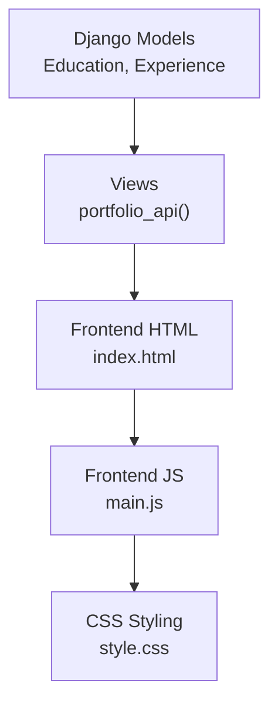
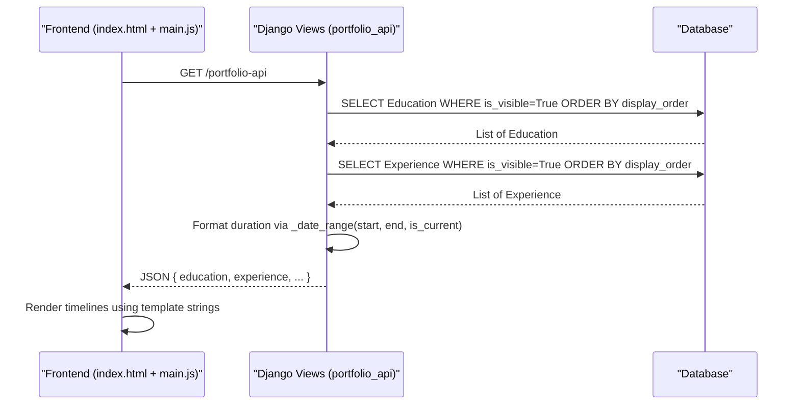
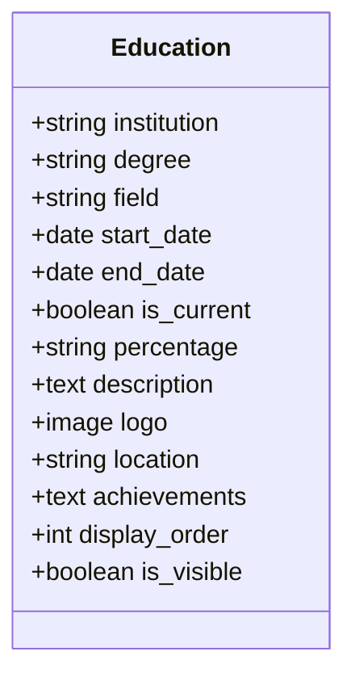
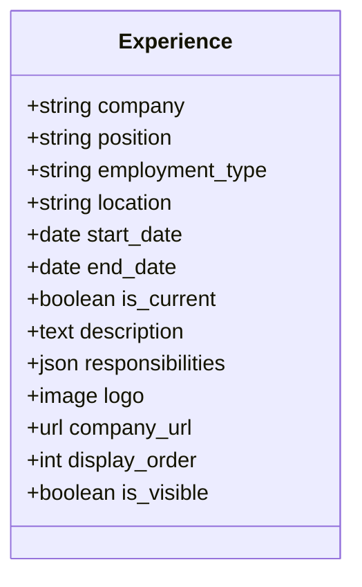
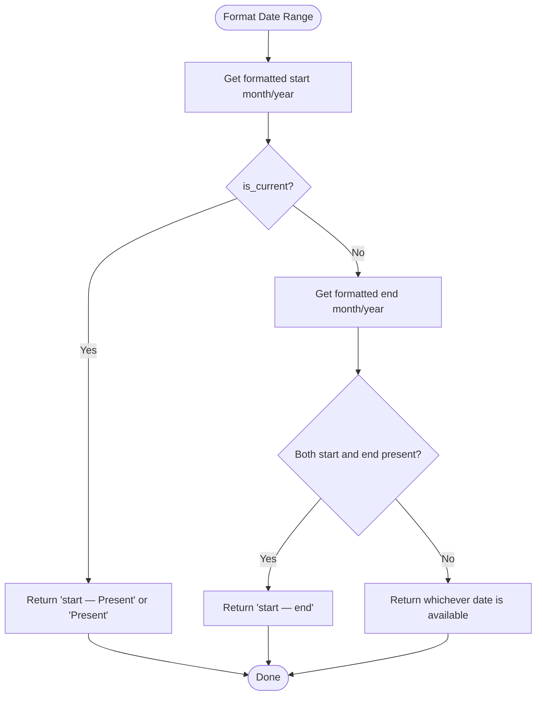
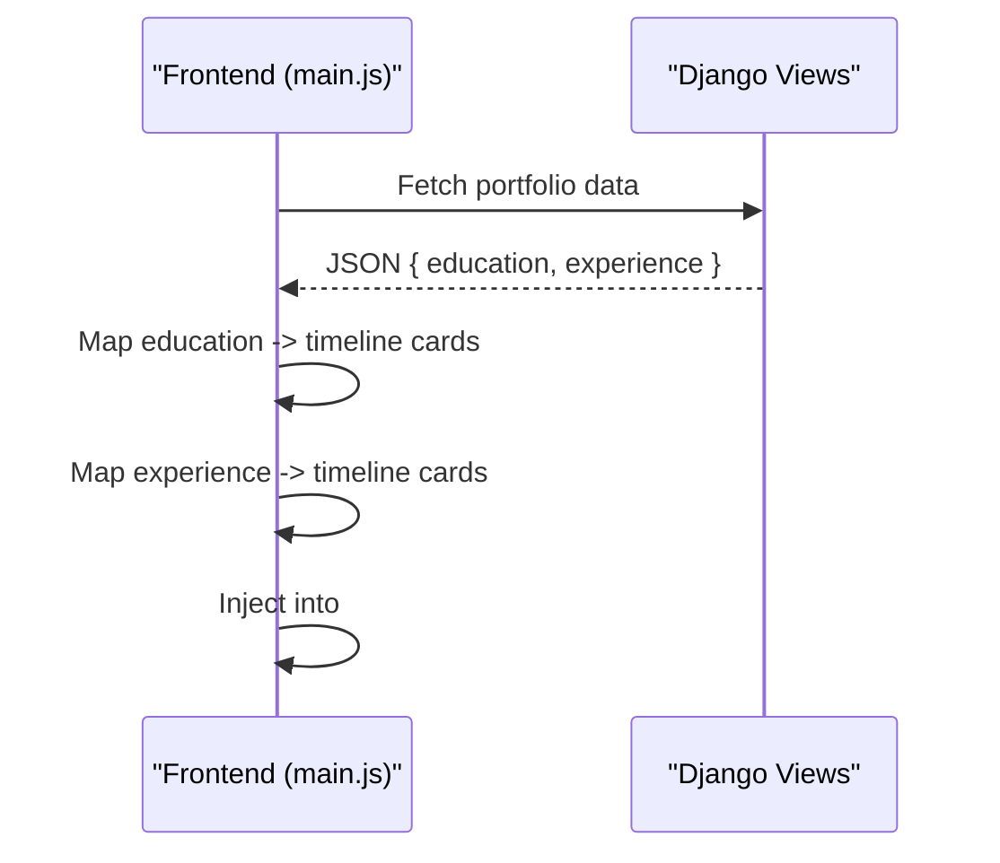
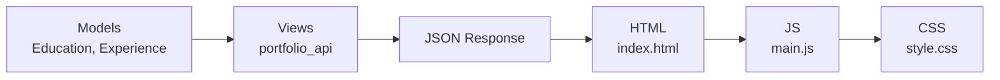

# Professional History

<cite>
**Referenced Files in This Document**
- [models.py](file://portfolio/models.py)
- [views.py](file://portfolio/views.py)
- [forms_extended.py](file://portfolio/forms_extended.py)
- [index.html](file://index.html)
- [main.js](file://main.js)
- [style.css](file://style.css)
</cite>

## Table of Contents
1. [Introduction](#introduction)
2. [Project Structure](#project-structure)
3. [Core Components](#core-components)
4. [Architecture Overview](#architecture-overview)
5. [Detailed Component Analysis](#detailed-component-analysis)
6. [Dependency Analysis](#dependency-analysis)
7. [Performance Considerations](#performance-considerations)
8. [Troubleshooting Guide](#troubleshooting-guide)
9. [Conclusion](#conclusion)

## Introduction
This document provides detailed data model documentation for the professional history entities: Education and Experience. It explains their fields, constraints, and how they are used to build timeline-based presentations across the application. It also covers date range handling, current employment detection, and visibility controls that drive what is shown to end users.

## Project Structure
The professional history models live in the Django app’s models file and are consumed by views that expose a JSON API for the frontend. The frontend renders timelines using JavaScript templates driven by that API.

**Diagram sources**
- [models.py:49-89](file://portfolio/models.py#L49-L89)
- [views.py:324-457](file://portfolio/views.py#L324-L457)
- [index.html:194-212](file://index.html#L194-L212)
- [main.js:221-250](file://main.js#L221-L250)
- [style.css:690-728](file://style.css#L690-L728)

**Section sources**
- [models.py:49-89](file://portfolio/models.py#L49-L89)
- [views.py:324-457](file://portfolio/views.py#L324-L457)
- [index.html:194-212](file://index.html#L194-L212)
- [main.js:221-250](file://main.js#L221-L250)
- [style.css:690-728](file://style.css#L690-L728)

## Core Components
- Education model: stores academic records with institution details, temporal information, achievements, visual branding, location, and display controls.
- Experience model: stores employment history with company details, role, temporal data, structured responsibilities via JSONField, branding, and visibility controls.

Both models support ordering and visibility flags to control presentation order and whether items are included in public outputs.

**Section sources**
- [models.py:49-89](file://portfolio/models.py#L49-L89)

## Architecture Overview
The application uses a single API endpoint to serve all portfolio data to the frontend. For professional history, it filters visible entries, formats dates into human-readable ranges, and maps model fields to a frontend-friendly structure. The frontend then renders timeline cards for education and experience sections.

**Diagram sources**
- [views.py:324-457](file://portfolio/views.py#L324-L457)
- [index.html:194-212](file://index.html#L194-L212)
- [main.js:221-250](file://main.js#L221-L250)

## Detailed Component Analysis

### Education Model
Purpose: Represent formal education entries for timeline display and administrative management.

Key fields and roles:
- Institution details:
  - institution: Name of the educational institution.
  - degree: Degree obtained or pursued.
  - field: Field of study (optional).
- Temporal information:
  - start_date: Start of the program.
  - end_date: End of the program; nullable to support ongoing programs.
  - is_current: Boolean flag indicating an ongoing program.
- Academic achievements:
  - percentage: Numeric or textual representation of performance.
  - description: Narrative about the program or outcomes.
  - achievements: Optional additional achievements or highlights.
- Visual elements:
  - logo: Image representing the institution.
- Location tracking:
  - location: City or region where the institution is located.
- Display controls:
  - display_order: Integer controlling sort order in lists and timelines.
  - is_visible: Boolean to include/exclude from public outputs.

Model behavior:
- Ordering: Default ordering by display_order ensures consistent presentation.
- String representation: Returns a readable summary combining degree and institution.

Data flow to frontend:
- The API filters Education by is_visible=True and maps fields to a simplified shape including institution, course (degree and optional field), duration (formatted via _date_range), percentage, description, and logo URL.

**Diagram sources**
- [models.py:49-69](file://portfolio/models.py#L49-L69)

**Section sources**
- [models.py:49-69](file://portfolio/models.py#L49-L69)
- [views.py:346-356](file://portfolio/views.py#L346-L356)

### Experience Model
Purpose: Represent employment history for timeline display and administrative management.

Key fields and roles:
- Company information:
  - company: Employer name.
  - position: Job title or role.
  - employment_type: Type of employment (e.g., full-time, contract).
  - location: Work location.
- Temporal data:
  - start_date: Employment start date.
  - end_date: Employment end date; nullable for ongoing roles.
  - is_current: Boolean flag indicating current employment.
- Responsibilities:
  - responsibilities: JSONField storing structured job responsibilities as a list or array.
- Branding:
  - logo: Company logo image.
  - company_url: Link to the company website.
- Visibility controls:
  - display_order: Sort order for listings and timelines.
  - is_visible: Include/exclude from public outputs.

Model behavior:
- Ordering: Default ordering by display_order ensures consistent presentation.
- String representation: Returns a readable summary combining position and company.

Data flow to frontend:
- The API filters Experience by is_visible=True and maps fields to a frontend-friendly shape including company, role, employmentType, duration (formatted via _date_range), location, outcomes (description), responsibilities (from JSONField), and technologies (placeholder empty list in this implementation).

**Diagram sources**
- [models.py:70-89](file://portfolio/models.py#L70-L89)

**Section sources**
- [models.py:70-89](file://portfolio/models.py#L70-L89)
- [views.py:358-370](file://portfolio/views.py#L358-L370)

### Date Range Handling and Current Employment Detection
- Duration formatting:
  - The helper function formats date ranges into human-readable strings such as “Jan 2020 — Dec 2022” or “Jan 2020 — Present”.
  - If is_current is true, the end label becomes “Present”, regardless of end_date.
  - If either date is missing, it falls back gracefully to available values.
- Usage:
  - Applied consistently to both Education and Experience entries when building the API response.

**Diagram sources**
- [views.py:324-332](file://portfolio/views.py#L324-L332)

**Section sources**
- [views.py:324-332](file://portfolio/views.py#L324-L332)

### Timeline-Based Presentation Patterns
- Frontend containers:
  - Education section container: id="education-container".
  - Experience section container: id="experience-container".
- Rendering logic:
  - The frontend fetches portfolio data and maps each entry to a timeline card template.
  - Cards show institution/company name, duration, role/degree, optional location, description, and structured responsibilities for experience.
- Styling:
  - CSS defines timeline lines, markers, and card styles for both education and experience timelines.

**Diagram sources**
- [index.html:194-212](file://index.html#L194-L212)
- [main.js:221-250](file://main.js#L221-L250)
- [style.css:690-728](file://style.css#L690-L728)

**Section sources**
- [index.html:194-212](file://index.html#L194-L212)
- [main.js:221-250](file://main.js#L221-L250)
- [style.css:690-728](file://style.css#L690-L728)

## Dependency Analysis
- Models depend on Django ORM primitives and image upload paths.
- Views import models and forms to provide CRUD and API endpoints.
- Forms map directly to models for admin-like editing interfaces.
- Frontend depends on the API response shape and DOM IDs to render timelines.

**Diagram sources**
- [models.py:49-89](file://portfolio/models.py#L49-L89)
- [views.py:324-457](file://portfolio/views.py#L324-L457)
- [index.html:194-212](file://index.html#L194-L212)
- [main.js:221-250](file://main.js#L221-L250)
- [style.css:690-728](file://style.css#L690-L728)

**Section sources**
- [models.py:49-89](file://portfolio/models.py#L49-L89)
- [views.py:324-457](file://portfolio/views.py#L324-L457)
- [index.html:194-212](file://index.html#L194-L212)
- [main.js:221-250](file://main.js#L221-L250)
- [style.css:690-728](file://style.css#L690-L728)

## Performance Considerations
- Filtering by is_visible reduces payload size for public endpoints.
- Using display_order ensures deterministic sorting without client-side reordering.
- JSONField for responsibilities avoids extra tables and keeps related data co-located with the experience record.
- Image fields store references; ensure proper CDN or caching strategies for logos.

[No sources needed since this section provides general guidance]

## Troubleshooting Guide
- Missing or incorrect dates:
  - Ensure start_date is set; end_date can be null for ongoing roles.
  - Verify is_current is set appropriately to produce “Present” in durations.
- Items not appearing:
  - Confirm is_visible is True for entries you want displayed.
  - Check display_order if sorting seems unexpected.
- Responsibilities not rendering:
  - Ensure responsibilities is a valid JSON array in the database.
  - The frontend expects an array; non-array values may cause rendering issues.
- Images not loading:
  - Verify logo files are uploaded correctly and accessible at configured paths.

**Section sources**
- [models.py:49-89](file://portfolio/models.py#L49-L89)
- [views.py:324-370](file://portfolio/views.py#L324-L370)

## Conclusion
The Education and Experience models provide a robust foundation for professional history management and timeline-based presentation. Their design supports flexible temporal data, structured responsibilities, branding assets, and clear visibility controls. The API normalizes these into a frontend-friendly format, enabling consistent and maintainable rendering of timelines across the site.