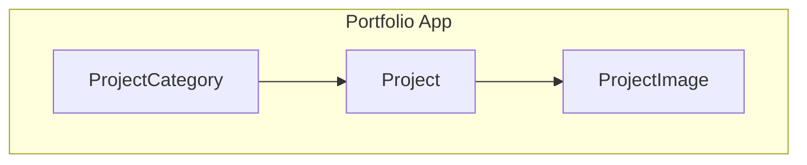
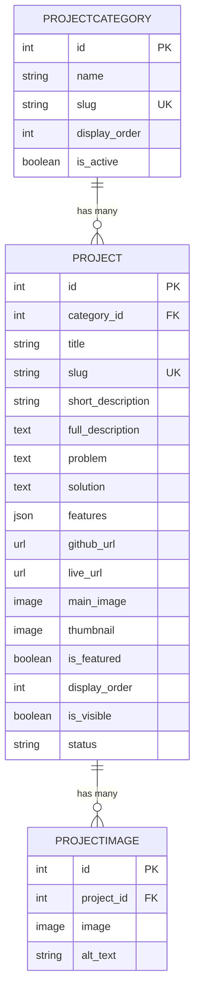
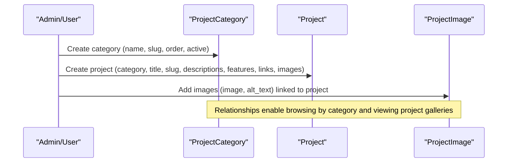
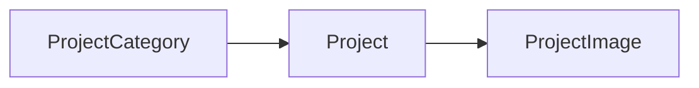

# Project Management

<cite>
**Referenced Files in This Document**
- [models.py](file://portfolio/models.py)
- [0001_initial.py](file://portfolio/migrations/0001_initial.py)
</cite>

## Table of Contents
1. [Introduction](#introduction)
2. [Project Structure](#project-structure)
3. [Core Components](#core-components)
4. [Architecture Overview](#architecture-overview)
5. [Detailed Component Analysis](#detailed-component-analysis)
6. [Dependency Analysis](#dependency-analysis)
7. [Performance Considerations](#performance-considerations)
8. [Troubleshooting Guide](#troubleshooting-guide)
9. [Conclusion](#conclusion)
10. [Appendices](#appendices)

## Introduction
This document provides detailed data model documentation for project-related entities: ProjectCategory, Project, and ProjectImage. It explains how projects are organized into categories with URL-friendly slugs and display ordering, the comprehensive structure of the Project model (including category relationships, SEO-friendly slugs, dual-level descriptions, problem-solution frameworks, feature lists via JSONField, external links, multiple image support, and advanced filtering), and the ProjectImage model that enables gallery functionality with alt text for accessibility. Examples illustrate categorization workflows, gallery implementation patterns, and status tracking.

## Project Structure
The project-related models reside in the Django app’s models module and are reflected in the initial migration. The key files are:
- Data model definitions: portfolio/models.py
- Database schema creation: portfolio/migrations/0001_initial.py

**Diagram sources**
- [models.py:167-207](file://portfolio/models.py#L167-L207)
- [0001_initial.py:284-317](file://portfolio/migrations/0001_initial.py#L284-L317)

**Section sources**
- [models.py:167-207](file://portfolio/models.py#L167-L207)
- [0001_initial.py:284-317](file://portfolio/migrations/0001_initial.py#L284-L317)

## Core Components
- ProjectCategory: Organizes projects with a unique slug for URL-friendly categorization, display_order for sorting, and is_active to control visibility.
- Project: Central entity with category relationship, SEO-friendly slug, short and full descriptions, optional problem/solution fields, features as a JSON list, external links (GitHub and live site), main image and thumbnail, and flags for featured, visibility, ordering, and status.
- ProjectImage: Gallery images linked to a project with an optional alt_text for accessibility.

**Section sources**
- [models.py:167-207](file://portfolio/models.py#L167-L207)
- [0001_initial.py:284-317](file://portfolio/migrations/0001_initial.py#L284-L317)

## Architecture Overview
The data architecture centers on a one-to-many relationship from ProjectCategory to Project and a one-to-many relationship from Project to ProjectImage. This supports categorized browsing, flexible project metadata, and rich galleries per project.

**Diagram sources**
- [models.py:167-207](file://portfolio/models.py#L167-L207)
- [0001_initial.py:284-317](file://portfolio/migrations/0001_initial.py#L284-L317)

## Detailed Component Analysis

### ProjectCategory Model
Purpose:
- Group projects into logical categories.
- Provide URL-friendly slugs for clean URLs.
- Control presentation order and active state.

Key attributes:
- name: Human-readable category label.
- slug: Unique, URL-safe identifier used for routing and SEO.
- display_order: Positive integer controlling sort order across categories.
- is_active: Boolean flag to include or exclude categories from listings.

Behavior:
- Default ordering by display_order ensures consistent UI presentation.
- Slug uniqueness prevents duplicate category URLs.

Example usage:
- Create categories like “Web Apps”, “Mobile”, “Open Source”.
- Use slugs such as “web-apps” for clean URLs.
- Toggle is_active to hide experimental categories without deleting them.

**Section sources**
- [models.py:167-178](file://portfolio/models.py#L167-L178)
- [0001_initial.py:284-308](file://portfolio/migrations/0001_initial.py#L284-L308)

### Project Model
Purpose:
- Represent individual projects with rich metadata and media.
- Link each project to a category.
- Support SEO-friendly URLs, concise and detailed descriptions, structured features, external links, and multiple images.

Key attributes:
- category: Foreign key to ProjectCategory; related_name='projects' allows reverse lookup.
- title: Project title.
- slug: Unique, URL-friendly identifier for SEO and routing.
- short_description: Brief summary for cards/lists.
- full_description: Detailed narrative for project pages.
- problem: Optional context describing the challenge addressed.
- solution: Optional description of the approach taken.
- features: JSONField storing a list of feature entries; flexible schema for varied content.
- github_url: Optional link to source code repository.
- live_url: Optional link to deployed application.
- main_image: Primary visual asset for the project.
- thumbnail: Optional smaller image for previews.
- is_featured: Flag to highlight select projects.
- display_order: Controls listing order within a category or globally.
- is_visible: Controls visibility in public listings.
- status: Text field indicating lifecycle stage (default 'completed').

Behavior:
- Default ordering by display_order ensures predictable presentation.
- Slug uniqueness guarantees stable URLs.
- JSONField allows evolving feature structures without schema changes.

Example usage:
- Set status to track progress: e.g., 'planning', 'in-progress', 'completed'.
- Use is_visible to draft projects before publishing.
- Populate features as a list of objects or strings depending on your frontend needs.

**Section sources**
- [models.py:179-201](file://portfolio/models.py#L179-L201)
- [0001_initial.py:284-308](file://portfolio/migrations/0001_initial.py#L284-L308)

### ProjectImage Model
Purpose:
- Attach multiple images to a project for galleries.
- Provide alt_text for accessibility and SEO.

Key attributes:
- project: Foreign key to Project; related_name='images' enables accessing all images for a project.
- image: Uploaded image file stored under a dedicated path.
- alt_text: Descriptive text for screen readers and fallback scenarios.

Behavior:
- Cascade deletion ensures orphaned images are removed when their project is deleted.
- Alt text improves accessibility and searchability.

Example usage:
- Add screenshots, mockups, and demo images to a project’s gallery.
- Write meaningful alt_text to describe each image’s purpose.

**Section sources**
- [models.py:203-207](file://portfolio/models.py#L203-L207)
- [0001_initial.py:309-317](file://portfolio/migrations/0001_initial.py#L309-L317)

### Relationships and Data Flow
- Category to Projects: One ProjectCategory can have many Projects; querying category.projects returns associated projects.
- Project to Images: One Project can have many ProjectImages; querying project.images returns its gallery.

**Diagram sources**
- [models.py:167-207](file://portfolio/models.py#L167-L207)
- [0001_initial.py:284-317](file://portfolio/migrations/0001_initial.py#L284-L317)

## Dependency Analysis
- Project depends on ProjectCategory via a foreign key; deleting a category cascades to its projects.
- ProjectImage depends on Project via a foreign key; deleting a project cascades to its images.
- All three models use default ordering by display_order where applicable, ensuring consistent presentation.

**Diagram sources**
- [models.py:167-207](file://portfolio/models.py#L167-L207)
- [0001_initial.py:284-317](file://portfolio/migrations/0001_initial.py#L284-L317)

**Section sources**
- [models.py:167-207](file://portfolio/models.py#L167-L207)
- [0001_initial.py:284-317](file://portfolio/migrations/0001_initial.py#L284-L317)

## Performance Considerations
- Ordering: Using display_order minimizes runtime sorting overhead by leveraging database-level ordering.
- Media storage: ImageField instances store references to uploaded files; ensure efficient serving and caching strategies at the web server level.
- JSONField: Features stored as JSON allow flexible schemas but may increase payload size; consider indexing or splitting into separate tables if complex queries are required.
- Query optimization: Use select_related for category when listing projects to avoid N+1 queries; use prefetch_related for project images when rendering galleries.

[No sources needed since this section provides general guidance]

## Troubleshooting Guide
Common issues and resolutions:
- Duplicate slugs: Ensure slugs are unique for both ProjectCategory and Project; handle validation errors gracefully in forms/admin.
- Missing images: Validate required fields (e.g., main_image) during form submission; provide user feedback for missing assets.
- Broken relationships: Deleting a category removes its projects; confirm cascade behavior aligns with business rules.
- Accessibility gaps: Encourage authors to fill alt_text for ProjectImage entries to improve accessibility.

[No sources needed since this section provides general guidance]

## Conclusion
The ProjectCategory, Project, and ProjectImage models provide a robust foundation for organizing and presenting projects with clear categorization, SEO-friendly URLs, rich metadata, and accessible galleries. By leveraging display_order, status, and visibility flags, teams can manage content lifecycle effectively while maintaining high-quality user experiences.

[No sources needed since this section summarizes without analyzing specific files]

## Appendices

### Example Workflows

#### Project Categorization Workflow
- Create a new category with a descriptive name and a URL-friendly slug.
- Assign display_order to control placement in navigation or filters.
- Toggle is_active to temporarily hide categories without losing data.

**Section sources**
- [models.py:167-178](file://portfolio/models.py#L167-L178)

#### Image Gallery Implementation
- For each project, add multiple ProjectImage entries with meaningful alt_text.
- Retrieve images via the related_name to render a gallery view.
- Remove images when no longer relevant; cascade deletion keeps data consistent.

**Section sources**
- [models.py:203-207](file://portfolio/models.py#L203-L207)

#### Status Tracking Workflow
- Set status to reflect project lifecycle stages (e.g., planning, in-progress, completed).
- Use is_visible to control whether a project appears in public listings.
- Combine is_featured and display_order to highlight important work.

**Section sources**
- [models.py:179-201](file://portfolio/models.py#L179-L201)