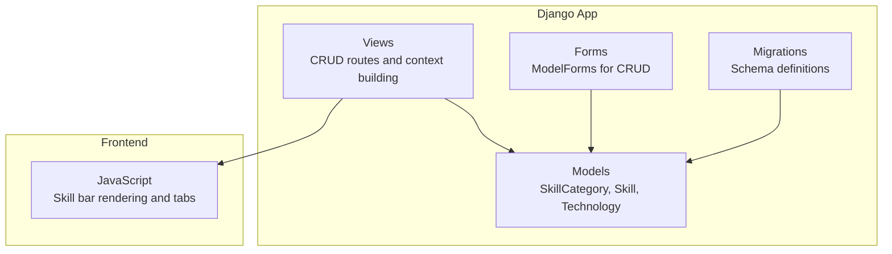
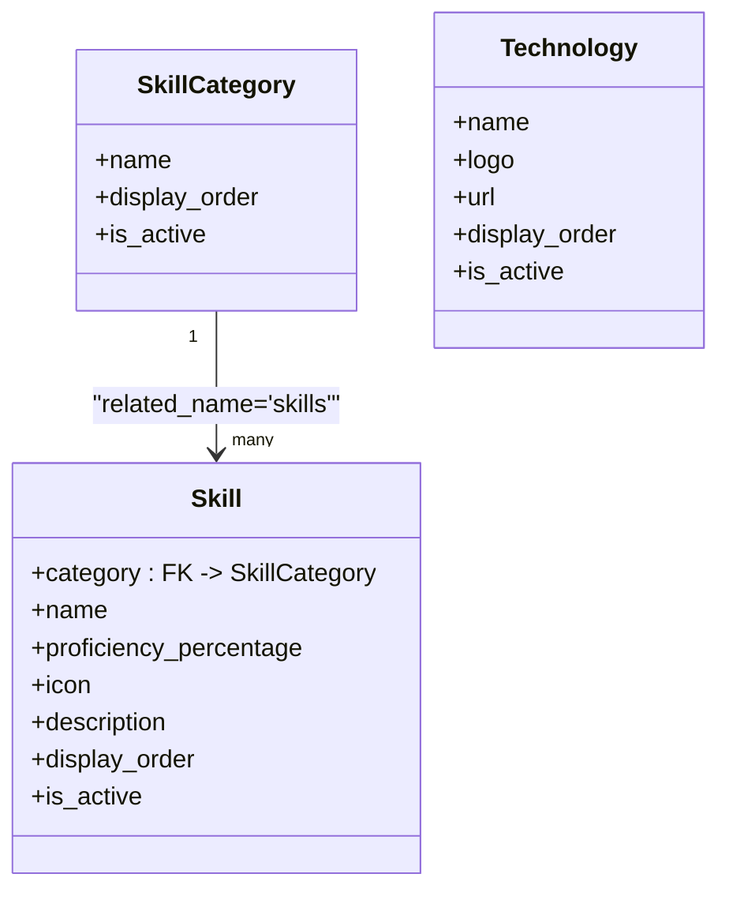
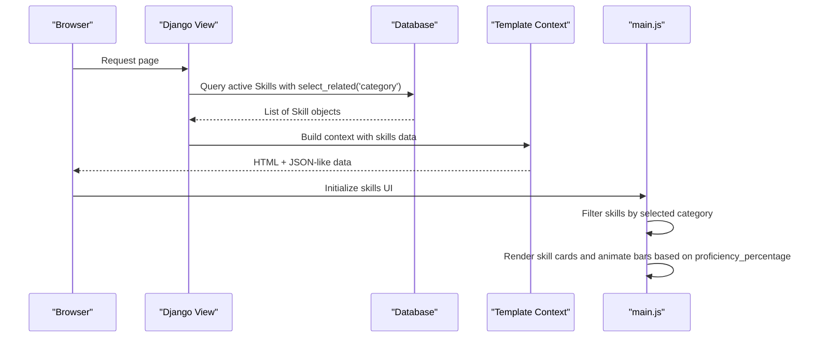
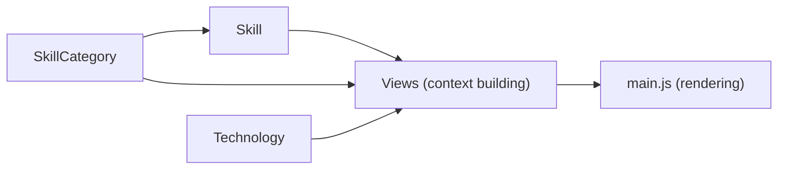

# Skills and Technologies

<cite>
**Referenced Files in This Document**
- [models.py](file://portfolio/models.py)
- [forms_extended.py](file://portfolio/forms_extended.py)
- [views.py](file://portfolio/views.py)
- [0001_initial.py](file://portfolio/migrations/0001_initial.py)
- [main.js](file://main.js)
</cite>

## Table of Contents
1. [Introduction](#introduction)
2. [Project Structure](#project-structure)
3. [Core Components](#core-components)
4. [Architecture Overview](#architecture-overview)
5. [Detailed Component Analysis](#detailed-component-analysis)
6. [Dependency Analysis](#dependency-analysis)
7. [Performance Considerations](#performance-considerations)
8. [Troubleshooting Guide](#troubleshooting-guide)
9. [Conclusion](#conclusion)

## Introduction
This document provides comprehensive data model documentation for the skills and technology entities: SkillCategory, Skill, and Technology. It explains how these models organize skills into logical groups, track proficiency levels, integrate icons, and present a dynamic technical stack with logos and external links. It also includes examples of categorization patterns, proficiency visualization approaches, and how the models work together to power skill showcases and technology stacks on the portfolio site.

## Project Structure
The relevant code for this domain is primarily located in the Django application’s models, forms, views, migrations, and frontend rendering logic:
- Data models are defined in the application’s models module.
- Admin and dashboard CRUD flows use ModelForms.
- Views prepare context data for templates and expose counts and lists for active items.
- Frontend JavaScript renders skill bars and category tabs using data provided by the backend.

**Diagram sources**
- [models.py:91-128](file://portfolio/models.py#L91-L128)
- [forms_extended.py:19-32](file://portfolio/forms_extended.py#L19-L32)
- [views.py:189-203](file://portfolio/views.py#L189-L203)
- [0001_initial.py:178-231](file://portfolio/migrations/0001_initial.py#L178-L231)
- [main.js:424-461](file://main.js#L424-L461)

**Section sources**
- [models.py:91-128](file://portfolio/models.py#L91-L128)
- [forms_extended.py:19-32](file://portfolio/forms_extended.py#L19-L32)
- [views.py:189-203](file://portfolio/views.py#L189-L203)
- [0001_initial.py:178-231](file://portfolio/migrations/0001_initial.py#L178-L231)
- [main.js:424-461](file://main.js#L424-L461)

## Core Components
This section documents the three core models that power the skills and technologies features.

### SkillCategory
Purpose: Organizes skills into logical groups (for example, “Frontend,” “Backend,” “DevOps”) with display ordering and an active state toggle.

Key attributes:
- name: Label for the category.
- display_order: Controls the order categories appear in UIs.
- is_active: Enables or disables the category from being shown.

Behavior:
- Default ordering by display_order ensures consistent presentation.
- Active flag allows temporary deprecation without deletion.

**Section sources**
- [models.py:91-100](file://portfolio/models.py#L91-L100)
- [0001_initial.py:178-188](file://portfolio/migrations/0001_initial.py#L178-L188)

### Skill
Purpose: Represents an individual skill, linked to a SkillCategory, with proficiency tracking, optional icon, description, and display controls.

Key attributes:
- category: ForeignKey to SkillCategory; cascading delete removes associated skills when a category is removed.
- name: The skill’s label.
- proficiency_percentage: Integer percentage (0–100) used for progress bars and visual indicators.
- icon: Optional identifier for a visual icon (for example, a font icon class).
- description: Optional detailed text about the skill.
- display_order: Ordering within a category or list.
- is_active: Visibility control for front-end display.

Relationships:
- One-to-many from SkillCategory to Skill via related_name 'skills'.

Validation and defaults:
- proficiency_percentage defaults to 0.
- Positive integer enforces non-negative values.

**Section sources**
- [models.py:102-115](file://portfolio/models.py#L102-L115)
- [0001_initial.py:319-333](file://portfolio/migrations/0001_initial.py#L319-L333)

### Technology
Purpose: Showcases technologies in the technical stack with logo images, optional external URLs, ordering, and active state management.

Key attributes:
- name: Technology label.
- logo: Image file stored under a dedicated upload path.
- url: Optional link to the technology’s official site or documentation.
- display_order: Controls presentation order.
- is_active: Controls visibility.

Behavior:
- Default ordering by display_order.
- Active flag enables selective showcasing.

**Section sources**
- [models.py:117-128](file://portfolio/models.py#L117-L128)
- [0001_initial.py:220-231](file://portfolio/migrations/0001_initial.py#L220-L231)

## Architecture Overview
The following diagram shows how the models relate and how they are consumed by the application layers.

**Diagram sources**
- [models.py:91-128](file://portfolio/models.py#L91-L128)

## Detailed Component Analysis

### SkillCategory Model
- Fields:
  - name: CharField(max_length=100)
  - display_order: PositiveIntegerField(default=0)
  - is_active: BooleanField(default=True)
- Ordering: By display_order
- Usage:
  - Groups skills logically.
  - Drives tabbed UI for filtering skills by category.

Example categorization patterns:
- Grouping by layer: Frontend, Backend, Database, DevOps.
- Grouping by maturity: Core, Advanced, Emerging.
- Grouping by role: Development, Testing, Operations.

**Section sources**
- [models.py:91-100](file://portfolio/models.py#L91-L100)
- [0001_initial.py:178-188](file://portfolio/migrations/0001_initial.py#L178-L188)

### Skill Model
- Fields:
  - category: ForeignKey(SkillCategory, on_delete=CASCADE, related_name='skills')
  - name: CharField(max_length=100)
  - proficiency_percentage: PositiveIntegerField(default=0)
  - icon: CharField(max_length=100, blank=True, null=True)
  - description: TextField(blank=True, null=True)
  - display_order: PositiveIntegerField(default=0)
  - is_active: BooleanField(default=True)
- Ordering: By display_order
- Relationship:
  - Each skill belongs to one category; deleting a category cascades to its skills.

Proficiency visualization approach:
- The frontend reads proficiency_percentage and animates a progress bar width accordingly.
- Values are clamped to 0–100 before rendering.

Icon integration:
- The icon field can store a font icon identifier for visual representation alongside the skill name.

Display controls:
- is_active toggles whether a skill appears in public-facing sections.
- display_order determines position within a category or global listing.

Data flow to the frontend:
- Views query active skills with select_related('category') and pass structured data to templates.
- JavaScript filters skills by selected category and renders cards with animated bars.

**Diagram sources**
- [views.py:373-423](file://portfolio/views.py#L373-L423)
- [main.js:424-461](file://main.js#L424-L461)

**Section sources**
- [models.py:102-115](file://portfolio/models.py#L102-L115)
- [views.py:373-423](file://portfolio/views.py#L373-L423)
- [main.js:424-461](file://main.js#L424-L461)

### Technology Model
- Fields:
  - name: CharField(max_length=100)
  - logo: ImageField(upload_to='tech/')
  - url: URLField(blank=True, null=True)
  - display_order: PositiveIntegerField(default=0)
  - is_active: BooleanField(default=True)
- Ordering: By display_order
- Usage:
  - Powers the technology stack showcase with logos and optional links.
  - Active flag controls which technologies are visible.

Integration points:
- Views count active technologies and provide names for contextual data.
- Templates render logos and optionally link out to the technology’s website.

**Section sources**
- [models.py:117-128](file://portfolio/models.py#L117-L128)
- [views.py:400-407](file://portfolio/views.py#L400-L407)
- [0001_initial.py:220-231](file://portfolio/migrations/0001_initial.py#L220-L231)

## Dependency Analysis
The relationships and dependencies among the models and their consumers are summarized below.

**Diagram sources**
- [models.py:91-128](file://portfolio/models.py#L91-L128)
- [views.py:373-423](file://portfolio/views.py#L373-L423)
- [main.js:424-461](file://main.js#L424-L461)

**Section sources**
- [models.py:91-128](file://portfolio/models.py#L91-L128)
- [views.py:373-423](file://portfolio/views.py#L373-L423)
- [main.js:424-461](file://main.js#L424-L461)

## Performance Considerations
- Use select_related('category') when querying skills to avoid N+1 queries when accessing category fields in templates or views.
- Keep proficiency_percentage as an integer to simplify client-side calculations and animations.
- Limit the number of displayed technologies and skills by leveraging is_active and display_order to reduce payload size.
- Cache frequently accessed lists (for example, active technologies) if the dataset grows significantly.

[No sources needed since this section provides general guidance]

## Troubleshooting Guide
Common issues and resolutions:
- Skills not appearing:
  - Ensure is_active is True for both Skill and SkillCategory.
  - Verify display_order does not push items beyond the visible range.
- Proficiency bars not animating:
  - Confirm proficiency_percentage is between 0 and 100.
  - Check that the frontend receives the expected level value and that CSS classes for bars are applied.
- Category tabs not working:
  - Ensure SkillCategory entries exist and are active.
  - Validate that the selected category matches the category.name of skills.
- Technology logos missing:
  - Confirm logo files are uploaded to the correct storage path and accessible via the configured media settings.
  - Verify url is set if linking out is required.

Operational notes:
- Deleting a SkillCategory will cascade-delete its associated Skills due to on_delete=CASCADE.
- Forms for these models are auto-generated ModelForms exposing all fields, simplifying admin/dashboard entry.

**Section sources**
- [models.py:91-128](file://portfolio/models.py#L91-L128)
- [forms_extended.py:19-32](file://portfolio/forms_extended.py#L19-L32)
- [main.js:424-461](file://main.js#L424-L461)

## Conclusion
The SkillCategory, Skill, and Technology models provide a robust foundation for organizing and presenting skills and technologies across the portfolio. SkillCategory groups skills logically, Skill tracks proficiency and supports rich metadata like icons and descriptions, and Technology showcases the technical stack with logos and links. Together, they enable dynamic, ordered, and visually engaging skill showcases and technology displays through coordinated backend data preparation and frontend rendering.

[No sources needed since this section summarizes without analyzing specific files]