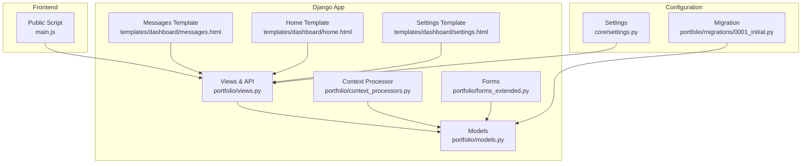
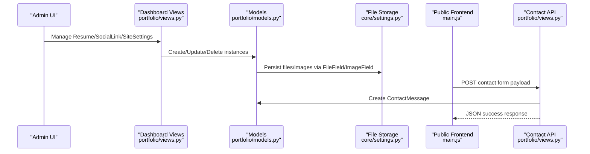
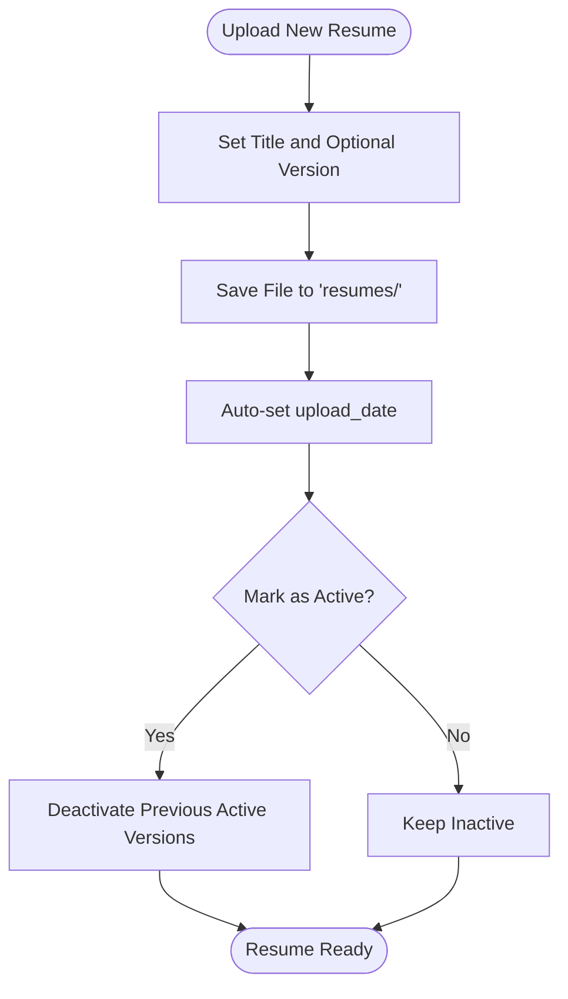
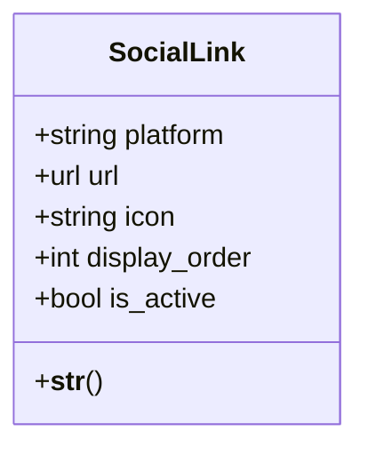
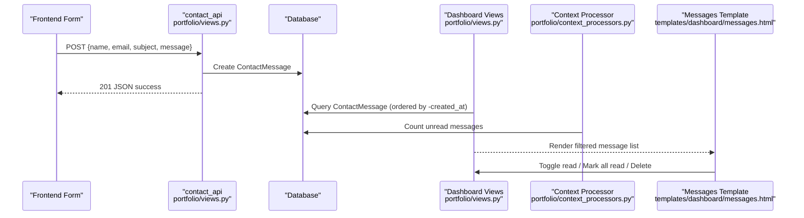
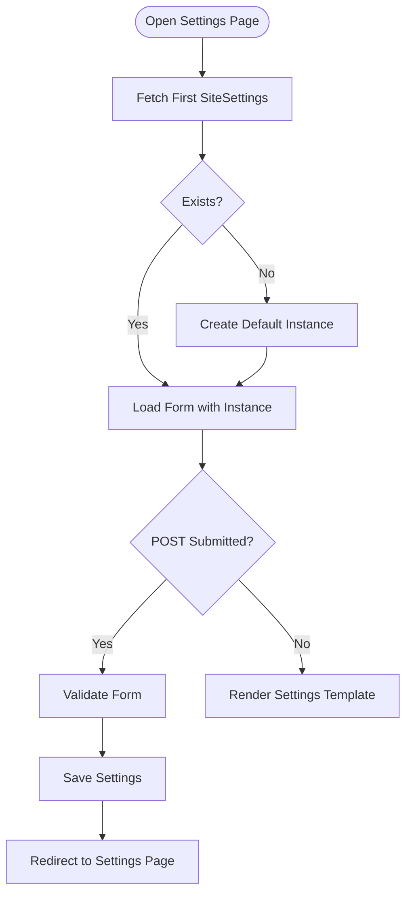
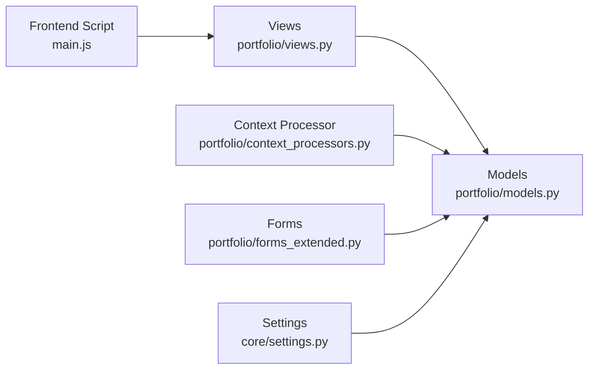

# System Entities

<cite>
**Referenced Files in This Document**
- [models.py](file://portfolio/models.py)
- [views.py](file://portfolio/views.py)
- [context_processors.py](file://portfolio/context_processors.py)
- [forms_extended.py](file://portfolio/forms_extended.py)
- [settings.py](file://core/settings.py)
- [0001_initial.py](file://portfolio/migrations/0001_initial.py)
- [main.js](file://main.js)
- [messages.html](file://templates/dashboard/messages.html)
- [home.html](file://templates/dashboard/home.html)
- [settings.html](file://templates/dashboard/settings.html)
</cite>

## Table of Contents
1. [Introduction](#introduction)
2. [Project Structure](#project-structure)
3. [Core Components](#core-components)
4. [Architecture Overview](#architecture-overview)
5. [Detailed Component Analysis](#detailed-component-analysis)
6. [Dependency Analysis](#dependency-analysis)
7. [Performance Considerations](#performance-considerations)
8. [Troubleshooting Guide](#troubleshooting-guide)
9. [Conclusion](#conclusion)

## Introduction
This document provides detailed data model documentation for four system-level entities: Resume, SocialLink, ContactMessage, and SiteSettings. It explains how these models support version-controlled resume management, social media integration, visitor communication workflows, and global site configuration. The analysis includes field semantics, storage behavior, ordering, active state control, timestamping, and the runtime usage patterns that power the portfolio application.

## Project Structure
The relevant code is organized under a Django app named portfolio with core project settings in core.settings. The key files are:
- Data models: portfolio/models.py
- Runtime usage (APIs, dashboard views): portfolio/views.py
- Global context for unread messages: portfolio/context_processors.py
- Model forms used by the dashboard: portfolio/forms_extended.py
- Media and static file configuration: core/settings.py
- Database schema migration: portfolio/migrations/0001_initial.py
- Frontend rendering of social links: main.js
- Dashboard templates for messages and settings: templates/dashboard/messages.html, home.html, settings.html

**Diagram sources**
- [models.py:242-297](file://portfolio/models.py#L242-L297)
- [views.py:204-221](file://portfolio/views.py#L204-L221)
- [views.py:255-322](file://portfolio/views.py#L255-L322)
- [context_processors.py:1-8](file://portfolio/context_processors.py#L1-L8)
- [forms_extended.py:64-77](file://portfolio/forms_extended.py#L64-L77)
- [settings.py:87-94](file://core/settings.py#L87-L94)
- [0001_initial.py:127-176](file://portfolio/migrations/0001_initial.py#L127-L176)
- [main.js:56-83](file://main.js#L56-L83)
- [messages.html:1-68](file://templates/dashboard/messages.html#L1-L68)
- [home.html:111-133](file://templates/dashboard/home.html#L111-L133)
- [settings.html:1-30](file://templates/dashboard/settings.html#L1-L30)

**Section sources**
- [models.py:242-297](file://portfolio/models.py#L242-L297)
- [views.py:204-221](file://portfolio/views.py#L204-L221)
- [views.py:255-322](file://portfolio/views.py#L255-L322)
- [context_processors.py:1-8](file://portfolio/context_processors.py#L1-L8)
- [forms_extended.py:64-77](file://portfolio/forms_extended.py#L64-L77)
- [settings.py:87-94](file://core/settings.py#L87-L94)
- [0001_initial.py:127-176](file://portfolio/migrations/0001_initial.py#L127-L176)
- [main.js:56-83](file://main.js#L56-L83)
- [messages.html:1-68](file://templates/dashboard/messages.html#L1-L68)
- [home.html:111-133](file://templates/dashboard/home.html#L111-L133)
- [settings.html:1-30](file://templates/dashboard/settings.html#L1-L30)

## Core Components
This section summarizes the four target models and their responsibilities:
- Resume: Versioned document entity with file storage, title, version label, automatic upload timestamp, and an active flag to select the current public resume.
- SocialLink: Platform-based social profile entry with URL validation, icon mapping, display ordering, and active state.
- ContactMessage: Visitor message capture with name, email, subject, message body, automatic creation timestamp, read/unread status, and archival flag.
- SiteSettings: Global site configuration covering SEO metadata, social sharing tags, branding assets, and legal text.

Key behaviors observed in the codebase:
- Resume uses FileField with upload_to='resumes/', auto_now_add timestamp on upload_date, and an is_active boolean to mark the current version.
- SocialLink enforces URL validation via URLField, supports ordered display via PositiveIntegerField and Meta.ordering, and toggles visibility via is_active.
- ContactMessage captures contact details and message content, auto-timestamps created_at, tracks is_read and is_archived flags, and integrates with dashboard views for filtering and bulk operations.
- SiteSettings stores comprehensive site-wide configuration including SEO fields, Open Graph and Twitter Card fields, favicon, footer text, and copyright text.

**Section sources**
- [models.py:242-297](file://portfolio/models.py#L242-L297)
- [0001_initial.py:127-176](file://portfolio/migrations/0001_initial.py#L127-L176)

## Architecture Overview
The system exposes both administrative and public interfaces:
- Administrative flows manage Resume, SocialLink, and SiteSettings through generic CRUD views and forms.
- Public-facing JavaScript consumes a JSON API to render social links and other portfolio data.
- A dedicated API endpoint persists ContactMessage submissions from the frontend.
- Context processors expose unread message counts globally in the dashboard.

**Diagram sources**
- [views.py:204-221](file://portfolio/views.py#L204-L221)
- [views.py:255-322](file://portfolio/views.py#L255-L322)
- [models.py:242-297](file://portfolio/models.py#L242-L297)
- [settings.py:87-94](file://core/settings.py#L87-L94)
- [main.js:56-83](file://main.js#L56-L83)

## Detailed Component Analysis

### Resume Model
Purpose:
- Store multiple versions of a resume document.
- Provide a single active version for public consumption.
- Automatically record upload timestamps.

Fields and behavior:
- file: FileField storing documents under 'resumes/'.
- title: Human-readable title for the resume version.
- version: Optional version label (e.g., semantic or date-based).
- upload_date: Auto-set when creating a new resume instance.
- is_active: Boolean flag indicating the currently published version.

Version control pattern:
- Multiple Resume rows can exist per person or project.
- Only one row should be marked is_active at a time for consistent public exposure.
- The public API retrieves the active resume using a filter on is_active.

Example workflow:
- Upload a new resume with a descriptive title and optional version string.
- Mark it as active; optionally deactivate previous versions.
- Public endpoints serve the active resume file path.

**Diagram sources**
- [models.py:242-250](file://portfolio/models.py#L242-L250)
- [views.py:335-345](file://portfolio/views.py#L335-L345)

**Section sources**
- [models.py:242-250](file://portfolio/models.py#L242-L250)
- [0001_initial.py:127-137](file://portfolio/migrations/0001_initial.py#L127-L137)
- [views.py:335-345](file://portfolio/views.py#L335-L345)

### SocialLink Model
Purpose:
- Represent external social profiles with platform identification, validated URLs, icon mapping, display ordering, and active state.

Fields and behavior:
- platform: Identifier for the social network (e.g., GitHub, LinkedIn).
- url: Validated URL to the profile page.
- icon: Icon class or identifier; frontend maps known platforms to icons.
- display_order: Controls presentation order.
- is_active: Controls whether the link is shown publicly.

Icon mapping:
- Frontend logic maps platform names to icon classes, with fallbacks for unknown platforms.
- If a stored icon already contains a valid icon class, it is used directly.

Display ordering:
- Model defines default ordering by display_order.
- Templates and scripts render links according to this order.

Active state:
- Filtering by is_active allows selective visibility of social links.

**Diagram sources**
- [models.py:252-263](file://portfolio/models.py#L252-L263)
- [main.js:56-83](file://main.js#L56-L83)

**Section sources**
- [models.py:252-263](file://portfolio/models.py#L252-L263)
- [0001_initial.py:189-202](file://portfolio/migrations/0001_initial.py#L189-L202)
- [main.js:56-83](file://main.js#L56-L83)

### ContactMessage Model
Purpose:
- Capture visitor communications with contact details, message content, automatic timestamping, read/unread tracking, and archival capability.

Fields and behavior:
- name: Sender’s name.
- email: Sender’s email address.
- subject: Subject line of the message.
- message: Message body.
- created_at: Auto-set upon creation.
- is_read: Tracks whether the admin has reviewed the message.
- is_archived: Allows soft archival without deletion.

Workflow automation:
- Public API endpoint accepts JSON payloads and creates ContactMessage records.
- Dashboard views list messages sorted by newest first, with filters for unread/read/all.
- Bulk actions include marking all as read and toggling individual read status.
- Context processor exposes unread count globally in dashboard templates.

**Diagram sources**
- [views.py:300-322](file://portfolio/views.py#L300-L322)
- [views.py:255-295](file://portfolio/views.py#L255-L295)
- [context_processors.py:1-8](file://portfolio/context_processors.py#L1-L8)
- [messages.html:1-68](file://templates/dashboard/messages.html#L1-L68)

**Section sources**
- [models.py:265-275](file://portfolio/models.py#L265-L275)
- [0001_initial.py:175-179](file://portfolio/migrations/0001_initial.py#L175-L179)
- [views.py:255-322](file://portfolio/views.py#L255-L322)
- [context_processors.py:1-8](file://portfolio/context_processors.py#L1-L8)
- [messages.html:1-68](file://templates/dashboard/messages.html#L1-L68)
- [home.html:111-133](file://templates/dashboard/home.html#L111-L133)

### SiteSettings Model
Purpose:
- Provide a singleton-like global configuration for SEO, social sharing, branding assets, and legal information.

Fields and behavior:
- SEO: site_title, meta_description, keywords, author, canonical_url.
- Social sharing: og_title, og_description, og_image, twitter_title, twitter_description, twitter_image.
- Branding: favicon.
- Legal: footer_text, copyright_text.

Singleton pattern:
- The view ensures exactly one SiteSettings instance exists by fetching the first record or creating a default if none exists.
- The template renders a form bound to this instance for editing.

Usage:
- Administrators update site-wide settings via the dashboard settings page.
- Forms use ModelForm to bind to SiteSettings fields.

**Diagram sources**
- [views.py:208-221](file://portfolio/views.py#L208-L221)
- [forms_extended.py:74-77](file://portfolio/forms_extended.py#L74-L77)
- [settings.html:1-30](file://templates/dashboard/settings.html#L1-L30)

**Section sources**
- [models.py:277-297](file://portfolio/models.py#L277-L297)
- [0001_initial.py:155-176](file://portfolio/migrations/0001_initial.py#L155-L176)
- [views.py:208-221](file://portfolio/views.py#L208-L221)
- [forms_extended.py:74-77](file://portfolio/forms_extended.py#L74-L77)
- [settings.html:1-30](file://templates/dashboard/settings.html#L1-L30)

## Dependency Analysis
Relationships between components:
- Views depend on models for data persistence and retrieval.
- Context processor depends on ContactMessage to compute unread counts.
- Frontend script depends on backend-provided data to render social links and other content.
- Forms depend on models to generate editable fields.
- Settings configure media storage paths used by FileField and ImageField.

**Diagram sources**
- [views.py:204-221](file://portfolio/views.py#L204-L221)
- [views.py:255-322](file://portfolio/views.py#L255-L322)
- [context_processors.py:1-8](file://portfolio/context_processors.py#L1-L8)
- [forms_extended.py:64-77](file://portfolio/forms_extended.py#L64-L77)
- [settings.py:87-94](file://core/settings.py#L87-L94)
- [main.js:56-83](file://main.js#L56-L83)

**Section sources**
- [views.py:204-221](file://portfolio/views.py#L204-L221)
- [views.py:255-322](file://portfolio/views.py#L255-L322)
- [context_processors.py:1-8](file://portfolio/context_processors.py#L1-L8)
- [forms_extended.py:64-77](file://portfolio/forms_extended.py#L64-L77)
- [settings.py:87-94](file://core/settings.py#L87-L94)
- [main.js:56-83](file://main.js#L56-L83)

## Performance Considerations
- Resume queries: When serving the active resume, ensure only one is_active=True exists to avoid ambiguity. Indexing on is_active may improve query performance if frequently filtered.
- SocialLink ordering: Use display_order consistently; consider adding database indexes if large numbers of links are queried frequently.
- ContactMessage inbox: Ordering by -created_at is efficient; consider pagination for large inboxes. Unread count aggregation via context processor runs on every dashboard request; cache if necessary.
- SiteSettings singleton: Ensure only one instance exists; add application-level constraints or admin guards if needed.

[No sources needed since this section provides general guidance]

## Troubleshooting Guide
Common issues and resolutions:
- Missing active resume: Public API expects an active resume; verify that at least one Resume has is_active=True.
- Social links not rendering: Check that SocialLink entries have valid URLs and appropriate platform values; confirm frontend icon mapping handles the platform string.
- Messages not appearing: Verify ContactMessage records exist and are not deleted; check filters in the dashboard messages view.
- Settings not saving: Ensure the settings form posts with multipart/form-data and CSRF token; confirm the view creates a default SiteSettings instance if none exists.

Operational references:
- Resume active selection: [views.py:335-345](file://portfolio/views.py#L335-L345)
- Social link rendering: [main.js:56-83](file://main.js#L56-L83)
- Message inbox and actions: [views.py:255-295](file://portfolio/views.py#L255-L295), [messages.html:1-68](file://templates/dashboard/messages.html#L1-L68)
- Settings form handling: [views.py:208-221](file://portfolio/views.py#L208-L221), [settings.html:1-30](file://templates/dashboard/settings.html#L1-L30)

**Section sources**
- [views.py:208-221](file://portfolio/views.py#L208-L221)
- [views.py:255-295](file://portfolio/views.py#L255-L295)
- [views.py:335-345](file://portfolio/views.py#L335-L345)
- [main.js:56-83](file://main.js#L56-L83)
- [messages.html:1-68](file://templates/dashboard/messages.html#L1-L68)
- [settings.html:1-30](file://templates/dashboard/settings.html#L1-L30)

## Conclusion
The Resume, SocialLink, ContactMessage, and SiteSettings models provide a robust foundation for versioned document management, social media integration, visitor communication workflows, and global site configuration. Their design emphasizes clear separation of concerns, automated timestamping, active state control, and extensible configuration. By following the documented patterns—ensuring a single active resume, leveraging platform-based icon mapping, automating message ingestion and dashboard operations, and maintaining a singleton site configuration—the application achieves predictable, maintainable behavior across administrative and public interfaces.