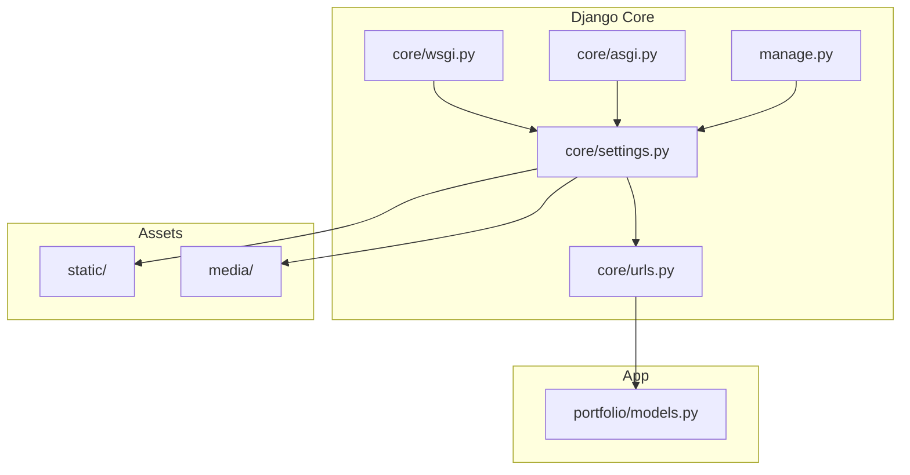
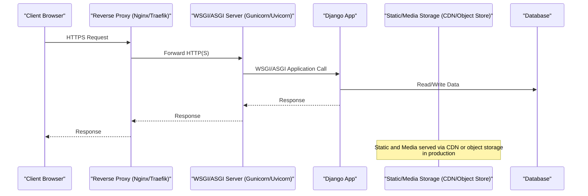
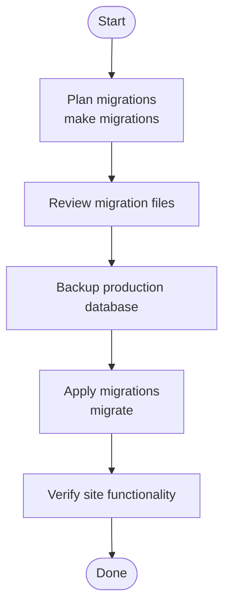
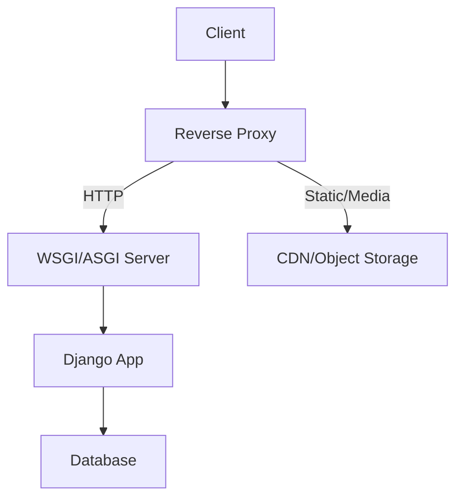
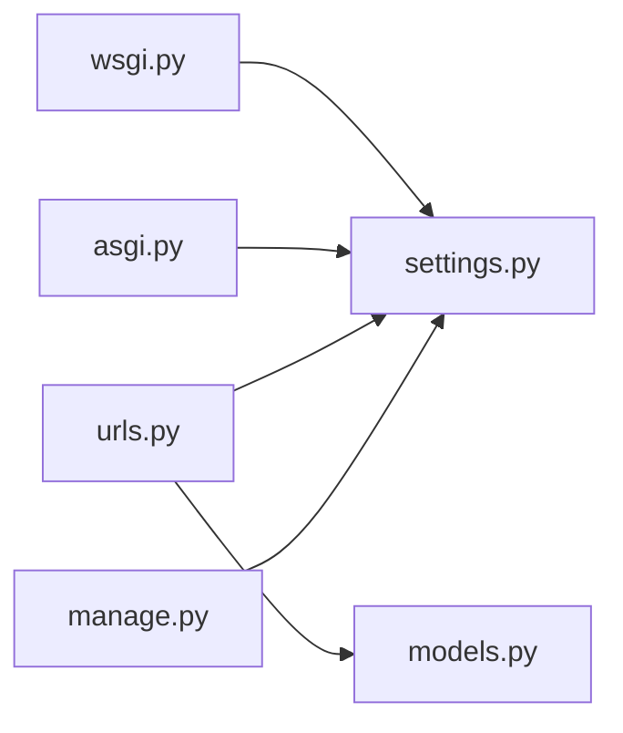

# Deployment and Production

<cite>
**Referenced Files in This Document**
- [settings.py](file://core/settings.py)
- [wsgi.py](file://core/wsgi.py)
- [asgi.py](file://core/asgi.py)
- [urls.py](file://core/urls.py)
- [manage.py](file://manage.py)
- [models.py](file://portfolio/models.py)
</cite>

## Table of Contents
1. Introduction
2. Project Structure
3. Core Components
4. Architecture Overview
5. Detailed Component Analysis
6. Dependency Analysis
7. Performance Considerations
8. Troubleshooting Guide
9. Conclusion
10. Appendices

## Introduction
This document provides comprehensive production deployment guidance for the Django portfolio application. It covers environment configuration, database migration strategies, static and media file serving with CDN integration, WSGI/ASGI server setup, reverse proxy configuration, SSL certificate management, performance optimization, logging and monitoring, backup and disaster recovery, scaling considerations, caching strategies, and maintenance procedures.

## Project Structure
The project is a standard Django application with:
- core package containing settings, URL routing, WSGI/ASGI entry points
- portfolio app defining models and content
- static assets under static/
- media uploads under media/
- templates under templates/dashboard/

**Diagram sources**
- [settings.py:17-94](file://core/settings.py#L17-L94)
- [urls.py:17-29](file://core/urls.py#L17-L29)
- [wsgi.py:10-16](file://core/wsgi.py#L10-L16)
- [asgi.py:10-16](file://core/asgi.py#L10-L16)
- [manage.py:7-18](file://manage.py#L7-L18)
- [models.py:4-297](file://portfolio/models.py#L4-L297)

**Section sources**
- [settings.py:17-94](file://core/settings.py#L17-L94)
- [urls.py:17-29](file://core/urls.py#L17-L29)
- [wsgi.py:10-16](file://core/wsgi.py#L10-L16)
- [asgi.py:10-16](file://core/asgi.py#L10-L16)
- [manage.py:7-18](file://manage.py#L7-L18)
- [models.py:4-297](file://portfolio/models.py#L4-L297)

## Core Components
- Settings and environment:
  - Environment variables are loaded via python-dotenv at startup.
  - Security-sensitive values (secret key, debug flag, allowed hosts) are read from environment.
  - Static and media paths are configured; STATIC_ROOT is defined for collectstatic.
- WSGI/ASGI:
  - Both WSGI and ASGI applications are provided to support multiple servers.
- URLs:
  - Admin and app routes are included; media files are served only when DEBUG is enabled.
- Models:
  - Many models use ImageField/FileField with upload_to paths, requiring proper media storage strategy.

Key operational implications:
- Always set SECRET_KEY and disable DEBUG in production.
- Use collectstatic and serve static/media through a web server or CDN.
- Ensure ALLOWED_HOSTS matches your domain(s).

**Section sources**
- [settings.py:13-30](file://core/settings.py#L13-L30)
- [settings.py:77-94](file://core/settings.py#L77-L94)
- [settings.py:127-136](file://core/settings.py#L127-L136)
- [wsgi.py:10-16](file://core/wsgi.py#L10-L16)
- [asgi.py:10-16](file://core/asgi.py#L10-L16)
- [urls.py:17-29](file://core/urls.py#L17-L29)
- [models.py:4-297](file://portfolio/models.py#L4-L297)

## Architecture Overview
Production request flow with reverse proxy and CDN:

**Diagram sources**
- [wsgi.py:10-16](file://core/wsgi.py#L10-L16)
- [asgi.py:10-16](file://core/asgi.py#L10-L16)
- [urls.py:17-29](file://core/urls.py#L17-L29)
- [settings.py:77-94](file://core/settings.py#L77-L94)

## Detailed Component Analysis

### Production Configuration (Django Settings)
- Security:
  - Disable DEBUG.
  - Set a strong SECRET_KEY from environment.
  - Configure ALLOWED_HOSTS to your domains.
- Database:
  - Default SQLite is not suitable for production; switch to PostgreSQL/MySQL.
- Static and Media:
  - Collect static files into STATIC_ROOT.
  - Serve static via CDN or web server; do not rely on Django’s development static serving.
  - Configure external storage for MEDIA_ROOT (e.g., S3-compatible object storage) and set appropriate MEDIA_URL.
- Timezone and i18n:
  - Keep USE_TZ = True; ensure system timezone aligns with TIME_ZONE.
- Password validation:
  - Validators are enabled; consider enforcing stronger policies if needed.

Operational notes:
- Never commit secrets; load them via environment variables.
- Validate that all required environment variables exist before starting the app.

**Section sources**
- [settings.py:13-30](file://core/settings.py#L13-L30)
- [settings.py:77-94](file://core/settings.py#L77-L94)
- [settings.py:127-136](file://core/settings.py#L127-L136)

### Environment Variables (python-dotenv)
- The application loads .env at startup.
- Required variables include:
  - SECRET_KEY
  - DEBUG
  - ALLOWED_HOSTS
- Best practices:
  - Maintain separate .env files per environment (dev, staging, prod).
  - In production, inject variables via platform secret managers instead of .env files.

**Section sources**
- [settings.py:13-17](file://core/settings.py#L13-L17)
- [settings.py:24-30](file://core/settings.py#L24-L30)

### Database Migration Strategy
- Development:
  - SQLite is used by default; migrations are applied automatically during development.
- Production:
  - Switch to a robust RDBMS (PostgreSQL recommended).
  - Apply migrations explicitly using manage.py migrate.
  - Back up the database before applying migrations.
  - Test migrations in staging first.

Migration workflow:

**Diagram sources**
- [manage.py:7-18](file://manage.py#L7-L18)
- [settings.py:77-85](file://core/settings.py#L77-L85)

**Section sources**
- [manage.py:7-18](file://manage.py#L7-L18)
- [settings.py:77-85](file://core/settings.py#L77-L85)

### Static File Serving with CDN Integration
- Collect static files:
  - Run collectstatic to gather all static assets into STATIC_ROOT.
- Serve via CDN:
  - Upload STATIC_ROOT contents to a CDN or object storage bucket.
  - Configure CDN origin to point to your storage or web server.
  - Update STATIC_URL to match CDN path if necessary.
- Cache busting:
  - Use Django’s staticfiles cache-busting features to avoid stale assets.

Operational checklist:
- Ensure STATIC_ROOT exists and is writable by the build process.
- Verify CDN caching rules and invalidation workflows.

**Section sources**
- [settings.py:91-94](file://core/settings.py#L91-L94)
- [settings.py:127-132](file://core/settings.py#L127-L132)

### Media File Management
- Models use ImageField/FileField with various upload_to directories.
- Recommended approach:
  - Use an object store (e.g., S3-compatible) for media files.
  - Configure Django storages backend and set MEDIA_URL to CDN path.
  - Restrict direct access to private buckets; sign URLs or use CDN authentication.
- Local fallback:
  - If storing locally, ensure MEDIA_ROOT is outside the web root and served securely.

Data model highlights:
- Profile images, education/experience logos, project images, certificates, workshops, achievements, services, resumes, and site assets all require secure and scalable storage.

**Section sources**
- [models.py:4-297](file://portfolio/models.py#L4-L297)
- [settings.py:87-89](file://core/settings.py#L87-L89)
- [settings.py:134-136](file://core/settings.py#L134-L136)

### WSGI/ASGI Server Setup
- WSGI:
  - Use Gunicorn with the WSGI application module.
- ASGI:
  - Use Uvicorn or Daphne with the ASGI application module for WebSocket or async workloads.
- Process management:
  - Run multiple worker processes and bind to a Unix socket or loopback interface behind a reverse proxy.

Reference entry points:
- WSGI application exposed by wsgi.py
- ASGI application exposed by asgi.py

**Section sources**
- [wsgi.py:10-16](file://core/wsgi.py#L10-L16)
- [asgi.py:10-16](file://core/asgi.py#L10-L16)

### Reverse Proxy Configuration
- Terminate TLS at the reverse proxy.
- Forward requests to the WSGI/ASGI server.
- Serve static and media directly from the proxy or CDN.
- Enable security headers and compression.

Conceptual flow:

[No sources needed since this diagram shows conceptual workflow, not actual code structure]

### SSL Certificate Management
- Obtain certificates via ACME/Let’s Encrypt or managed CA.
- Automate renewal and reload the reverse proxy.
- Enforce HTTPS and HSTS where appropriate.

[No sources needed since this section provides general guidance]

### Logging and Monitoring
- Centralize logs from the web server, application server, and application.
- Use structured logging and ship logs to a log aggregation service.
- Monitor application metrics (requests, errors, latency) and resource usage (CPU, memory, disk).

[No sources needed since this section provides general guidance]

### Backup Strategies
- Database backups:
  - Schedule regular automated backups of the production database.
  - Retain multiple generations and test restores regularly.
- Media and static backups:
  - Object storage should have versioning and lifecycle policies.
  - Periodically snapshot local media if applicable.

[No sources needed since this section provides general guidance]

### Disaster Recovery Procedures
- Define RTO/RPO targets.
- Maintain runbooks for common failure scenarios (DB outage, storage unavailability, CDN issues).
- Conduct periodic drills to validate recovery procedures.

[No sources needed since this section provides general guidance]

### Scaling Considerations
- Horizontal scaling:
  - Run multiple application instances behind a load balancer.
  - Use stateless sessions or shared session stores.
- Database scaling:
  - Use read replicas and connection pooling.
- CDN and caching:
  - Offload static/media to CDN; cache API responses where possible.

[No sources needed since this section provides general guidance]

### Caching Strategies
- Template and query result caching:
  - Use Django’s caching framework with a fast backend (Redis/Memcached).
- Page-level caching:
  - Consider CDN edge caching for public pages.
- Static asset caching:
  - Leverage CDN cache-control headers and cache-busting filenames.

[No sources needed since this section provides general guidance]

### Maintenance Procedures
- Regularly update dependencies and apply security patches.
- Monitor deprecations and plan upgrades.
- Rotate secrets and rotate database credentials periodically.

[No sources needed since this section provides general guidance]

## Dependency Analysis
High-level dependency relationships among core components:

**Diagram sources**
- [wsgi.py:10-16](file://core/wsgi.py#L10-L16)
- [asgi.py:10-16](file://core/asgi.py#L10-L16)
- [urls.py:17-29](file://core/urls.py#L17-L29)
- [manage.py:7-18](file://manage.py#L7-L18)
- [settings.py:17-94](file://core/settings.py#L17-L94)
- [models.py:4-297](file://portfolio/models.py#L4-L297)

**Section sources**
- [wsgi.py:10-16](file://core/wsgi.py#L10-L16)
- [asgi.py:10-16](file://core/asgi.py#L10-L16)
- [urls.py:17-29](file://core/urls.py#L17-L29)
- [manage.py:7-18](file://manage.py#L7-L18)
- [settings.py:17-94](file://core/settings.py#L17-L94)
- [models.py:4-297](file://portfolio/models.py#L4-L297)

## Performance Considerations
- Disable DEBUG and template debugging in production.
- Use a production-grade WSGI/ASGI server with multiple workers.
- Serve static and media via CDN or a dedicated web server.
- Optimize database queries and enable connection pooling.
- Enable gzip/brotli compression at the reverse proxy.
- Tune OS and Python runtime parameters for concurrency.

[No sources needed since this section provides general guidance]

## Troubleshooting Guide
Common issues and resolutions:
- 403 Forbidden due to ALLOWED_HOSTS:
  - Ensure ALLOWED_HOSTS includes your domain(s).
- 500 Internal Server Error due to missing SECRET_KEY:
  - Provide SECRET_KEY in the environment.
- Debug mode enabled:
  - Disable DEBUG in production to prevent stack traces and sensitive info exposure.
- Static files not found:
  - Run collectstatic and verify CDN/web server configuration.
- Media files not accessible:
  - Confirm MEDIA_URL and storage backend configuration; ensure permissions and CDN rules are correct.
- Database connectivity issues:
  - Verify database credentials, host, port, and network access.

**Section sources**
- [settings.py:24-30](file://core/settings.py#L24-L30)
- [settings.py:91-94](file://core/settings.py#L91-L94)
- [settings.py:87-89](file://core/settings.py#L87-L89)
- [urls.py:27-29](file://core/urls.py#L27-L29)

## Conclusion
To deploy this Django application safely and performantly in production:
- Harden settings and enforce environment-based configuration.
- Move off SQLite to a production database and automate migrations.
- Serve static and media via CDN/object storage.
- Run behind a reverse proxy with TLS termination.
- Implement robust logging, monitoring, backups, and disaster recovery.
- Scale horizontally and adopt caching strategies suited to your traffic patterns.

[No sources needed since this section summarizes without analyzing specific files]

## Appendices

### Production Deployment Checklist
- Environment variables:
  - SECRET_KEY set
  - DEBUG disabled
  - ALLOWED_HOSTS configured
- Database:
  - Production database configured
  - Migrations applied
  - Backups scheduled
- Static and media:
  - collectstatic executed
  - CDN configured
  - MEDIA_URL and storage backend configured
- Servers:
  - WSGI/ASGI server running with multiple workers
  - Reverse proxy configured with TLS
- Security:
  - HTTPS enforced
  - Security headers enabled
  - Secrets rotated regularly
- Observability:
  - Logs centralized
  - Metrics and alerts configured
- Operations:
  - Health checks and auto-restart configured
  - Runbooks and DR tests completed

[No sources needed since this section provides general guidance]