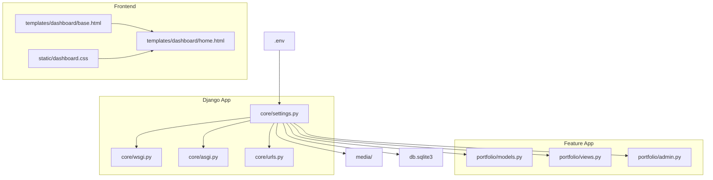
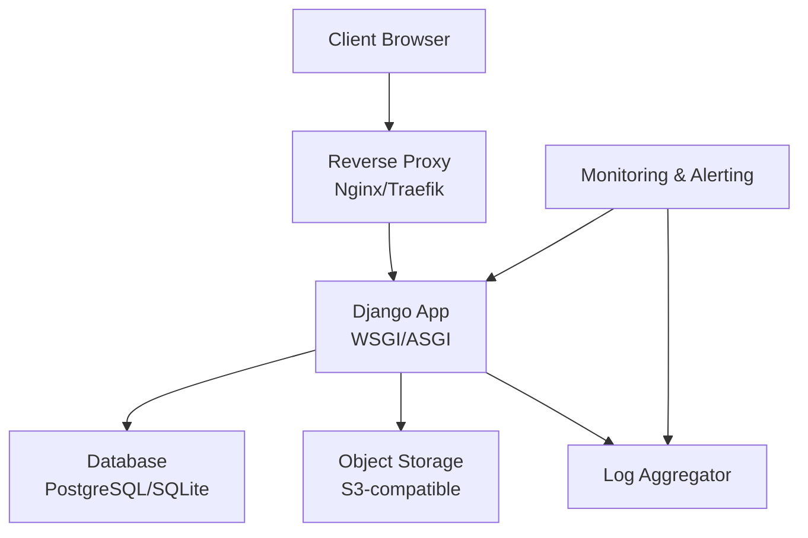
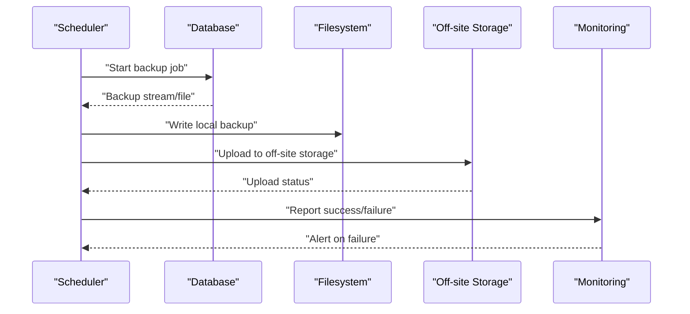
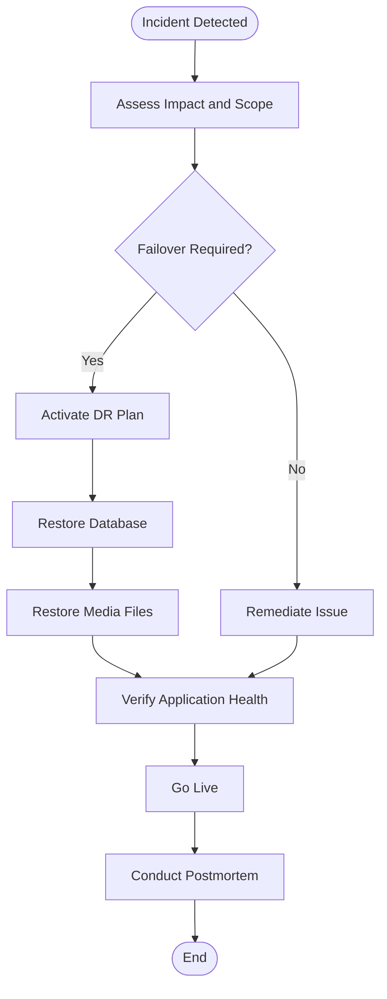
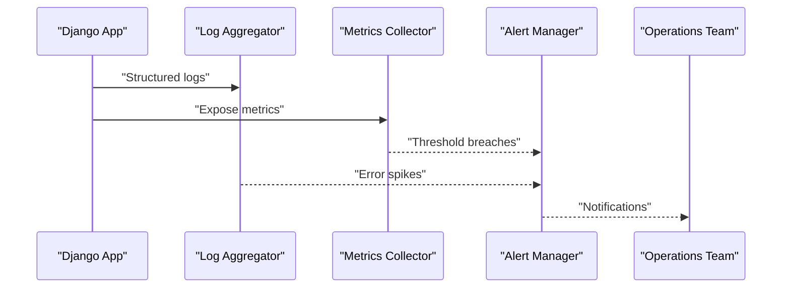
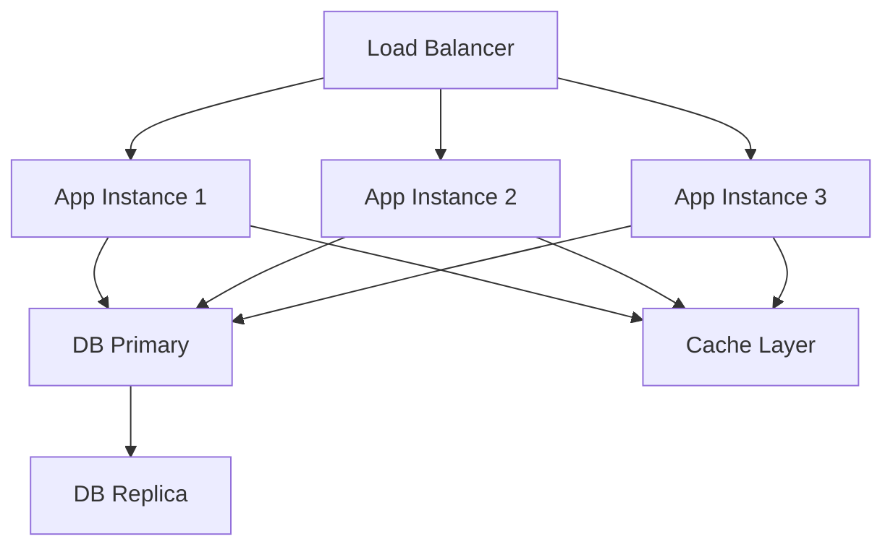
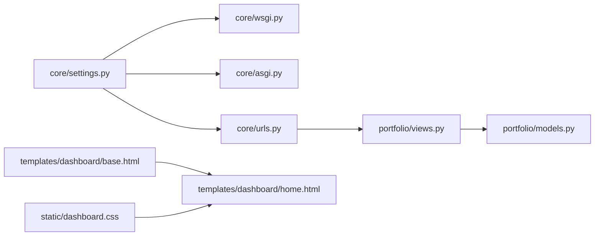

# Maintenance and Backup

<cite>
**Referenced Files in This Document**
- [settings.py](file://core/settings.py)
- [.env](file://.env)
- [manage.py](file://manage.py)
- [wsgi.py](file://core/wsgi.py)
- [asgi.py](file://core/asgi.py)
- [urls.py](file://core/urls.py)
- [views.py](file://portfolio/views.py)
- [models.py](file://portfolio/models.py)
- [admin.py](file://portfolio/admin.py)
- [base.html](file://templates/dashboard/base.html)
- [home.html](file://templates/dashboard/home.html)
- [dashboard.css](file://static/dashboard.css)
</cite>

## Table of Contents
1. [Introduction](#introduction)
2. [Project Structure](#project-structure)
3. [Core Components](#core-components)
4. [Architecture Overview](#architecture-overview)
5. [Detailed Component Analysis](#detailed-component-analysis)
6. [Dependency Analysis](#dependency-analysis)
7. [Performance Considerations](#performance-considerations)
8. [Troubleshooting Guide](#troubleshooting-guide)
9. [Conclusion](#conclusion)
10. [Appendices](#appendices)

## Introduction
This document provides comprehensive maintenance and backup procedures for the Django portfolio CMS production environment. It covers automated backups (database, media files, configuration), routine maintenance (log rotation, database optimization, dependency updates, security patches), disaster recovery and data restoration, monitoring and alerting, and operational procedures for scaling, load balancing, and high availability. The guidance is tailored to the current codebase and deployment artifacts present in the repository.

## Project Structure
The project is a standard Django application with:
- Application package under core (Django settings, WSGI/ASGI entry points, URL configuration).
- Feature app under portfolio (models, views, admin, forms, URLs).
- Static assets under static and templates under templates/dashboard.
- Media uploads under media.
- Environment variables under .env.
- SQLite database file at db.sqlite3.

**Diagram sources**
- [settings.py:77-94](file://core/settings.py#L77-L94)
- [settings.py:127-136](file://core/settings.py#L127-L136)
- [wsgi.py:1-16](file://core/wsgi.py#L1-L16)
- [asgi.py:1-16](file://core/asgi.py#L1-L16)
- [urls.py:1-200](file://core/urls.py#L1-L200)
- [models.py:1-200](file://portfolio/models.py#L1-L200)
- [views.py:258-334](file://portfolio/views.py#L258-L334)
- [admin.py:1-200](file://portfolio/admin.py#L1-L200)
- [base.html:71-91](file://templates/dashboard/base.html#L71-L91)
- [home.html:28-75](file://templates/dashboard/home.html#L28-L75)
- [dashboard.css:521-628](file://static/dashboard.css#L521-L628)

**Section sources**
- [settings.py:1-142](file://core/settings.py#L1-L142)
- [manage.py:1-23](file://manage.py#L1-L23)
- [wsgi.py:1-16](file://core/wsgi.py#L1-L16)
- [asgi.py:1-16](file://core/asgi.py#L1-L16)
- [urls.py:1-200](file://core/urls.py#L1-L200)

## Core Components
- Settings and environment:
  - Database engine and path are defined in settings; media and static roots are configured.
  - Environment variables are loaded from .env, including database connection parameters and secrets.
- Web server integration:
  - WSGI and ASGI applications are exposed for deployment behind a reverse proxy or container orchestrator.
- Data layer:
  - Models define content entities; views handle API endpoints and dashboard operations.
- Admin interface:
  - Django admin is enabled for content management.

Key implications for maintenance:
- Backups must include the database file (SQLite) or remote DB credentials and schema/data.
- Media directory must be backed up separately.
- Configuration (.env and settings) must be secured and version-controlled without secrets.

**Section sources**
- [settings.py:77-94](file://core/settings.py#L77-L94)
- [settings.py:127-136](file://core/settings.py#L127-L136)
- [.env:1-10](file://.env#L1-L10)
- [wsgi.py:1-16](file://core/wsgi.py#L1-L16)
- [asgi.py:1-16](file://core/asgi.py#L1-L16)
- [models.py:1-200](file://portfolio/models.py#L1-L200)
- [views.py:258-334](file://portfolio/views.py#L258-L334)
- [admin.py:1-200](file://portfolio/admin.py#L1-L200)

## Architecture Overview
The production stack typically consists of:
- Reverse proxy (e.g., Nginx/Traefik) serving static/media and proxying to Django.
- Django application via WSGI/ASGI.
- Database (SQLite in repo; .env suggests PostgreSQL for production).
- Object storage for media (recommended for scalability and durability).
- Monitoring/alerting system integrated with logs and metrics.

[No sources needed since this diagram shows conceptual architecture, not actual code structure]

## Detailed Component Analysis

### Automated Backup Strategy
Scope:
- Database: SQLite file or PostgreSQL instance.
- Media files: Uploaded content under media/.
- Configuration: .env and any non-secret settings.

Recommendations:
- Database backups:
  - For SQLite: schedule periodic snapshots of db.sqlite3 using filesystem snapshots or consistent copy tools.
  - For PostgreSQL: use pg_dump/pg_basebackup with incremental WAL archiving if supported by your provider.
- Media backups:
  - Use rsync or cloud-native replication to an off-site bucket (e.g., S3-compatible).
  - Enable versioning on the storage bucket for point-in-time recovery.
- Configuration backups:
  - Store .env securely in a secrets manager; back up only references or encrypted copies.
  - Version control non-sensitive settings.

Operational procedure:
- Schedule daily full backups and hourly incremental backups (WAL or change-based).
- Retention policy: keep daily for 7 days, weekly for 4 weeks, monthly for 6 months.
- Off-site replication: enable cross-region replication for critical buckets.
- Integrity checks: run checksums and restore tests periodically.

Backup workflow sequence:

**Diagram sources**
- [settings.py:77-94](file://core/settings.py#L77-L94)
- [.env:1-10](file://.env#L1-L10)

**Section sources**
- [settings.py:77-94](file://core/settings.py#L77-L94)
- [.env:1-10](file://.env#L1-L10)

### Routine Maintenance Tasks
- Log rotation:
  - Configure logrotate for application and access/error logs.
  - Compress rotated logs and set retention limits.
- Database optimization:
  - Run ANALYZE and VACUUM (PostgreSQL) or equivalent maintenance tasks.
  - Review indexes and slow queries regularly.
- Dependency updates:
  - Pin versions in requirements; update quarterly after testing.
  - Apply security patches promptly; monitor CVE advisories.
- Security patches:
  - Update OS packages and runtime dependencies.
  - Rotate secrets and rotate TLS certificates before expiry.

Maintenance checklist:
- Weekly: verify backups, review logs, check disk space.
- Monthly: apply dependency updates, test restores, audit permissions.
- Quarterly: perform DR drill, review monitoring thresholds.

**Section sources**
- [settings.py:1-142](file://core/settings.py#L1-L142)
- [.env:1-10](file://.env#L1-L10)

### Disaster Recovery and Business Continuity
Goals:
- RTO (Recovery Time Objective): minimize downtime.
- RPO (Recovery Point Objective): limit data loss window.

Procedures:
- Restore database from latest verified backup.
- Rehydrate media files from off-site storage.
- Validate application health and run smoke tests.
- Failover to secondary region if primary is unavailable.

Disaster recovery flow:

[No sources needed since this diagram shows conceptual workflow, not actual code structure]

**Section sources**
- [settings.py:77-94](file://core/settings.py#L77-L94)
- [.env:1-10](file://.env#L1-L10)

### Monitoring and Alerting
Coverage:
- System health: CPU, memory, disk, network.
- Application metrics: request rate, latency, error rates.
- Error tracking: centralized logging and exception reporting.
- Performance metrics: query performance, cache hit ratios.

Implementation approach:
- Export Prometheus metrics from Django (if implemented) or rely on platform metrics.
- Centralize logs with a log aggregator; create dashboards and alerts.
- Integrate uptime monitors and synthetic checks.

Monitoring pipeline:

[No sources needed since this diagram shows conceptual workflow, not actual code structure]

**Section sources**
- [views.py:258-334](file://portfolio/views.py#L258-L334)
- [dashboard.css:521-628](file://static/dashboard.css#L521-L628)

### Operational Procedures: Scaling, Load Balancing, High Availability
Scaling:
- Horizontal scaling: run multiple Django instances behind a load balancer.
- Stateless design: store sessions and caches externally (Redis, database).
- Database scaling: read replicas and connection pooling.

Load balancing:
- Use a reverse proxy to distribute traffic across instances.
- Configure health checks and graceful shutdowns.

High availability:
- Multi-AZ deployments for database and application tiers.
- Automated failover and DNS-based routing.

HA topology:

[No sources needed since this diagram shows conceptual workflow, not actual code structure]

**Section sources**
- [wsgi.py:1-16](file://core/wsgi.py#L1-L16)
- [asgi.py:1-16](file://core/asgi.py#L1-L16)

## Dependency Analysis
Key relationships:
- Settings drive database, media, and static configurations.
- WSGI/ASGI expose the application for deployment.
- Views interact with models and may expose APIs.
- Templates render dashboard UI with metric cards.

**Diagram sources**
- [settings.py:77-94](file://core/settings.py#L77-L94)
- [wsgi.py:1-16](file://core/wsgi.py#L1-L16)
- [asgi.py:1-16](file://core/asgi.py#L1-L16)
- [urls.py:1-200](file://core/urls.py#L1-L200)
- [views.py:258-334](file://portfolio/views.py#L258-L334)
- [models.py:1-200](file://portfolio/models.py#L1-L200)
- [base.html:71-91](file://templates/dashboard/base.html#L71-L91)
- [home.html:28-75](file://templates/dashboard/home.html#L28-L75)
- [dashboard.css:521-628](file://static/dashboard.css#L521-L628)

**Section sources**
- [settings.py:1-142](file://core/settings.py#L1-L142)
- [wsgi.py:1-16](file://core/wsgi.py#L1-L16)
- [asgi.py:1-16](file://core/asgi.py#L1-L16)
- [urls.py:1-200](file://core/urls.py#L1-L200)
- [views.py:258-334](file://portfolio/views.py#L258-L334)
- [models.py:1-200](file://portfolio/models.py#L1-L200)
- [base.html:71-91](file://templates/dashboard/base.html#L71-L91)
- [home.html:28-75](file://templates/dashboard/home.html#L28-L75)
- [dashboard.css:521-628](file://static/dashboard.css#L521-L628)

## Performance Considerations
- Database:
  - Ensure proper indexing and query optimization.
  - Use connection pooling and read replicas where applicable.
- Static and media:
  - Serve static files via CDN or reverse proxy.
  - Offload media to object storage with caching.
- Application:
  - Profile requests and optimize hot paths.
  - Use caching layers for frequently accessed data.

[No sources needed since this section provides general guidance]

## Troubleshooting Guide
Common issues and resolutions:
- Database connectivity:
  - Verify DATABASE_URL and credentials in .env.
  - Check firewall rules and network ACLs.
- Media not loading:
  - Confirm MEDIA_ROOT and MEDIA_URL settings.
  - Ensure reverse proxy serves /media/ correctly.
- Admin access:
  - Create superuser and verify ALLOWED_HOSTS.
- API errors:
  - Inspect view logic and JSON payloads.

Checklist:
- Validate environment variables.
- Review application and server logs.
- Test endpoints with curl or browser dev tools.
- Confirm file permissions for media and static directories.

**Section sources**
- [.env:1-10](file://.env#L1-L10)
- [settings.py:77-94](file://core/settings.py#L77-L94)
- [views.py:258-334](file://portfolio/views.py#L258-L334)

## Conclusion
This document outlines a robust maintenance and backup strategy for the Django portfolio CMS, covering automated backups, routine maintenance, disaster recovery, monitoring, and operational scaling. Align these procedures with your organization’s SLAs and compliance requirements, and continuously validate through drills and audits.

[No sources needed since this section summarizes without analyzing specific files]

## Appendices
- Backup schedules and retention policies should be documented in runbooks.
- Secrets management best practices: avoid committing .env; use a secrets manager.
- Change management: enforce CI/CD pipelines for safe deployments.

[No sources needed since this section provides general guidance]