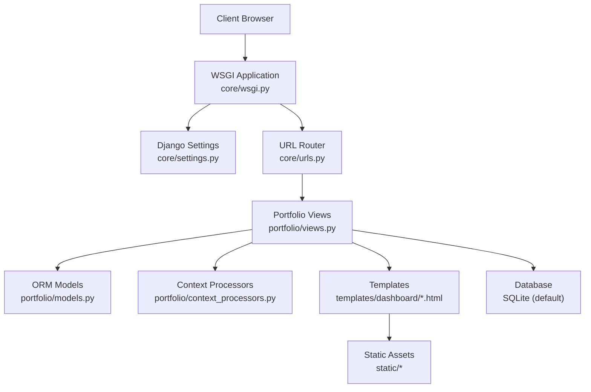
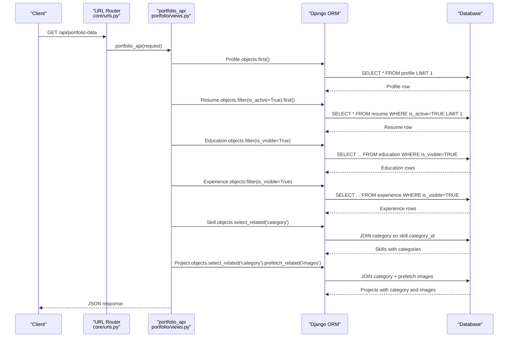
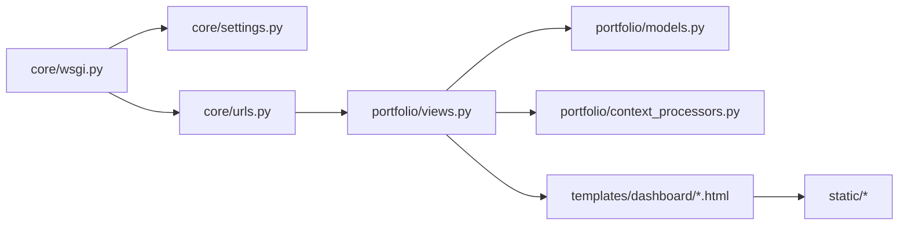

# Performance Optimization

<cite>
**Referenced Files in This Document**
- [settings.py](file://core/settings.py)
- [urls.py](file://core/urls.py)
- [wsgi.py](file://core/wsgi.py)
- [models.py](file://portfolio/models.py)
- [views.py](file://portfolio/views.py)
- [context_processors.py](file://portfolio/context_processors.py)
- [base.html](file://templates/dashboard/base.html)
- [dashboard.css](file://static/dashboard.css)
- [dashboard.js](file://static/dashboard.js)
</cite>

## Table of Contents
1. [Introduction](#introduction)
2. [Project Structure](#project-structure)
3. [Core Components](#core-components)
4. [Architecture Overview](#architecture-overview)
5. [Detailed Component Analysis](#detailed-component-analysis)
6. [Dependency Analysis](#dependency-analysis)
7. [Performance Considerations](#performance-considerations)
8. [Troubleshooting Guide](#troubleshooting-guide)
9. [Conclusion](#conclusion)

## Introduction
This document provides production-focused performance optimization guidance for the Django portfolio CMS. It covers database query optimization, caching strategies with Redis or Memcached, static file compression and minification, CDN integration, database indexing, Django-specific optimizations such as `select_related`/`prefetch_related`, template caching, middleware tuning, frontend bundling, image optimization, lazy loading, browser caching, monitoring, profiling, and scalability considerations for high-traffic scenarios.

The recommendations are grounded in the current codebase structure and configuration while providing actionable steps to improve response times, reduce bandwidth, and scale under load.

## Project Structure
The project is a standard Django application:
- Core settings, URLs, and WSGI entry point live under `core`.
- The `portfolio` app contains models, views, forms, context processors, and templates.
- Static assets (CSS/JS) are under `static`.
- Templates are under `templates/dashboard`.
- Media uploads are served via Django’s development helper when `DEBUG=True`.

**Diagram sources**
- [wsgi.py:10-16](file://core/wsgi.py#L10-L16)
- [settings.py:34-94](file://core/settings.py#L34-L94)
- [urls.py:17-28](file://core/urls.py#L17-L28)
- [views.py:21-457](file://portfolio/views.py#L21-L457)
- [models.py:1-298](file://portfolio/models.py#L1-L298)
- [context_processors.py:1-8](file://portfolio/context_processors.py#L1-L8)
- [base.html:1-188](file://templates/dashboard/base.html#L1-L188)

**Section sources**
- [settings.py:13-94](file://core/settings.py#L13-L94)
- [urls.py:17-28](file://core/urls.py#L17-L28)
- [wsgi.py:10-16](file://core/wsgi.py#L10-L16)

## Core Components
Key components impacting performance:
- Settings: Debug flag, allowed hosts, middleware stack, template options, database backend, static/media configuration.
- Views: Public front page, dashboard metrics, generic CRUD endpoints, contact API, and a single JSON endpoint aggregating portfolio data.
- Models: Rich domain model including profile, projects, education, experience, skills, certificates, workshops, achievements, services, resume files, social links, contact messages, and site settings.
- Templates: Dashboard base template loads external fonts and CSS/JS; uses static tags.
- Static assets: Large dashboard CSS and JS bundle.

Current observations relevant to performance:
- Debug mode defaults to enabled unless overridden by environment variables.
- SQLite is used as the default database engine.
- No explicit cache configuration is present.
- Static files are not configured for compression/minification.
- Media files are served via Django only in debug mode.
- Some queries already use `select_related`/`prefetch_related`; others perform multiple counts or full table scans.

**Section sources**
- [settings.py:22-94](file://core/settings.py#L22-L94)
- [views.py:21-457](file://portfolio/views.py#L21-L457)
- [models.py:1-298](file://portfolio/models.py#L1-L298)
- [base.html:1-188](file://templates/dashboard/base.html#L1-L188)
- [dashboard.css:1-800](file://static/dashboard.css#L1-L800)
- [dashboard.js:1-287](file://static/dashboard.js#L1-L287)

## Architecture Overview
The request flow for the public portfolio JSON endpoint demonstrates how data is aggregated from multiple models and returned as JSON. This is a prime candidate for caching and query optimization.

**Diagram sources**
- [views.py:335-457](file://portfolio/views.py#L335-L457)

**Section sources**
- [views.py:335-457](file://portfolio/views.py#L335-L457)

## Detailed Component Analysis

### Database Query Optimization
Recommendations:
- Use `select_related` for ForeignKey relationships and `prefetch_related` for reverse relations or ManyToMany where applicable.
- Prefer `.values()` or `.values_list()` when you need only specific fields to reduce payload size.
- Avoid repeated `.count()` calls in hot paths; consider materialized counters or cached aggregates.
- Add appropriate database indexes on frequently filtered/sorted columns.

Current usage:
- Skills query uses `select_related('category')`.
- Projects query uses `select_related('category').prefetch_related('images')`.
- Dashboard home view performs multiple `.count()` calls across models.

Optimization opportunities:
- Cache aggregate counts for dashboard metrics.
- Replace heavy list comprehensions with efficient queryset operations.
- Ensure all filters include indexed fields.

**Section sources**
- [views.py:58-83](file://portfolio/views.py#L58-L83)
- [views.py:373-451](file://portfolio/views.py#L373-L451)

### Caching Strategies Using Redis or Memcached
Goals:
- Reduce database load for read-heavy endpoints like the portfolio JSON API and dashboard metrics.
- Cache rendered templates for static content.
- Cache expensive computations and serialized responses.

Recommended approach:
- Configure a cache backend using Redis or Memcached.
- Set up per-endpoint caches for the portfolio API response.
- Cache dashboard metric aggregates.
- Use short TTLs for volatile data and longer TTLs for stable content.

Implementation notes:
- Add cache settings in Django settings.
- Wrap the portfolio API response with a cache decorator or fragment caching.
- Invalidate caches on content updates (e.g., after saving SiteSettings or other models).

**Section sources**
- [settings.py:77-94](file://core/settings.py#L77-L94)
- [views.py:335-457](file://portfolio/views.py#L335-L457)

### Static File Optimization with Compression and Minification
Current state:
- Static files are defined but no compression/minification pipeline is configured.
- External fonts and Font Awesome are loaded from CDNs.
- Dashboard CSS and JS are large bundles.

Recommendations:
- Enable Django’s staticfiles compressor or integrate a build tool (e.g., webpack, esbuild, Vite) to minify and bundle CSS/JS.
- Compress assets with gzip or Brotli at the web server level.
- Use versioned filenames for cache busting.
- Precompile static assets during deployment.

Operational steps:
- Configure static storage backends that support hashing and compression.
- Run collectstatic before deployment.
- Serve static files through a web server or CDN rather than Django.

**Section sources**
- [settings.py:91-94](file://core/settings.py#L91-L94)
- [base.html:17-22](file://templates/dashboard/base.html#L17-L22)
- [base.html:184-185](file://templates/dashboard/base.html#L184-L185)
- [dashboard.css:1-800](file://static/dashboard.css#L1-L800)
- [dashboard.js:1-287](file://static/dashboard.js#L1-L287)

### CDN Integration for Assets
Current state:
- Fonts and icons are loaded from Google Fonts and Cloudflare CDN.
- Static files are referenced via Django’s static tag.

Recommendations:
- Move all third-party assets to a CDN provider.
- Host your own static assets on a CDN for better global delivery.
- Configure CDN caching rules for long-lived asset URLs.
- Use preconnect hints for critical resources.

Operational steps:
- Update static URLs to point to CDN domains.
- Configure CDN origin to serve from your static root.
- Enable HTTP/2 or HTTP/3 and TLS best practices.

**Section sources**
- [base.html:17-22](file://templates/dashboard/base.html#L17-L22)
- [settings.py:91-94](file://core/settings.py#L91-L94)

### Database Indexing Strategies
Focus areas:
- Frequently filtered fields: `is_visible`, `is_active`, `display_order`, `created_at`, `is_read`, `slug`.
- Foreign keys: `category_id`, `profile_id`, `project_id`.
- Composite indexes for common filter combinations.

Recommendations:
- Add indexes on boolean flags used in frequent filters.
- Add indexes on ordering fields like `display_order`.
- Add composite indexes for common query patterns (e.g., `is_visible=True ORDER BY display_order`).
- Review foreign key indexes automatically created by Django and ensure they align with query patterns.

Example index targets:
- `Education.is_visible`, `Experience.is_visible`, `Skill.is_active`, `Project.is_visible`, `Certificate.is_visible`, `Workshop.is_visible`, `Achievement.is_visible`, `Service.is_active`, `Technology.is_active`, `SocialLink.is_active`, `ContactMessage.created_at`, `ContactMessage.is_read`, `Profile.user_id`, `Project.category_id`, `HeroRole.profile_id`, `ProjectImage.project_id`.

**Section sources**
- [models.py:22-298](file://portfolio/models.py#L22-L298)
- [views.py:58-83](file://portfolio/views.py#L58-L83)
- [views.py:335-457](file://portfolio/views.py#L335-L457)

### Django-Specific Optimizations
- Template caching:
  - Enable template caching by configuring a fast template loader backend.
  - Use `` fragments for expensive sections.
- Middleware optimization:
  - Keep only necessary middleware.
  - Consider custom lightweight middleware for caching headers or rate limiting.
- Query optimization:
  - Continue using `select_related`/`prefetch_related`.
  - Use `.only()`/`.defer()` to limit field loading where appropriate.
- Context processor optimization:
  - Cache unread message count globally.

Current usage:
- Context processor computes unread message count on every request.
- Portfolio API aggregates data efficiently with some select/prefetch usage.

**Section sources**
- [settings.py:57-72](file://core/settings.py#L57-L72)
- [settings.py:45-53](file://core/settings.py#L45-L53)
- [context_processors.py:1-8](file://portfolio/context_processors.py#L1-L8)
- [views.py:373-451](file://portfolio/views.py#L373-L451)

### Frontend Performance
- CSS/JS bundling:
  - Bundle and minify dashboard CSS/JS.
  - Split large scripts into smaller chunks if needed.
- Image optimization:
  - Serve WebP/AVIF variants.
  - Use responsive images with `srcset`.
  - Lazy-load images below the fold.
- Browser caching:
  - Set long Cache-Control headers for static assets.
  - Use immutable cache policies for hashed filenames.

Current state:
- Large dashboard CSS and JS files.
- External fonts and icons loaded from CDNs.
- No explicit browser caching configuration in Django settings.

**Section sources**
- [dashboard.css:1-800](file://static/dashboard.css#L1-L800)
- [dashboard.js:1-287](file://static/dashboard.js#L1-L287)
- [base.html:17-22](file://templates/dashboard/base.html#L17-L22)

### Monitoring Tools Setup
Recommendations:
- Integrate APM tools (e.g., Sentry, New Relic, DataDog) for error tracking and performance insights.
- Enable Django debug toolbar in development only.
- Log slow queries and N+1 issues.
- Monitor database performance metrics and connection pools.

Operational steps:
- Configure logging to capture slow queries.
- Set up health checks and uptime monitoring.
- Track key metrics: request latency, error rates, cache hit ratios, DB query times.

[No sources needed since this section provides general guidance]

### Performance Profiling Techniques
Recommendations:
- Use Django’s built-in profiling and SQL logging to identify bottlenecks.
- Profile views with tools like cProfile or py-spy.
- Analyze database query plans for slow queries.
- Benchmark endpoints under load using tools like Locust or k6.

Operational steps:
- Enable SQL logging in development.
- Use APM dashboards to visualize performance.
- Conduct regular load tests and capacity planning.

[No sources needed since this section provides general guidance]

### Scalability Considerations for High-Traffic Scenarios
Recommendations:
- Migrate from SQLite to a production-grade database (PostgreSQL/MySQL).
- Scale horizontally with multiple application workers behind a reverse proxy.
- Use a dedicated cache layer (Redis/Memcached).
- Offload static/media to object storage and CDN.
- Implement rate limiting and request throttling.
- Optimize database connections and enable connection pooling.

Operational steps:
- Configure database settings for production.
- Deploy with Gunicorn/uWSGI and Nginx/Apache.
- Enable horizontal scaling and auto-scaling policies.
- Monitor resource utilization and set alerts.

**Section sources**
- [settings.py:80-85](file://core/settings.py#L80-L85)
- [urls.py:27-28](file://core/urls.py#L27-L28)

## Dependency Analysis
High-level dependencies:
- WSGI application loads settings and exposes the Django application.
- URL router includes portfolio app URLs.
- Views depend on models and context processors.
- Templates depend on static assets.

**Diagram sources**
- [wsgi.py:10-16](file://core/wsgi.py#L10-L16)
- [settings.py:34-94](file://core/settings.py#L34-L94)
- [urls.py:17-28](file://core/urls.py#L17-L28)
- [views.py:21-457](file://portfolio/views.py#L21-L457)
- [models.py:1-298](file://portfolio/models.py#L1-L298)
- [context_processors.py:1-8](file://portfolio/context_processors.py#L1-L8)
- [base.html:1-188](file://templates/dashboard/base.html#L1-L188)

**Section sources**
- [wsgi.py:10-16](file://core/wsgi.py#L10-L16)
- [settings.py:34-94](file://core/settings.py#L34-L94)
- [urls.py:17-28](file://core/urls.py#L17-L28)
- [views.py:21-457](file://portfolio/views.py#L21-L457)

## Performance Considerations
- Disable debug mode in production and restrict allowed hosts.
- Switch to a production database backend.
- Configure caching with Redis or Memcached.
- Compress and minify static assets; serve via CDN.
- Optimize queries with select/prefetch and add indexes.
- Cache expensive computations and template fragments.
- Tune middleware to minimize overhead.
- Implement browser caching for static assets.
- Monitor and profile continuously.

[No sources needed since this section provides general guidance]

## Troubleshooting Guide
Common issues and resolutions:
- Slow dashboard metrics:
  - Cache aggregate counts and unread message counts.
  - Add indexes on filtered fields.
- N+1 queries in portfolio API:
  - Ensure all related objects use select/prefetch.
  - Use values/values_list to reduce payload.
- Heavy static assets:
  - Minify and compress CSS/JS.
  - Use CDN and browser caching.
- Media serving in production:
  - Do not rely on Django’s debug media serving; configure a web server or CDN.

**Section sources**
- [views.py:58-83](file://portfolio/views.py#L58-L83)
- [views.py:335-457](file://portfolio/views.py#L335-L457)
- [settings.py:87-94](file://core/settings.py#L87-L94)
- [urls.py:27-28](file://core/urls.py#L27-L28)

## Conclusion
To achieve optimal performance in production:
- Harden settings and switch to a robust database backend.
- Implement comprehensive caching strategies.
- Optimize static assets and leverage CDN distribution.
- Refine database queries and add strategic indexes.
- Monitor performance continuously and plan for horizontal scalability.

These steps will significantly reduce response times, lower database load, and improve user experience under high traffic conditions.

[No sources needed since this section summarizes without analyzing specific files]