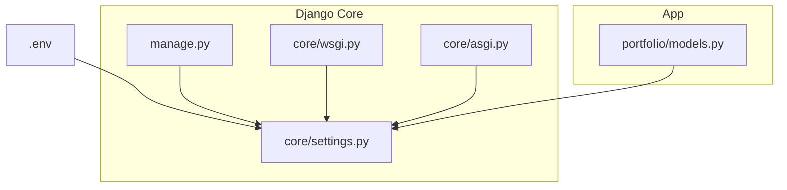
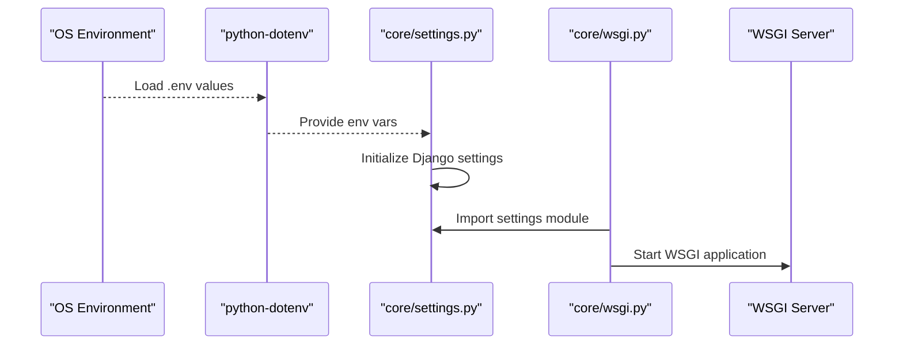
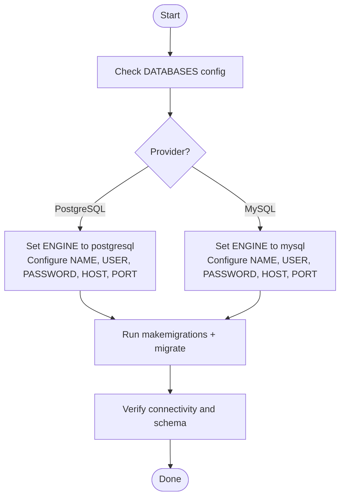
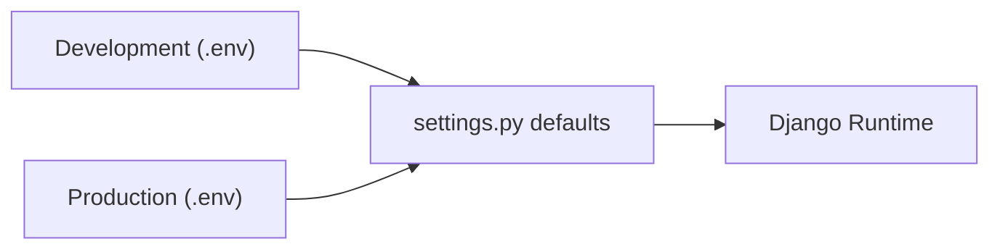
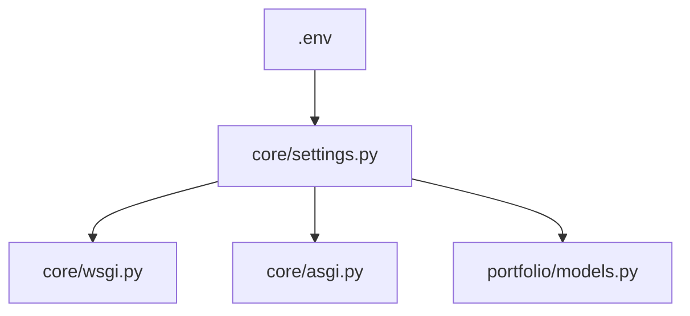

# Production Configuration

<cite>
**Referenced Files in This Document**
- [settings.py](file://core/settings.py)
- [.env](file://.env)
- [manage.py](file://manage.py)
- [wsgi.py](file://core/wsgi.py)
- [asgi.py](file://core/asgi.py)
- [models.py](file://portfolio/models.py)
</cite>

## Table of Contents
1. [Introduction](#introduction)
2. [Project Structure](#project-structure)
3. [Core Components](#core-components)
4. [Architecture Overview](#architecture-overview)
5. [Detailed Component Analysis](#detailed-component-analysis)
6. [Dependency Analysis](#dependency-analysis)
7. [Performance Considerations](#performance-considerations)
8. [Troubleshooting Guide](#troubleshooting-guide)
9. [Conclusion](#conclusion)

## Introduction
This document provides production-ready configuration guidance for the Django portfolio CMS. It focuses on critical settings in core/settings.py, environment variable management with python-dotenv, secure secret handling, database configuration for production (PostgreSQL/MySQL), static and media serving, email backend setup, security hardening, migrations, caching, sessions, and logging. It also explains how development and production configurations relate and provides examples of a production .env file.

## Project Structure
The project is a standard Django application with:
- A core package containing settings, WSGI/ASGI entry points, and URL routing
- A portfolio app defining models, forms, views, and templates
- Static assets under static/, uploaded media under media/, and templates under templates/
- Environment variables loaded via python-dotenv from a .env file at the repository root

**Diagram sources**
- [settings.py:13-17](file://core/settings.py#L13-L17)
- [manage.py:7-10](file://manage.py#L7-L10)
- [wsgi.py:10-16](file://core/wsgi.py#L10-L16)
- [asgi.py:10-16](file://core/asgi.py#L10-L16)
- [models.py:1-5](file://portfolio/models.py#L1-L5)

**Section sources**
- [settings.py:13-17](file://core/settings.py#L13-L17)
- [manage.py:7-10](file://manage.py#L7-L10)
- [wsgi.py:10-16](file://core/wsgi.py#L10-L16)
- [asgi.py:10-16](file://core/asgi.py#L10-L16)

## Core Components
This section summarizes the production-critical settings and their current defaults or behaviors as implemented in core/settings.py.

- Secret key and debug mode
  - SECRET_KEY is read from environment; a fallback placeholder exists for convenience but must be replaced in production.
  - DEBUG is read from environment and defaults to True if not set; it must be disabled in production.

- Allowed hosts
  - ALLOWED_HOSTS is read from environment as a comma-separated list.

- Database
  - Default is SQLite with a local db.sqlite3 file. For production, configure PostgreSQL or MySQL using environment variables.

- Media and static files
  - MEDIA_URL and MEDIA_ROOT define where uploads are served and stored.
  - STATIC_URL, STATICFILES_DIRS, and STATIC_ROOT define static asset collection and serving paths.

- Security middleware and validators
  - SecurityMiddleware, CSRF protection, X-Frame-Options, and password validators are enabled by default.

- Internationalization and time zone
  - Language and timezone are configured; USE_TZ is enabled.

- Application and template configuration
  - INSTALLED_APPS includes admin, auth, contenttypes, sessions, messages, staticfiles, and the portfolio app.
  - TEMPLATES include a custom context processor from the portfolio app.

- Entry points
  - WSGI and ASGI modules load settings via DJANGO_SETTINGS_MODULE.

**Section sources**
- [settings.py:24-30](file://core/settings.py#L24-L30)
- [settings.py:34-42](file://core/settings.py#L34-L42)
- [settings.py:45-53](file://core/settings.py#L45-L53)
- [settings.py:57-72](file://core/settings.py#L57-L72)
- [settings.py:77-85](file://core/settings.py#L77-L85)
- [settings.py:87-94](file://core/settings.py#L87-L94)
- [settings.py:96-112](file://core/settings.py#L96-L112)
- [settings.py:115-124](file://core/settings.py#L115-L124)
- [settings.py:127-136](file://core/settings.py#L127-L136)
- [wsgi.py:10-16](file://core/wsgi.py#L10-L16)
- [asgi.py:10-16](file://core/asgi.py#L10-L16)

## Architecture Overview
The runtime loads environment variables first, then initializes Django settings, and finally starts the WSGI/ASGI server.

**Diagram sources**
- [settings.py:13-17](file://core/settings.py#L13-L17)
- [wsgi.py:10-16](file://core/wsgi.py#L10-L16)

## Detailed Component Analysis

### Environment Variables and Secrets Management
- python-dotenv integration
  - The settings module calls load_dotenv() early, so all subsequent os.getenv() calls can read from .env.
- Required variables
  - SECRET_KEY: Must be a strong, unique value in production.
  - DEBUG: Must be False in production.
  - ALLOWED_HOSTS: Comma-separated hostnames/IPs that the site will serve.
  - DATABASE_URL or provider-specific variables (see Database section).
- Current .env contents
  - Contains placeholders for PostgreSQL connection details and a sample SECRET_KEY.

Recommendations
- Never commit secrets to version control. Use your platform’s secret manager or environment injection.
- Generate a new SECRET_KEY for each environment.
- Restrict ALLOWED_HOSTS to exact domains or IPs used in production.

**Section sources**
- [settings.py:13-17](file://core/settings.py#L13-L17)
- [settings.py:24-30](file://core/settings.py#L24-L30)
- [.env:1-10](file://.env#L1-L10)

### Database Configuration (Production: PostgreSQL/MySQL)
Current state
- Default database is SQLite.

Production strategy
- Use environment variables to configure a managed PostgreSQL or MySQL instance.
- If using DATABASE_URL, parse it into Django’s DATABASES dict.
- If using provider-specific variables (POSTGRES_*, MYSQL_*), map them to ENGINE, NAME, USER, PASSWORD, HOST, PORT.

Migration workflow
- Run makemigrations after model changes.
- Apply migrations in production using migrate.
- Prefer zero-downtime strategies:
  - Add fields as nullable or with defaults.
  - Split changes across multiple deployments when altering columns.
  - Backfill data before removing old columns.

[No sources needed since this diagram shows conceptual workflow, not actual code structure]

**Section sources**
- [settings.py:77-85](file://core/settings.py#L77-L85)
- [.env:3-8](file://.env#L3-L8)

### Static and Media File Serving
Current state
- STATIC_URL, STATICFILES_DIRS, and STATIC_ROOT are defined.
- MEDIA_URL and MEDIA_ROOT are defined.

Production recommendations
- Do not serve static/media via Django in production.
- Collect static files with collectstatic and serve them through a CDN or web server (e.g., Nginx, CloudFront).
- Store media files in object storage (e.g., S3-compatible) and serve via CDN.
- Ensure correct permissions and ownership for collected static files.

Operational steps
- Run collectstatic during deployment.
- Configure your web server to serve /static/ and /media/ appropriately.
- Keep MEDIA_ROOT outside the web root when possible.

**Section sources**
- [settings.py:87-94](file://core/settings.py#L87-L94)
- [settings.py:127-136](file://core/settings.py#L127-L136)

### Email Backend Setup
Current state
- No EMAIL_* settings are present in settings.py.

Production recommendations
- Use a transactional email provider (e.g., SMTP, SendGrid, Amazon SES).
- Set EMAIL_BACKEND and related credentials via environment variables.
- Avoid storing credentials in source control.

Example configuration targets
- EMAIL_BACKEND
- EMAIL_HOST, EMAIL_PORT, EMAIL_USE_TLS/SSL
- EMAIL_HOST_USER, EMAIL_HOST_PASSWORD
- DEFAULT_FROM_EMAIL

**Section sources**
- [settings.py:1-142](file://core/settings.py#L1-L142)

### Security Settings
Current state
- SecurityMiddleware, CSRF protection, and X-Frame-Options are enabled.
- Password validators are configured.
- DEBUG defaults to True if not set.

Production hardening checklist
- Disable DEBUG.
- Set a strong SECRET_KEY.
- Restrict ALLOWED_HOSTS.
- Enforce HTTPS (via reverse proxy or framework-level redirects).
- Consider additional headers (e.g., HSTS, CSP) via middleware or reverse proxy.
- Review session cookie security flags and cache behavior.

**Section sources**
- [settings.py:24-30](file://core/settings.py#L24-L30)
- [settings.py:45-53](file://core/settings.py#L45-L53)
- [settings.py:96-112](file://core/settings.py#L96-L112)

### Cache Configuration
Current state
- No CACHE setting is present.

Production recommendations
- Use a fast backend like Redis or Memcached.
- Configure CACHES with appropriate options (host, port, DB index, password).
- Consider per-site cache keys and versioning.

**Section sources**
- [settings.py:1-142](file://core/settings.py#L1-L142)

### Session Storage Options
Current state
- Sessions use the default backend (database-backed).

Production recommendations
- Switch to a faster store such as Redis or Memcached.
- Configure SESSION_ENGINE and related settings.
- Ensure session cookies are secure (HTTPS-only, SameSite).

**Section sources**
- [settings.py:45-53](file://core/settings.py#L45-L53)

### Logging Setup
Current state
- No LOGGING configuration is present.

Production recommendations
- Define structured loggers for Django, apps, and third-party libraries.
- Route logs to files or external services (e.g., syslog, cloud logging).
- Adjust log levels per environment.

**Section sources**
- [settings.py:1-142](file://core/settings.py#L1-L142)

### Development vs. Production Relationship
- Development defaults
  - DEBUG=True, SQLite database, local static/media directories.
- Production requirements
  - DEBUG=False, robust database (PostgreSQL/MySQL), externalized secrets, CDN/object storage for assets/media, hardened security headers, proper caching/sessions/logging.

Configuration flow
- .env provides environment variables.
- settings.py reads variables and applies defaults.
- manage.py, wsgi.py, and asgi.py rely on DJANGO_SETTINGS_MODULE to load settings.

[No sources needed since this diagram shows conceptual workflow, not actual code structure]

**Section sources**
- [settings.py:13-17](file://core/settings.py#L13-L17)
- [manage.py:7-10](file://manage.py#L7-L10)
- [wsgi.py:10-16](file://core/wsgi.py#L10-L16)
- [asgi.py:10-16](file://core/asgi.py#L10-L16)

## Dependency Analysis
Key relationships among configuration components:
- .env -> settings.py (environment-driven configuration)
- settings.py -> WSGI/ASGI (runtime initialization)
- settings.py -> portfolio app (INSTALLED_APPS, context processors)
- portfolio/models.py -> database schema (requires migrations)

**Diagram sources**
- [settings.py:13-17](file://core/settings.py#L13-L17)
- [wsgi.py:10-16](file://core/wsgi.py#L10-L16)
- [asgi.py:10-16](file://core/asgi.py#L10-L16)
- [models.py:1-5](file://portfolio/models.py#L1-L5)

**Section sources**
- [settings.py:13-17](file://core/settings.py#L13-L17)
- [wsgi.py:10-16](file://core/wsgi.py#L10-L16)
- [asgi.py:10-16](file://core/asgi.py#L10-L16)
- [models.py:1-5](file://portfolio/models.py#L1-L5)

## Performance Considerations
- Database
  - Use a managed PostgreSQL/MySQL instance with tuned parameters and connection pooling.
  - Enable query logging only in development or via sampling in production.
- Static and media
  - Serve via CDN; enable compression and caching headers.
- Cache
  - Use Redis/Memcached for high-throughput caching.
- Sessions
  - Use Redis-backed sessions to reduce database load.
- Gunicorn/Uvicorn
  - Tune worker count based on CPU cores and memory.
- Reverse proxy
  - Offload TLS termination and caching at the edge.

[No sources needed since this section provides general guidance]

## Troubleshooting Guide
Common issues and resolutions
- Missing or invalid SECRET_KEY
  - Symptom: Startup errors or insecure warnings.
  - Resolution: Provide a strong SECRET_KEY in .env or your secret manager.
- DEBUG left enabled
  - Symptom: Debug pages exposed, performance degradation.
  - Resolution: Set DEBUG=False in production.
- ALLOWED_HOSTS misconfiguration
  - Symptom: Disallowed Host header error.
  - Resolution: Set ALLOWED_HOSTS to your production domain(s).
- Database connectivity failures
  - Symptom: Connection refused or authentication errors.
  - Resolution: Verify DATABASE_URL or provider-specific variables; ensure network access and credentials.
- Static/media not found
  - Symptom: 404 for CSS/JS/images.
  - Resolution: Run collectstatic; configure web server/CDN to serve STATIC_ROOT and MEDIA_ROOT.
- Email delivery failures
  - Symptom: Emails not sent or SMTP errors.
  - Resolution: Configure EMAIL_* settings and verify provider credentials.

**Section sources**
- [settings.py:24-30](file://core/settings.py#L24-L30)
- [settings.py:77-85](file://core/settings.py#L77-L85)
- [settings.py:87-94](file://core/settings.py#L87-L94)
- [settings.py:127-136](file://core/settings.py#L127-L136)

## Conclusion
To productionize the Django portfolio CMS:
- Move all sensitive configuration to environment variables and remove defaults for secrets.
- Disable DEBUG and restrict ALLOWED_HOSTS.
- Configure a production-grade database (PostgreSQL/MySQL) and run migrations safely.
- Serve static/media via CDN or object storage.
- Harden security, add caching and session backends, and implement structured logging.
- Validate your configuration against the provided .env template and adjust per environment.

[No sources needed since this section summarizes without analyzing specific files]