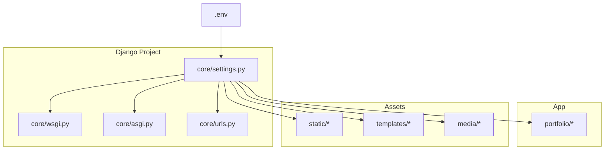
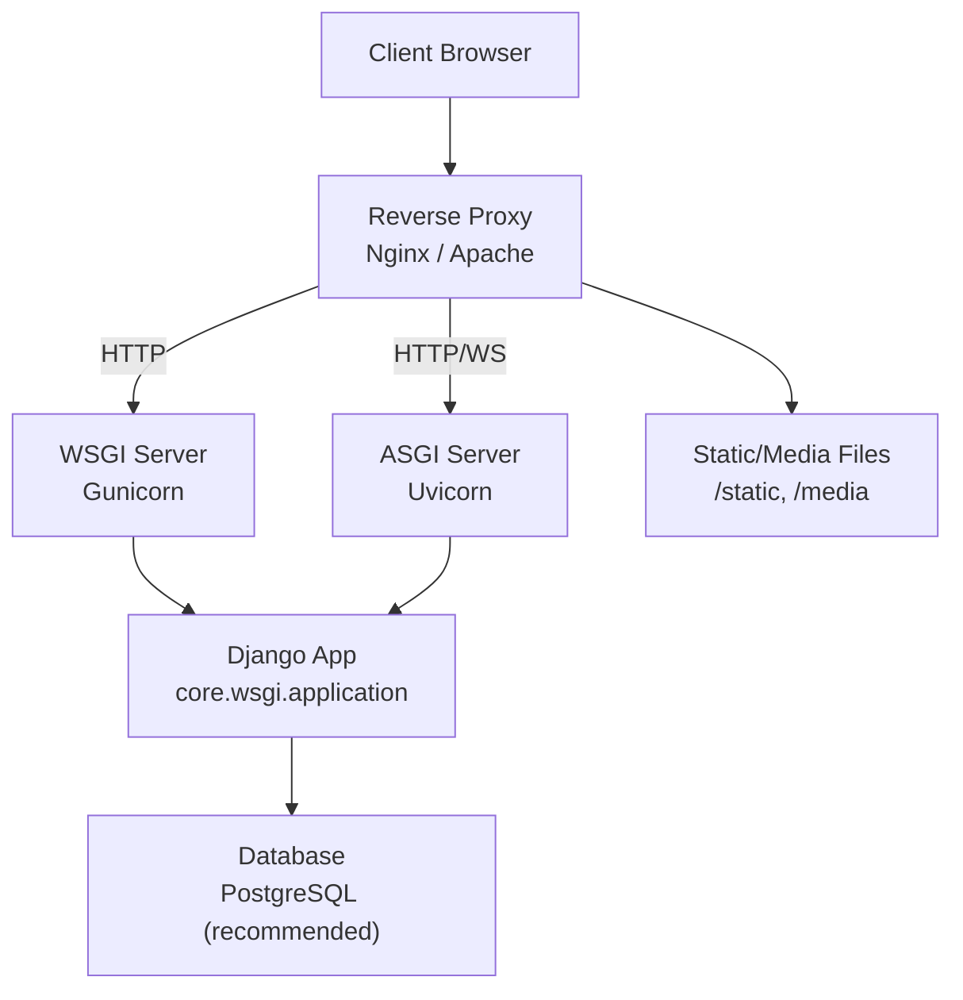
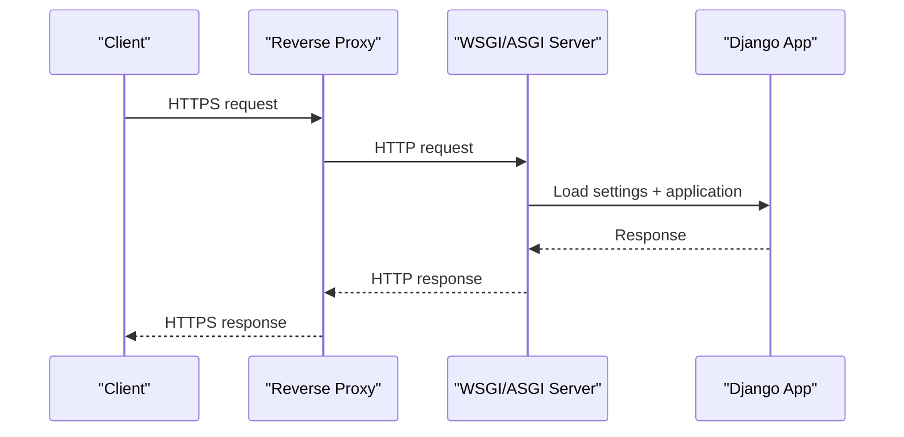
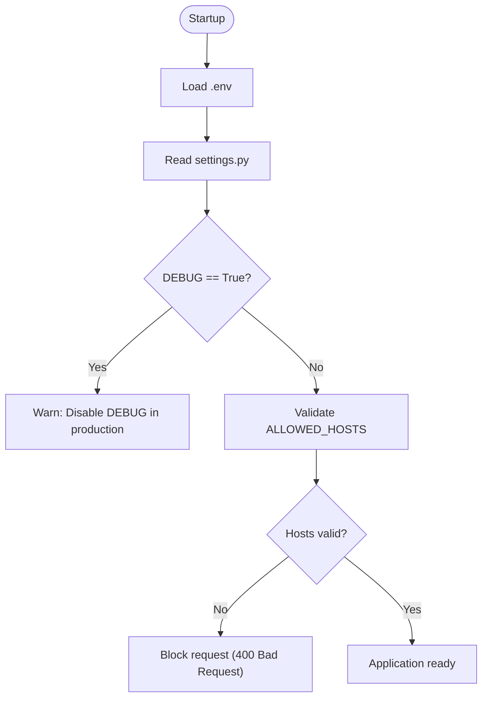
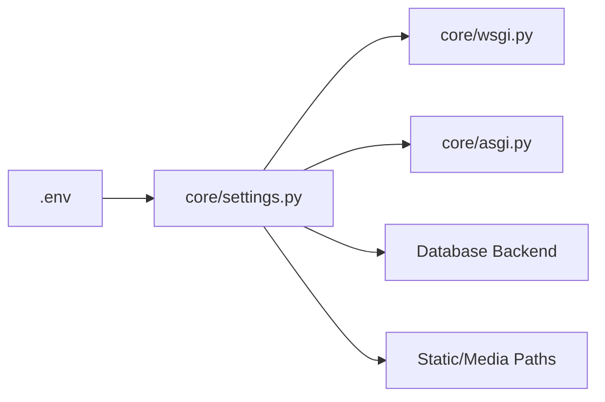

# Server Deployment

<cite>
**Referenced Files in This Document**
- [settings.py](file://core/settings.py)
- [wsgi.py](file://core/wsgi.py)
- [asgi.py](file://core/asgi.py)
- [manage.py](file://manage.py)
- [.env](file://.env)
</cite>

## Table of Contents
1. [Introduction](#introduction)
2. [Project Structure](#project-structure)
3. [Core Components](#core-components)
4. [Architecture Overview](#architecture-overview)
5. [Detailed Component Analysis](#detailed-component-analysis)
6. [Dependency Analysis](#dependency-analysis)
7. [Performance Considerations](#performance-considerations)
8. [Troubleshooting Guide](#troubleshooting-guide)
9. [Conclusion](#conclusion)
10. [Appendices](#appendices)

## Introduction
This document provides comprehensive server deployment guidance for the Django portfolio CMS, covering WSGI and ASGI servers (Gunicorn and Uvicorn), process management with systemd or supervisor, reverse proxy setup with Nginx or Apache, SSL certificate installation and renewal, domain configuration, firewall and port management, security hardening, platform-specific procedures (AWS, DigitalOcean, Heroku, traditional VPS), troubleshooting, and performance tuning.

The project exposes both WSGI and ASGI entry points and reads environment variables from a .env file. It is configured to run SQLite by default but includes PostgreSQL environment variables for production use.

## Project Structure
At a high level, the application is a standard Django project:
- core: Django project settings, WSGI/ASGI entry points, URLs
- portfolio: Application code (models, views, forms, templates)
- static/templates/media: Static assets, templates, and media uploads
- .env: Environment variables for local development and reference

**Diagram sources**
- [settings.py:1-142](file://core/settings.py#L1-L142)
- [wsgi.py:1-17](file://core/wsgi.py#L1-L17)
- [asgi.py:1-17](file://core/asgi.py#L1-L17)
- [.env:1-10](file://.env#L1-L10)

**Section sources**
- [settings.py:1-142](file://core/settings.py#L1-L142)
- [wsgi.py:1-17](file://core/wsgi.py#L1-L17)
- [asgi.py:1-17](file://core/asgi.py#L1-L17)
- [.env:1-10](file://.env#L1-L10)

## Core Components
- WSGI entry point: core/wsgi.py exposes the WSGI application callable.
- ASGI entry point: core/asgi.py exposes the ASGI application callable.
- Settings: core/settings.py configures SECRET_KEY, DEBUG, ALLOWED_HOSTS, database, static/media paths, middleware, and apps.
- Management script: manage.py sets DJANGO_SETTINGS_MODULE and runs Django commands.
- Environment: .env contains example values for secrets, database, and allowed hosts.

Key implications for deployment:
- Use WSGI for classic HTTP workloads; use ASGI if you need WebSockets or async features.
- Ensure DEBUG=False and ALLOWED_HOSTS are set correctly in production.
- Replace SQLite with a production-grade database (PostgreSQL recommended).
- Serve static and media files via a reverse proxy (Nginx/Apache) or a CDN.

**Section sources**
- [wsgi.py:1-17](file://core/wsgi.py#L1-L17)
- [asgi.py:1-17](file://core/asgi.py#L1-L17)
- [settings.py:24-30](file://core/settings.py#L24-L30)
- [settings.py:77-94](file://core/settings.py#L77-L94)
- [manage.py:7-18](file://manage.py#L7-L18)
- [.env:1-10](file://.env#L1-L10)

## Architecture Overview
A typical production stack for this project:

Notes:
- Reverse proxy terminates TLS and forwards requests to WSGI/ASGI.
- Static and media files are served directly by the proxy for performance.
- Database should be externalized to a managed service or dedicated server.

**Diagram sources**
- [wsgi.py:1-17](file://core/wsgi.py#L1-L17)
- [asgi.py:1-17](file://core/asgi.py#L1-L17)
- [settings.py:77-94](file://core/settings.py#L77-L94)

## Detailed Component Analysis

### WSGI and ASGI Entry Points
- WSGI: core/wsgi.py loads settings and returns the WSGI application.
- ASGI: core/asgi.py loads settings and returns the ASGI application.

Use these modules when configuring Gunicorn or Uvicorn:
- WSGI: core.wsgi:application
- ASGI: core.asgi:application

**Diagram sources**
- [wsgi.py:1-17](file://core/wsgi.py#L1-L17)
- [asgi.py:1-17](file://core/asgi.py#L1-L17)

**Section sources**
- [wsgi.py:1-17](file://core/wsgi.py#L1-L17)
- [asgi.py:1-17](file://core/asgi.py#L1-L17)

### Settings and Security Configuration
Production-critical settings include:
- SECRET_KEY: Must be a strong, unique value not committed to source control.
- DEBUG: Must be False in production.
- ALLOWED_HOSTS: Must list your domain(s) and/or IP(s).
- DATABASES: Switch from SQLite to PostgreSQL for production.
- STATIC_ROOT and MEDIA_ROOT: Used for collecting and serving static/media.

Environment variables are loaded from .env during startup.

**Diagram sources**
- [settings.py:24-30](file://core/settings.py#L24-L30)
- [.env:1-10](file://.env#L1-L10)

**Section sources**
- [settings.py:24-30](file://core/settings.py#L24-L30)
- [settings.py:77-94](file://core/settings.py#L77-L94)
- [.env:1-10](file://.env#L1-L10)

## Dependency Analysis
- The app depends on Django and its middleware stack defined in settings.
- Database backend defaults to SQLite; environment variables indicate PostgreSQL support.
- Static and media paths are configured for collection and serving.

**Diagram sources**
- [.env:1-10](file://.env#L1-L10)
- [settings.py:77-94](file://core/settings.py#L77-L94)
- [wsgi.py:1-17](file://core/wsgi.py#L1-L17)
- [asgi.py:1-17](file://core/asgi.py#L1-L17)

**Section sources**
- [settings.py:77-94](file://core/settings.py#L77-L94)
- [.env:1-10](file://.env#L1-L10)

## Performance Considerations
- Use a production WSGI server (Gunicorn) with multiple workers tuned to CPU cores.
- For async features or WebSockets, use Uvicorn with appropriate worker/process counts.
- Collect static files into STATIC_ROOT and serve them via Nginx/Apache.
- Offload media storage to object storage (e.g., S3-compatible) for scale.
- Enable caching (database cache, Redis) and consider a CDN for static assets.
- Tune database connection pooling and query optimization.

[No sources needed since this section provides general guidance]

## Troubleshooting Guide
Common issues and resolutions:
- 400 Bad Request (Invalid Hostname): Ensure ALLOWED_HOSTS includes your domain/IP.
- 500 Internal Server Error: Set DEBUG=True temporarily to inspect tracebacks; fix underlying errors; revert DEBUG=False.
- Missing static/media: Run collectstatic and ensure reverse proxy serves /static and /media.
- Database connectivity: Verify DATABASE_URL or per-backend settings; confirm credentials and network access.
- Permission errors: Ensure the web user can read/write required directories (media, staticfiles).
- Process crashes: Check logs of your process manager (systemd journal or supervisor logs).

**Section sources**
- [settings.py:24-30](file://core/settings.py#L24-L30)
- [settings.py:77-94](file://core/settings.py#L77-L94)

## Conclusion
Deploying this Django portfolio CMS involves setting up a secure reverse proxy, running Gunicorn/Uvicorn behind it, managing processes with systemd/supervisor, securing traffic with TLS, and configuring domains and firewalls. Follow the platform-specific steps below to automate and harden your deployment.

[No sources needed since this section summarizes without analyzing specific files]

## Appendices

### A. WSGI and ASGI Server Setup

#### Gunicorn (WSGI)
- Install Gunicorn in your virtual environment.
- Start with: gunicorn core.wsgi:application --bind 127.0.0.1:8000
- Production flags typically include workers, threads, timeout, and access/error logging.

#### Uvicorn (ASGI)
- Install Uvicorn in your virtual environment.
- Start with: uvicorn core.asgi:application --host 127.0.0.1 --port 8000
- Use workers and loop options suitable for your workload.

[No sources needed since this section provides general guidance]

### B. Process Management

#### systemd (Linux)
- Create a service unit for Gunicorn/Uvicorn that:
  - Runs under a dedicated non-root user
  - Sets WorkingDirectory to your project path
  - Exports environment variables (or uses an env file)
  - Restarts automatically on failure
  - Binds to localhost only (reverse proxy handles public ports)

#### Supervisor (Linux)
- Define a program block pointing to your virtual environment’s gunicorn/uvicorn command.
- Configure numprocs, autostart, autorestart, stdout/stderr logfiles.

[No sources needed since this section provides general guidance]

### C. Reverse Proxy Setup

#### Nginx
- Terminate TLS at Nginx.
- Proxy_pass to Gunicorn/Uvicorn on localhost.
- Serve /static and /media directly from disk.
- Add security headers and enable HTTP/2.

#### Apache
- Use mod_proxy and mod_ssl.
- ProxyPass/ProxyPassReverse to Gunicorn/Uvicorn.
- Alias /static and /media to STATIC_ROOT and MEDIA_ROOT.

[No sources needed since this section provides general guidance]

### D. SSL Certificate Installation and Renewal
- Obtain certificates via Let’s Encrypt (certbot).
- Configure Nginx/Apache to use the certificate and key.
- Automate renewal with certbot hooks or cron.
- Enforce HTTPS and redirect HTTP to HTTPS.

[No sources needed since this section provides general guidance]

### E. Domain Configuration
- Point DNS A/AAAA records to your server IP.
- Set ALLOWED_HOSTS to your domain(s).
- Configure your reverse proxy server_name to match the domain.

**Section sources**
- [settings.py:24-30](file://core/settings.py#L24-L30)

### F. Firewall and Port Management
- Open only necessary ports (typically 80/443 for HTTP/HTTPS).
- Keep application ports (e.g., 8000) bound to localhost.
- Use OS firewall rules (ufw/firewalld) or cloud provider security groups.

[No sources needed since this section provides general guidance]

### G. Security Hardening
- Set DEBUG=False and SECRET_KEY to a strong value.
- Restrict ALLOWED_HOSTS to known domains.
- Use HTTPS everywhere; enforce HSTS.
- Limit file permissions; run app under a dedicated user.
- Keep dependencies updated; apply security patches regularly.

**Section sources**
- [settings.py:24-30](file://core/settings.py#L24-L30)

### H. Platform-Specific Deployment Procedures

#### AWS (EC2 + RDS + S3)
- Launch EC2 instance; install Python, virtualenv, Gunicorn/Uvicorn.
- Provision RDS (PostgreSQL); update DATABASES accordingly.
- Store static/media in S3; configure Django storage backend.
- Place Nginx in front; attach Elastic IP and Route 53 record.
- Use IAM roles and security groups to restrict access.

[No sources needed since this section provides general guidance]

#### DigitalOcean (Droplet + Managed DB)
- Create Droplet; install dependencies and app.
- Provision Managed PostgreSQL; update database settings.
- Deploy Nginx; configure TLS with certbot.
- Attach domain via DNS; set ALLOWED_HOSTS.

[No sources needed since this section provides general guidance]

#### Heroku
- Use a Procfile to start Gunicorn/Uvicorn.
- Configure environment variables in Heroku dashboard.
- Use a managed database add-on; migrate on deploy.
- Static files: use whitenoise or collectstatic to a CDN.

[No sources needed since this section provides general guidance]

#### Traditional VPS (Ubuntu/CentOS)
- Install system packages (Python, pip, virtualenv).
- Clone repo, create venv, install requirements.
- Configure systemd/supervisor for process management.
- Install Nginx/Apache, configure TLS and proxy.
- Harden OS and app; monitor logs.

[No sources needed since this section provides general guidance]

### I. Static and Media Serving Checklist
- Run collectstatic to populate STATIC_ROOT.
- Ensure Nginx/Apache serves /static and /media.
- For uploads, consider object storage and CDN integration.

**Section sources**
- [settings.py:87-94](file://core/settings.py#L87-L94)

### J. Database Migration and Initialization
- Migrate models after deploying changes.
- Seed initial data if needed.
- Back up databases regularly.

[No sources needed since this section provides general guidance]

### K. Monitoring and Logging
- Centralize logs (journald, ELK, CloudWatch).
- Monitor uptime, error rates, and resource usage.
- Alert on critical failures.

[No sources needed since this section provides general guidance]