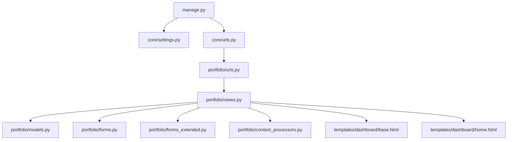
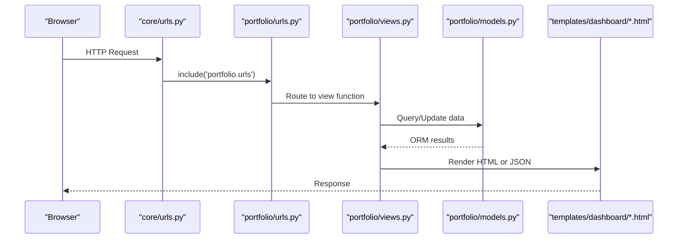
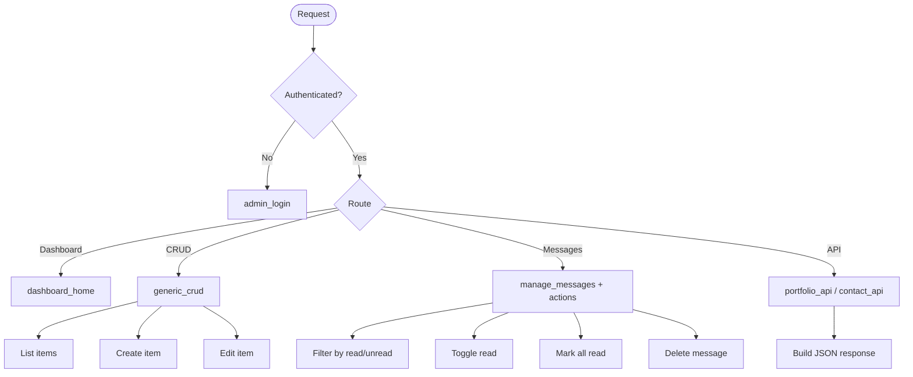
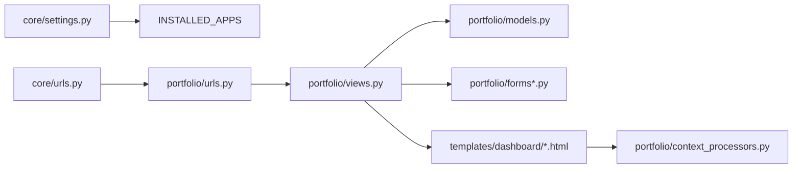

# Development Guide

<cite>
**Referenced Files in This Document**
- [manage.py](file://manage.py)
- [core/settings.py](file://core/settings.py)
- [core/urls.py](file://core/urls.py)
- [portfolio/apps.py](file://portfolio/apps.py)
- [portfolio/models.py](file://portfolio/models.py)
- [portfolio/forms.py](file://portfolio/forms.py)
- [portfolio/forms_extended.py](file://portfolio/forms_extended.py)
- [portfolio/views.py](file://portfolio/views.py)
- [portfolio/admin.py](file://portfolio/admin.py)
- [portfolio/context_processors.py](file://portfolio/context_processors.py)
- [portfolio/tests.py](file://portfolio/tests.py)
- [portfolio/urls.py](file://portfolio/urls.py)
- [templates/dashboard/base.html](file://templates/dashboard/base.html)
- [templates/dashboard/home.html](file://templates/dashboard/home.html)
</cite>

## Table of Contents
1. Introduction
2. Project Structure
3. Core Components
4. Architecture Overview
5. Detailed Component Analysis
6. Dependency Analysis
7. Performance Considerations
8. Troubleshooting Guide
9. Conclusion
10. Appendices

## Introduction
This guide explains how to contribute to the Portfolio CMS, a Django-based application that provides an admin dashboard for managing portfolio content and exposes a JSON API to power the public site. It covers code organization principles, naming conventions, project structure standards, testing strategy with Django’s test framework, debugging techniques, development workflow best practices, admin interface customization, context processors, extension points, code review and PR processes, issue reporting, feature development workflows, performance profiling, code quality tools, and continuous integration setup.

## Project Structure
The repository follows a standard Django layout:
- core: Django project configuration (settings, URLs, WSGI/ASGI).
- portfolio: Django app containing models, forms, views, URLs, templates, and tests.
- templates/dashboard: Admin UI templates for the custom dashboard.
- static and assets: Static assets and media files.
- manage.py: Entry point for Django management commands.

**Diagram sources**
- [manage.py:7-18](file://manage.py#L7-L18)
- [core/settings.py:34-72](file://core/settings.py#L34-L72)
- [core/urls.py:22-28](file://core/urls.py#L22-L28)
- [portfolio/urls.py:4-43](file://portfolio/urls.py#L4-L43)
- [portfolio/views.py:21-458](file://portfolio/views.py#L21-L458)
- [portfolio/models.py:4-298](file://portfolio/models.py#L4-L298)
- [portfolio/forms.py:4-22](file://portfolio/forms.py#L4-L22)
- [portfolio/forms_extended.py:4-78](file://portfolio/forms_extended.py#L4-L78)
- [portfolio/context_processors.py:4-8](file://portfolio/context_processors.py#L4-L8)
- [templates/dashboard/base.html:1-188](file://templates/dashboard/base.html#L1-L188)
- [templates/dashboard/home.html:1-134](file://templates/dashboard/home.html#L1-L134)

**Section sources**
- [manage.py:7-18](file://manage.py#L7-L18)
- [core/settings.py:34-72](file://core/settings.py#L34-L72)
- [core/urls.py:22-28](file://core/urls.py#L22-L28)
- [portfolio/urls.py:4-43](file://portfolio/urls.py#L4-L43)

## Core Components
- Models: Central data layer defining Profile, HeroRole, Education, Experience, Skills, Projects, Certificates, Workshops, Achievements, Services, Technologies, SocialLinks, ContactMessage, SiteSettings, and related entities.
- Forms: ModelForms for profile, hero roles, and all major content modules; organized into forms.py and forms_extended.py.
- Views: Dashboard views for authentication, CRUD operations via a generic helper, messages inbox, and APIs for portfolio data and contact submissions.
- URLs: URL routing for public pages, dashboard routes, and API endpoints.
- Templates: Reusable dashboard base template and home view template.
- Context Processors: Global variables injected into templates (e.g., unread message count).
- Settings: Application configuration including installed apps, middleware, templates, database, static/media paths, and security settings.

Key responsibilities:
- Data modeling and relationships are centralized in models.py.
- Business logic is implemented in views.py using Django’s request/response cycle and ORM.
- Presentation is handled by templates under templates/dashboard.
- Configuration is managed in core/settings.py.

**Section sources**
- [portfolio/models.py:4-298](file://portfolio/models.py#L4-L298)
- [portfolio/forms.py:4-22](file://portfolio/forms.py#L4-L22)
- [portfolio/forms_extended.py:4-78](file://portfolio/forms_extended.py#L4-L78)
- [portfolio/views.py:21-458](file://portfolio/views.py#L21-L458)
- [portfolio/urls.py:4-43](file://portfolio/urls.py#L4-L43)
- [templates/dashboard/base.html:1-188](file://templates/dashboard/base.html#L1-L188)
- [templates/dashboard/home.html:1-134](file://templates/dashboard/home.html#L1-L134)
- [core/settings.py:34-72](file://core/settings.py#L34-L72)

## Architecture Overview
The application uses a layered architecture:
- Request enters via core/urls.py and is routed to portfolio/urls.py.
- Views handle business logic, interact with models via ORM, and render templates or return JSON responses.
- Templates extend a shared base template for consistent UI.
- Context processors inject global data into templates.
- Media and static files are served according to settings.

**Diagram sources**
- [core/urls.py:22-28](file://core/urls.py#L22-L28)
- [portfolio/urls.py:4-43](file://portfolio/urls.py#L4-L43)
- [portfolio/views.py:21-458](file://portfolio/views.py#L21-L458)
- [portfolio/models.py:4-298](file://portfolio/models.py#L4-L298)
- [templates/dashboard/base.html:1-188](file://templates/dashboard/base.html#L1-L188)

## Detailed Component Analysis

### Models and Data Layer
- Profiles and Hero Roles: One-to-one and one-to-many relationships tied to Django User.
- Content Modules: Education, Experience, Skills, Projects, Certificates, Workshops, Achievements, Services, Technologies, Social Links, Resumes.
- Messaging: ContactMessage stores inbound messages with read/archived flags.
- Site Settings: Centralized SEO and branding fields.
- Ordering and visibility: Many models use display_order and boolean flags for ordering and visibility.

Best practices observed:
- Consistent use of display_order for sortable lists.
- Boolean flags like is_active/is_visible for controlling presentation.
- JSONField usage for flexible arrays (e.g., responsibilities, features).

Recommendations:
- Add indexes on frequently filtered fields (e.g., is_visible, is_active) to improve query performance.
- Consider adding unique constraints where appropriate (e.g., slug uniqueness already present for some models).

**Section sources**
- [portfolio/models.py:4-298](file://portfolio/models.py#L4-L298)

### Views and Business Logic
- Authentication: Custom login flow creates or retrieves a staff user and logs them in.
- Dashboard Home: Aggregates counts and recent messages for overview.
- Generic CRUD: A reusable helper supports list, create, edit, and delete across multiple modules.
- Messages Inbox: Filtering, marking read, bulk mark-read, and deletion.
- APIs:
  - portfolio_api: Returns comprehensive JSON payload for the frontend.
  - contact_api: Accepts POST JSON to store contact messages.

Patterns:
- Use of @login_required to protect dashboard routes.
- Centralized error handling via Http404 and messages framework.
- Efficient queries using select_related/prefetch_related in API endpoint.

**Diagram sources**
- [portfolio/views.py:21-458](file://portfolio/views.py#L21-L458)

**Section sources**
- [portfolio/views.py:21-458](file://portfolio/views.py#L21-L458)

### Forms and Validation
- ModelForms encapsulate validation and rendering for each model.
- Specialized widgets for text areas in ProfileForm.
- Separation of concerns: core forms in forms.py, extended module forms in forms_extended.py.

Guidelines:
- Keep field lists explicit when possible to avoid accidental exposure.
- Add custom clean methods for cross-field validation if needed.
- Use formsets for repeating sections (e.g., skills within categories) if required.

**Section sources**
- [portfolio/forms.py:4-22](file://portfolio/forms.py#L4-L22)
- [portfolio/forms_extended.py:4-78](file://portfolio/forms_extended.py#L4-L78)

### Templates and UI
- Base template provides sidebar navigation, topbar, theme toggle, and toast notifications.
- Home template displays metrics, quick actions, and recent messages.
- Context processor injects unread_count globally.

Extensibility:
- Add new menu items by updating sidebar links in base.html and corresponding URLs/views.
- Use blocks (title, page_title, page_subtitle, content, extra_css, extra_js) to customize pages.

**Section sources**
- [templates/dashboard/base.html:1-188](file://templates/dashboard/base.html#L1-L188)
- [templates/dashboard/home.html:1-134](file://templates/dashboard/home.html#L1-L134)
- [portfolio/context_processors.py:4-8](file://portfolio/context_processors.py#L4-L8)

### URLs and Routing
- Root includes portfolio URLs.
- Organized route groups: public, auth, dashboard modules, messages, and API.
- Named URLs facilitate maintainability and template references.

Naming conventions:
- Use kebab-case for path segments and snake_case for view functions and URL names.
- Group related routes logically.

**Section sources**
- [core/urls.py:22-28](file://core/urls.py#L22-L28)
- [portfolio/urls.py:4-43](file://portfolio/urls.py#L4-L43)

### Settings and Configuration
- Installed apps include Django contrib and portfolio app.
- Middleware stack enables sessions, auth, messages, and security.
- TEMPLATES config registers context processors including custom dashboard_globals.
- Database defaults to SQLite; static and media directories configured.
- Security: SECRET_KEY from environment; DEBUG toggled via environment.

Environment variables:
- SECRET_KEY, DEBUG, ALLOWED_HOSTS.

**Section sources**
- [core/settings.py:34-72](file://core/settings.py#L34-L72)
- [core/settings.py:77-94](file://core/settings.py#L77-L94)
- [core/settings.py:96-142](file://core/settings.py#L96-L142)

### Admin Interface Customization
- The default Django admin is available at /admin/.
- Current admin registration is minimal; register models to leverage built-in admin features.

Recommended steps:
- Register key models in portfolio/admin.py with list_display, search_fields, and filters.
- Customize change forms with fieldsets and inlines for related objects.
- Use readonly_fields for computed properties.

**Section sources**
- [portfolio/admin.py:1-4](file://portfolio/admin.py#L1-L4)
- [core/urls.py:22-24](file://core/urls.py#L22-L24)

### Context Processor Usage
- dashboard_globals adds unread_count to every template context.
- Used in base.html to show badge counts and indicators.

Extension points:
- Add more global variables (e.g., site settings) to simplify template logic.

**Section sources**
- [portfolio/context_processors.py:4-8](file://portfolio/context_processors.py#L4-L8)
- [templates/dashboard/base.html:92-95](file://templates/dashboard/base.html#L92-L95)

### Extension Points for New Features
- Add a new model in models.py.
- Create a ModelForm in forms_extended.py.
- Implement CRUD views using generic_crud or dedicated views in views.py.
- Add URLs in portfolio/urls.py.
- Create templates extending base.html.
- Optionally register in admin.py.
- Update context_processors if global data is needed.
- Add tests in tests.py.

**Section sources**
- [portfolio/models.py:4-298](file://portfolio/models.py#L4-L298)
- [portfolio/forms_extended.py:4-78](file://portfolio/forms_extended.py#L4-L78)
- [portfolio/views.py:127-207](file://portfolio/views.py#L127-L207)
- [portfolio/urls.py:4-43](file://portfolio/urls.py#L4-L43)
- [templates/dashboard/base.html:1-188](file://templates/dashboard/base.html#L1-L188)
- [portfolio/admin.py:1-4](file://portfolio/admin.py#L1-L4)
- [portfolio/context_processors.py:4-8](file://portfolio/context_processors.py#L4-L8)
- [portfolio/tests.py:1-4](file://portfolio/tests.py#L1-L4)

## Dependency Analysis
High-level dependencies:
- core.settings depends on environment variables and defines app registry.
- core.urls includes portfolio.urls.
- portfolio.views imports models, forms, and uses Django utilities.
- Templates depend on context processors and static assets.

**Diagram sources**
- [core/settings.py:34-72](file://core/settings.py#L34-L72)
- [core/urls.py:22-28](file://core/urls.py#L22-L28)
- [portfolio/urls.py:4-43](file://portfolio/urls.py#L4-L43)
- [portfolio/views.py:21-458](file://portfolio/views.py#L21-L458)
- [portfolio/models.py:4-298](file://portfolio/models.py#L4-L298)
- [portfolio/forms.py:4-22](file://portfolio/forms.py#L4-L22)
- [portfolio/forms_extended.py:4-78](file://portfolio/forms_extended.py#L4-L78)
- [portfolio/context_processors.py:4-8](file://portfolio/context_processors.py#L4-L8)
- [templates/dashboard/base.html:1-188](file://templates/dashboard/base.html#L1-L188)

**Section sources**
- [core/settings.py:34-72](file://core/settings.py#L34-L72)
- [core/urls.py:22-28](file://core/urls.py#L22-L28)
- [portfolio/urls.py:4-43](file://portfolio/urls.py#L4-L43)
- [portfolio/views.py:21-458](file://portfolio/views.py#L21-L458)

## Performance Considerations
- Use select_related and prefetch_related in views that traverse relationships (already used in portfolio_api).
- Add database indexes on frequently filtered columns (is_visible, is_active, created_at).
- Paginate large lists in dashboard views to reduce memory and rendering time.
- Cache expensive computations or repeated queries using Django cache framework.
- Optimize image uploads with appropriate storage backends and compression.
- Profile with Django Debug Toolbar in development and cProfile in production-like environments.

[No sources needed since this section provides general guidance]

## Troubleshooting Guide
Common issues and resolutions:
- Missing index.html for home_view: Ensure index.html exists at BASE_DIR; otherwise Http404 is raised.
- CSRF errors on contact_api: Endpoint is marked csrf_exempt; ensure CORS/security headers are configured appropriately if accessed cross-origin.
- Authentication loops: Verify login credentials and that user has is_staff/is_superuser set for dashboard access.
- Template missing blocks: Extend base.html and override required blocks to avoid rendering errors.
- File upload failures: Check MEDIA_ROOT permissions and file size limits.

Debugging tips:
- Enable DEBUG=True locally for detailed error pages.
- Use Django shell to inspect models and queries.
- Log request/response cycles and query counts to identify bottlenecks.

**Section sources**
- [portfolio/views.py:21-26](file://portfolio/views.py#L21-L26)
- [portfolio/views.py:28-52](file://portfolio/views.py#L28-L52)
- [portfolio/views.py:300-322](file://portfolio/views.py#L300-L322)
- [core/settings.py:24-28](file://core/settings.py#L24-L28)

## Conclusion
The Portfolio CMS provides a robust foundation for managing portfolio content through a custom dashboard and a JSON API. Its modular design, reusable generic CRUD, and clear separation of concerns make it straightforward to extend. By following the guidelines in this document—naming conventions, structured templates, context processors, and disciplined testing—you can confidently add features, maintain code quality, and scale the application effectively.

[No sources needed since this section summarizes without analyzing specific files]

## Appendices

### Testing Strategy
- Use Django TestCase for unit and integration tests.
- Test views by asserting status codes, redirects, and context data.
- Validate forms with invalid and valid payloads.
- Assert ORM behavior and query correctness.
- Use factories or fixtures for test data consistency.

Example locations to expand:
- Add tests for views, forms, and models in portfolio/tests.py.

**Section sources**
- [portfolio/tests.py:1-4](file://portfolio/tests.py#L1-L4)

### Code Review and Pull Requests
- Follow consistent naming and structure per this guide.
- Ensure tests cover new functionality and edge cases.
- Keep changes focused and well-documented.
- Include screenshots or examples for UI changes.
- Run linting and formatting checks before submitting PRs.

[No sources needed since this section provides general guidance]

### Issue Reporting
- Provide environment details (Python/Django versions, OS).
- Reproduction steps and expected vs actual behavior.
- Logs or screenshots for UI issues.
- Minimal reproducible example when possible.

[No sources needed since this section provides general guidance]

### Feature Development Workflow
- Create a feature branch from main.
- Implement changes incrementally with tests.
- Update documentation and templates as needed.
- Open a PR with a clear description and linked issues.
- Address review feedback promptly.

[No sources needed since this section provides general guidance]

### Performance Profiling
- Use django-debug-toolbar for query inspection and timing.
- Profile with cProfile or line_profiler for hotspots.
- Monitor database queries and N+1 problems.
- Benchmark API endpoints under load.

[No sources needed since this section provides general guidance]

### Code Quality Tools
- Linting: flake8 or ruff.
- Formatting: black or autopep8.
- Type hints: mypy (optional).
- Pre-commit hooks to enforce standards.

[No sources needed since this section provides general guidance]

### Continuous Integration Setup
- Configure CI to run tests, linting, and build steps.
- Cache dependencies to speed up builds.
- Publish artifacts or deploy previews on PRs.
- Enforce branch protection rules and required checks.

[No sources needed since this section provides general guidance]