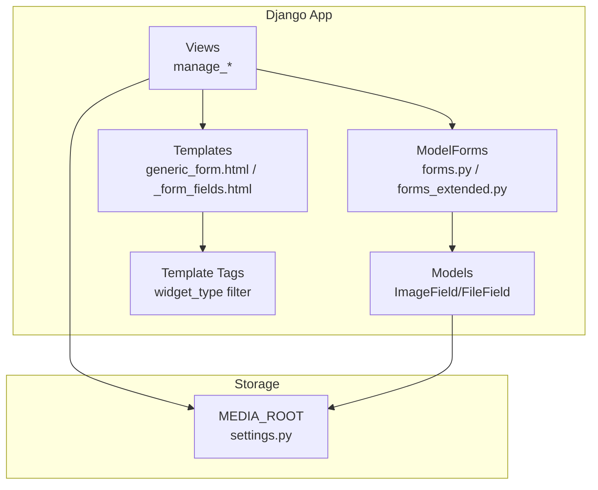
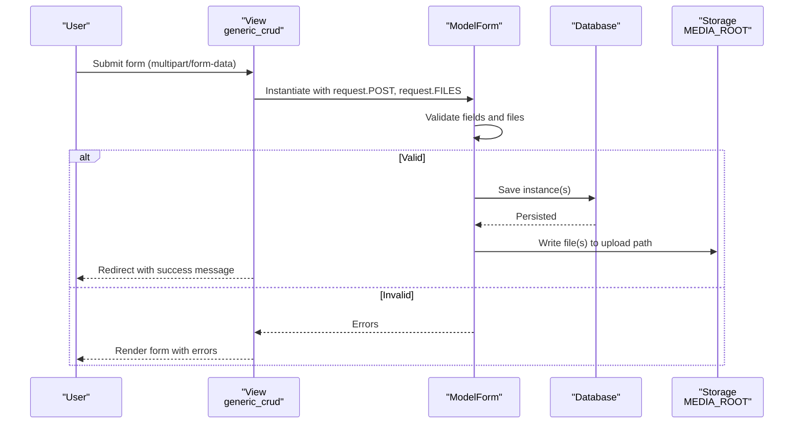
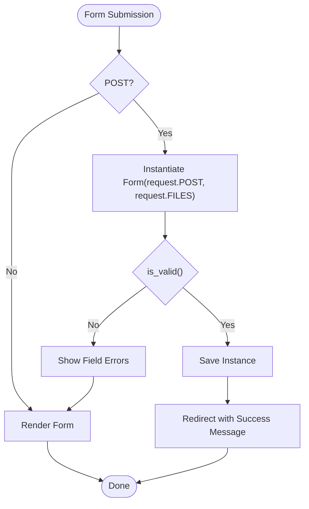
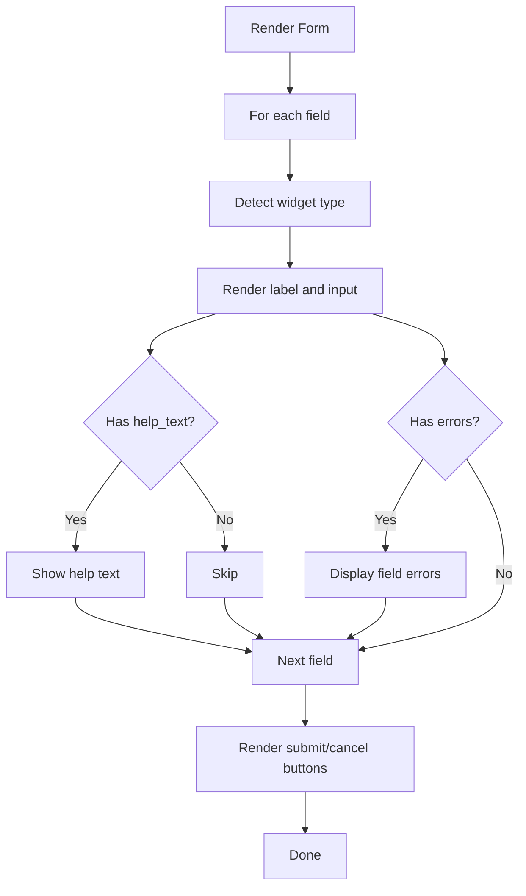
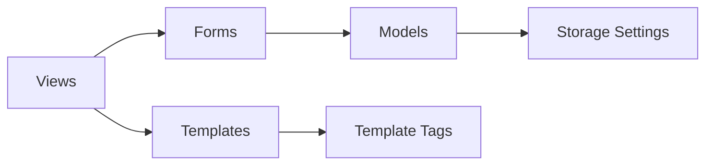

# Advanced Forms

<cite>
**Referenced Files in This Document**
- [forms.py](file://portfolio/forms.py)
- [forms_extended.py](file://portfolio/forms_extended.py)
- [models.py](file://portfolio/models.py)
- [views.py](file://portfolio/views.py)
- [generic_form.html](file://templates/dashboard/generic_form.html)
- [_form_fields.html](file://templates/dashboard/_form_fields.html)
- [dashboard_extras.py](file://portfolio/templatetags/dashboard_extras.py)
- [settings.py](file://core/settings.py)
</cite>

## Table of Contents
1. [Introduction](#introduction)
2. [Project Structure](#project-structure)
3. [Core Components](#core-components)
4. [Architecture Overview](#architecture-overview)
5. [Detailed Component Analysis](#detailed-component-analysis)
6. [Dependency Analysis](#dependency-analysis)
7. [Performance Considerations](#performance-considerations)
8. [Troubleshooting Guide](#troubleshooting-guide)
9. [Conclusion](#conclusion)
10. [Appendices](#appendices)

## Introduction
This document explains the advanced form functionality for managing media-rich content such as projects, certificates, workshops, and other assets. It covers how forms are defined, validated, and processed; how file uploads are handled; and how to implement reusable patterns, custom validation, and robust error handling. The goal is to provide a clear guide for building secure, scalable forms that support multiple file inputs, binary data processing, and integration with storage backends.

## Project Structure
The application uses Django’s ModelForms to generate forms from models that include ImageField and FileField fields. Views handle both GET (rendering forms) and POST (processing submissions), passing request.FILES to forms when files are uploaded. Templates render forms generically, supporting multiple file inputs and displaying errors consistently.



**Diagram sources**
- [views.py:127-221](file://portfolio/views.py#L127-L221)
- [forms.py:1-22](file://portfolio/forms.py#L1-L22)
- [forms_extended.py:1-78](file://portfolio/forms_extended.py#L1-L78)
- [models.py:12-214](file://portfolio/models.py#L12-L214)
- [generic_form.html:24-59](file://templates/dashboard/generic_form.html#L24-L59)
- [_form_fields.html:1-25](file://templates/dashboard/_form_fields.html#L1-L25)
- [dashboard_extras.py:6-12](file://portfolio/templatetags/dashboard_extras.py#L6-L12)
- [settings.py:87-136](file://core/settings.py#L87-L136)

**Section sources**
- [views.py:127-221](file://portfolio/views.py#L127-L221)
- [generic_form.html:24-59](file://templates/dashboard/generic_form.html#L24-L59)
- [settings.py:87-136](file://core/settings.py#L87-L136)

## Core Components
- Model-based forms: Each model with media fields has a corresponding ModelForm that exposes all fields, including images and files.
- Generic CRUD views: A single helper function handles list, create, and edit flows for many models, reusing forms and templates.
- Template rendering: A generic form template renders all fields uniformly, supports file uploads via multipart encoding, and displays field-level errors.
- Storage configuration: Media URLs and roots are configured to store uploaded files under a central directory.

Key responsibilities:
- Form definitions map directly to models, ensuring consistent behavior across entities like projects, certificates, workshops, achievements, services, resumes, and site settings.
- Views validate forms, save instances, and redirect with user feedback.
- Templates ensure consistent UI and error presentation for all forms.

**Section sources**
- [forms.py:1-22](file://portfolio/forms.py#L1-L22)
- [forms_extended.py:1-78](file://portfolio/forms_extended.py#L1-L78)
- [views.py:127-221](file://portfolio/views.py#L127-L221)
- [generic_form.html:24-59](file://templates/dashboard/generic_form.html#L24-L59)
- [settings.py:87-136](file://core/settings.py#L87-L136)

## Architecture Overview
The form architecture follows a layered pattern:
- Models define data structures and upload paths for images and files.
- Forms inherit from ModelForm to automatically handle validation and persistence.
- Views orchestrate request handling, form instantiation with request.FILES, and redirection.
- Templates render forms generically, supporting multiple file inputs and error display.
- Settings configure media storage locations.



**Diagram sources**
- [views.py:127-180](file://portfolio/views.py#L127-L180)
- [generic_form.html:24-59](file://templates/dashboard/generic_form.html#L24-L59)
- [models.py:12-214](file://portfolio/models.py#L12-L214)
- [settings.py:87-136](file://core/settings.py#L87-L136)

## Detailed Component Analysis

### Models and Upload Fields
Models define where files are stored and what types are expected:
- Profile includes profile images.
- Education, Experience, Technology include logos or images.
- Certificate includes image and optional PDF.
- Workshop includes an optional image.
- Project includes main image, thumbnail, and gallery images via a related model.
- Achievement includes optional image and certificate proof file.
- Service includes optional image.
- Resume includes a file field for documents.
- SiteSettings includes social preview images and favicon.

These fields determine the kinds of files users can upload and where they will be stored under MEDIA_ROOT.

**Section sources**
- [models.py:12-214](file://portfolio/models.py#L12-L214)

### Forms and Reusability Patterns
- All forms are ModelForms that expose all model fields, enabling reuse across similar entities.
- The generic CRUD view reduces duplication by handling list, add, and edit operations for each model using its specific form class.
- This pattern ensures consistent behavior and simplifies adding new sections.

```mermaid
classDiagram
class StatisticForm
class EducationForm
class ExperienceForm
class SkillForm
class CertificateForm
class WorkshopForm
class ProjectForm
class AchievementForm
class ServiceForm
class ResumeForm
class SocialLinkForm
class TechnologyForm
class SiteSettingsForm
StatisticForm --> "uses" : "Statistic"
EducationForm --> "uses" : "Education"
ExperienceForm --> "uses" "Experience"
SkillForm --> "uses" "Skill"
CertificateForm --> "uses" "Certificate"
WorkshopForm --> "uses" "Workshop"
ProjectForm --> "uses" "Project"
AchievementForm --> "uses" "Achievement"
ServiceForm --> "uses" "Service"
ResumeForm --> "uses" "Resume"
SocialLinkForm --> "uses" "SocialLink"
TechnologyForm --> "uses" "Technology"
SiteSettingsForm --> "uses" "SiteSettings"
```

**Diagram sources**
- [forms_extended.py:4-77](file://portfolio/forms_extended.py#L4-L77)
- [models.py:34-298](file://portfolio/models.py#L34-L298)

**Section sources**
- [forms_extended.py:4-77](file://portfolio/forms_extended.py#L4-L77)
- [views.py:184-221](file://portfolio/views.py#L184-L221)

### View Processing and Multi-Step Forms
- The generic CRUD view handles create and edit flows, instantiating forms with request.FILES for file uploads.
- For multi-step forms, you can split logic across multiple views or use session-stored partial data. While not implemented here, the same pattern applies: validate step-by-step, persist intermediate state, and finalize on completion.



**Diagram sources**
- [views.py:127-180](file://portfolio/views.py#L127-L180)
- [generic_form.html:24-59](file://templates/dashboard/generic_form.html#L24-L59)

**Section sources**
- [views.py:127-180](file://portfolio/views.py#L127-L180)

### Template Rendering and Error Handling
- The generic form template sets enctype="multipart/form-data" to support file uploads.
- It loops through form fields, detects widget types via a template tag, and renders labels, help text, and errors consistently.
- Non-field errors are displayed at the top of the form.



**Diagram sources**
- [generic_form.html:24-59](file://templates/dashboard/generic_form.html#L24-L59)
- [_form_fields.html:1-25](file://templates/dashboard/_form_fields.html#L1-L25)
- [dashboard_extras.py:6-12](file://portfolio/templatetags/dashboard_extras.py#L6-L12)

**Section sources**
- [generic_form.html:24-59](file://templates/dashboard/generic_form.html#L24-L59)
- [_form_fields.html:1-25](file://templates/dashboard/_form_fields.html#L1-L25)
- [dashboard_extras.py:6-12](file://portfolio/templatetags/dashboard_extras.py#L6-L12)

### File Upload Security and Validation Rules
Current implementation relies on Django’s default validation for ImageField and FileField. To enhance security and enforce rules:
- Add custom validators to limit allowed MIME types and file sizes per field.
- Enforce maximum file size limits at the form level to prevent large uploads.
- Sanitize filenames and avoid overwriting existing files.
- Use server-side checks to verify actual file content, not just extensions.
- Consider integrating antivirus scanning for uploaded files.

Recommended enhancements:
- Create a custom validator function to check MIME types and sizes.
- Apply it to relevant fields in forms or models.
- Configure upload handlers to enforce size limits before saving.
- Store files in isolated directories per entity to reduce risk.

[No sources needed since this section provides general guidance]

### Processing Workflows and Thumbnails
- Images are saved to their respective upload_to directories under MEDIA_ROOT.
- To generate thumbnails, integrate a library like Pillow during form save or model save hooks.
- Implement a post-save signal or override save methods to create resized versions while preserving originals.
- Ensure thumbnails are cached and served efficiently.

[No sources needed since this section provides general guidance]

### Integrating with Storage Backends
- Currently configured to use local filesystem storage via MEDIA_ROOT and MEDIA_URL.
- To integrate cloud storage (e.g., S3), switch to a storage backend and update settings accordingly.
- Ensure permissions and access controls are properly configured for the chosen backend.
- Update any references to file URLs to work with the new storage provider.

**Section sources**
- [settings.py:87-136](file://core/settings.py#L87-L136)

## Dependency Analysis
Forms depend on models for field definitions and validation rules. Views depend on forms and models to process requests and persist data. Templates depend on forms and template tags to render UI consistently. Settings control storage behavior.



**Diagram sources**
- [views.py:127-221](file://portfolio/views.py#L127-L221)
- [forms.py:1-22](file://portfolio/forms.py#L1-L22)
- [forms_extended.py:1-78](file://portfolio/forms_extended.py#L1-L78)
- [models.py:12-214](file://portfolio/models.py#L12-L214)
- [generic_form.html:24-59](file://templates/dashboard/generic_form.html#L24-L59)
- [dashboard_extras.py:6-12](file://portfolio/templatetags/dashboard_extras.py#L6-L12)
- [settings.py:87-136](file://core/settings.py#L87-L136)

**Section sources**
- [views.py:127-221](file://portfolio/views.py#L127-L221)
- [forms.py:1-22](file://portfolio/forms.py#L1-L22)
- [forms_extended.py:1-78](file://portfolio/forms_extended.py#L1-L78)
- [models.py:12-214](file://portfolio/models.py#L12-L214)
- [generic_form.html:24-59](file://templates/dashboard/generic_form.html#L24-L59)
- [dashboard_extras.py:6-12](file://portfolio/templatetags/dashboard_extras.py#L6-L12)
- [settings.py:87-136](file://core/settings.py#L87-L136)

## Performance Considerations
- Use select_related and prefetch_related for related queries to reduce database hits when listing items.
- Avoid loading large files into memory; stream uploads when possible.
- Generate thumbnails asynchronously to avoid blocking requests.
- Cache frequently accessed metadata to reduce repeated queries.
- Optimize storage backend selection based on expected volume and access patterns.

[No sources needed since this section provides general guidance]

## Troubleshooting Guide
Common issues and strategies:
- Form validation errors: Inspect field-level errors rendered by templates; ensure required fields are filled and formats are correct.
- File upload failures: Verify enctype="multipart/form-data" is set on forms; check MEDIA_ROOT permissions and disk space.
- Large file uploads: Implement size limits and consider chunked uploads for better UX.
- Storage misconfiguration: Confirm MEDIA_URL and MEDIA_ROOT are correctly set; test file serving locally and in production.
- Cross-site scripting risks: Sanitize user inputs and avoid executing uploaded files.

**Section sources**
- [generic_form.html:24-59](file://templates/dashboard/generic_form.html#L24-L59)
- [settings.py:87-136](file://core/settings.py#L87-L136)

## Conclusion
The portfolio application leverages Django’s ModelForms and a generic CRUD pattern to manage complex, media-rich content efficiently. By extending forms with custom validators, implementing thumbnail generation, and integrating robust storage backends, you can build secure, scalable forms that handle multiple file inputs and complex validation logic. Consistent template rendering and error handling improve usability and maintainability across the dashboard.

[No sources needed since this section summarizes without analyzing specific files]

## Appendices

### Example: Creating a Form with Multiple File Inputs
- Define a model with multiple ImageField or FileField attributes.
- Use a ModelForm that exposes all fields; the generic template will render each file input automatically.
- In views, pass request.FILES when instantiating the form to handle uploads.

[No sources needed since this section provides general guidance]

### Example: Custom Validator for File Types and Size
- Create a validator function that checks MIME type and file size.
- Attach it to relevant fields in forms or models to enforce rules consistently.
- Provide user-friendly error messages for invalid uploads.

[No sources needed since this section provides general guidance]

### Example: Generating Thumbnails
- Override save methods or use signals to generate thumbnails after file upload.
- Use an image processing library to resize and cache thumbnails.
- Serve thumbnails via optimized routes or CDN for performance.

[No sources needed since this section provides general guidance]