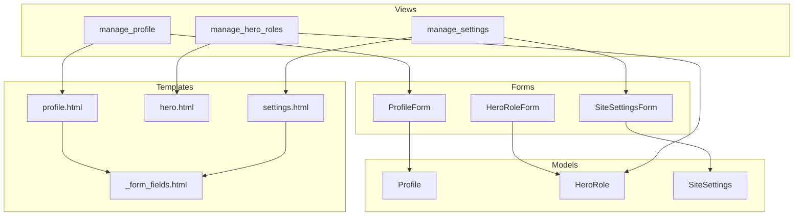
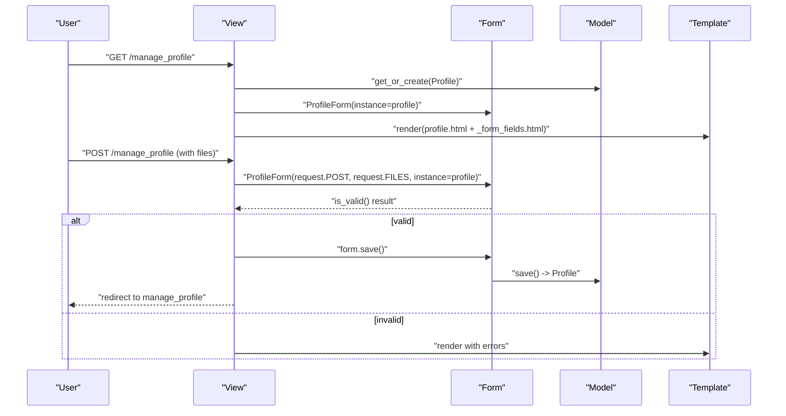
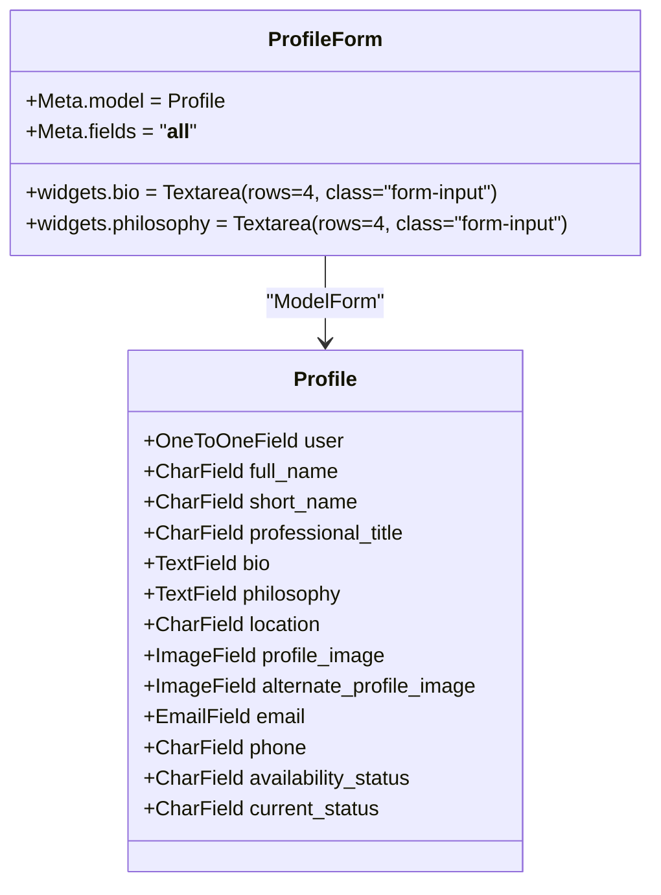
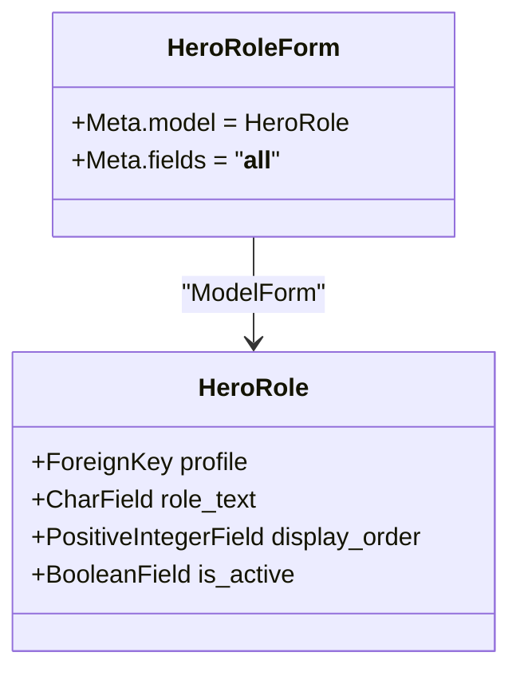
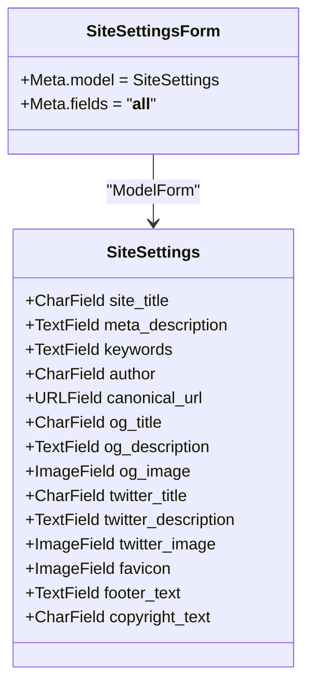
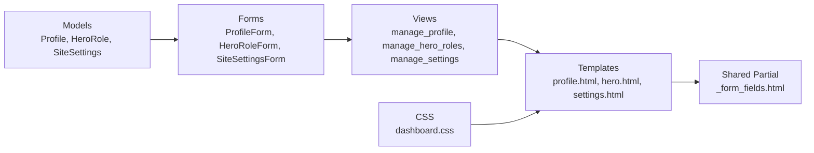

# Basic Forms

<cite>
**Referenced Files in This Document**
- [forms.py](file://portfolio/forms.py)
- [models.py](file://portfolio/models.py)
- [views.py](file://portfolio/views.py)
- [_form_fields.html](file://templates/dashboard/_form_fields.html)
- [profile.html](file://templates/dashboard/profile.html)
- [hero.html](file://templates/dashboard/hero.html)
- [settings.html](file://templates/dashboard/settings.html)
- [dashboard.css](file://static/dashboard.css)
</cite>

## Table of Contents
1. [Introduction](#introduction)
2. [Project Structure](#project-structure)
3. [Core Components](#core-components)
4. [Architecture Overview](#architecture-overview)
5. [Detailed Component Analysis](#detailed-component-analysis)
6. [Dependency Analysis](#dependency-analysis)
7. [Performance Considerations](#performance-considerations)
8. [Troubleshooting Guide](#troubleshooting-guide)
9. [Conclusion](#conclusion)

## Introduction
This document explains the basic Django forms used to manage user profile information, hero section roles, and global site settings in the portfolio system. It covers ModelForm inheritance patterns, field customization via widgets, form validation, data binding, error handling, and integration with views and templates. It also documents how each form maps to its corresponding model fields and how CSS classes are applied for consistent styling.

## Project Structure
The forms live in a dedicated module and are consumed by views that handle HTTP requests and render dashboard templates. Templates include a shared partial for rendering form fields consistently across pages.

**Diagram sources**
- [forms.py:4-21](file://portfolio/forms.py#L4-L21)
- [models.py:4-32](file://portfolio/models.py#L4-L32)
- [models.py:277-297](file://portfolio/models.py#L277-L297)
- [views.py:86-117](file://portfolio/views.py#L86-L117)
- [views.py:209-221](file://portfolio/views.py#L209-L221)
- [profile.html:23-33](file://templates/dashboard/profile.html#L23-L33)
- [hero.html:13-19](file://templates/dashboard/hero.html#L13-L19)
- [settings.html:17-27](file://templates/dashboard/settings.html#L17-L27)
- [_form_fields.html:1-25](file://templates/dashboard/_form_fields.html#L1-L25)

**Section sources**
- [forms.py:1-22](file://portfolio/forms.py#L1-L22)
- [models.py:4-32](file://portfolio/models.py#L4-L32)
- [models.py:277-297](file://portfolio/models.py#L277-L297)
- [views.py:86-117](file://portfolio/views.py#L86-L117)
- [views.py:209-221](file://portfolio/views.py#L209-L221)
- [profile.html:23-33](file://templates/dashboard/profile.html#L23-L33)
- [hero.html:13-19](file://templates/dashboard/hero.html#L13-L19)
- [settings.html:17-27](file://templates/dashboard/settings.html#L17-L27)
- [_form_fields.html:1-25](file://templates/dashboard/_form_fields.html#L1-L25)

## Core Components
- ProfileForm: A ModelForm bound to the Profile model. It customizes textarea widgets for bio and philosophy to include rows and a CSS class for styling.
- HeroRoleForm: A ModelForm bound to the HeroRole model. Used for role management (though the current view creates roles directly from POST data).
- SiteSettingsForm: A ModelForm bound to the SiteSettings model for global site configuration.

Key techniques demonstrated:
- ModelForm inheritance with Meta.model and Meta.fields = '__all__'
- Widget customization using forms.Textarea with attrs for rows and CSS classes
- Data binding via instance parameter when editing existing records
- Validation through is_valid() and saving via form.save()
- Error display via template helpers for non-field and field-level errors

**Section sources**
- [forms.py:4-21](file://portfolio/forms.py#L4-L21)
- [models.py:4-17](file://portfolio/models.py#L4-L17)
- [models.py:22-32](file://portfolio/models.py#L22-L32)
- [models.py:277-297](file://portfolio/models.py#L277-L297)

## Architecture Overview
The forms integrate with views that handle GET/POST cycles and render templates that use a shared field renderer. The flow ensures consistent UX and reliable persistence to the database.

**Diagram sources**
- [views.py:86-97](file://portfolio/views.py#L86-L97)
- [forms.py:4-11](file://portfolio/forms.py#L4-L11)
- [profile.html:23-33](file://templates/dashboard/profile.html#L23-L33)
- [_form_fields.html:1-25](file://templates/dashboard/_form_fields.html#L1-L25)

## Detailed Component Analysis

### ProfileForm
Purpose:
- Manage user profile information including bio and philosophy.
- Provide a rich text area experience with custom widget attributes.

Model mapping:
- Binds to Profile model fields via Meta.fields = '__all__'.
- Customized widgets:
  - bio: Textarea with rows and CSS class 'form-input'
  - philosophy: Textarea with rows and CSS class 'form-input'

Widget customization:
- Uses forms.Textarea(attrs={...}) to set HTML attributes such as rows and CSS classes.
- The CSS class 'form-input' can be styled globally; in this project, the dashboard theme applies consistent input styles via shared CSS.

Data binding and validation:
- In views, ProfileForm is instantiated with instance=profile for editing.
- On POST, it binds request.POST and request.FILES, validates via is_valid(), and saves on success.

Error handling:
- Non-field errors are displayed at the top of the form.
- Field-level errors are rendered per field by the shared template partial.

Integration points:
- View: manage_profile handles GET/POST cycles and redirects after successful save.
- Template: profile.html includes the shared field renderer and submit button.

**Diagram sources**
- [models.py:4-17](file://portfolio/models.py#L4-L17)
- [forms.py:4-11](file://portfolio/forms.py#L4-L11)

**Section sources**
- [forms.py:4-11](file://portfolio/forms.py#L4-L11)
- [models.py:4-17](file://portfolio/models.py#L4-L17)
- [views.py:86-97](file://portfolio/views.py#L86-L97)
- [profile.html:23-33](file://templates/dashboard/profile.html#L23-L33)
- [_form_fields.html:1-25](file://templates/dashboard/_form_fields.html#L1-L25)

### HeroRoleForm
Purpose:
- Represent HeroRole model data for potential CRUD operations.

Model mapping:
- Binds to HeroRole model fields via Meta.fields = '__all__'.

Current usage note:
- The manage_hero_roles view currently creates roles directly from POST data rather than using HeroRoleForm. The form exists for future or alternative usage where a standard ModelForm workflow is preferred.

Validation and behavior:
- Inherits all default validations from the HeroRole model fields (e.g., max length, required constraints).

Integration points:
- Available for reuse in generic CRUD flows or custom views if needed.

**Diagram sources**
- [models.py:22-32](file://portfolio/models.py#L22-L32)
- [forms.py:13-16](file://portfolio/forms.py#L13-L16)

**Section sources**
- [forms.py:13-16](file://portfolio/forms.py#L13-L16)
- [models.py:22-32](file://portfolio/models.py#L22-L32)
- [views.py:100-117](file://portfolio/views.py#L100-L117)
- [hero.html:13-19](file://templates/dashboard/hero.html#L13-L19)

### SiteSettingsForm
Purpose:
- Manage global site configuration such as SEO metadata, social media tags, and footer content.

Model mapping:
- Binds to SiteSettings model fields via Meta.fields = '__all__'.

Data binding and validation:
- In views, SiteSettingsForm is instantiated with instance=settings for editing.
- On POST, it binds request.POST and request.FILES, validates via is_valid(), and saves on success.

Error handling:
- Non-field errors are shown at the top of the settings page.
- Field-level errors are rendered per field by the shared template partial.

Integration points:
- View: manage_settings handles GET/POST cycles and redirects after successful save.
- Template: settings.html includes the shared field renderer and submit button.

**Diagram sources**
- [models.py:277-297](file://portfolio/models.py#L277-L297)
- [forms.py:18-21](file://portfolio/forms.py#L18-L21)

**Section sources**
- [forms.py:18-21](file://portfolio/forms.py#L18-L21)
- [models.py:277-297](file://portfolio/models.py#L277-L297)
- [views.py:209-221](file://portfolio/views.py#L209-L221)
- [settings.html:17-27](file://templates/dashboard/settings.html#L17-L27)
- [_form_fields.html:1-25](file://templates/dashboard/_form_fields.html#L1-L25)

## Dependency Analysis
- Forms depend on models for field definitions and validation rules.
- Views depend on forms to bind request data, validate, and persist changes.
- Templates depend on forms to render fields and errors consistently via a shared partial.
- CSS provides consistent styling for inputs and form groups.

**Diagram sources**
- [forms.py:1-22](file://portfolio/forms.py#L1-L22)
- [models.py:4-32](file://portfolio/models.py#L4-L32)
- [models.py:277-297](file://portfolio/models.py#L277-L297)
- [views.py:86-117](file://portfolio/views.py#L86-L117)
- [views.py:209-221](file://portfolio/views.py#L209-L221)
- [profile.html:23-33](file://templates/dashboard/profile.html#L23-L33)
- [hero.html:13-19](file://templates/dashboard/hero.html#L13-L19)
- [settings.html:17-27](file://templates/dashboard/settings.html#L17-L27)
- [_form_fields.html:1-25](file://templates/dashboard/_form_fields.html#L1-L25)
- [dashboard.css:482-514](file://static/dashboard.css#L482-L514)

**Section sources**
- [forms.py:1-22](file://portfolio/forms.py#L1-L22)
- [models.py:4-32](file://portfolio/models.py#L4-L32)
- [models.py:277-297](file://portfolio/models.py#L277-L297)
- [views.py:86-117](file://portfolio/views.py#L86-L117)
- [views.py:209-221](file://portfolio/views.py#L209-L221)
- [profile.html:23-33](file://templates/dashboard/profile.html#L23-L33)
- [hero.html:13-19](file://templates/dashboard/hero.html#L13-L19)
- [settings.html:17-27](file://templates/dashboard/settings.html#L17-L27)
- [_form_fields.html:1-25](file://templates/dashboard/_form_fields.html#L1-L25)
- [dashboard.css:482-514](file://static/dashboard.css#L482-L514)

## Performance Considerations
- Using ModelForm with fields = '__all__' keeps code concise but may expose more fields than necessary. If performance or security becomes a concern, explicitly list only required fields.
- File uploads (images, files) require proper handling in views and templates (enctype="multipart/form-data"), which is already present in the relevant templates.
- Avoid unnecessary queries in views; the current views fetch or create a single related object per request, which is efficient.

[No sources needed since this section provides general guidance]

## Troubleshooting Guide
Common issues and resolutions:
- Form not submitting files: Ensure the form tag includes enctype="multipart/form-data". Both profile and settings templates include this attribute.
- Validation errors not visible: The shared partial renders field-level errors with icons and messages. Check that the template includes the partial and that field names match model fields.
- Non-field errors: Displayed at the top of the form in profile and settings templates. Verify that the block for non_field_errors is present.
- Hero roles not appearing: The current view creates roles directly from POST data. Ensure role_text is provided and not empty. Errors are handled via messages.

**Section sources**
- [profile.html:16-21](file://templates/dashboard/profile.html#L16-L21)
- [settings.html:10-15](file://templates/dashboard/settings.html#L10-L15)
- [_form_fields.html:19-21](file://templates/dashboard/_form_fields.html#L19-L21)
- [views.py:100-117](file://portfolio/views.py#L100-L117)

## Conclusion
The portfolio’s basic forms leverage Django’s ModelForm to provide a clean, maintainable interface for managing profiles, hero roles, and site settings. Custom widgets enhance usability for long-form text fields, while consistent templates and CSS ensure a cohesive user experience. Views implement robust data binding, validation, and error handling, making the forms production-ready and easy to extend.

[No sources needed since this section summarizes without analyzing specific files]