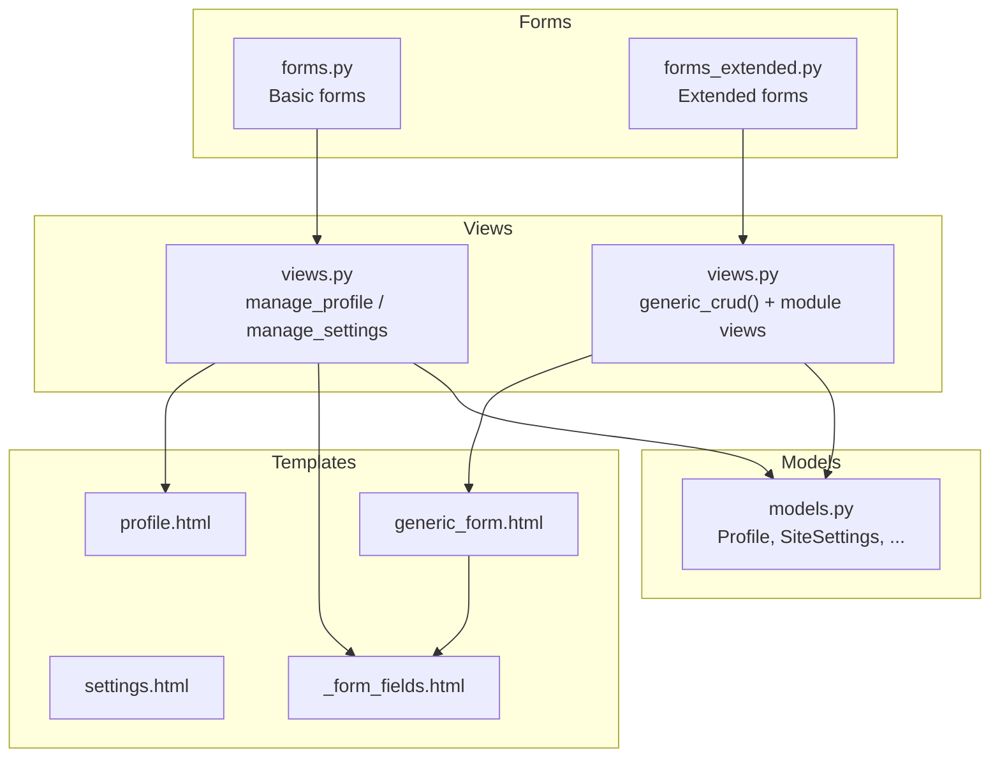
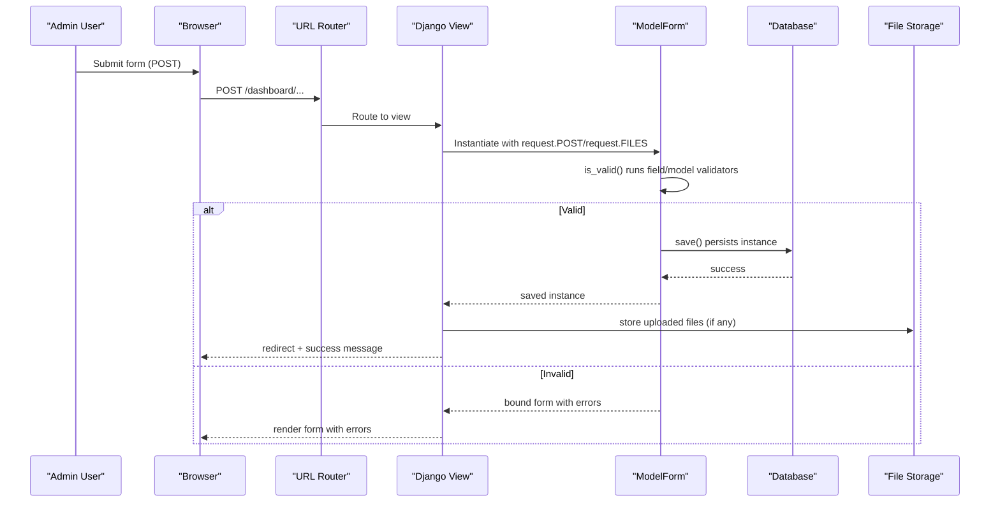
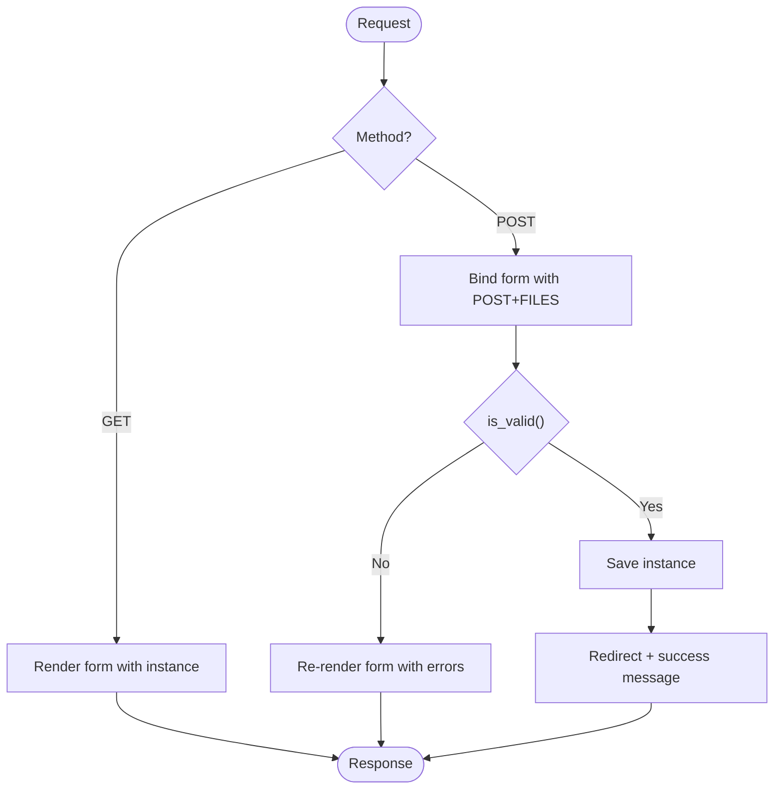
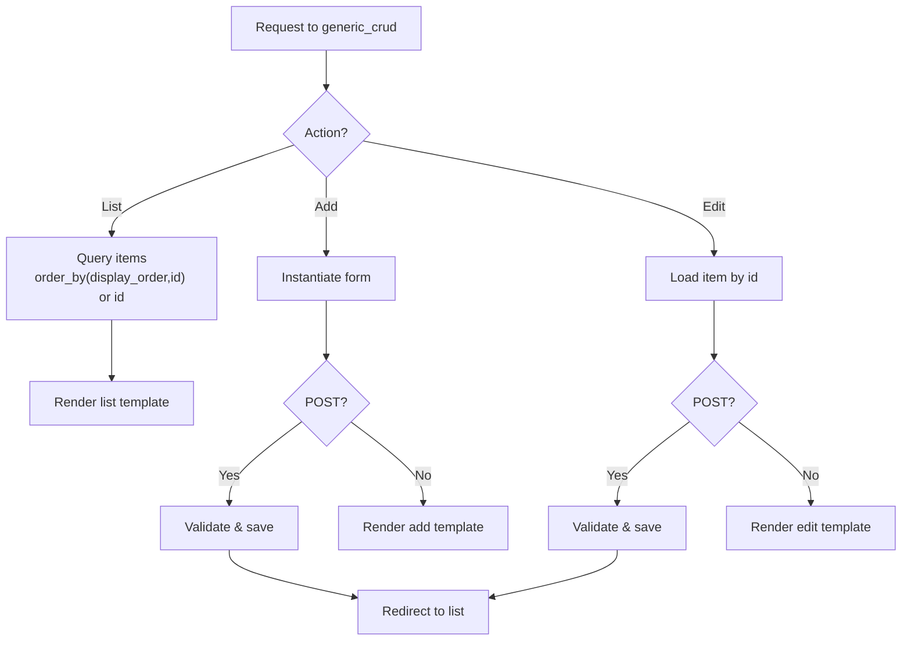
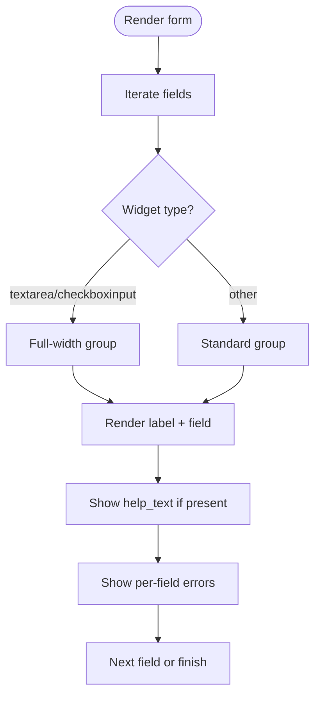
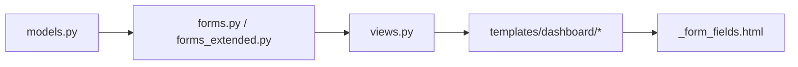

# Forms and Validation

<cite>
**Referenced Files in This Document**
- [forms.py](file://portfolio/forms.py)
- [forms_extended.py](file://portfolio/forms_extended.py)
- [views.py](file://portfolio/views.py)
- [models.py](file://portfolio/models.py)
- [urls.py](file://portfolio/urls.py)
- [generic_form.html](file://templates/dashboard/generic_form.html)
- [_form_fields.html](file://templates/dashboard/_form_fields.html)
- [profile.html](file://templates/dashboard/profile.html)
- [settings.html](file://templates/dashboard/settings.html)
- [settings.py](file://core/settings.py)
</cite>

## Table of Contents
1. [Introduction](#introduction)
2. [Project Structure](#project-structure)
3. [Core Components](#core-components)
4. [Architecture Overview](#architecture-overview)
5. [Detailed Component Analysis](#detailed-component-analysis)
6. [Dependency Analysis](#dependency-analysis)
7. [Performance Considerations](#performance-considerations)
8. [Troubleshooting Guide](#troubleshooting-guide)
9. [Security Considerations](#security-considerations)
10. [Conclusion](#conclusion)

## Introduction
This document explains the forms and validation system used by the portfolio application. It covers:
- Basic forms for profile and settings management
- Extended forms for complex content types with file uploads
- Custom validators and field customization
- Form processing workflow, validation rules, and error handling
- Integration with a generic CRUD system
- Security considerations including CSRF protection, input sanitization, and file upload validation

The goal is to help you create new forms, add custom validation logic, handle file uploads securely, and implement reusable form patterns across the dashboard.

## Project Structure
The forms layer is organized into two modules:
- Basic forms for core entities (Profile, HeroRole, SiteSettings)
- Extended forms for all other content models (Education, Experience, Skills, Projects, Certificates, etc.)

Views coordinate form rendering and persistence using Django’s ModelForm API and a generic CRUD helper that standardizes list/create/edit/delete flows. Templates render forms consistently with shared partials and include CSRF tokens and multipart encoding for file uploads.



**Diagram sources**
- [forms.py:1-22](file://portfolio/forms.py#L1-L22)
- [forms_extended.py:1-78](file://portfolio/forms_extended.py#L1-L78)
- [views.py:86-221](file://portfolio/views.py#L86-L221)
- [generic_form.html:1-63](file://templates/dashboard/generic_form.html#L1-L63)
- [_form_fields.html:1-25](file://templates/dashboard/_form_fields.html#L1-L25)
- [profile.html:1-37](file://templates/dashboard/profile.html#L1-L37)
- [settings.html:1-31](file://templates/dashboard/settings.html#L1-L31)
- [models.py:4-298](file://portfolio/models.py#L4-L298)

**Section sources**
- [forms.py:1-22](file://portfolio/forms.py#L1-L22)
- [forms_extended.py:1-78](file://portfolio/forms_extended.py#L1-L78)
- [views.py:86-221](file://portfolio/views.py#L86-L221)
- [generic_form.html:1-63](file://templates/dashboard/generic_form.html#L1-L63)
- [_form_fields.html:1-25](file://templates/dashboard/_form_fields.html#L1-L25)
- [profile.html:1-37](file://templates/dashboard/profile.html#L1-L37)
- [settings.html:1-31](file://templates/dashboard/settings.html#L1-L31)
- [models.py:4-298](file://portfolio/models.py#L4-L298)

## Core Components
- Basic forms: ProfileForm, HeroRoleForm, SiteSettingsForm
- Extended forms: StatisticForm, EducationForm, ExperienceForm, SkillCategoryForm, SkillForm, TechnologyForm, CertificateForm, WorkshopForm, ProjectCategoryForm, ProjectForm, AchievementForm, ServiceForm, ResumeForm, SocialLinkForm, SiteSettingsForm
- Views:
  - manage_profile: handles ProfileForm with file uploads
  - manage_settings: handles SiteSettingsForm with file uploads
  - generic_crud(): unified handler for list/add/edit/delete across many models
- Templates:
  - profile.html and settings.html: render basic forms with shared field partial
  - generic_form.html: renders extended forms via generic_crud
  - _form_fields.html: reusable field renderer with error display

Key responsibilities:
- Forms encapsulate model fields and optional widget customizations
- Views validate incoming data, persist changes, and show user feedback
- Templates provide consistent UI and error presentation

**Section sources**
- [forms.py:1-22](file://portfolio/forms.py#L1-L22)
- [forms_extended.py:1-78](file://portfolio/forms_extended.py#L1-L78)
- [views.py:86-221](file://portfolio/views.py#L86-L221)
- [generic_form.html:1-63](file://templates/dashboard/generic_form.html#L1-L63)
- [_form_fields.html:1-25](file://templates/dashboard/_form_fields.html#L1-L25)
- [profile.html:1-37](file://templates/dashboard/profile.html#L1-L37)
- [settings.html:1-31](file://templates/dashboard/settings.html#L1-L31)

## Architecture Overview
The forms architecture follows a layered pattern:
- Models define data schema and constraints
- Forms bind to models and customize widgets/validation
- Views orchestrate request/response lifecycle and integrate with messages
- Templates render forms and errors consistently



**Diagram sources**
- [views.py:86-221](file://portfolio/views.py#L86-L221)
- [forms.py:1-22](file://portfolio/forms.py#L1-L22)
- [forms_extended.py:1-78](file://portfolio/forms_extended.py#L1-L78)
- [models.py:4-298](file://portfolio/models.py#L4-L298)

## Detailed Component Analysis

### Basic Forms: Profile and Settings Management
- ProfileForm binds to Profile and customizes textarea widgets for bio and philosophy
- SiteSettingsForm binds to SiteSettings; manage_settings ensures a single settings row exists
- Both views accept file uploads and use Django’s messages framework for feedback

Processing highlights:
- GET: instantiate unbound form with existing instance
- POST: bind form with request.POST and request.FILES, validate, save on success



**Diagram sources**
- [views.py:86-97](file://portfolio/views.py#L86-L97)
- [views.py:209-221](file://portfolio/views.py#L209-L221)
- [forms.py:4-21](file://portfolio/forms.py#L4-L21)
- [profile.html:13-36](file://templates/dashboard/profile.html#L13-L36)
- [settings.html:7-30](file://templates/dashboard/settings.html#L7-L30)

**Section sources**
- [forms.py:4-21](file://portfolio/forms.py#L4-L21)
- [views.py:86-97](file://portfolio/views.py#L86-L97)
- [views.py:209-221](file://portfolio/views.py#L209-L221)
- [profile.html:13-36](file://templates/dashboard/profile.html#L13-L36)
- [settings.html:7-30](file://templates/dashboard/settings.html#L7-L30)

### Extended Forms: Complex Content Types with File Uploads
Extended forms cover education, experience, skills, projects, certificates, workshops, achievements, services, technologies, statistics, social links, and resumes. All are ModelForms bound to their respective models. Many models include ImageField or FileField, enabling file uploads through the same form pipeline.

Key points:
- Each form uses fields = '__all__' to expose all model fields
- Views reuse generic_crud to avoid duplication
- Templates render fields uniformly and show per-field errors

```mermaid
classDiagram
class StatisticForm
class EducationForm
class ExperienceForm
class SkillCategoryForm
class SkillForm
class TechnologyForm
class CertificateForm
class WorkshopForm
class ProjectCategoryForm
class ProjectForm
class AchievementForm
class ServiceForm
class ResumeForm
class SocialLinkForm
class SiteSettingsForm
StatisticForm --> "Statistic" : "binds to"
EducationForm --> "Education" : "binds to"
ExperienceForm --> "Experience" : "binds to"
SkillCategoryForm --> "SkillCategory" : "binds to"
SkillForm --> "Skill" : "binds to"
TechnologyForm --> "Technology" : "binds to"
CertificateForm --> "Certificate" : "binds to"
WorkshopForm --> "Workshop" : "binds to"
ProjectCategoryForm --> "ProjectCategory" : "binds to"
ProjectForm --> "Project" : "binds to"
AchievementForm --> "Achievement" : "binds to"
ServiceForm --> "Service" : "binds to"
ResumeForm --> "Resume" : "binds to"
SocialLinkForm --> "SocialLink" : "binds to"
SiteSettingsForm --> "SiteSettings" : "binds to"
```

**Diagram sources**
- [forms_extended.py:4-77](file://portfolio/forms_extended.py#L4-L77)
- [models.py:34-298](file://portfolio/models.py#L34-L298)

**Section sources**
- [forms_extended.py:1-78](file://portfolio/forms_extended.py#L1-L78)
- [models.py:34-298](file://portfolio/models.py#L34-L298)

### Generic CRUD System Integration
The generic_crud function centralizes list/add/edit/delete behavior for multiple models:
- List: returns ordered items based on presence of display_order
- Add/Edit: instantiates form, validates, saves, redirects on success
- Delete: handled by delete_item view with a model-to-url mapping



**Diagram sources**
- [views.py:127-180](file://portfolio/views.py#L127-L180)
- [views.py:184-207](file://portfolio/views.py#L184-L207)
- [generic_form.html:1-63](file://templates/dashboard/generic_form.html#L1-L63)

**Section sources**
- [views.py:127-180](file://portfolio/views.py#L127-L180)
- [views.py:184-207](file://portfolio/views.py#L184-L207)
- [generic_form.html:1-63](file://templates/dashboard/generic_form.html#L1-L63)

### Form Field Customization and Rendering
- Widget customization: ProfileForm sets rows and CSS classes for textareas
- Shared field renderer: _form_fields.html renders labels, help_text, and errors consistently
- Checkbox inputs receive special layout treatment
- Non-field errors are displayed at the top of forms



**Diagram sources**
- [forms.py:8-11](file://portfolio/forms.py#L8-L11)
- [_form_fields.html:1-25](file://templates/dashboard/_form_fields.html#L1-L25)
- [generic_form.html:24-49](file://templates/dashboard/generic_form.html#L24-L49)

**Section sources**
- [forms.py:8-11](file://portfolio/forms.py#L8-L11)
- [_form_fields.html:1-25](file://templates/dashboard/_form_fields.html#L1-L25)
- [generic_form.html:24-49](file://templates/dashboard/generic_form.html#L24-L49)

### Creating New Forms
To add a new form:
- Define a ModelForm subclass in the appropriate forms module (basic vs extended)
- Configure Meta.model and Meta.fields
- Optionally override widgets or add clean_* methods for custom validation
- Create a view that instantiates the form, calls is_valid(), and saves on success
- Wire URLs and templates to render the form

Examples of where to look:
- Basic form example: [forms.py:4-11](file://portfolio/forms.py#L4-L11)
- Extended form example: [forms_extended.py:49-52](file://portfolio/forms_extended.py#L49-L52)
- View integration: [views.py:86-97](file://portfolio/views.py#L86-L97), [views.py:209-221](file://portfolio/views.py#L209-L221)

**Section sources**
- [forms.py:4-11](file://portfolio/forms.py#L4-L11)
- [forms_extended.py:49-52](file://portfolio/forms_extended.py#L49-L52)
- [views.py:86-97](file://portfolio/views.py#L86-L97)
- [views.py:209-221](file://portfolio/views.py#L209-L221)

### Adding Custom Validation Logic
Use Django’s form-level and field-level validation:
- Field-level: add clean_<fieldname>(self) to enforce business rules
- Form-level: add clean(self) to validate cross-field dependencies
- Raise forms.ValidationError for invalid inputs

Where to extend:
- ProfileForm: add clean_email or clean_phone to enforce formats
- SiteSettingsForm: ensure canonical_url is valid when provided
- Any extended form: validate JSON fields or date ranges

References:
- Form base: [forms.py:4-21](file://portfolio/forms.py#L4-L21)
- Extended forms: [forms_extended.py:4-77](file://portfolio/forms_extended.py#L4-L77)

**Section sources**
- [forms.py:4-21](file://portfolio/forms.py#L4-L21)
- [forms_extended.py:4-77](file://portfolio/forms_extended.py#L4-L77)

### Handling File Uploads Securely
Files are handled via ImageField/FileField on models and passed through forms:
- Ensure forms are rendered with enctype="multipart/form-data"
- Pass request.FILES to form instantiation
- Store files under MEDIA_ROOT and serve via MEDIA_URL

Security checklist:
- Validate file type and size in form.clean_<field>() or view logic
- Restrict allowed extensions and MIME types
- Sanitize filenames and avoid executing uploaded content
- Serve media files behind a secure web server with proper permissions

References:
- File fields in models: [models.py:12-13](file://portfolio/models.py#L12-L13), [models.py:136-137](file://portfolio/models.py#L136-L137), [models.py:242-247](file://portfolio/models.py#L242-L247)
- Media configuration: [settings.py:87-89](file://core/settings.py#L87-L89), [settings.py:134-136](file://core/settings.py#L134-L136)
- Form rendering with multipart: [profile.html:23-26](file://templates/dashboard/profile.html#L23-L26), [settings.html:17-20](file://templates/dashboard/settings.html#L17-L20), [generic_form.html:24-26](file://templates/dashboard/generic_form.html#L24-L26)

**Section sources**
- [models.py:12-13](file://portfolio/models.py#L12-L13)
- [models.py:136-137](file://portfolio/models.py#L136-L137)
- [models.py:242-247](file://portfolio/models.py#L242-L247)
- [settings.py:87-89](file://core/settings.py#L87-L89)
- [settings.py:134-136](file://core/settings.py#L134-L136)
- [profile.html:23-26](file://templates/dashboard/profile.html#L23-L26)
- [settings.html:17-20](file://templates/dashboard/settings.html#L17-L20)
- [generic_form.html:24-26](file://templates/dashboard/generic_form.html#L24-L26)

### Implementing Form Reusability Patterns
- Use shared partial _form_fields.html to render fields consistently
- Leverage generic_crud to reduce duplication across modules
- Centralize common widget customizations in base form classes if needed

References:
- Shared partial usage: [profile.html:26](file://templates/dashboard/profile.html#L26), [settings.html:20](file://templates/dashboard/settings.html#L20), [generic_form.html:27-49](file://templates/dashboard/generic_form.html#L27-L49)
- Generic CRUD: [views.py:127-180](file://portfolio/views.py#L127-L180)

**Section sources**
- [_form_fields.html:1-25](file://templates/dashboard/_form_fields.html#L1-L25)
- [profile.html:26](file://templates/dashboard/profile.html#L26)
- [settings.html:20](file://templates/dashboard/settings.html#L20)
- [generic_form.html:27-49](file://templates/dashboard/generic_form.html#L27-L49)
- [views.py:127-180](file://portfolio/views.py#L127-L180)

## Dependency Analysis
Forms depend on models for field definitions and validation. Views depend on both forms and models to process requests. Templates depend on forms for rendering and on shared partials for consistency.



**Diagram sources**
- [models.py:4-298](file://portfolio/models.py#L4-L298)
- [forms.py:1-22](file://portfolio/forms.py#L1-L22)
- [forms_extended.py:1-78](file://portfolio/forms_extended.py#L1-L78)
- [views.py:86-221](file://portfolio/views.py#L86-L221)
- [_form_fields.html:1-25](file://templates/dashboard/_form_fields.html#L1-L25)

**Section sources**
- [models.py:4-298](file://portfolio/models.py#L4-L298)
- [forms.py:1-22](file://portfolio/forms.py#L1-L22)
- [forms_extended.py:1-78](file://portfolio/forms_extended.py#L1-L78)
- [views.py:86-221](file://portfolio/views.py#L86-L221)
- [_form_fields.html:1-25](file://templates/dashboard/_form_fields.html#L1-L25)

## Performance Considerations
- Use select_related/prefetch_related in read-heavy views to reduce queries (already applied in some API endpoints)
- Avoid heavy computations in form.is_valid(); move expensive checks to background tasks if necessary
- Limit file sizes and compress images on upload to reduce storage and bandwidth costs
- Cache frequently accessed settings and profile data if needed

[No sources needed since this section provides general guidance]

## Troubleshooting Guide
Common issues and resolutions:
- Form not saving files: ensure form is rendered with enctype="multipart/form-data" and request.FILES is passed to form instantiation
- CSRF errors: ensure  is present in forms and CsrfViewMiddleware is enabled
- Validation errors not shown: verify templates iterate over field.errors and non_field_errors
- Unexpected ordering: check whether models have display_order and generic_crud detects it correctly

Checklist:
- Verify form binding: [views.py:88-91](file://portfolio/views.py#L88-L91), [views.py:163-167](file://portfolio/views.py#L163-L167)
- Verify template rendering: [generic_form.html:24-49](file://templates/dashboard/generic_form.html#L24-L49), [_form_fields.html:1-25](file://templates/dashboard/_form_fields.html#L1-L25)
- Verify middleware: [settings.py:45-53](file://core/settings.py#L45-L53)

**Section sources**
- [views.py:88-91](file://portfolio/views.py#L88-L91)
- [views.py:163-167](file://portfolio/views.py#L163-L167)
- [generic_form.html:24-49](file://templates/dashboard/generic_form.html#L24-L49)
- [_form_fields.html:1-25](file://templates/dashboard/_form_fields.html#L1-L25)
- [settings.py:45-53](file://core/settings.py#L45-L53)

## Security Considerations
- CSRF protection:
  - Enabled via CsrfViewMiddleware
  - Forms must include 
- Input sanitization:
  - Rely on Django’s built-in validators for EmailField, URLField, CharField max_length
  - Add custom clean_* methods to enforce stricter rules
- File upload validation:
  - Validate file type, size, and content before saving
  - Restrict allowed extensions and sanitize filenames
  - Serve media files securely with proper server configuration
- Authentication and authorization:
  - Dashboard views are protected with @login_required
  - Ensure only authorized users can access admin routes

References:
- Middleware: [settings.py:45-53](file://core/settings.py#L45-L53)
- CSRF token in templates: [profile.html:24](file://templates/dashboard/profile.html#L24), [settings.html:18](file://templates/dashboard/settings.html#L18), [generic_form.html:25](file://templates/dashboard/generic_form.html#L25)
- Protected views: [views.py:58-83](file://portfolio/views.py#L58-L83), [views.py:184-207](file://portfolio/views.py#L184-L207)

**Section sources**
- [settings.py:45-53](file://core/settings.py#L45-L53)
- [profile.html:24](file://templates/dashboard/profile.html#L24)
- [settings.html:18](file://templates/dashboard/settings.html#L18)
- [generic_form.html:25](file://templates/dashboard/generic_form.html#L25)
- [views.py:58-83](file://portfolio/views.py#L58-L83)
- [views.py:184-207](file://portfolio/views.py#L184-L207)

## Conclusion
The forms and validation system leverages Django’s ModelForm API and a generic CRUD helper to provide a consistent, secure, and maintainable way to manage portfolio content. By following the patterns outlined here—using shared templates, adding custom validators, validating file uploads, and protecting routes—you can extend the system safely and efficiently.

[No sources needed since this section summarizes without analyzing specific files]