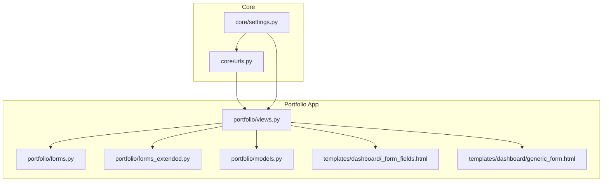
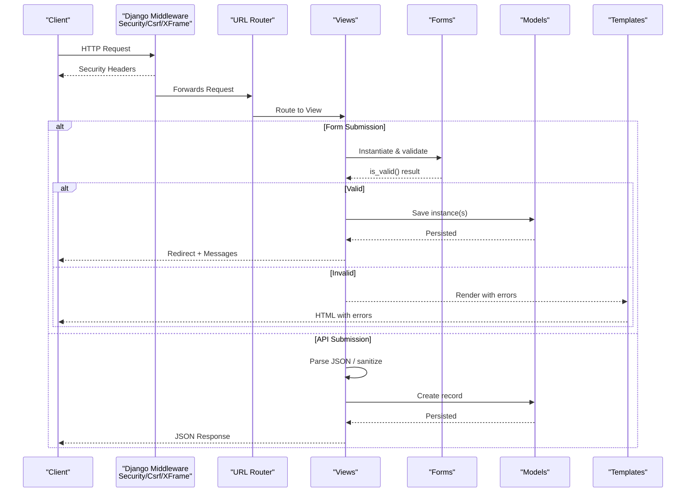
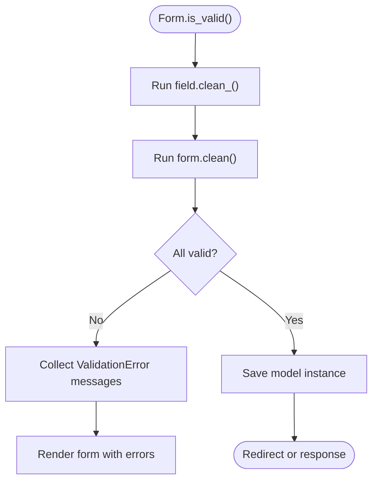
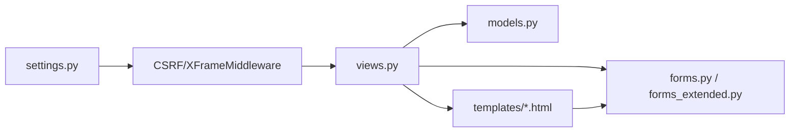
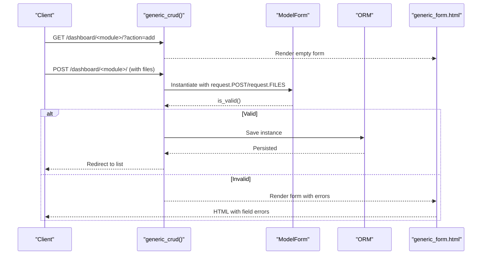

# Validation and Security

<cite>
**Referenced Files in This Document**
- [settings.py](file://core/settings.py)
- [urls.py](file://core/urls.py)
- [forms.py](file://portfolio/forms.py)
- [forms_extended.py](file://portfolio/forms_extended.py)
- [models.py](file://portfolio/models.py)
- [views.py](file://portfolio/views.py)
- [_form_fields.html](file://templates/dashboard/_form_fields.html)
- [generic_form.html](file://templates/dashboard/generic_form.html)
</cite>

## Table of Contents
1. Introduction
2. Project Structure
3. Core Components
4. Architecture Overview
5. Detailed Component Analysis
6. Dependency Analysis
7. Performance Considerations
8. Troubleshooting Guide
9. Conclusion
10. Appendices

## Introduction
This document explains how form validation and security are implemented across the project, focusing on Django’s built-in validation mechanisms, custom validators for business rules, input sanitization techniques, CSRF protection, file upload security, and secure storage practices. It also provides guidance on securing form submissions against common attacks such as XSS and injection, along with best practices for field sanitization, data integrity checks, and security headers configuration.

## Project Structure
The application is a Django project with:
- A core settings module that configures middleware (including CSRF and clickjacking protection), password validators, and media/static file handling.
- A portfolio app containing models, forms, views, and templates used to manage content and expose APIs.
- Templates that render forms with error display and include CSRF tokens for POST requests.

**Diagram sources**
- [settings.py:45-53](file://core/settings.py#L45-L53)
- [urls.py:22-28](file://core/urls.py#L22-L28)
- [forms.py:1-22](file://portfolio/forms.py#L1-L22)
- [forms_extended.py:1-78](file://portfolio/forms_extended.py#L1-L78)
- [models.py:1-298](file://portfolio/models.py#L1-L298)
- [views.py:1-458](file://portfolio/views.py#L1-L458)
- [_form_fields.html:1-25](file://templates/dashboard/_form_fields.html#L1-L25)
- [generic_form.html:1-63](file://templates/dashboard/generic_form.html#L1-L63)

**Section sources**
- [settings.py:45-53](file://core/settings.py#L45-L53)
- [urls.py:22-28](file://core/urls.py#L22-L28)

## Core Components
- Forms: Model-based forms for profile, hero roles, site settings, and many other entities. They rely on Django’s form system for validation and widget rendering.
- Models: Define fields, constraints, and relationships; they provide type-level validation and database integrity.
- Views: Handle HTTP requests, process forms, enforce authentication, and return responses or redirects.
- Templates: Render forms with CSRF tokens and display validation errors consistently.

Key responsibilities:
- Input validation via forms and model fields.
- CSRF protection via middleware and template tokens.
- File upload handling through ImageField/FileField and Media configuration.
- Error presentation using Django messages and template error blocks.

**Section sources**
- [forms.py:1-22](file://portfolio/forms.py#L1-L22)
- [forms_extended.py:1-78](file://portfolio/forms_extended.py#L1-L78)
- [models.py:1-298](file://portfolio/models.py#L1-L298)
- [views.py:85-221](file://portfolio/views.py#L85-L221)
- [generic_form.html:24-26](file://templates/dashboard/generic_form.html#L24-L26)
- [_form_fields.html:19-21](file://templates/dashboard/_form_fields.html#L19-L21)

## Architecture Overview
The request flow for form submission and API endpoints involves:
- Client submits a form or JSON payload.
- Django middleware enforces CSRF and security headers.
- View validates form data or parses JSON, persists data via models, and returns success/error responses.
- Templates render forms with CSRF tokens and display validation errors.

**Diagram sources**
- [settings.py:45-53](file://core/settings.py#L45-L53)
- [urls.py:22-28](file://core/urls.py#L22-L28)
- [views.py:127-180](file://portfolio/views.py#L127-L180)
- [views.py:300-322](file://portfolio/views.py#L300-L322)
- [generic_form.html:24-26](file://templates/dashboard/generic_form.html#L24-L26)

## Detailed Component Analysis

### Django Built-in Validation Mechanisms
- Model-level validation:
  - Field types and constraints (e.g., EmailField, URLField, CharField with max_length, PositiveIntegerField).
  - Relationships enforced by ForeignKey and OneToOneField.
  - Unique constraints via unique=True on slug fields.
- Form-level validation:
  - ModelForms automatically validate against model fields.
  - Custom clean_<field>() methods can be added to enforce business rules.
  - Non-field errors can be raised for cross-field validation.
- Password validation:
  - AUTH_PASSWORD_VALIDATORS configured to enforce similarity, minimum length, common passwords, and numeric-only restrictions.

Examples of where these apply:
- Profile, Education, Experience, Project, Certificate, Workshop, Achievement, Service, Resume, SocialLink, SiteSettings, ContactMessage all use typed fields and constraints.
- Forms for these models inherit validation from their underlying models.

**Section sources**
- [models.py:4-298](file://portfolio/models.py#L4-L298)
- [forms.py:4-22](file://portfolio/forms.py#L4-L22)
- [forms_extended.py:4-78](file://portfolio/forms_extended.py#L4-L78)
- [settings.py:96-112](file://core/settings.py#L96-L112)

### Custom Validators for Business Rules
Recommended patterns to implement in forms:
- Add clean_<field>() to enforce domain-specific rules (e.g., date ranges, allowed values, cross-field consistency).
- Raise forms.ValidationError with clear messages.
- Use full_clean() when saving instances outside forms to ensure model-level validation runs.

Where to add them:
- In each ModelForm subclass under forms.py and forms_extended.py.
- Optionally in model save() methods for complex logic not tied to a single field.

Validation flow example:

[No diagram sources needed since this diagram shows conceptual workflow, not actual code structure]

**Section sources**
- [forms.py:4-22](file://portfolio/forms.py#L4-L22)
- [forms_extended.py:4-78](file://portfolio/forms_extended.py#L4-L78)

### Input Sanitization Techniques
- Use Django’s form fields to sanitize and validate inputs:
  - EmailField ensures email format.
  - URLField validates URLs.
  - CharField with max_length limits string size.
  - JSONField stores structured data safely when validated by the form/model.
- Avoid raw request data usage without validation:
  - In contact_api, parse JSON and extract only expected keys before creating records.
- Escape output in templates:
  - Django templates autoescape by default; avoid marking user content safe unless explicitly trusted.

Where applied:
- Contact message creation via JSON parsing and direct field assignment.
- All ModelForms rely on field-level sanitization.

**Section sources**
- [views.py:300-322](file://portfolio/views.py#L300-L322)
- [models.py:265-275](file://portfolio/models.py#L265-L275)
- [generic_form.html:24-26](file://templates/dashboard/generic_form.html#L24-L26)

### CSRF Protection Implementation
- Middleware: CsrfViewMiddleware is enabled in settings, enforcing CSRF checks on state-changing requests.
- Templates: Forms include , ensuring POST requests carry the token.
- Exceptions: The contact_api endpoint uses @csrf_exempt to allow frontend AJAX submissions without CSRF; this should be reviewed and secured if exposed publicly.

Recommendations:
- Prefer using CSRF-protected views for sensitive operations.
- If exposing public APIs, consider alternative protections (rate limiting, origin checks, signed tokens).

**Section sources**
- [settings.py:45-53](file://core/settings.py#L45-L53)
- [generic_form.html:24-26](file://templates/dashboard/generic_form.html#L24-L26)
- [views.py:297-322](file://portfolio/views.py#L297-L322)

### File Upload Security
Current implementation:
- Models use ImageField and FileField with upload_to paths under MEDIA_ROOT.
- Settings configure MEDIA_URL and MEDIA_ROOT for serving uploads during development.
- Views accept request.FILES and pass them into forms for persistence.

Security considerations:
- Type validation:
  - ImageField restricts to images at the form/model level.
  - For general files (FileField), add explicit extension and MIME-type checks in forms or views.
- Size limits:
  - Configure server-side limits (e.g., client_max_body_size in web server) and enforce within Django (request.META['CONTENT_LENGTH'] or form.cleaned_data checks).
- Malware scanning:
  - Integrate an antivirus scanner (e.g., ClamAV) on uploaded files before storing or serving.
- Secure storage:
  - Store uploads outside the web root or use object storage (e.g., S3) with restricted access policies.
  - Serve files via a controlled view that verifies permissions rather than exposing MEDIA_ROOT directly in production.

Best practices:
- Validate file extensions and magic bytes.
- Rename files to prevent path traversal and collisions.
- Limit concurrent uploads and scan asynchronously.
- Set appropriate Content-Type and Content-Disposition headers when serving files.

**Section sources**
- [models.py:12-13](file://portfolio/models.py#L12-L13)
- [models.py:58-59](file://portfolio/models.py#L58-L59)
- [models.py:80-81](file://portfolio/models.py#L80-L81)
- [models.py:119-120](file://portfolio/models.py#L119-L120)
- [models.py:136-137](file://portfolio/models.py#L136-L137)
- [models.py:155-156](file://portfolio/models.py#L155-L156)
- [models.py:190-191](file://portfolio/models.py#L190-L191)
- [models.py:205-206](file://portfolio/models.py#L205-L206)
- [models.py:213-214](file://portfolio/models.py#L213-L214)
- [models.py:232-233](file://portfolio/models.py#L232-L233)
- [models.py:243-244](file://portfolio/models.py#L243-L244)
- [settings.py:87-94](file://core/settings.py#L87-L94)
- [settings.py:134-136](file://core/settings.py#L134-L136)
- [urls.py:27-28](file://core/urls.py#L27-L28)
- [views.py:88-97](file://portfolio/views.py#L88-L97)
- [views.py:143-157](file://portfolio/views.py#L143-L157)
- [views.py:163-178](file://portfolio/views.py#L163-L178)
- [views.py:213-221](file://portfolio/views.py#L213-L221)

### Securing Form Submissions Against Common Attacks
- XSS prevention:
  - Rely on Django’s template autoescaping.
  - Avoid marking user-provided content safe unless necessary.
  - Validate and sanitize inputs at the form/model layer.
- Injection prevention:
  - Use parameterized queries via Django ORM (default behavior).
  - Avoid raw SQL; if required, use proper escaping and validation.
- CSRF mitigation:
  - Ensure CSRF tokens are present in forms.
  - Review any @csrf_exempt endpoints and protect them with additional controls.
- Rate limiting and abuse prevention:
  - Implement rate limiting on public endpoints (e.g., contact_api) to mitigate spam and brute force attempts.

Where relevant:
- Templates render forms with CSRF tokens and display errors.
- Views handle form submissions securely and redirect on success.

**Section sources**
- [generic_form.html:24-26](file://templates/dashboard/generic_form.html#L24-L26)
- [views.py:300-322](file://portfolio/views.py#L300-L322)
- [settings.py:45-53](file://core/settings.py#L45-L53)

### Best Practices for Form Field Sanitization and Data Integrity
- Field-level validation:
  - Use appropriate field types (EmailField, URLField, CharField with max_length).
  - Enforce uniqueness via unique=True where applicable.
- Cross-field validation:
  - Implement clean() in forms to validate relationships between fields.
- Data integrity:
  - Use model constraints and database-level validations.
  - Validate dates and numeric ranges in forms.
- Output encoding:
  - Trust no user input; always escape in templates unless explicitly sanitized.

**Section sources**
- [models.py:4-298](file://portfolio/models.py#L4-L298)
- [forms.py:4-22](file://portfolio/forms.py#L4-L22)
- [forms_extended.py:4-78](file://portfolio/forms_extended.py#L4-L78)

### Security Headers Configuration
- Clickjacking protection:
  - XFrameOptionsMiddleware is enabled, setting appropriate headers to prevent framing.
- Additional headers:
  - Consider adding HSTS, Content-Security-Policy, Referrer-Policy, and Permissions-Policy via middleware or reverse proxy.

Where configured:
- Middleware list includes SecurityMiddleware and XFrameOptionsMiddleware.

**Section sources**
- [settings.py:45-53](file://core/settings.py#L45-L53)

## Dependency Analysis
High-level dependencies among components:
- Views depend on forms and models for validation and persistence.
- Templates depend on forms for rendering and error display.
- Settings influence middleware behavior and file serving.

**Diagram sources**
- [settings.py:45-53](file://core/settings.py#L45-L53)
- [views.py:127-180](file://portfolio/views.py#L127-L180)
- [forms.py:1-22](file://portfolio/forms.py#L1-L22)
- [forms_extended.py:1-78](file://portfolio/forms_extended.py#L1-L78)
- [models.py:1-298](file://portfolio/models.py#L1-L298)
- [generic_form.html:1-63](file://templates/dashboard/generic_form.html#L1-L63)

**Section sources**
- [settings.py:45-53](file://core/settings.py#L45-L53)
- [views.py:127-180](file://portfolio/views.py#L127-L180)

## Performance Considerations
- Use select_related and prefetch_related for related queries to reduce N+1 issues.
- Keep form validation minimal and efficient; defer heavy computations to background tasks.
- Cache static assets and media appropriately in production.
- Limit file upload sizes to reduce memory pressure and processing time.

[No sources needed since this section provides general guidance]

## Troubleshooting Guide
Common issues and resolutions:
- CSRF errors on POST:
  - Ensure forms include .
  - Verify CsrfViewMiddleware is enabled.
- Validation errors not displayed:
  - Confirm templates iterate over form.errors and non_field_errors.
- File upload failures:
  - Check MEDIA_ROOT permissions and disk space.
  - Validate file types and sizes in forms.
- Public API abuse:
  - Add rate limiting and origin validation to contact_api.
  - Consider requiring CSRF or token-based auth for sensitive endpoints.

**Section sources**
- [generic_form.html:17-21](file://templates/dashboard/generic_form.html#L17-L21)
- [generic_form.html:24-26](file://templates/dashboard/generic_form.html#L24-L26)
- [views.py:300-322](file://portfolio/views.py#L300-L322)
- [settings.py:87-94](file://core/settings.py#L87-L94)

## Conclusion
The project leverages Django’s robust validation framework and middleware to secure forms and APIs. While foundational protections like CSRF and clickjacking are in place, additional measures such as explicit file type and size validation, malware scanning, and hardened API endpoints are recommended to enhance security posture. Templates consistently render errors and include CSRF tokens, supporting a consistent user experience and safer submissions.

[No sources needed since this section summarizes without analyzing specific files]

## Appendices

### Example: Generic CRUD Flow with Validation and Errors

**Diagram sources**
- [views.py:127-180](file://portfolio/views.py#L127-L180)
- [generic_form.html:17-21](file://templates/dashboard/generic_form.html#L17-L21)
- [generic_form.html:24-26](file://templates/dashboard/generic_form.html#L24-L26)