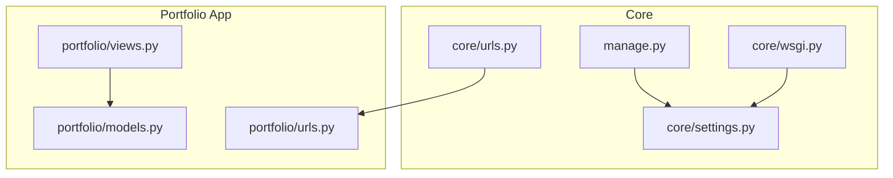
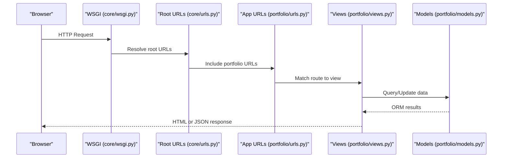
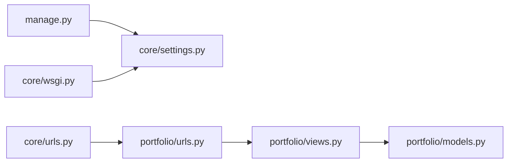

# Getting Started

<cite>
**Referenced Files in This Document**
- [manage.py](file://manage.py)
- [settings.py](file://core/settings.py)
- [urls.py](file://core/urls.py)
- [wsgi.py](file://core/wsgi.py)
- [models.py](file://portfolio/models.py)
- [views.py](file://portfolio/views.py)
- [urls.py](file://portfolio/urls.py)
</cite>

## Table of Contents
1. Introduction
2. Project Structure
3. Core Components
4. Architecture Overview
5. Detailed Component Analysis
6. Dependency Analysis
7. Performance Considerations
8. Troubleshooting Guide
9. Conclusion

## Introduction
This guide helps you set up and run the Portfolio CMS locally. You will install Python dependencies, initialize the SQLite database, start the development server, create an admin account, and verify that everything works. The instructions are beginner-friendly but include enough technical detail for experienced developers.

## Project Structure
The project is a Django application with:
- A core project package (settings, URLs, WSGI)
- A portfolio app (models, views, URLs)
- Static assets and templates for the dashboard
- Media directories for uploads

**Diagram sources**
- [manage.py:7-18](file://manage.py#L7-L18)
- [settings.py:19-42](file://core/settings.py#L19-L42)
- [urls.py:17-25](file://core/urls.py#L17-L25)
- [wsgi.py:10-16](file://core/wsgi.py#L10-L16)
- [models.py:1-20](file://portfolio/models.py#L1-L20)
- [views.py:1-18](file://portfolio/views.py#L1-L18)
- [urls.py:1-10](file://portfolio/urls.py#L1-L10)

**Section sources**
- [manage.py:7-18](file://manage.py#L7-L18)
- [settings.py:19-42](file://core/settings.py#L19-L42)
- [urls.py:17-25](file://core/urls.py#L17-L25)
- [wsgi.py:10-16](file://core/wsgi.py#L10-L16)
- [models.py:1-20](file://portfolio/models.py#L1-L20)
- [views.py:1-18](file://portfolio/views.py#L1-L18)
- [urls.py:1-10](file://portfolio/urls.py#L1-L10)

## Core Components
- manage.py: Entry point for Django management commands. It sets DJANGO_SETTINGS_MODULE to core.settings and runs command-line utilities.
- core/settings.py: Central configuration for apps, middleware, templates, database (SQLite), static/media paths, security settings, and environment variables via dotenv.
- core/urls.py: Root URL router that includes the portfolio app and Django admin.
- portfolio/models.py: Data models for profile, education, experience, skills, projects, certificates, workshops, achievements, services, technologies, statistics, social links, resume files, contact messages, and site settings.
- portfolio/views.py: Public and authenticated views for the portfolio front page, dashboard CRUD modules, message inbox, and JSON APIs.
- portfolio/urls.py: URL patterns mapping routes to views for public pages, dashboard, and API endpoints.

Key responsibilities:
- Settings define the runtime environment, including DEBUG mode, allowed hosts, installed apps, and SQLite database path.
- URL routing connects requests to views.
- Views handle request logic, interact with models, and render templates or return JSON.
- Models define the data schema and relationships.

**Section sources**
- [manage.py:7-18](file://manage.py#L7-L18)
- [settings.py:22-42](file://core/settings.py#L22-L42)
- [settings.py:77-94](file://core/settings.py#L77-L94)
- [urls.py:17-25](file://core/urls.py#L17-L25)
- [models.py:1-20](file://portfolio/models.py#L1-L20)
- [views.py:21-26](file://portfolio/views.py#L21-L26)
- [urls.py:1-10](file://portfolio/urls.py#L1-L10)

## Architecture Overview
At a high level:
- Requests enter through Django’s WSGI entry point.
- core/urls.py dispatches to either Django admin or the portfolio app.
- portfolio/urls.py maps routes to views in portfolio/views.py.
- Views read/write data using models defined in portfolio/models.py.
- Static and media files are served according to settings.

**Diagram sources**
- [wsgi.py:10-16](file://core/wsgi.py#L10-L16)
- [urls.py:17-25](file://core/urls.py#L17-L25)
- [urls.py:1-10](file://portfolio/urls.py#L1-L10)
- [views.py:21-26](file://portfolio/views.py#L21-L26)
- [models.py:1-20](file://portfolio/models.py#L1-L20)

## Detailed Component Analysis

### Installation Requirements
- Python: Use a modern Python version compatible with Django 5.x.
- System dependencies:
  - Pillow is required for image handling used by many models (e.g., Profile, Education, Experience, Projects).
  - Ensure your system has C compiler toolchains if building wheels on your platform.
- Virtual environment: Create an isolated environment to avoid conflicts.

Verification steps:
- Confirm Python version.
- Confirm pip is available.
- Confirm Pillow can be installed successfully.

**Section sources**
- [settings.py:13-17](file://core/settings.py#L13-L17)
- [models.py:12-13](file://portfolio/models.py#L12-L13)
- [models.py:58-59](file://portfolio/models.py#L58-L59)
- [models.py:80-81](file://portfolio/models.py#L80-L81)
- [models.py:190-191](file://portfolio/models.py#L190-L191)

### Environment Setup
Steps:
1. Create and activate a virtual environment.
2. Install dependencies using pip.
3. Initialize the SQLite database.
4. Create a superuser for admin access.
5. Start the development server.

Details:
- Database: SQLite is configured by default; migrations will create db.sqlite3.
- Admin: Use Django’s built-in admin at /admin/.
- Development server: Run from the project root.

Notes:
- If you use environment variables (SECRET_KEY, DEBUG, ALLOWED_HOSTS), ensure they are present or rely on defaults in settings.

**Section sources**
- [settings.py:24-30](file://core/settings.py#L24-L30)
- [settings.py:77-85](file://core/settings.py#L77-L85)
- [urls.py:17-25](file://core/urls.py#L17-L25)

### Running the Development Server
After setup:
- Start the server from the project root.
- Open http://127.0.0.1:8000/ in your browser.
- Access the dashboard via the provided login flow or Django admin.

What happens under the hood:
- manage.py invokes Django’s command runner.
- core/wsgi.py loads settings and creates the WSGI application.
- core/urls.py routes to the portfolio app and admin.

**Section sources**
- [manage.py:7-18](file://manage.py#L7-L18)
- [wsgi.py:10-16](file://core/wsgi.py#L10-L16)
- [urls.py:17-25](file://core/urls.py#L17-L25)

### Creating a Superuser and Initial Configuration
- Create a superuser to access Django admin (/admin/).
- Configure initial content:
  - Add a Profile record to populate personal information.
  - Add Education, Experience, Skills, Projects, Certificates, Workshops, Achievements, Services, Technologies, Statistics, Social Links, and Resume files as needed.
  - Update Site Settings for SEO and branding.

Why this matters:
- Many views and the portfolio API depend on these records being present.

**Section sources**
- [models.py:4-20](file://portfolio/models.py#L4-L20)
- [models.py:49-68](file://portfolio/models.py#L49-L68)
- [models.py:70-89](file://portfolio/models.py#L70-L89)
- [models.py:102-115](file://portfolio/models.py#L102-L115)
- [models.py:179-201](file://portfolio/models.py#L179-L201)
- [models.py:277-297](file://portfolio/models.py#L277-L297)

### Verifying Installation
Checklist:
- Database file exists after running migrations.
- Django admin loads at /admin/.
- Home page loads at /.
- Dashboard login works and redirects to dashboard after authentication.
- Portfolio API returns JSON when data is configured.

Expected behaviors:
- Static and media files are served during development when DEBUG is enabled.
- Image fields require valid images; otherwise, validation errors will occur.

**Section sources**
- [settings.py:27-30](file://core/settings.py#L27-L30)
- [settings.py:87-94](file://core/settings.py#L87-L94)
- [urls.py:27-29](file://core/urls.py#L27-L29)
- [views.py:21-26](file://portfolio/views.py#L21-L26)

## Dependency Analysis
High-level dependency map:
- manage.py depends on Django and core.settings.
- core/urls.py includes portfolio.urls and Django admin.
- portfolio.views imports models and forms.
- portfolio.models uses Django ORM and Pillow for images.
- core/wsgi.py initializes the WSGI application with settings.

**Diagram sources**
- [manage.py:7-18](file://manage.py#L7-L18)
- [settings.py:19-42](file://core/settings.py#L19-L42)
- [urls.py:17-25](file://core/urls.py#L17-L25)
- [urls.py:1-10](file://portfolio/urls.py#L1-L10)
- [views.py:1-18](file://portfolio/views.py#L1-L18)
- [models.py:1-20](file://portfolio/models.py#L1-L20)
- [wsgi.py:10-16](file://core/wsgi.py#L10-L16)

**Section sources**
- [manage.py:7-18](file://manage.py#L7-L18)
- [settings.py:19-42](file://core/settings.py#L19-L42)
- [urls.py:17-25](file://core/urls.py#L17-L25)
- [urls.py:1-10](file://portfolio/urls.py#L1-L10)
- [views.py:1-18](file://portfolio/views.py#L1-L18)
- [models.py:1-20](file://portfolio/models.py#L1-L20)
- [wsgi.py:10-16](file://core/wsgi.py#L10-L16)

## Performance Considerations
- Keep DEBUG=False in production and configure ALLOWED_HOSTS appropriately.
- Collect static files for production using Django’s staticfiles management command.
- Use a production-grade web server (e.g., Gunicorn) behind a reverse proxy.
- Optimize queries in views where necessary (select_related/prefetch_related are already used in some places).

[No sources needed since this section provides general guidance]

## Troubleshooting Guide
Common issues and resolutions:
- ImportError for Django: Ensure Django is installed in the active virtual environment and that manage.py is executed from the project root.
- Missing Pillow: Install Pillow to support image fields used across models.
- Database not initialized: Run migrations to create tables and the SQLite database file.
- Admin not accessible: Verify INSTALLED_APPS includes django.contrib.admin and that migrations have been applied.
- Static/media not loading: Ensure DEBUG=True during development and that MEDIA_URL/MEDIA_ROOT are correctly set.
- Allowed host errors: Set ALLOWED_HOSTS to include your local address or domain.

Where to look:
- manage.py error messaging for import issues.
- settings.py for SECRET_KEY, DEBUG, ALLOWED_HOSTS, DATABASES, STATIC/MEDIA paths.
- urls.py for routing and media serving in debug mode.
- views.py for authentication and dashboard flows.

**Section sources**
- [manage.py:10-17](file://manage.py#L10-L17)
- [settings.py:24-30](file://core/settings.py#L24-L30)
- [settings.py:77-94](file://core/settings.py#L77-L94)
- [urls.py:27-29](file://core/urls.py#L27-L29)
- [views.py:28-52](file://portfolio/views.py#L28-L52)

## Conclusion
You now have the essential knowledge to install, configure, and run the Portfolio CMS. Use the verification checklist to confirm your setup, then populate initial content and customize settings as needed. For production, follow Django best practices for security, performance, and deployment.