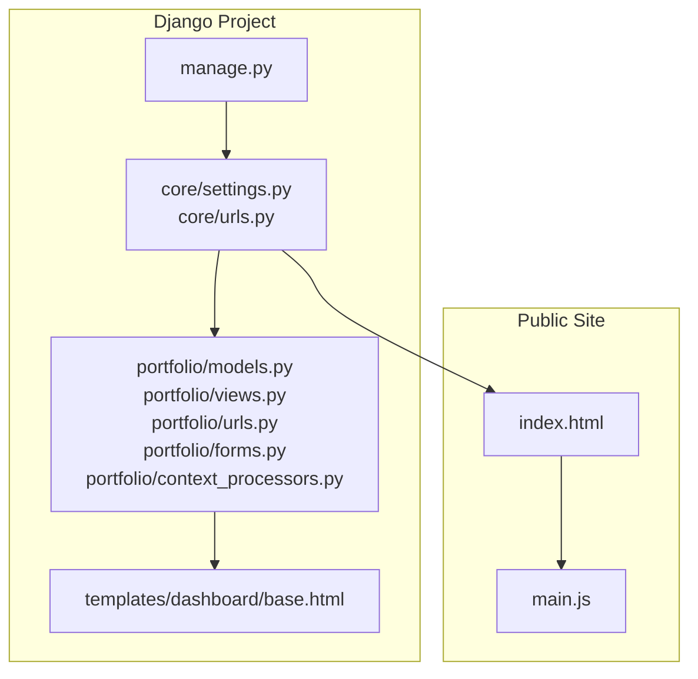
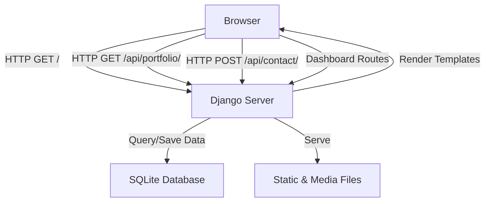
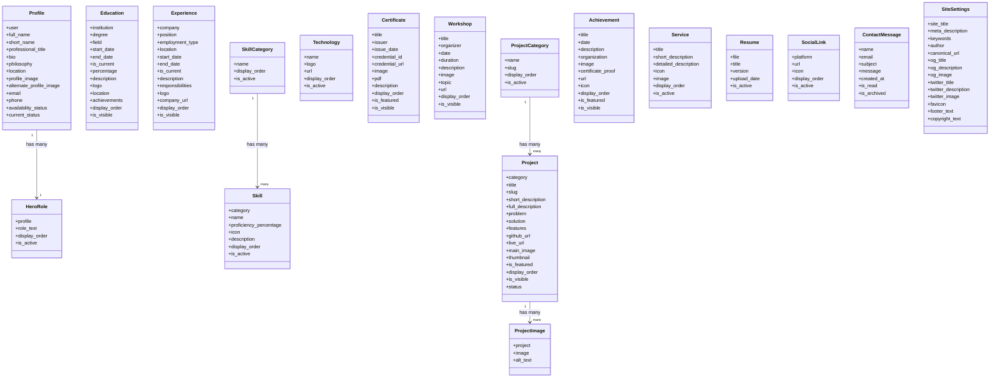
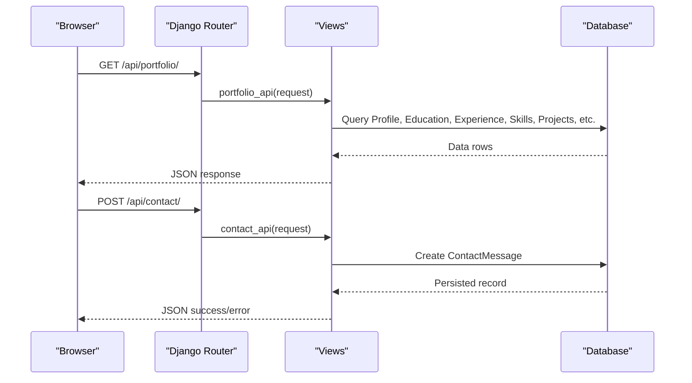
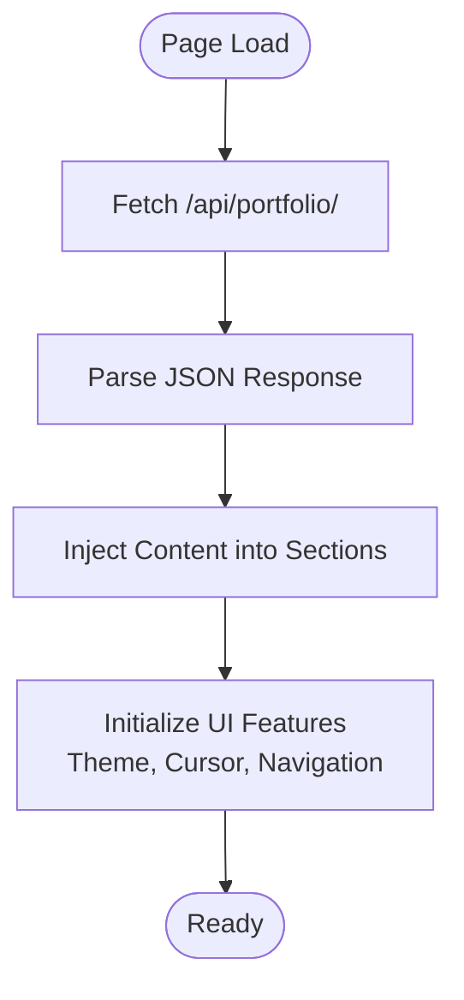
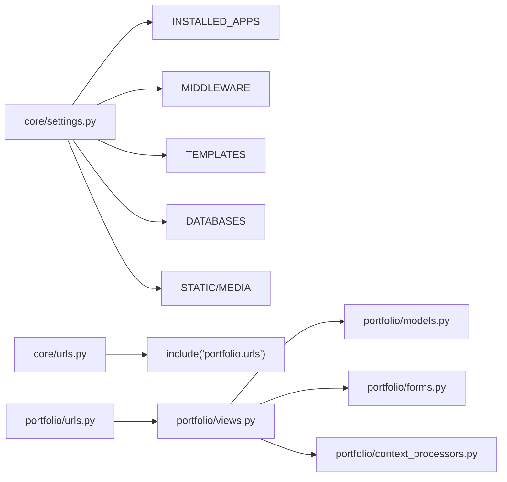

# Project Overview

<cite>
**Referenced Files in This Document**
- [core/settings.py](file://core/settings.py)
- [core/urls.py](file://core/urls.py)
- [portfolio/models.py](file://portfolio/models.py)
- [portfolio/views.py](file://portfolio/views.py)
- [portfolio/urls.py](file://portfolio/urls.py)
- [portfolio/forms.py](file://portfolio/forms.py)
- [portfolio/context_processors.py](file://portfolio/context_processors.py)
- [templates/dashboard/base.html](file://templates/dashboard/base.html)
- [index.html](file://index.html)
- [main.js](file://main.js)
- [manage.py](file://manage.py)
</cite>

## Table of Contents
1. [Introduction](#introduction)
2. [Project Structure](#project-structure)
3. [Core Components](#core-components)
4. [Architecture Overview](#architecture-overview)
5. [Detailed Component Analysis](#detailed-component-analysis)
6. [Dependency Analysis](#dependency-analysis)
7. [Performance Considerations](#performance-considerations)
8. [Troubleshooting Guide](#troubleshooting-guide)
9. [Conclusion](#conclusion)

## Introduction
Portfolio CMS is a Django-based portfolio Content Management System that serves two roles:
- A public-facing portfolio website showcasing work, skills, education, experience, certificates, workshops, achievements, services, and contact information.
- An administrative dashboard for managing all content through a secure, role-aware interface.

The system combines a backend built with Django 5.0 and Python with a modern frontend using HTML/CSS/JavaScript. It uses SQLite by default and provides an API to serve dynamic data to the frontend. The target audience includes developers and professionals who need a polished, maintainable online presence and a simple way to update their portfolio without touching code.

Key features include:
- Dynamic portfolio showcase driven by database-backed models and a JSON API.
- Full content management system for profile, hero roles, statistics, education, experience, skills, projects, certificates, workshops, achievements, services, technologies, social links, resume files, site settings, and messages.
- Authentication for the admin dashboard with protected routes and logout.
- API integration endpoints for portfolio data and contact form submissions.
- Responsive design with theme switching, animations, and accessible UI patterns.

Technology stack overview:
- Backend: Django 5.0, Python, SQLite
- Frontend: HTML, CSS, JavaScript (vanilla), Font Awesome icons, Google Fonts
- Supporting libraries: python-dotenv for environment variables, Django’s built-in auth, sessions, messages, and static/media handling

## Project Structure
At a high level, the project follows Django conventions:
- core: Django project configuration (settings, URLs, WSGI/ASGI).
- portfolio: Django app containing models, views, forms, URL routing, context processors, and templates.
- templates/dashboard: Admin dashboard templates.
- static: Dashboard-specific CSS and JS assets.
- index.html and main.js: Public portfolio page and its client-side engine.
- manage.py: Django CLI entry point.

**Diagram sources**
- [core/settings.py:1-142](file://core/settings.py#L1-L142)
- [core/urls.py:1-30](file://core/urls.py#L1-L30)
- [portfolio/models.py:1-298](file://portfolio/models.py#L1-L298)
- [portfolio/views.py:1-439](file://portfolio/views.py#L1-L439)
- [portfolio/urls.py:1-44](file://portfolio/urls.py#L1-L44)
- [portfolio/forms.py:1-22](file://portfolio/forms.py#L1-L22)
- [portfolio/context_processors.py:1-9](file://portfolio/context_processors.py#L1-L9)
- [templates/dashboard/base.html:1-188](file://templates/dashboard/base.html#L1-L188)
- [index.html:1-411](file://index.html#L1-L411)
- [main.js:1-200](file://main.js#L1-L200)
- [manage.py:1-23](file://manage.py#L1-L23)

**Section sources**
- [core/settings.py:1-142](file://core/settings.py#L1-L142)
- [core/urls.py:1-30](file://core/urls.py#L1-L30)
- [portfolio/models.py:1-298](file://portfolio/models.py#L1-L298)
- [portfolio/views.py:1-439](file://portfolio/views.py#L1-L439)
- [portfolio/urls.py:1-44](file://portfolio/urls.py#L1-L44)
- [portfolio/forms.py:1-22](file://portfolio/forms.py#L1-L22)
- [portfolio/context_processors.py:1-9](file://portfolio/context_processors.py#L1-L9)
- [templates/dashboard/base.html:1-188](file://templates/dashboard/base.html#L1-L188)
- [index.html:1-411](file://index.html#L1-L411)
- [main.js:1-200](file://main.js#L1-L200)
- [manage.py:1-23](file://manage.py#L1-L23)

## Core Components
- Models: Represent portfolio entities such as Profile, HeroRole, Education, Experience, Skill/SkillCategory, Technology, Certificate, Workshop, Project/ProjectImage, Achievement, Service, Resume, SocialLink, ContactMessage, and SiteSettings. These define the data schema and relationships used across the site and dashboard.
- Views: Provide both public and authenticated dashboard functionality, including login/logout, generic CRUD for multiple modules, message inbox management, and API endpoints for portfolio data and contact submissions.
- Forms: Django ModelForms for Profile, HeroRole, and SiteSettings; additional extended forms are imported for other models.
- Templates: Dashboard base template with sidebar navigation, topbar, theme toggle, toast notifications, and layout blocks.
- Static Assets: Dashboard CSS and JS for interactive behaviors.
- Public Page: index.html renders the portfolio sections; main.js fetches data from the API and injects it into the DOM.

**Section sources**
- [portfolio/models.py:1-298](file://portfolio/models.py#L1-L298)
- [portfolio/views.py:1-439](file://portfolio/views.py#L1-L439)
- [portfolio/forms.py:1-22](file://portfolio/forms.py#L1-L22)
- [templates/dashboard/base.html:1-188](file://templates/dashboard/base.html#L1-L188)
- [index.html:1-411](file://index.html#L1-L411)
- [main.js:1-200](file://main.js#L1-L200)

## Architecture Overview
The system separates concerns between backend (Django) and frontend (HTML/JS):
- Django handles routing, authentication, business logic, and data persistence via models and SQLite.
- The public site loads index.html and uses main.js to call /api/portfolio/ for dynamic content.
- The admin dashboard is protected by @login_required and exposes CRUD operations for each model.

**Diagram sources**
- [core/urls.py:22-28](file://core/urls.py#L22-L28)
- [portfolio/urls.py:4-43](file://portfolio/urls.py#L4-L43)
- [portfolio/views.py:21-56](file://portfolio/views.py#L21-L56)
- [portfolio/views.py:300-322](file://portfolio/views.py#L300-L322)
- [portfolio/views.py:335-438](file://portfolio/views.py#L335-L438)
- [core/settings.py:80-94](file://core/settings.py#L80-L94)

## Detailed Component Analysis

### Data Model Layer
The models define the domain entities for the portfolio and CMS:
- Profile ties to Django’s User and stores personal details, images, availability, and contact info.
- HeroRole represents rotating roles shown on the public hero section.
- Education and Experience capture academic and professional history with dates, descriptions, logos, and visibility flags.
- Skill and SkillCategory organize technical skills with proficiency levels and ordering.
- Technology lists tools with logos and URLs.
- Certificate and Workshop document credentials and training events.
- Project and ProjectImage represent featured work with categories, metadata, and galleries.
- Achievement records milestones with optional media and links.
- Service describes offerings with icons and descriptions.
- Resume manages downloadable CV files.
- SocialLink maintains active social profiles.
- ContactMessage stores visitor messages with read/archived states.
- SiteSettings holds SEO and branding fields.

**Diagram sources**
- [portfolio/models.py:4-298](file://portfolio/models.py#L4-L298)

**Section sources**
- [portfolio/models.py:1-298](file://portfolio/models.py#L1-L298)

### View Layer and Routing
- Public home view serves index.html directly.
- Auth views provide admin login/logout with session management.
- Dashboard views expose module dashboards and generic CRUD helpers for multiple models.
- Message inbox views support filtering, toggling read status, marking all read, and deletion.
- API views:
  - portfolio_api returns a comprehensive JSON payload for the frontend.
  - contact_api accepts POST requests to store contact messages.

**Diagram sources**
- [portfolio/views.py:300-322](file://portfolio/views.py#L300-L322)
- [portfolio/views.py:335-438](file://portfolio/views.py#L335-L438)
- [portfolio/urls.py:40-43](file://portfolio/urls.py#L40-L43)

**Section sources**
- [portfolio/views.py:21-56](file://portfolio/views.py#L21-L56)
- [portfolio/views.py:58-83](file://portfolio/views.py#L58-L83)
- [portfolio/views.py:127-180](file://portfolio/views.py#L127-L180)
- [portfolio/views.py:184-221](file://portfolio/views.py#L184-L221)
- [portfolio/views.py:240-295](file://portfolio/views.py#L240-L295)
- [portfolio/views.py:300-322](file://portfolio/views.py#L300-L322)
- [portfolio/views.py:335-438](file://portfolio/views.py#L335-L438)
- [portfolio/urls.py:4-43](file://portfolio/urls.py#L4-L43)

### Forms and Validation
- ProfileForm, HeroRoleForm, and SiteSettingsForm are ModelForms bound to their respective models.
- Extended forms are imported for other models to standardize CRUD operations in the dashboard.

**Section sources**
- [portfolio/forms.py:1-22](file://portfolio/forms.py#L1-L22)

### Context Processors and Dashboard Globals
- dashboard_globals exposes unread message counts to every dashboard template, enabling badges and counters.

**Section sources**
- [portfolio/context_processors.py:1-9](file://portfolio/context_processors.py#L1-L9)

### Template Layer and Dashboard UI
- Base dashboard template provides:
  - Sidebar navigation grouped by feature areas.
  - Topbar with quick jump search, live site link, messages, and theme toggle.
  - Toast notification system for user feedback.
  - Theme persistence via localStorage.

**Section sources**
- [templates/dashboard/base.html:1-188](file://templates/dashboard/base.html#L1-L188)

### Public Frontend Engine
- index.html defines the full portfolio structure with sections for hero, about, stats, education, experience, skills, tech marquee, certificates, workshops, projects, achievements, services, resume, and contact.
- main.js:
  - Fetches /api/portfolio/ and injects data into the DOM.
  - Initializes loader, theme, custom cursor, navigation, animations, and interactions.
  - Handles contact form submission via the API.

**Diagram sources**
- [main.js:8-41](file://main.js#L8-L41)
- [main.js:119-200](file://main.js#L119-L200)
- [index.html:1-411](file://index.html#L1-L411)

**Section sources**
- [index.html:1-411](file://index.html#L1-L411)
- [main.js:1-200](file://main.js#L1-L200)

## Dependency Analysis
- Settings configure installed apps, middleware, templates, database, static/media paths, password validators, internationalization, and defaults.
- Root URLs include the portfolio app and enable media serving in debug mode.
- Portfolio URLs map routes to views for public pages, dashboard modules, messages, and APIs.
- Views depend on models and forms to render and persist data.
- Context processors enrich dashboard templates with global state.

**Diagram sources**
- [core/settings.py:34-94](file://core/settings.py#L34-L94)
- [core/urls.py:22-28](file://core/urls.py#L22-L28)
- [portfolio/urls.py:4-43](file://portfolio/urls.py#L4-L43)
- [portfolio/views.py:1-18](file://portfolio/views.py#L1-L18)
- [portfolio/forms.py:1-22](file://portfolio/forms.py#L1-L22)
- [portfolio/context_processors.py:1-9](file://portfolio/context_processors.py#L1-L9)

**Section sources**
- [core/settings.py:34-94](file://core/settings.py#L34-L94)
- [core/urls.py:22-28](file://core/urls.py#L22-L28)
- [portfolio/urls.py:4-43](file://portfolio/urls.py#L4-L43)

## Performance Considerations
- Use select_related and prefetch_related where appropriate to reduce N+1 queries when rendering large datasets (e.g., projects with images).
- Cache frequently accessed data like SiteSettings or profile data if traffic increases.
- Optimize image uploads with compression and responsive formats.
- Enable static file caching and CDN delivery in production.
- Consider pagination for lists with many items (projects, certificates, achievements).
- Avoid heavy client-side computations; offload formatting to the server when possible.

[No sources needed since this section provides general guidance]

## Troubleshooting Guide
- Missing front page: If index.html is not found at the expected path, the home view raises a 404. Ensure the file exists at the configured base directory.
- Authentication issues: The admin login route creates or logs in a specific user. Verify credentials and ensure the user is staff/superuser for dashboard access.
- API errors: The contact API returns error responses for invalid payloads or unsupported methods. Check request body format and method.
- Messages inbox: Use filters to view unread/read messages; mark all read to clear notifications.
- Static/media not served: In development, media files are served only when DEBUG is True. Confirm settings and ensure files exist under MEDIA_ROOT.

**Section sources**
- [portfolio/views.py:21-26](file://portfolio/views.py#L21-L26)
- [portfolio/views.py:28-56](file://portfolio/views.py#L28-L56)
- [portfolio/views.py:300-322](file://portfolio/views.py#L300-L322)
- [core/settings.py:27-30](file://core/settings.py#L27-L30)
- [core/settings.py:87-94](file://core/settings.py#L87-L94)

## Conclusion
Portfolio CMS delivers a complete solution for building and maintaining a professional portfolio website backed by a robust Django CMS. Its modular architecture, rich set of models, and clean separation between backend and frontend make it suitable for both beginners and experienced developers. With a responsive, animated public site and a feature-rich admin dashboard, users can focus on showcasing their work while the system handles content management, authentication, and API-driven data delivery.

[No sources needed since this section summarizes without analyzing specific files]