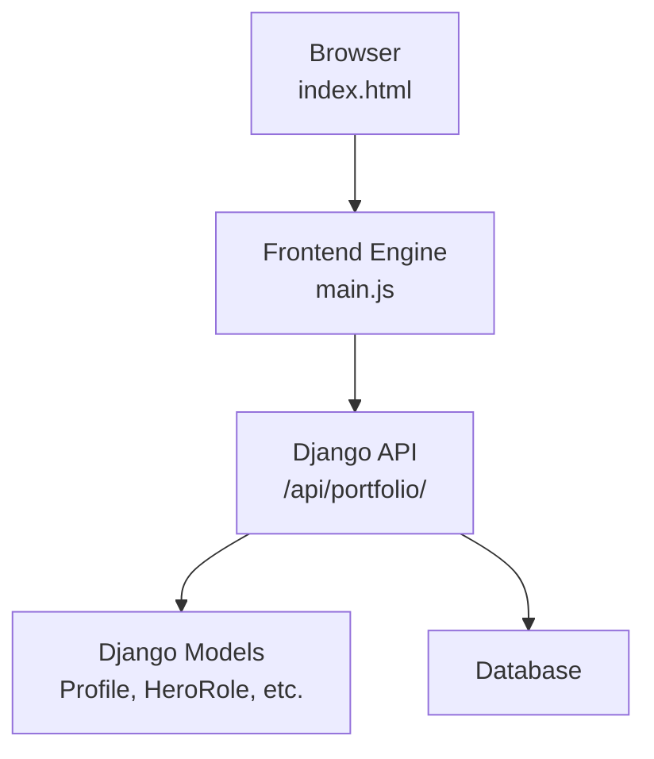
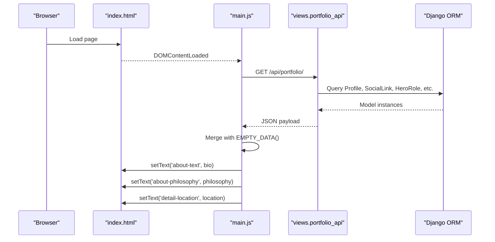
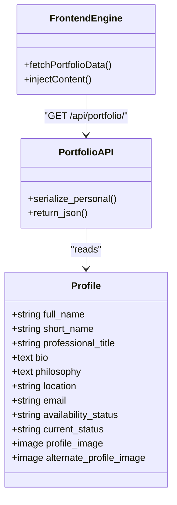
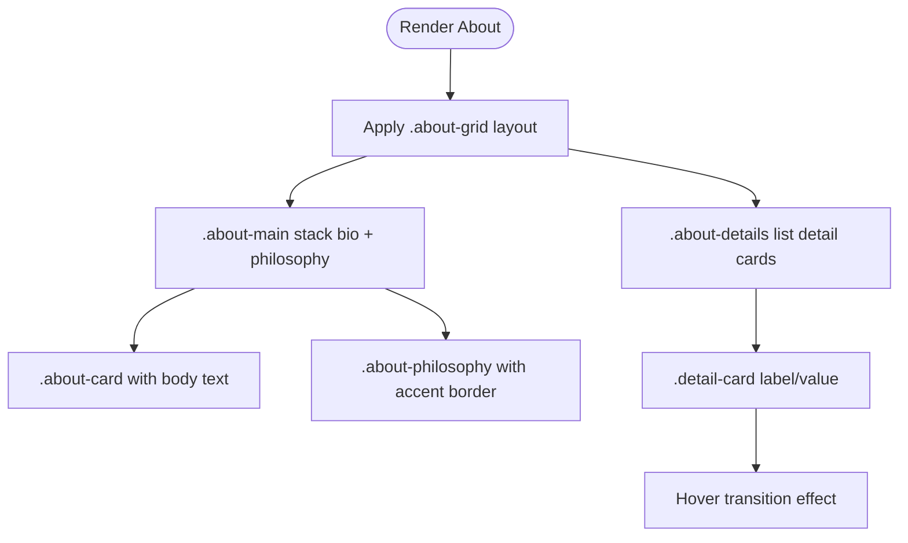
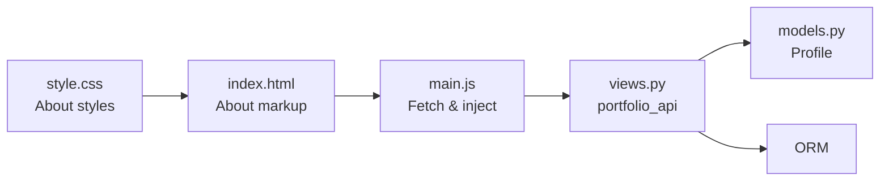

# About Section

<cite>
**Referenced Files in This Document**
- [index.html](file://index.html)
- [main.js](file://main.js)
- [style.css](file://style.css)
- [portfolio/models.py](file://portfolio/models.py)
- [portfolio/views.py](file://portfolio/views.py)
- [portfolio/urls.py](file://portfolio/urls.py)
</cite>

## Table of Contents
1. [Introduction](#introduction)
2. [Project Structure](#project-structure)
3. [Core Components](#core-components)
4. [Architecture Overview](#architecture-overview)
5. [Detailed Component Analysis](#detailed-component-analysis)
6. [Dependency Analysis](#dependency-analysis)
7. [Performance Considerations](#performance-considerations)
8. [Troubleshooting Guide](#troubleshooting-guide)
9. [Conclusion](#conclusion)

## Introduction
This document explains the About section of the portfolio site, focusing on:
- Professional bio display and philosophy presentation
- Dynamic content loading from Django API endpoints
- Card-based layout structure and responsive design patterns
- Data binding between Django models and frontend display (location, focus areas, identity tags)
- Styling details for the about grid layout, card components, and typography hierarchy

The About section is a client-rendered area that loads personal data from a single Django API endpoint and injects it into static HTML using vanilla JavaScript.

## Project Structure
The About section spans three layers:
- Frontend markup: defines the about container and placeholder elements
- Frontend logic: fetches data and binds it to DOM nodes
- Backend data: Django models and an API view serialize profile information

**Diagram sources**
- [index.html:152-185](file://index.html#L152-L185)
- [main.js:88-103](file://main.js#L88-L103)
- [portfolio/views.py:335-457](file://portfolio/views.py#L335-L457)
- [portfolio/models.py:4-20](file://portfolio/models.py#L4-L20)

**Section sources**
- [index.html:152-185](file://index.html#L152-L185)
- [main.js:88-103](file://main.js#L88-L103)
- [portfolio/views.py:335-457](file://portfolio/views.py#L335-L457)
- [portfolio/models.py:4-20](file://portfolio/models.py#L4-L20)

## Core Components
- About markup: provides the grid, cards, and placeholders for dynamic content
- Data loader: fetches JSON from the Django API and merges it with a default skeleton
- Content injector: binds fields like bio, philosophy, location, and email to DOM nodes
- Styling: CSS grid and card styles define the visual layout and typography

Key responsibilities:
- index.html: About section skeleton and IDs for injection
- main.js: Fetching /api/portfolio/, merging defaults, and injecting values
- style.css: About grid, cards, detail cards, and typography
- views.py: Serializing Profile and related data into JSON
- models.py: Defining Profile fields such as bio, philosophy, location

**Section sources**
- [index.html:152-185](file://index.html#L152-L185)
- [main.js:88-103](file://main.js#L88-L103)
- [main.js:188-217](file://main.js#L188-L217)
- [style.css:852-938](file://style.css#L852-L938)
- [portfolio/views.py:335-457](file://portfolio/views.py#L335-L457)
- [portfolio/models.py:4-20](file://portfolio/models.py#L4-L20)

## Architecture Overview
The About section uses a simple client-side rendering pattern driven by a single API response.

**Diagram sources**
- [index.html:152-185](file://index.html#L152-L185)
- [main.js:88-103](file://main.js#L88-L103)
- [main.js:188-217](file://main.js#L188-L217)
- [portfolio/views.py:335-457](file://portfolio/views.py#L335-L457)

## Detailed Component Analysis

### About Markup and Placeholders
The About section defines:
- A two-column grid: main content and detail sidebar
- A bio card and a philosophy block
- Detail cards for Location, Focus, and Identity

Relevant elements:
- Container: section#about
- Bio paragraph: #about-text
- Philosophy paragraph: #about-philosophy
- Location value: #detail-location

These IDs are used by the frontend engine to bind data.

**Section sources**
- [index.html:152-185](file://index.html#L152-L185)

### Dynamic Data Loading
The frontend:
- Calls /api/portfolio/ on load
- Merges the response with a default skeleton to ensure all sections exist
- Injects personal fields into the About section

Data binding for About:
- Sets bio to #about-text
- Sets philosophy to #about-philosophy
- Sets location to #detail-location
- Also sets contact email and resume links elsewhere

Error handling:
- Network errors fall back to empty data
- Missing elements are guarded against via null checks

**Section sources**
- [main.js:88-103](file://main.js#L88-L103)
- [main.js:188-217](file://main.js#L188-L217)

### Django API Endpoint
The backend serializes all portfolio data, including personal fields used by the About section:
- personal.name, title, shortName, email, bio, philosophy, location, availability, currentStatus, resumeUrl, profileImage, altProfileImage
- heroRoles, socials, stats, education, experience, skills, certificates, workshops, projects, achievements, services

For the About section, the relevant fields are:
- personal.bio
- personal.philosophy
- personal.location
- personal.email (used in contact area)

The endpoint returns a JSON object consumed by the frontend.

**Section sources**
- [portfolio/views.py:335-457](file://portfolio/views.py#L335-L457)

### Django Models and Data Binding
The Profile model stores the core personal data displayed in the About section:
- full_name, short_name, professional_title
- bio, philosophy
- location
- email
- availability_status, current_status
- profile_image, alternate_profile_image

The API maps these fields to the JSON keys consumed by the frontend.

**Diagram sources**
- [portfolio/models.py:4-20](file://portfolio/models.py#L4-L20)
- [portfolio/views.py:335-457](file://portfolio/views.py#L335-L457)
- [main.js:88-103](file://main.js#L88-L103)

**Section sources**
- [portfolio/models.py:4-20](file://portfolio/models.py#L4-L20)
- [portfolio/views.py:335-457](file://portfolio/views.py#L335-L457)

### Styling Details: About Grid, Cards, and Typography
About layout:
- Grid: .about-grid with two columns (main and sidebar)
- Main column: .about-main stacking bio and philosophy
- Bio card: .about-card with padding and text styling
- Philosophy block: .about-philosophy with left accent border and italic body text
- Sidebar: .about-details containing .detail-card items
- Detail cards: label/value pairs with hover effects

Typography:
- Body text in .about-card p uses comfortable line-height and muted color
- Philosophy h3 includes a decorative marker and accent color
- Labels use monospace font, uppercase, and accent color
- Values use medium weight and primary text color

Responsive behavior:
- The grid uses fixed column ratios; consider adding media queries if you need a stacked layout on small screens
- Hover transitions on detail cards provide subtle interactivity

**Diagram sources**
- [style.css:852-938](file://style.css#L852-L938)

**Section sources**
- [style.css:852-938](file://style.css#L852-L938)

### Focus Areas and Identity Tags
Currently, the About section displays:
- Location: bound to personal.location
- Focus: hardcoded “Full-Stack Development”
- Identity: hardcoded “Creative Engineer”

To make Focus and Identity dynamic:
- Add corresponding fields to the Profile model (e.g., focus_areas, identity_tags)
- Serialize them in the API under personal.focusAreas and personal.identityTags
- Bind them in main.js to the respective detail-value elements

This keeps the same card-based structure while enabling CMS-driven updates.

[No sources needed since this section proposes enhancements without analyzing specific files]

## Dependency Analysis
The following dependencies connect the About section across layers:

**Diagram sources**
- [index.html:152-185](file://index.html#L152-L185)
- [main.js:88-103](file://main.js#L88-L103)
- [portfolio/views.py:335-457](file://portfolio/views.py#L335-L457)
- [portfolio/models.py:4-20](file://portfolio/models.py#L4-L20)
- [style.css:852-938](file://style.css#L852-L938)

**Section sources**
- [index.html:152-185](file://index.html#L152-L185)
- [main.js:88-103](file://main.js#L88-L103)
- [portfolio/views.py:335-457](file://portfolio/views.py#L335-L457)
- [portfolio/models.py:4-20](file://portfolio/models.py#L4-L20)
- [style.css:852-938](file://style.css#L852-L938)

## Performance Considerations
- Single API call: All data is fetched once at startup, minimizing network overhead
- Null-safe DOM operations: Prevents runtime errors when elements are missing
- Fallback defaults: Ensures graceful degradation if the API fails or returns partial data
- Image fallbacks: Profile image has an error handler to avoid broken visuals

Optimization opportunities:
- Cache the API response in memory to avoid refetching on navigation within the SPA-like flow
- Lazy-load non-critical assets (profile images) where appropriate
- Debounce scroll and resize handlers if extending animations

[No sources needed since this section provides general guidance]

## Troubleshooting Guide
Common issues and resolutions:
- About text not updating:
  - Verify that /api/portfolio/ returns personal.bio, personal.philosophy, and personal.location
  - Check browser console for fetch errors
  - Ensure element IDs match those used in main.js
- Location shows fallback:
  - Confirm Profile.location is set in the database
  - Validate that the API response includes personal.location
- Styling anomalies:
  - Inspect computed styles for .about-grid, .about-card, .about-philosophy, and .detail-card
  - Ensure theme variables are applied correctly

**Section sources**
- [main.js:88-103](file://main.js#L88-L103)
- [main.js:188-217](file://main.js#L188-L217)
- [style.css:852-938](file://style.css#L852-L938)

## Conclusion
The About section combines a clean card-based layout with dynamic data binding from a single Django API endpoint. It displays the professional bio, philosophy, and location, with room to extend focus areas and identity tags. The architecture is straightforward: static HTML, lightweight JavaScript, and a well-structured Django API backed by clear models. Styling emphasizes readability, subtle interactivity, and a consistent design system.

[No sources needed since this section summarizes without analyzing specific files]