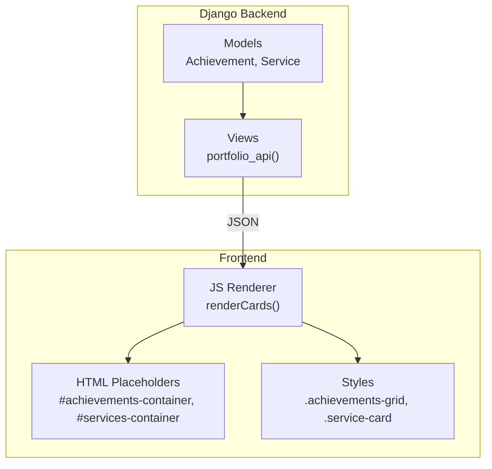
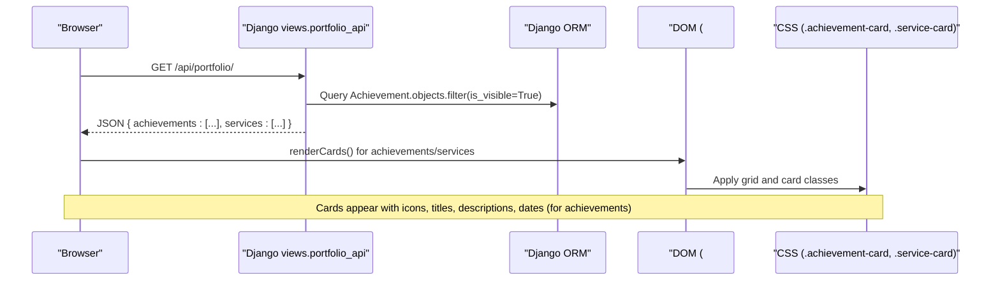
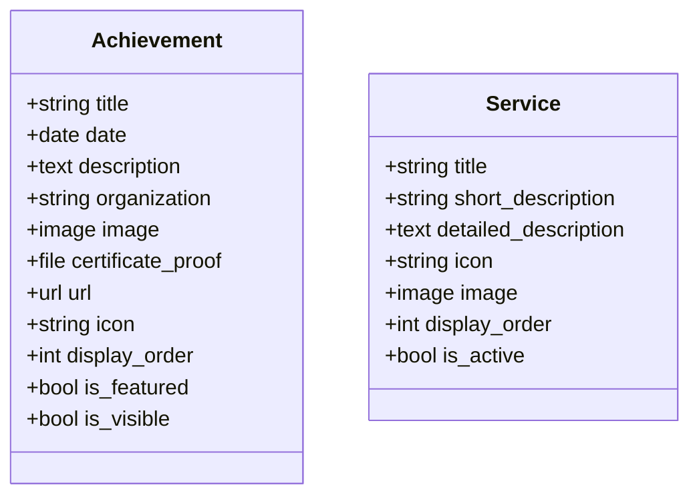
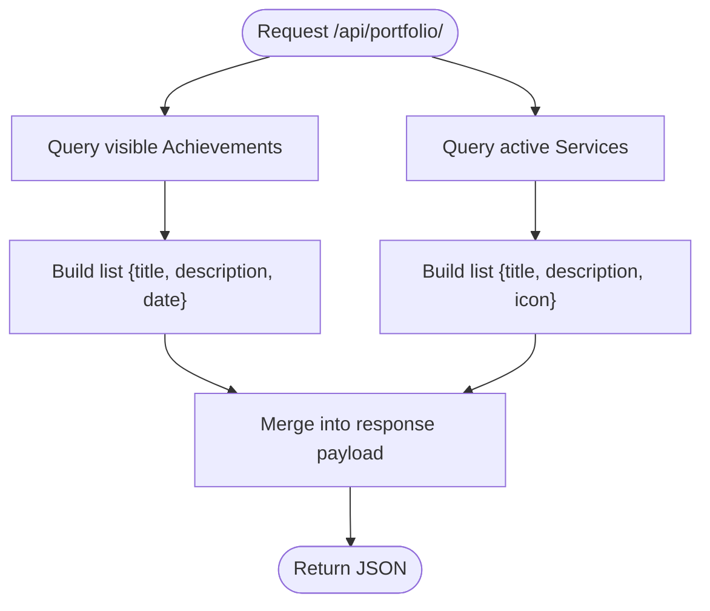
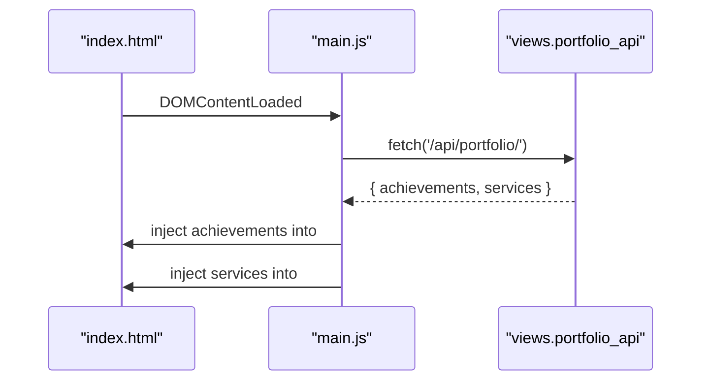
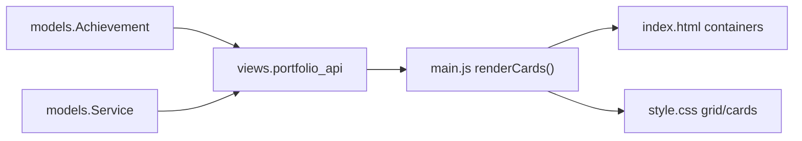

# Achievements & Services

<cite>
**Referenced Files in This Document**
- [models.py](file://portfolio/models.py)
- [views.py](file://portfolio/views.py)
- [index.html](file://index.html)
- [main.js](file://main.js)
- [style.css](file://style.css)
</cite>

## Table of Contents
1. Introduction
2. Project Structure
3. Core Components
4. Architecture Overview
5. Detailed Component Analysis
6. Dependency Analysis
7. Performance Considerations
8. Troubleshooting Guide
9. Conclusion

## Introduction
This document explains how the Achievements and Services sections are implemented end-to-end: data models, API exposure, dynamic rendering, icon integration, responsive grid layout, and styling with interactive hover effects. It is designed for both developers and non-technical readers to understand how content is managed via Django and presented on the public site.

## Project Structure
The Achievements and Services features span a few key files:
- Data model definitions for achievements and services
- A single portfolio API that serializes these records for the frontend
- HTML placeholders for the sections
- JavaScript that fetches data and renders cards dynamically
- CSS that styles the grids, cards, icons, and hover states

**Diagram sources**
- [models.py:208-240](file://portfolio/models.py#L208-L240)
- [views.py:335-457](file://portfolio/views.py#L335-L457)
- [index.html:264-282](file://index.html#L264-L282)
- [main.js:294-311](file://main.js#L294-L311)
- [style.css:1462-1514](file://style.css#L1462-L1514)

**Section sources**
- [models.py:208-240](file://portfolio/models.py#L208-L240)
- [views.py:335-457](file://portfolio/views.py#L335-L457)
- [index.html:264-282](file://index.html#L264-L282)
- [main.js:294-311](file://main.js#L294-L311)
- [style.css:1462-1514](file://style.css#L1462-L1514)

## Core Components
- Achievement model: stores title, date, description, optional image/certificate/link, icon string, visibility flags, ordering, and feature flag.
- Service model: stores title, short/detailed descriptions, icon string, optional image, visibility/active flags, and ordering.
- Portfolio API: returns serialized lists of achievements and services for the frontend.
- Frontend renderer: builds achievement and service cards using template literals and injects them into the DOM.
- Styles: define responsive grids, card surfaces, icon containers, and hover effects.

Key responsibilities:
- Models provide structured storage and metadata (ordering, visibility).
- Views serialize only what’s needed for display.
- JS handles fetching, escaping, and safe injection.
- CSS ensures consistent visual presentation and interactivity.

**Section sources**
- [models.py:208-240](file://portfolio/models.py#L208-L240)
- [views.py:453-455](file://portfolio/views.py#L453-L455)
- [main.js:294-311](file://main.js#L294-L311)
- [style.css:1462-1514](file://style.css#L1462-L1514)

## Architecture Overview
The data flow from database to UI:

**Diagram sources**
- [views.py:335-457](file://portfolio/views.py#L335-L457)
- [main.js:88-103](file://main.js#L88-L103)
- [main.js:294-311](file://main.js#L294-L311)
- [style.css:1462-1514](file://style.css#L1462-L1514)

## Detailed Component Analysis

### Data Models: Achievement and Service
- Achievement fields include title, date, description, organization, media assets, URL, icon class name, ordering, feature flag, and visibility.
- Service fields include title, short and detailed descriptions, icon class name, optional image, ordering, and active flag.
- Both support ordering by display_order and visibility toggles to control frontend exposure.

**Diagram sources**
- [models.py:208-240](file://portfolio/models.py#L208-L240)

**Section sources**
- [models.py:208-240](file://portfolio/models.py#L208-L240)

### API Exposure: portfolio_api
- The API aggregates all portfolio data in one endpoint.
- For achievements: it filters visible items and returns title, description, and date.
- For services: it filters active items and returns title, short description, and icon class name.

**Diagram sources**
- [views.py:453-455](file://portfolio/views.py#L453-L455)

**Section sources**
- [views.py:453-455](file://portfolio/views.py#L453-L455)

### Frontend Rendering: Achievements and Services
- The HTML provides two container elements: #achievements-container and #services-container.
- On load, main.js fetches the API, then calls renderCards to build card markup and inject it into the containers.
- Achievements use a default trophy icon; services use the stored icon class if present or fall back to a generic gear icon.
- Dates are shown for achievements when available.

**Diagram sources**
- [index.html:264-282](file://index.html#L264-L282)
- [main.js:88-103](file://main.js#L88-L103)
- [main.js:294-311](file://main.js#L294-L311)

**Section sources**
- [index.html:264-282](file://index.html#L264-L282)
- [main.js:294-311](file://main.js#L294-L311)

### Icon Integration Patterns
- Icons are stored as Font Awesome class names (e.g., fa-solid fa-trophy, fa-solid fa-gears).
- For services, the renderer checks if the stored icon starts with a valid class prefix; otherwise, it falls back to a default icon.
- Achievements currently use a fixed trophy icon in the renderer; you can extend this to read an icon field from the model if desired.

Best practices:
- Always validate icon strings before injecting into class attributes.
- Provide sensible fallbacks to avoid broken icons.
- Keep icon naming consistent across models and templates.

**Section sources**
- [main.js:305-311](file://main.js#L305-L311)
- [models.py:208-240](file://portfolio/models.py#L208-L240)

### Responsive Grid Layouts
- Both achievements and services use CSS Grid with auto-fill and minimum card width to adapt to screen sizes.
- Cards have consistent padding and spacing, ensuring alignment across devices.

Key behaviors:
- Grid automatically wraps based on viewport width.
- Minimum card size ensures readability on small screens.
- Gap between cards improves visual separation.

**Section sources**
- [style.css:1462-1468](file://style.css#L1462-L1468)

### Styling: Achievement Cards, Service Cards, and Hover Effects
- Shared card surface: background, border, radius, shadow, and subtle top gradient accent.
- Icon containers: sized squares with rounded corners, colored backgrounds, borders, and centered icons.
- Titles and descriptions: clear typography hierarchy with muted description text.
- Hover effects: lift, border color change, and enhanced glow/shadow for emphasis.

Implementation highlights:
- .achievement-card and .service-card share base card styles.
- .achievement-icon uses amber tones; .service-icon uses blue tones.
- Hover state applies transform, border-color, and box-shadow transitions.

**Section sources**
- [style.css:530-566](file://style.css#L530-L566)
- [style.css:1470-1514](file://style.css#L1470-L1514)

## Dependency Analysis
- Models depend on Django ORM for persistence and querying.
- Views depend on models to filter and serialize data.
- Frontend depends on the API contract (field names and structure).
- CSS depends on class names used by the rendered HTML.

**Diagram sources**
- [models.py:208-240](file://portfolio/models.py#L208-L240)
- [views.py:453-455](file://portfolio/views.py#L453-L455)
- [main.js:294-311](file://main.js#L294-L311)
- [style.css:1462-1514](file://style.css#L1462-L1514)

**Section sources**
- [models.py:208-240](file://portfolio/models.py#L208-L240)
- [views.py:453-455](file://portfolio/views.py#L453-L455)
- [main.js:294-311](file://main.js#L294-L311)
- [style.css:1462-1514](file://style.css#L1462-L1514)

## Performance Considerations
- Use is_visible/is_active flags to limit dataset size returned by the API.
- Avoid heavy computations in the API; keep serialization minimal.
- Prefer client-side rendering for simple lists to reduce server load.
- Ensure images are optimized and lazy-loaded where applicable.
- Debounce or throttle scroll-based animations if adding more interactions.

[No sources needed since this section provides general guidance]

## Troubleshooting Guide
Common issues and resolutions:
- No achievements/services displayed:
  - Verify records exist with correct visibility flags in the admin.
  - Check network tab for successful API response and expected fields.
- Broken icons:
  - Ensure icon strings are valid Font Awesome class names.
  - Confirm CDN link for Font Awesome is loaded.
- Empty state shows unexpectedly:
  - Confirm containers exist in HTML and IDs match those referenced in JS.
  - Validate that the API returns arrays for achievements and services.
- Hover effects not working:
  - Ensure CSS is loaded and classes are applied correctly.
  - Check for conflicting styles overriding transitions.

**Section sources**
- [main.js:294-311](file://main.js#L294-L311)
- [index.html:264-282](file://index.html#L264-L282)
- [style.css:1462-1514](file://style.css#L1462-L1514)

## Conclusion
The Achievements and Services sections demonstrate a clean separation of concerns:
- Django models store structured content with visibility and ordering.
- A unified API exposes only necessary fields to the frontend.
- JavaScript safely renders dynamic content into predefined containers.
- CSS provides a modern, responsive, and interactive presentation.

This pattern scales well: add new fields in models, expose them in the API, update the renderer, and style consistently with existing card patterns.