# Certificates & Workshops

<cite>
**Referenced Files in This Document**
- [models.py](file://portfolio/models.py)
- [views.py](file://portfolio/views.py)
- [index.html](file://index.html)
- [main.js](file://main.js)
- [style.css](file://style.css)
</cite>

## Table of Contents
1. [Introduction](#introduction)
2. [Project Structure](#project-structure)
3. [Core Components](#core-components)
4. [Architecture Overview](#architecture-overview)
5. [Detailed Component Analysis](#detailed-component-analysis)
6. [Dependency Analysis](#dependency-analysis)
7. [Performance Considerations](#performance-considerations)
8. [Troubleshooting Guide](#troubleshooting-guide)
9. [Conclusion](#conclusion)

## Introduction
This document explains how the Certifications and Workshops sections are implemented end-to-end: data models, API exposure, dynamic content loading, grid-based presentation, image gallery behavior for credential verification, responsive card layouts, and styling. It is designed to be accessible to both developers and non-technical readers while providing precise references to source files.

## Project Structure
The certificates and workshops features span database models, a single JSON API endpoint, a static HTML page with container placeholders, JavaScript that fetches and renders data, and CSS that styles the grids and cards.

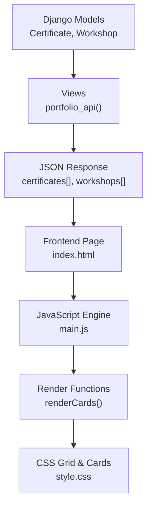

**Diagram sources**
- [models.py:130-165](file://portfolio/models.py#L130-L165)
- [views.py:335-457](file://portfolio/views.py#L335-L457)
- [index.html:231-249](file://index.html#L231-L249)
- [main.js:264-288](file://main.js#L264-L288)
- [style.css:1274-1319](file://style.css#L1274-L1319)

**Section sources**
- [models.py:130-165](file://portfolio/models.py#L130-L165)
- [views.py:335-457](file://portfolio/views.py#L335-L457)
- [index.html:231-249](file://index.html#L231-L249)
- [main.js:264-288](file://main.js#L264-L288)
- [style.css:1274-1319](file://style.css#L1274-L1319)

## Core Components
- Data models: Certificate and Workshop define fields for titles, issuers/dates, images, PDFs (for certificates), topics, URLs, visibility flags, and ordering.
- API endpoint: A single view returns all portfolio data including certificates and workshops as JSON arrays.
- Frontend containers: The HTML page includes dedicated containers for certificates and workshops.
- Rendering engine: JavaScript fetches the JSON, maps it into card markup, and injects it into the DOM.
- Styling: CSS defines responsive grid layouts and card styles for certificates and workshops.

Key responsibilities:
- Database: Store and order records; control visibility via boolean flags.
- API: Serialize only visible items and format dates/URLs for frontend consumption.
- Frontend: Build grid cards, handle optional images, provide links to credentials, and show empty states when no data exists.
- Styling: Provide consistent card surfaces, hover effects, and responsive grid behavior.

**Section sources**
- [models.py:130-165](file://portfolio/models.py#L130-L165)
- [views.py:424-435](file://portfolio/views.py#L424-L435)
- [index.html:231-249](file://index.html#L231-L249)
- [main.js:264-288](file://main.js#L264-L288)
- [style.css:1274-1319](file://style.css#L1274-L1319)

## Architecture Overview
The flow from database to UI is centralized through a single API response. The frontend uses a generic rendering function to build certificate and workshop cards consistently.

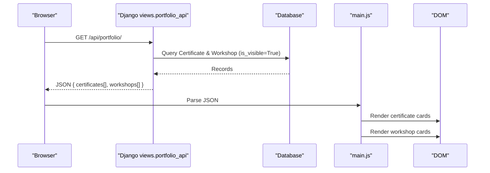

**Diagram sources**
- [views.py:335-457](file://portfolio/views.py#L335-L457)
- [main.js:88-103](file://main.js#L88-L103)
- [main.js:264-288](file://main.js#L264-L288)

## Detailed Component Analysis

### Data Model: Certificate
- Fields include title, issuer, issue date, optional credential ID and URL, image, optional PDF upload, description, display order, featured flag, and visibility flag.
- Ordering is by display_order; visibility controls inclusion in the public API.

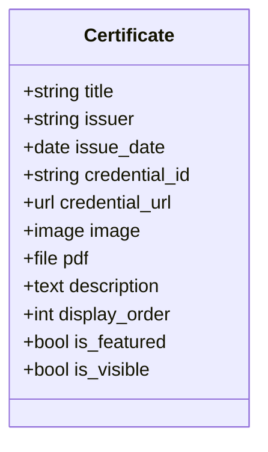

**Diagram sources**
- [models.py:130-147](file://portfolio/models.py#L130-L147)

**Section sources**
- [models.py:130-147](file://portfolio/models.py#L130-L147)

### Data Model: Workshop
- Fields include title, organizer, date, duration, description, optional image, topic, optional URL, display order, and visibility flag.
- Ordering is by display_order; visibility controls inclusion in the public API.

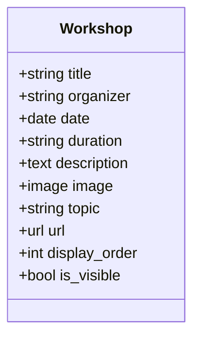

**Diagram sources**
- [models.py:149-165](file://portfolio/models.py#L149-L165)

**Section sources**
- [models.py:149-165](file://portfolio/models.py#L149-L165)

### API Serialization: Certificates and Workshops
- Certificates: The API serializes title, issuer, formatted date, image URL, description, and credential URL for visible certificates.
- Workshops: The API serializes title, organizer, date, description, and topic for visible workshops.

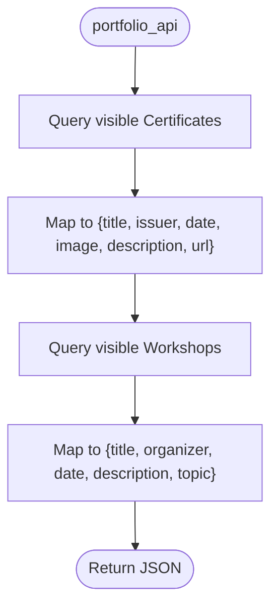

**Diagram sources**
- [views.py:424-435](file://portfolio/views.py#L424-L435)

**Section sources**
- [views.py:424-435](file://portfolio/views.py#L424-L435)

### Frontend Containers and Dynamic Loading
- The HTML page provides two containers: one for certificates and one for workshops.
- On load, JavaScript fetches the portfolio API, merges data into a global object, and calls render functions to populate the containers.
- A generic render function builds card HTML or shows an empty state if there is no data.

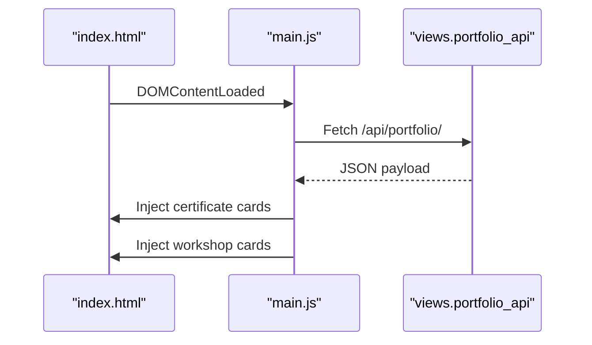

**Diagram sources**
- [index.html:231-249](file://index.html#L231-L249)
- [main.js:88-103](file://main.js#L88-L103)
- [main.js:264-288](file://main.js#L264-L288)

**Section sources**
- [index.html:231-249](file://index.html#L231-L249)
- [main.js:88-103](file://main.js#L88-L103)
- [main.js:264-288](file://main.js#L264-L288)

### Card Rendering Logic
- Certificates: For each certificate, the renderer creates a card with an optional image, title, issuer with date, description, and an optional “View Credential” link.
- Workshops: For each workshop, the renderer creates a card with title, organizer with date, description, and an optional topic tag.
- Empty states: If no records exist, a styled empty state is shown in the respective container.

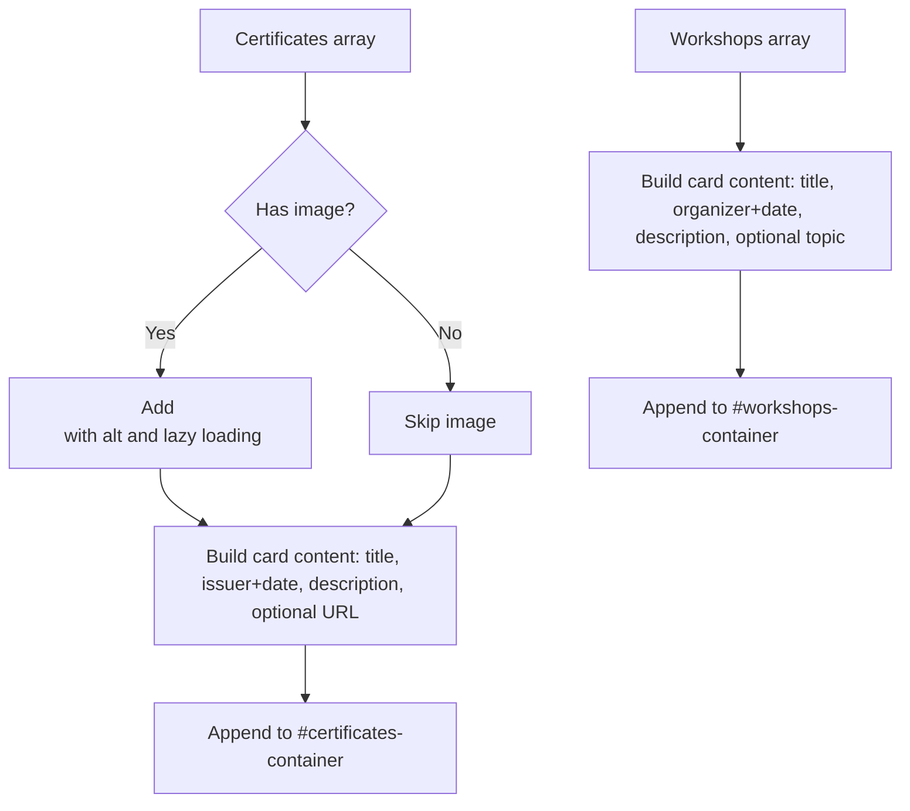

**Diagram sources**
- [main.js:264-288](file://main.js#L264-L288)

**Section sources**
- [main.js:264-288](file://main.js#L264-L288)

### Image Gallery Functionality for Credential Verification
- Certificate images are displayed within cards and use lazy loading to improve performance.
- If an image fails to load, the renderer hides the broken image element to keep the layout intact.
- Optional credential URLs allow users to verify certifications externally.

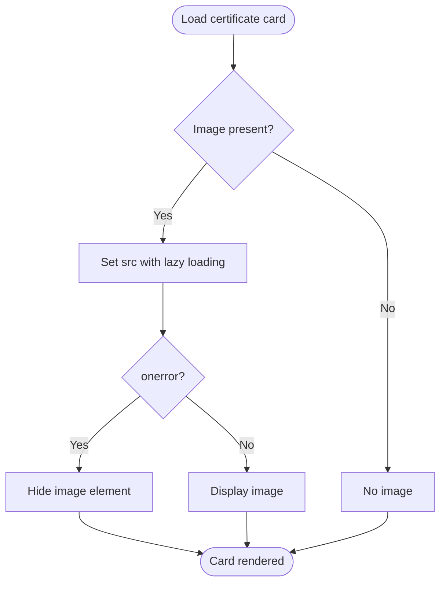

**Diagram sources**
- [main.js:264-276](file://main.js#L264-L276)

**Section sources**
- [main.js:264-276](file://main.js#L264-L276)

### Responsive Card Layouts and Styling
- Both certificates and workshops use a responsive CSS grid that auto-fills columns based on minimum card width.
- Cards share a common surface style with subtle borders, shadows, and hover effects.
- Certificate images have fixed height and cover fit to maintain uniformity.
- Typography and spacing are consistent across sections using shared variables and classes.

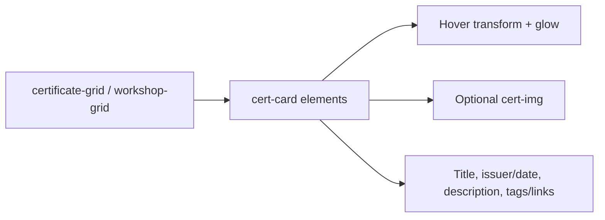

**Diagram sources**
- [style.css:1274-1319](file://style.css#L1274-L1319)

**Section sources**
- [style.css:1274-1319](file://style.css#L1274-L1319)

### File Upload Handling for Documents and Images
- Certificate model supports uploading an image and an optional PDF file under the certificates directory.
- Workshop model supports uploading an optional image under the workshops directory.
- The admin dashboard uses generic CRUD forms that accept file uploads for these models, saving them to storage and making them available via the API.

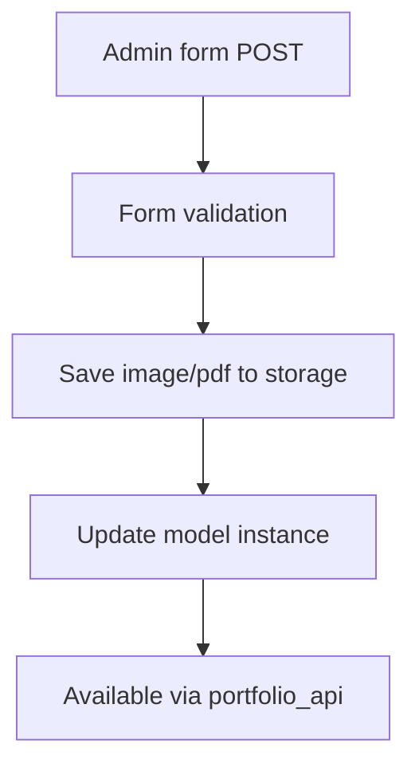

**Diagram sources**
- [models.py:130-165](file://portfolio/models.py#L130-L165)

**Section sources**
- [models.py:130-165](file://portfolio/models.py#L130-L165)

### Interactive Elements
- Certificate cards may include a “View Credential” button linking to the credential URL.
- Workshop cards can display a topic tag for quick categorization.
- Scroll reveal animations enhance visibility as users scroll to the sections.

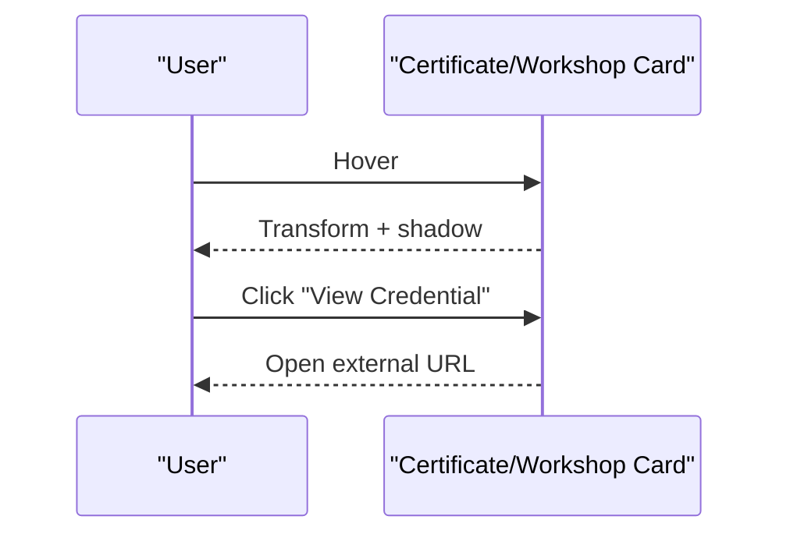

**Diagram sources**
- [main.js:264-288](file://main.js#L264-L288)
- [style.css:1274-1319](file://style.css#L1274-L1319)

**Section sources**
- [main.js:264-288](file://main.js#L264-L288)
- [style.css:1274-1319](file://style.css#L1274-L1319)

## Dependency Analysis
- Views depend on models to query and serialize data.
- Frontend depends on the API to obtain structured data.
- Rendering logic depends on DOM container IDs defined in the HTML.
- Styling depends on CSS classes used by the rendered markup.

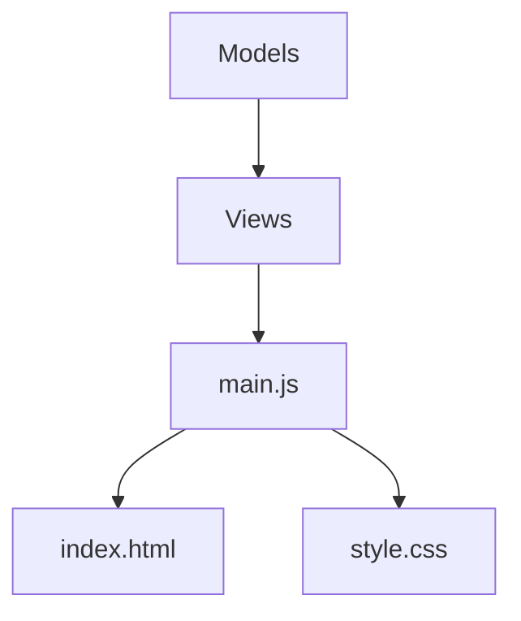

**Diagram sources**
- [models.py:130-165](file://portfolio/models.py#L130-L165)
- [views.py:335-457](file://portfolio/views.py#L335-L457)
- [index.html:231-249](file://index.html#L231-L249)
- [main.js:264-288](file://main.js#L264-L288)
- [style.css:1274-1319](file://style.css#L1274-L1319)

**Section sources**
- [models.py:130-165](file://portfolio/models.py#L130-L165)
- [views.py:335-457](file://portfolio/views.py#L335-L457)
- [index.html:231-249](file://index.html#L231-L249)
- [main.js:264-288](file://main.js#L264-L288)
- [style.css:1274-1319](file://style.css#L1274-L1319)

## Performance Considerations
- Use lazy loading for certificate images to reduce initial payload and improve perceived performance.
- Filter by visibility at the database level to avoid sending unnecessary records to the frontend.
- Keep card images sized appropriately to prevent layout shifts and excessive bandwidth usage.
- Avoid heavy client-side processing; rely on server-side serialization for clean, predictable payloads.

[No sources needed since this section provides general guidance]

## Troubleshooting Guide
- Missing images: The renderer hides broken images automatically; ensure uploaded images are correctly stored and accessible.
- Empty sections: If no certificates or workshops are published, an empty state will appear; add records via the admin dashboard.
- Links not opening: Verify credential URLs are valid and set in the certificate model.
- Visibility issues: Ensure is_visible is True for items you want to display on the front page.

**Section sources**
- [main.js:264-288](file://main.js#L264-L288)
- [views.py:424-435](file://portfolio/views.py#L424-L435)

## Conclusion
The Certifications and Workshops sections are built on a clear separation of concerns: robust data models, a concise API, straightforward frontend rendering, and consistent responsive styling. This design enables easy updates through the admin dashboard, reliable credential verification via links, and a polished user experience with interactive cards and graceful empty states.

[No sources needed since this section summarizes without analyzing specific files]