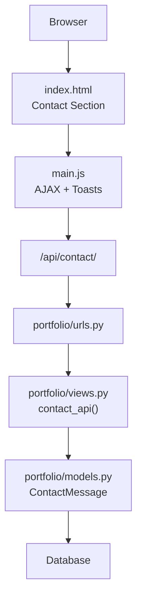
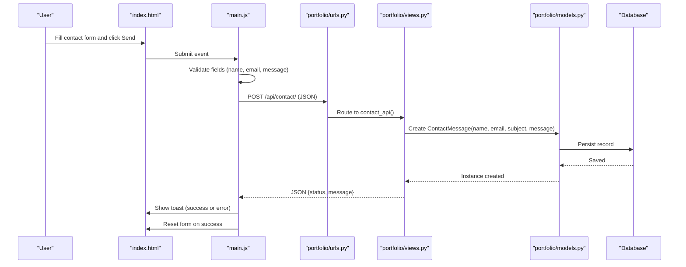
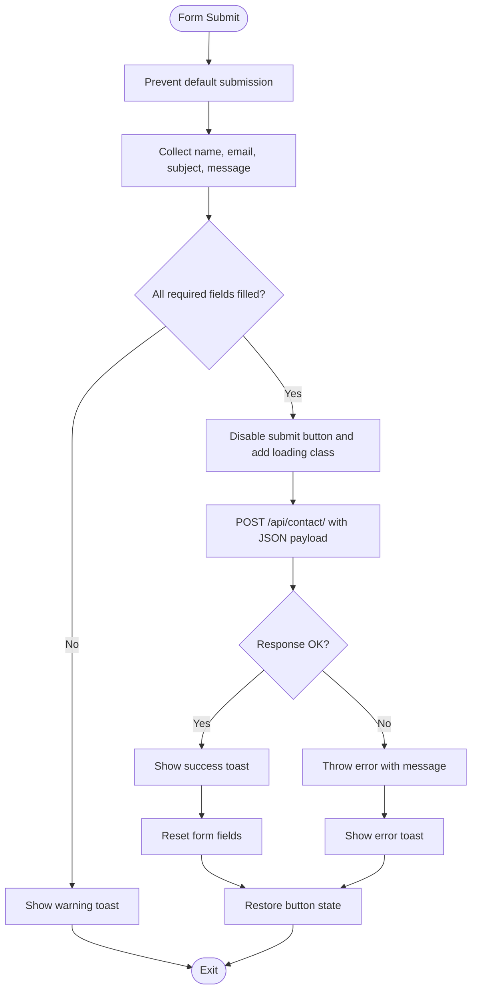
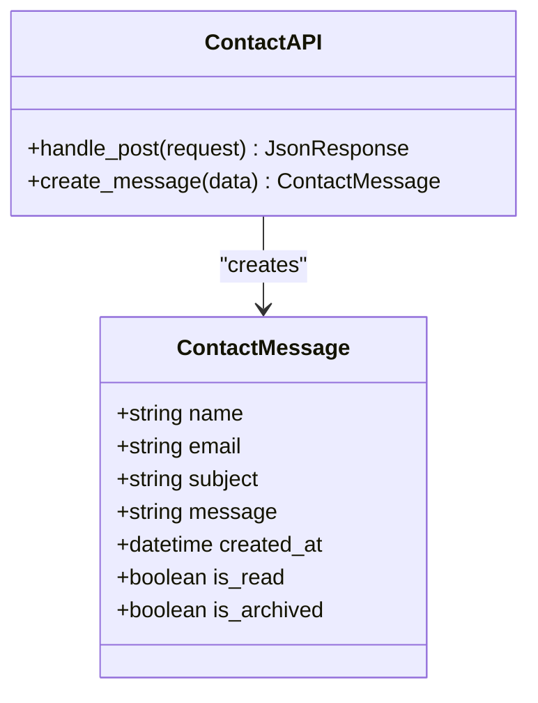
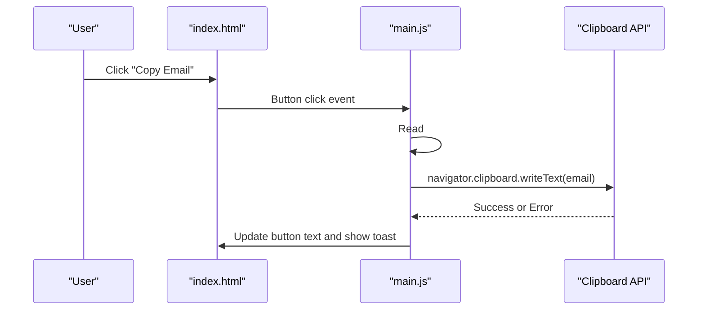
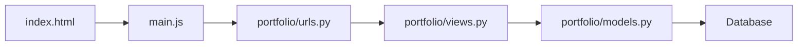

# Contact System

<cite>
**Referenced Files in This Document**
- [index.html](file://index.html)
- [main.js](file://main.js)
- [style.css](file://style.css)
- [portfolio/urls.py](file://portfolio/urls.py)
- [portfolio/views.py](file://portfolio/views.py)
- [portfolio/models.py](file://portfolio/models.py)
</cite>

## Table of Contents
1. [Introduction](#introduction)
2. [Project Structure](#project-structure)
3. [Core Components](#core-components)
4. [Architecture Overview](#architecture-overview)
5. [Detailed Component Analysis](#detailed-component-analysis)
6. [Dependency Analysis](#dependency-analysis)
7. [Performance Considerations](#performance-considerations)
8. [Troubleshooting Guide](#troubleshooting-guide)
9. [Conclusion](#conclusion)

## Introduction
This document explains the contact form system used by the portfolio site. It covers how the frontend contact form is structured, validated, and submitted via AJAX; how the Django backend receives, validates, and stores messages; how users receive feedback through toast notifications; and how contact information is displayed with copy-to-clipboard functionality and external link handling. It also documents styling for form fields, validation states, responsive layout, and integration between the static HTML page, JavaScript engine, Django views, models, and URL routing.

## Project Structure
The contact system spans both the public-facing static front end and the Django application:

- Public front end:
  - `index.html` contains the contact section, including the contact form and contact information cards.
  - `main.js` handles user interactions, including form submission and clipboard operations.
  - `style.css` provides shared design tokens, card styles, button styles, and loading animations.

- Django backend:
  - `portfolio/urls.py` maps `/api/contact/` to a view.
  - `portfolio/views.py` implements the contact API endpoint that persists messages.
  - `portfolio/models.py` defines the message model stored in the database.

**Diagram sources**
- [index.html:304-356](file://index.html#L304-L356)
- [main.js:683-733](file://main.js#L683-L733)
- [portfolio/urls.py:40-43](file://portfolio/urls.py#L40-L43)
- [portfolio/views.py:300-322](file://portfolio/views.py#L300-L322)
- [portfolio/models.py:265-275](file://portfolio/models.py#L265-L275)

**Section sources**
- [index.html:304-356](file://index.html#L304-L356)
- [main.js:683-733](file://main.js#L683-L733)
- [style.css:530-548](file://style.css#L530-L548)
- [portfolio/urls.py:40-43](file://portfolio/urls.py#L40-L43)
- [portfolio/views.py:300-322](file://portfolio/views.py#L300-L322)
- [portfolio/models.py:265-275](file://portfolio/models.py#L265-L275)

## Core Components
- Contact form UI:
  - The contact section includes a two-column grid with contact info on the left and the form on the right.
  - Fields include name, email, subject, and message.
  - A submit button displays a loading spinner during submission.

- Frontend interaction logic:
  - Form submission is intercepted, values are collected into a JSON payload, basic client-side validation is performed, and an AJAX POST request is sent to `/api/contact/`.
  - Success resets the form and shows a success toast; errors show an error toast.
  - Copy-to-clipboard reads the displayed email and uses the Clipboard API with fallback messaging.

- Backend API:
  - The Django view accepts JSON payloads, creates a `ContactMessage`, and returns a JSON response with status and message.
  - Non-POST requests return a method-not-allowed response.

- Data model:
  - `ContactMessage` stores name, email, subject, message, creation timestamp, read/archived flags.

**Section sources**
- [index.html:304-356](file://index.html#L304-L356)
- [main.js:665-733](file://main.js#L665-L733)
- [portfolio/views.py:300-322](file://portfolio/views.py#L300-L322)
- [portfolio/models.py:265-275](file://portfolio/models.py#L265-L275)

## Architecture Overview
The contact flow integrates the static page, JavaScript runtime, Django URL configuration, view logic, and database persistence.

**Diagram sources**
- [index.html:331-352](file://index.html#L331-L352)
- [main.js:683-733](file://main.js#L683-L733)
- [portfolio/urls.py:42](file://portfolio/urls.py#L42)
- [portfolio/views.py:300-322](file://portfolio/views.py#L300-L322)
- [portfolio/models.py:265-275](file://portfolio/models.py#L265-L275)

## Detailed Component Analysis

### Contact Form UI and Layout
- The contact section uses a responsive grid layout with a contact info column and a form column.
- Contact info includes:
  - Email display with a copy button.
  - GitHub profile link opening externally.
- The form includes:
  - Four required fields: name, email, subject, message.
  - A full-width primary submit button with a built-in loader indicator.

Styling highlights:
- Cards use shared panel surfaces with subtle borders and shadows.
- Buttons follow a consistent design system with primary, secondary, and outline variants.
- The submit button has a loading state controlled by CSS classes toggled by JavaScript.

Responsive behavior:
- Grid-based layout adapts across screen sizes.
- Typography scales using clamp-based sizing.
- Shared design tokens ensure consistent dark/light themes.

**Section sources**
- [index.html:304-356](file://index.html#L304-L356)
- [style.css:530-548](file://style.css#L530-L548)
- [style.css:661-732](file://style.css#L661-L732)

### Frontend Validation and Submission Flow
Client-side validation ensures essential fields are present before sending data to the server. On submit:
- Default form submission is prevented.
- Values are trimmed and assembled into a JSON object.
- If any required field is missing, a warning toast is shown and submission stops.
- The submit button is disabled and marked as loading while the request is in flight.
- The request is sent to `/api/contact/` with `Content-Type: application/json`.
- On success, a success toast is shown and the form is reset.
- On failure, an error toast is shown with the returned message.

**Diagram sources**
- [main.js:683-733](file://main.js#L683-L733)

**Section sources**
- [main.js:683-733](file://main.js#L683-L733)

### Backend API and Message Storage
The Django view `contact_api`:
- Expects POST requests with JSON bodies.
- Parses the request body and extracts name, email, subject, and message.
- Creates a new `ContactMessage` instance and saves it to the database.
- Returns a JSON response with status and message.
- Handles exceptions by returning an error JSON response.
- Rejects non-POST methods with a method-not-allowed response.

**Diagram sources**
- [portfolio/models.py:265-275](file://portfolio/models.py#L265-L275)
- [portfolio/views.py:300-322](file://portfolio/views.py#L300-L322)

**Section sources**
- [portfolio/views.py:300-322](file://portfolio/views.py#L300-L322)
- [portfolio/models.py:265-275](file://portfolio/models.py#L265-L275)

### URL Routing Integration
The URL configuration maps the contact API endpoint:
- `/api/contact/` routes to `views.contact_api`.

This allows the frontend to send AJAX requests to a stable, documented endpoint.

**Section sources**
- [portfolio/urls.py:40-43](file://portfolio/urls.py#L40-L43)

### Contact Information Display and External Links
- The contact email is rendered from the portfolio data injected by the JavaScript engine.
- The copy-to-clipboard button reads the email text content and writes it to the clipboard using the Clipboard API.
- External links (e.g., GitHub) open in new tabs with security attributes (`target="_blank"` and `rel="noopener"`).

**Diagram sources**
- [index.html:311-329](file://index.html#L311-L329)
- [main.js:665-681](file://main.js#L665-L681)

**Section sources**
- [index.html:311-329](file://index.html#L311-L329)
- [main.js:665-681](file://main.js#L665-L681)

### Styling Details for Forms, Validation States, and Responsive Layout
- Card surfaces:
  - `.about-card`, `.timeline-card`, `.cert-card`, `.skill-card`, `.project-card`, `.achievement-card`, `.service-card`, `.resume-preview`, `.contact-card`, `.contact-form` share a common surface style with background, border, radius, shadow, and hover transitions.

- Buttons:
  - `.btn-primary`, `.btn-secondary`, `.btn-outline`, `.btn-sm`, `.btn-full` define consistent button styles.
  - Submit button loading state is handled via `.loading` class and a spinner animation.

- Theme tokens:
  - Dark and light theme variables control backgrounds, panels, borders, text colors, and shadows.

- Responsive typography and spacing:
  - Section titles scale using `clamp`.
  - Grid layouts adapt to different viewport widths.

**Section sources**
- [style.css:530-548](file://style.css#L530-L548)
- [style.css:661-732](file://style.css#L661-L732)
- [style.css:8-56](file://style.css#L8-L56)

## Dependency Analysis
The contact system depends on:
- Static HTML structure defining the form and contact info.
- JavaScript engine handling events, validation, and network requests.
- Django URL configuration mapping endpoints.
- Django view processing requests and persisting data.
- Database model representing stored messages.

**Diagram sources**
- [index.html:304-356](file://index.html#L304-L356)
- [main.js:683-733](file://main.js#L683-L733)
- [portfolio/urls.py:40-43](file://portfolio/urls.py#L40-L43)
- [portfolio/views.py:300-322](file://portfolio/views.py#L300-L322)
- [portfolio/models.py:265-275](file://portfolio/models.py#L265-L275)

**Section sources**
- [index.html:304-356](file://index.html#L304-L356)
- [main.js:683-733](file://main.js#L683-L733)
- [portfolio/urls.py:40-43](file://portfolio/urls.py#L40-L43)
- [portfolio/views.py:300-322](file://portfolio/views.py#L300-L322)
- [portfolio/models.py:265-275](file://portfolio/models.py#L265-L275)

## Performance Considerations
- Client-side validation reduces unnecessary network requests.
- The submit button is disabled during requests to prevent duplicate submissions.
- Toast notifications provide immediate feedback without page reloads.
- External links use `target="_blank"` and `rel="noopener"` for performance and security best practices.
- CSS animations and transitions are hardware-accelerated where possible.

[No sources needed since this section provides general guidance]

## Troubleshooting Guide
Common issues and resolutions:
- Form does not submit:
  - Ensure all required fields are filled; otherwise, a warning toast appears.
  - Check browser console for JavaScript errors.
- Network request fails:
  - Verify `/api/contact/` is reachable and returns JSON.
  - Confirm CORS settings if hosted cross-origin.
- Clipboard copy fails:
  - Some browsers require secure contexts (HTTPS) for clipboard access.
  - Fallback toast informs users to select manually.
- Backend errors:
  - Inspect server logs for exceptions in `contact_api`.
  - Ensure the database is configured and migrations applied.

**Section sources**
- [main.js:683-733](file://main.js#L683-L733)
- [portfolio/views.py:300-322](file://portfolio/views.py#L300-L322)

## Conclusion
The contact system combines a clean, accessible form UI with robust client-side validation, smooth AJAX submission, clear user feedback, and reliable backend storage. The architecture is straightforward: static HTML defines the interface, JavaScript orchestrates interactions, Django routes and views handle requests, and the model persists data. Styling follows a consistent design system with responsive layout and theme support. With proper configuration and monitoring, the system provides a dependable way for visitors to reach out and for administrators to review messages.

[No sources needed since this section summarizes without analyzing specific files]