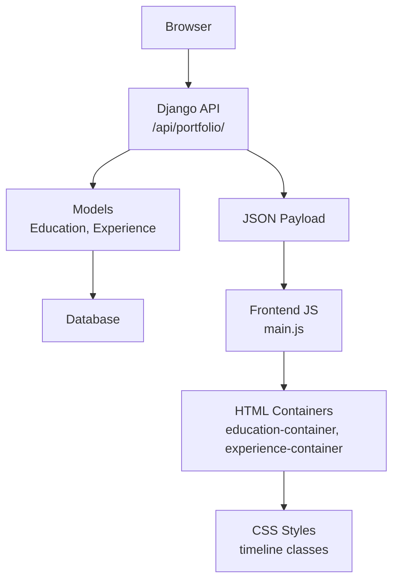
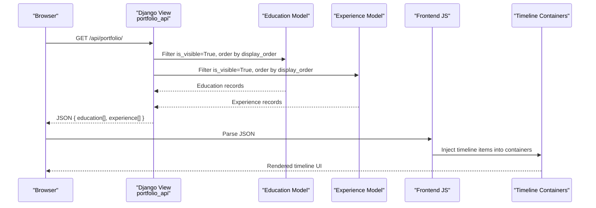
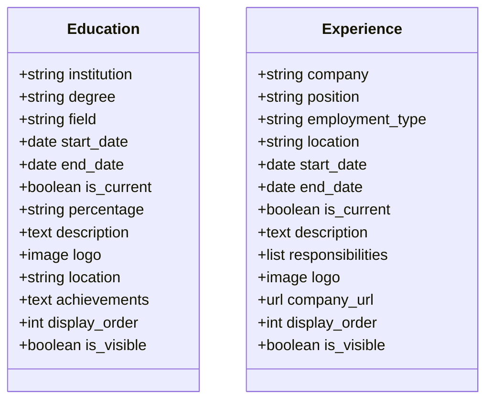
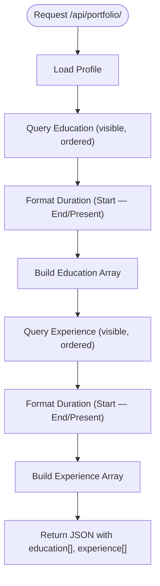
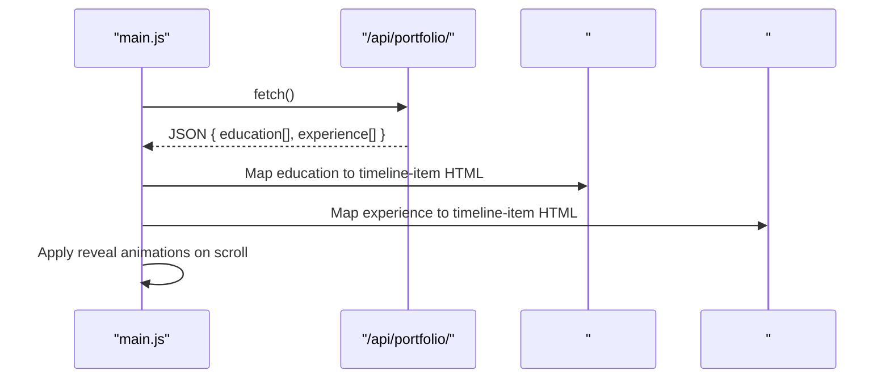
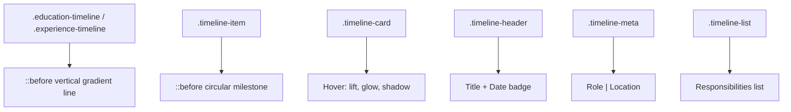
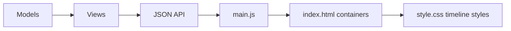

# Education & Experience Timelines

<cite>
**Referenced Files in This Document**
- [models.py](file://portfolio/models.py)
- [views.py](file://portfolio/views.py)
- [index.html](file://index.html)
- [main.js](file://main.js)
- [style.css](file://style.css)
</cite>

## Table of Contents
1. [Introduction](#introduction)
2. [Project Structure](#project-structure)
3. [Core Components](#core-components)
4. [Architecture Overview](#architecture-overview)
5. [Detailed Component Analysis](#detailed-component-analysis)
6. [Dependency Analysis](#dependency-analysis)
7. [Performance Considerations](#performance-considerations)
8. [Troubleshooting Guide](#troubleshooting-guide)
9. [Conclusion](#conclusion)

## Introduction
This document explains how the portfolio’s education and experience timelines are modeled, served, and rendered. It covers:
- Data models for academic qualifications and professional history
- API integration that loads dynamic content from the database
- Frontend rendering into timeline layouts with institution/company logos, date ranges, and chronological ordering
- Styling for timeline connectors, milestone markers, hover effects, and responsive behavior

## Project Structure
The timeline feature spans backend models, a single API endpoint, and frontend HTML/JS/CSS:
- Backend data models define education and experience records
- A Django view serializes these records into JSON
- The static front page contains container elements for each timeline
- JavaScript fetches data and injects timeline items
- CSS styles the timeline layout, connectors, and interactive states

**Diagram sources**
- [views.py:335-457](file://portfolio/views.py#L335-L457)
- [models.py:49-89](file://portfolio/models.py#L49-L89)
- [index.html:194-212](file://index.html#L194-L212)
- [main.js:88-103](file://main.js#L88-L103)
- [style.css:1018-1123](file://style.css#L1018-L1123)

**Section sources**
- [models.py:49-89](file://portfolio/models.py#L49-L89)
- [views.py:335-457](file://portfolio/views.py#L335-L457)
- [index.html:194-212](file://index.html#L194-L212)
- [main.js:88-103](file://main.js#L88-L103)
- [style.css:1018-1123](file://style.css#L1018-L1123)

## Core Components
- Education model: stores institution, degree, field, dates, percentage, description, logo, location, achievements, visibility, and display order
- Experience model: stores company, position, employment type, location, dates, description, responsibilities (list), logo, company URL, visibility, and display order
- Portfolio API: returns serialized education and experience arrays with formatted durations and media URLs
- Frontend containers: HTML sections with IDs for education and experience timelines
- Rendering logic: JavaScript maps API data to timeline cards and lists
- Styling: CSS defines timeline connectors, milestone markers, card hover effects, and responsive behavior

**Section sources**
- [models.py:49-89](file://portfolio/models.py#L49-L89)
- [views.py:335-457](file://portfolio/views.py#L335-L457)
- [index.html:194-212](file://index.html#L194-L212)
- [main.js:221-255](file://main.js#L221-L255)
- [style.css:1018-1123](file://style.css#L1018-L1123)

## Architecture Overview
The timeline system uses a clean separation between data, API, and presentation:
- Models define structured records with ordering and visibility flags
- The API aggregates visible records and formats human-friendly date ranges
- The frontend renders timeline items using reusable templates and applies consistent styling

**Diagram sources**
- [views.py:335-457](file://portfolio/views.py#L335-L457)
- [models.py:49-89](file://portfolio/models.py#L49-L89)
- [main.js:88-103](file://main.js#L88-L103)
- [main.js:221-255](file://main.js#L221-L255)

## Detailed Component Analysis

### Data Models: Education and Experience
- Education fields include institution, degree, field, start/end dates, current flag, percentage, description, logo image, location, optional achievements, display order, and visibility
- Experience fields include company, position, employment type, location, start/end dates, current flag, description, responsibilities list, logo image, optional company URL, display order, and visibility
- Both models use display_order for chronological sorting and is_visible to control public exposure

**Diagram sources**
- [models.py:49-89](file://portfolio/models.py#L49-L89)

**Section sources**
- [models.py:49-89](file://portfolio/models.py#L49-L89)

### API Integration: Dynamic Content Loading
- The portfolio API endpoint returns a JSON object containing personal info, socials, hero roles, technologies, stats, education, experience, skills, certificates, workshops, projects, achievements, and services
- Education entries include institution, course string combining degree and field, duration formatted via a helper, percentage, description, and logo URL
- Experience entries include company, role, employment type, duration, location, outcomes, responsibilities list, and an empty technologies array placeholder
- Date range formatting converts start/end dates to “Mon YYYY” strings and handles “Present” for current roles or degrees

**Diagram sources**
- [views.py:324-370](file://portfolio/views.py#L324-L370)
- [views.py:335-457](file://portfolio/views.py#L335-L457)

**Section sources**
- [views.py:324-370](file://portfolio/views.py#L324-L370)
- [views.py:335-457](file://portfolio/views.py#L335-L457)

### Frontend Rendering: Timeline Construction
- The HTML includes two dedicated containers: one for education and one for experience
- JavaScript fetches the portfolio API, merges data into a global state, and calls render functions
- For education, each item becomes a timeline card with institution title, formatted duration badge, course and percentage metadata, and optional description
- For experience, each item becomes a timeline card with company title, formatted duration badge, role and location metadata, optional outcomes, and an optional responsibilities list
- Empty states are shown when no records exist

**Diagram sources**
- [index.html:194-212](file://index.html#L194-L212)
- [main.js:88-103](file://main.js#L88-L103)
- [main.js:221-255](file://main.js#L221-L255)
- [main.js:636-655](file://main.js#L636-L655)

**Section sources**
- [index.html:194-212](file://index.html#L194-L212)
- [main.js:88-103](file://main.js#L88-L103)
- [main.js:221-255](file://main.js#L221-L255)
- [main.js:636-655](file://main.js#L636-L655)

### Styling: Timeline Connectors, Milestones, Hover Effects, Responsiveness
- Timeline containers are left-padded with a vertical connector line created via pseudo-elements
- Each timeline item has a circular milestone marker positioned along the connector
- Cards have hover effects that elevate them slightly, increase border glow, and add shadow
- Date badges use monospace font and accent colors for clear readability
- Lists inside experience cards style responsibilities consistently
- Responsive behavior ensures proper spacing and wrapping across screen sizes

**Diagram sources**
- [style.css:1018-1123](file://style.css#L1018-L1123)

**Section sources**
- [style.css:1018-1123](file://style.css#L1018-L1123)

## Dependency Analysis
- Views depend on models to query and serialize data
- Frontend depends on the API contract for education and experience fields
- HTML provides structural anchors for JS injection
- CSS relies on specific class names generated by JS to style timeline components

**Diagram sources**
- [models.py:49-89](file://portfolio/models.py#L49-L89)
- [views.py:335-457](file://portfolio/views.py#L335-L457)
- [index.html:194-212](file://index.html#L194-L212)
- [main.js:221-255](file://main.js#L221-L255)
- [style.css:1018-1123](file://style.css#L1018-L1123)

**Section sources**
- [models.py:49-89](file://portfolio/models.py#L49-L89)
- [views.py:335-457](file://portfolio/views.py#L335-L457)
- [index.html:194-212](file://index.html#L194-L212)
- [main.js:221-255](file://main.js#L221-L255)
- [style.css:1018-1123](file://style.css#L1018-L1123)

## Performance Considerations
- Use is_visible flags to reduce payload size by excluding hidden records
- Leverage display_order to avoid client-side sorting
- Keep descriptions concise to minimize DOM size and improve rendering speed
- Lazy-load images where possible; ensure fallbacks for missing assets
- Debounce or limit heavy animations if many timeline items are present

[No sources needed since this section provides general guidance]

## Troubleshooting Guide
- Missing API response: Check network tab for errors and verify the profile exists; the API returns a 404 if no profile is configured
- Empty timelines: Ensure records have is_visible set to true and valid dates; check that logo paths resolve correctly
- Incorrect date ranges: Verify start_date and end_date values; current roles/degrees should set is_current to true so durations show “Present”
- Styling issues: Confirm container IDs match those used by JS; ensure CSS classes are present in injected HTML
- Accessibility: Add alt text for logos and ensure keyboard navigation works for timeline cards

**Section sources**
- [views.py:335-343](file://portfolio/views.py#L335-L343)
- [main.js:221-255](file://main.js#L221-L255)
- [style.css:1018-1123](file://style.css#L1018-L1123)

## Conclusion
The education and experience timelines are built on a robust data model, a centralized API, and a flexible frontend renderer. Chronological ordering is enforced via display_order, while visibility flags control public exposure. The API formats date ranges consistently, and the frontend constructs accessible, styled timeline cards with connectors, milestones, and hover effects. This design supports easy updates through the admin interface and scales well as more records are added.

[No sources needed since this section summarizes without analyzing specific files]