# Hero Section

<cite>
**Referenced Files in This Document**
- [index.html](file://index.html)
- [main.js](file://main.js)
- [style.css](file://style.css)
</cite>

## Table of Contents
1. [Introduction](#introduction)
2. [Project Structure](#project-structure)
3. [Core Components](#core-components)
4. [Architecture Overview](#architecture-overview)
5. [Detailed Component Analysis](#detailed-component-analysis)
6. [Dependency Analysis](#dependency-analysis)
7. [Performance Considerations](#performance-considerations)
8. [Troubleshooting Guide](#troubleshooting-guide)
9. [Conclusion](#conclusion)

## Introduction
This document explains the hero section implementation, including:
- Animated role display with a typing-like effect and dynamic rotation
- Profile image management with fallback handling
- Social media integration links container
- Call-to-action buttons
- JavaScript interactivity for dynamic role rotation, smooth scrolling navigation, and theme switching
- CSS animations for profile ring, glow effects, and responsive design patterns
- Loading screen implementation and background system with mesh, grid, and noise layers

## Project Structure
The hero section is composed of HTML markup, CSS styling, and JavaScript behavior:
- HTML defines the hero layout, profile image, socials container, CTAs, and background layers
- CSS provides theming, animations (morphing, rotating ring, glow), and responsive rules
- JavaScript initializes loader, theme, cursor, content injection, navigation, and animations

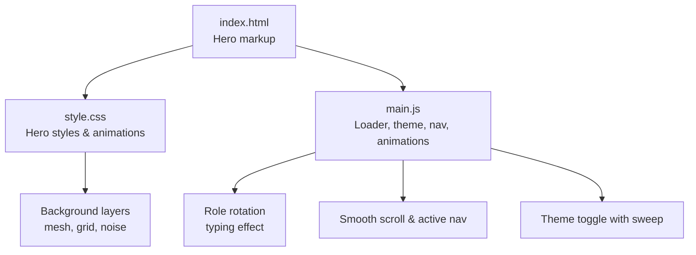

**Diagram sources**
- [index.html:64-150](file://index.html#L64-L150)
- [style.css:187-590](file://style.css#L187-L590)
- [main.js:47-91](file://main.js#L47-L91)
- [main.js:297-366](file://main.js#L297-L366)

**Section sources**
- [index.html:64-150](file://index.html#L64-L150)
- [style.css:187-590](file://style.css#L187-L590)
- [main.js:47-91](file://main.js#L47-L91)
- [main.js:297-366](file://main.js#L297-L366)

## Core Components
- Hero layout: two-column grid with text and visual elements
- Role animation: blinking caret and periodic role rotation
- Profile image: organic morph shape, dashed rotating ring, and gradient glow
- Socials container: placeholder for social links
- CTAs: primary, secondary, and outline buttons
- Background system: fixed layered backdrop with mesh gradients, subtle grid, and noise texture
- Loader: overlay with animated progress bar and logo pulse
- Theme switcher: click-based theme toggle with a circular sweep transition

**Section sources**
- [index.html:114-150](file://index.html#L114-L150)
- [style.css:382-590](file://style.css#L382-L590)
- [style.css:1365-1440](file://style.css#L1365-L1440)
- [main.js:47-91](file://main.js#L47-L91)
- [main.js:327-340](file://main.js#L327-L340)

## Architecture Overview
The hero section integrates three layers:
- Presentation layer (HTML): structure and semantic elements
- Styling layer (CSS): themes, transitions, keyframe animations, responsive rules
- Behavior layer (JS): initialization sequence, event handling, DOM updates

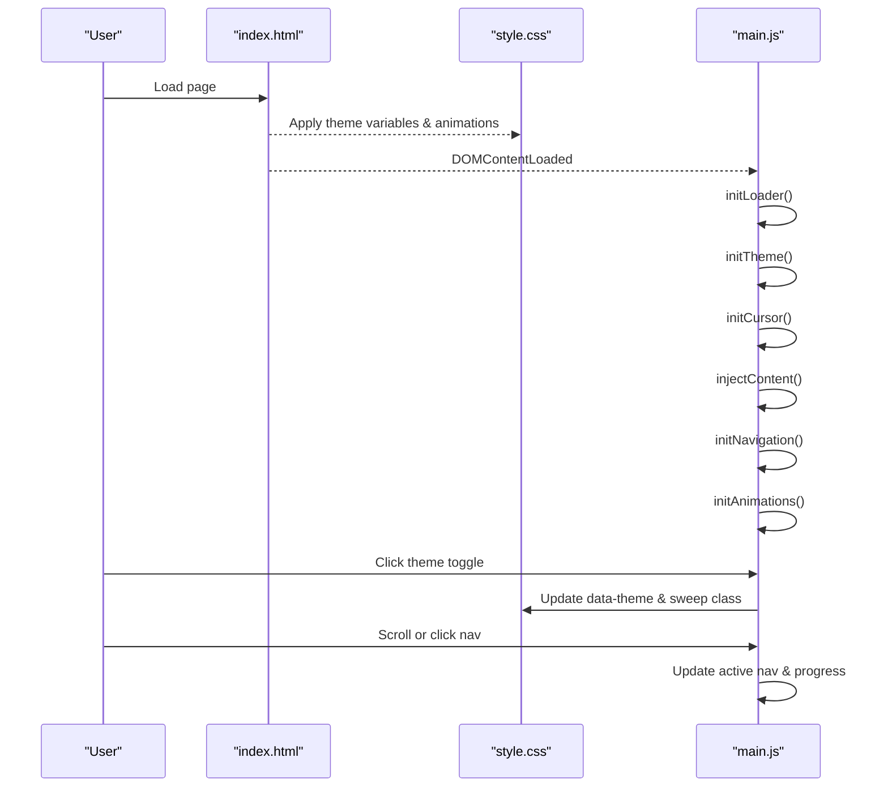

**Diagram sources**
- [index.html:56-150](file://index.html#L56-L150)
- [style.css:37-49](file://style.css#L37-L49)
- [style.css:1425-1440](file://style.css#L1425-L1440)
- [main.js:32-41](file://main.js#L32-L41)
- [main.js:47-91](file://main.js#L47-L91)
- [main.js:297-325](file://main.js#L297-L325)

## Detailed Component Analysis

### Animated Role Display (Typing Effect and Rotation)
- The role text uses a blinking caret to simulate typing and rotates through a predefined list at intervals
- On each interval, the element fades out, updates its text, then fades back in
- The caret blink is handled via CSS keyframes on the role text border

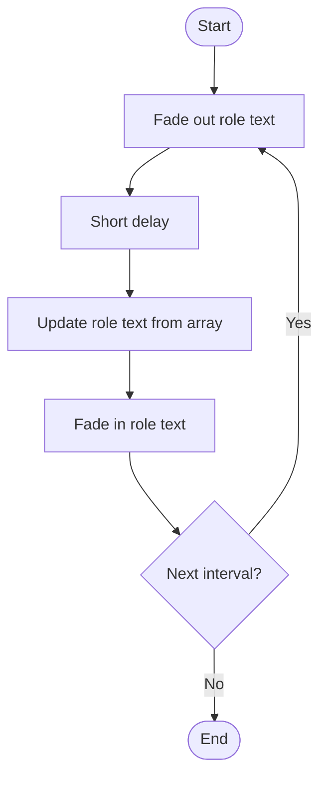

**Diagram sources**
- [main.js:327-340](file://main.js#L327-L340)
- [style.css:406-424](file://style.css#L406-L424)

**Section sources**
- [index.html:121-124](file://index.html#L121-L124)
- [main.js:327-340](file://main.js#L327-L340)
- [style.css:406-424](file://style.css#L406-L424)

### Profile Image Management with Fallback Handling
- The profile image has an organic morphing border-radius animation
- A dashed ring rotates around the image for visual emphasis
- A blurred gradient glow sits behind the image
- If the main image fails to load, a placeholder is used via an inline error handler

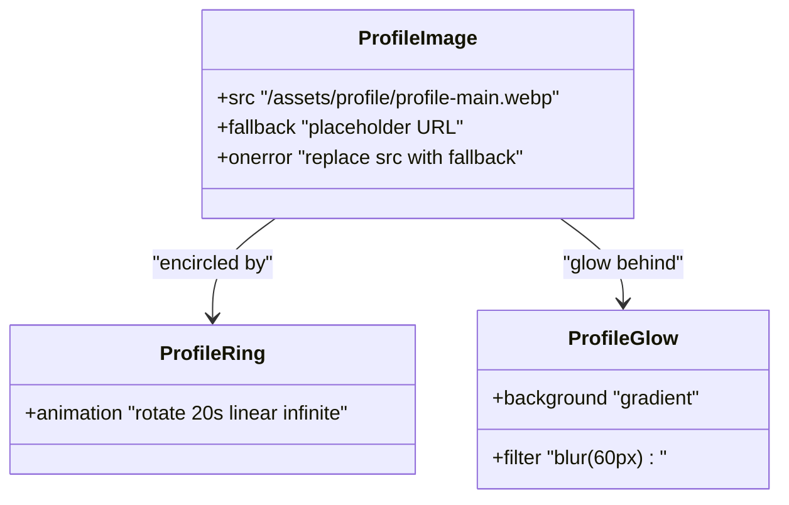

**Diagram sources**
- [index.html:136-143](file://index.html#L136-L143)
- [style.css:504-550](file://style.css#L504-L550)

**Section sources**
- [index.html:136-143](file://index.html#L136-L143)
- [style.css:504-550](file://style.css#L504-L550)

### Social Media Integration Links
- The hero includes a dedicated container for social links
- Styles define link sizing, borders, hover states, and color transitions
- Populate this container dynamically or statically with your social URLs and icons

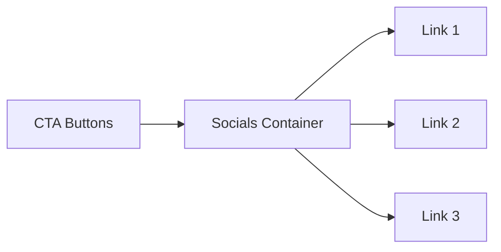

**Diagram sources**
- [index.html:129-134](file://index.html#L129-L134)
- [style.css:480-502](file://style.css#L480-L502)

**Section sources**
- [index.html:129-134](file://index.html#L129-L134)
- [style.css:480-502](file://style.css#L480-L502)

### Call-to-Action Buttons
- Three button variants are available: primary (gradient), secondary (panel), and outline (accent border)
- Hover states include elevation and shadow changes
- Buttons wrap around anchor tags for navigation or downloads

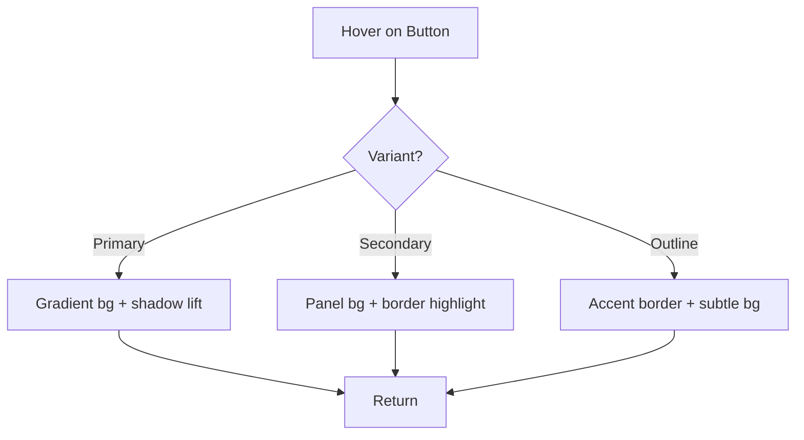

**Diagram sources**
- [style.css:432-478](file://style.css#L432-L478)
- [index.html:129-133](file://index.html#L129-L133)

**Section sources**
- [index.html:129-133](file://index.html#L129-L133)
- [style.css:432-478](file://style.css#L432-L478)

### JavaScript Interactivity
- Dynamic role rotation: setInterval updates the role text with fade transitions
- Smooth scrolling navigation: CSS scroll-behavior plus JS to update active nav items and scroll progress
- Theme switching: toggles data-theme attribute and triggers a circular sweep animation

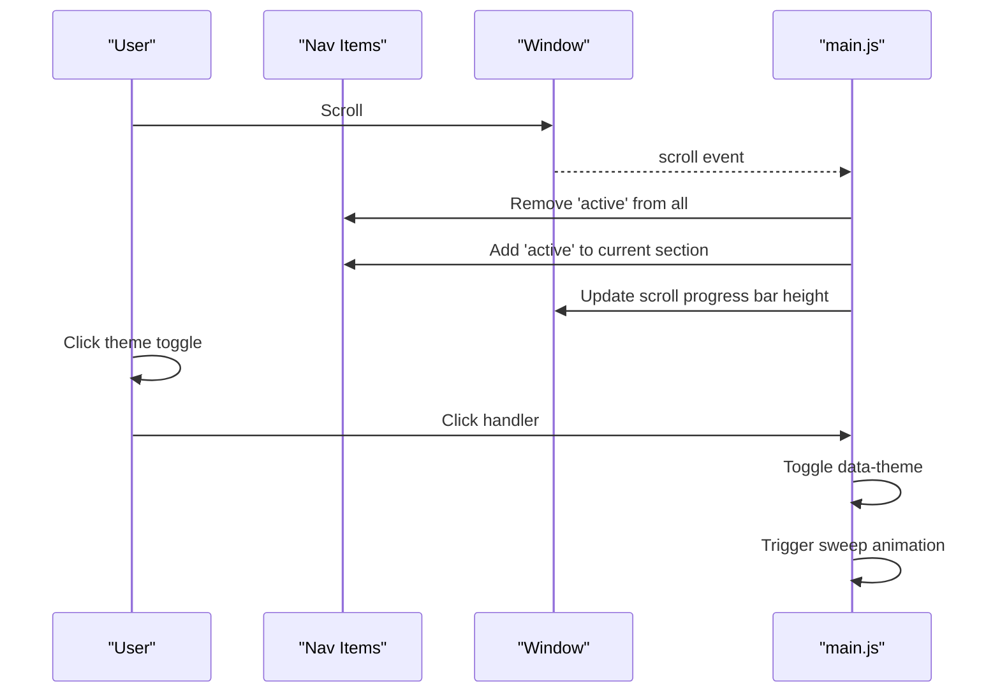

**Diagram sources**
- [main.js:297-325](file://main.js#L297-L325)
- [main.js:69-91](file://main.js#L69-L91)
- [style.css:1425-1440](file://style.css#L1425-L1440)

**Section sources**
- [main.js:327-340](file://main.js#L327-L340)
- [main.js:297-325](file://main.js#L297-L325)
- [main.js:69-91](file://main.js#L69-L91)
- [style.css:75-77](file://style.css#L75-L77)
- [style.css:363-380](file://style.css#L363-L380)

### CSS Animations and Responsive Design
- Profile morph: continuously animates border-radius for an organic shape
- Rotating ring: dashed circle rotates infinitely
- Glow: blurred gradient behind the profile image
- Mesh drift: slow background gradient movement
- Grid mask: subtle grid pattern masked radially
- Noise: SVG-based noise overlay for texture
- Responsive: stacks hero columns, reorders visual/text, adjusts navigation to bottom bar on small screens

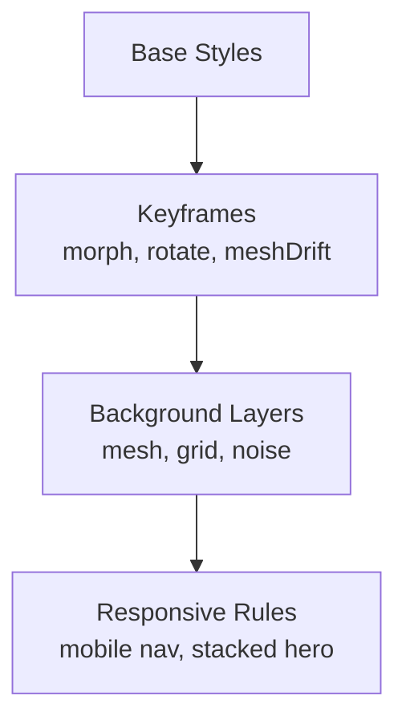

**Diagram sources**
- [style.css:214-236](file://style.css#L214-L236)
- [style.css:522-541](file://style.css#L522-L541)
- [style.css:1445-1520](file://style.css#L1445-L1520)

**Section sources**
- [style.css:214-236](file://style.css#L214-L236)
- [style.css:522-541](file://style.css#L522-L541)
- [style.css:1445-1520](file://style.css#L1445-L1520)

### Loading Screen Implementation
- Full-screen overlay with logo and progress bar
- Automatically hides after a timeout or when the window loads
- Removes loading state from body to reveal content

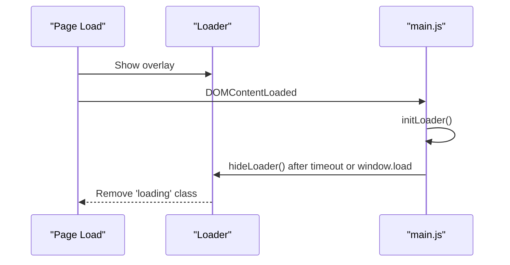

**Diagram sources**
- [index.html:64-70](file://index.html#L64-L70)
- [main.js:47-67](file://main.js#L47-L67)
- [style.css:1365-1423](file://style.css#L1365-L1423)

**Section sources**
- [index.html:64-70](file://index.html#L64-L70)
- [main.js:47-67](file://main.js#L47-L67)
- [style.css:1365-1423](file://style.css#L1365-L1423)

### Background System (Mesh, Grid, Noise)
- Mesh: large radial gradients with slow drift animation
- Grid: repeating lines with radial mask to fade edges
- Noise: inline SVG filter applied as background for subtle grain

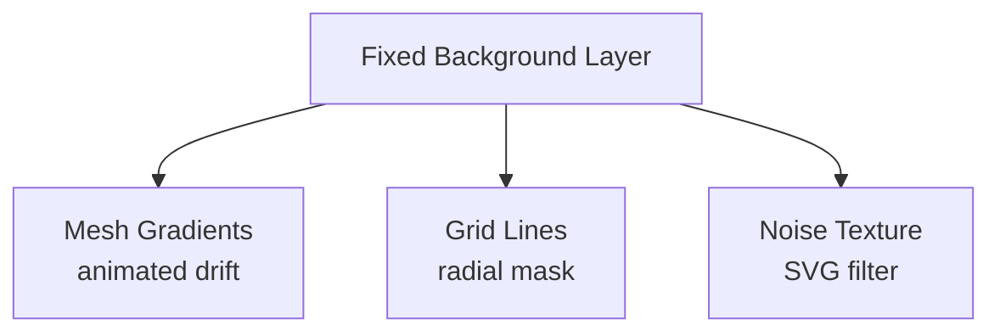

**Diagram sources**
- [index.html:72-77](file://index.html#L72-L77)
- [style.css:187-236](file://style.css#L187-L236)

**Section sources**
- [index.html:72-77](file://index.html#L72-L77)
- [style.css:187-236](file://style.css#L187-L236)

## Dependency Analysis
- index.html depends on style.css for visuals and main.js for behavior
- main.js orchestrates initialization order: loader, theme, cursor, content injection, navigation, animations
- CSS variables control theme appearance; theme toggle updates data-theme on the root element
- Hero interactions rely on IDs defined in HTML (e.g., dynamic-role, theme-toggle, side-nav)

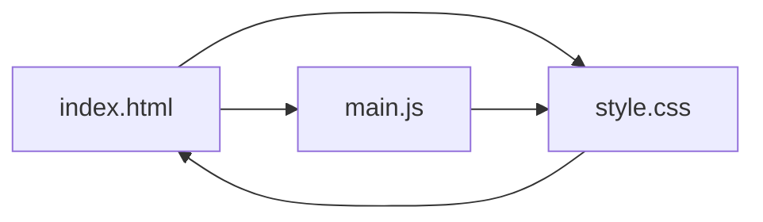

**Diagram sources**
- [index.html:53-55](file://index.html#L53-L55)
- [index.html:410-412](file://index.html#L410-L412)
- [main.js:32-41](file://main.js#L32-L41)
- [style.css:7-49](file://style.css#L7-L49)

**Section sources**
- [index.html:53-55](file://index.html#L53-L55)
- [index.html:410-412](file://index.html#L410-L412)
- [main.js:32-41](file://main.js#L32-L41)
- [style.css:7-49](file://style.css#L7-L49)

## Performance Considerations
- Use requestAnimationFrame for heavy animations if extending beyond current scope
- Debounce scroll handlers if adding more frequent updates
- Prefer CSS transforms and opacity for animations to leverage GPU acceleration
- Keep images optimized (WebP/AVIF) and use lazy loading where appropriate
- Avoid excessive DOM queries inside scroll/mousemove loops; cache selectors

[No sources needed since this section provides general guidance]

## Troubleshooting Guide
- Role not updating: ensure the element ID matches and the script runs after DOM ready
- Profile image fallback not showing: verify the onerror handler path and that the placeholder URL is accessible
- Theme toggle not working: confirm the theme toggle button ID exists and the sweep element is present
- Smooth scroll not working: check that CSS scroll-behavior is set and sections have correct IDs
- Loader stuck: inspect whether hideLoader is called and body.loading class is removed

**Section sources**
- [main.js:327-340](file://main.js#L327-L340)
- [index.html:139](file://index.html#L139)
- [main.js:69-91](file://main.js#L69-L91)
- [style.css:75-77](file://style.css#L75-L77)
- [main.js:47-67](file://main.js#L47-L67)

## Conclusion
The hero section combines a clean layout, engaging animations, and robust interactivity. The role rotation creates a dynamic introduction, while the profile image’s morph, ring, and glow provide visual depth. The background system adds atmosphere without distracting from content. JavaScript ensures smooth navigation, theme switching, and a polished loading experience. With clear separation between HTML, CSS, and JS, the hero is maintainable and extensible.

[No sources needed since this section summarizes without analyzing specific files]