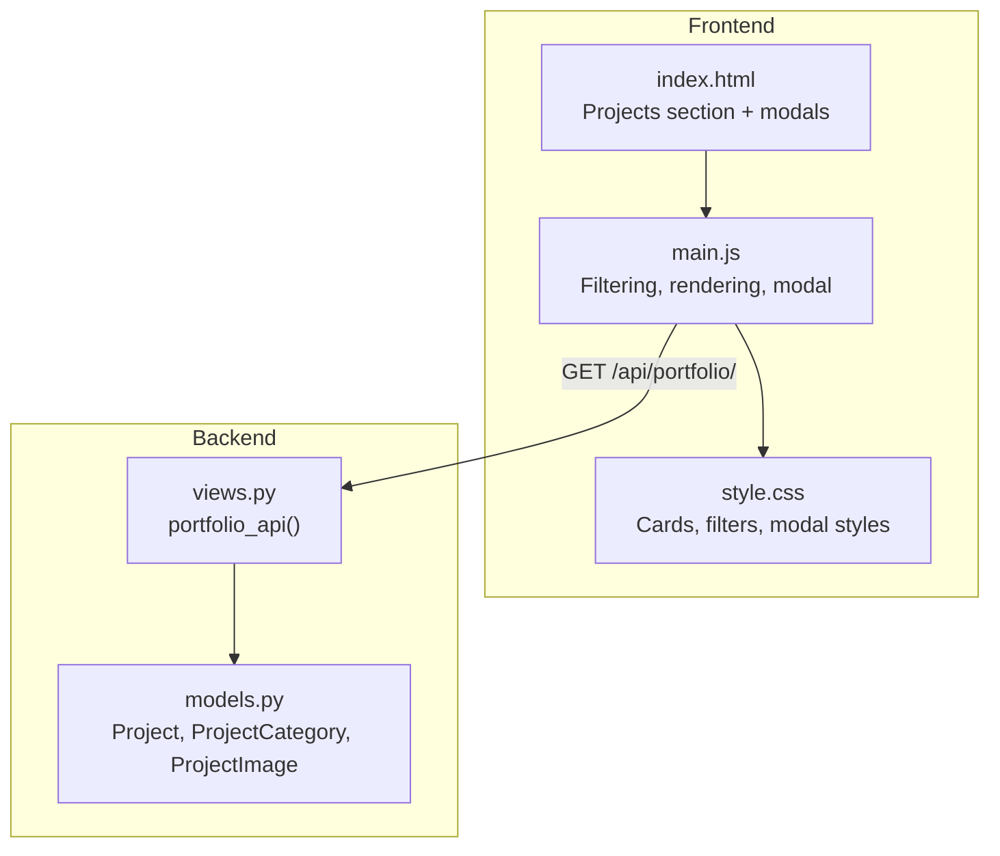
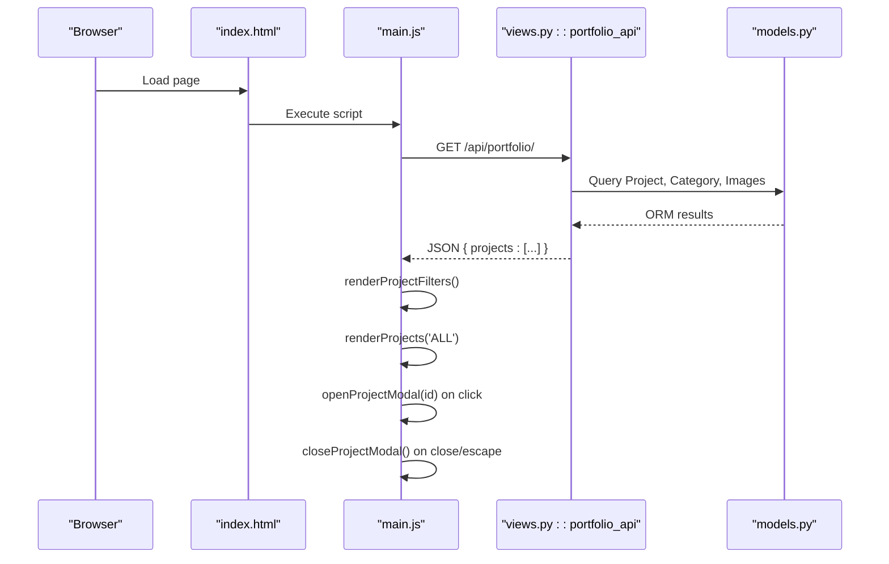
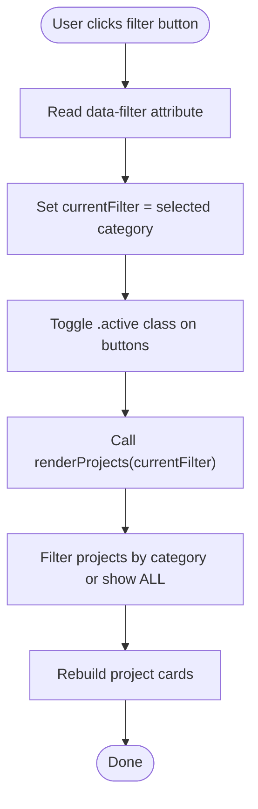
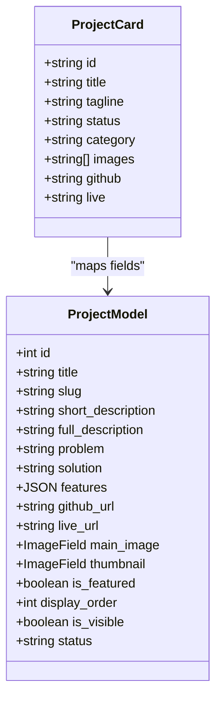
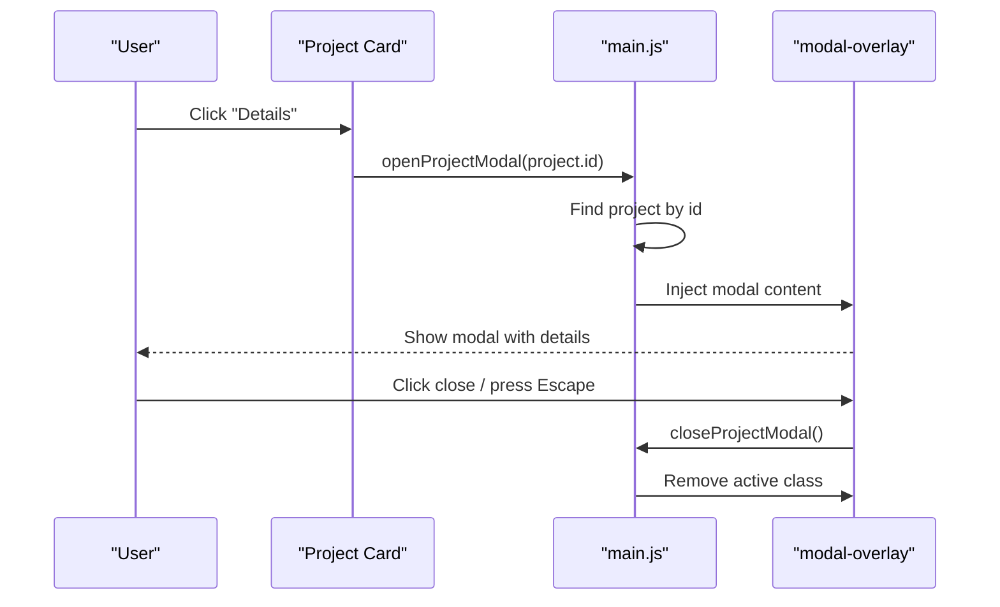
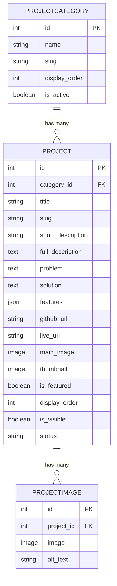
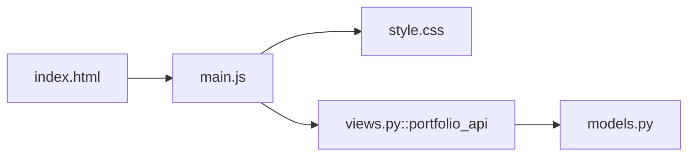

# Projects Gallery

<cite>
**Referenced Files in This Document**   
- [index.html](file://index.html)
- [main.js](file://main.js)
- [style.css](file://style.css)
- [portfolio/views.py](file://portfolio/views.py)
- [portfolio/models.py](file://portfolio/models.py)
</cite>

## Table of Contents
1. [Introduction](#introduction)
2. [Project Structure](#project-structure)
3. [Core Components](#core-components)
4. [Architecture Overview](#architecture-overview)
5. [Detailed Component Analysis](#detailed-component-analysis)
6. [Dependency Analysis](#dependency-analysis)
7. [Performance Considerations](#performance-considerations)
8. [Troubleshooting Guide](#troubleshooting-guide)
9. [Conclusion](#conclusion)

## Introduction
This document explains the Projects Gallery feature: category filtering, project card layout with images and descriptions, and modal popup for detailed project views. It also documents data binding to the Django Project model, image optimization strategies, responsive grid behavior, styling for cards and filters, and modal interactions.

The gallery is a client-side component that consumes a single JSON endpoint from Django. The frontend renders filter buttons dynamically based on available categories, builds project cards from the API payload, and opens a modal with extended details when users click “Details”.

## Project Structure
The gallery spans three layers:
- Data layer (Django models and API view)
- Frontend HTML structure
- Frontend JavaScript logic and CSS styling

**Diagram sources**
- [index.html:251-262](file://index.html#L251-L262)
- [main.js:88-103](file://main.js#L88-L103)
- [portfolio/views.py:335-457](file://portfolio/views.py#L335-L457)
- [portfolio/models.py:167-207](file://portfolio/models.py#L167-L207)

**Section sources**
- [index.html:251-262](file://index.html#L251-L262)
- [main.js:88-103](file://main.js#L88-L103)
- [portfolio/views.py:335-457](file://portfolio/views.py#L335-L457)
- [portfolio/models.py:167-207](file://portfolio/models.py#L167-L207)

## Core Components
- Category filter buttons: generated dynamically from project categories; include an “ALL” option.
- Project cards: display first gallery image, status badge, category tag, title, tagline, links, and a “Details” button.
- Modal popup: shows hero image, title, tagline, description, optional problem/solution sections, features list, and external links.
- Data source: Django API returns normalized project objects including id, title, tagline, status, category, description, problem, solution, features, github/live URLs, and images array.

Key responsibilities:
- main.js: fetches portfolio data, builds filters, renders projects, handles modal open/close.
- style.css: defines responsive grid, card hover effects, filter button states, and modal overlay/content.
- views.py: aggregates Project, ProjectCategory, and ProjectImage into a flat JSON object.
- models.py: defines Project, ProjectCategory, and ProjectImage relationships.

**Section sources**
- [main.js:485-548](file://main.js#L485-L548)
- [main.js:738-799](file://main.js#L738-L799)
- [style.css:1323-1453](file://style.css#L1323-L1453)
- [style.css:1762-1905](file://style.css#L1762-L1905)
- [portfolio/views.py:436-452](file://portfolio/views.py#L436-L452)
- [portfolio/models.py:167-207](file://portfolio/models.py#L167-L207)

## Architecture Overview
The gallery uses a simple client-server architecture:
- The browser loads index.html and initializes main.js.
- main.js calls /api/portfolio/ to retrieve all portfolio data.
- The Django view queries the database and returns a JSON payload containing projects.
- main.js renders filter buttons and project cards, and manages modal interactions.

**Diagram sources**
- [index.html:396-398](file://index.html#L396-L398)
- [main.js:88-103](file://main.js#L88-L103)
- [portfolio/views.py:335-457](file://portfolio/views.py#L335-L457)
- [portfolio/models.py:167-207](file://portfolio/models.py#L167-L207)

## Detailed Component Analysis

### Filter Button Functionality
- Categories are derived from the projects returned by the API.
- An “ALL” button is always included.
- Clicking a filter updates the active state and re-renders the project grid with only matching categories.

Implementation highlights:
- Dynamic generation of filter buttons from unique project categories.
- Event delegation on the filter container to handle clicks.
- State variable currentFilter controls which projects are shown.

**Diagram sources**
- [main.js:485-508](file://main.js#L485-L508)
- [main.js:511-548](file://main.js#L511-L548)

Styling:
- Filter buttons use pill-shaped design with hover and active gradient backgrounds.
- Active state applies a gradient background and shadow.

**Section sources**
- [main.js:485-508](file://main.js#L485-L508)
- [style.css:1323-1351](file://style.css#L1323-L1351)

### Project Card Layouts
Each project card includes:
- Image wrapper with first gallery image and status badge.
- Category tag, title, tagline.
- Footer with GitHub/Live links and a “Details” button.

Rendering logic:
- If images exist, the first image is used; otherwise, a placeholder icon is displayed.
- Links are conditionally rendered if present.
- Cards are inserted into a responsive grid.

Responsive grid:
- Uses CSS Grid with auto-fill and minmax(340px, 1fr).
- Hover effects lift the card and scale the image slightly.

**Diagram sources**
- [main.js:523-548](file://main.js#L523-L548)
- [portfolio/models.py:179-195](file://portfolio/models.py#L179-L195)

**Section sources**
- [main.js:511-548](file://main.js#L511-L548)
- [style.css:1353-1453](file://style.css#L1353-L1453)
- [portfolio/models.py:179-195](file://portfolio/models.py#L179-L195)

### Modal Popup Implementation
When a user clicks “Details”, the modal:
- Finds the project by id in the loaded portfolio data.
- Builds modal content with hero image, title, tagline, description, optional sections (problem/solution), features list, and external links.
- Shows the overlay and disables body scrolling.
- Supports closing via close button, clicking overlay, or pressing Escape.

**Diagram sources**
- [main.js:541-543](file://main.js#L541-L543)
- [main.js:738-799](file://main.js#L738-L799)

Styling:
- Modal overlay uses backdrop blur and dark background.
- Modal container has max-width, scrollable content, and entrance animation.
- Close button is sticky at top-right with hover effect.

**Section sources**
- [main.js:738-799](file://main.js#L738-L799)
- [style.css:1762-1905](file://style.css#L1762-L1905)

### Data Binding with Django Project Model
The frontend expects a normalized project object with these fields:
- id, title, tagline, status, category, description, problem, solution, features, github, live, images[].

Django API mapping:
- Views query Project with select_related(category) and prefetch_related(images).
- Each project is transformed into a flat object suitable for the frontend.

**Diagram sources**
- [portfolio/models.py:167-207](file://portfolio/models.py#L167-L207)

**Section sources**
- [portfolio/views.py:436-452](file://portfolio/views.py#L436-L452)
- [portfolio/models.py:167-207](file://portfolio/models.py#L167-L207)

### Image Optimization Strategies
- Lazy loading: project images use loading="lazy".
- Fallback handling: onerror handlers replace missing images with placeholders or hide them in modal.
- First image usage: galleries use the first image for cards and modal hero.
- Object-fit: images use object-fit: cover to maintain aspect ratio within fixed-height containers.

Recommendations:
- Serve optimized formats (WebP/AVIF) and appropriate sizes.
- Use CDN and caching headers for static assets.
- Consider generating thumbnails for cards and larger versions for modal hero.

**Section sources**
- [main.js:527-530](file://main.js#L527-L530)
- [main.js:751-753](file://main.js#L751-L753)
- [style.css:1377-1386](file://style.css#L1377-L1386)
- [style.css:1827-1834](file://style.css#L1827-L1834)

### Responsive Grid Layouts
- Project grid uses CSS Grid with auto-fill and minmax(340px, 1fr).
- Cards have hover animations and image scaling.
- Modal container is responsive with max-width and scrollable content.

Best practices:
- Ensure images are sized appropriately for different breakpoints.
- Keep interactive elements accessible and keyboard-friendly.

**Section sources**
- [style.css:1353-1357](file://style.css#L1353-L1357)
- [style.css:1359-1453](file://style.css#L1359-L1453)
- [style.css:1779-1789](file://style.css#L1779-L1789)

### Styling for Project Cards, Filter Animations, and Modal Interactions
- Filter buttons: pill shape, hover color change, active gradient background with shadow.
- Project cards: hover lifts card and scales image; status badge overlays image.
- Modal: overlay with backdrop blur, animated entrance, sticky close button, scrollable body.

**Section sources**
- [style.css:1330-1351](file://style.css#L1330-L1351)
- [style.css:1359-1453](file://style.css#L1359-L1453)
- [style.css:1762-1905](file://style.css#L1762-L1905)

## Dependency Analysis
The gallery depends on:
- index.html for DOM structure and script inclusion.
- main.js for data fetching, rendering, and interactions.
- style.css for visual presentation.
- Django views.py for data aggregation.
- Django models.py for schema and relationships.

**Diagram sources**
- [index.html:396-398](file://index.html#L396-L398)
- [main.js:88-103](file://main.js#L88-L103)
- [portfolio/views.py:335-457](file://portfolio/views.py#L335-L457)
- [portfolio/models.py:167-207](file://portfolio/models.py#L167-L207)

**Section sources**
- [index.html:396-398](file://index.html#L396-L398)
- [main.js:88-103](file://main.js#L88-L103)
- [portfolio/views.py:335-457](file://portfolio/views.py#L335-L457)
- [portfolio/models.py:167-207](file://portfolio/models.py#L167-L207)

## Performance Considerations
- Minimize reflows during filtering by updating innerHTML once per render.
- Use lazy loading for images to reduce initial payload.
- Prefer select_related/prefetch_related in Django to avoid N+1 queries.
- Cache the portfolio API response where possible (e.g., CDN or server cache).
- Debounce heavy operations if expanding interactivity.

[No sources needed since this section provides general guidance]

## Troubleshooting Guide
Common issues and resolutions:
- Filters not appearing: ensure portfolioData.projects contains valid category values; check console for fetch errors.
- No projects displayed: verify is_visible=True on Project records and that images exist or fallback is acceptable.
- Modal not opening: confirm project id matches and modal overlay/container elements exist in DOM.
- Images broken: check upload_to paths and media URL configuration; ensure onerror fallbacks are working.

Validation tips:
- Inspect network tab for /api/portfolio/ response structure.
- Verify DOM elements like #projects-container and #modal-overlay exist.
- Check CSS classes for active filter and modal overlay.

**Section sources**
- [main.js:88-103](file://main.js#L88-L103)
- [main.js:511-548](file://main.js#L511-L548)
- [main.js:738-799](file://main.js#L738-L799)

## Conclusion
The Projects Gallery integrates cleanly with Django’s data layer through a single API endpoint. It provides dynamic category filtering, visually appealing project cards, and a robust modal for detailed views. With responsive grids, optimized images, and consistent styling, it delivers a modern user experience while remaining easy to extend and maintain.

[No sources needed since this section summarizes without analyzing specific files]