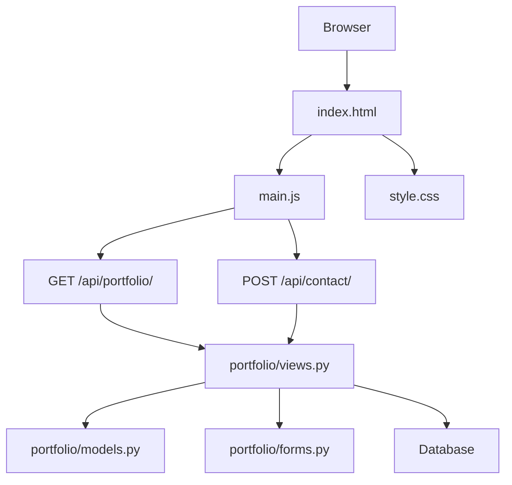
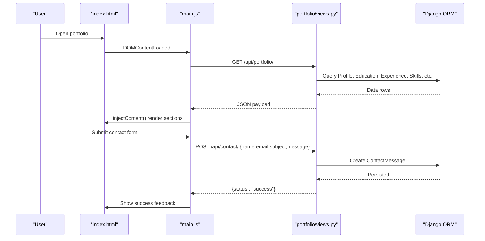
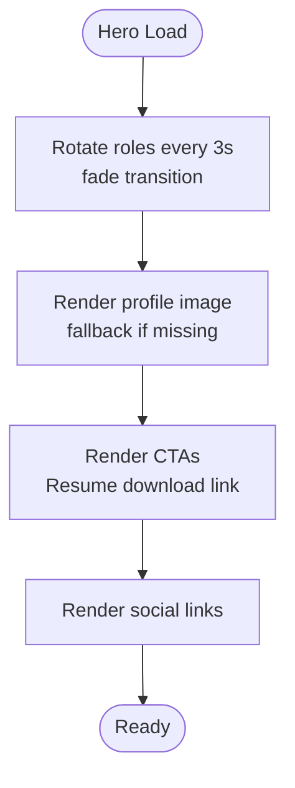
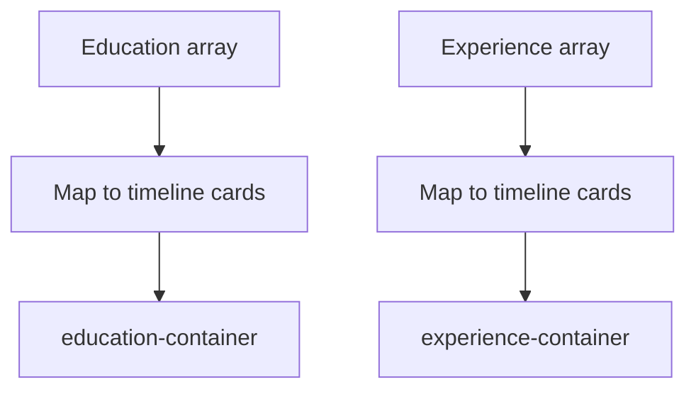
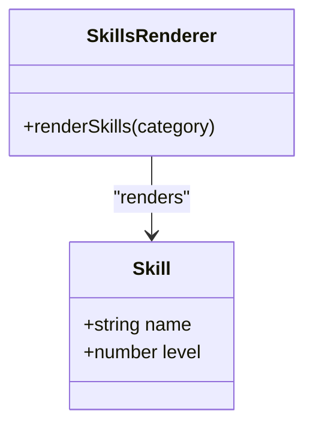
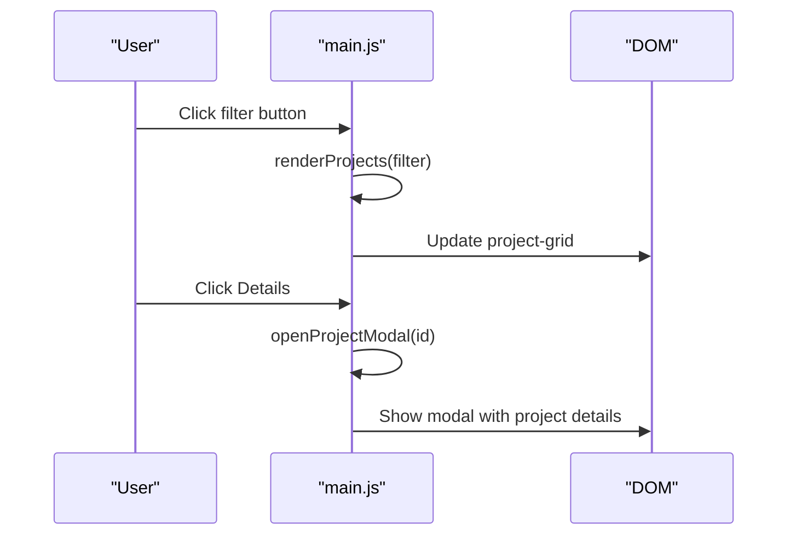
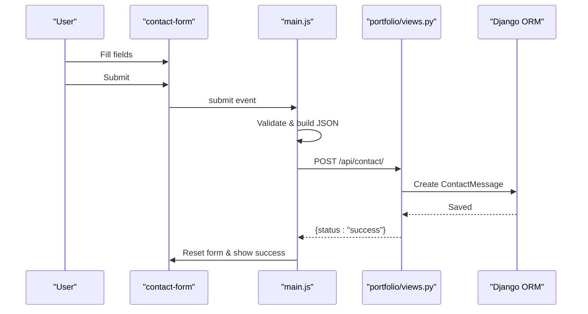
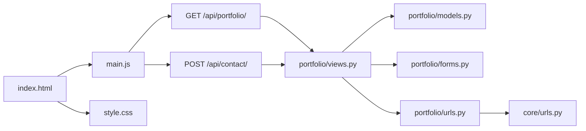

# Public Portfolio Features

<cite>
**Referenced Files in This Document**
- [index.html](file://index.html)
- [main.js](file://main.js)
- [style.css](file://style.css)
- [portfolio/views.py](file://portfolio/views.py)
- [portfolio/models.py](file://portfolio/models.py)
- [portfolio/forms.py](file://portfolio/forms.py)
- [portfolio/urls.py](file://portfolio/urls.py)
- [core/urls.py](file://core/urls.py)
</cite>

## Table of Contents
1. [Introduction](#introduction)
2. [Project Structure](#project-structure)
3. [Core Components](#core-components)
4. [Architecture Overview](#architecture-overview)
5. [Detailed Component Analysis](#detailed-component-analysis)
6. [Dependency Analysis](#dependency-analysis)
7. [Performance Considerations](#performance-considerations)
8. [Troubleshooting Guide](#troubleshooting-guide)
9. [Conclusion](#conclusion)

## Introduction
This document explains the public-facing portfolio website features, including the hero section with animated role display and profile image management, about section with professional bio and philosophy, education and experience timelines, skills showcase with categorized abilities and proficiency visualization, projects gallery with category filtering and image galleries, certificates and workshops documentation, achievements and services presentation, contact form system with validation and message storage, and resume download functionality. It also covers responsive design patterns, theme switching capabilities, JavaScript interactivity, dynamic content loading, API integration, and user interaction patterns.

## Project Structure
The site is a Django application serving a static front page that dynamically loads data via JSON APIs. The frontend consists of:
- index.html: Single-page layout with sections for all portfolio features
- main.js: Client-side logic for fetching data, rendering sections, animations, interactions, modals, and toast notifications
- style.css: Responsive styles, theming tokens, animations, and component layouts

The backend provides:
- A home view that serves index.html
- An API endpoint to serve portfolio data from the database
- An API endpoint to receive contact messages
- Admin dashboard routes for managing content (not part of this document’s scope beyond explaining data sources)

**Diagram sources**
- [index.html:102-408](file://index.html#L102-L408)
- [main.js:8-41](file://main.js#L8-L41)
- [main.js:372-414](file://main.js#L372-L414)
- [portfolio/urls.py:40-42](file://portfolio/urls.py#L40-L42)
- [portfolio/views.py:335-438](file://portfolio/views.py#L335-L438)
- [portfolio/views.py:300-322](file://portfolio/views.py#L300-L322)

**Section sources**
- [index.html:1-411](file://index.html#L1-L411)
- [main.js:1-497](file://main.js#L1-L497)
- [style.css:1-800](file://style.css#L1-L800)
- [portfolio/urls.py:1-44](file://portfolio/urls.py#L1-L44)
- [core/urls.py:22-28](file://core/urls.py#L22-L28)

## Core Components
- Hero Section: Animated role rotation, profile image with morph animation, social links, CTAs, and resume download link
- About Section: Professional bio and philosophy text injected from API
- Education & Experience Timelines: Institution/company entries with dates, roles, outcomes, responsibilities, and tags
- Skills Showcase: Categorized tabs (Frontend, Programming, Backend, UI/UX, Tools) with proficiency bars
- Projects Gallery: Category filters (All, Web, Django, Python, UI/UX, AI/ML), project cards, detail modal with images and tech stack
- Certificates & Workshops: Cards with issuer, date, description, and links
- Achievements & Services: Achievement cards and service offerings
- Contact Form: Client-side validation, submission to API, success/error handling
- Resume Download: Direct PDF download and online view options

**Section sources**
- [index.html:105-396](file://index.html#L105-L396)
- [main.js:119-247](file://main.js#L119-L247)
- [main.js:249-291](file://main.js#L249-L291)
- [main.js:327-366](file://main.js#L327-L366)
- [main.js:372-414](file://main.js#L372-L414)
- [main.js:420-474](file://main.js#L420-L474)

## Architecture Overview
The frontend fetches a single JSON payload containing all portfolio data and renders it into the DOM. The backend aggregates data from multiple models and returns a normalized structure. The contact form posts to a separate endpoint that persists messages.

**Diagram sources**
- [main.js:32-41](file://main.js#L32-L41)
- [main.js:8-30](file://main.js#L8-L30)
- [main.js:119-247](file://main.js#L119-L247)
- [main.js:372-414](file://main.js#L372-L414)
- [portfolio/views.py:335-438](file://portfolio/views.py#L335-L438)
- [portfolio/views.py:300-322](file://portfolio/views.py#L300-L322)

## Detailed Component Analysis

### Hero Section
- Animated Role Display: Rotates through predefined roles with fade transitions
- Profile Image Management: Displays primary profile image with fallback; supports alternate image via API
- Social Links: GitHub, LinkedIn, Instagram icons linking externally
- CTAs: Explore Work, Contact Me, Download Resume
- Scroll Indicator: Visual cue prompting users to scroll down

Implementation highlights:
- Role rotation uses setInterval with opacity transitions
- Profile image has morph animation and decorative ring/glow
- Resume download links to a static PDF path

**Diagram sources**
- [main.js:327-340](file://main.js#L327-L340)
- [index.html:105-145](file://index.html#L105-L145)

**Section sources**
- [index.html:105-145](file://index.html#L105-L145)
- [main.js:327-340](file://main.js#L327-L340)

### About Section
- Professional Bio: Injected from API personal.bio
- Philosophy: Injected from API personal.philosophy
- Details: Location, focus, identity fields

Data source:
- Personal object includes name, title, email, bio, philosophy, location, resumeUrl, profileImage

**Section sources**
- [index.html:147-180](file://index.html#L147-L180)
- [main.js:119-125](file://main.js#L119-L125)
- [portfolio/views.py:377-387](file://portfolio/views.py#L377-L387)

### Education & Experience Timelines
- Education Timeline: Institution, degree/field, duration, percentage, description, subjects/tags
- Experience Timeline: Company, role, employment type, duration, location, outcomes, responsibilities list, technologies tags

Rendering:
- Both sections map arrays from API to timeline cards with structured metadata

**Diagram sources**
- [main.js:143-184](file://main.js#L143-L184)

**Section sources**
- [index.html:189-207](file://index.html#L189-L207)
- [main.js:143-184](file://main.js#L143-L184)
- [portfolio/views.py:346-370](file://portfolio/views.py#L346-L370)

### Skills Showcase
- Tabs: Frontend, Programming, Backend, UI/UX, Tools
- Proficiency Visualization: Bars with percentage width
- Tech Marquee: Scrolling list of technologies from frontend, programming, and backend categories

Implementation:
- renderSkills(category) maps skills to progress bars
- Marquee duplicates items for infinite loop effect

**Diagram sources**
- [main.js:249-264](file://main.js#L249-L264)

**Section sources**
- [index.html:209-231](file://index.html#L209-L231)
- [main.js:186-196](file://main.js#L186-L196)
- [main.js:249-264](file://main.js#L249-L264)
- [portfolio/views.py:372-404](file://portfolio/views.py#L372-L404)

### Projects Gallery
- Category Filters: All, Web, Django, Python, UI/UX, AI/ML
- Project Cards: Title, tagline, status badge, thumbnail, tech stack tags, GitHub link, Details button
- Detail Modal: Overview, problem/solution, key features, tech stack, links (GitHub/Live)

Implementation:
- renderProjects(filter) filters by category and renders cards
- openProjectModal(id) opens modal with full details

**Diagram sources**
- [main.js:266-291](file://main.js#L266-L291)
- [main.js:420-474](file://main.js#L420-L474)

**Section sources**
- [index.html:253-271](file://index.html#L253-L271)
- [main.js:266-291](file://main.js#L266-L291)
- [main.js:420-474](file://main.js#L420-L474)
- [portfolio/views.py:417-433](file://portfolio/views.py#L417-L433)

### Certificates & Workshops
- Certificates: Card with image, title, issuer, date, description, credential link
- Workshops: Card with title, organizer, date, description, topic tag

Rendering:
- Maps arrays from API to card components

**Section sources**
- [index.html:233-251](file://index.html#L233-L251)
- [main.js:198-223](file://main.js#L198-L223)
- [portfolio/views.py:405-416](file://portfolio/views.py#L405-L416)

### Achievements & Services
- Achievements: Cards with title, description, date
- Services: Cards with icon, title, description

Rendering:
- Maps arrays from API to respective containers

**Section sources**
- [index.html:273-291](file://index.html#L273-L291)
- [main.js:228-246](file://main.js#L228-L246)
- [portfolio/views.py:434-437](file://portfolio/views.py#L434-L437)

### Contact Form System
- Fields: Name, Email, Subject, Message
- Validation: HTML required attributes; client-side prevents default submission
- Submission: POST to /api/contact/ with JSON body
- Feedback: Success alert and form reset on success; error alert on failure

Backend:
- Saves ContactMessage to database
- Returns JSON response with status

**Diagram sources**
- [main.js:372-414](file://main.js#L372-L414)
- [portfolio/views.py:300-322](file://portfolio/views.py#L300-L322)

**Section sources**
- [index.html:313-365](file://index.html#L313-L365)
- [main.js:372-414](file://main.js#L372-L414)
- [portfolio/views.py:300-322](file://portfolio/views.py#L300-L322)
- [portfolio/models.py:265-275](file://portfolio/models.py#L265-L275)

### Resume Download Functionality
- Hero CTA: Download Resume link to static PDF
- Resume Section: Preview placeholder, Download PDF, View Online

Paths:
- Static PDF at /assets/resume/Yash-Sunil-Tayade-Resume.pdf
- Active resume URL available via API personal.resumeUrl

**Section sources**
- [index.html:120-124](file://index.html#L120-L124)
- [index.html:293-311](file://index.html#L293-L311)
- [portfolio/views.py:377-387](file://portfolio/views.py#L377-L387)

### Theme Switching Capabilities
- Toggle Button: Left navigation theme toggle
- Sweep Animation: Visual sweep effect on theme change
- Persistence: Theme stored in localStorage
- CSS Variables: Dark/light themes defined via data-theme attribute

Implementation:
- initTheme sets initial theme and handles click events
- CSS defines variables for both themes

**Section sources**
- [index.html:88-99](file://index.html#L88-L99)
- [main.js:69-91](file://main.js#L69-L91)
- [style.css:7-49](file://style.css#L7-L49)

### Responsive Design Patterns
- Side Navigation: Fixed left nav with tooltips and scroll progress
- Sections: Margin-left offset on desktop; collapses on mobile
- Grid Layouts: Hero grid, about grid, stats grid, skills tabs, project grid
- Typography: Fluid font sizes using clamp
- Background Effects: Mesh gradients, grid overlay, noise texture

Breakpoints:
- Mobile adjustments at max-width: 900px

**Section sources**
- [style.css:241-380](file://style.css#L241-L380)
- [style.css:136-185](file://style.css#L136-L185)
- [style.css:382-590](file://style.css#L382-L590)
- [style.css:592-781](file://style.css#L592-L781)

### JavaScript Interactivity
- Loader: Forces hide after timeout or window load
- Custom Cursor: Dot and ring follow mouse; expands on interactive elements
- Navigation: Active section detection and scroll progress bar
- Animations: Role rotation, stat counters with IntersectionObserver
- Modals: Project detail modal with keyboard/click-outside close
- Toasts: Utility for temporary notifications

**Section sources**
- [main.js:47-67](file://main.js#L47-L67)
- [main.js:93-113](file://main.js#L93-L113)
- [main.js:297-325](file://main.js#L297-L325)
- [main.js:327-366](file://main.js#L327-L366)
- [main.js:420-474](file://main.js#L420-L474)
- [main.js:480-496](file://main.js#L480-L496)

## Dependency Analysis
- Frontend depends on:
  - index.html for structure
  - main.js for behavior and data injection
  - style.css for styling and responsiveness
- Backend depends on:
  - portfolio/models.py for data schema
  - portfolio/forms.py for admin forms
  - portfolio/views.py for routing and API endpoints
  - portfolio/urls.py for URL mapping
  - core/urls.py for root URL configuration

**Diagram sources**
- [index.html:102-408](file://index.html#L102-L408)
- [main.js:8-41](file://main.js#L8-L41)
- [portfolio/urls.py:40-42](file://portfolio/urls.py#L40-L42)
- [core/urls.py:22-28](file://core/urls.py#L22-L28)

**Section sources**
- [portfolio/urls.py:1-44](file://portfolio/urls.py#L1-L44)
- [core/urls.py:22-28](file://core/urls.py#L22-L28)
- [portfolio/views.py:1-18](file://portfolio/views.py#L1-L18)
- [portfolio/models.py:1-298](file://portfolio/models.py#L1-L298)
- [portfolio/forms.py:1-22](file://portfolio/forms.py#L1-L22)

## Performance Considerations
- Data Fetching: Single API call for portfolio data reduces round trips; fallback to empty data prevents crashes
- Rendering: Efficient innerHTML mapping for lists; avoids heavy DOM manipulation
- Animations: Use IntersectionObserver for counters to avoid unnecessary computations
- Images: Provide fallback placeholders; consider lazy loading for large galleries
- CSS: Use CSS variables for theme switching without reflows; keep animations GPU-friendly

[No sources needed since this section provides general guidance]

## Troubleshooting Guide
- API Errors: If /api/portfolio/ fails, the script falls back to an empty dataset; check network tab and ensure Django app is running
- Contact Form Failures: Verify /api/contact/ accepts POST JSON; check server logs for exceptions; confirm CSRF exemption is intentional
- Missing Images: Profile and project images may fail to load; verify media paths and permissions; fallback URLs are set in HTML/JS
- Theme Not Persisting: Ensure localStorage is accessible; check browser privacy settings
- Modal Not Closing: Click outside modal or press close button; verify overlay event listeners

**Section sources**
- [main.js:8-30](file://main.js#L8-L30)
- [main.js:372-414](file://main.js#L372-L414)
- [index.html:134](file://index.html#L134)
- [index.html:276](file://index.html#L276)
- [main.js:493-496](file://main.js#L493-L496)

## Conclusion
The portfolio website combines a clean, responsive frontend with a robust Django backend. Dynamic content is loaded via a single API endpoint, while the contact form integrates with a dedicated endpoint to persist messages. Interactive features include animated role rotation, theme switching, custom cursor, skill proficiency bars, project filtering, and modals. The architecture emphasizes maintainability through clear separation of concerns and efficient rendering strategies.

[No sources needed since this section summarizes without analyzing specific files]