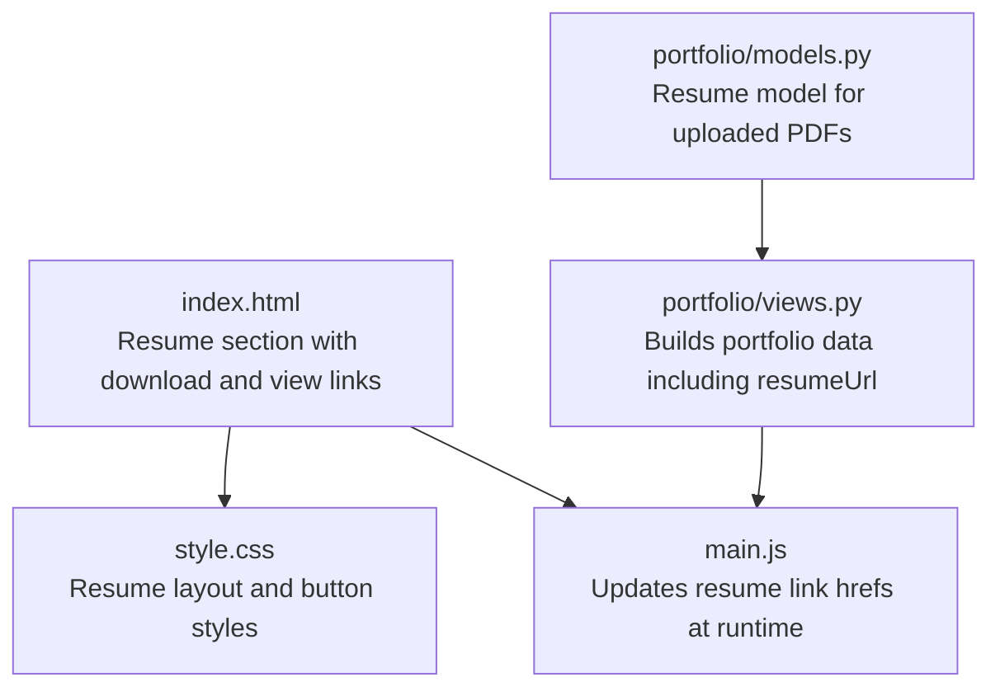
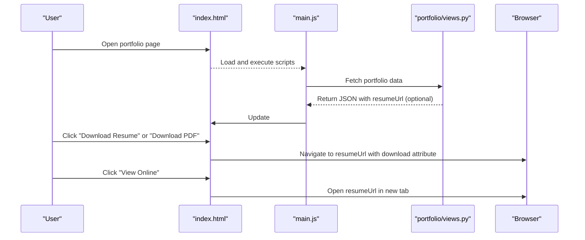
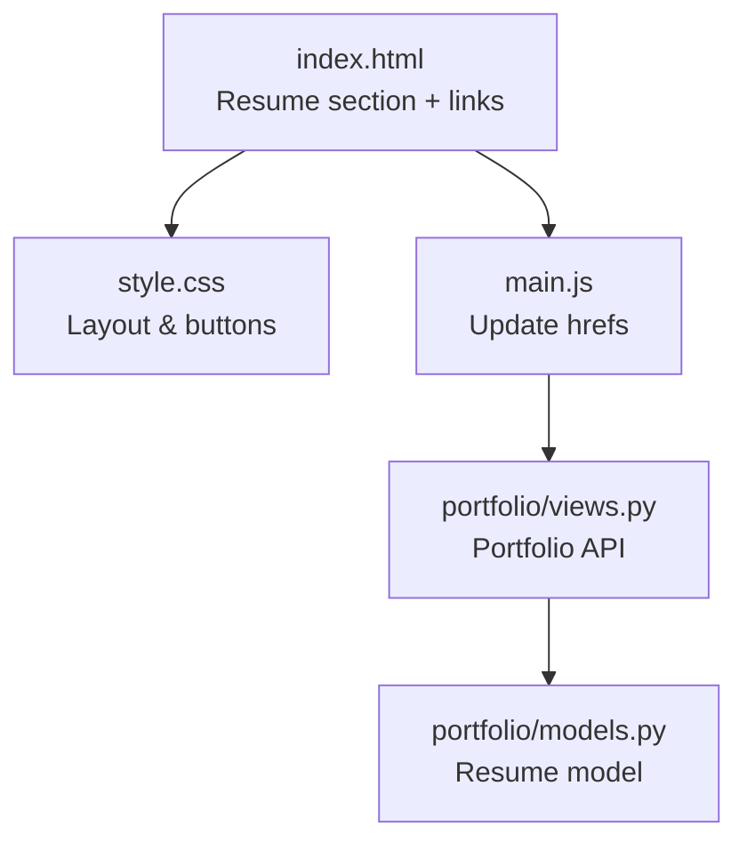

# Resume Download

<cite>
**Referenced Files in This Document**
- [index.html](file://index.html)
- [style.css](file://style.css)
- [main.js](file://main.js)
- [views.py](file://portfolio/views.py)
- [models.py](file://portfolio/models.py)
</cite>

## Table of Contents
1. [Introduction](#introduction)
2. [Project Structure](#project-structure)
3. [Core Components](#core-components)
4. [Architecture Overview](#architecture-overview)
5. [Detailed Component Analysis](#detailed-component-analysis)
6. [Dependency Analysis](#dependency-analysis)
7. [Performance Considerations](#performance-considerations)
8. [Troubleshooting Guide](#troubleshooting-guide)
9. [Conclusion](#conclusion)

## Introduction
This document explains the resume download functionality in the portfolio site. It covers how the PDF file is referenced, how the download and preview buttons work, where the resume URL comes from, and how the resume section is styled. It also includes browser compatibility notes for inline PDF viewing and responsive design guidance for the resume area.

## Project Structure
The resume feature spans a small set of files:
- The HTML page defines the resume section and two action links: one for downloading and one for viewing online.
- The CSS styles the resume container, preview placeholder, and action buttons.
- The JavaScript updates the resume links dynamically when data is available from the backend API.
- The Django views assemble the frontend data payload and can include an active resume URL.
- The Django models define a Resume entity that can store uploaded PDFs.

**Diagram sources**
- [index.html:284-302](file://index.html#L284-L302)
- [style.css:1516-1551](file://style.css#L1516-L1551)
- [main.js:204-209](file://main.js#L204-L209)
- [portfolio/views.py:335-344](file://portfolio/views.py#L335-L344)
- [portfolio/models.py:242-250](file://portfolio/models.py#L242-L250)

**Section sources**
- [index.html:284-302](file://index.html#L284-L302)
- [style.css:1516-1551](file://style.css#L1516-L1551)
- [main.js:204-209](file://main.js#L204-L209)
- [portfolio/views.py:335-344](file://portfolio/views.py#L335-L344)
- [portfolio/models.py:242-250](file://portfolio/models.py#L242-L250)

## Core Components
- Resume section UI: Provides a visual placeholder and two actions (download and view).
- Static fallback links: Hardcoded paths to a PDF under /assets/resume/.
- Dynamic link injection: main.js replaces the hardcoded URLs with the server-provided resumeUrl if present.
- Backend data assembly: views.py builds the portfolio JSON payload and can include resumeUrl.
- Resume storage model: models.py defines a Resume model for storing uploaded PDFs.

Key responsibilities:
- index.html: Defines the resume section and default anchor elements.
- style.css: Styles the resume grid, preview placeholder, and action buttons.
- main.js: Updates resume links after fetching portfolio data.
- views.py: Supplies resumeUrl in the portfolio API response.
- models.py: Represents uploaded resumes for future dynamic serving.

**Section sources**
- [index.html:284-302](file://index.html#L284-L302)
- [style.css:1516-1551](file://style.css#L1516-L1551)
- [main.js:204-209](file://main.js#L204-L209)
- [portfolio/views.py:335-344](file://portfolio/views.py#L335-L344)
- [portfolio/models.py:242-250](file://portfolio/models.py#L242-L250)

## Architecture Overview
The resume download flow combines static markup with dynamic configuration:

**Diagram sources**
- [index.html:132-133](file://index.html#L132-L133)
- [index.html:297-298](file://index.html#L297-L298)
- [main.js:204-209](file://main.js#L204-L209)
- [portfolio/views.py:335-344](file://portfolio/views.py#L335-L344)

## Detailed Component Analysis

### Resume Section Layout and Styling
- Container: Uses a two-column grid with the preview on the left and actions on the right.
- Preview: A card-sized placeholder with centered icon and text; it can be replaced by an embedded viewer later.
- Actions: Vertical stack of primary and outline buttons for download and online view.

Styling highlights:
- Grid layout and spacing are defined for .resume-container.
- .resume-preview provides a fixed height and centering for the placeholder.
- .resume-actions stacks buttons vertically with consistent gaps.
- Buttons use shared classes (.btn, .btn-primary, .btn-outline) for consistent appearance across the site.

Responsive behavior:
- The resume grid aligns side-by-side on larger screens.
- On smaller screens, the columns naturally stack due to the overall responsive grid system used elsewhere in the stylesheet.

Accessibility and UX:
- Buttons are clearly labeled for download and online view.
- The preview placeholder communicates that a document is available even before interaction.

**Section sources**
- [index.html:284-302](file://index.html#L284-L302)
- [style.css:1516-1551](file://style.css#L1516-L1551)

### Download Button Implementation
There are two download entry points:
- Hero area: A “Download Resume” link with the download attribute.
- Resume section: A “Download PDF” link with the download attribute.

Behavior:
- Both links point initially to a static path under /assets/resume/.
- When the portfolio API returns a resumeUrl, main.js updates both download links to use the server-provided URL.

Implementation details:
- The download attribute instructs the browser to download rather than navigate to the resource when possible.
- The IDs #resume-download-hero and #resume-download are updated by main.js.

**Section sources**
- [index.html:132-133](file://index.html#L132-L133)
- [index.html:297-298](file://index.html#L297-L298)
- [main.js:204-209](file://main.js#L204-L209)

### Preview Options
Current state:
- The resume section shows a placeholder card indicating “Resume Preview.”
- There is no embedded PDF viewer yet.

Future options:
- Replace the placeholder with an <iframe> or <embed> pointing to resumeUrl to allow in-page preview.
- Keep the current placeholder for performance and simplicity, while offering “View Online” to open the PDF in a new tab.

UX considerations:
- Provide clear affordances for both download and view actions.
- Ensure keyboard accessibility and visible focus states for all interactive elements.

**Section sources**
- [index.html:289-300](file://index.html#L289-L300)

### File Path Configuration
Static fallback:
- Default anchors point to /assets/resume/Yash-Sunil-Tayade-Resume.pdf.

Dynamic override:
- If the backend supplies resumeUrl in the portfolio data, main.js updates all resume links to use that value.

Backend integration:
- views.py constructs the portfolio data payload and can include resumeUrl based on the active Resume record.
- models.py defines a Resume model with fields for title, version, upload date, and an active flag.

Operational note:
- Ensure the active resume’s file path is accessible via the configured media/static setup so the URL returned by the API resolves correctly.

**Section sources**
- [index.html:132-133](file://index.html#L132-L133)
- [index.html:297-298](file://index.html#L297-L298)
- [main.js:204-209](file://main.js#L204-L209)
- [portfolio/views.py:335-344](file://portfolio/views.py#L335-L344)
- [portfolio/models.py:242-250](file://portfolio/models.py#L242-L250)

### Browser Compatibility Considerations
- Inline PDF viewing: Some browsers may not render PDFs inside <iframe>/<embed>. Use a dedicated tab via target="_blank" for reliable viewing.
- Download behavior: The download attribute may behave differently across browsers and origins. For cross-origin resources, ensure proper CORS headers or serve the PDF from the same origin.
- Mobile experience: On mobile, opening a PDF typically launches the device’s PDF viewer app. Provide both download and view options to accommodate different user preferences.

[No sources needed since this section provides general guidance]

### User Experience Patterns
- Clear labeling: “Download Resume,” “Download PDF,” and “View Online” communicate distinct actions.
- Consistent styling: Buttons share common classes for visual consistency.
- Progressive enhancement: Static links work out-of-the-box; dynamic resumeUrl enhances reliability and centralizes management.
- Accessibility: Links are semantic anchors with descriptive text; ensure focus styles remain visible.

[No sources needed since this section provides general guidance]

## Dependency Analysis
The resume feature depends on:
- HTML structure defining the resume section and action links.
- CSS providing layout and button styles.
- JavaScript updating link targets based on backend data.
- Django views supplying resumeUrl in the portfolio API response.
- Django models representing uploaded resumes.

**Diagram sources**
- [index.html:284-302](file://index.html#L284-L302)
- [style.css:1516-1551](file://style.css#L1516-L1551)
- [main.js:204-209](file://main.js#L204-L209)
- [portfolio/views.py:335-344](file://portfolio/views.py#L335-L344)
- [portfolio/models.py:242-250](file://portfolio/models.py#L242-L250)

**Section sources**
- [index.html:284-302](file://index.html#L284-L302)
- [style.css:1516-1551](file://style.css#L1516-L1551)
- [main.js:204-209](file://main.js#L204-L209)
- [portfolio/views.py:335-344](file://portfolio/views.py#L335-L344)
- [portfolio/models.py:242-250](file://portfolio/models.py#L242-L250)

## Performance Considerations
- Prefer lazy loading for any embedded PDF viewer if implemented.
- Avoid heavy animations in the resume section to keep interactions snappy.
- Serve the PDF through a CDN or optimized static/media server for faster downloads.
- Cache the portfolio API response appropriately to avoid unnecessary re-fetches.

[No sources needed since this section provides general guidance]

## Troubleshooting Guide
Common issues and resolutions:
- Links do not update:
  - Verify that the portfolio API returns resumeUrl.
  - Confirm main.js runs and sets hrefs for #resume-download-hero, #resume-download, and #resume-view.
- Download does not start:
  - Check that the resume URL resolves to a valid PDF.
  - Ensure the server serves the PDF with correct MIME type and access permissions.
- View Online opens blank page:
  - Some environments block inline PDF rendering; prefer opening in a new tab.
  - Validate CORS settings if the PDF is served from another origin.
- Placeholder remains visible:
  - If implementing an in-page viewer, replace the placeholder content with an iframe/embed once resumeUrl is available.

**Section sources**
- [main.js:204-209](file://main.js#L204-L209)
- [index.html:289-300](file://index.html#L289-L300)

## Conclusion
The resume download feature combines simple static markup with dynamic configuration. Users can download the resume directly or view it online. The design uses a clean two-column layout with consistent button styles. For robustness, rely on the backend-provided resumeUrl and ensure the PDF is accessible. Future enhancements can include an in-page PDF viewer and richer metadata from the Resume model.