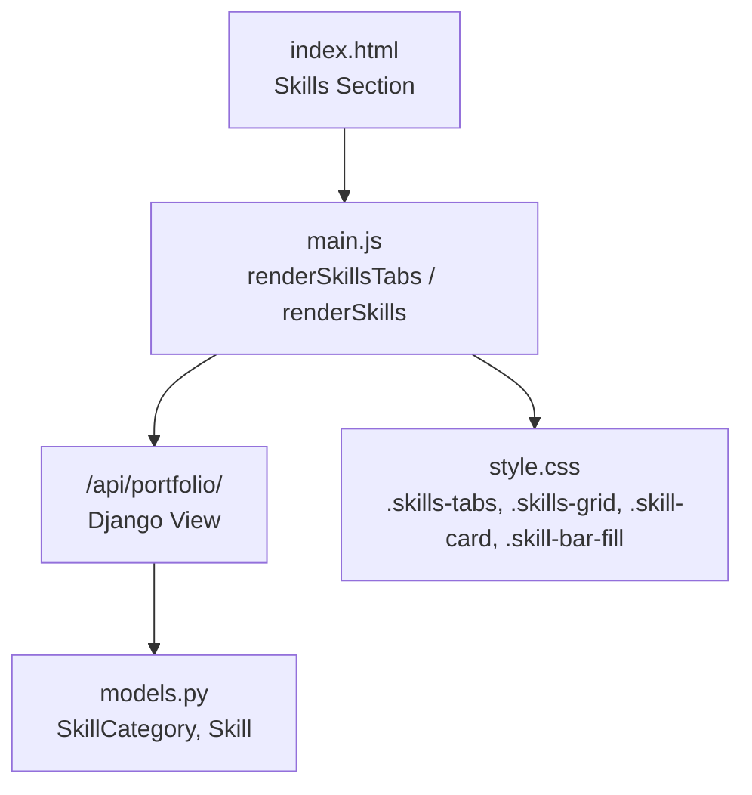
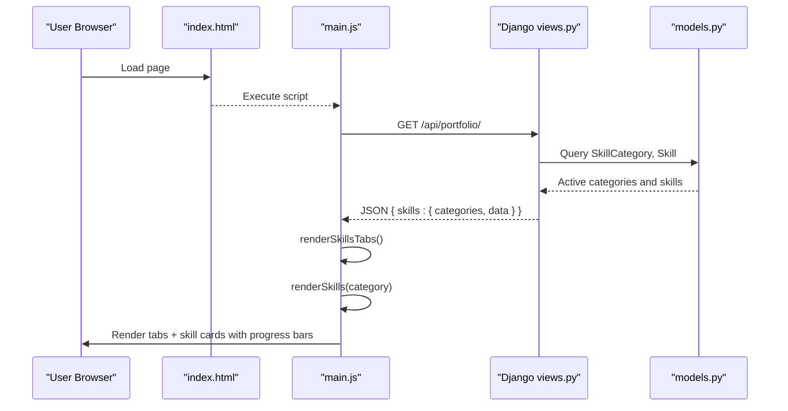
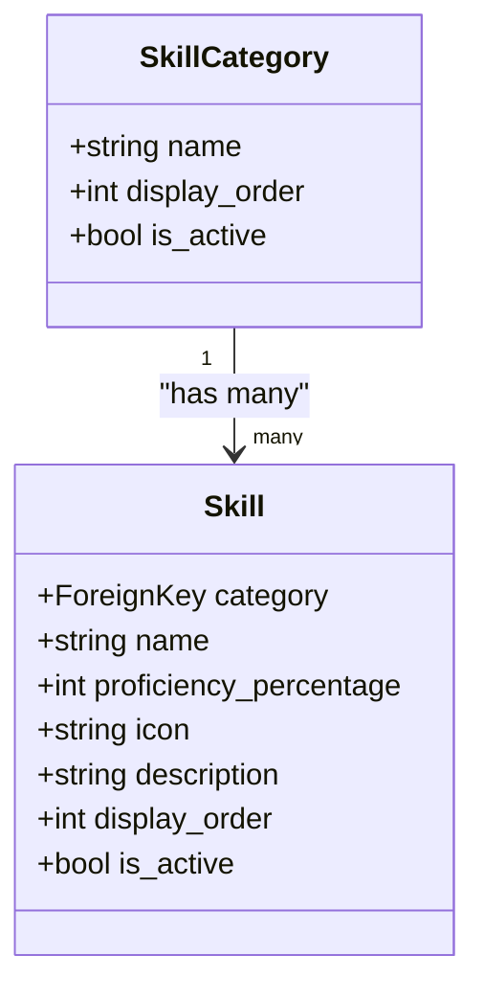
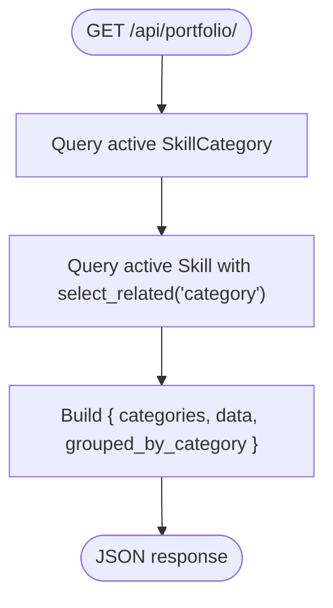
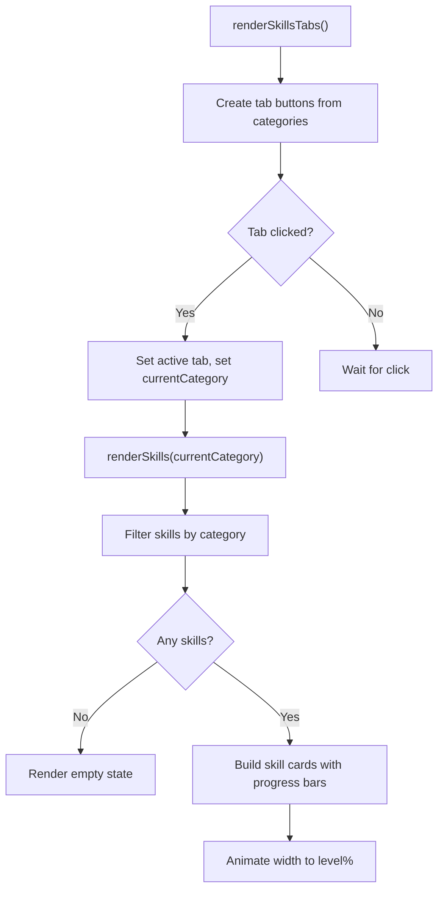
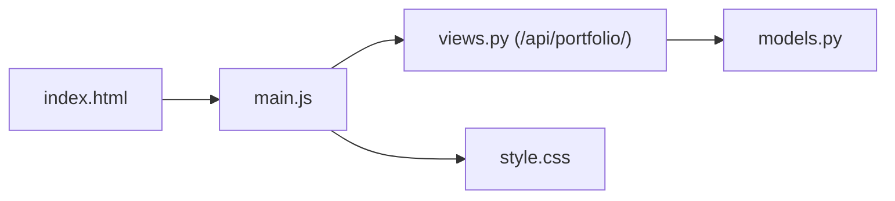

# Skills Showcase

<cite>
**Referenced Files in This Document**
- [index.html](file://index.html)
- [main.js](file://main.js)
- [style.css](file://style.css)
- [views.py](file://portfolio/views.py)
- [models.py](file://portfolio/models.py)
</cite>

## Table of Contents
1. [Introduction](#introduction)
2. [Project Structure](#project-structure)
3. [Core Components](#core-components)
4. [Architecture Overview](#architecture-overview)
5. [Detailed Component Analysis](#detailed-component-analysis)
6. [Dependency Analysis](#dependency-analysis)
7. [Performance Considerations](#performance-considerations)
8. [Troubleshooting Guide](#troubleshooting-guide)
9. [Conclusion](#conclusion)

## Introduction
This document explains the Skills Showcase feature that organizes skills by category, visualizes proficiency with animated progress bars, and integrates icons via Font Awesome. It covers the tabbed interface, dynamic loading from database models through a Django API, responsive grid layout, and styling for skill cards, progress indicators, and interactive hover states.

## Project Structure
The Skills Showcase spans frontend markup, JavaScript rendering, CSS styling, and backend data models and API:
- Frontend markup defines the skills section and containers for tabs and grid.
- JavaScript fetches portfolio data from a Django endpoint and renders skills dynamically.
- CSS provides responsive grids, card styles, progress bar animations, and hover effects.
- Backend models define SkillCategory and Skill; a view serializes them into JSON for the frontend.

**Diagram sources**
- [index.html:213-224](file://index.html#L213-L224)
- [main.js:404-461](file://main.js#L404-L461)
- [views.py:335-457](file://portfolio/views.py#L335-L457)
- [models.py:91-115](file://portfolio/models.py#L91-L115)
- [style.css:1128-1206](file://style.css#L1128-L1206)

**Section sources**
- [index.html:213-224](file://index.html#L213-L224)
- [main.js:88-117](file://main.js#L88-L117)
- [views.py:335-457](file://portfolio/views.py#L335-L457)
- [models.py:91-115](file://portfolio/models.py#L91-L115)
- [style.css:1128-1206](file://style.css#L1128-L1206)

## Core Components
- Category-based organization: Categories are derived from SkillCategory records and rendered as tabs.
- Dynamic skill loading: The frontend calls a single API to get all portfolio data, including skills grouped by category and a flat list.
- Proficiency visualization: Each skill shows a percentage and an animated progress bar.
- Icon integration: Font Awesome is loaded in the page head; skills can include icons stored in the model (used elsewhere in the site).
- Responsive grid: Skills are displayed in a responsive grid that adapts to screen size.
- Styling: Cards have hover lift and glow; progress bars animate on render; tabs highlight the active category.

**Section sources**
- [models.py:91-115](file://portfolio/models.py#L91-L115)
- [views.py:372-423](file://portfolio/views.py#L372-L423)
- [main.js:404-461](file://main.js#L404-L461)
- [style.css:1128-1206](file://style.css#L1128-L1206)
- [index.html:53-54](file://index.html#L53-L54)

## Architecture Overview
The feature follows a data-driven architecture:
- The Django view serializes SkillCategory and Skill into a structured JSON payload.
- The frontend fetches this payload once and uses it to build tabs and skill cards.
- CSS handles layout and interactions without additional libraries.

**Diagram sources**
- [index.html:396-397](file://index.html#L396-L397)
- [main.js:88-117](file://main.js#L88-L117)
- [main.js:404-461](file://main.js#L404-L461)
- [views.py:335-457](file://portfolio/views.py#L335-L457)
- [models.py:91-115](file://portfolio/models.py#L91-L115)

## Detailed Component Analysis

### Data Model: SkillCategory and Skill
- SkillCategory groups skills and controls tab generation.
- Skill stores name, proficiency_percentage, optional icon, description, ordering, and visibility flags.
- Both models support ordering and activation to control display.

**Diagram sources**
- [models.py:91-115](file://portfolio/models.py#L91-L115)

**Section sources**
- [models.py:91-115](file://portfolio/models.py#L91-L115)

### API Endpoint: Portfolio Data
- A single endpoint returns all sections, including skills.
- For skills, it returns:
  - categories: list of active category names
  - data: flat list of skills with name, level, and category
  - An object keyed by category name mapping to arrays of {name, level} for quick grouping

**Diagram sources**
- [views.py:372-423](file://portfolio/views.py#L372-L423)

**Section sources**
- [views.py:335-457](file://portfolio/views.py#L335-L457)

### Frontend Rendering: Tabs and Grid
- Tab generation:
  - Reads categories from the API and creates buttons.
  - Tracks current category and toggles active state.
- Skill rendering:
  - Filters skills by selected category.
  - Builds skill cards with name, percentage, and a progress bar element.
  - Animates progress bars using requestAnimationFrame.

**Diagram sources**
- [main.js:404-461](file://main.js#L404-L461)

**Section sources**
- [main.js:404-461](file://main.js#L404-L461)

### HTML Structure: Skills Section
- The skills section includes:
  - A heading and lead text.
  - A container for tabs (#skills-tabs).
  - A container for the skills grid (#skills-container).

**Section sources**
- [index.html:213-224](file://index.html#L213-L224)

### Styling: Tabs, Grid, Cards, Progress Bars, Hover States
- Tabs:
  - Pill-shaped buttons with hover and active gradient background.
- Grid:
  - Responsive auto-fill grid with minimum card width for adaptability.
- Skill cards:
  - Card surface with border, padding, and hover lift/glow.
  - Info row with skill name and percentage.
- Progress bars:
  - Background track and gradient-filled bar with smooth transition.
- Hover states:
  - Cards lift and gain glow on hover.
  - Tabs highlight when active.

**Section sources**
- [style.css:1128-1206](file://style.css#L1128-L1206)

### Icon Integration: Font Awesome
- Font Awesome is included in the page head for consistent iconography across the site.
- While skills themselves do not require icons in the card, the system supports storing icon classes per item in models and rendering them where appropriate.

**Section sources**
- [index.html:53-54](file://index.html#L53-L54)
- [models.py:102-115](file://portfolio/models.py#L102-L115)

## Dependency Analysis
- index.html depends on main.js for dynamic content injection and style.css for visuals.
- main.js depends on the Django API at /api/portfolio/.
- views.py depends on models.py to query SkillCategory and Skill.
- CSS styles depend on class names generated by main.js for skill cards and progress bars.

**Diagram sources**
- [index.html:396-397](file://index.html#L396-L397)
- [main.js:88-117](file://main.js#L88-L117)
- [views.py:335-457](file://portfolio/views.py#L335-L457)
- [models.py:91-115](file://portfolio/models.py#L91-L115)
- [style.css:1128-1206](file://style.css#L1128-L1206)

**Section sources**
- [index.html:396-397](file://index.html#L396-L397)
- [main.js:88-117](file://main.js#L88-L117)
- [views.py:335-457](file://portfolio/views.py#L335-L457)
- [models.py:91-115](file://portfolio/models.py#L91-L115)
- [style.css:1128-1206](file://style.css#L1128-L1206)

## Performance Considerations
- Single API call: All sections load via one endpoint, reducing network overhead.
- Efficient queries: Use select_related for category to avoid N+1 queries.
- Lightweight DOM updates: Only the skills containers are updated on tab changes.
- Animation efficiency: Progress bars animate via CSS transitions triggered once per render.
- Responsive layout: CSS Grid avoids heavy media queries by using auto-fill and minmax.

[No sources needed since this section provides general guidance]

## Troubleshooting Guide
- No tabs appear:
  - Ensure SkillCategory records exist and are active.
  - Verify the API returns a non-empty categories array.
- Skills not showing:
  - Confirm Skill records are active and linked to a category.
  - Check that the skills container exists in the DOM before rendering.
- Progress bars not animating:
  - Ensure .skill-bar-fill elements are created and have a data-level attribute.
  - Verify CSS transition is present and not overridden.
- Icons not displaying:
  - Confirm Font Awesome stylesheet is loaded.
  - Validate icon class strings if used elsewhere in the skills UI.

**Section sources**
- [main.js:404-461](file://main.js#L404-L461)
- [style.css:1128-1206](file://style.css#L1128-L1206)
- [index.html:53-54](file://index.html#L53-L54)

## Conclusion
The Skills Showcase delivers a clean, category-driven experience with animated proficiency indicators and responsive design. It leverages a simple Django API and vanilla JavaScript to keep the implementation lightweight while providing a polished user interface. With clear separation between data, rendering, and styling, the feature is easy to extend with new categories, skills, or visual enhancements.