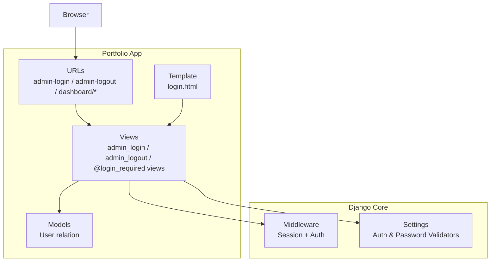
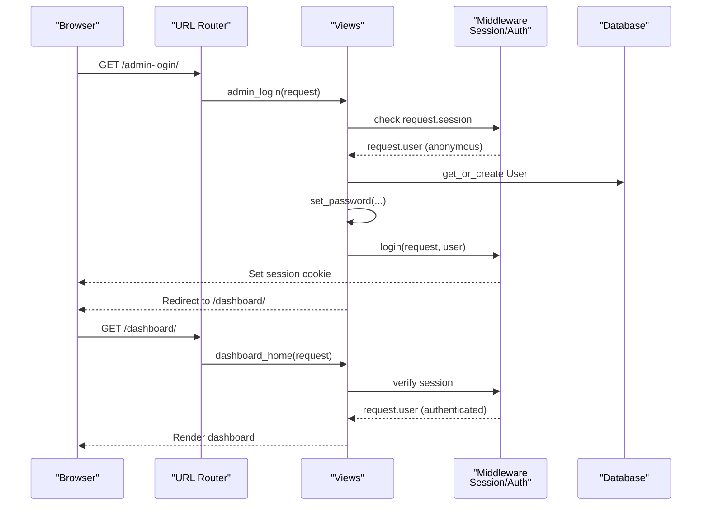
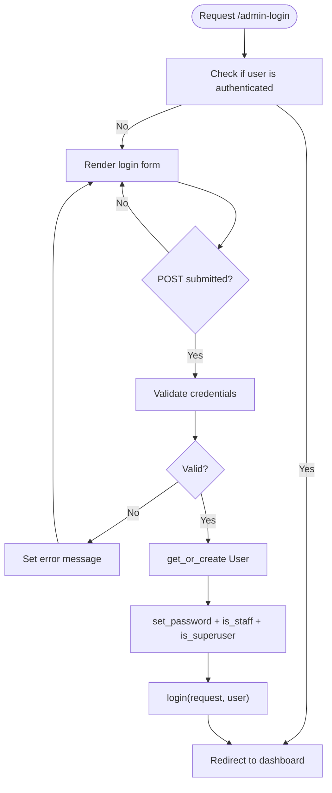
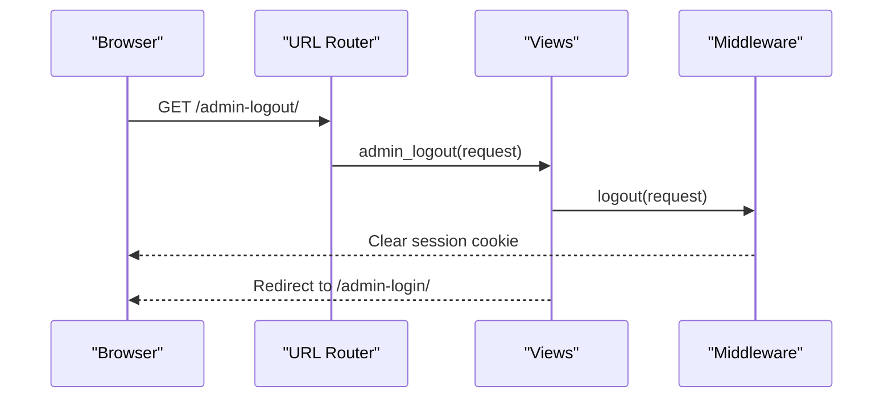
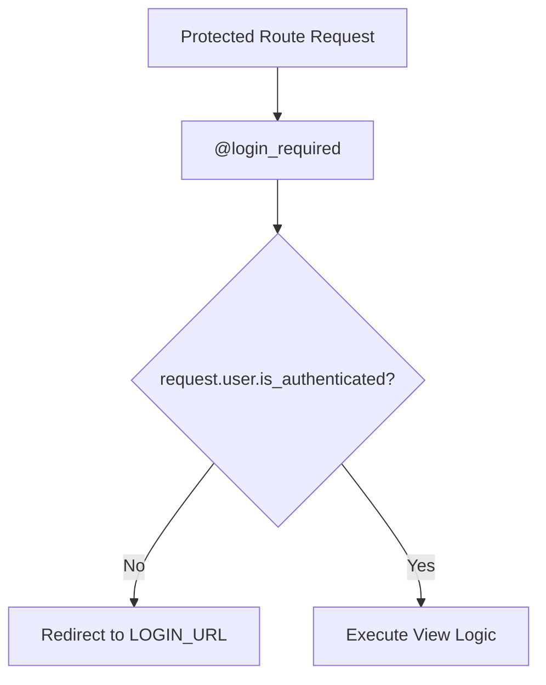
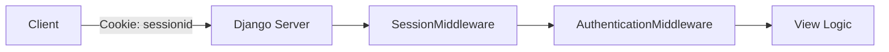
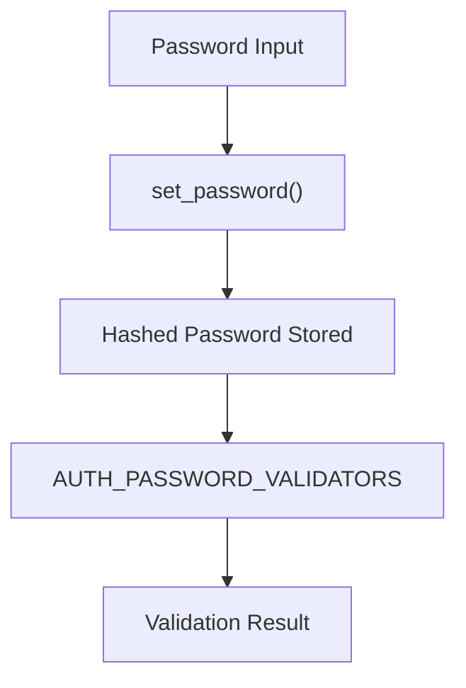
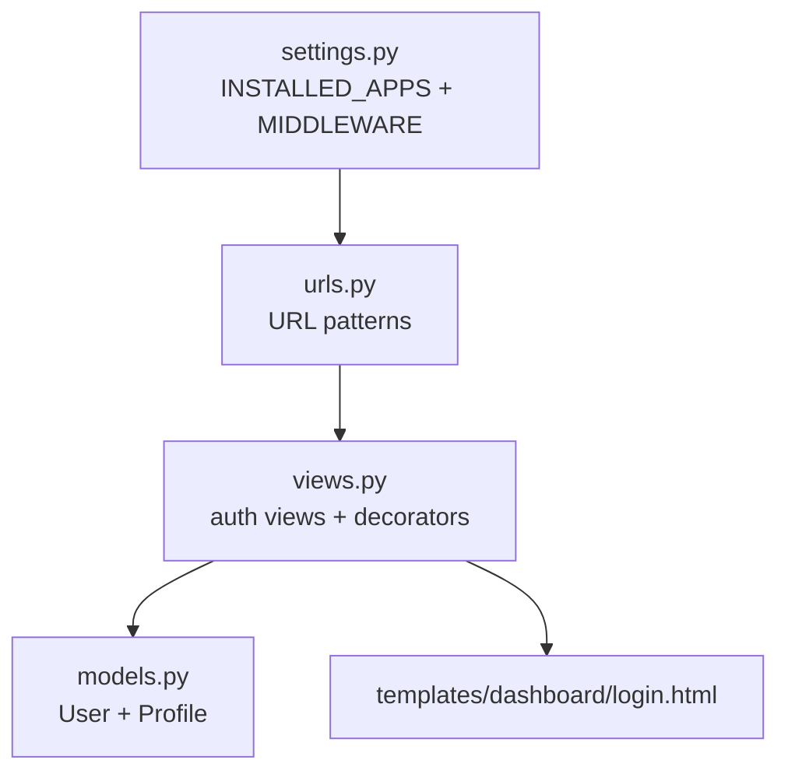

# Authentication Flow

<cite>
**Referenced Files in This Document**
- [settings.py](file://core/settings.py)
- [urls.py](file://portfolio/urls.py)
- [views.py](file://portfolio/views.py)
- [login.html](file://templates/dashboard/login.html)
- [models.py](file://portfolio/models.py)
- [dashboard_extras.py](file://portfolio/templatetags/dashboard_extras.py)
</cite>

## Table of Contents
1. [Introduction](#introduction)
2. [Project Structure](#project-structure)
3. [Core Components](#core-components)
4. [Architecture Overview](#architecture-overview)
5. [Detailed Component Analysis](#detailed-component-analysis)
6. [Dependency Analysis](#dependency-analysis)
7. [Performance Considerations](#performance-considerations)
8. [Troubleshooting Guide](#troubleshooting-guide)
9. [Conclusion](#conclusion)

## Introduction
This document explains the authentication flow in the Portfolio CMS, focusing on how Django’s built-in user authentication system is used to protect admin routes, manage sessions, and handle passwords. It covers login/logout views, session middleware, password hashing via Django’s User model, access control using decorators, and template-level checks for user status. It also provides security guidance and troubleshooting tips for common issues.

## Project Structure
The authentication-related code spans a small set of files:
- Settings configure authentication middleware, session backend, and password validators.
- URL patterns expose login/logout endpoints and protected dashboard routes.
- Views implement custom login logic, logout, and decorate protected routes with login requirements.
- The login template renders the form and displays messages.
- Models reference Django’s built-in User model for profile relationships.
- Template tags provide helper utilities (not directly related to auth).

**Diagram sources**
- [settings.py:45-53](file://core/settings.py#L45-L53)
- [urls.py:4-10](file://portfolio/urls.py#L4-L10)
- [views.py:28-56](file://portfolio/views.py#L28-L56)
- [login.html:46-66](file://templates/dashboard/login.html#L46-L66)
- [models.py:1-5](file://portfolio/models.py#L1-L5)

**Section sources**
- [settings.py:34-53](file://core/settings.py#L34-L53)
- [urls.py:4-10](file://portfolio/urls.py#L4-L10)
- [views.py:28-56](file://portfolio/views.py#L28-L56)
- [login.html:46-66](file://templates/dashboard/login.html#L46-L66)
- [models.py:1-5](file://portfolio/models.py#L1-L5)

## Core Components
- Authentication Middleware and Session Backend:
  - SessionMiddleware enables per-user sessions.
  - AuthenticationMiddleware attaches request.user based on session or cookie.
- Login View:
  - Custom admin_login validates credentials, creates or retrieves a Django User, sets staff/superuser flags, hashes the password securely, logs the user in, and redirects to the dashboard.
- Logout View:
  - Uses Django’s logout to clear the session and redirect back to the login page.
- Protected Routes:
  - Decorated with @login_required to ensure only authenticated users can access dashboard functionality.
- Templates:
  - login.html renders the form, includes CSRF protection, and shows messages for errors.
- Models:
  - Profile links to Django’s User model; this demonstrates integration with the built-in auth system.

**Section sources**
- [settings.py:45-53](file://core/settings.py#L45-L53)
- [views.py:28-56](file://portfolio/views.py#L28-L56)
- [urls.py:4-10](file://portfolio/urls.py#L4-L10)
- [login.html:46-66](file://templates/dashboard/login.html#L46-L66)
- [models.py:1-5](file://portfolio/models.py#L1-L5)

## Architecture Overview
The authentication flow integrates Django’s middleware stack, settings, URL routing, views, templates, and models.

**Diagram sources**
- [urls.py:4-13](file://portfolio/urls.py#L4-L13)
- [views.py:28-83](file://portfolio/views.py#L28-L83)
- [settings.py:45-53](file://core/settings.py#L45-L53)

## Detailed Component Analysis

### Login Flow
- Entry point:
  - URL pattern maps /admin-login/ to admin_login view.
- View behavior:
  - If already authenticated, redirect to dashboard.
  - On POST, validate credentials against hardcoded values.
  - Create or retrieve a Django User; if created, set a secure password hash and mark as staff/superuser.
  - Call login to establish a session and redirect to dashboard.
  - On failure, display an error message.
- Template:
  - Renders a form with username/password fields and CSRF token.
  - Displays messages for errors.

**Diagram sources**
- [views.py:28-52](file://portfolio/views.py#L28-L52)
- [login.html:46-66](file://templates/dashboard/login.html#L46-L66)

**Section sources**
- [views.py:28-52](file://portfolio/views.py#L28-L52)
- [urls.py:8-10](file://portfolio/urls.py#L8-L10)
- [login.html:46-66](file://templates/dashboard/login.html#L46-L66)

### Logout Flow
- Entry point:
  - URL pattern maps /admin-logout/ to admin_logout view.
- Behavior:
  - Calls Django’s logout to invalidate the session.
  - Redirects to the login page.

**Diagram sources**
- [views.py:54-56](file://portfolio/views.py#L54-L56)
- [urls.py:8-10](file://portfolio/urls.py#L8-L10)

**Section sources**
- [views.py:54-56](file://portfolio/views.py#L54-L56)
- [urls.py:8-10](file://portfolio/urls.py#L8-L10)

### Access Control with Decorators
- All dashboard and management routes are decorated with @login_required.
- Effect:
  - Unauthenticated requests are redirected to LOGIN_URL (default /accounts/login/) unless overridden.
  - Authenticated requests proceed to the view logic.

**Diagram sources**
- [views.py:58-83](file://portfolio/views.py#L58-L83)
- [views.py:184-209](file://portfolio/views.py#L184-L209)

**Section sources**
- [views.py:58-83](file://portfolio/views.py#L58-L83)
- [views.py:184-209](file://portfolio/views.py#L184-L209)

### Session Management
- Middleware:
  - SessionMiddleware stores session data server-side (SQLite by default).
  - AuthenticationMiddleware populates request.user from the session.
- Security:
  - SECRET_KEY is required for session signing.
  - CSRF protection is enabled via CsrfViewMiddleware.
  - X-Frame-Options is enabled via XFrameOptionsMiddleware.

**Diagram sources**
- [settings.py:45-53](file://core/settings.py#L45-L53)

**Section sources**
- [settings.py:45-53](file://core/settings.py#L45-L53)

### Password Handling
- Hashing:
  - Passwords are never stored in plaintext. The view uses set_password to hash before saving.
- Validation:
  - Password validators enforce similarity, minimum length, common passwords, and numeric-only restrictions.

**Diagram sources**
- [views.py:39-45](file://portfolio/views.py#L39-L45)
- [settings.py:99-112](file://core/settings.py#L99-L112)

**Section sources**
- [views.py:39-45](file://portfolio/views.py#L39-L45)
- [settings.py:99-112](file://core/settings.py#L99-L112)

### Template-Level Checks
- While no explicit template tag checks user status in the provided code, templates can use Django’s built-in context variables:
  - request.user.is_authenticated
  - request.user.is_staff
  - request.user.is_superuser
- The login template displays messages for errors and includes CSRF tokens.

**Section sources**
- [login.html:37-44](file://templates/dashboard/login.html#L37-L44)
- [login.html:46-66](file://templates/dashboard/login.html#L46-L66)

### Integration With Built-In User Model
- The app references Django’s User model and creates a Profile linked one-to-one with User.
- This allows leveraging Django’s permissions and groups if needed in the future.

**Section sources**
- [models.py:1-5](file://portfolio/models.py#L1-L5)

## Dependency Analysis
The authentication flow depends on:
- Django core apps: auth, sessions, messages.
- Middleware stack order ensures sessions and authentication are available to views.
- URL routing connects endpoints to views.
- Views depend on models for user creation and profile linkage.

**Diagram sources**
- [settings.py:34-53](file://core/settings.py#L34-L53)
- [urls.py:4-10](file://portfolio/urls.py#L4-L10)
- [views.py:28-56](file://portfolio/views.py#L28-L56)
- [models.py:1-5](file://portfolio/models.py#L1-L5)
- [login.html:46-66](file://templates/dashboard/login.html#L46-L66)

**Section sources**
- [settings.py:34-53](file://core/settings.py#L34-L53)
- [urls.py:4-10](file://portfolio/urls.py#L4-L10)
- [views.py:28-56](file://portfolio/views.py#L28-L56)
- [models.py:1-5](file://portfolio/models.py#L1-L5)
- [login.html:46-66](file://templates/dashboard/login.html#L46-L66)

## Performance Considerations
- Avoid unnecessary database queries in login path; the current get_or_create is minimal.
- Use select_related/prefetch_related where appropriate in dashboard views to reduce N+1 queries.
- Keep session storage efficient; consider caching backends for high traffic.
- Ensure static assets and media are served efficiently in production.

[No sources needed since this section provides general guidance]

## Troubleshooting Guide
Common issues and resolutions:
- “Invalid username or password” always appears:
  - Verify that the credentials match the hardcoded values in the login view.
  - Confirm the User object exists and has a hashed password set via set_password.
- Dashboard redirects to login unexpectedly:
  - Ensure SESSION_COOKIE_SECURE and CSRF protections are correctly configured in production.
  - Check that cookies are not being blocked by the browser or proxy.
- Cannot access dashboard after login:
  - Confirm that @login_required is applied to all dashboard URLs.
  - Verify that LOGIN_URL points to the correct login route if customized.
- Password validation errors:
  - Review AUTH_PASSWORD_VALIDATORS in settings and adjust policy as needed.
- Session not persisting across requests:
  - Ensure SessionMiddleware is present and ordered before AuthenticationMiddleware.
  - Check that SECRET_KEY is set and not empty.

**Section sources**
- [views.py:28-52](file://portfolio/views.py#L28-L52)
- [settings.py:45-53](file://core/settings.py#L45-L53)
- [settings.py:99-112](file://core/settings.py#L99-L112)

## Conclusion
The Portfolio CMS leverages Django’s built-in authentication system to secure its dashboard. The login view creates and authenticates a User, establishes a session, and protects routes via @login_required. Sessions are managed through Django’s middleware stack, and passwords are securely hashed using set_password. For production, hardcoding credentials should be replaced with a proper authentication backend, and additional security settings (e.g., HTTPS, secure cookies) should be enforced.

[No sources needed since this section summarizes without analyzing specific files]