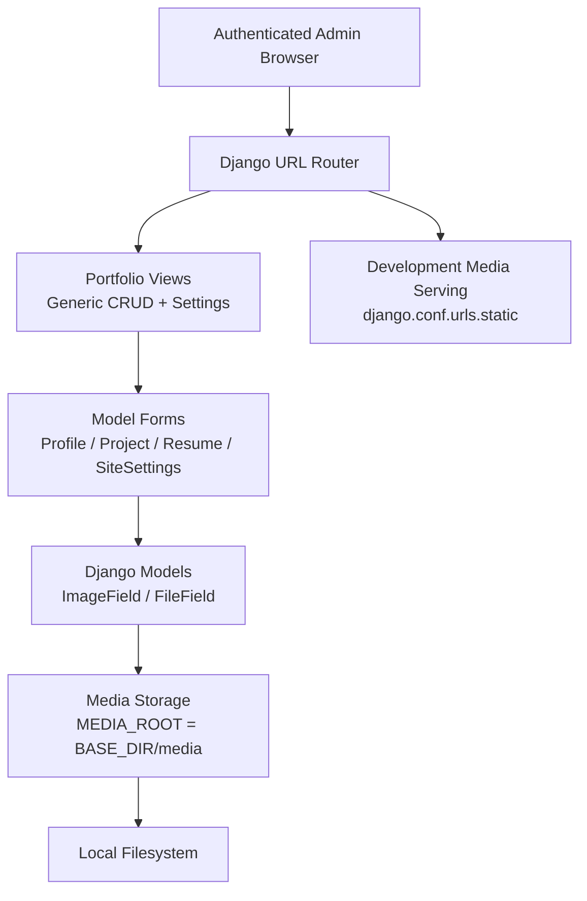
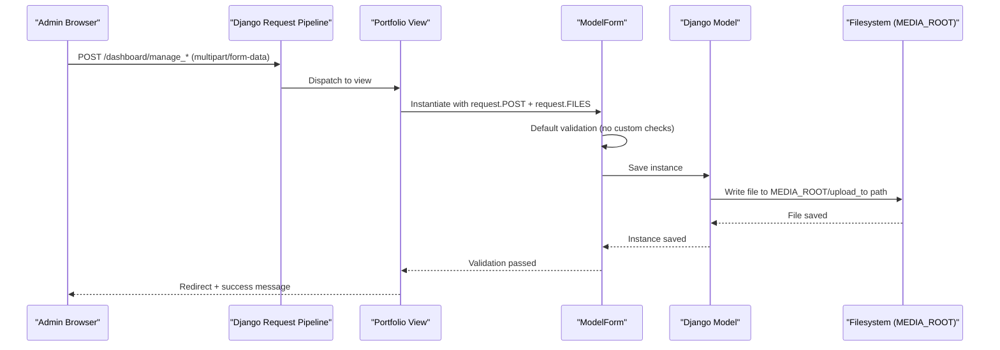
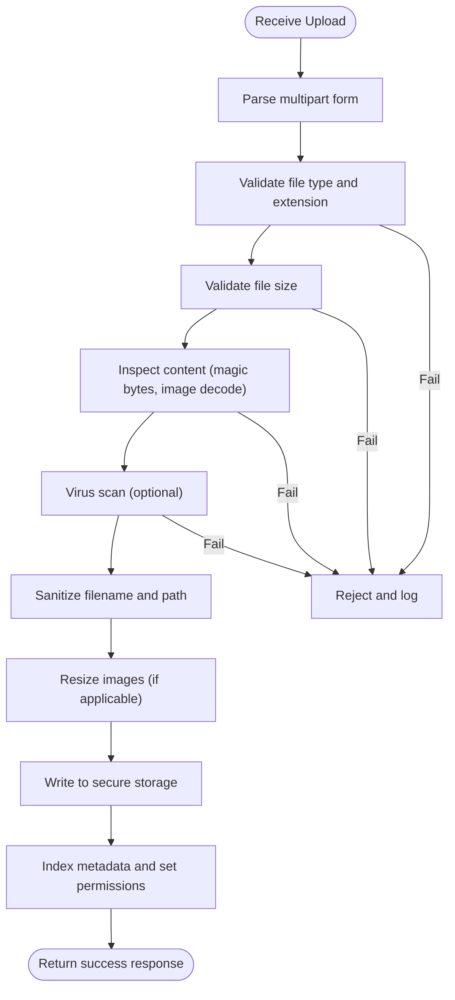
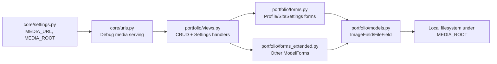

# File Upload Security

<cite>
**Referenced Files in This Document**
- [settings.py](file://core/settings.py)
- [urls.py](file://core/urls.py)
- [views.py](file://portfolio/views.py)
- [models.py](file://portfolio/models.py)
- [forms.py](file://portfolio/forms.py)
- [forms_extended.py](file://portfolio/forms_extended.py)
- [generic_form.html](file://templates/dashboard/generic_form.html)
</cite>

## Table of Contents
1. [Introduction](#introduction)
2. [Project Structure](#project-structure)
3. [Core Components](#core-components)
4. [Architecture Overview](#architecture-overview)
5. [Detailed Component Analysis](#detailed-component-analysis)
6. [Dependency Analysis](#dependency-analysis)
7. [Performance Considerations](#performance-considerations)
8. [Troubleshooting Guide](#troubleshooting-guide)
9. [Conclusion](#conclusion)

## Introduction
This document explains file upload security for the Portfolio CMS, focusing on how uploads are handled today and what must be hardened to prevent arbitrary file execution, denial-of-service attacks, directory traversal, and insecure media serving. It covers:
- Secure file upload implementation (type validation, size limits, malicious file detection)
- Image processing security and thumbnail generation safeguards
- Media storage configuration and secure serving
- Path sanitization and traversal prevention
- Safe handler patterns, virus scanning integration options, and backend storage hardening
- Common vulnerabilities and mitigation strategies
- Production best practices and monitoring

## Project Structure
The project is a Django application with:
- A core settings module defining media paths and URL prefixes
- URL routing that serves media files only in development
- Views that accept form submissions with file fields
- Models using Django’s `ImageField` and `FileField` for uploads
- Forms that delegate validation to Django’s model forms
- Templates that render upload forms with proper multipart encoding

**Diagram sources**
- [urls.py:22-28](file://core/urls.py#L22-L28)
- [views.py:85-221](file://portfolio/views.py#L85-L221)
- [models.py:4-290](file://portfolio/models.py#L4-L290)
- [settings.py:87-136](file://core/settings.py#L87-L136)

**Section sources**
- [settings.py:87-136](file://core/settings.py#L87-L136)
- [urls.py:22-28](file://core/urls.py#L22-L28)
- [views.py:85-221](file://portfolio/views.py#L85-L221)
- [models.py:4-290](file://portfolio/models.py#L4-L290)
- [forms.py:1-22](file://portfolio/forms.py#L1-L22)
- [forms_extended.py:1-78](file://portfolio/forms_extended.py#L1-L78)
- [generic_form.html:24-28](file://templates/dashboard/generic_form.html#L24-L28)

## Core Components
- Media configuration:
  - `MEDIA_URL` defines the public path prefix for uploaded content.
  - `MEDIA_ROOT` points to a local directory under the project root.
- URL-based media serving:
  - In development (`DEBUG=True`), Django serves media directly from `MEDIA_ROOT`.
- Upload entry points:
  - Profile management, generic CRUD views, and site settings all accept `request.FILES`.
- Data models:
  - Many models use `ImageField` or `FileField` with specific `upload_to` subdirectories.
- Forms:
  - All forms are ModelForms that inherit default Django validation behavior.

Key observations:
- There is no explicit file type allowlist or size limit enforcement in the current code.
- No custom validators or post-save hooks for image resizing or virus scanning are present.
- Media files are served by Django’s development helper when `DEBUG=True`.

**Section sources**
- [settings.py:87-136](file://core/settings.py#L87-L136)
- [urls.py:22-28](file://core/urls.py#L22-L28)
- [views.py:85-221](file://portfolio/views.py#L85-L221)
- [models.py:4-290](file://portfolio/models.py#L4-L290)
- [forms.py:1-22](file://portfolio/forms.py#L1-L22)
- [forms_extended.py:1-78](file://portfolio/forms_extended.py#L1-L78)

## Architecture Overview
The upload flow currently relies on Django’s built-in mechanisms without additional security layers:

**Diagram sources**
- [views.py:85-221](file://portfolio/views.py#L85-L221)
- [forms.py:1-22](file://portfolio/forms.py#L1-L22)
- [forms_extended.py:1-78](file://portfolio/forms_extended.py#L1-L78)
- [models.py:4-290](file://portfolio/models.py#L4-L290)
- [settings.py:87-136](file://core/settings.py#L87-L136)

## Detailed Component Analysis

### File Type Validation
Current state:
- The project does not define any custom file extension allowlists or MIME-type checks.
- `ImageField` validates that the uploaded content can be decoded as an image; `FileField` accepts any file type.

Risks:
- Executable scripts, web shells, or other dangerous files can be uploaded via `FileField` fields.
- Image-only fields may still accept malformed images that trigger parser vulnerabilities.

Recommended approach:
- Define strict allowlists per field:
  - Images: JPEG, PNG, GIF, WebP
  - Documents: PDF only where appropriate
- Validate both file extension and magic bytes at the form layer before saving.
- Reject files with ambiguous extensions or mismatched content types.

Security considerations:
- Do not rely solely on client-side restrictions.
- Normalize filenames and reject null bytes, backslashes, and path separators.
- Enforce server-side validation even if client-side validation exists.

[No sources needed since this section provides general guidance]

### Size Restrictions
Current state:
- No explicit per-field or global upload size limits are configured in the provided code.

Risks:
- Denial-of-service via large uploads consuming memory and disk space.
- Slow responses and resource exhaustion during image decoding.

Recommended approach:
- Set appropriate Django settings for maximum upload sizes.
- Enforce smaller limits per field where possible.
- Stream large files safely and avoid loading entire payloads into memory.

Operational notes:
- Ensure reverse proxies and WSGI servers also enforce upload size limits.
- Monitor disk usage and set quotas at the storage layer.

[No sources needed since this section provides general guidance]

### Malicious File Detection
Current state:
- No virus scanning or sandboxing is implemented.

Risks:
- Malware distribution through uploaded documents or images.
- Exploitation of image library vulnerabilities.

Recommended approach:
- Integrate a virus scanner for all uploads before making them publicly accessible.
- Quarantine suspicious files and alert administrators.
- For images, consider re-encoding to canonical formats and stripping metadata.

Integration options:
- Use a dedicated scanning service or CLI tool invoked asynchronously.
- Queue scans after initial acceptance and mark files as “pending” until cleared.

[No sources needed since this section provides general guidance]

### Image Processing Security and Thumbnail Generation
Current state:
- No custom image processing or thumbnail generation logic is present in the analyzed files.

Risks:
- If added later, naive image processing can be vulnerable to decompression bombs or oversized canvases.

Recommended approach:
- Limit maximum dimensions and canvas area.
- Re-encode images to safe formats and strip EXIF data.
- Process images in isolated workers with resource limits.
- Generate thumbnails only for approved image types.

[No sources needed since this section provides general guidance]

### Media File Storage Configuration
Current state:
- `MEDIA_ROOT` is set to a local directory under the project root.
- `MEDIA_URL` exposes uploads under `/media/`.
- Development media serving is enabled only when `DEBUG=True`.

Recommendations:
- Move `MEDIA_ROOT` outside the webroot or deployable tree.
- Serve media through a secure CDN or object storage with signed URLs.
- Disable direct filesystem exposure and restrict access controls.
- Separate read-only and write-only storage backends.

**Section sources**
- [settings.py:87-136](file://core/settings.py#L87-L136)
- [urls.py:22-28](file://core/urls.py#L22-L28)

### File Path Sanitization and Directory Traversal Prevention
Current state:
- Models specify `upload_to` subdirectories (for example, profile, projects, resumes).
- There is no explicit filename sanitization or traversal protection in the analyzed code.

Risks:
- Path traversal via crafted filenames could overwrite files or write outside intended directories.
- Ambiguous characters in filenames can cause inconsistent behavior across platforms.

Recommended approach:
- Sanitize filenames by removing path separators, null bytes, and unsafe characters.
- Hash or randomize stored filenames while preserving readable titles in metadata.
- Resolve final paths against `MEDIA_ROOT` and assert they remain within the allowed directory.
- Validate `upload_to` values and never concatenate untrusted user input.

**Section sources**
- [models.py:4-290](file://portfolio/models.py#L4-L290)

### Secure File Serving Mechanisms
Current state:
- When `DEBUG=True`, Django serves media files directly from `MEDIA_ROOT`.
- This convenience should not be used in production.

Recommendations:
- In production, serve media through a web server or CDN with strict headers and authentication.
- Restrict executable content types and disable script execution in upload directories.
- Use Content-Security-Policy and X-Content-Type-Options headers to mitigate XSS and MIME sniffing.
- Implement access controls for sensitive uploads (for example, private resumes).

**Section sources**
- [urls.py:22-28](file://core/urls.py#L22-L28)
- [settings.py:87-136](file://core/settings.py#L87-L136)

### Safe File Upload Handler Patterns
Patterns to implement:
- Centralized upload validator that enforces allowlists, size limits, and content inspection.
- Post-save hooks to scan files and generate safe thumbnails.
- Atomic writes to temporary locations followed by renaming into the final directory.
- Audit logging for every successful and failed upload attempt.

Example structure (conceptual):

[No sources needed since this diagram shows conceptual workflow, not actual code structure]

### Virus Scanning Integration Options
- Asynchronous scanning queue:
  - Accept file, mark as pending, scan in background, then activate.
- Real-time scanning:
  - Block upload until scan completes (higher latency).
- Policy engine:
  - Allow/deny based on scan results and file reputation.
- Quarantine:
  - Isolate suspicious files and notify admins.

[No sources needed since this section provides general guidance]

### Storage Backend Security Configurations
- Object storage:
  - Enable bucket policies that deny public write access.
  - Use presigned URLs for time-limited access.
  - Enable encryption at rest and in transit.
- Local filesystem:
  - Run the web server under a restricted user.
  - Set restrictive file permissions and ownership.
  - Exclude upload directories from static asset pipelines.

[No sources needed since this section provides general guidance]

## Dependency Analysis
The following diagram maps the relationships between components involved in file handling:

**Diagram sources**
- [settings.py:87-136](file://core/settings.py#L87-L136)
- [urls.py:22-28](file://core/urls.py#L22-L28)
- [views.py:85-221](file://portfolio/views.py#L85-L221)
- [forms.py:1-22](file://portfolio/forms.py#L1-L22)
- [forms_extended.py:1-78](file://portfolio/forms_extended.py#L1-L78)
- [models.py:4-290](file://portfolio/models.py#L4-L290)

**Section sources**
- [settings.py:87-136](file://core/settings.py#L87-L136)
- [urls.py:22-28](file://core/urls.py#L22-L28)
- [views.py:85-221](file://portfolio/views.py#L85-L221)
- [forms.py:1-22](file://portfolio/forms.py#L1-L22)
- [forms_extended.py:1-78](file://portfolio/forms_extended.py#L1-L78)
- [models.py:4-290](file://portfolio/models.py#L4-L290)

## Performance Considerations
- Avoid loading entire uploads into memory; stream large files.
- Limit concurrent image decoders and set worker timeouts.
- Cache thumbnails and normalized images.
- Offload scanning and resizing to background workers.
- Monitor disk I/O, memory usage, and queue depths.

[No sources needed since this section provides general guidance]

## Troubleshooting Guide
Common issues and mitigations:
- Large uploads timing out:
  - Increase server-level timeouts and adjust upload size limits appropriately.
- Invalid image errors:
  - Validate magic bytes and ensure libraries support the format.
- Permission denied on save:
  - Verify filesystem permissions and storage backend credentials.
- Unexpected file overwrites:
  - Ensure unique filenames and validate paths remain within `MEDIA_ROOT`.
- Publicly accessible executables:
  - Restrict MIME types and disable script execution in upload directories.

Operational checks:
- Confirm `DEBUG=False` in production and that media is not served by Django.
- Validate that `MEDIA_ROOT` is not inside the webroot.
- Review logs for repeated failed uploads and quarantine suspicious files.

[No sources needed since this section provides general guidance]

## Conclusion
The Portfolio CMS currently delegates file uploads to Django’s default mechanisms without explicit type validation, size limits, or malicious file detection. To secure uploads:
- Add strict allowlists and content inspection at the form layer
- Enforce size limits and process images safely
- Integrate virus scanning and quarantine workflows
- Sanitize filenames and protect against path traversal
- Serve media securely in production via CDN or object storage
- Monitor uploads and maintain audit trails

These steps will significantly reduce risks of arbitrary file execution, denial-of-service attacks, and insecure media serving.

[No sources needed since this section summarizes without analyzing specific files]