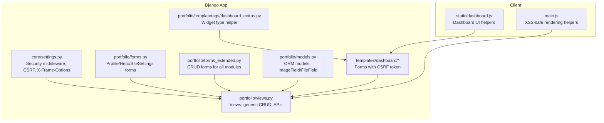
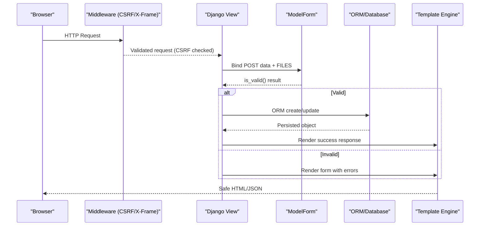
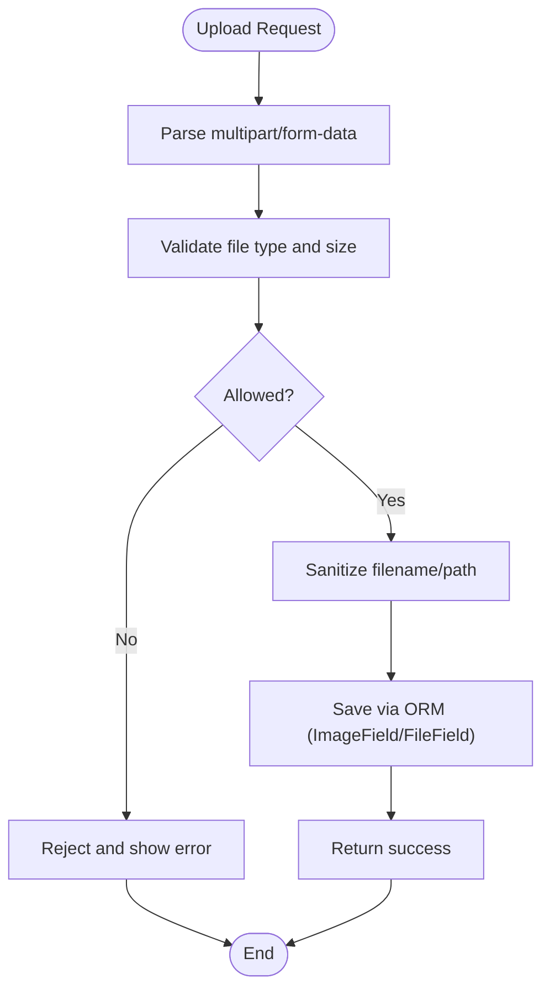
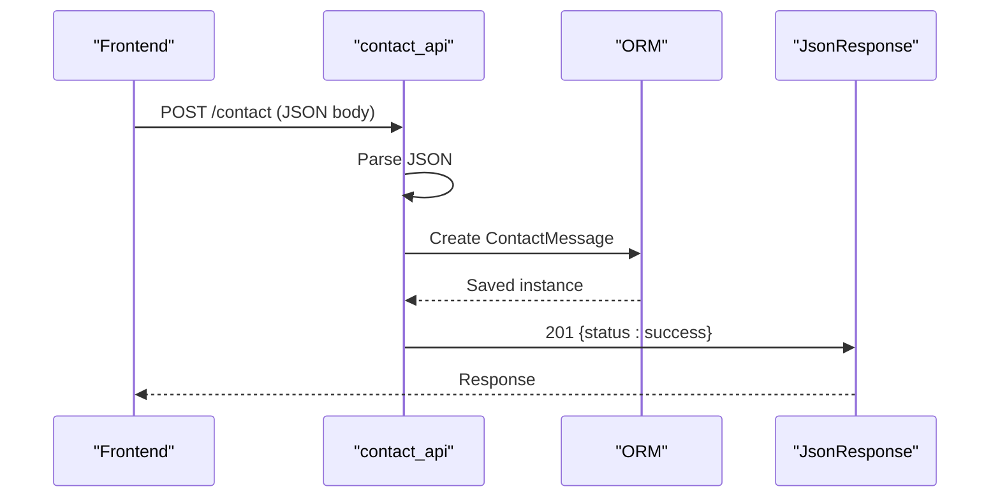
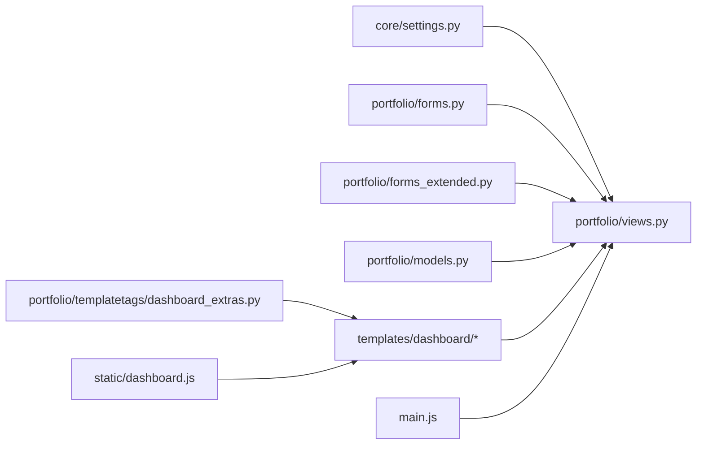

# Input Validation and Security

<cite>
**Referenced Files in This Document**
- [settings.py](file://core/settings.py)
- [forms.py](file://portfolio/forms.py)
- [forms_extended.py](file://portfolio/forms_extended.py)
- [views.py](file://portfolio/views.py)
- [models.py](file://portfolio/models.py)
- [generic_form.html](file://templates/dashboard/generic_form.html)
- [_form_fields.html](file://templates/dashboard/_form_fields.html)
- [dashboard_extras.py](file://portfolio/templatetags/dashboard_extras.py)
- [main.js](file://main.js)
- [dashboard.js](file://static/dashboard.js)
</cite>

## Table of Contents
1. [Introduction](#introduction)
2. [Project Structure](#project-structure)
3. [Core Components](#core-components)
4. [Architecture Overview](#architecture-overview)
5. [Detailed Component Analysis](#detailed-component-analysis)
6. [Dependency Analysis](#dependency-analysis)
7. [Performance Considerations](#performance-considerations)
8. [Troubleshooting Guide](#troubleshooting-guide)
9. [Conclusion](#conclusion)

## Introduction
This document explains how input validation and security are implemented across the Portfolio CMS. It covers Django form validation, CSRF protection, SQL injection prevention via the ORM, XSS mitigation on both server and client sides, file upload handling, and secure API practices. The goal is to provide actionable guidance for developers to maintain a secure codebase while keeping forms and data flows easy to understand.

## Project Structure
The project follows a standard Django layout:
- Core configuration lives under core/, including settings that enable security middleware and define media/static paths.
- The portfolio app contains models, forms, views, templates, and templatetags.
- Templates render forms with CSRF tokens and display errors safely.
- Client-side JavaScript includes helpers to escape content before insertion into the DOM.

**Diagram sources**
- [settings.py:45-53](file://core/settings.py#L45-L53)
- [forms.py:1-22](file://portfolio/forms.py#L1-L22)
- [forms_extended.py:1-78](file://portfolio/forms_extended.py#L1-L78)
- [views.py:127-221](file://portfolio/views.py#L127-L221)
- [models.py:4-298](file://portfolio/models.py#L4-L298)
- [generic_form.html:24-25](file://templates/dashboard/generic_form.html#L24-L25)
- [dashboard_extras.py:1-12](file://portfolio/templatetags/dashboard_extras.py#L1-L12)
- [main.js:34-38](file://main.js#L34-L38)
- [dashboard.js:272-276](file://static/dashboard.js#L272-L276)

**Section sources**
- [settings.py:45-53](file://core/settings.py#L45-L53)
- [generic_form.html:24-25](file://templates/dashboard/generic_form.html#L24-L25)

## Core Components
- Django forms: Model-based forms for profile, hero roles, site settings, and extended CRUD forms for all modules. They leverage Django’s built-in field validators and error reporting.
- Views: Generic CRUD flow validates forms, saves instances, and redirects with messages. Public-facing endpoints include a contact API and a JSON portfolio API.
- Models: Define fields including images and files; use Django’s ORM for safe database operations.
- Templates: Render forms with CSRF tokens and display validation errors.
- Client scripts: Provide HTML escaping utilities to prevent XSS when injecting dynamic content.

Key responsibilities:
- Form validation and sanitization occur at the form layer.
- CSRF protection is enforced by middleware and template tokens.
- Database queries use parameterized ORM methods to prevent SQL injection.
- File uploads are handled through model fields; additional validation should be added at the form level.
- XSS is mitigated by using Django’s auto-escaping and client-side escaping helpers.

**Section sources**
- [forms.py:1-22](file://portfolio/forms.py#L1-L22)
- [forms_extended.py:1-78](file://portfolio/forms_extended.py#L1-L78)
- [views.py:127-221](file://portfolio/views.py#L127-L221)
- [models.py:4-298](file://portfolio/models.py#L4-L298)
- [generic_form.html:24-46](file://templates/dashboard/generic_form.html#L24-L46)
- [_form_fields.html:1-25](file://templates/dashboard/_form_fields.html#L1-L25)
- [dashboard_extras.py:1-12](file://portfolio/templatetags/dashboard_extras.py#L1-L12)
- [main.js:34-38](file://main.js#L34-L38)
- [dashboard.js:272-276](file://static/dashboard.js#L272-L276)

## Architecture Overview
The request lifecycle emphasizes layered security:
- Middleware enforces CSRF and clickjacking protections.
- Views validate inputs via forms or explicit parsing.
- ORM prevents SQL injection through parameterized queries.
- Templates render data safely; client scripts escape content before DOM insertion.
- APIs return JSON responses with appropriate status codes.

**Diagram sources**
- [settings.py:45-53](file://core/settings.py#L45-L53)
- [views.py:127-178](file://portfolio/views.py#L127-L178)
- [forms.py:1-22](file://portfolio/forms.py#L1-L22)
- [forms_extended.py:1-78](file://portfolio/forms_extended.py#L1-L78)
- [models.py:4-298](file://portfolio/models.py#L4-L298)
- [generic_form.html:24-46](file://templates/dashboard/generic_form.html#L24-L46)

## Detailed Component Analysis

### Django Forms and Validation
- Profile, HeroRole, and SiteSettings forms are defined as ModelForms, inheriting field types and validators from models.
- Extended forms cover all CRUD modules, enabling consistent validation and error handling across the dashboard.
- Forms integrate with templates to display field-level errors and non-field errors.

Recommendations:
- Add custom validators where needed (e.g., URL format checks, length limits).
- Enforce allowed file types and sizes in form clean_<field>() methods.
- Use explicit field lists instead of fields='__all__' for sensitive models to reduce accidental exposure.

**Section sources**
- [forms.py:1-22](file://portfolio/forms.py#L1-L22)
- [forms_extended.py:1-78](file://portfolio/forms_extended.py#L1-L78)
- [_form_fields.html:1-25](file://templates/dashboard/_form_fields.html#L1-L25)

### CSRF Protection
- CSRF protection is enabled via middleware.
- All forms rendered by Django templates include the CSRF token.

Best practices:
- Keep CSRF middleware enabled.
- Ensure every state-changing POST includes the CSRF token.
- For AJAX, send the CSRF token in headers or cookies as required by your frontend.

**Section sources**
- [settings.py:45-53](file://core/settings.py#L45-L53)
- [generic_form.html:24-25](file://templates/dashboard/generic_form.html#L24-L25)

### SQL Injection Prevention
- All database interactions use Django’s ORM (objects.create, filter, update, delete), which parameterizes queries automatically.
- Avoid raw SQL unless absolutely necessary; if used, always pass parameters safely.

Guidelines:
- Prefer ORM methods over string concatenation for queries.
- Validate and sanitize any user-supplied values before using them in filters.

**Section sources**
- [views.py:127-221](file://portfolio/views.py#L127-L221)
- [models.py:4-298](file://portfolio/models.py#L4-L298)

### XSS Mitigation
- Server side: Django templates auto-escape variables by default.
- Client side: JavaScript includes an esc() function that escapes dangerous characters before inserting content into the DOM.

Recommendations:
- Never use innerHTML with unsanitized data.
- Always use textContent or sanitized HTML via a trusted library.
- Validate and encode URLs before setting href attributes.

**Section sources**
- [main.js:34-38](file://main.js#L34-L38)
- [dashboard.js:272-276](file://static/dashboard.js#L272-L276)

### File Upload Validation and Safe Handling
- Models define ImageField and FileField with upload_to directories.
- Views accept request.FILES and save validated forms.

Current behavior:
- No explicit file type or size validation is present in the provided forms.

Recommended enhancements:
- Add custom validators to enforce allowed MIME types and maximum file sizes.
- Sanitize filenames and avoid trusting client-provided names.
- Store files outside the web root when possible; serve via a secure backend.
- Implement virus scanning for uploaded documents.

**Diagram sources**
- [models.py:12-13](file://portfolio/models.py#L12-L13)
- [models.py:58-58](file://portfolio/models.py#L58-L58)
- [models.py:80-80](file://portfolio/models.py#L80-L80)
- [models.py:119-119](file://portfolio/models.py#L119-L119)
- [models.py:136-137](file://portfolio/models.py#L136-L137)
- [models.py:155-155](file://portfolio/models.py#L155-L155)
- [models.py:190-191](file://portfolio/models.py#L190-L191)
- [models.py:205-205](file://portfolio/models.py#L205-L205)
- [models.py:213-214](file://portfolio/models.py#L213-L214)
- [models.py:243-243](file://portfolio/models.py#L243-L243)
- [views.py:88-97](file://portfolio/views.py#L88-L97)
- [views.py:141-157](file://portfolio/views.py#L141-L157)

### Secure API Endpoints and Data Serialization
- Contact API endpoint accepts JSON, parses it, and persists data using ORM.
- Portfolio API returns structured JSON for public consumption.

Security considerations:
- The contact API uses csrf_exempt; ensure it is protected by other means (e.g., rate limiting, authentication, origin checks).
- Validate all incoming JSON fields and types before saving.
- Serialize only necessary fields and avoid leaking sensitive data.

**Diagram sources**
- [views.py:297-322](file://portfolio/views.py#L297-L322)
- [models.py:265-275](file://portfolio/models.py#L265-L275)

**Section sources**
- [views.py:297-322](file://portfolio/views.py#L297-L322)
- [views.py:335-457](file://portfolio/views.py#L335-L457)
- [models.py:265-275](file://portfolio/models.py#L265-L275)

### Common Vulnerabilities and Prevention
- Command injection: Avoid executing shell commands with user input. If necessary, use allowlist patterns and never pass user input directly to system calls.
- Path traversal: Do not construct file paths from user input; use Django’s storage abstraction and validate/sanitize filenames.
- Insecure direct object references: Use get_object_or_404 and ownership checks to ensure users can only access their own resources.
- Sensitive data exposure: Limit API payloads to minimal required fields; do not expose internal IDs or secrets.

Mitigations already present:
- CSRF middleware and template tokens.
- ORM usage for safe queries.
- Auto-escaping in templates and client-side escaping helpers.

**Section sources**
- [settings.py:45-53](file://core/settings.py#L45-L53)
- [generic_form.html:24-25](file://templates/dashboard/generic_form.html#L24-L25)
- [views.py:127-178](file://portfolio/views.py#L127-L178)
- [main.js:34-38](file://main.js#L34-L38)

## Dependency Analysis
The following diagram shows key dependencies between components involved in input validation and security.

**Diagram sources**
- [settings.py:45-53](file://core/settings.py#L45-L53)
- [forms.py:1-22](file://portfolio/forms.py#L1-L22)
- [forms_extended.py:1-78](file://portfolio/forms_extended.py#L1-L78)
- [views.py:127-221](file://portfolio/views.py#L127-L221)
- [models.py:4-298](file://portfolio/models.py#L4-L298)
- [generic_form.html:24-46](file://templates/dashboard/generic_form.html#L24-L46)
- [dashboard_extras.py:1-12](file://portfolio/templatetags/dashboard_extras.py#L1-L12)
- [main.js:34-38](file://main.js#L34-L38)
- [dashboard.js:272-276](file://static/dashboard.js#L272-L276)

**Section sources**
- [settings.py:45-53](file://core/settings.py#L45-L53)
- [views.py:127-221](file://portfolio/views.py#L127-L221)

## Performance Considerations
- Use select_related/prefetch_related in read-heavy endpoints to reduce N+1 queries.
- Cache static or infrequently changing data (e.g., site settings) to reduce database load.
- Validate and reject large or invalid uploads early to minimize processing overhead.
- Compress and resize images on upload to reduce bandwidth and storage costs.

[No sources needed since this section provides general guidance]

## Troubleshooting Guide
- CSRF errors: Ensure forms include the CSRF token and that the correct domain is configured in ALLOWED_HOSTS.
- Validation failures: Inspect form.errors in templates; add clear help_text and custom validators to guide users.
- Upload issues: Verify file type and size constraints; check MEDIA_ROOT permissions and disk space.
- API errors: Log parsed payload exceptions and return meaningful error responses without exposing stack traces.

**Section sources**
- [settings.py:24-30](file://core/settings.py#L24-L30)
- [generic_form.html:17-46](file://templates/dashboard/generic_form.html#L17-L46)
- [views.py:297-322](file://portfolio/views.py#L297-L322)

## Conclusion
The Portfolio CMS leverages Django’s built-in security features—CSRF middleware, ORM safety, and template auto-escaping—to protect against common threats. Forms provide a solid foundation for input validation, while client-side escaping adds an extra layer of defense against XSS. To further harden the application, implement explicit file upload validation, restrict API exposure, and adopt strict input filtering and output encoding policies across the stack.

[No sources needed since this section summarizes without analyzing specific files]