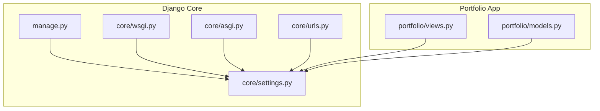
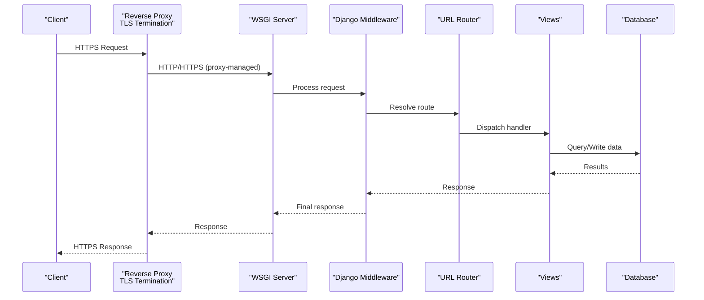
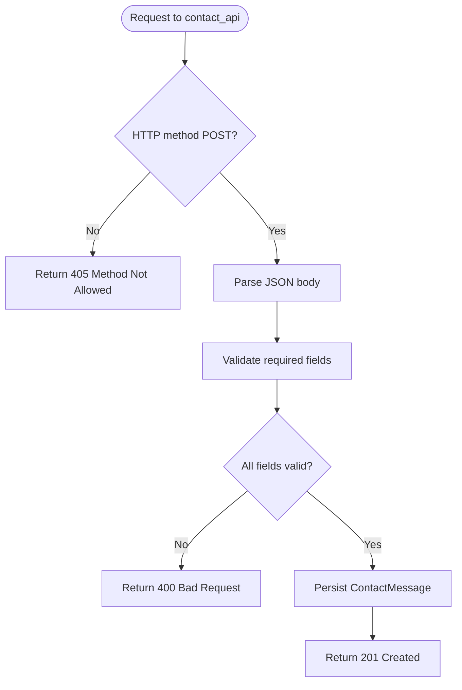
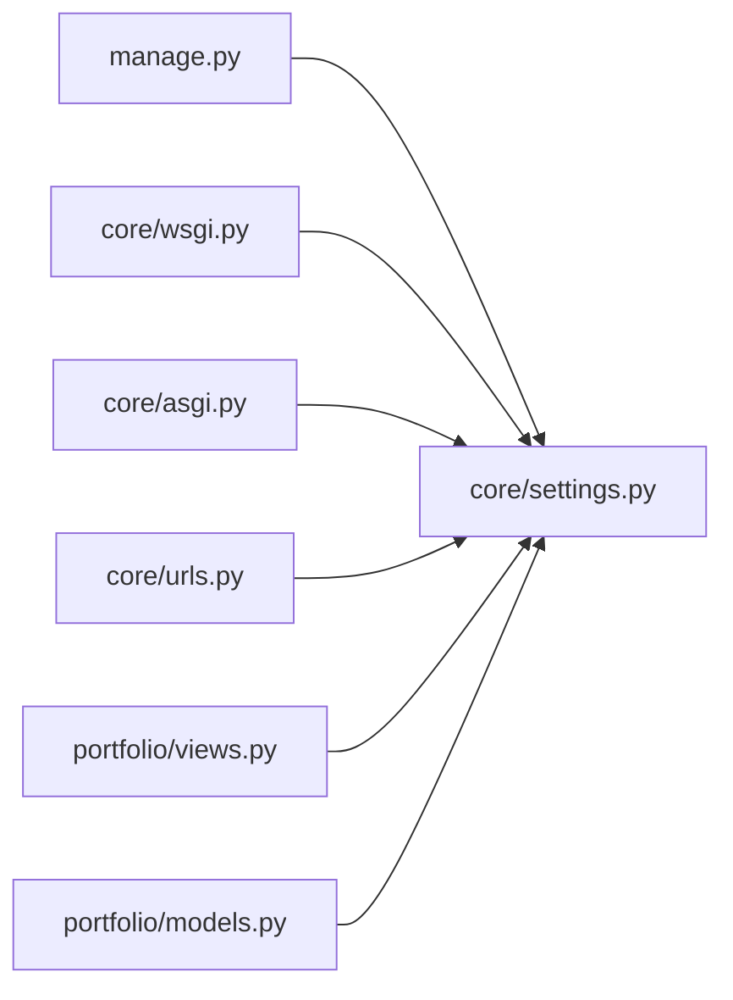

# Production Security Configuration

<cite>
**Referenced Files in This Document**
- [core/settings.py](file://core/settings.py)
- [core/urls.py](file://core/urls.py)
- [core/wsgi.py](file://core/wsgi.py)
- [core/asgi.py](file://core/asgi.py)
- [manage.py](file://manage.py)
- [portfolio/views.py](file://portfolio/views.py)
- [portfolio/models.py](file://portfolio/models.py)
</cite>

## Table of Contents
1. [Introduction](#introduction)
2. [Project Structure](#project-structure)
3. [Core Components](#core-components)
4. [Architecture Overview](#architecture-overview)
5. [Detailed Component Analysis](#detailed-component-analysis)
6. [Dependency Analysis](#dependency-analysis)
7. [Performance Considerations](#performance-considerations)
8. [Troubleshooting Guide](#troubleshooting-guide)
9. [Conclusion](#conclusion)
10. [Appendices](#appendices)

## Introduction
This document provides a comprehensive guide to production security configuration for the Portfolio CMS. It covers environment variable management with python-dotenv, separation of sensitive configuration, secure deployment practices, HTTP security headers, HTTPS enforcement and SSL/TLS setup, database security, logging considerations, monitoring approaches, performance optimization for security features, auditing and vulnerability scanning, incident response procedures, secure CI/CD pipelines, secret management, and compliance considerations. The guidance is grounded in the current codebase and highlights areas that require hardening before production use.

## Project Structure
The project follows a standard Django layout:
- core: Django project settings, WSGI/ASGI entry points, URL routing
- portfolio: Application views, models, forms, templates, and static assets
- manage.py: CLI entry point for administrative tasks

**Diagram sources**
- [core/settings.py:1-142](file://core/settings.py#L1-L142)
- [core/urls.py:1-30](file://core/urls.py#L1-L30)
- [core/wsgi.py:1-16](file://core/wsgi.py#L1-L16)
- [core/asgi.py:1-16](file://core/asgi.py#L1-L16)
- [manage.py:1-23](file://manage.py#L1-L23)
- [portfolio/views.py:1-458](file://portfolio/views.py#L1-L458)
- [portfolio/models.py:1-298](file://portfolio/models.py#L1-L298)

**Section sources**
- [core/settings.py:1-142](file://core/settings.py#L1-L142)
- [core/urls.py:1-30](file://core/urls.py#L1-L30)
- [core/wsgi.py:1-16](file://core/wsgi.py#L1-L16)
- [core/asgi.py:1-16](file://core/asgi.py#L1-L16)
- [manage.py:1-23](file://manage.py#L1-L23)
- [portfolio/views.py:1-458](file://portfolio/views.py#L1-L458)
- [portfolio/models.py:1-298](file://portfolio/models.py#L1-L298)

## Core Components
- Environment variables and secrets: Loaded via python-dotenv at application startup; critical values include SECRET_KEY, DEBUG, ALLOWED_HOSTS.
- Middleware stack: Includes SecurityMiddleware, SessionMiddleware, CommonMiddleware, CsrfViewMiddleware, AuthenticationMiddleware, MessageMiddleware, XFrameOptionsMiddleware.
- Database: SQLite by default; not suitable for production workloads without migration to a hardened relational database.
- Static and media files: Configured under BASE_DIR; served by Django only in debug mode.
- URLs: Admin interface exposed at /admin; app routes included under root.

Key observations:
- DEBUG defaults to True when not set, which must be explicitly disabled in production.
- ALLOWED_HOSTS defaults to localhost and loopback; must be restricted to production domains.
- No explicit SECURE_* settings are present (e.g., SECURE_SSL_REDIRECT, SECURE_HSTS_*), requiring addition for HTTPS enforcement and header hardening.
- CSRF protection is enabled globally; however, one API endpoint disables it, requiring careful review.

**Section sources**
- [core/settings.py:13-30](file://core/settings.py#L13-L30)
- [core/settings.py:45-53](file://core/settings.py#L45-L53)
- [core/settings.py:77-85](file://core/settings.py#L77-L85)
- [core/settings.py:87-94](file://core/settings.py#L87-L94)
- [core/urls.py:22-28](file://core/urls.py#L22-L28)
- [portfolio/views.py:300-322](file://portfolio/views.py#L300-L322)

## Architecture Overview
The request lifecycle flows from the WSGI/ASGI server into Django’s middleware stack, then to URL routing and view handlers. In production, a reverse proxy or web server should terminate TLS and enforce security policies before requests reach Django.

**Diagram sources**
- [core/wsgi.py:1-16](file://core/wsgi.py#L1-L16)
- [core/asgi.py:1-16](file://core/asgi.py#L1-L16)
- [core/settings.py:45-53](file://core/settings.py#L45-L53)
- [core/urls.py:22-28](file://core/urls.py#L22-L28)
- [portfolio/views.py:21-52](file://portfolio/views.py#L21-L52)

## Detailed Component Analysis

### Environment Variables and Secret Management
- python-dotenv is used to load .env at startup.
- Sensitive values loaded:
  - SECRET_KEY: Used for cryptographic signing; must be unique per environment and never committed.
  - DEBUG: Must be False in production.
  - ALLOWED_HOSTS: Comma-separated list of allowed hostnames; restrict to production domains.

Recommendations:
- Store secrets in a secure vault or platform-provided secret manager; do not rely solely on .env files in production.
- Validate required environment variables at startup and fail fast if missing.
- Rotate SECRET_KEY periodically and invalidate sessions upon rotation.

**Section sources**
- [core/settings.py:13-17](file://core/settings.py#L13-L17)
- [core/settings.py:24-30](file://core/settings.py#L24-L30)

### Security Headers and Middleware
Current middleware includes:
- SecurityMiddleware: Provides base protections (frame options, content type sniffing, etc.).
- CsrfViewMiddleware: Protects against cross-site request forgery.
- XFrameOptionsMiddleware: Adds X-Frame-Options header.

Missing or recommended additions for production:
- Enable SECURE_SSL_REDIRECT to force HTTPS.
- Configure SECURE_HSTS_* for HTTP Strict Transport Security.
- Set SECURE_BROWSER_XSS_FILTER and SECURE_CONTENT_TYPE_NOSNIFF where appropriate.
- Add Content-Security-Policy and Referrer-Policy via custom middleware or third-party packages.
- Ensure SESSION_COOKIE_SECURE, CSRF_COOKIE_SECURE, and SESSION_COOKIE_HTTPONLY are enabled over HTTPS.

Note: Some template context processors still include debug context; ensure DEBUG is False to avoid leaking information.

**Section sources**
- [core/settings.py:45-53](file://core/settings.py#L45-L53)
- [core/settings.py:57-72](file://core/settings.py#L57-L72)

### HTTPS Enforcement and SSL/TLS Setup
- Terminate TLS at the reverse proxy or edge service (e.g., Nginx, Traefik, Cloudflare).
- Enforce HTTPS redirection at the application layer using Django’s SECURE_SSL_REDIRECT.
- Use strong cipher suites and modern TLS versions at the proxy.
- Serve static/media files via a CDN or dedicated file server behind HTTPS.

Operational checklist:
- Disable insecure protocols (SSLv3, TLS 1.0/1.1).
- Enable HSTS with a conservative max-age initially, then increase after validation.
- Validate certificate chain and configure OCSP stapling.

**Section sources**
- [core/settings.py:24-30](file://core/settings.py#L24-L30)

### Database Security Settings
Current configuration uses SQLite in the project directory. For production:
- Migrate to a hardened relational database (PostgreSQL/MySQL) with least-privilege accounts.
- Use encrypted connections (TLS) to the database.
- Restrict database access to application hosts only.
- Back up databases securely and encrypt backups at rest.
- Avoid storing secrets in the database; prefer environment-based configuration.

Data model considerations:
- User authentication relies on Django’s built-in user model; ensure password hashing is enforced and login endpoints are protected.
- File uploads (ImageField/FileField) should be validated and stored outside the web root or on secure object storage.

**Section sources**
- [core/settings.py:77-85](file://core/settings.py#L77-L85)
- [portfolio/models.py:4-15](file://portfolio/models.py#L4-L15)
- [portfolio/models.py:129-147](file://portfolio/models.py#L129-L147)
- [portfolio/models.py:179-206](file://portfolio/models.py#L179-L206)
- [portfolio/models.py:242-250](file://portfolio/models.py#L242-L250)

### Logging Security Considerations
- Do not log sensitive data (passwords, tokens, PII).
- Centralize logs and protect them with access controls.
- Include structured logging with correlation IDs for traceability.
- Redact or mask sensitive fields in error traces.
- Monitor log volume and alert on anomalies.

[No sources needed since this section provides general guidance]

### Monitoring Approaches
- Health checks and readiness probes for containerized deployments.
- Metrics collection (request latency, error rates, throughput).
- Error tracking and alerting (e.g., Sentry).
- Audit trails for admin actions and data changes.

[No sources needed since this section provides general guidance]

### API Security and CSRF Handling
- One endpoint explicitly disables CSRF protection for external integrations. This requires strict input validation, rate limiting, IP allowlisting, and possibly token-based authentication.
- Prefer authenticated APIs with short-lived tokens and refresh mechanisms.
- Validate and sanitize all inputs; return minimal error details to clients.

**Diagram sources**
- [portfolio/views.py:300-322](file://portfolio/views.py#L300-L322)

**Section sources**
- [portfolio/views.py:300-322](file://portfolio/views.py#L300-L322)

### Authentication and Authorization
- Custom admin login flow exists; ensure it is replaced with Django’s built-in auth system and secured with proper session and CSRF protections.
- Enforce strong passwords via AUTH_PASSWORD_VALIDATORS (already configured).
- Restrict admin access to trusted IPs and require MFA where possible.

**Section sources**
- [core/settings.py:96-112](file://core/settings.py#L96-L112)
- [portfolio/views.py:28-52](file://portfolio/views.py#L28-L52)

### Static and Media Files Serving
- In debug mode, Django serves media files directly; disable this in production and serve via a secure file server or CDN.
- Restrict upload types and sizes; validate file contents and scan for malware.

**Section sources**
- [core/urls.py:27-28](file://core/urls.py#L27-L28)
- [core/settings.py:87-94](file://core/settings.py#L87-L94)

## Dependency Analysis
The following diagram shows key runtime dependencies between components:

**Diagram sources**
- [manage.py:7-18](file://manage.py#L7-L18)
- [core/wsgi.py:10-16](file://core/wsgi.py#L10-L16)
- [core/asgi.py:10-16](file://core/asgi.py#L10-L16)
- [core/urls.py:17-28](file://core/urls.py#L17-L28)
- [portfolio/views.py:1-18](file://portfolio/views.py#L1-L18)
- [portfolio/models.py:1-5](file://portfolio/models.py#L1-L5)

**Section sources**
- [manage.py:7-18](file://manage.py#L7-L18)
- [core/wsgi.py:10-16](file://core/wsgi.py#L10-L16)
- [core/asgi.py:10-16](file://core/asgi.py#L10-L16)
- [core/urls.py:17-28](file://core/urls.py#L17-L28)
- [portfolio/views.py:1-18](file://portfolio/views.py#L1-L18)
- [portfolio/models.py:1-5](file://portfolio/models.py#L1-L5)

## Performance Considerations
- Minimize overhead of security middleware by enabling only necessary features.
- Use connection pooling for the database and enable query caching where appropriate.
- Offload static/media serving to a CDN or object storage.
- Cache responses selectively and implement cache-control headers.
- Profile and monitor request latency; tune worker processes and threads based on workload.

[No sources needed since this section provides general guidance]

## Troubleshooting Guide
Common issues and resolutions:
- “Invalid HTTP_HOST header”: Update ALLOWED_HOSTS to include your production domain(s).
- Mixed content warnings: Ensure all resources are loaded over HTTPS and configure SECURE_SSL_REDIRECT.
- CSRF failures: Verify CSRF cookies are set and not blocked; ensure same-site policy aligns with deployment.
- Debug information leakage: Confirm DEBUG is False and remove debug context processors from production templates.
- API errors: Inspect JSON parsing and field validation in the contact API; add robust error handling and rate limiting.

**Section sources**
- [core/settings.py:24-30](file://core/settings.py#L24-L30)
- [core/settings.py:57-72](file://core/settings.py#L57-L72)
- [portfolio/views.py:300-322](file://portfolio/views.py#L300-L322)

## Conclusion
To secure the Portfolio CMS for production, prioritize disabling debug mode, enforcing HTTPS, restricting hosts, hardening security headers, migrating to a secure database, protecting uploads, and centralizing secrets. Implement comprehensive logging, monitoring, and auditing. Harden CI/CD with secret scanning, dependency checks, and automated tests. Establish incident response procedures and maintain compliance with relevant standards.

[No sources needed since this section summarizes without analyzing specific files]

## Appendices

### Production-Ready Settings Checklist
- Set DEBUG = False
- Set SECRET_KEY from a secure secret manager
- Set ALLOWED_HOSTS to production domains
- Enable SECURE_SSL_REDIRECT
- Configure SECURE_HSTS_* appropriately
- Set SESSION_COOKIE_SECURE, CSRF_COOKIE_SECURE, SESSION_COOKIE_HTTPONLY
- Restrict admin access and enable MFA
- Migrate from SQLite to PostgreSQL/MySQL with TLS
- Serve static/media via CDN or secure file server
- Enable structured logging and centralized log aggregation
- Integrate error tracking and metrics collection

[No sources needed since this section provides general guidance]

### Secure CI/CD Pipelines and Secret Management
- Never commit secrets; inject via CI secret stores.
- Run dependency vulnerability scans (e.g., pip-audit, safety).
- Perform static analysis and linting.
- Execute unit/integration tests and security tests.
- Scan images and artifacts for vulnerabilities.
- Rotate secrets regularly and audit access.

[No sources needed since this section provides general guidance]

### Compliance Considerations
- Align with applicable regulations (e.g., GDPR, CCPA) for data protection.
- Implement data retention and deletion policies.
- Provide privacy notices and consent mechanisms where required.
- Maintain audit logs for access and changes to sensitive data.

[No sources needed since this section provides general guidance]