# Security and Authentication

<cite>
**Referenced Files in This Document**
- [settings.py](file://core/settings.py)
- [urls.py](file://core/urls.py)
- [views.py](file://portfolio/views.py)
- [models.py](file://portfolio/models.py)
- [forms.py](file://portfolio/forms.py)
- [forms_extended.py](file://portfolio/forms_extended.py)
- [urls.py](file://portfolio/urls.py)
- [login.html](file://templates/dashboard/login.html)
- [context_processors.py](file://portfolio/context_processors.py)
</cite>

## Table of Contents
1. [Introduction](#introduction)
2. [Project Structure](#project-structure)
3. [Core Components](#core-components)
4. [Architecture Overview](#architecture-overview)
5. [Detailed Component Analysis](#detailed-component-analysis)
6. [Dependency Analysis](#dependency-analysis)
7. [Performance Considerations](#performance-considerations)
8. [Troubleshooting Guide](#troubleshooting-guide)
9. [Conclusion](#conclusion)

## Introduction
This document provides a comprehensive security analysis for the Portfolio CMS, focusing on authentication, authorization, session management, CSRF protection, input validation, SQL injection prevention via Django ORM, file upload security, security headers, XSS protections, secure file handling, production deployment best practices, environment variable management, and security monitoring. It also identifies current risks and recommends mitigations to harden the application.

## Project Structure
The project is a standard Django application with:
- Core settings and URL configuration under core/
- A portfolio app containing views, models, forms, URLs, and templates
- Static assets and media directories for uploads

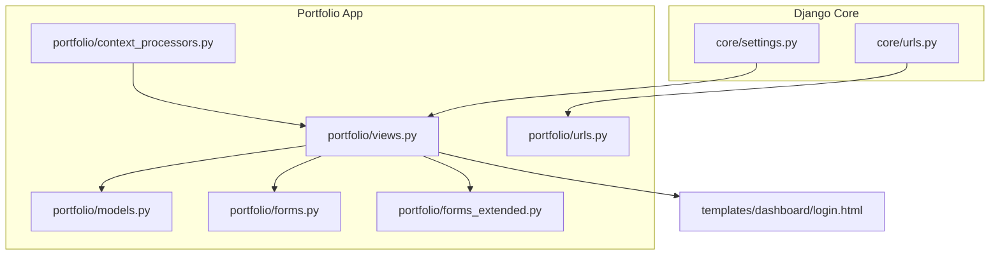

**Diagram sources**
- [settings.py:34-53](file://core/settings.py#L34-L53)
- [urls.py:22-28](file://core/urls.py#L22-L28)
- [urls.py:4-43](file://portfolio/urls.py#L4-L43)
- [views.py:1-18](file://portfolio/views.py#L1-L18)
- [models.py:1-10](file://portfolio/models.py#L1-L10)
- [forms.py:1-22](file://portfolio/forms.py#L1-L22)
- [forms_extended.py:1-78](file://portfolio/forms_extended.py#L1-L78)
- [login.html:46-66](file://templates/dashboard/login.html#L46-L66)
- [context_processors.py:4-8](file://portfolio/context_processors.py#L4-L8)

**Section sources**
- [settings.py:13-30](file://core/settings.py#L13-L30)
- [urls.py:22-28](file://core/urls.py#L22-L28)
- [urls.py:4-43](file://portfolio/urls.py#L4-L43)

## Core Components
- Authentication and Authorization:
  - Custom admin login flow using Django’s built-in User model and session-based login.
  - Dashboard routes protected by @login_required decorator.
- CSRF Protection:
  - CSRF middleware enabled; login form includes CSRF token.
- Input Validation:
  - ModelForm-based forms validate and sanitize data through Django’s form system.
- SQL Injection Prevention:
  - All database interactions use Django ORM; no raw SQL.
- File Uploads:
  - Media files stored under MEDIA_ROOT; served only in DEBUG mode by Django’s static helper.
- Security Headers:
  - SecurityMiddleware and XFrameOptionsMiddleware are active; additional headers not explicitly configured.

**Section sources**
- [views.py:28-56](file://portfolio/views.py#L28-L56)
- [views.py:58-207](file://portfolio/views.py#L58-L207)
- [settings.py:45-53](file://core/settings.py#L45-L53)
- [login.html:46-66](file://templates/dashboard/login.html#L46-L66)
- [forms.py:4-21](file://portfolio/forms.py#L4-L21)
- [forms_extended.py:4-77](file://portfolio/forms_extended.py#L4-L77)
- [models.py:4-298](file://portfolio/models.py#L4-L298)
- [urls.py:27-28](file://core/urls.py#L27-L28)

## Architecture Overview
The request lifecycle for authenticated dashboard operations and API endpoints follows this pattern:

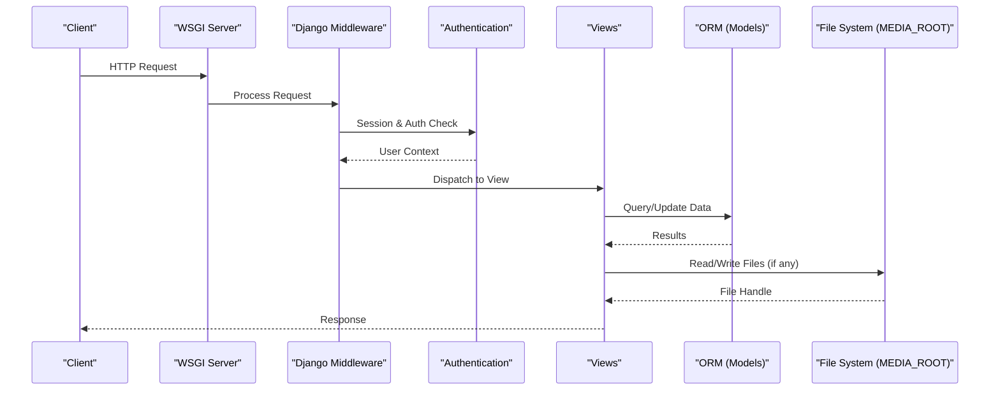

**Diagram sources**
- [settings.py:45-53](file://core/settings.py#L45-L53)
- [views.py:58-207](file://portfolio/views.py#L58-L207)
- [models.py:4-298](file://portfolio/models.py#L4-L298)
- [urls.py:27-28](file://core/urls.py#L27-L28)

## Detailed Component Analysis

### Authentication Implementation
- Custom Admin Login:
  - The admin login view accepts username/password, performs hardcoded credential checks, creates or retrieves a superuser if needed, and logs the user in using Django’s session login.
  - This approach bypasses Django’s default password hashing and should be replaced with proper authentication logic using authenticate() and set_password().
- Protected Routes:
  - All dashboard routes are decorated with @login_required, ensuring unauthenticated users are redirected to the login page.
- Logout:
  - The logout view calls Django’s logout() to clear the session and redirects to the login page.

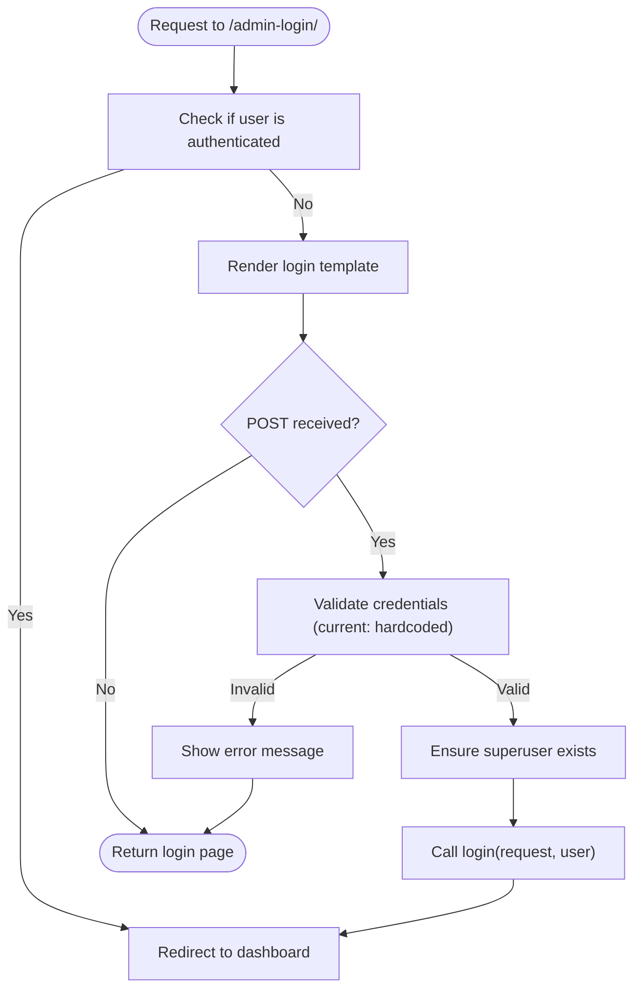

**Diagram sources**
- [views.py:28-56](file://portfolio/views.py#L28-L56)
- [login.html:46-66](file://templates/dashboard/login.html#L46-L66)

**Section sources**
- [views.py:28-56](file://portfolio/views.py#L28-L56)
- [views.py:58-56](file://portfolio/views.py#L58-L56)
- [login.html:46-66](file://templates/dashboard/login.html#L46-L66)

### Authorization Decorators
- Every dashboard view uses @login_required to enforce authentication before executing business logic.
- This prevents unauthorized access to content management features such as projects, certificates, skills, education, experience, achievements, services, workshops, statistics, technologies, resume, social links, and settings.

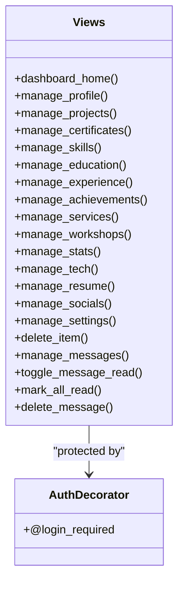

**Diagram sources**
- [views.py:58-207](file://portfolio/views.py#L58-L207)

**Section sources**
- [views.py:58-207](file://portfolio/views.py#L58-L207)

### Session Management
- Sessions are enabled via SessionMiddleware.
- The login view uses Django’s login() to establish a session; logout uses logout() to terminate it.
- No explicit session cookie security options are configured beyond defaults.

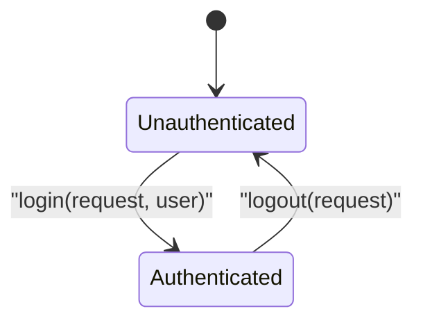

**Diagram sources**
- [settings.py:45-53](file://core/settings.py#L45-L53)
- [views.py:28-56](file://portfolio/views.py#L28-L56)

**Section sources**
- [settings.py:45-53](file://core/settings.py#L45-L53)
- [views.py:28-56](file://portfolio/views.py#L28-L56)

### Password Security
- Password validators are enabled to enforce complexity rules.
- The custom login flow currently sets passwords directly without using set_password(), which bypasses hashing. This must be corrected to ensure secure storage.

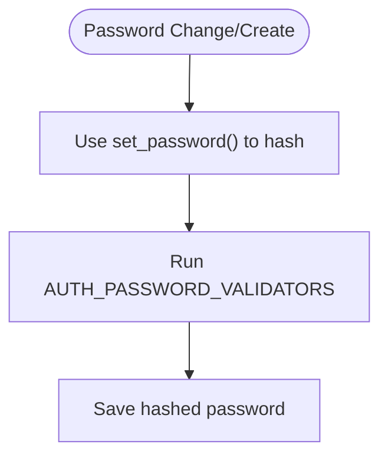

**Diagram sources**
- [settings.py:99-112](file://core/settings.py#L99-L112)
- [views.py:38-45](file://portfolio/views.py#L38-L45)

**Section sources**
- [settings.py:99-112](file://core/settings.py#L99-L112)
- [views.py:38-45](file://portfolio/views.py#L38-L45)

### CSRF Protection
- CSRF middleware is enabled.
- The login form includes , protecting against cross-site request forgery.
- One API endpoint is marked @csrf_exempt; this requires careful justification and alternative protections.

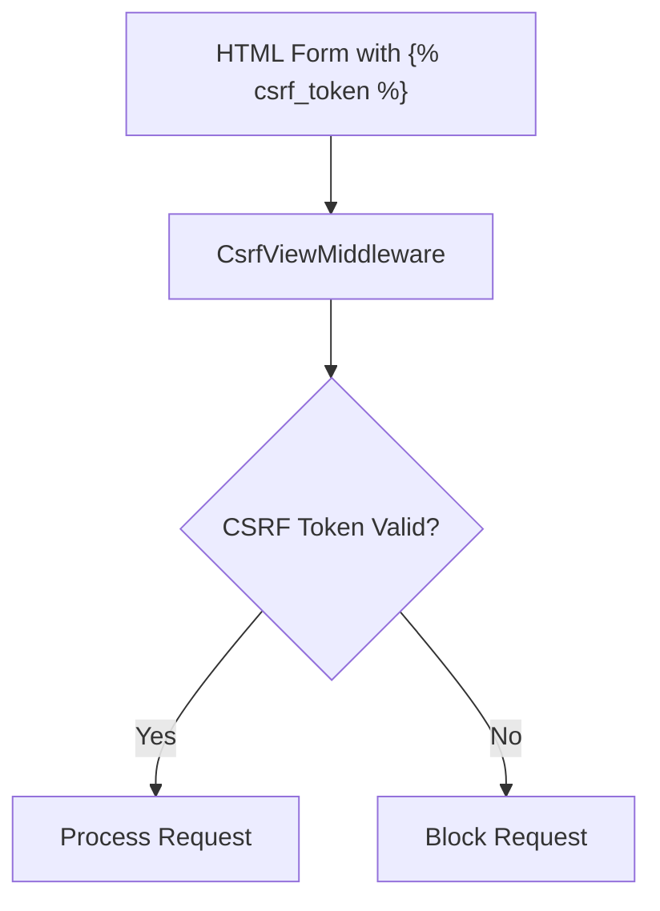

**Diagram sources**
- [settings.py:45-53](file://core/settings.py#L45-L53)
- [login.html:46-66](file://templates/dashboard/login.html#L46-L66)
- [views.py:298-322](file://portfolio/views.py#L298-L322)

**Section sources**
- [settings.py:45-53](file://core/settings.py#L45-L53)
- [login.html:46-66](file://templates/dashboard/login.html#L46-L66)
- [views.py:298-322](file://portfolio/views.py#L298-L322)

### Input Validation and Sanitization
- Forms are defined as ModelForms, leveraging Django’s built-in field validation and sanitization.
- Generic CRUD views validate forms before saving to the database.
- Contact API parses JSON body and stores fields directly; consider adding explicit validation and sanitization.

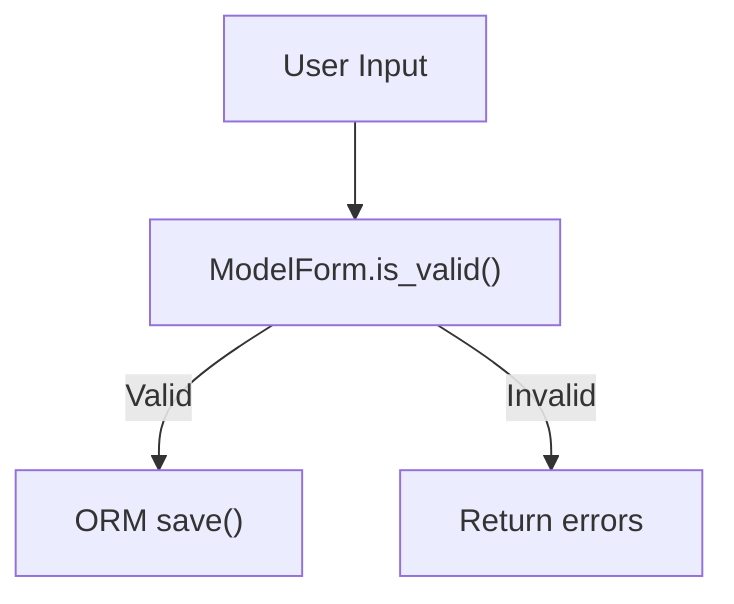

**Diagram sources**
- [forms.py:4-21](file://portfolio/forms.py#L4-L21)
- [forms_extended.py:4-77](file://portfolio/forms_extended.py#L4-L77)
- [views.py:127-180](file://portfolio/views.py#L127-L180)
- [views.py:300-322](file://portfolio/views.py#L300-L322)

**Section sources**
- [forms.py:4-21](file://portfolio/forms.py#L4-L21)
- [forms_extended.py:4-77](file://portfolio/forms_extended.py#L4-L77)
- [views.py:127-180](file://portfolio/views.py#L127-L180)
- [views.py:300-322](file://portfolio/views.py#L300-L322)

### SQL Injection Prevention
- All database operations use Django ORM methods like objects.create(), filter(), get_object_or_404(), and update_fields=.
- No raw SQL queries are present, minimizing SQL injection risk.

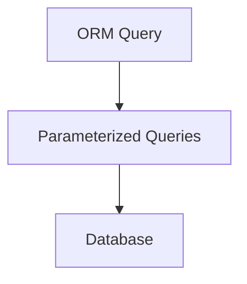

**Diagram sources**
- [views.py:58-207](file://portfolio/views.py#L58-L207)
- [models.py:4-298](file://portfolio/models.py#L4-L298)

**Section sources**
- [views.py:58-207](file://portfolio/views.py#L58-L207)
- [models.py:4-298](file://portfolio/models.py#L4-L298)

### File Upload Security
- Models define ImageField and FileField with upload_to paths under MEDIA_ROOT.
- In DEBUG mode, Django serves media files directly from MEDIA_ROOT.
- There is no explicit file type or size validation at the view level; rely on form/model validation and server-side restrictions.

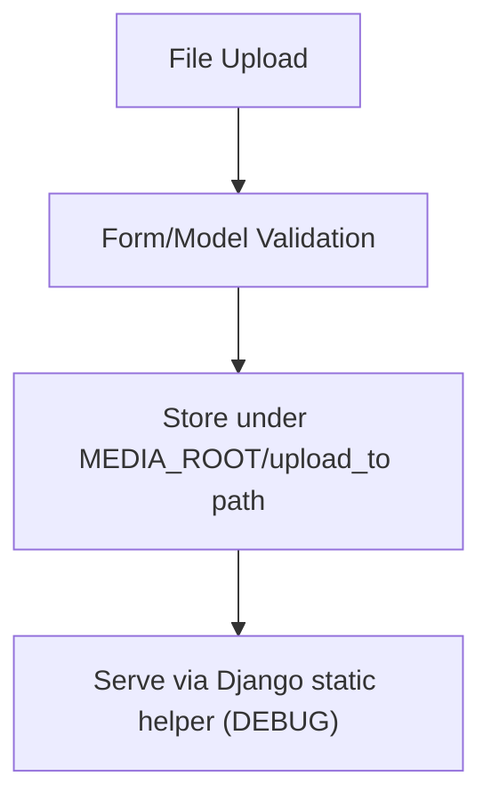

**Diagram sources**
- [models.py:12-13](file://portfolio/models.py#L12-L13)
- [models.py:137-137](file://portfolio/models.py#L137-L137)
- [models.py:243-243](file://portfolio/models.py#L243-L243)
- [urls.py:27-28](file://core/urls.py#L27-L28)

**Section sources**
- [models.py:12-13](file://portfolio/models.py#L12-L13)
- [models.py:137-137](file://portfolio/models.py#L137-L137)
- [models.py:243-243](file://portfolio/models.py#L243-L243)
- [urls.py:27-28](file://core/urls.py#L27-L28)

### Security Headers and XSS Protection
- SecurityMiddleware is enabled, providing some default security headers.
- XFrameOptionsMiddleware is enabled to mitigate clickjacking.
- No explicit Content-Security-Policy or other advanced headers are configured.
- Templates do not show explicit auto-escaping usage; Django templates auto-escape by default, but care is needed when rendering HTML from context.

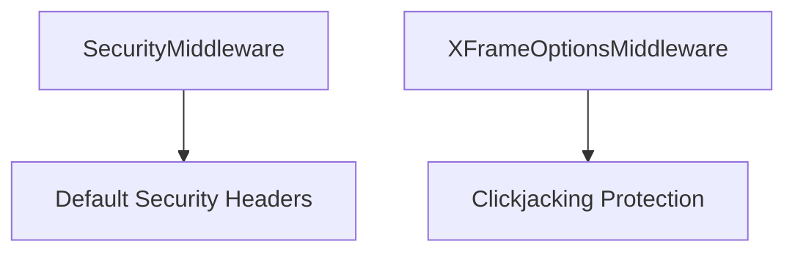

**Diagram sources**
- [settings.py:45-53](file://core/settings.py#L45-L53)

**Section sources**
- [settings.py:45-53](file://core/settings.py#L45-L53)

### Secure File Handling Practices
- Media files are stored under MEDIA_ROOT and served only in DEBUG mode.
- For production, serve media via a secure web server (e.g., Nginx) with restricted permissions and validated file types/sizes.
- Avoid exposing sensitive files outside MEDIA_ROOT and restrict direct execution of uploaded files.

**Section sources**
- [urls.py:27-28](file://core/urls.py#L27-L28)
- [settings.py:87-89](file://core/settings.py#L87-L89)

## Dependency Analysis
The following diagram shows key dependencies between components involved in security:

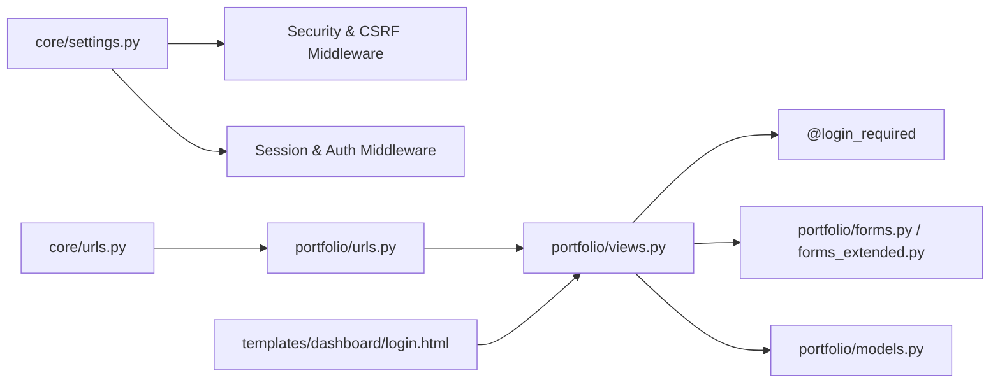

**Diagram sources**
- [settings.py:45-53](file://core/settings.py#L45-L53)
- [urls.py:4-43](file://portfolio/urls.py#L4-L43)
- [urls.py:22-28](file://core/urls.py#L22-L28)
- [views.py:1-18](file://portfolio/views.py#L1-L18)
- [forms.py:4-21](file://portfolio/forms.py#L4-L21)
- [forms_extended.py:4-77](file://portfolio/forms_extended.py#L4-L77)
- [models.py:4-298](file://portfolio/models.py#L4-L298)
- [login.html:46-66](file://templates/dashboard/login.html#L46-L66)

**Section sources**
- [settings.py:45-53](file://core/settings.py#L45-L53)
- [urls.py:4-43](file://portfolio/urls.py#L4-L43)
- [urls.py:22-28](file://core/urls.py#L22-L28)
- [views.py:1-18](file://portfolio/views.py#L1-L18)
- [forms.py:4-21](file://portfolio/forms.py#L4-L21)
- [forms_extended.py:4-77](file://portfolio/forms_extended.py#L4-L77)
- [models.py:4-298](file://portfolio/models.py#L4-L298)
- [login.html:46-66](file://templates/dashboard/login.html#L46-L66)

## Performance Considerations
- ORM queries are generally efficient; avoid N+1 issues by using select_related/prefetch_related where appropriate.
- Excessive file I/O during requests can degrade performance; consider caching frequently accessed data and offloading large file serving to a CDN or object storage.
- Keep DEBUG=False in production to reduce overhead and prevent debug information leakage.

[No sources needed since this section provides general guidance]

## Troubleshooting Guide
- Authentication Issues:
  - If users cannot log in, verify that the login flow uses proper authentication and password hashing.
  - Ensure sessions are working and cookies are not blocked by browser settings.
- CSRF Errors:
  - Confirm that forms include the CSRF token and that the domain matches ALLOWED_HOSTS.
- File Upload Failures:
  - Verify MEDIA_ROOT permissions and that files are within allowed types and sizes.
  - Ensure the web server has write access to MEDIA_ROOT in development.
- Security Header Checks:
  - Inspect response headers to confirm SecurityMiddleware and XFrameOptionsMiddleware are active.

**Section sources**
- [views.py:28-56](file://portfolio/views.py#L28-L56)
- [settings.py:45-53](file://core/settings.py#L45-L53)
- [urls.py:27-28](file://core/urls.py#L27-L28)

## Conclusion
The Portfolio CMS leverages Django’s built-in security features including CSRF protection, session management, and ORM-based queries to mitigate common vulnerabilities. However, several areas require attention:
- Replace the hardcoded credential check with proper authentication and password hashing.
- Add explicit file upload validation and size/type restrictions.
- Configure additional security headers (e.g., CSP, HSTS) and review the @csrf_exempt endpoint.
- Enforce strict environment variable management for secrets and disable DEBUG in production.
- Implement security monitoring and logging to detect anomalies.

[No sources needed since this section summarizes without analyzing specific files]