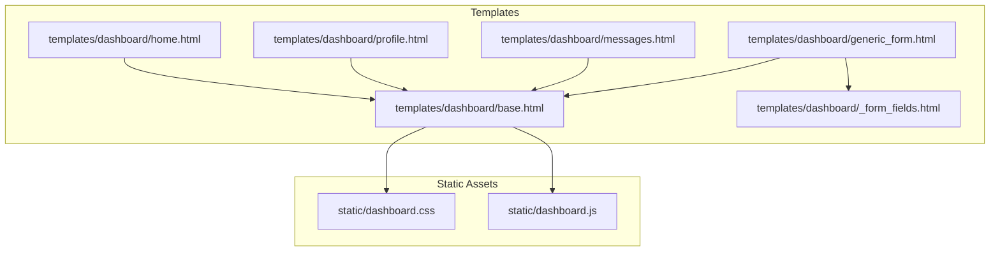
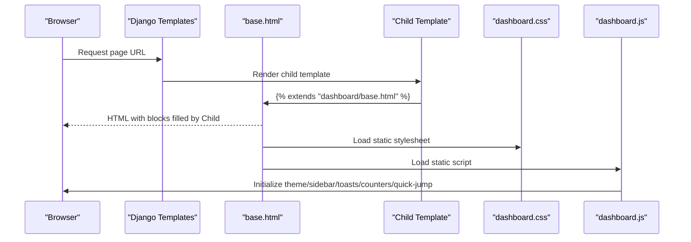
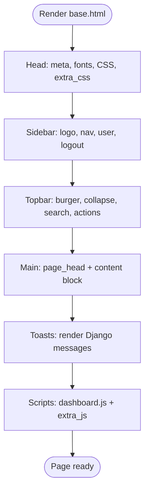
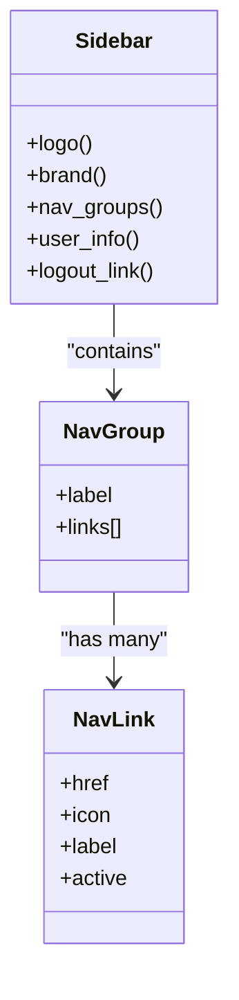
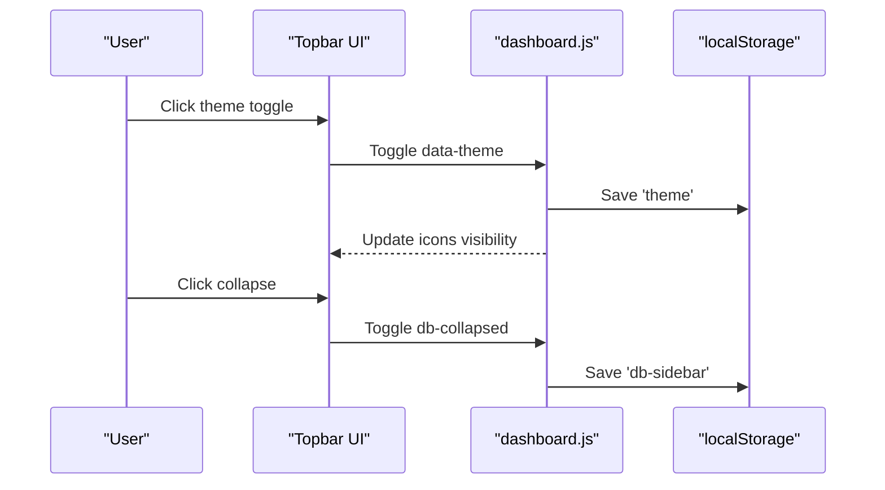
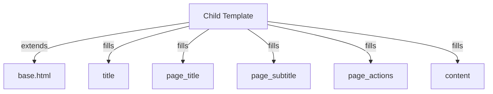
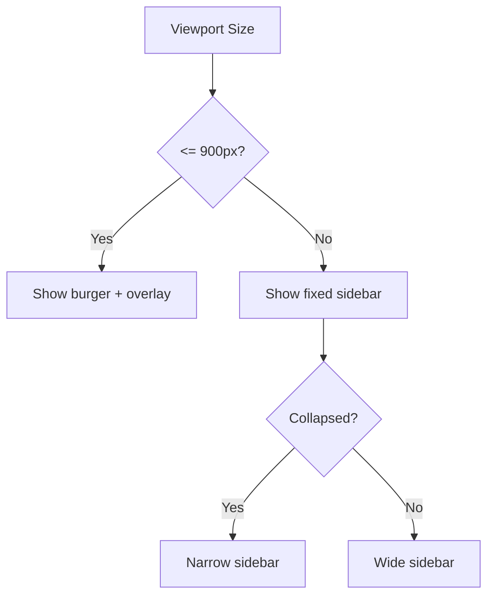
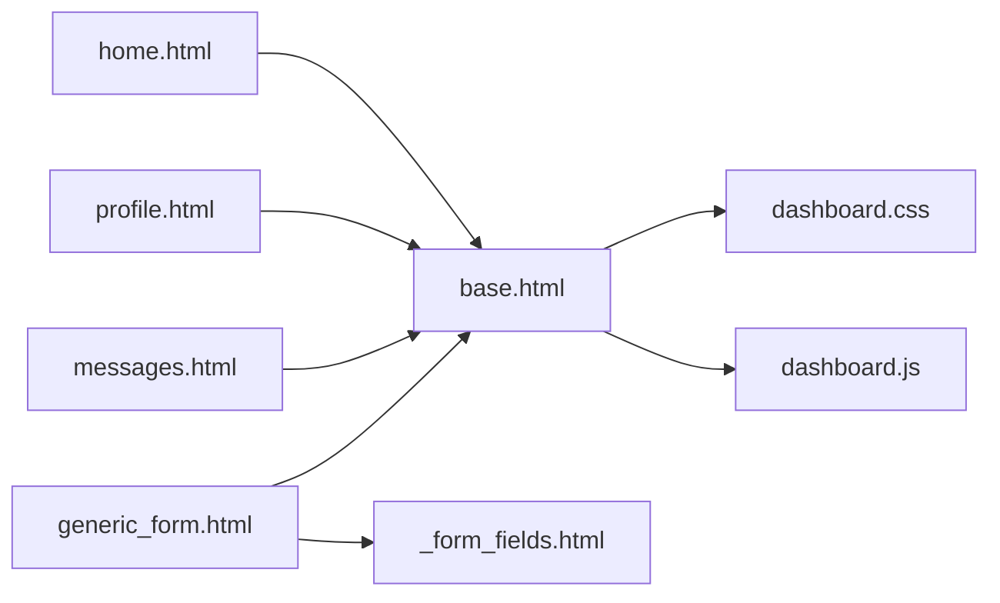

# Base Template Structure

<cite>
**Referenced Files in This Document**
- [base.html](file://templates/dashboard/base.html)
- [home.html](file://templates/dashboard/home.html)
- [profile.html](file://templates/dashboard/profile.html)
- [messages.html](file://templates/dashboard/messages.html)
- [generic_form.html](file://templates/dashboard/generic_form.html)
- [_form_fields.html](file://templates/dashboard/_form_fields.html)
- [dashboard.css](file://static/dashboard.css)
- [dashboard.js](file://static/dashboard.js)
</cite>

## Table of Contents
1. [Introduction](#introduction)
2. [Project Structure](#project-structure)
3. [Core Components](#core-components)
4. [Architecture Overview](#architecture-overview)
5. [Detailed Component Analysis](#detailed-component-analysis)
6. [Dependency Analysis](#dependency-analysis)
7. [Performance Considerations](#performance-considerations)
8. [Troubleshooting Guide](#troubleshooting-guide)
9. [Conclusion](#conclusion)

## Introduction
This document explains the Django base template structure used by the dashboard application. It covers layout inheritance, block definitions for content sections, static file inclusion mechanisms, sidebar navigation, header components, and toast notifications. It also documents how child templates extend the base template using  and , how to add new blocks, modify the layout, and integrate custom JavaScript. Finally, it addresses responsive design patterns, mobile-first considerations, and accessibility built into the base architecture.

## Project Structure
The dashboard uses a single base template that defines the global shell (HTML head, sidebar, topbar, main content area, and shared scripts). Child templates extend this base and fill in specific blocks.

**Diagram sources**
- [base.html:1-188](file://templates/dashboard/base.html#L1-L188)
- [home.html:1-134](file://templates/dashboard/home.html#L1-L134)
- [profile.html:1-37](file://templates/dashboard/profile.html#L1-L37)
- [messages.html:1-69](file://templates/dashboard/messages.html#L1-L69)
- [generic_form.html:1-63](file://templates/dashboard/generic_form.html#L1-L63)
- [_form_fields.html:1-25](file://templates/dashboard/_form_fields.html#L1-L25)
- [dashboard.css:1-800](file://static/dashboard.css#L1-L800)
- [dashboard.js:1-287](file://static/dashboard.js#L1-L287)

**Section sources**
- [base.html:1-188](file://templates/dashboard/base.html#L1-L188)
- [dashboard.css:1-800](file://static/dashboard.css#L1-L800)
- [dashboard.js:1-287](file://static/dashboard.js#L1-L287)

## Core Components
- Base template provides:
  - Global HTML shell with theme initialization script and preconnects for fonts.
  - Sidebar with grouped navigation links and active state detection.
  - Topbar with burger menu, collapse toggle, quick jump search, and action buttons.
  - Main content wrapper with page title/subtitle/actions slots and a primary content block.
  - Toast container rendering Django messages with auto-dismiss behavior.
  - Static assets: dashboard.css and dashboard.js.

- Child templates provide:
  - Page-specific titles, subtitles, actions, and content.
  - Forms and lists using shared card/table styles.

**Section sources**
- [base.html:1-188](file://templates/dashboard/base.html#L1-L188)
- [home.html:1-134](file://templates/dashboard/home.html#L1-L134)
- [messages.html:1-69](file://templates/dashboard/messages.html#L1-L69)
- [generic_form.html:1-63](file://templates/dashboard/generic_form.html#L1-L63)

## Architecture Overview
The base template implements a consistent layout pattern:
- Layout inheritance via .
- Block placeholders for title, page_title, page_subtitle, page_actions, and content.
- Static files included through Django’s static tag.
- Theme persistence via localStorage and data-theme attribute on <html>.
- Sidebar and topbar are part of the base; pages only supply content.

**Diagram sources**
- [base.html:1-188](file://templates/dashboard/base.html#L1-L188)
- [home.html:1-134](file://templates/dashboard/home.html#L1-L134)
- [dashboard.css:1-800](file://static/dashboard.css#L1-L800)
- [dashboard.js:1-287](file://static/dashboard.js#L1-L287)

## Detailed Component Analysis

### Base Template Layout and Blocks
- Head section:
  - Loads Google Fonts and Font Awesome via CDN.
  - Includes dashboard.css and exposes extra_css block for per-page styles.
  - Initializes theme before first paint to avoid flash.
- Body structure:
  - Sidebar with logo, brand, nav groups, user info, and logout link.
  - Topbar with burger button, collapse button, quick jump input, live site link, messages icon, and theme toggle.
  - Main content area with page head (title/subtitle/actions) and content block.
  - Toast container for Django messages.
  - Footer script includes dashboard.js and extra_js block for per-page scripts.

Key blocks exposed by base:
- title: Browser tab title.
- page_title: Primary heading inside the page.
- page_subtitle: Subheading under the page title.
- page_actions: Action buttons aligned to the right of the page head.
- content: Main page body.
- extra_css: Additional CSS for a specific page.
- extra_js: Additional JavaScript for a specific page.

**Diagram sources**
- [base.html:1-188](file://templates/dashboard/base.html#L1-L188)

**Section sources**
- [base.html:1-188](file://templates/dashboard/base.html#L1-L188)

### Sidebar Navigation Implementation
- The sidebar is defined in the base template and contains:
  - Logo and branding.
  - Grouped navigation links with icons and labels.
  - Active link highlighting based on current URL name.
  - Badge for unread messages when available.
  - User avatar and username with a logout action.
- Styling and behavior:
  - Fixed left panel with glassmorphism background.
  - Collapsible on desktop via a dedicated button.
  - Drawer-style on mobile with overlay and keyboard support.
  - State persisted in localStorage.

**Diagram sources**
- [base.html:27-121](file://templates/dashboard/base.html#L27-L121)
- [dashboard.css:122-319](file://static/dashboard.css#L122-L319)
- [dashboard.js:40-81](file://static/dashboard.js#L40-L81)

**Section sources**
- [base.html:27-121](file://templates/dashboard/base.html#L27-L121)
- [dashboard.css:122-319](file://static/dashboard.css#L122-L319)
- [dashboard.js:40-81](file://static/dashboard.js#L40-L81)

### Header Components (Topbar)
- Burger button toggles the mobile drawer.
- Collapse button toggles the collapsed state on desktop.
- Quick jump search provides command-palette-like navigation across sidebar links.
- Action buttons include viewing the live site, opening messages, and toggling theme.

**Diagram sources**
- [base.html:124-153](file://templates/dashboard/base.html#L124-L153)
- [dashboard.js:25-35](file://static/dashboard.js#L25-L35)
- [dashboard.js:64-76](file://static/dashboard.js#L64-L76)

**Section sources**
- [base.html:124-153](file://templates/dashboard/base.html#L124-L153)
- [dashboard.js:25-35](file://static/dashboard.js#L25-L35)
- [dashboard.js:64-76](file://static/dashboard.js#L64-L76)

### Child Templates Extending Base
- home.html:
  - Sets title, page_title, page_subtitle, page_actions, and content.
  - Displays metrics cards, module overview, quick actions, and recent messages.
- profile.html:
  - Uses a form card and includes reusable field partial.
- messages.html:
  - Implements inbox view with filters and actions.
- generic_form.html:
  - Generic form template that renders fields dynamically using a custom template tag.

**Diagram sources**
- [home.html:1-134](file://templates/dashboard/home.html#L1-L134)
- [profile.html:1-37](file://templates/dashboard/profile.html#L1-L37)
- [messages.html:1-69](file://templates/dashboard/messages.html#L1-L69)
- [generic_form.html:1-63](file://templates/dashboard/generic_form.html#L1-L63)

**Section sources**
- [home.html:1-134](file://templates/dashboard/home.html#L1-L134)
- [profile.html:1-37](file://templates/dashboard/profile.html#L1-L37)
- [messages.html:1-69](file://templates/dashboard/messages.html#L1-L69)
- [generic_form.html:1-63](file://templates/dashboard/generic_form.html#L1-L63)

### Static File Inclusion Mechanisms
- Stylesheets:
  - dashboard.css is loaded globally from base.html.
  - Per-page styles can be added via the extra_css block.
- JavaScript:
  - dashboard.js is loaded globally from base.html.
  - Per-page scripts can be added via the extra_js block.
- External resources:
  - Google Fonts and Font Awesome are linked in the head.

Best practices:
- Use  at the top of templates that reference static files.
- Place page-specific CSS/JS in their respective blocks to keep bundles small.

**Section sources**
- [base.html:1-23](file://templates/dashboard/base.html#L1-L23)
- [base.html:184-186](file://templates/dashboard/base.html#L184-L186)

### Adding New Blocks
To introduce a new section in the base template:
- Define a new block in base.html within the appropriate region (e.g., after page_actions or inside content).
- Provide a default empty block so child templates can override it optionally.
- In child templates, use  to inject content.

Example approach:
- Add a new block named extra_topbar_actions in the topbar area of base.html.
- Override it in a child template to add additional buttons or controls.

**Section sources**
- [base.html:124-165](file://templates/dashboard/base.html#L124-L165)

### Modifying the Layout Structure
- To change the sidebar width or position:
  - Adjust CSS variables like --sidebar-w and related transitions in dashboard.css.
- To change the topbar height:
  - Modify --topbar-h and sticky positioning rules in dashboard.css.
- To reorganize the main content area:
  - Edit the .db-content and .db-page-head styles in dashboard.css.

**Section sources**
- [dashboard.css:6-38](file://static/dashboard.css#L6-L38)
- [dashboard.css:323-457](file://static/dashboard.css#L323-L457)

### Integrating Custom JavaScript
- For page-specific scripts:
  - Wrap code in an IIFE and attach event listeners safely.
  - Use the extra_js block in child templates to include them.
- For global enhancements:
  - Extend dashboard.js with new modules and initialize them in DOMContentLoaded.

Guidelines:
- Guard all DOM queries with null checks.
- Avoid inline scripts in templates unless necessary; prefer external files.
- Persist user preferences in localStorage where appropriate.

**Section sources**
- [dashboard.js:1-19](file://static/dashboard.js#L1-L19)
- [base.html:184-186](file://templates/dashboard/base.html#L184-L186)

### Responsive Design Patterns and Mobile-First Approach
- Mobile drawer:
  - Burger button toggles a full-height sidebar overlay on small screens.
  - Overlay click and Escape key close the drawer.
- Desktop collapse:
  - Dedicated button collapses the sidebar to a narrow icon-only mode.
- Grid layouts:
  - Metrics and module grids adapt automatically using CSS grid with minmax.
- Typography and spacing:
  - Fluid typography and clamp-based sizing improve readability across devices.

**Diagram sources**
- [dashboard.js:40-81](file://static/dashboard.js#L40-L81)
- [dashboard.css:122-319](file://static/dashboard.css#L122-L319)
- [dashboard.css:323-457](file://static/dashboard.css#L323-L457)

**Section sources**
- [dashboard.js:40-81](file://static/dashboard.js#L40-L81)
- [dashboard.css:122-319](file://static/dashboard.css#L122-L319)
- [dashboard.css:323-457](file://static/dashboard.css#L323-L457)

### Accessibility Considerations
- Semantic structure:
  - Proper use of aside, header, main, and h1/h2 headings.
- Keyboard navigation:
  - Focus-visible outlines for interactive elements.
  - Escape key closes the mobile drawer.
- Screen readers:
  - aria-live region for toasts.
  - aria-label on icon-only buttons.
- Color and contrast:
  - Theme-aware CSS variables ensure consistent contrast.
  - Focus states are clearly visible.

**Section sources**
- [base.html:124-153](file://templates/dashboard/base.html#L124-L153)
- [base.html:168-182](file://templates/dashboard/base.html#L168-L182)
- [dashboard.css:80-86](file://static/dashboard.css#L80-L86)

## Dependency Analysis
- Template dependencies:
  - All child templates depend on base.html for layout and shared assets.
  - generic_form.html depends on _form_fields.html for consistent field rendering.
- Asset dependencies:
  - dashboard.js initializes multiple features: theme, sidebar, toasts, counters, table search, confirm dialogs, password toggles, quick jump, and footer year.
  - dashboard.css defines the design system tokens and component styles.

**Diagram sources**
- [base.html:1-188](file://templates/dashboard/base.html#L1-L188)
- [home.html:1-134](file://templates/dashboard/home.html#L1-L134)
- [profile.html:1-37](file://templates/dashboard/profile.html#L1-L37)
- [messages.html:1-69](file://templates/dashboard/messages.html#L1-L69)
- [generic_form.html:1-63](file://templates/dashboard/generic_form.html#L1-L63)
- [_form_fields.html:1-25](file://templates/dashboard/_form_fields.html#L1-L25)
- [dashboard.css:1-800](file://static/dashboard.css#L1-L800)
- [dashboard.js:1-287](file://static/dashboard.js#L1-L287)

**Section sources**
- [base.html:1-188](file://templates/dashboard/base.html#L1-L188)
- [dashboard.js:1-287](file://static/dashboard.js#L1-L287)

## Performance Considerations
- Preconnect to external CDNs for fonts and icons to reduce latency.
- Defer non-critical JS or load it at the bottom of the document (already done).
- Minimize per-page CSS/JS by using extra_css and extra_js blocks.
- Use CSS variables for theming to avoid heavy repaints during theme switches.
- Keep animations lightweight; rely on transform and opacity where possible.

[No sources needed since this section provides general guidance]

## Troubleshooting Guide
- Theme not persisting:
  - Ensure browser allows localStorage; check private mode behavior.
  - Verify the theme toggle button exists and has correct classes.
- Sidebar not collapsing:
  - Confirm the collapse button and overlay elements exist.
  - Check for JavaScript errors preventing initSidebar.
- Toasts not appearing:
  - Ensure Django messages are passed to the template context.
  - Verify the toast container exists and the message tags map correctly.
- Quick jump not working:
  - Confirm the quick jump input and results container exist.
  - Validate that sidebar links have spans with text content.

**Section sources**
- [dashboard.js:25-35](file://static/dashboard.js#L25-L35)
- [dashboard.js:40-81](file://static/dashboard.js#L40-L81)
- [dashboard.js:86-105](file://static/dashboard.js#L86-L105)
- [dashboard.js:197-270](file://static/dashboard.js#L197-L270)
- [base.html:168-182](file://templates/dashboard/base.html#L168-L182)

## Conclusion
The base template establishes a robust, accessible, and responsive foundation for the dashboard. It centralizes layout, navigation, theming, and shared assets while allowing child templates to focus on page-specific content. By following the documented patterns—extending base, filling blocks, and leveraging extra_css/extra_js—you can consistently extend the interface, maintain performance, and uphold accessibility standards.

[No sources needed since this section summarizes without analyzing specific files]