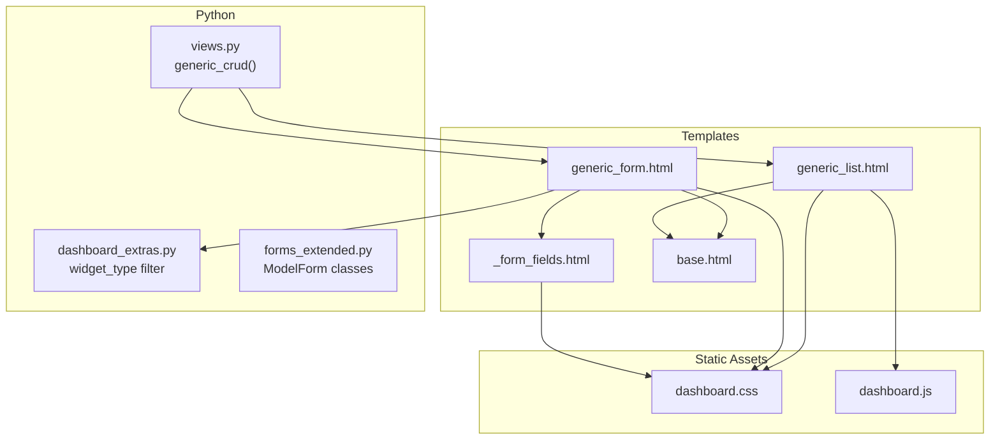
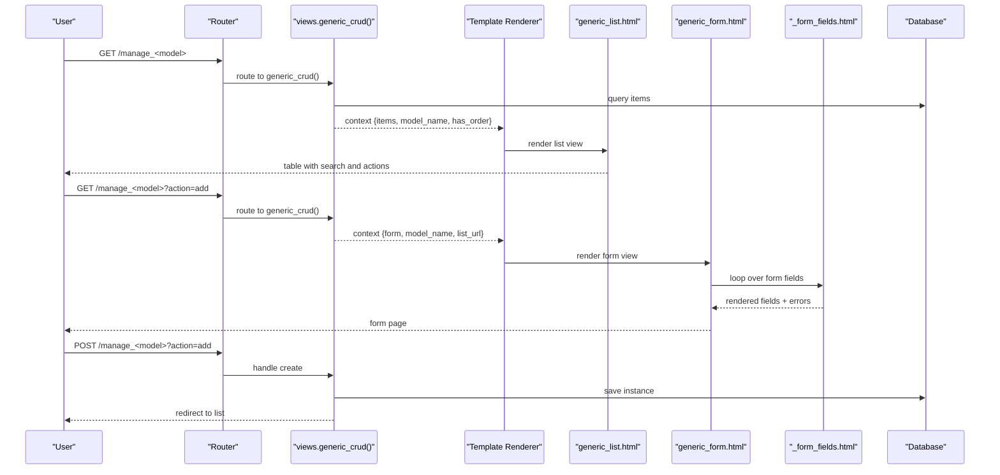
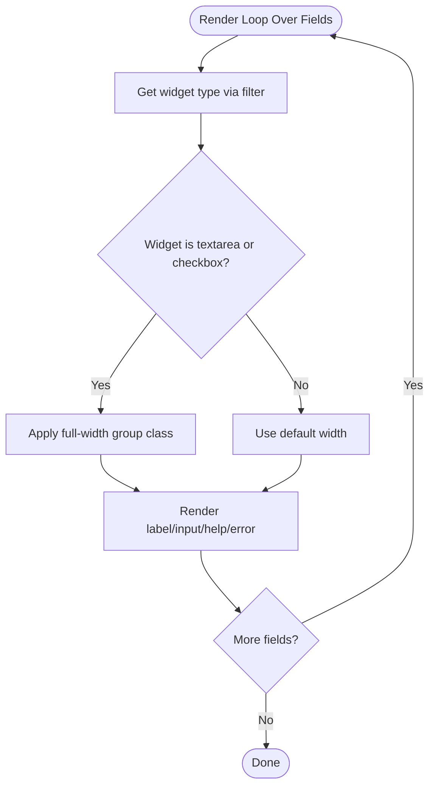
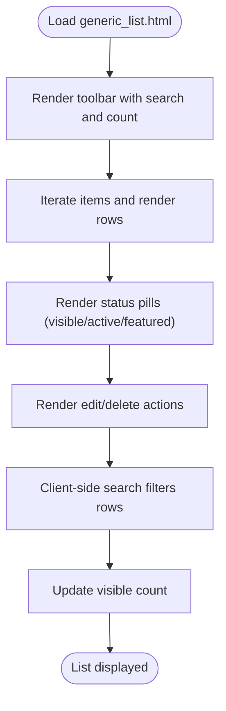
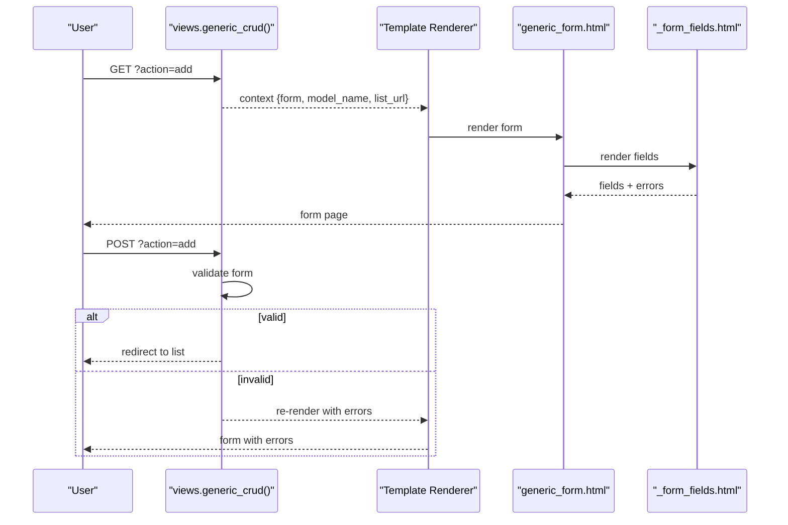
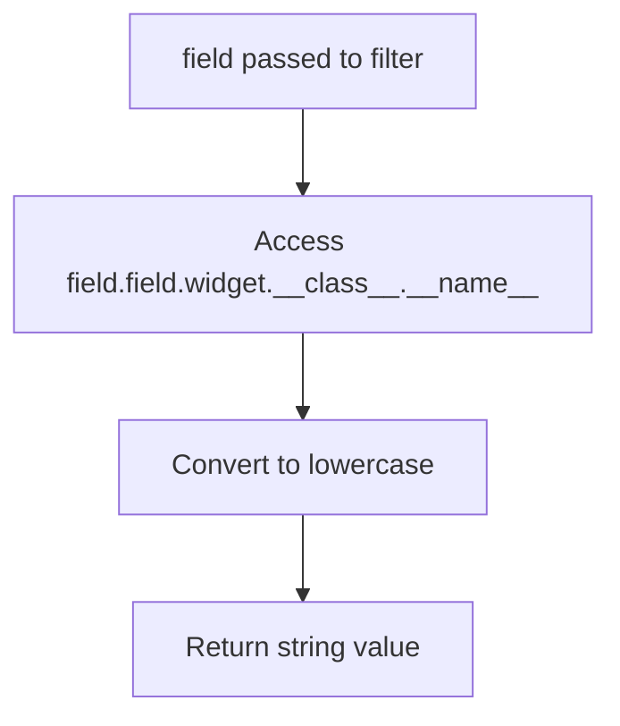
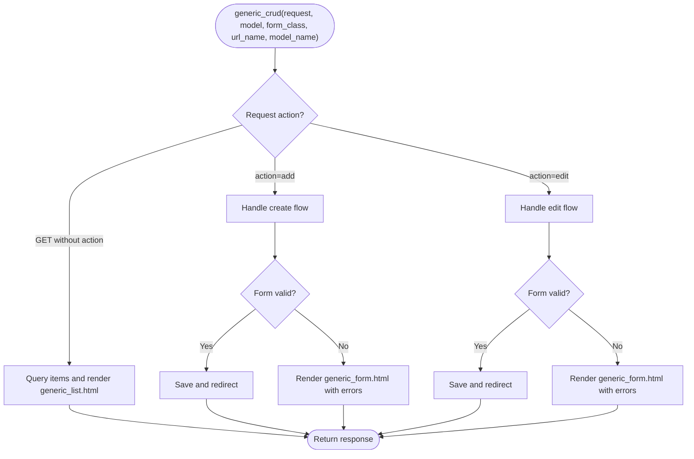
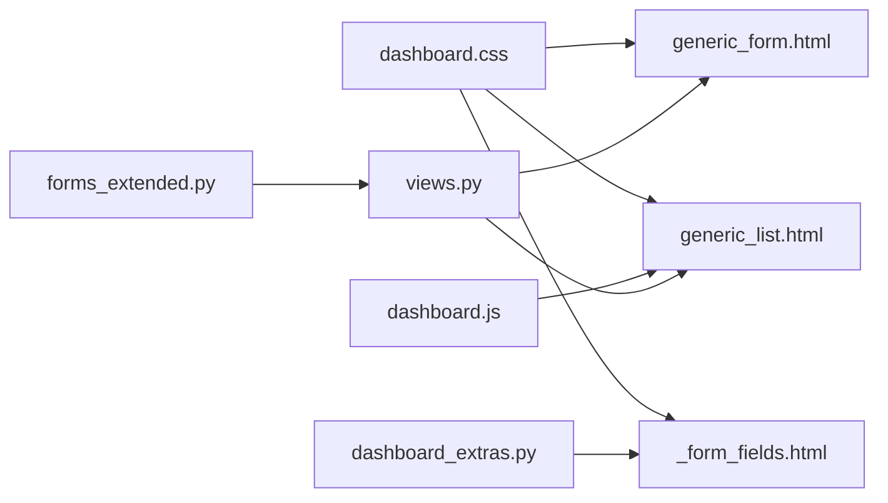

# Reusable Components

<cite>
**Referenced Files in This Document**
- [_form_fields.html](file://templates/dashboard/_form_fields.html)
- [generic_form.html](file://templates/dashboard/generic_form.html)
- [generic_list.html](file://templates/dashboard/generic_list.html)
- [dashboard_extras.py](file://portfolio/templatetags/dashboard_extras.py)
- [forms_extended.py](file://portfolio/forms_extended.py)
- [views.py](file://portfolio/views.py)
- [base.html](file://templates/dashboard/base.html)
- [dashboard.css](file://static/dashboard.css)
- [dashboard.js](file://static/dashboard.js)
</cite>

## Table of Contents
1. [Introduction](#introduction)
2. [Project Structure](#project-structure)
3. [Core Components](#core-components)
4. [Architecture Overview](#architecture-overview)
5. [Detailed Component Analysis](#detailed-component-analysis)
6. [Dependency Analysis](#dependency-analysis)
7. [Performance Considerations](#performance-considerations)
8. [Troubleshooting Guide](#troubleshooting-guide)
9. [Conclusion](#conclusion)

## Introduction
This document explains the reusable template components system used to render forms and lists consistently across the dashboard. It focuses on:
- The form field rendering component that dynamically generates fields, displays validation errors, and applies consistent styling.
- The generic list component for tabular data with client-side search and status indicators.
- The generic form component for consistent CRUD operations across models.
- Usage examples showing how to extend these components, customize behavior, and integrate them with Django forms.
- Performance optimization techniques and best practices for component composition.

## Project Structure
The reusable components are implemented as:
- Template partials for field rendering and generic pages.
- A custom template filter for widget type detection.
- Generic views that drive CRUD flows.
- CSS and JavaScript for shared UI behavior.

**Diagram sources**
- [generic_form.html:1-63](file://templates/dashboard/generic_form.html#L1-L63)
- [generic_list.html:1-81](file://templates/dashboard/generic_list.html#L1-L81)
- [_form_fields.html:1-25](file://templates/dashboard/_form_fields.html#L1-L25)
- [dashboard_extras.py:1-13](file://portfolio/templatetags/dashboard_extras.py#L1-L13)
- [views.py:126-180](file://portfolio/views.py#L126-L180)
- [dashboard.css:690-800](file://static/dashboard.css#L690-L800)
- [dashboard.js:133-175](file://static/dashboard.js#L133-L175)

**Section sources**
- [generic_form.html:1-63](file://templates/dashboard/generic_form.html#L1-L63)
- [generic_list.html:1-81](file://templates/dashboard/generic_list.html#L1-L81)
- [_form_fields.html:1-25](file://templates/dashboard/_form_fields.html#L1-L25)
- [dashboard_extras.py:1-13](file://portfolio/templatetags/dashboard_extras.py#L1-L13)
- [views.py:126-180](file://portfolio/views.py#L126-L180)
- [dashboard.css:690-800](file://static/dashboard.css#L690-L800)
- [dashboard.js:133-175](file://static/dashboard.js#L133-L175)

## Core Components
- Form Field Rendering Component: Renders each field from a Django form with dynamic layout adjustments, help text, required markers, and error messages.
- Generic List Component: Displays tabular records with toolbar search, status pills, and action links.
- Generic Form Component: Provides a consistent create/edit form page with CSRF protection, file upload support, and footer actions.

Key responsibilities:
- Consistent visual design via shared CSS classes.
- Reuse across many models through generic views.
- Client-side interactivity (search, confirm dialogs, theme).

**Section sources**
- [_form_fields.html:1-25](file://templates/dashboard/_form_fields.html#L1-L25)
- [generic_list.html:1-81](file://templates/dashboard/generic_list.html#L1-L81)
- [generic_form.html:1-63](file://templates/dashboard/generic_form.html#L1-L63)

## Architecture Overview
The system composes templates, Python logic, and static assets into a cohesive admin experience.

**Diagram sources**
- [views.py:126-180](file://portfolio/views.py#L126-L180)
- [generic_list.html:1-81](file://templates/dashboard/generic_list.html#L1-L81)
- [generic_form.html:1-63](file://templates/dashboard/generic_form.html#L1-L63)
- [_form_fields.html:1-25](file://templates/dashboard/_form_fields.html#L1-L25)

## Detailed Component Analysis

### Form Field Rendering Component
Purpose:
- Dynamically render all fields from a Django form.
- Apply full-width layout for textarea and checkbox inputs.
- Display help text and validation errors consistently.
- Mark required fields visually.

Behavior highlights:
- Uses a custom template filter to detect widget types.
- Adds a CSS class when a field has errors.
- Supports both standard labels and checkbox row layouts.

**Diagram sources**
- [_form_fields.html:1-25](file://templates/dashboard/_form_fields.html#L1-L25)
- [dashboard_extras.py:6-12](file://portfolio/templatetags/dashboard_extras.py#L6-L12)

Usage example:
- Include this partial inside any form to render its fields consistently.
- Works with any Django ModelForm by passing the form object.

Customization tips:
- Extend the widget type check to add special handling for additional widgets.
- Add conditional classes based on field attributes (e.g., readonly).
- Wrap errors in a tooltip or inline banner by adjusting the markup.

**Section sources**
- [_form_fields.html:1-25](file://templates/dashboard/_form_fields.html#L1-L25)
- [dashboard_extras.py:6-12](file://portfolio/templatetags/dashboard_extras.py#L6-L12)

### Generic List Component
Purpose:
- Display tabular data for a given model.
- Provide a toolbar with search input and count display.
- Show status pills and action links (edit, delete).

Features:
- Client-side search filters rows by text content.
- Conditional “Order” column if the model includes a display order field.
- Empty state guidance with an “Add” call-to-action.

**Diagram sources**
- [generic_list.html:1-81](file://templates/dashboard/generic_list.html#L1-L81)
- [dashboard.js:133-175](file://static/dashboard.js#L133-L175)

Integration notes:
- The view passes items, model_name, model_key, list_url, and has_order.
- Delete links use a URL name mapped in the view layer.

Extending the list:
- Add new columns by extending the template and corresponding context variables.
- Integrate server-side sorting/filtering by modifying the view’s queryset and passing extra context.

**Section sources**
- [generic_list.html:1-81](file://templates/dashboard/generic_list.html#L1-L81)
- [dashboard.js:133-175](file://static/dashboard.js#L133-L175)
- [views.py:126-180](file://portfolio/views.py#L126-L180)

### Generic Form Component
Purpose:
- Provide a unified create/edit form page.
- Handle CSRF and file uploads.
- Render fields using the same logic as the field partial.
- Present non-field errors and provide footer actions.

Workflow:
- Create mode shows “Create <Model>”.
- Edit mode shows “Save Changes” and pre-populates the form with the instance.
- On invalid submission, displays field-level and non-field errors.

**Diagram sources**
- [generic_form.html:1-63](file://templates/dashboard/generic_form.html#L1-L63)
- [_form_fields.html:1-25](file://templates/dashboard/_form_fields.html#L1-L25)
- [views.py:126-180](file://portfolio/views.py#L126-L180)

Usage example:
- Use the generic form template in your view context with a Django form instance.
- Ensure the form supports file uploads when needed by passing request.FILES.

Customization tips:
- Override the form template block to add section headers or grouping.
- Add conditional actions based on permissions or model state.

**Section sources**
- [generic_form.html:1-63](file://templates/dashboard/generic_form.html#L1-L63)
- [_form_fields.html:1-25](file://templates/dashboard/_form_fields.html#L1-L25)
- [views.py:126-180](file://portfolio/views.py#L126-L180)

### Custom Template Filter: Widget Type
Purpose:
- Expose the lowercased widget class name to templates.
- Enable conditional rendering based on widget type.

Implementation overview:
- Returns the widget class name in lowercase.
- Safely handles missing attributes.

**Diagram sources**
- [dashboard_extras.py:6-12](file://portfolio/templatetags/dashboard_extras.py#L6-L12)

**Section sources**
- [dashboard_extras.py:6-12](file://portfolio/templatetags/dashboard_extras.py#L6-L12)

### Generic CRUD View
Purpose:
- Centralize list, create, and edit flows for multiple models.
- Detect whether a model supports ordering and adjust list behavior accordingly.
- Provide consistent success messages and redirects.

Key behaviors:
- List: orders by display_order when available; otherwise by id.
- Create/Edit: validates form, saves, and redirects.
- Context: supplies model_name, model_key, list_url, has_order, and item when editing.

**Diagram sources**
- [views.py:126-180](file://portfolio/views.py#L126-L180)

**Section sources**
- [views.py:126-180](file://portfolio/views.py#L126-L180)

## Dependency Analysis
Component relationships and coupling:
- Templates depend on shared CSS classes and icons.
- Forms rely on Django’s form framework and ModelForms.
- Views orchestrate data access and template rendering.
- JavaScript enhances list search and user interactions.

**Diagram sources**
- [dashboard.css:690-800](file://static/dashboard.css#L690-L800)
- [dashboard.js:133-175](file://static/dashboard.js#L133-L175)
- [dashboard_extras.py:6-12](file://portfolio/templatetags/dashboard_extras.py#L6-L12)
- [forms_extended.py:1-78](file://portfolio/forms_extended.py#L1-L78)
- [views.py:126-180](file://portfolio/views.py#L126-L180)

**Section sources**
- [dashboard.css:690-800](file://static/dashboard.css#L690-L800)
- [dashboard.js:133-175](file://static/dashboard.js#L133-L175)
- [dashboard_extras.py:6-12](file://portfolio/templatetags/dashboard_extras.py#L6-L12)
- [forms_extended.py:1-78](file://portfolio/forms_extended.py#L1-L78)
- [views.py:126-180](file://portfolio/views.py#L126-L180)

## Performance Considerations
- Minimize template complexity: keep conditionals minimal and prefer helper filters for readability and reuse.
- Avoid heavy computations in templates; move logic to views or templatetags.
- Use efficient queries in views: select_related/prefetch_related where appropriate.
- Keep client-side search lightweight: current implementation filters DOM rows; for large datasets, consider server-side pagination and filtering.
- Defer non-critical JS: ensure initialization functions guard against missing elements to avoid unnecessary work.
- Cache repeated lookups: e.g., sidebar navigation items can be cached at the template level if needed.

[No sources needed since this section provides general guidance]

## Troubleshooting Guide
Common issues and resolutions:
- Fields not rendering:
  - Ensure the form object is passed to the template and that the template loads the correct template tags.
  - Verify the widget_type filter is available and correctly returns a string.
- Validation errors not shown:
  - Confirm that field.errors are present and that the template iterates over them.
  - Check that the form is re-rendered with the bound form after a failed POST.
- File uploads not working:
  - Ensure the form uses enctype="multipart/form-data".
  - Pass request.FILES to the form constructor in the view.
- List search not filtering:
  - Verify the table has the expected ID and the search input exists.
  - Check that the JavaScript initializes without errors.

**Section sources**
- [_form_fields.html:1-25](file://templates/dashboard/_form_fields.html#L1-L25)
- [generic_form.html:1-63](file://templates/dashboard/generic_form.html#L1-L63)
- [dashboard.js:133-175](file://static/dashboard.js#L133-L175)

## Conclusion
The reusable components system provides a consistent, extensible foundation for building forms and lists across the dashboard. By leveraging shared templates, a small set of helpers, and generic views, developers can rapidly implement CRUD interfaces while maintaining visual and behavioral consistency. Following the customization and performance recommendations will help scale the system effectively as new models and features are added.

[No sources needed since this section summarizes without analyzing specific files]